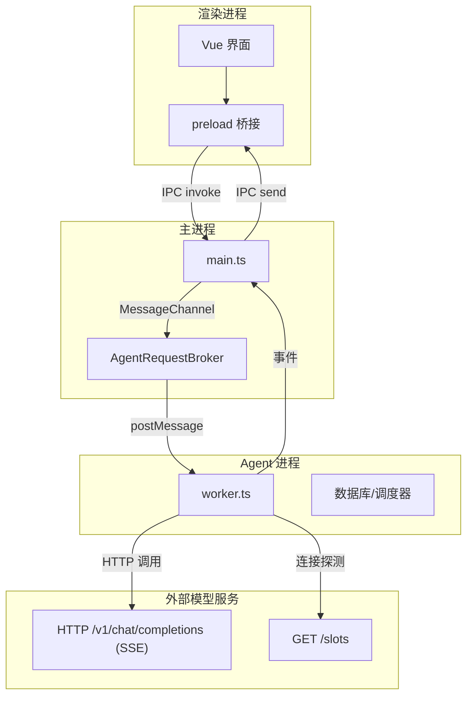
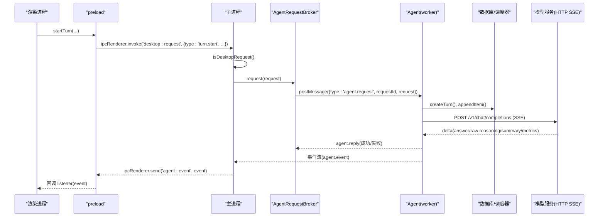
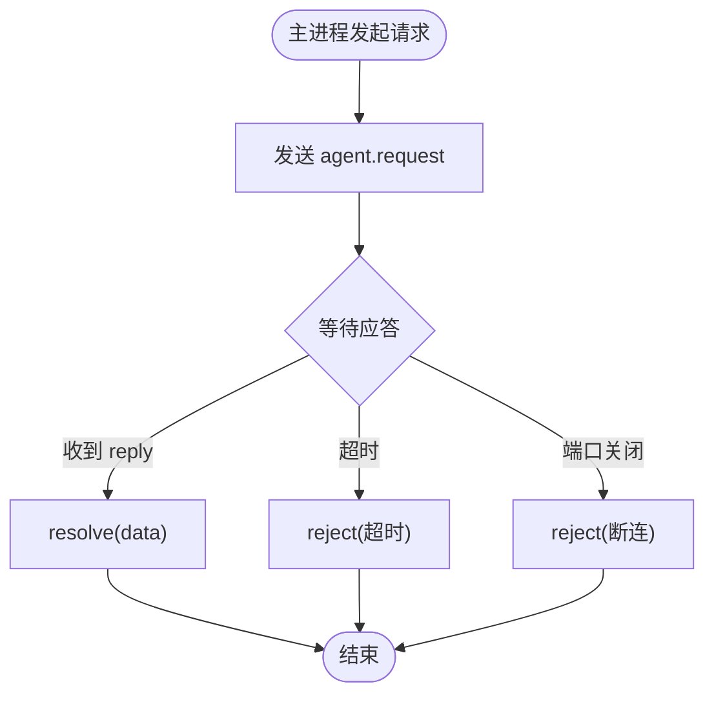
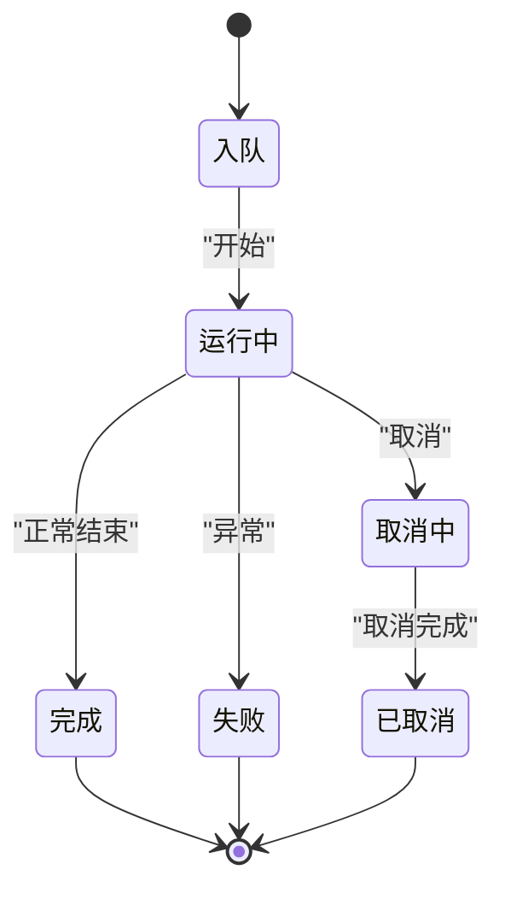
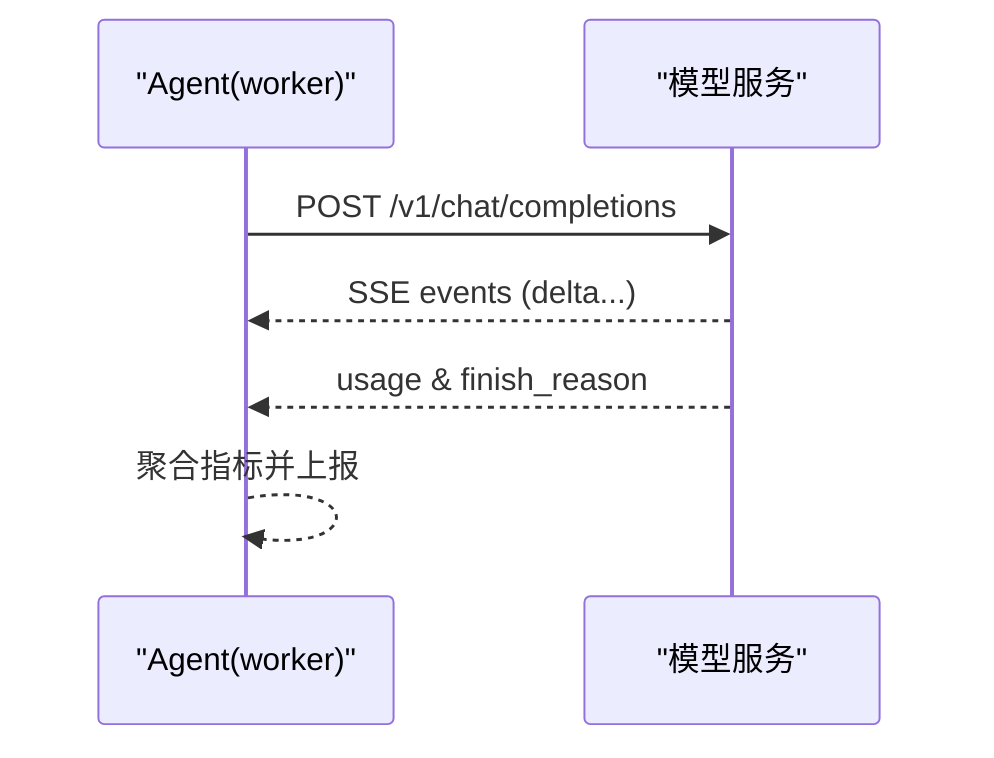

# API 和协议

<cite>
**本文引用的文件**
- [src/main.ts](file://src/main.ts)
- [src/preload.ts](file://src/preload.ts)
- [src/shared/protocol.ts](file://src/shared/protocol.ts)
- [src/shared/domain.ts](file://src/shared/domain.ts)
- [src/main/agentRequestBroker.ts](file://src/main/agentRequestBroker.ts)
- [src/agent/worker.ts](file://src/agent/worker.ts)
- [src/agentClient/core.ts](file://src/agentClient/core.ts)
- [src/shared/redaction.ts](file://src/shared/redaction.ts)
- [src/shared/operationErrors.ts](file://src/shared/operationErrors.ts)
- [tests/e2e/fakeModelServer.ts](file://tests/e2e/fakeModelServer.ts)
- [package.json](file://package.json)
</cite>

## 目录
1. [简介](#简介)
2. [项目结构](#项目结构)
3. [核心组件](#核心组件)
4. [架构总览](#架构总览)
5. [详细组件分析](#详细组件分析)
6. [依赖关系分析](#依赖关系分析)
7. [性能考虑](#性能考虑)
8. [故障排查指南](#故障排查指南)
9. [结论](#结论)
10. [附录：协议与错误码速查](#附录协议与错误码速查)

## 简介
本文件为 Private AI Desktop 的 IPC 协议与外部 API 文档，覆盖以下范围：
- 主进程与渲染进程之间的 IPC（Electron IPC）消息类型、请求/响应模式、事件订阅。
- 主进程与 Agent 进程之间的通信协议（MessageChannel + 自定义信封），包括请求-应答、超时、断连处理。
- 模型服务的外部 RESTful API（OpenAI 兼容流式接口）与连接探测端点。
- WebSocket 说明：本项目未实现内置 WebSocket 服务端；与模型服务的实时交互通过 HTTP Server-Sent Events（SSE）流式完成。
- 错误码规范、安全策略、速率限制、版本信息、常见用例与客户端实现要点。

## 项目结构
- 渲染进程通过 preload 暴露受限 API 给前端调用，使用 Electron IPC 向主进程发送请求并订阅事件。
- 主进程负责：
  - 接收渲染进程的 IPC 请求，校验后转发到 Agent 进程。
  - 维护与 Agent 进程的 MessageChannel 通道，封装请求-应答、超时、断连。
  - 将 Agent 进程的事件广播回渲染进程。
- Agent 进程是独立 UtilityProcess，负责业务执行（对话、工具、审批、数据库持久化等）。
- 共享层定义领域模型与协议类型，供多端复用。

**图表来源**
- [src/main.ts:1-170](file://src/main.ts#L1-L170)
- [src/preload.ts:1-32](file://src/preload.ts#L1-L32)
- [src/main/agentRequestBroker.ts:1-86](file://src/main/agentRequestBroker.ts#L1-L86)
- [src/agent/worker.ts:1-689](file://src/agent/worker.ts#L1-L689)
- [tests/e2e/fakeModelServer.ts:40-133](file://tests/e2e/fakeModelServer.ts#L40-L133)

**章节来源**
- [src/main.ts:1-170](file://src/main.ts#L1-L170)
- [src/preload.ts:1-32](file://src/preload.ts#L1-L32)
- [src/shared/protocol.ts:1-371](file://src/shared/protocol.ts#L1-L371)
- [src/shared/domain.ts:1-319](file://src/shared/domain.ts#L1-L319)

## 核心组件
- IPC 请求与事件：
  - 渲染进程通过 `desktop.*` 方法发起请求，统一走 `desktop:request` 通道。
  - 事件通过 `agent:event` 推送至渲染进程。
- Agent 请求代理：
  - 主进程使用 `AgentRequestBroker` 管理对 Agent 的请求，带 requestId、超时、断连重拒绝。
- Agent 工作线程：
  - 解析桌面请求，执行业务逻辑，返回结构化应答或错误。
  - 持续发出序列化的 Agent 事件（含 threadId、turnId、modelProfileId、sequence）。
- 客户端状态机：
  - 渲染侧基于事件逐步合并快照与增量，维护活跃 turn 的状态与内容流。

**章节来源**
- [src/preload.ts:5-31](file://src/preload.ts#L5-L31)
- [src/main/agentRequestBroker.ts:1-86](file://src/main/agentRequestBroker.ts#L1-L86)
- [src/agent/worker.ts:106-124](file://src/agent/worker.ts#L106-L124)
- [src/agentClient/core.ts:55-174](file://src/agentClient/core.ts#L55-L174)

## 架构总览
下图展示一次“开始对话”的端到端流程：渲染进程发起请求，主进程校验并转发到 Agent，Agent 创建 turn、调度执行、流式输出事件，主进程转发事件到渲染进程。

**图表来源**
- [src/preload.ts:15-17](file://src/preload.ts#L15-L17)
- [src/main.ts:103-108](file://src/main.ts#L103-L108)
- [src/main/agentRequestBroker.ts:33-52](file://src/main/agentRequestBroker.ts#L33-L52)
- [src/agent/worker.ts:307-441](file://src/agent/worker.ts#L307-L441)
- [tests/e2e/fakeModelServer.ts:47-103](file://tests/e2e/fakeModelServer.ts#L47-L103)

## 详细组件分析

### 渲染进程 IPC API（Electron IPC）
- 通道与方法
  - 健康检查：`desktop.health()` → 返回 `{ ok, version }`。
  - 数据快照：`desktop.getSnapshot()` → 返回应用快照。
  - 会话管理：`createGroup(name)`、`deleteGroup(groupId)`、`createThread(title, groupId?)`、`deleteThread(threadId)`、`setThreadModel(threadId, modelProfileId?)`。
  - 对话执行：`startTurn(threadId, text, modelProfileId?, attachments?)`、`cancelTurn(threadId, turnId)`。
  - 审批：`respondApproval(approvalId, approved)`。
  - 设置与模型配置：`setLanguage(language)`、`updateSettings(settings)`、`saveModelProfile(profile)`、`deleteModelProfile(id)`、`testModelProfile(profile)`。
  - 事件订阅：`subscribe(listener)` → 返回取消订阅函数。
- 传输格式
  - 所有写操作均通过 `ipcRenderer.invoke('desktop:request', payload)` 发送，payload 必须满足 `DesktopRequest` 类型校验。
  - 事件通过 `ipcRenderer.on('agent:event', handler)` 接收，类型为 `AgentEvent`。
- 认证与安全
  - 无网络鉴权；运行在本地 Electron 环境内，由上下文隔离与白名单暴露最小 API。
- 版本信息
  - 健康接口返回应用版本；模型连接测试可返回模型能力与槽位信息。

**章节来源**
- [src/preload.ts:5-31](file://src/preload.ts#L5-L31)
- [src/main.ts:98-108](file://src/main.ts#L98-L108)
- [src/shared/protocol.ts:22-65](file://src/shared/protocol.ts#L22-L65)
- [src/shared/domain.ts:87-94](file://src/shared/domain.ts#L87-L94)

### 主进程与 Agent 进程协议（MessageChannel）
- 请求-应答信封
  - 主进程发送：`{ type: 'agent.request', requestId, request }`。
  - Agent 回复：`{ type: 'agent.reply', requestId, ok, data? | error? }`。
- 超时与断连
  - 每个请求带超时时间（默认毫秒级），超时自动拒绝。
  - 端口关闭或替换时，挂起请求统一拒绝。
- 事件流
  - Agent 进程通过 `agent:event` 推送事件，包含顺序号 sequence，用于去重与排序。
- 初始化握手
  - 主进程启动 Agent 进程并通过 MessageChannel 传递数据库路径与应用版本，Agent 就绪后通知。

**图表来源**
- [src/main/agentRequestBroker.ts:33-84](file://src/main/agentRequestBroker.ts#L33-L84)
- [src/main.ts:19-54](file://src/main.ts#L19-L54)
- [src/agent/worker.ts:407-441](file://src/agent/worker.ts#L407-L441)

**章节来源**
- [src/main/agentRequestBroker.ts:1-86](file://src/main/agentRequestBroker.ts#L1-L86)
- [src/main.ts:19-54](file://src/main.ts#L19-L54)
- [src/agent/worker.ts:106-124](file://src/agent/worker.ts#L106-L124)

### Agent 进程内部处理
- 请求路由
  - 根据 `DesktopRequest.type` 分发到对应处理逻辑（如 snapshot、thread/group、turn、settings、workspace、model profile 等）。
- Turn 生命周期
  - 入队 → 开始 → 流式输出（answer/reasoning/tool/metrics）→ 完成/失败/取消。
  - 支持取消与审批流程（高风险操作需用户确认）。
- 数据持久化
  - 流式事件落库，保证崩溃恢复后可重建状态。
- 并发控制
  - 按模型配置的并发上限进行调度，避免过载。

**图表来源**
- [src/agent/worker.ts:170-221](file://src/agent/worker.ts#L170-L221)
- [src/agent/worker.ts:223-305](file://src/agent/worker.ts#L223-L305)
- [src/agent/worker.ts:307-404](file://src/agent/worker.ts#L307-L404)

**章节来源**
- [src/agent/worker.ts:106-124](file://src/agent/worker.ts#L106-L124)
- [src/agent/worker.ts:170-441](file://src/agent/worker.ts#L170-L441)

### 客户端状态机（渲染侧）
- 事件归并
  - 基于 sequence 去重与排序，增量更新快照中的消息、推理过程、工具输出。
- 运行时状态
  - 维护每个线程当前 turn 的运行状态（队列位置、开始/完成时间、错误信息等）。
- 乐观更新
  - 用户消息立即显示，后续以服务器快照为准进行合并。

**章节来源**
- [src/agentClient/core.ts:55-174](file://src/agentClient/core.ts#L55-L174)
- [src/agentClient/core.ts:293-380](file://src/agentClient/core.ts#L293-L380)
- [src/agentClient/core.ts:741-800](file://src/agentClient/core.ts#L741-L800)

### 外部 RESTful API（模型服务）
- 协议风格
  - OpenAI 兼容风格，使用 HTTP + SSE 流式响应。
- 端点
  - 聊天补全：POST `/v1/chat/completions`，返回 `text/event-stream`，逐条推送 delta。
  - 连接探测：GET `/slots`，返回可用槽位列表（用于并发检测）。
- 请求/响应
  - 请求体遵循 OpenAI 兼容格式（文本、图片附件等）。
  - 响应体为 SSE 事件流，包含 answer、reasoning raw/summary、usage 等字段。
- 错误处理
  - 401/403：凭据问题。
  - 404：模型不存在或 base URL 错误。
  - 429：速率限制。
  - 5xx：服务端错误。
  - 上下文超限：特定参数错误提示。
- 速率限制
  - 服务端可能返回 429；客户端应退避重试。
- 版本信息
  - 可通过模型列表接口获取模型标识；应用版本通过健康接口获取。

**图表来源**
- [tests/e2e/fakeModelServer.ts:47-103](file://tests/e2e/fakeModelServer.ts#L47-L103)
- [src/agent/modelProvider.ts:904-922](file://src/agent/modelProvider.ts#L904-L922)

**章节来源**
- [tests/e2e/fakeModelServer.ts:40-133](file://tests/e2e/fakeModelServer.ts#L40-L133)
- [src/agent/modelProvider.ts:904-964](file://src/agent/modelProvider.ts#L904-L964)

### WebSocket API 说明
- 本项目未实现 WebSocket 服务端。
- 实时交互通过 HTTP SSE（Server-Sent Events）实现，适用于单向流式数据推送。
- 若需双向实时通信，可在上层扩展 WebSocket 网关，但当前代码库不包含该实现。

[本节为概念性说明，不直接分析具体文件]

## 依赖关系分析
- 模块耦合
  - 渲染进程仅依赖 preload 暴露的 API，不直接访问 Node/Electron 内部。
  - 主进程集中处理 IPC 与 Agent 通道，职责清晰。
  - Agent 进程封装业务逻辑，对外只暴露结构化请求/事件。
- 外部依赖
  - 模型服务通过 HTTP/SSE 接入，错误与限流由模型提供方决定。
- 潜在循环依赖
  - 通过共享类型解耦，未见循环导入。

**图表来源**
- [src/preload.ts:5-31](file://src/preload.ts#L5-L31)
- [src/main.ts:1-170](file://src/main.ts#L1-L170)
- [src/main/agentRequestBroker.ts:1-86](file://src/main/agentRequestBroker.ts#L1-L86)
- [src/agent/worker.ts:1-689](file://src/agent/worker.ts#L1-L689)

**章节来源**
- [package.json:1-35](file://package.json#L1-L35)

## 性能考虑
- 流式处理
  - 使用 SSE 流式推送答案与推理片段，降低首字延迟。
- 并发控制
  - 按模型配置的并发上限调度 turn，避免资源争用。
- 状态合并
  - 客户端基于 sequence 增量合并，减少重绘与内存压力。
- 错误与重试
  - 针对 429 等限流错误，建议指数退避重试。
- 日志与脱敏
  - 错误信息脱敏，避免泄露密钥。

[本节提供通用指导，不直接分析具体文件]

## 故障排查指南
- 常见问题
  - 请求无效：主进程会拒绝非法 `DesktopRequest`。
  - Agent 未就绪：请求将被拒绝，稍后重试。
  - 超时：超过阈值仍未收到应答，视为超时。
  - 端口关闭：断连导致所有挂起请求被拒绝。
  - 模型服务错误：依据 HTTP 状态码分类处理（401/403/404/429/5xx）。
- 定位步骤
  - 检查健康接口是否返回版本。
  - 查看 Agent 事件流是否正常推送。
  - 核对模型服务连通性与凭据。
  - 审查错误信息是否包含敏感信息（已脱敏）。

**章节来源**
- [src/main.ts:103-108](file://src/main.ts#L103-L108)
- [src/main/agentRequestBroker.ts:33-84](file://src/main/agentRequestBroker.ts#L33-L84)
- [src/shared/redaction.ts:1-38](file://src/shared/redaction.ts#L1-L38)
- [src/shared/operationErrors.ts:1-6](file://src/shared/operationErrors.ts#L1-L6)

## 结论
本项目的 IPC 与外部 API 设计围绕“安全、可靠、可扩展”展开：
- 渲染进程通过最小暴露面与主进程通信，主进程集中校验与转发。
- Agent 进程作为业务执行中心，具备完整的 turn 生命周期管理与持久化。
- 外部模型服务采用 OpenAI 兼容的 HTTP/SSE 协议，便于集成与调试。
- 错误处理与脱敏机制保障安全性与可观测性。

[本节为总结性内容，不直接分析具体文件]

## 附录：协议与错误码速查

### IPC 请求类型（DesktopRequest）
- 快照：`snapshot.get`
- 群组：`group.create`、`group.delete`
- 会话：`thread.create`、`thread.delete`、`thread.setModel`
- 对话：`turn.start`、`turn.cancel`
- 审批：`approval.respond`
- 模型配置：`modelProfile.save`、`modelProfile.delete`、`modelProfile.test`
- 设置：`settings.update`、`language.set`、`theme.set`
- 工作区：`workspace.register`、`workspace.delete`

**章节来源**
- [src/shared/protocol.ts:22-39](file://src/shared/protocol.ts#L22-L39)

### Agent 事件类型（AgentEvent）
- 快照：`snapshot`
- 对话阶段：`turn.queued`、`turn.started`、`turn.cancelling`、`turn.completed`、`turn.failed`、`turn.cancelled`
- 内容流：`message.delta`、`answer.delta`、`reasoning.raw.delta`、`reasoning.summary.delta`
- 工具：`tool.started`、`tool.output`
- 进度与指标：`model.progress`、`model.metrics`
- 审批：`approval.required`

**章节来源**
- [src/shared/protocol.ts:41-65](file://src/shared/protocol.ts#L41-L65)

### 错误码与处理策略
- 401/403：凭据错误，检查模型配置中的 API Key。
- 404：模型或服务地址错误，检查 baseUrl 与 model。
- 429：速率限制，退避重试。
- 5xx：服务端错误，记录并告警。
- 上下文超限：缩短历史或新建会话。

**章节来源**
- [src/agent/modelProvider.ts:904-922](file://src/agent/modelProvider.ts#L904-L922)

### 安全与隐私
- 错误信息脱敏，避免泄露密钥。
- 渲染进程仅暴露必要 API，启用上下文隔离与沙箱。
- 工作区信任级别与网络策略受控。

**章节来源**
- [src/shared/redaction.ts:1-38](file://src/shared/redaction.ts#L1-L38)
- [src/main.ts:56-81](file://src/main.ts#L56-L81)

### 版本信息
- 应用版本：通过健康接口获取。
- 模型版本：通过模型列表或连接探测接口获取。

**章节来源**
- [src/main.ts:98-101](file://src/main.ts#L98-L101)
- [tests/e2e/fakeModelServer.ts:40-45](file://tests/e2e/fakeModelServer.ts#L40-L45)