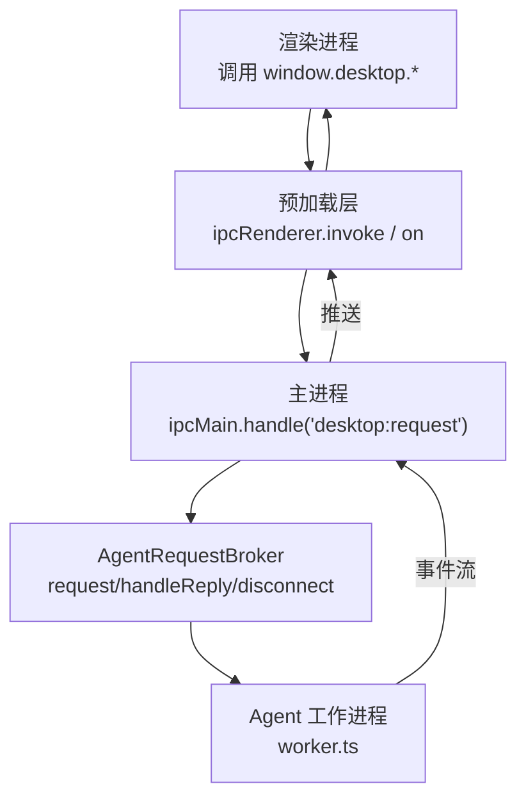
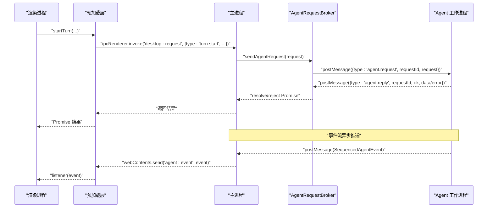
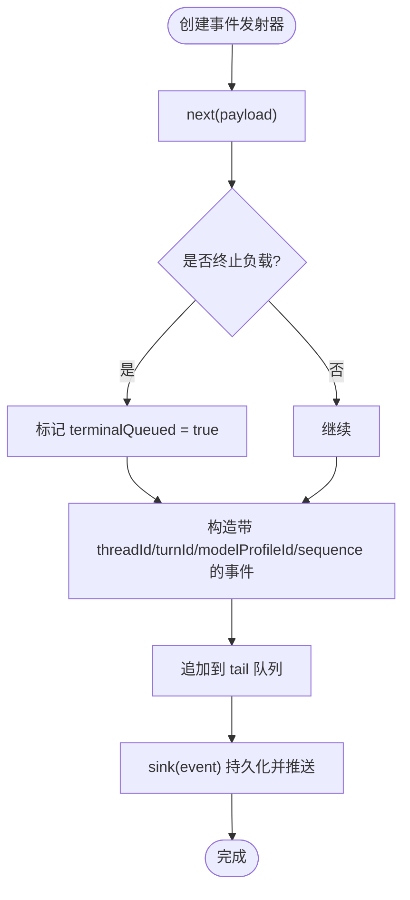
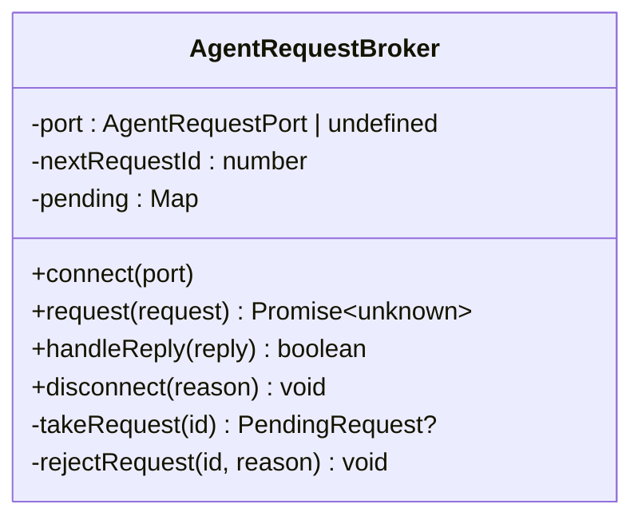
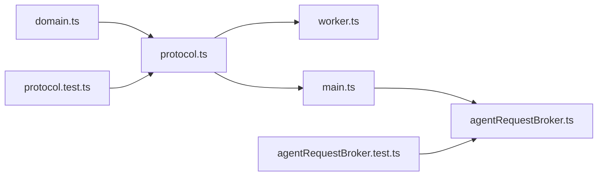

# IPC 通信协议

<cite>
**本文引用的文件**
- [src/shared/protocol.ts](file://src/shared/protocol.ts)
- [src/shared/domain.ts](file://src/shared/domain.ts)
- [src/preload.ts](file://src/preload.ts)
- [src/renderer/types.d.ts](file://src/renderer/types.d.ts)
- [src/main.ts](file://src/main.ts)
- [src/main/agentRequestBroker.ts](file://src/main/agentRequestBroker.ts)
- [src/agent/worker.ts](file://src/agent/worker.ts)
- [tests/protocol.test.ts](file://tests/protocol.test.ts)
- [tests/agentRequestBroker.test.ts](file://tests/agentRequestBroker.test.ts)
</cite>

## 目录
1. [简介](#简介)
2. [项目结构](#项目结构)
3. [核心组件](#核心组件)
4. [架构总览](#架构总览)
5. [详细组件分析](#详细组件分析)
6. [依赖关系分析](#依赖关系分析)
7. [性能考虑](#性能考虑)
8. [故障排查指南](#故障排查指南)
9. [结论](#结论)
10. [附录：类型与使用示例](#附录类型与使用示例)

## 简介
本文件为 Electron 桌面应用的 IPC 通信协议文档，覆盖以下范围：
- 渲染进程通过 preload 暴露的 desktop API 向主进程发起请求（IPC）
- 主进程将请求转发给 Agent 工作进程（子进程），并处理响应与事件
- DesktopRequest 的所有请求方法、参数格式与返回值约定
- SequencedAgentEvent 事件类型、触发时机与数据格式
- 序列号机制保证事件顺序性
- 错误处理与超时策略
- TypeScript 类型定义与实际使用场景的代码片段路径

## 项目结构
IPC 协议由共享类型定义、预加载桥接、主进程路由与代理、以及 Agent 工作进程共同实现。关键文件职责如下：
- src/shared/protocol.ts：定义 DesktopRequest、SequencedAgentEvent、AgentEvent 及校验守卫
- src/shared/domain.ts：定义领域模型（如 ModelProfileInput、ModelRunMetrics、TurnAttachment 等）
- src/preload.ts：在渲染进程暴露 desktop API，封装 ipcRenderer.invoke/on
- src/renderer/types.d.ts：声明 Window.desktop 的类型，供渲染端使用
- src/main.ts：注册 IPC 处理器，转发请求到 AgentRequestBroker，并将事件回推至渲染进程
- src/main/agentRequestBroker.ts：管理对 Agent 的请求/响应、超时与断连
- src/agent/worker.ts：Agent 工作进程入口，接收请求、执行任务、按序发送事件

图表来源
- [src/preload.ts:5-31](file://src/preload.ts#L5-L31)
- [src/main.ts:103-143](file://src/main.ts#L103-L143)
- [src/main/agentRequestBroker.ts:33-63](file://src/main/agentRequestBroker.ts#L33-L63)
- [src/agent/worker.ts:111-123](file://src/agent/worker.ts#L111-L123)

章节来源
- [src/shared/protocol.ts:22-65](file://src/shared/protocol.ts#L22-L65)
- [src/preload.ts:5-31](file://src/preload.ts#L5-L31)
- [src/main.ts:103-143](file://src/main.ts#L103-L143)
- [src/main/agentRequestBroker.ts:15-85](file://src/main/agentRequestBroker.ts#L15-L85)
- [src/agent/worker.ts:111-123](file://src/agent/worker.ts#L111-L123)

## 核心组件
- 请求类型与校验：DesktopRequest 及其 isDesktopRequest 守卫
- 事件类型与校验：AgentEvent、SequencedAgentEvent 及其 isAgentEvent 守卫
- 请求代理：AgentRequestBroker，负责请求 ID、超时、断连清理
- 预加载桥接：preload 暴露 desktop API，统一封装 IPC 调用与事件订阅
- 主进程路由：main.ts 中 'desktop:request' 处理器与 'agent:event' 推送
- Agent 工作进程：worker.ts 中的事件生成与序列化发送

章节来源
- [src/shared/protocol.ts:22-65](file://src/shared/protocol.ts#L22-L65)
- [src/main/agentRequestBroker.ts:15-85](file://src/main/agentRequestBroker.ts#L15-L85)
- [src/preload.ts:5-31](file://src/preload.ts#L5-L31)
- [src/main.ts:103-143](file://src/main.ts#L103-L143)
- [src/agent/worker.ts:128-153](file://src/agent/worker.ts#L128-L153)

## 架构总览
IPC 通信分为两条通道：
- 请求通道：渲染进程 -> 主进程 -> Agent 工作进程 -> 返回响应
- 事件通道：Agent 工作进程 -> 主进程 -> 渲染进程（推送）

图表来源
- [src/preload.ts:15-16](file://src/preload.ts#L15-L16)
- [src/main.ts:103-108](file://src/main.ts#L103-L108)
- [src/main/agentRequestBroker.ts:33-51](file://src/main/agentRequestBroker.ts#L33-L51)
- [src/main.ts:135-143](file://src/main.ts#L135-L143)
- [src/agent/worker.ts:111-123](file://src/agent/worker.ts#L111-L123)

## 详细组件分析

### 请求类型 DesktopRequest
- 支持的操作包括：
  - snapshot.get：获取应用快照
  - group.create / group.delete：群组创建/删除
  - thread.create / thread.delete / thread.setModel：会话创建/删除/设置模型配置
  - turn.start / turn.cancel：开始/取消一轮对话
  - approval.respond：审批响应
  - modelProfile.save / modelProfile.delete / modelProfile.test：模型配置保存/删除/测试连接
  - settings.update：运行时设置更新
  - workspace.register / workspace.delete：工作区注册/删除
  - language.set / theme.set：语言/主题设置
- 字段校验规则由 isDesktopRequest 严格限定，例如：
  - turn.start 必须包含 threadId 与 text，可选 modelProfileId 与 attachments
  - modelProfile.save/test 的 profile 需满足 ModelProfileInput 约束（名称、provider、baseUrl、model 等）
  - settings.update 的 settings 需满足 RuntimeSettingsInput 约束（上下文消息上限、显示模式等）

章节来源
- [src/shared/protocol.ts:22-39](file://src/shared/protocol.ts#L22-L39)
- [src/shared/protocol.ts:274-316](file://src/shared/protocol.ts#L274-L316)
- [src/shared/domain.ts:124-192](file://src/shared/domain.ts#L124-L192)
- [tests/protocol.test.ts:4-89](file://tests/protocol.test.ts#L4-L89)

### 事件类型 SequencedAgentEvent
- 所有与“轮次”相关的事件都携带 threadId、turnId、modelProfileId、sequence，用于跨进程排序与关联
- 事件类型包括：
  - turn.queued：进入队列，附带 queuePosition
  - turn.started：开始执行，附带 title
  - message.delta / answer.delta / reasoning.raw.delta / reasoning.summary.delta：增量文本
  - model.progress：模型运行阶段（connecting/compressing/reasoning/answering）
  - tool.started / tool.output：工具调用生命周期
  - model.metrics：模型运行指标（durationMs、tokens、速度来源等）
  - approval.required：需要用户审批
  - turn.cancelling / turn.completed / turn.failed / turn.cancelled：轮次状态变更
- 校验规则由 isAgentEvent 严格限定，确保字段存在性与取值合法

章节来源
- [src/shared/protocol.ts:41-65](file://src/shared/protocol.ts#L41-L65)
- [src/shared/protocol.ts:318-370](file://src/shared/protocol.ts#L318-L370)
- [tests/protocol.test.ts:275-352](file://tests/protocol.test.ts#L275-L352)

### 序列号机制与事件顺序性
- 每个轮次内的事件通过 sequence 递增编号，从 1 开始
- createTurnEventEmitter 维护 tail 队列，确保事件按序串行投递，即使底层 sink 失败也会继续后续事件
- 事件在持久化后推送，保证可追溯与顺序一致

图表来源
- [src/agent/worker.ts:128-153](file://src/agent/worker.ts#L128-L153)

章节来源
- [src/agent/worker.ts:128-153](file://src/agent/worker.ts#L128-L153)

### 请求代理与超时处理
- AgentRequestBroker 为每个请求分配唯一 requestId，并在 pending Map 中记录 resolve/reject 与定时器
- 若未在 deadlineMs 内收到 agent.reply，则拒绝并清理
- 当端口断开或替换时，disconnect 会拒绝所有待处理请求
- 主进程根据消息类型区分回复与事件：agent.reply 走 Broker，其他事件推送至渲染进程

图表来源
- [src/main/agentRequestBroker.ts:15-85](file://src/main/agentRequestBroker.ts#L15-L85)

章节来源
- [src/main/agentRequestBroker.ts:33-71](file://src/main/agentRequestBroker.ts#L33-L71)
- [src/main.ts:135-143](file://src/main.ts#L135-L143)
- [tests/agentRequestBroker.test.ts:8-37](file://tests/agentRequestBroker.test.ts#L8-L37)

### 主进程路由与事件推送
- 渲染进程通过 ipcRenderer.invoke('desktop:request', request) 发送请求
- 主进程校验请求合法性后，交由 sendAgentRequest 委托给 AgentRequestBroker
- Agent 事件到达主进程后，通过 webContents.send('agent:event', event) 推送给渲染进程

章节来源
- [src/main.ts:103-108](file://src/main.ts#L103-L108)
- [src/main.ts:135-143](file://src/main.ts#L135-L143)

### 预加载桥接与渲染端类型
- preload 暴露 desktop API，封装所有请求方法与事件订阅
- renderer/types.d.ts 声明 Window.desktop 的方法签名，便于 TS 类型检查与 IDE 提示

章节来源
- [src/preload.ts:5-31](file://src/preload.ts#L5-L31)
- [src/renderer/types.d.ts:17-39](file://src/renderer/types.d.ts#L17-L39)

## 依赖关系分析
- protocol.ts 依赖 domain.ts 中的领域类型（如 ModelProfileInput、ModelRunMetrics、TurnAttachment 等）
- main.ts 依赖 agentRequestBroker.ts 进行请求调度
- worker.ts 依赖 protocol.ts 的事件类型与 domain.ts 的数据模型
- tests/* 验证协议守卫与 Broker 行为

图表来源
- [src/shared/protocol.ts:1-19](file://src/shared/protocol.ts#L1-L19)
- [src/main.ts:103-143](file://src/main.ts#L103-L143)
- [src/agent/worker.ts:1-24](file://src/agent/worker.ts#L1-L24)
- [tests/protocol.test.ts:1-3](file://tests/protocol.test.ts#L1-L3)
- [tests/agentRequestBroker.test.ts:1-6](file://tests/agentRequestBroker.test.ts#L1-L6)

章节来源
- [src/shared/protocol.ts:1-19](file://src/shared/protocol.ts#L1-L19)
- [src/main.ts:103-143](file://src/main.ts#L103-L143)
- [src/agent/worker.ts:1-24](file://src/agent/worker.ts#L1-L24)
- [tests/protocol.test.ts:1-3](file://tests/protocol.test.ts#L1-L3)
- [tests/agentRequestBroker.test.ts:1-6](file://tests/agentRequestBroker.test.ts#L1-L6)

## 性能考虑
- 事件按序串行投递，避免 UI 抖动与乱序显示
- Broker 使用 Map 存储待处理请求，O(1) 查找与清理
- 超时保护防止内存泄漏与悬挂 Promise
- 模型运行指标事件提供吞吐与时延信息，可用于前端节流与展示优化

[本节为通用指导，不直接分析具体文件]

## 故障排查指南
- 请求未返回：检查 Agent 是否就绪（broker.pendingCount）、是否发生超时（deadlineMs）
- 事件丢失：确认 createTurnEventEmitter 的 sink 是否成功持久化与推送；检查主进程是否收到并转发 'agent:event'
- 断连处理：当端口关闭或替换，Broker.disconnect 会拒绝所有待处理请求，渲染端应捕获错误并提示重试
- 非法请求：isDesktopRequest/isAgentEvent 会拒绝不符合类型的消息，检查字段与取值

章节来源
- [src/main/agentRequestBroker.ts:33-71](file://src/main/agentRequestBroker.ts#L33-L71)
- [src/main.ts:135-143](file://src/main.ts#L135-L143)
- [tests/agentRequestBroker.test.ts:8-37](file://tests/agentRequestBroker.test.ts#L8-L37)

## 结论
该 IPC 协议通过严格的类型守卫、有序事件序列与可靠的请求代理，实现了渲染进程与 Agent 工作进程之间的高内聚、低耦合通信。遵循本文档的类型与流程约定，可确保系统稳定性与可观测性。

[本节为总结，不直接分析具体文件]

## 附录：类型与使用示例

### DesktopRequest 方法清单与参数/返回值
- snapshot.get：无参；返回 AppSnapshot
- group.create(name)：name 字符串；返回 ChatGroup
- group.delete(groupId)：groupId 字符串；返回 void
- thread.create(title, groupId?)：title 字符串，groupId 可选；返回 ThreadSummary
- thread.delete(threadId)：threadId 字符串；返回 void
- thread.setModel(threadId, modelProfileId?)：threadId 字符串，modelProfileId 可选；返回 void
- turn.start(threadId, text, modelProfileId?, attachments?)：text 必填，attachments 为 TurnAttachment[]；返回 { turnId }
- turn.cancel(threadId, turnId)：返回 boolean
- approval.respond(approvalId, approved)：返回 boolean | void
- modelProfile.save(profile)：profile 为 ModelProfileInput；返回 ModelProfile
- modelProfile.delete(id)：id 字符串；返回 void
- modelProfile.test(profile)：返回 ModelConnectionResult
- settings.update(settings)：settings 为 RuntimeSettingsInput；返回 AppSettings
- workspace.register(path, trustLevel)：返回 void
- workspace.delete(workspaceId)：返回 void
- language.set(language)：language 为 LanguagePreference；返回 void
- theme.set(theme)：theme 为 ThemePreference；返回 void

章节来源
- [src/preload.ts:5-31](file://src/preload.ts#L5-L31)
- [src/renderer/types.d.ts:17-39](file://src/renderer/types.d.ts#L17-L39)
- [src/shared/domain.ts:7-22](file://src/shared/domain.ts#L7-L22)
- [src/shared/domain.ts:160-192](file://src/shared/domain.ts#L160-L192)
- [src/shared/domain.ts:238-257](file://src/shared/domain.ts#L238-L257)

### SequencedAgentEvent 事件清单与触发时机
- turn.queued：进入队列时触发，queuePosition 为正整数
- turn.started：开始执行时触发，title 为字符串
- message.delta / answer.delta / reasoning.raw.delta / reasoning.summary.delta：流式增量文本，text 为字符串
- model.progress：模型运行阶段变化，phase 为枚举值
- tool.started / tool.output：工具调用开始与输出
- model.metrics：一轮运行结束后上报指标
- approval.required：需要用户审批时触发
- turn.cancelling / turn.completed / turn.failed / turn.cancelled：轮次状态变更

章节来源
- [src/shared/protocol.ts:41-65](file://src/shared/protocol.ts#L41-L65)
- [src/shared/protocol.ts:318-370](file://src/shared/protocol.ts#L318-L370)

### TypeScript 类型定义示例（路径引用）
- DesktopRequest 与 SequencedAgentEvent 定义：[src/shared/protocol.ts:22-65](file://src/shared/protocol.ts#L22-L65)
- 领域类型（ModelProfileInput、ModelRunMetrics、TurnAttachment 等）：[src/shared/domain.ts:124-192](file://src/shared/domain.ts#L124-L192), [src/shared/domain.ts:238-257](file://src/shared/domain.ts#L238-L257), [src/shared/domain.ts:43-49](file://src/shared/domain.ts#L43-L49)
- 渲染端 Window.desktop 类型声明：[src/renderer/types.d.ts:17-39](file://src/renderer/types.d.ts#L17-L39)

### 实际使用场景代码片段（路径引用）
- 渲染端调用 startTurn 与订阅事件：[src/preload.ts:15-16](file://src/preload.ts#L15-L16), [src/preload.ts:26-30](file://src/preload.ts#L26-L30)
- 主进程路由与事件推送：[src/main.ts:103-108](file://src/main.ts#L103-L108), [src/main.ts:135-143](file://src/main.ts#L135-L143)
- Broker 超时与断连处理：[src/main/agentRequestBroker.ts:33-71](file://src/main/agentRequestBroker.ts#L33-L71)
- 事件序列号与顺序保证：[src/agent/worker.ts:128-153](file://src/agent/worker.ts#L128-L153)