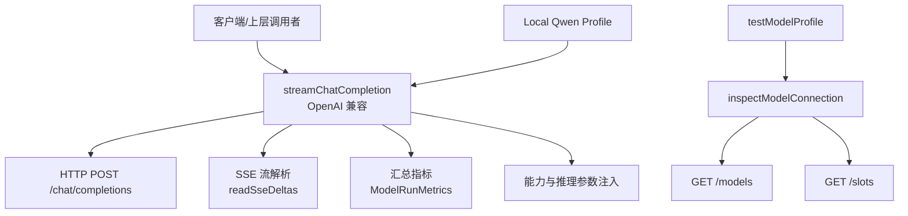
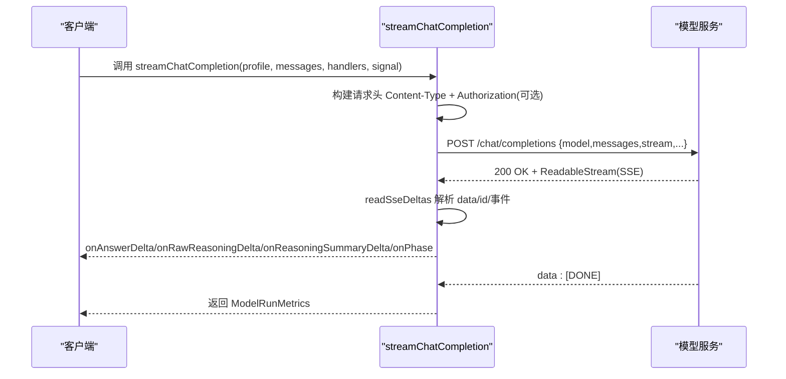
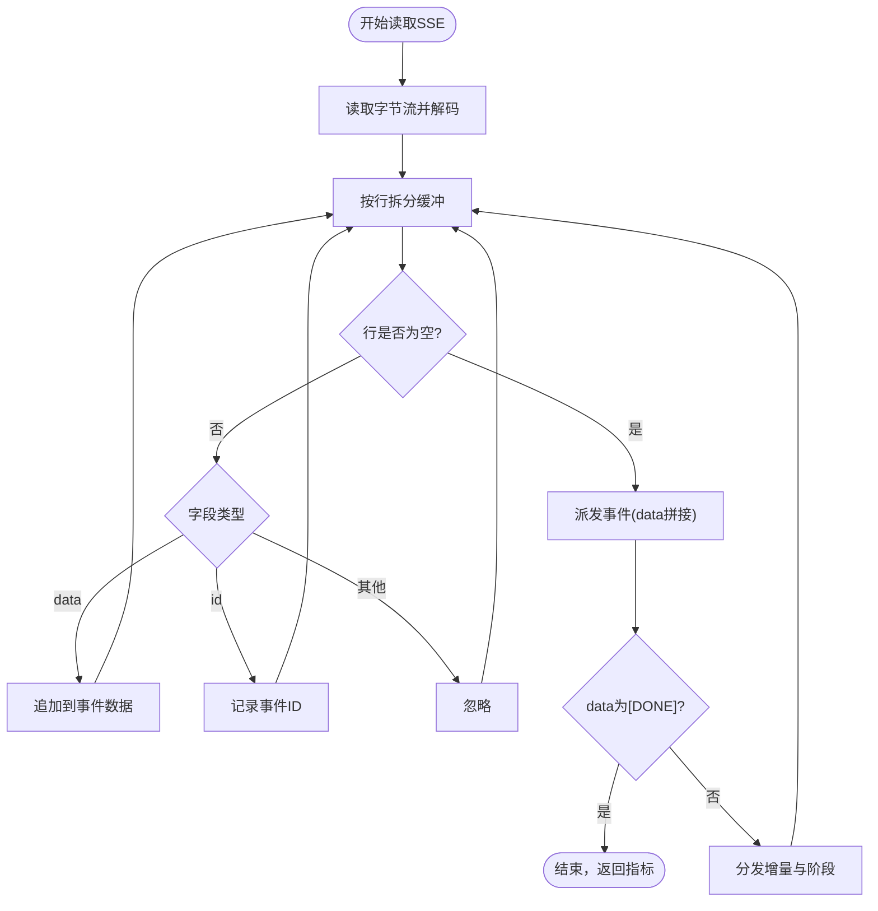
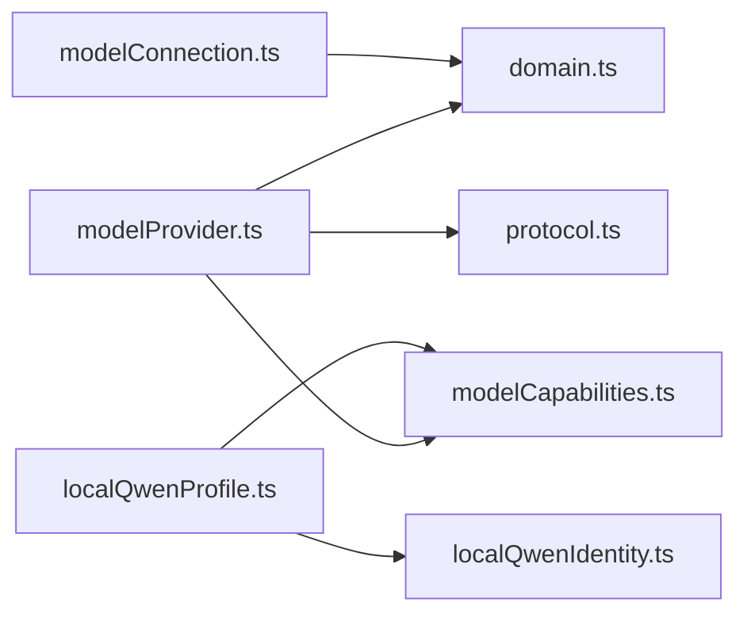

# 外部 API 接口

<cite>
**本文引用的文件**
- [modelProvider.ts](file://src/agent/modelProvider.ts)
- [modelConnection.ts](file://src/agent/modelConnection.ts)
- [protocol.ts](file://src/shared/protocol.ts)
- [domain.ts](file://src/shared/domain.ts)
- [localQwenIdentity.ts](file://src/shared/localQwenIdentity.ts)
- [localQwenProfile.ts](file://src/agent/localQwenProfile.ts)
- [modelCapabilities.ts](file://src/agent/modelCapabilities.ts)
- [modelProvider.test.ts](file://tests/modelProvider.test.ts)
</cite>

## 目录
1. [简介](#简介)
2. [项目结构](#项目结构)
3. [核心组件](#核心组件)
4. [架构总览](#架构总览)
5. [详细组件分析](#详细组件分析)
6. [依赖关系分析](#依赖关系分析)
7. [性能考虑](#性能考虑)
8. [故障排查指南](#故障排查指南)
9. [结论](#结论)
10. [附录](#附录)

## 简介
本文件面向外部集成方，说明本项目中“OpenAI 兼容”的聊天完成接口调用方式、流式响应处理、本地 Qwen 模型直连配置、模型能力检测 API 的使用方法、错误码规范与性能优化建议，并提供客户端集成与调试技巧。所有实现细节均基于代码库中的实际逻辑进行归纳与提炼。

## 项目结构
- OpenAI 兼容聊天完成与流式解析：由 agent 层的 modelProvider 负责发起请求、构建请求体、解析 SSE 流并汇总指标。
- 连接探测与能力校验：modelConnection 通过 /models 与 /slots 端点验证服务可用性、并发槽位匹配。
- 协议与领域模型：shared/protocol.ts 与 shared/domain.ts 定义消息类型、事件、能力描述、运行指标等。
- 本地 Qwen 直连：shared/localQwenIdentity.ts 提供默认 baseUrl 与模型名；agent/localQwenProfile.ts 生成内置 profile。
- 能力声明：agent/modelCapabilities.ts 提供 qwen/openai 能力模板与归一化逻辑。

图表来源
- [modelProvider.ts:55-197](file://src/agent/modelProvider.ts#L55-L197)
- [modelProvider.ts:563-680](file://src/agent/modelProvider.ts#L563-L680)
- [modelProvider.ts:762-828](file://src/agent/modelProvider.ts#L762-L828)
- [modelConnection.ts:11-91](file://src/agent/modelConnection.ts#L11-L91)
- [localQwenIdentity.ts:1-21](file://src/shared/localQwenIdentity.ts#L1-L21)
- [localQwenProfile.ts:13-25](file://src/agent/localQwenProfile.ts#L13-L25)

章节来源
- [modelProvider.ts:55-197](file://src/agent/modelProvider.ts#L55-L197)
- [modelConnection.ts:11-91](file://src/agent/modelConnection.ts#L11-L91)
- [localQwenIdentity.ts:1-21](file://src/shared/localQwenIdentity.ts#L1-L21)
- [localQwenProfile.ts:13-25](file://src/agent/localQwenProfile.ts#L13-L25)

## 核心组件
- OpenAI 兼容聊天完成：POST /chat/completions，支持流式响应（SSE），自动重试以兼容部分服务端对 usage 字段的支持差异。
- 连接探测：GET /models 与 GET /slots，用于验证服务可用性与并发槽位一致性。
- 本地 Qwen 直连：默认 baseUrl 为 http://127.0.0.1:8080/v1，模型名为 Qwen3.5-9B，provider 为 openai-compatible。
- 能力检测：通过能力模板与归一化函数声明文本、视觉、长上下文、推理模式、并发限制、流式与用量上报能力。

章节来源
- [modelProvider.ts:762-828](file://src/agent/modelProvider.ts#L762-L828)
- [modelConnection.ts:11-91](file://src/agent/modelConnection.ts#L11-L91)
- [localQwenIdentity.ts:1-21](file://src/shared/localQwenIdentity.ts#L1-L21)
- [modelCapabilities.ts:14-43](file://src/agent/modelCapabilities.ts#L14-L43)

## 架构总览
下图展示了从客户端到模型服务的完整调用链路，包括请求头设置、认证、SSE 流式解析、阶段推进与指标汇总。

图表来源
- [modelProvider.ts:55-197](file://src/agent/modelProvider.ts#L55-L197)
- [modelProvider.ts:563-680](file://src/agent/modelProvider.ts#L563-L680)
- [modelProvider.ts:762-828](file://src/agent/modelProvider.ts#L762-L828)

## 详细组件分析

### OpenAI 兼容聊天完成接口
- HTTP 方法与 URL
  - 方法：POST
  - 路径：{baseUrl}/chat/completions
  - baseUrl 来自模型配置（例如本地 Qwen 为 http://127.0.0.1:8080/v1）
- 请求头
  - Content-Type: application/json
  - Authorization: Bearer {apiKey}（当配置了 apiKey 时）
- 请求体关键字段
  - model：字符串，必填
  - messages：数组，角色包含 system/user/assistant，内容可为字符串或图文混合
  - stream：true（始终启用流式）
  - temperature：固定为 0.2
  - max_tokens：取自配置的 maxOutputTokens
  - stream_options.include_usage：当能力声明支持 tokens 用量上报时附带
  - 推理相关：
    - chat_template_kwargs.enable_thinking：当能力 inputMode 为 toggle 且推理未禁用时注入
    - reasoning_effort：当能力 inputMode 为 effort 且推理未禁用时注入
    - customRequestBody：当能力 inputMode 为 custom 时合并（不覆盖 model/messages/stream）
- 流式响应（SSE）
  - 服务端以 ReadableStream 推送 SSE 数据块
  - 客户端按行解析 field:value，收集 data 与 id
  - 支持重复 id 去重与冲突检测
  - 结束标记：data: [DONE]
  - 事件载荷示例（JSON）：
    - choices[0].delta.content：答案增量
    - choices[0].delta.reasoning_content 或 reasoning：原始推理增量
    - choices[0].delta.reasoning_summary：推理摘要增量
    - choices[0].finish_reason：结束原因
    - usage.prompt_tokens/completion_tokens/total_tokens：用量
    - usage.completion_tokens_details.reasoning_tokens：推理用量
    - timings.predicted_per_second：服务端吞吐
- 阶段推进
  - 首次收到推理增量时进入 reasoning 阶段
  - 首次收到答案增量时进入 answering 阶段
- 自动重试与兼容性
  - 若首次请求携带 include_usage 被拒绝（400/422 且参数/代码指向 stream_options/include_usage），则不带 usage 重试一次
- 超时与取消
  - 根据 maxOutputTokens 与是否启用推理计算默认超时上限
  - 支持 AbortSignal 取消与超时信号联动
- 错误映射
  - 401/403：凭证问题
  - 404：URL/模型配置错误
  - 429：限流
  - 5xx：服务端错误
  - 413 或特定 code/type/param：上下文超限，提示新建对话或降低历史长度

章节来源
- [modelProvider.ts:55-197](file://src/agent/modelProvider.ts#L55-L197)
- [modelProvider.ts:563-680](file://src/agent/modelProvider.ts#L563-L680)
- [modelProvider.ts:762-828](file://src/agent/modelProvider.ts#L762-L828)
- [modelProvider.ts:847-898](file://src/agent/modelProvider.ts#L847-L898)
- [modelProvider.ts:900-1008](file://src/agent/modelProvider.ts#L900-L1008)

#### 流式解析流程图

图表来源
- [modelProvider.ts:563-680](file://src/agent/modelProvider.ts#L563-L680)

### 模型能力检测与连接探测
- 能力检测
  - 通过能力模板与归一化函数声明文本、视觉、长上下文、推理模式、并发限制、流式与用量上报能力
  - 本地 Qwen 能力：text=true, vision=true, longContext=false, reasoning.inputMode='toggle', streaming=true, usage.tokens/reasoningTokens=true
  - OpenAI 兼容能力：text=true, vision=false, longContext=false, reasoning.inputMode='effort'（可配置 effortOptions），streaming=true, usage.tokens/reasoningTokens=true
- 连接探测
  - GET {baseUrl}/models：返回 data 数组，每个元素含 id 字段；需包含当前配置的 model
  - GET {origin}/slots：返回槽位列表；用于校验服务并发槽位是否与客户端期望一致
  - 结果状态：
    - connected：服务在线且槽位匹配
    - concurrency-warning：服务在线但槽位数量与客户端并发不一致
    - slots-unverified：无法验证槽位
    - offline：不可达或 HTTP 非 2xx
    - model-mismatch：服务未声明所配模型

章节来源
- [modelCapabilities.ts:14-43](file://src/agent/modelCapabilities.ts#L14-L43)
- [modelCapabilities.ts:45-91](file://src/agent/modelCapabilities.ts#L45-L91)
- [modelConnection.ts:11-91](file://src/agent/modelConnection.ts#L11-L91)
- [domain.ts:194-236](file://src/shared/domain.ts#L194-L236)

### 本地 Qwen 模型直连协议
- 协议类型：OpenAI 兼容 HTTP REST + SSE 流式
- 默认地址与模型
  - baseUrl：http://127.0.0.1:8080/v1
  - model：Qwen3.5-9B
  - provider：openai-compatible
- 配置要点
  - 使用内置 localQwenProfileInput() 可直接获得预置 profile
  - 推理模式：toggle（通过 chat_template_kwargs.enable_thinking 控制）
  - 并发：maxConcurrency=1
  - 最大输出令牌：DEFAULT_MAX_OUTPUT_TOKENS（由模块导出）
- WebSocket/HTTP 长连接
  - 代码库未实现专用 WebSocket 协议；流式通过 HTTP SSE 完成

章节来源
- [localQwenIdentity.ts:1-21](file://src/shared/localQwenIdentity.ts#L1-L21)
- [localQwenProfile.ts:13-25](file://src/agent/localQwenProfile.ts#L13-L25)
- [modelCapabilities.ts:14-24](file://src/agent/modelCapabilities.ts#L14-L24)

### 请求/响应示例（基于源码行为）
- 请求
  - 方法：POST
  - URL：{baseUrl}/chat/completions
  - 头部：Content-Type: application/json；Authorization: Bearer {apiKey}（可选）
  - 主体关键字段：model、messages、stream=true、temperature=0.2、max_tokens={maxOutputTokens}；当能力允许时附加 stream_options.include_usage；根据推理模式附加 enable_thinking 或 reasoning_effort
- 响应
  - 成功：200 + ReadableStream(SSE)，逐条 data 包含 delta 与 usage/timings，结束时 data: [DONE]
  - 失败：401/403/404/429/5xx 等，错误信息经安全脱敏后抛出

章节来源
- [modelProvider.ts:762-828](file://src/agent/modelProvider.ts#L762-L828)
- [modelProvider.ts:847-898](file://src/agent/modelProvider.ts#L847-L898)
- [modelProvider.ts:900-1008](file://src/agent/modelProvider.ts#L900-L1008)

### 错误码规范
- 401/403：凭证无效或缺少权限
- 404：基础 URL 或模型名配置错误
- 413 或特定 code/type/param：上下文超限（如 context_length_exceeded、input_too_long 等）
- 429：速率限制
- 5xx：服务端内部错误
- 400/422：可能因 stream_options.include_usage 不被支持而触发，已实现自动重试策略

章节来源
- [modelProvider.ts:900-1008](file://src/agent/modelProvider.ts#L900-L1008)

### 性能优化建议
- 合理设置 maxOutputTokens：影响默认超时与上下文预算
- 利用流式：尽早渲染首 token，提升用户体验
- 上下文压缩：当接近上下文窗口时，自动压缩历史与系统消息，必要时分段续写
- 并发控制：遵循服务槽位数量，避免超过服务并发上限
- 用量上报：在服务支持时开启 include_usage，以获得更准确的吞吐与用量统计

章节来源
- [modelProvider.ts:199-218](file://src/agent/modelProvider.ts#L199-L218)
- [modelProvider.ts:219-339](file://src/agent/modelProvider.ts#L219-L339)
- [modelProvider.ts:762-828](file://src/agent/modelProvider.ts#L762-L828)

## 依赖关系分析
- modelProvider 依赖 domain 的类型定义与 protocol 的校验逻辑，依赖 modelCapabilities 的能力模板与推理参数注入，依赖 streamTextNormalizer 进行增量文本规范化。
- modelConnection 依赖 domain 的连接结果类型，并通过 fetchImpl 访问 /models 与 /slots。
- localQwenProfile 依赖 localQwenIdentity 提供的默认 baseUrl 与模型名，以及 modelCapabilities 的能力模板。

图表来源
- [modelProvider.ts:1-7](file://src/agent/modelProvider.ts#L1-L7)
- [modelConnection.ts:1-7](file://src/agent/modelConnection.ts#L1-L7)
- [localQwenProfile.ts:1-7](file://src/agent/localQwenProfile.ts#L1-L7)

章节来源
- [modelProvider.ts:1-7](file://src/agent/modelProvider.ts#L1-L7)
- [modelConnection.ts:1-7](file://src/agent/modelConnection.ts#L1-L7)
- [localQwenProfile.ts:1-7](file://src/agent/localQwenProfile.ts#L1-L7)

## 性能考虑
- 超时策略：默认超时随 maxOutputTokens 与推理模式动态调整，避免长时间挂起
- 流式解析：增量拼接与去重，减少重复事件与内存占用
- 错误体读取：限制最大读取字节数，防止大体积诊断信息拖慢错误处理
- 上下文压缩：在接近窗口时压缩历史与系统消息，必要时分段续写，提高成功率

章节来源
- [modelProvider.ts:199-218](file://src/agent/modelProvider.ts#L199-L218)
- [modelProvider.ts:563-680](file://src/agent/modelProvider.ts#L563-L680)
- [modelProvider.ts:924-950](file://src/agent/modelProvider.ts#L924-L950)

## 故障排查指南
- 连接测试失败
  - 检查 /models 与 /slots 可达性
  - 确认服务返回的模型 ID 与配置一致
  - 核对并发槽位与客户端 maxConcurrency 是否匹配
- 流式无输出
  - 检查 SSE 是否包含 data: [DONE] 与有效增量
  - 关注阶段推进：reasoning -> answering
- 鉴权失败
  - 确认 Authorization 头是否正确设置
- 上下文超限
  - 新建对话或降低历史长度
- 速率限制
  - 退避重试，降低并发

章节来源
- [modelConnection.ts:11-91](file://src/agent/modelConnection.ts#L11-L91)
- [modelProvider.ts:900-1008](file://src/agent/modelProvider.ts#L900-L1008)
- [modelProvider.test.ts:45-96](file://tests/modelProvider.test.ts#L45-L96)

## 结论
本项目实现了标准的 OpenAI 兼容聊天完成接口，采用 HTTP POST + SSE 流式传输，具备完善的错误映射、上下文压缩、并发与超时控制，以及本地 Qwen 直连的便捷配置。通过 /models 与 /slots 的连接探测，可快速定位服务可用性与并发匹配问题。集成方只需按照上述接口规范与错误处理策略即可稳定接入。

## 附录

### 客户端集成步骤
- 配置模型 profile：设置 baseUrl、model、apiKey（可选）、maxOutputTokens、capabilities 与 reasoning
- 发起流式请求：调用 streamChatCompletion，传入 messages、handlers 与 AbortSignal
- 处理增量：订阅 onAnswerDelta、onRawReasoningDelta、onReasoningSummaryDelta 与 onPhase
- 错误处理：捕获并显示统一化的错误信息
- 连接测试：使用 testModelProfile 验证服务连通性与并发槽位

章节来源
- [modelProvider.ts:55-197](file://src/agent/modelProvider.ts#L55-L197)
- [modelProvider.ts:535-561](file://src/agent/modelProvider.ts#L535-L561)
- [localQwenProfile.ts:13-25](file://src/agent/localQwenProfile.ts#L13-L25)

### 调试技巧
- 打印阶段变化：观察 connecting -> reasoning -> answering 的推进
- 监控首 token 时间：timeToFirstTokenMs 可用于评估延迟
- 查看用量与吞吐：usage 与 timings 字段有助于定位瓶颈
- 复现错误：构造最小请求体，逐步添加字段定位问题
- 断点与日志：在 readSseDeltas 与 parseStreamChunk 处设置断点，观察事件解析

章节来源
- [modelProvider.ts:563-680](file://src/agent/modelProvider.ts#L563-L680)
- [modelProvider.ts:847-898](file://src/agent/modelProvider.ts#L847-L898)
- [modelProvider.test.ts:129-182](file://tests/modelProvider.test.ts#L129-L182)