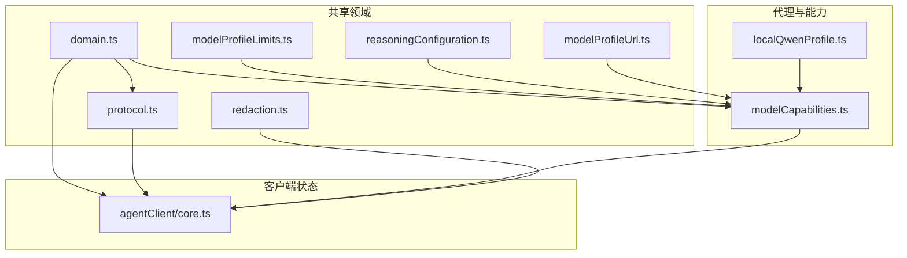
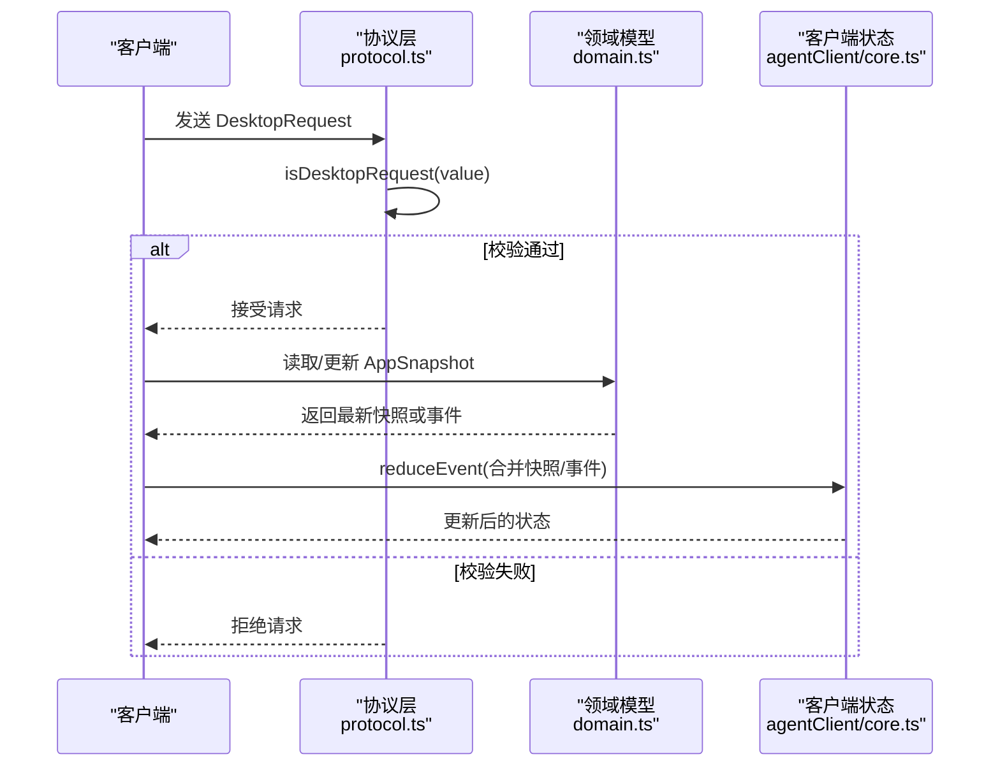
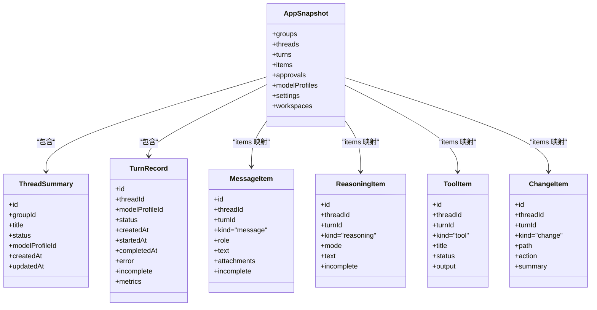
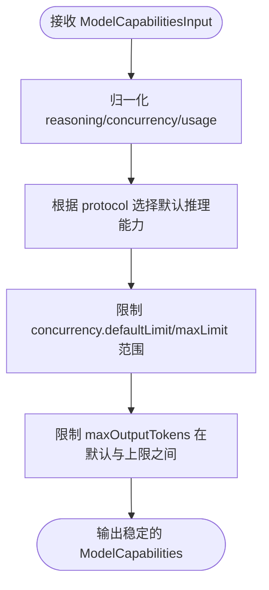
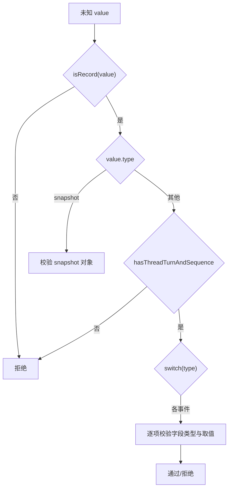
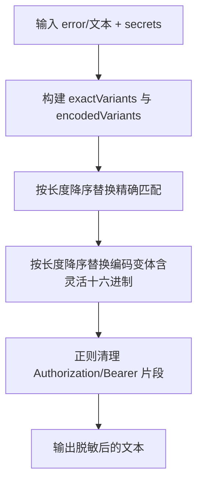
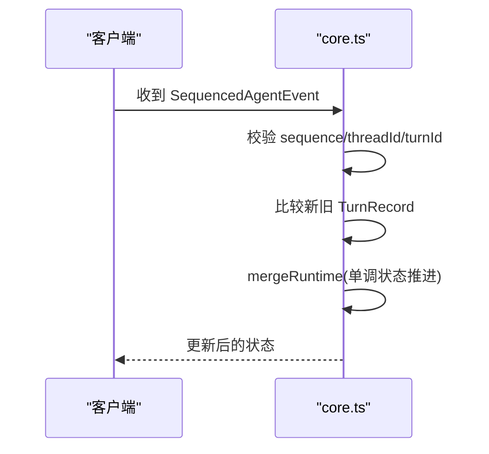
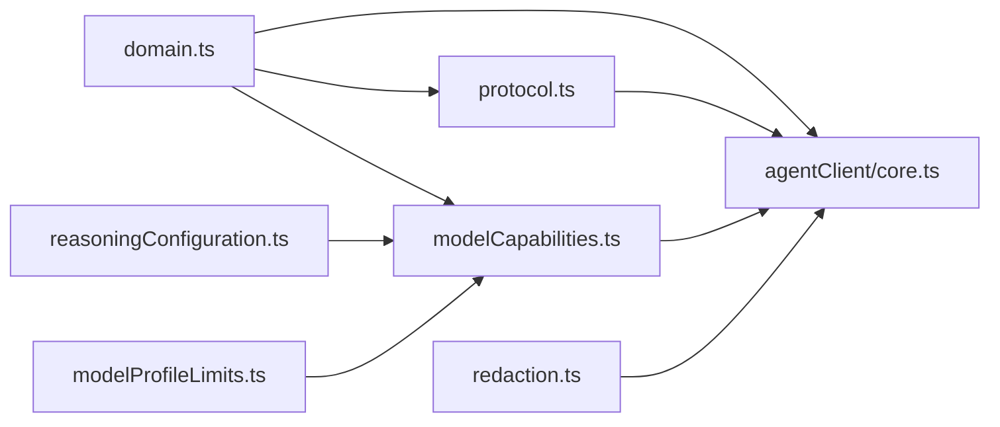

# 数据模型

<cite>
**本文引用的文件**
- [src/shared/domain.ts](file://src/shared/domain.ts)
- [src/shared/protocol.ts](file://src/shared/protocol.ts)
- [src/shared/redaction.ts](file://src/shared/redaction.ts)
- [src/shared/modelProfileLimits.ts](file://src/shared/modelProfileLimits.ts)
- [src/shared/reasoningConfiguration.ts](file://src/shared/reasoningConfiguration.ts)
- [src/shared/modelProfileUrl.ts](file://src/shared/modelProfileUrl.ts)
- [src/agent/modelCapabilities.ts](file://src/agent/modelCapabilities.ts)
- [src/agent/localQwenProfile.ts](file://src/agent/localQwenProfile.ts)
- [src/agentClient/core.ts](file://src/agentClient/core.ts)
- [tests/protocol.test.ts](file://tests/protocol.test.ts)
- [tests/redaction.test.ts](file://tests/redaction.test.ts)
</cite>

## 目录
1. [简介](#简介)
2. [项目结构](#项目结构)
3. [核心组件](#核心组件)
4. [架构总览](#架构总览)
5. [详细组件分析](#详细组件分析)
6. [依赖关系分析](#依赖关系分析)
7. [性能考虑](#性能考虑)
8. [故障排查指南](#故障排查指南)
9. [结论](#结论)
10. [附录：JSON 示例与 TypeScript 接口](#附录json-示例与-typescript-接口)

## 简介
本文件为数据模型文档，聚焦于应用状态快照、会话线程、对话轮次、消息项等核心实体，以及协议事件、类型守卫、敏感信息脱敏、能力与配置归一化、序列化/反序列化最佳实践与版本兼容性。目标是帮助开发者准确理解数据结构、约束条件、业务规则与处理流程，并提供可操作的参考示例。

## 项目结构
数据模型主要分布在共享层（shared）与客户端状态管理（agentClient），并辅以能力与配置工具模块：
- shared/domain.ts：定义所有核心数据类型与接口（AppSnapshot、ModelProfile、ThreadSummary、TurnRecord、Item 及其子类型等）。
- shared/protocol.ts：定义桌面端请求与代理事件类型，以及 isDesktopRequest、isAgentEvent 等运行时类型守卫。
- shared/redaction.ts：实现敏感文本脱敏逻辑，用于错误信息与日志安全输出。
- shared/modelProfileLimits.ts：定义最大输出 token 的默认值与上限。
- shared/reasoningConfiguration.ts：推理配置的冲突检测。
- shared/modelProfileUrl.ts：规范化模型基础 URL。
- agent/modelCapabilities.ts：能力与推理设置的归一化、校验与默认值填充。
- agent/localQwenProfile.ts：内置本地 Qwen 模型的 Profile 输入构造。
- agentClient/core.ts：客户端状态机，负责合并 AppSnapshot 中的 turns/items 与运行时状态 ThreadRuntimeState。

图表来源
- [src/shared/domain.ts:1-319](file://src/shared/domain.ts#L1-L319)
- [src/shared/protocol.ts:1-371](file://src/shared/protocol.ts#L1-L371)
- [src/shared/redaction.ts:1-112](file://src/shared/redaction.ts#L1-L112)
- [src/shared/modelProfileLimits.ts:1-3](file://src/shared/modelProfileLimits.ts#L1-L3)
- [src/shared/reasoningConfiguration.ts:1-19](file://src/shared/reasoningConfiguration.ts#L1-L19)
- [src/shared/modelProfileUrl.ts:1-24](file://src/shared/modelProfileUrl.ts#L1-L24)
- [src/agent/modelCapabilities.ts:1-207](file://src/agent/modelCapabilities.ts#L1-L207)
- [src/agent/localQwenProfile.ts:1-32](file://src/agent/localQwenProfile.ts#L1-L32)
- [src/agentClient/core.ts:1-780](file://src/agentClient/core.ts#L1-L780)

章节来源
- [src/shared/domain.ts:1-319](file://src/shared/domain.ts#L1-L319)
- [src/shared/protocol.ts:1-371](file://src/shared/protocol.ts#L1-L371)
- [src/agentClient/core.ts:1-780](file://src/agentClient/core.ts#L1-L780)

## 核心组件
本节概述关键数据模型与职责：
- AppSnapshot：应用状态的完整快照，包含分组、线程摘要、轮次记录、消息项映射、审批、模型配置、设置与工作区。
- ModelProfile：模型提供者配置与能力声明，包括推理设置、并发与输出限制等。
- ThreadSummary：线程元信息（id、标题、状态、关联模型配置、时间戳）。
- TurnRecord：一轮对话的生命周期记录（状态、时间、错误、指标、是否未完成）。
- Item 体系：MessageItem、ReasoningItem、ToolItem、ChangeItem 四类条目，统一通过 BaseItem 标识归属线程与轮次。
- Approval：需要人工审批的操作记录。
- ThreadRuntimeState：线程运行时的轻量状态（当前 turnId、状态、队列位置、时间戳、错误等）。
- AgentEvent/SequencedAgentEvent：流式事件与快照事件，携带 sequence 保证顺序。
- DesktopRequest：桌面端发起的请求类型集合，配合 isDesktopRequest 进行严格校验。

章节来源
- [src/shared/domain.ts:1-319](file://src/shared/domain.ts#L1-L319)
- [src/shared/protocol.ts:1-371](file://src/shared/protocol.ts#L1-L371)

## 架构总览
数据在“服务端/代理”生成 AppSnapshot 与事件，通过协议传输到“客户端”，客户端使用 isAgentEvent/isDesktopRequest 做入参校验，再按 sequence 与时间戳合并更新本地状态。

图表来源
- [src/shared/protocol.ts:274-371](file://src/shared/protocol.ts#L274-L371)
- [src/shared/domain.ts:283-319](file://src/shared/domain.ts#L283-L319)
- [src/agentClient/core.ts:742-780](file://src/agentClient/core.ts#L742-L780)

## 详细组件分析

### AppSnapshot 与线程/轮次/消息
- AppSnapshot 聚合了 ChatGroup[]、ThreadSummary[]、TurnRecord[]、items 映射、Approval[]、ModelProfile[]、AppSettings、WorkspaceRecord[]。
- ThreadSummary 描述线程的基本信息与状态；TurnRecord 描述一轮对话的完整生命周期与指标；Item 是线程内的具体条目集合，支持增量更新。
- 客户端在收到新快照时，会按 threadId 合并 items，并对 approvals 做状态优先合并，避免覆盖已完成的审批。

图表来源
- [src/shared/domain.ts:14-74](file://src/shared/domain.ts#L14-L74)
- [src/shared/domain.ts:283-305](file://src/shared/domain.ts#L283-L305)

章节来源
- [src/shared/domain.ts:14-74](file://src/shared/domain.ts#L14-L74)
- [src/shared/domain.ts:283-305](file://src/shared/domain.ts#L283-L305)
- [src/agentClient/core.ts:742-780](file://src/agentClient/core.ts#L742-L780)

### 模型配置 ModelProfile 与能力
- ModelProfile 包含 provider、baseUrl、model、capabilities、reasoning、maxConcurrency、maxOutputTokens、isDefault、时间戳等。
- capabilities.reasoning.inputMode 决定支持的推理输入方式（toggle/effort/custom/unsupported），effortOptions/outputModes/defaultEffort 由提供者声明。
- modelCapabilities.ts 提供 qwen/openai 的能力模板，并将任意输入归一化为稳定结构，同时限制并发与输出 token 范围。
- localQwenProfile.ts 提供内置本地 Qwen 的默认 Profile 输入。

图表来源
- [src/agent/modelCapabilities.ts:45-118](file://src/agent/modelCapabilities.ts#L45-L118)
- [src/shared/modelProfileLimits.ts:1-3](file://src/shared/modelProfileLimits.ts#L1-L3)

章节来源
- [src/shared/domain.ts:160-192](file://src/shared/domain.ts#L160-L192)
- [src/agent/modelCapabilities.ts:14-118](file://src/agent/modelCapabilities.ts#L14-L118)
- [src/agent/localQwenProfile.ts:13-25](file://src/agent/localQwenProfile.ts#L13-L25)

### 类型守卫：isDesktopRequest 与 isAgentEvent
- isDesktopRequest：对桌面端请求进行强类型校验，确保每个 type 对应的字段存在且合法（如 turn.start 必须包含 text，attachments 需满足图片 dataUrl 格式等）。
- isAgentEvent：对代理事件进行校验，区分 snapshot 与带 sequence 的事件，并对 metrics、phase、delta 文本等进行严格检查。
- 这些守卫是数据进入系统的第一道防线，防止非法或损坏的数据污染状态。

图表来源
- [src/shared/protocol.ts:69-112](file://src/shared/protocol.ts#L69-L112)
- [src/shared/protocol.ts:274-371](file://src/shared/protocol.ts#L274-L371)

章节来源
- [src/shared/protocol.ts:274-371](file://src/shared/protocol.ts#L274-L371)
- [tests/protocol.test.ts:1-200](file://tests/protocol.test.ts#L1-L200)

### 敏感数据脱敏（Redaction）
- safeErrorText：将错误对象转换为字符串，去除多余空白，截断长度，并在过程中调用 redactSensitiveText 替换敏感片段。
- redactSensitiveText：对精确匹配与多种编码变体（JSON 转义、百分号编码、表单编码、大小写混合十六进制）进行替换，并额外清理 Authorization/Bearer 头片段。
- 适用场景：错误信息展示、日志输出、调试面板中可能暴露密钥或令牌的内容。

图表来源
- [src/shared/redaction.ts:1-112](file://src/shared/redaction.ts#L1-L112)

章节来源
- [src/shared/redaction.ts:1-112](file://src/shared/redaction.ts#L1-L112)
- [tests/redaction.test.ts:1-41](file://tests/redaction.test.ts#L1-L41)

### 推理配置冲突检测
- reasoningConfigurationIssue：当 inputMode 为 unsupported 但 mode 非 disabled 时，返回冲突问题，阻止启用推理。
- 该检测在保存/测试模型配置时执行，确保配置一致性。

章节来源
- [src/shared/reasoningConfiguration.ts:1-19](file://src/shared/reasoningConfiguration.ts#L1-L19)
- [src/agent/modelCapabilities.ts:120-148](file://src/agent/modelCapabilities.ts#L120-L148)

### 运行时状态合并与序列号
- SequencedAgentEvent 携带 sequence，客户端据此判断事件新旧，避免乱序覆盖。
- compareTurns 与 newestTurnsByThread 用于比较 TurnRecord 的新旧，mergeRuntime 维护单调的状态推进（如 completed/fail/cancelled 为终态不可回退）。

图表来源
- [src/shared/protocol.ts:41-65](file://src/shared/protocol.ts#L41-L65)
- [src/agentClient/core.ts:509-570](file://src/agentClient/core.ts#L509-L570)

章节来源
- [src/agentClient/core.ts:509-570](file://src/agentClient/core.ts#L509-L570)

## 依赖关系分析
- domain.ts 是所有类型的权威来源，被 protocol.ts、modelCapabilities.ts、agentClient/core.ts 引用。
- protocol.ts 依赖 domain.ts 的类型，并通过 isDesktopRequest/isAgentEvent 保障数据契约。
- modelCapabilities.ts 依赖 domain.ts 与 reasoningConfiguration.ts、modelProfileLimits.ts，负责将外部输入归一化为内部稳定结构。
- agentClient/core.ts 消费 domain.ts 与 protocol.ts，负责状态合并与事件处理。
- redaction.ts 独立，供上层在错误/日志路径中使用。

图表来源
- [src/shared/domain.ts:1-319](file://src/shared/domain.ts#L1-L319)
- [src/shared/protocol.ts:1-371](file://src/shared/protocol.ts#L1-L371)
- [src/agent/modelCapabilities.ts:1-207](file://src/agent/modelCapabilities.ts#L1-L207)
- [src/agentClient/core.ts:1-780](file://src/agentClient/core.ts#L1-L780)

章节来源
- [src/shared/domain.ts:1-319](file://src/shared/domain.ts#L1-L319)
- [src/shared/protocol.ts:1-371](file://src/shared/protocol.ts#L1-L371)
- [src/agent/modelCapabilities.ts:1-207](file://src/agent/modelCapabilities.ts#L1-L207)
- [src/agentClient/core.ts:1-780](file://src/agentClient/core.ts#L1-L780)

## 性能考虑
- 事件合并基于 sequence 与时间戳，避免全量重建，减少渲染压力。
- 脱敏采用多阶段替换与正则，建议仅在必要时调用（如错误展示/日志），避免高频大文本处理。
- 能力归一化与配置校验在保存/测试时执行，避免运行时重复计算。

## 故障排查指南
- 请求被拒：检查 isDesktopRequest 对应 type 的必填字段与枚举值（如 turn.start 缺少 text、attachments 不合规）。
- 事件无效：检查 isAgentEvent 的 sequence、threadId、turnId、modelProfileId 是否存在且合法。
- 推理配置报错：确认 inputMode 与 protocol/mode 的组合符合 constraints，必要时调整 capabilities 或 reasoning 设置。
- 敏感信息泄露：在错误/日志输出前调用 safeErrorText/redactSensitiveText，传入已知 secrets 列表。

章节来源
- [src/shared/protocol.ts:274-371](file://src/shared/protocol.ts#L274-L371)
- [src/agent/modelCapabilities.ts:120-148](file://src/agent/modelCapabilities.ts#L120-L148)
- [src/shared/redaction.ts:1-112](file://src/shared/redaction.ts#L1-L112)

## 结论
本数据模型以 domain.ts 为核心，通过 protocol.ts 的类型守卫保障跨进程通信的安全性，借助 modelCapabilities.ts 完成能力与配置的归一化与约束，agentClient/core.ts 负责高效的状态合并与事件处理。结合 redaction.ts 的脱敏机制，系统在安全性、一致性与性能上形成闭环。遵循本文的最佳实践与示例，可在扩展新能力或对接新提供者时保持向后兼容与健壮性。

## 附录：JSON 示例与 TypeScript 接口
以下给出最小可用的 JSON 示例与对应 TypeScript 接口路径，便于快速上手与对照。

- 最小 AppSnapshot（空状态）
  - JSON 示例要点：包含 groups、threads、turns、items、approvals、modelProfiles、workspaces、settings 等数组/对象，其中 settings 包含 theme/language/contextMessageLimit/reasoningDisplayMode/showModelMetrics。
  - 参考路径：[src/shared/domain.ts:283-292](file://src/shared/domain.ts#L283-L292)

- 一条 TurnRecord
  - JSON 示例要点：id、threadId、status、createdAt、startedAt/completedAt 可选、incomplete、metrics 可选。
  - 参考路径：[src/shared/domain.ts:294-305](file://src/shared/domain.ts#L294-L305)

- 一条 MessageItem
  - JSON 示例要点：kind=message、role=user/assistant/system、text、attachments 可选（image 类型需包含 name/mimeType/dataUrl/size）、incomplete 可选。
  - 参考路径：[src/shared/domain.ts:34-49](file://src/shared/domain.ts#L34-L49)

- 一条 ReasoningItem
  - JSON 示例要点：kind=reasoning、mode=raw/summary、text、incomplete。
  - 参考路径：[src/shared/domain.ts:53-58](file://src/shared/domain.ts#L53-L58)

- 一条 ToolItem / ChangeItem
  - JSON 示例要点：kind=tool 或 change，分别包含 title/status/output 或 path/action/summary。
  - 参考路径：[src/shared/domain.ts:60-72](file://src/shared/domain.ts#L60-L72)

- ModelProfile（OpenAI 兼容）
  - JSON 示例要点：provider=openai-compatible、name/baseUrl/model、capabilities（text/vision/longContext/reasoning/concurrency/streaming/usage）、reasoning（mode/protocol/display/effort）、maxConcurrency/maxOutputTokens、isDefault、时间戳。
  - 参考路径：[src/shared/domain.ts:160-192](file://src/shared/domain.ts#L160-L192)

- 桌面端请求（turn.start）
  - JSON 示例要点：type=turn.start、threadId、text、modelProfileId 可选、attachments 可选。
  - 参考路径：[src/shared/protocol.ts:22-39](file://src/shared/protocol.ts#L22-L39)

- 代理事件（message.delta）
  - JSON 示例要点：type=message.delta、threadId/turnId/modelProfileId/sequence、text。
  - 参考路径：[src/shared/protocol.ts:41-65](file://src/shared/protocol.ts#L41-L65)

- 运行时状态 ThreadRuntimeState
  - JSON 示例要点：threadId、turnId 可选、modelProfileId 可选、status、queuePosition 可选、startedAt/completedAt/tokensPerSecond 可选、error 可选。
  - 参考路径：[src/shared/domain.ts:307-319](file://src/shared/domain.ts#L307-L319)

- 能力与配置归一化
  - 参考路径：[src/agent/modelCapabilities.ts:45-118](file://src/agent/modelCapabilities.ts#L45-L118)

- 内置本地 Qwen Profile 输入
  - 参考路径：[src/agent/localQwenProfile.ts:13-25](file://src/agent/localQwenProfile.ts#L13-L25)

- 类型守卫用法（测试用例）
  - 参考路径：[tests/protocol.test.ts:1-200](file://tests/protocol.test.ts#L1-L200)

- 脱敏函数用法（测试用例）
  - 参考路径：[tests/redaction.test.ts:1-41](file://tests/redaction.test.ts#L1-L41)