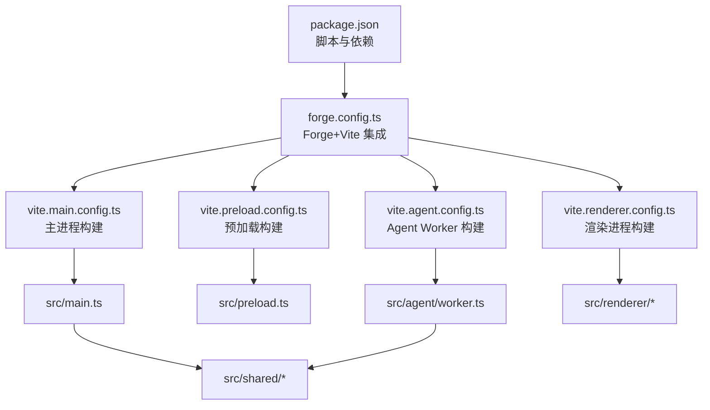
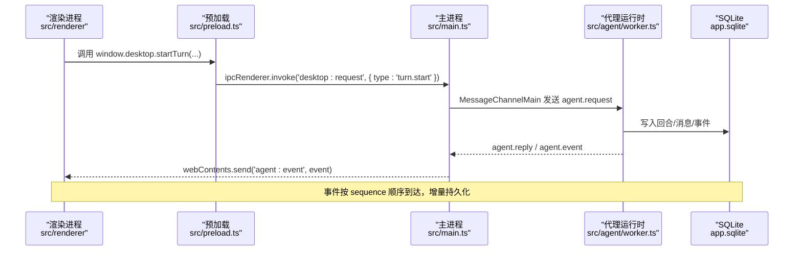
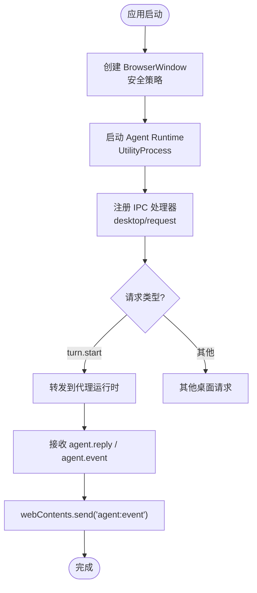
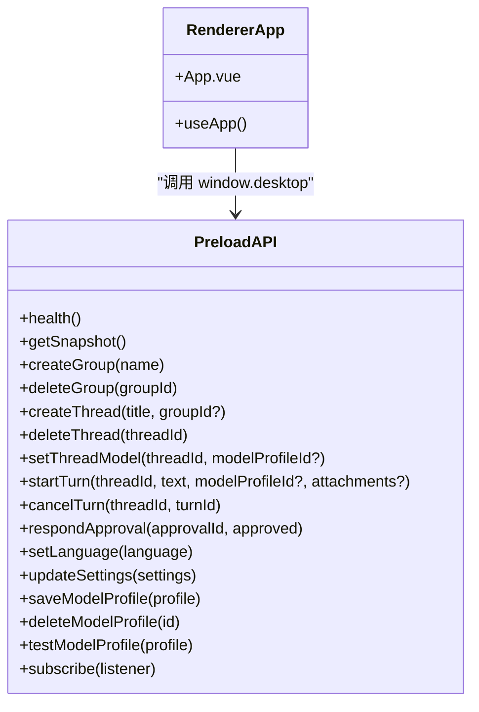
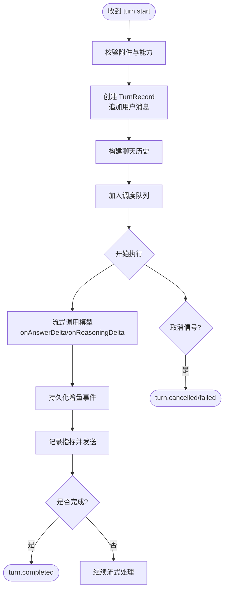
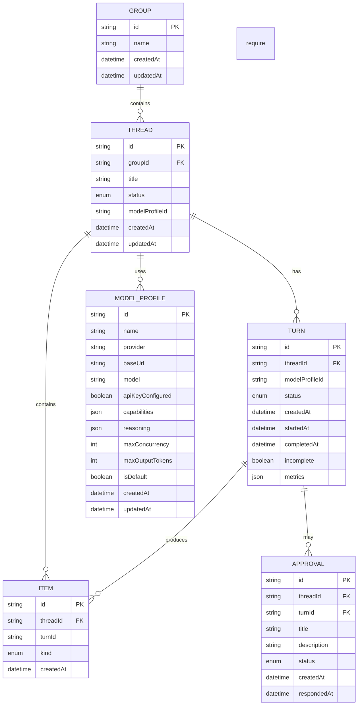
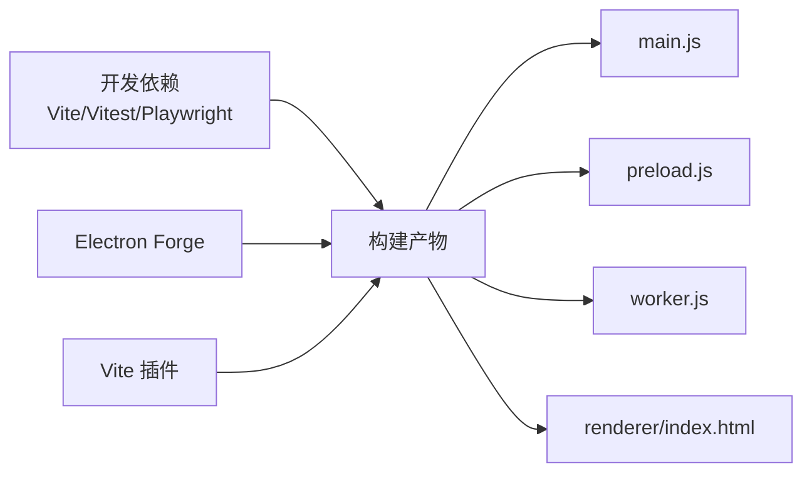

# 开发指南

<cite>
**本文引用的文件**
- [package.json](file://package.json)
- [README.md](file://README.md)
- [tsconfig.json](file://tsconfig.json)
- [vite.main.config.ts](file://vite.main.config.ts)
- [vite.renderer.config.ts](file://vite.renderer.config.ts)
- [vite.preload.config.ts](file://vite.preload.config.ts)
- [vite.agent.config.ts](file://vite.agent.config.ts)
- [forge.config.ts](file://forge.config.ts)
- [src/main.ts](file://src/main.ts)
- [src/preload.ts](file://src/preload.ts)
- [src/renderer/main.ts](file://src/renderer/main.ts)
- [src/renderer/App.vue](file://src/renderer/App.vue)
- [src/agent/worker.ts](file://src/agent/worker.ts)
- [src/shared/domain.ts](file://src/shared/domain.ts)
- [src/shared/protocol.ts](file://src/shared/protocol.ts)
- [model-runtime/README.md](file://model-runtime/README.md)
</cite>

## 目录
1. [简介](#简介)
2. [项目结构](#项目结构)
3. [核心组件](#核心组件)
4. [架构总览](#架构总览)
5. [详细组件分析](#详细组件分析)
6. [依赖关系分析](#依赖关系分析)
7. [性能考量](#性能考量)
8. [故障排查指南](#故障排查指南)
9. [结论](#结论)
10. [附录](#附录)

## 简介
本指南面向本地开发环境，覆盖安装与启动、调试技巧、热重载设置、日志与错误处理、TypeScript 与 Vue.js 规范、代码审查清单、提交信息规范、项目结构与编码约定、开发与协作流程、常见问题与性能优化建议。本项目为基于 Electron + Vue 3 + TypeScript 的跨平台桌面客户端，采用渲染进程（Vue UI）、预加载脚本（安全桥接）、主进程（Electron 生命周期与安全策略）和 Utility Process 代理运行时（调度、模型调用、SQLite 持久化）的分层架构。

## 项目结构
- 构建与打包：使用 Vite 作为前端构建工具，Electron Forge 集成 Vite 插件，分别构建 main、preload、agent(Worker)、renderer 四个产物；ASAR 限制生产资源范围并扫描包内容。
- 入口与配置：
  - package.json 提供 start、typecheck、test、build、package、make 等脚本。
  - tsconfig.json 启用严格模式、ESNext 模块、保留 JSX、sourceMap、Bundler 解析等。
  - forge.config.ts 定义 ASAR、忽略规则、镜像缓存、Vite 多入口构建以及 ZIP 分发器。
  - vite.*.config.ts 分别声明外部依赖（electron、node:*），避免将宿主 API 打包进产物。
- 源码组织：
  - src/main.ts：主进程，创建窗口、启动 Utility Process 代理、IPC 转发、事件广播。
  - src/preload.ts：通过 contextBridge 暴露受限的 window.desktop API。
  - src/renderer/*：Vue 3 应用与组件、样式、i18n、状态管理。
  - src/agent/worker.ts：Utility Process 中的代理运行时，负责请求路由、任务调度、流式推理、数据库持久化、事件序列化和回传。
  - src/shared/*：领域类型、协议校验、能力与配置归一化、错误脱敏等共享逻辑。
  - model-runtime/*：独立 Qwen 运行时脚本与说明，用于本地 llama.cpp 服务。

**图表来源**
- [package.json:7-14](file://package.json#L7-L14)
- [forge.config.ts:22-45](file://forge.config.ts#L22-L45)
- [vite.main.config.ts:3-9](file://vite.main.config.ts#L3-L9)
- [vite.preload.config.ts:3-9](file://vite.preload.config.ts#L3-L9)
- [vite.agent.config.ts:3-9](file://vite.agent.config.ts#L3-L9)
- [vite.renderer.config.ts:4-6](file://vite.renderer.config.ts#L4-L6)

**章节来源**
- [package.json:1-35](file://package.json#L1-L35)
- [forge.config.ts:1-50](file://forge.config.ts#L1-L50)
- [tsconfig.json:1-19](file://tsconfig.json#L1-L19)
- [vite.main.config.ts:1-10](file://vite.main.config.ts#L1-L10)
- [vite.renderer.config.ts:1-7](file://vite.renderer.config.ts#L1-L7)
- [vite.preload.config.ts:1-10](file://vite.preload.config.ts#L1-L10)
- [vite.agent.config.ts:1-10](file://vite.agent.config.ts#L1-L10)

## 核心组件
- 主进程（main）：负责窗口生命周期、安全策略、启动 Utility Process、IPC 路由与事件转发。
- 预加载（preload）：通过 contextBridge 暴露最小化的 desktop API，隔离渲染进程对 Node/Electron 的直接访问。
- 代理运行时（agent worker）：实现请求路由、会话与回合调度、流式模型调用、SQLite 持久化、事件序列化与回传、错误脱敏。
- 渲染进程（renderer）：Vue 3 界面，消费 window.desktop 提供的能力，展示对话、设置、检查器等视图。
- 共享层（shared）：领域模型、协议校验、能力与配置归一化、错误脱敏、URL 规范化等。

**章节来源**
- [src/main.ts:1-170](file://src/main.ts#L1-L170)
- [src/preload.ts:1-32](file://src/preload.ts#L1-L32)
- [src/agent/worker.ts:1-689](file://src/agent/worker.ts#L1-L689)
- [src/renderer/App.vue:1-199](file://src/renderer/App.vue#L1-L199)
- [src/shared/domain.ts:1-319](file://src/shared/domain.ts#L1-L319)
- [src/shared/protocol.ts:1-371](file://src/shared/protocol.ts#L1-L371)

## 架构总览
下图展示了从渲染进程到代理运行时的完整调用链，包括 IPC、消息通道、事件序列化和数据库持久化。

**图表来源**
- [src/preload.ts:15-25](file://src/preload.ts#L15-L25)
- [src/main.ts:103-143](file://src/main.ts#L103-L143)
- [src/agent/worker.ts:407-442](file://src/agent/worker.ts#L407-L442)
- [src/agent/worker.ts:454-464](file://src/agent/worker.ts#L454-L464)

## 详细组件分析

### 主进程与窗口安全
- 窗口安全：禁用 nodeIntegration，启用 contextIsolation 与 sandbox，仅通过 preload 暴露必要能力；拦截外链打开与导航。
- 代理运行时：使用 UtilityProcess fork 子进程并通过 MessageChannelMain 通信；在退出或端口关闭时清理资源。
- IPC 路由：统一通过 'desktop:request' 路由到代理运行时，返回 Promise 结果；事件通过 'agent:event' 推送至渲染进程。

**图表来源**
- [src/main.ts:56-95](file://src/main.ts#L56-L95)
- [src/main.ts:98-143](file://src/main.ts#L98-L143)
- [src/main.ts:146-156](file://src/main.ts#L146-L156)

**章节来源**
- [src/main.ts:1-170](file://src/main.ts#L1-L170)

### 预加载桥接与渲染进程
- 预加载：通过 contextBridge.exposeInMainWorld 暴露 health、snapshot、group/thread 管理、turn 控制、模型配置、语言设置、订阅事件等能力。
- 渲染进程：Vue 3 应用挂载，App.vue 组合 Sidebar、Conversation、Inspector、SettingsView，处理用户交互与错误提示。

**图表来源**
- [src/preload.ts:5-31](file://src/preload.ts#L5-L31)
- [src/renderer/App.vue:1-199](file://src/renderer/App.vue#L1-L199)

**章节来源**
- [src/preload.ts:1-32](file://src/preload.ts#L1-L32)
- [src/renderer/App.vue:1-199](file://src/renderer/App.vue#L1-L199)

### 代理运行时与工作流
- 请求路由：handleDesktopRequest 根据 type 分派到数据库或运行时方法。
- 回合调度：ModelTurnScheduler 维护每个 profile 的并发限制与 FIFO 队列；支持 queued/running/cancelling/completed/failed/cancelled/interrupted 状态。
- 流式处理：streamChatCompletion 回调驱动 answer/reasoning/metrics 增量事件；事件经 createTurnEventEmitter 添加 threadId/turnId/modelProfileId/sequence 后持久化并回传。
- 错误与脱敏：safeErrorText 对错误信息进行敏感信息脱敏；失败时记录错误并通知 UI。

**图表来源**
- [src/agent/worker.ts:223-305](file://src/agent/worker.ts#L223-L305)
- [src/agent/worker.ts:128-153](file://src/agent/worker.ts#L128-L153)
- [src/agent/worker.ts:454-464](file://src/agent/worker.ts#L454-L464)
- [src/agent/worker.ts:642-652](file://src/agent/worker.ts#L642-L652)

**章节来源**
- [src/agent/worker.ts:1-689](file://src/agent/worker.ts#L1-L689)

### 数据模型与协议
- 领域模型：包含群组、线程、回合、消息、推理项、工具项、变更项、审批、设置、工作区、模型配置、连接结果、运行指标等。
- 协议校验：isDesktopRequest/isAgentEvent 对请求与事件进行严格的结构与值域校验，确保跨进程数据传输安全。

**图表来源**
- [src/shared/domain.ts:7-319](file://src/shared/domain.ts#L7-L319)

**章节来源**
- [src/shared/domain.ts:1-319](file://src/shared/domain.ts#L1-L319)
- [src/shared/protocol.ts:22-65](file://src/shared/protocol.ts#L22-L65)
- [src/shared/protocol.ts:274-371](file://src/shared/protocol.ts#L274-L371)

## 依赖关系分析
- 构建依赖：@electron-forge/plugin-vite 将 Vite 集成到 Electron 构建管线；Vite 插件为 renderer 启用 Vue 支持；各 vite.*.config.ts 将 electron 与 node:* 标记为 external，避免打包宿主 API。
- 运行时依赖：Vue 3 用于 UI；Electron 提供进程与 IPC；node:sqlite 用于 SQLite 访问（避免原生模块）。
- 测试与端到端：vitest 用于单元测试；Playwright 用于 E2E 测试，支持离线 fake 服务器与可选的真实模型在线测试。

**图表来源**
- [package.json:19-32](file://package.json#L19-L32)
- [forge.config.ts:22-45](file://forge.config.ts#L22-L45)
- [vite.main.config.ts:3-9](file://vite.main.config.ts#L3-L9)
- [vite.preload.config.ts:3-9](file://vite.preload.config.ts#L3-L9)
- [vite.agent.config.ts:3-9](file://vite.agent.config.ts#L3-L9)
- [vite.renderer.config.ts:4-6](file://vite.renderer.config.ts#L4-L6)

**章节来源**
- [package.json:1-35](file://package.json#L1-L35)
- [forge.config.ts:1-50](file://forge.config.ts#L1-L50)

## 性能考量
- 并发与队列：每个模型配置拥有独立的并发限制与 FIFO 队列；取消运行中的任务会释放一个槽位；不同配置的队列相互独立。
- 流式传输：增量文本、推理片段与指标通过事件流传递；重复 SSE id 且数据相同可跳过；最终答案缺失则视为失败而非空完成。
- 指标来源：tokens/speed 优先使用服务端报告，否则基于完成 token 与耗时推导；不可用时保持“不可用”。
- 本地运行时容量：默认单槽位与上下文大小；提升并行需同步增加总上下文，并进行内存、延迟与 CUDA 稳定性验证。

**章节来源**
- [README.md:57-77](file://README.md#L57-L77)
- [model-runtime/README.md:41-49](file://model-runtime/README.md#L41-L49)

## 故障排查指南
- 无法启动代理运行时：检查主进程日志中 “Failed to start agent runtime” 与进程退出原因；确认端口与路径正确。
- 模型连接失败：使用 Settings → Model providers 的连接测试；若离线或模型不匹配，检查 endpoint、模型名与 API Key；注意连接测试仅证明可达性，不推断能力。
- 流式输出异常：确认服务端返回非空最终答案；检查 SSE id 去重与累积归一化模式；若结束无答案内容，视为失败并保持未完成。
- 权限与安全问题：确保渲染进程未直接访问文件系统/Shell/环境变量/SQLite/密钥；所有敏感信息在主进程与代理运行时处理并脱敏。
- 本地 Qwen 服务：确认 Compose 已启动且端口可用；使用 verify-model 命令验证健康与模型列表；切换 profile 前停止当前项目并重新检查端口。

**章节来源**
- [src/main.ts:85-89](file://src/main.ts#L85-L89)
- [src/agent/worker.ts:294-304](file://src/agent/worker.ts#L294-L304)
- [src/agent/worker.ts:650-652](file://src/agent/worker.ts#L650-L652)
- [README.md:12-18](file://README.md#L12-L18)
- [README.md:78-102](file://README.md#L78-L102)
- [model-runtime/README.md:7-39](file://model-runtime/README.md#L7-L39)

## 结论
本项目以清晰的分层架构与严格的协议校验保障安全性与可维护性；通过流式事件与持久化结合，提供稳定可靠的对话体验。遵循本文的开发与环境配置指南，可快速搭建本地开发环境、高效调试与优化性能，并按规范进行协作与贡献。

## 附录

### 开发环境配置与启动
- 安装与启动：pnpm install；pnpm start。
- 类型检查：pnpm typecheck。
- 测试：pnpm test；端到端：pnpm test:e2e。
- 打包与制作：pnpm build；pnpm package；pnpm make。

**章节来源**
- [README.md:5-14](file://README.md#L5-L14)
- [package.json:7-14](file://package.json#L7-L14)

### 调试技巧
- 主进程调试：在 src/main.ts 中打印关键生命周期与错误；利用 Electron DevTools 查看渲染进程。
- 代理运行时调试：在 src/agent/worker.ts 中关注事件序列号与持久化落库；通过 IPC 事件观察流转。
- 预加载桥接：在 src/preload.ts 中扩展 window.desktop API 时，确保类型与校验一致。

**章节来源**
- [src/main.ts:56-95](file://src/main.ts#L56-L95)
- [src/agent/worker.ts:128-153](file://src/agent/worker.ts#L128-L153)
- [src/preload.ts:5-31](file://src/preload.ts#L5-L31)

### 热重载设置
- 渲染进程：vite.renderer.config.ts 启用 Vue 插件，配合 Electron Forge 的 Vite 插件实现热更新。
- 主进程与预加载：vite.main.config.ts 与 vite.preload.config.ts 将 electron 标记为 external，避免打包宿主 API；修改后由 Forge 重新构建。
- Agent Worker：vite.agent.config.ts 将 electron 与 node:sqlite 标记为 external，保证运行时可用性。

**章节来源**
- [vite.renderer.config.ts:1-7](file://vite.renderer.config.ts#L1-L7)
- [vite.main.config.ts:1-10](file://vite.main.config.ts#L1-L10)
- [vite.preload.config.ts:1-10](file://vite.preload.config.ts#L1-L10)
- [vite.agent.config.ts:1-10](file://vite.agent.config.ts#L1-L10)
- [forge.config.ts:22-45](file://forge.config.ts#L22-L45)

### 日志与错误处理
- 错误脱敏：safeErrorText 对错误信息进行敏感信息脱敏，避免泄露 API Key。
- 事件序列：createTurnEventEmitter 为每个事件附加 threadId/turnId/modelProfileId/sequence，确保有序与可追踪。
- 失败处理：turn.failed 携带脱敏后的错误信息；数据库记录失败状态与错误文本。

**章节来源**
- [src/agent/worker.ts:650-652](file://src/agent/worker.ts#L650-L652)
- [src/agent/worker.ts:128-153](file://src/agent/worker.ts#L128-L153)
- [src/agent/worker.ts:294-304](file://src/agent/worker.ts#L294-L304)

### TypeScript 规范
- 严格模式：tsconfig.json 启用 strict、ESNext module、Bundler 解析、保留 JSX、sourceMap、isolatedModules。
- 类型安全：shared 层提供领域类型与协议校验函数，确保跨进程数据结构一致性。
- 类型检查：pnpm typecheck 同时检查渲染与 Node 侧类型。

**章节来源**
- [tsconfig.json:1-19](file://tsconfig.json#L1-L19)
- [src/shared/domain.ts:1-319](file://src/shared/domain.ts#L1-L319)
- [src/shared/protocol.ts:274-371](file://src/shared/protocol.ts#L274-L371)
- [package.json:9](file://package.json#L9)

### Vue.js 最佳实践
- 组件拆分：Sidebar、Conversation、Inspector、SettingsView 职责清晰，通过 props/events 通信。
- 状态管理：useApp composable 集中管理状态与副作用；App.vue 协调视图切换与用户操作。
- 主题与国际化：动态切换主题与语言，使用 i18n 翻译键。

**章节来源**
- [src/renderer/App.vue:1-199](file://src/renderer/App.vue#L1-L199)
- [src/renderer/main.ts:1-7](file://src/renderer/main.ts#L1-L7)

### 代码审查清单
- 安全性：是否通过 preload 暴露最小 API；是否避免在渲染进程中访问敏感能力。
- 协议校验：新增请求/事件是否补充 isDesktopRequest/isAgentEvent 校验。
- 错误处理：是否使用 safeErrorText；是否记录失败状态与错误信息。
- 并发与队列：是否正确更新并发限制与队列位置；取消逻辑是否释放槽位。
- 类型与配置：是否更新 shared 类型；Vite/Forge 配置是否合理标记 external。

**章节来源**
- [src/preload.ts:5-31](file://src/preload.ts#L5-L31)
- [src/shared/protocol.ts:274-371](file://src/shared/protocol.ts#L274-L371)
- [src/agent/worker.ts:223-305](file://src/agent/worker.ts#L223-L305)
- [src/agent/worker.ts:650-652](file://src/agent/worker.ts#L650-L652)

### 提交信息规范
- 格式建议：<类型>(<范围>): <描述>
- 类型示例：feat、fix、docs、style、refactor、test、chore
- 范围示例：main、preload、agent、renderer、shared、forge、vite
- 描述要求：简洁明确，必要时附动机与影响面；涉及协议变更需说明兼容性。

[本节为通用规范说明，无需具体文件引用]

### 项目结构与编码约定
- 分层清晰：renderer（UI）、preload（桥接）、main（生命周期与安全）、agent（业务与持久化）、shared（类型与协议）。
- 命名约定：文件与模块按功能划分；类型与接口集中在 shared；组件按视图划分。
- 构建约定：Vite 多入口；Forge 统一打包；ASAR 限制生产资源。

**章节来源**
- [forge.config.ts:22-45](file://forge.config.ts#L22-L45)
- [src/shared/domain.ts:1-319](file://src/shared/domain.ts#L1-L319)
- [src/shared/protocol.ts:1-65](file://src/shared/protocol.ts#L1-L65)

### 开发与协作流程
- 本地开发：pnpm install；pnpm start；pnpm typecheck；pnpm test。
- 端到端：pnpm test:e2e；可选真实模型测试需设置环境变量。
- 发布：pnpm package；pnpm make；检查 out/ 与 ASAR 内容。

**章节来源**
- [README.md:78-102](file://README.md#L78-L102)
- [package.json:7-14](file://package.json#L7-L14)

### 常见问题解决方案
- 模型服务不可达：检查 endpoint 与模型名；使用 verify-model 命令；确保端口未被占用。
- 并发与上下文不匹配：调整 LLAMA_PARALLEL 与 LLAMA_CTX_SIZE；进行内存与稳定性验证。
- 流式输出不完整：确认服务端返回最终答案；检查 SSE id 去重与归一化模式。

**章节来源**
- [model-runtime/README.md:7-39](file://model-runtime/README.md#L7-L39)
- [README.md:70-77](file://README.md#L70-L77)