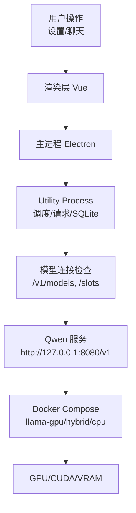
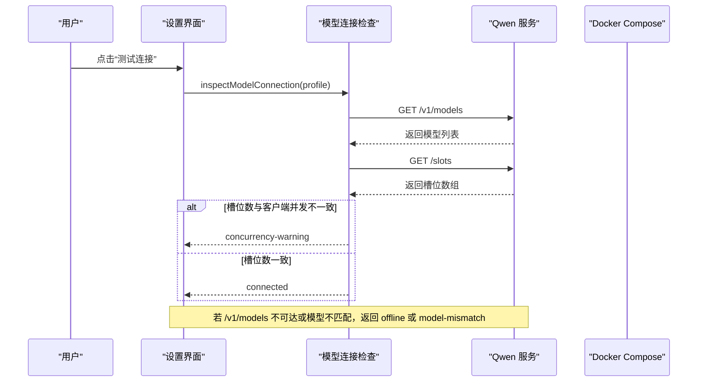
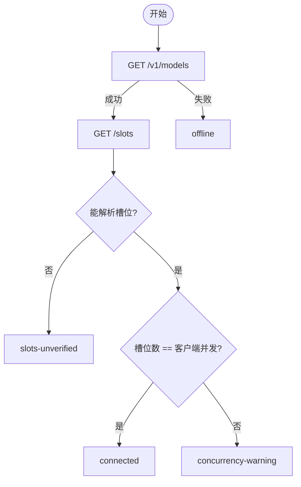
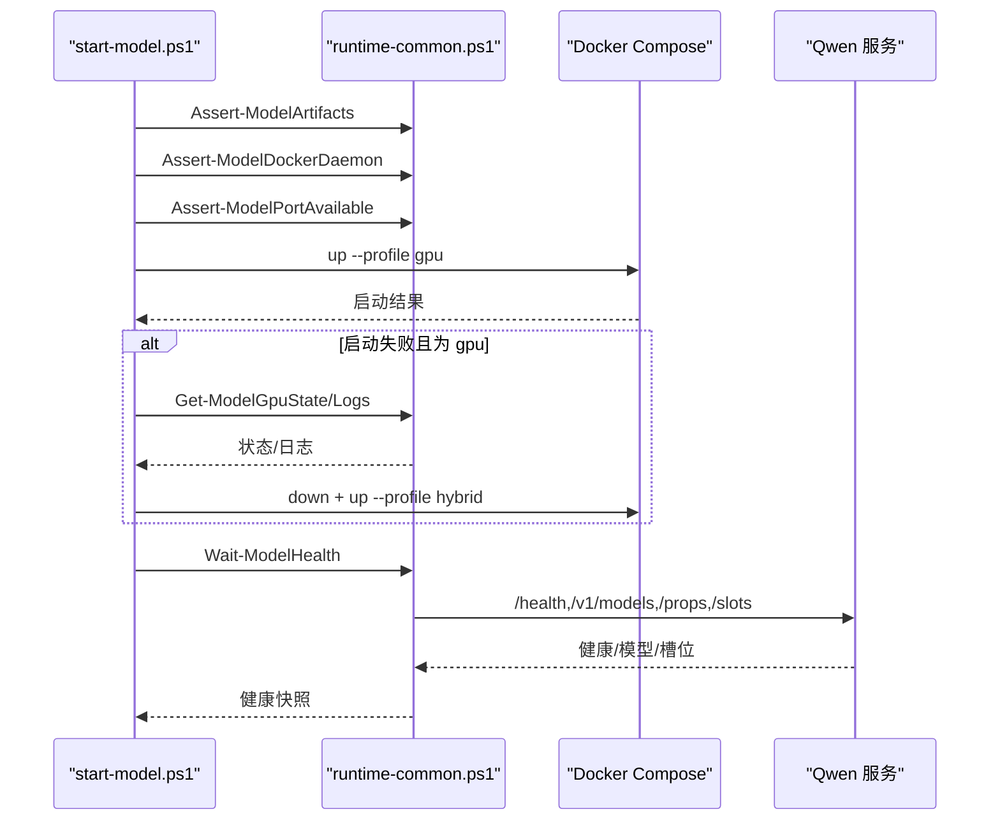
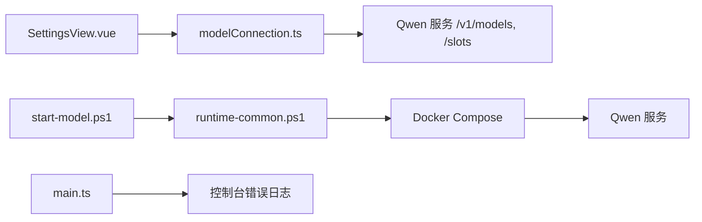

# 故障排除

<cite>
**本文引用的文件**
- [README.md](file://README.md)
- [model-runtime/README.md](file://model-runtime/README.md)
- [models/README.md](file://models/README.md)
- [model-runtime/start-model.ps1](file://model-runtime/start-model.ps1)
- [model-runtime/runtime-common.ps1](file://model-runtime/runtime-common.ps1)
- [src/agent/modelConnection.ts](file://src/agent/modelConnection.ts)
- [src/shared/domain.ts](file://src/shared/domain.ts)
- [src/renderer/components/SettingsView.vue](file://src/renderer/components/SettingsView.vue)
- [src/shared/redaction.ts](file://src/shared/redaction.ts)
- [src/main.ts](file://src/main.ts)
</cite>

## 目录
1. [简介](#简介)
2. [项目结构](#项目结构)
3. [核心组件](#核心组件)
4. [架构总览](#架构总览)
5. [详细组件分析](#详细组件分析)
6. [依赖关系分析](#依赖关系分析)
7. [性能注意事项](#性能注意事项)
8. [故障排除指南](#故障排除指南)
9. [结论](#结论)
10. [附录](#附录)

## 简介
本指南面向本地 Qwen 运行时与桌面客户端的常见问题，覆盖启动、连接、性能与内存泄漏排查，以及 GPU/CUDA 稳定性问题。文档基于仓库中的脚本、连接检查、设置界面与类型定义，提供可操作的诊断流程与修复建议。

## 项目结构
- 桌面端（Electron）：渲染层仅负责 UI；主进程管理生命周期与安全策略；Utility Process 负责调度、模型调用与 SQLite 持久化。
- 独立 Qwen 运行时：通过 Docker Compose 运行 llama.cpp，暴露 OpenAI 兼容接口到 127.0.0.1:8080。
- 模型工件：gguf 模型文件位于 models 目录，不参与打包。

图表来源
- [README.md:104-112](file://README.md#L104-L112)
- [model-runtime/README.md:1-39](file://model-runtime/README.md#L1-L39)

章节来源
- [README.md:1-121](file://README.md#L1-L121)
- [model-runtime/README.md:1-53](file://model-runtime/README.md#L1-L53)

## 核心组件
- 模型连接检查：校验 /v1/models 返回的模型名是否与配置一致，并尝试读取 /slots 以验证服务端并发槽位与客户端并发限制是否匹配。
- 运行时健康检查：PowerShell 脚本组合 health、models、props、slots 等端点，确保服务状态为 ok、模型名称精确匹配、槽位数量一致。
- 设置界面：提供模型配置、能力声明、并发与输出上限、推理模式等，支持“测试连接”并展示诊断信息。
- 错误脱敏：将敏感信息从错误文本中移除，避免泄露密钥或令牌。

章节来源
- [src/agent/modelConnection.ts:11-91](file://src/agent/modelConnection.ts#L11-L91)
- [model-runtime/runtime-common.ps1:170-293](file://model-runtime/runtime-common.ps1#L170-L293)
- [src/renderer/components/SettingsView.vue:302-344](file://src/renderer/components/SettingsView.vue#L302-L344)
- [src/shared/redaction.ts:1-38](file://src/shared/redaction.ts#L1-L38)

## 架构总览

图表来源
- [src/agent/modelConnection.ts:11-91](file://src/agent/modelConnection.ts#L11-L91)
- [src/shared/domain.ts:194-236](file://src/shared/domain.ts#L194-L236)

## 详细组件分析

### 模型连接检查与诊断
- 行为要点
  - 先访问 /v1/models，确认响应成功且包含配置的模型名。
  - 再访问 /slots，解析槽位数组长度作为服务端并发能力。
  - 比较服务端槽位数与客户端 maxConcurrency：不一致时返回并发警告；无法解析时返回槽位未验证。
  - 网络异常或 HTTP 非 2xx 返回离线状态。
- 常见结果
  - connected：槽位与客户端并发一致。
  - concurrency-warning：槽位与客户端并发不一致。
  - slots-unverified：无法验证槽位。
  - offline：端点不可达或响应失败。
  - model-mismatch：模型名不匹配。

图表来源
- [src/agent/modelConnection.ts:11-91](file://src/agent/modelConnection.ts#L11-L91)
- [src/shared/domain.ts:194-236](file://src/shared/domain.ts#L194-L236)

章节来源
- [src/agent/modelConnection.ts:11-91](file://src/agent/modelConnection.ts#L11-L91)
- [src/shared/domain.ts:194-236](file://src/shared/domain.ts#L194-L236)

### 运行时健康检查与 GPU 回退
- 健康检查步骤
  - 校验 /health 状态为 ok。
  - 校验 /v1/models 包含期望模型名。
  - 校验 /props 的 total_slots 为正整数。
  - 校验 /slots 为非空数组且无重复 id。
  - 校验 props 与 slots 报告的数量一致。
- GPU 启动与回退
  - 默认尝试 gpu 配置；若失败且日志/状态显示显存不足、CUDA 错误或加载失败，则自动回退到 hybrid。
  - 切换前会停止当前拥有 127.0.0.1:8080 的容器，确保端口可用。
  - 启动后等待健康检查通过，超时则抛出错误。

图表来源
- [model-runtime/start-model.ps1:12-43](file://model-runtime/start-model.ps1#L12-L43)
- [model-runtime/start-model.ps1:87-129](file://model-runtime/start-model.ps1#L87-L129)
- [model-runtime/runtime-common.ps1:170-293](file://model-runtime/runtime-common.ps1#L170-L293)

章节来源
- [model-runtime/start-model.ps1:12-43](file://model-runtime/start-model.ps1#L12-L43)
- [model-runtime/start-model.ps1:87-129](file://model-runtime/start-model.ps1#L87-L129)
- [model-runtime/runtime-common.ps1:170-293](file://model-runtime/runtime-common.ps1#L170-L293)

### 设置界面与连接诊断
- 功能要点
  - 支持配置 baseUrl、模型名、API Key、推理模式、并发与输出上限。
  - “测试连接”会调用连接检查并展示诊断消息。
  - 对本地 Qwen 服务提供额外提示（如需要手动启动服务）。
- 诊断展示
  - 根据连接检查结果生成可读的诊断文案，包括并发不一致、槽位未验证、离线或模型不匹配等。

章节来源
- [src/renderer/components/SettingsView.vue:302-344](file://src/renderer/components/SettingsView.vue#L302-L344)
- [src/renderer/components/SettingsView.vue:98-102](file://src/renderer/components/SettingsView.vue#L98-L102)

### 错误脱敏与日志安全
- 行为要点
  - 将错误消息中的敏感信息（如 API Key、Bearer Token）替换为占位符。
  - 限制最大长度，避免过长日志影响性能。
- 使用场景
  - 前端展示的错误信息、事件记录、调试输出等。

章节来源
- [src/shared/redaction.ts:1-38](file://src/shared/redaction.ts#L1-L38)

## 依赖关系分析
- 连接检查依赖 OpenAI 兼容端点：/v1/models 与 /slots。
- 运行时脚本依赖 Docker Compose 与模型工件完整性校验。
- 设置界面依赖连接检查与国际化文案。
- 主进程在启动失败时记录错误日志。

图表来源
- [src/renderer/components/SettingsView.vue:302-344](file://src/renderer/components/SettingsView.vue#L302-L344)
- [src/agent/modelConnection.ts:11-91](file://src/agent/modelConnection.ts#L11-L91)
- [model-runtime/start-model.ps1:12-43](file://model-runtime/start-model.ps1#L12-L43)
- [model-runtime/runtime-common.ps1:170-293](file://model-runtime/runtime-common.ps1#L170-L293)
- [src/main.ts:88-88](file://src/main.ts#L88-L88)

章节来源
- [src/renderer/components/SettingsView.vue:302-344](file://src/renderer/components/SettingsView.vue#L302-L344)
- [src/agent/modelConnection.ts:11-91](file://src/agent/modelConnection.ts#L11-L91)
- [model-runtime/start-model.ps1:12-43](file://model-runtime/start-model.ps1#L12-L43)
- [model-runtime/runtime-common.ps1:170-293](file://model-runtime/runtime-common.ps1#L170-L293)
- [src/main.ts:88-88](file://src/main.ts#L88-L88)

## 性能注意事项
- 并发与上下文容量
  - 默认 LLAMA_PARALLEL=1、LLAMA_CTX_SIZE=16384，表示单槽位、总上下文容量 16384 token。
  - 如需双槽位，需同时提高并行度与总上下文（例如 2 与 32768），否则 K/V 缓存显著增加内存占用。
- 生成上限
  - LLAMA_N_PREDICT=2048 为服务端生成上限；推理开启时可能更早耗尽该限制。
- 客户端并发
  - 客户端 maxConcurrency 与服务端槽位应保持一致；不一致会导致排队或拒绝。
- 指标采集
  - 当服务端提供用量/时间数据时，可计算 tokens per second；否则不可用。

章节来源
- [model-runtime/README.md:41-49](file://model-runtime/README.md#L41-L49)
- [src/shared/domain.ts:238-257](file://src/shared/domain.ts#L238-L257)

## 故障排除指南

### 启动问题
- 症状
  - 启动脚本报错、端口占用、Docker 守护进程不可用、模型工件缺失或哈希不匹配。
- 诊断步骤
  - 运行 start-model.ps1 并观察输出；必要时切换到 cpu 或 hybrid 模式。
  - 使用 status-model.ps1 查看运行时状态。
  - 使用 verify-model.ps1 执行健康、模型发现、属性与槽位校验。
- 修复建议
  - 确保 Docker 已安装并可访问。
  - 确保 127.0.0.1:8080 未被其他进程占用。
  - 确保 models 目录下 gguf 文件完整且哈希正确。
  - 若 GPU 启动失败且日志出现显存不足或 CUDA 错误，脚本会自动回退到 hybrid。

章节来源
- [model-runtime/start-model.ps1:12-43](file://model-runtime/start-model.ps1#L12-L43)
- [model-runtime/start-model.ps1:87-129](file://model-runtime/start-model.ps1#L87-L129)
- [model-runtime/runtime-common.ps1:22-52](file://model-runtime/runtime-common.ps1#L22-L52)
- [model-runtime/README.md:1-39](file://model-runtime/README.md#L1-L39)

### 连接问题
- 症状
  - 设置界面“测试连接”返回 offline、model-mismatch、concurrency-warning 或 slots-unverified。
- 诊断步骤
  - 检查 baseUrl 是否正确指向 http://127.0.0.1:8080/v1。
  - 检查 /v1/models 是否返回配置的模型名。
  - 检查 /slots 是否返回非空数组且无重复 id。
  - 对比服务端槽位数与客户端 maxConcurrency。
- 修复建议
  - 修正模型名或端点地址。
  - 调整客户端 maxConcurrency 与服务端槽位一致。
  - 若无法解析 /slots，视为槽位未验证，仍可使用但需谨慎控制并发。

章节来源
- [src/agent/modelConnection.ts:11-91](file://src/agent/modelConnection.ts#L11-L91)
- [src/shared/domain.ts:194-236](file://src/shared/domain.ts#L194-L236)
- [src/renderer/components/SettingsView.vue:302-344](file://src/renderer/components/SettingsView.vue#L302-L344)

### 性能问题
- 症状
  - 首 token 延迟高、吞吐低、生成提前结束。
- 诊断步骤
  - 检查服务端 LLAMA_PARALLEL 与 LLAMA_CTX_SIZE 是否满足并发需求。
  - 检查客户端 maxConcurrency 与服务端槽位是否一致。
  - 检查 LLAMA_N_PREDICT 是否过小导致生成提前结束。
  - 启用模型指标显示，观察 durationMs、tokensPerSecond、timeToFirstTokenMs。
- 修复建议
  - 提升 LLAMA_CTX_SIZE 以容纳更多上下文；按需提升 LLAMA_PARALLEL。
  - 调整客户端并发与服务端槽位一致。
  - 增大 LLAMA_N_PREDICT 以满足长回答需求。

章节来源
- [model-runtime/README.md:41-49](file://model-runtime/README.md#L41-L49)
- [src/shared/domain.ts:238-257](file://src/shared/domain.ts#L238-L257)

### 内存泄漏与资源清理
- 症状
  - 长时间运行后内存持续增长、任务卡住、流式响应未关闭。
- 诊断步骤
  - 检查流式读取是否在取消或超时时释放 reader。
  - 检查 AbortSignal 是否正确传播到 fetch 与流式读取。
  - 检查连接测试期间是否因取消而提前终止。
- 修复建议
  - 确保所有 ReadableStream 读取在 abort 或 error 路径中移除监听并释放资源。
  - 使用 withExplicitAbort 包装异步操作，保证取消语义。
  - 避免在取消后继续处理响应，防止悬挂任务。

章节来源
- [src/agent/modelProvider.ts:696-742](file://src/agent/modelProvider.ts#L696-L742)
- [src/agent/modelConnection.ts:117-136](file://src/agent/modelConnection.ts#L117-L136)

### GPU 配置、内存管理与 CUDA 稳定性
- 症状
  - GPU 启动失败、显存不足、CUDA 错误、模型加载失败。
- 诊断步骤
  - 查看 GPU 状态与日志，识别 out of memory、cuda error/fail、failed to load、model load fail 等关键字。
  - 确认 Docker GPU 支持已启用。
  - 检查模型工件大小与哈希是否匹配。
- 修复建议
  - 降低并发或上下文大小以减少显存占用。
  - 切换到 hybrid 或 cpu 模式验证是否为 GPU 驱动或显存问题。
  - 重新下载模型文件并确保完整性。

章节来源
- [model-runtime/start-model.ps1:87-129](file://model-runtime/start-model.ps1#L87-L129)
- [model-runtime/runtime-common.ps1:22-52](file://model-runtime/runtime-common.ps1#L22-L52)
- [models/README.md:1-9](file://models/README.md#L1-L9)

### 错误诊断流程与修复建议
- 通用流程
  - 收集错误信息：设置界面的诊断文案、脚本输出、控制台错误。
  - 定位阶段：启动阶段、连接阶段、请求阶段、流式处理阶段。
  - 验证配置：baseUrl、模型名、并发、上下文、生成上限。
  - 逐步降级：gpu -> hybrid -> cpu，隔离 GPU 相关问题。
- 修复建议
  - 修正配置错误（模型名、端点、并发）。
  - 提升资源（显存、上下文）或降低负载（并发、上下文）。
  - 清理资源（关闭流、释放 reader、取消悬挂任务）。
  - 重试运行脚本与连接测试，确认恢复。

章节来源
- [src/renderer/components/SettingsView.vue:302-344](file://src/renderer/components/SettingsView.vue#L302-L344)
- [model-runtime/start-model.ps1:12-43](file://model-runtime/start-model.ps1#L12-L43)
- [src/shared/redaction.ts:1-38](file://src/shared/redaction.ts#L1-L38)

## 结论
通过标准化的连接检查与健康校验、明确的并发与上下文配置、以及稳健的 GPU 回退机制，本项目提供了清晰的故障定位路径。遵循本指南的步骤，可以快速识别并解决启动、连接、性能与内存相关的问题，确保本地 Qwen 运行时稳定可靠。

## 附录
- 常用命令
  - 启动：powershell -NoProfile -ExecutionPolicy Bypass -File .\model-runtime\start-model.ps1 -Profile gpu
  - 状态：powershell -NoProfile -ExecutionPolicy Bypass -File .\model-runtime\status-model.ps1
  - 验证：powershell -NoProfile -ExecutionPolicy Bypass -File .\model-runtime\verify-model.ps1 -ConcurrentRequests 1
  - 停止：powershell -NoProfile -ExecutionPolicy Bypass -File .\model-runtime\stop-model.ps1
- 关键端点
  - http://127.0.0.1:8080/health
  - http://127.0.0.1:8080/v1/models
  - http://127.0.0.1:8080/v1/chat/completions

章节来源
- [README.md:16-34](file://README.md#L16-L34)
- [model-runtime/README.md:30-39](file://model-runtime/README.md#L30-L39)