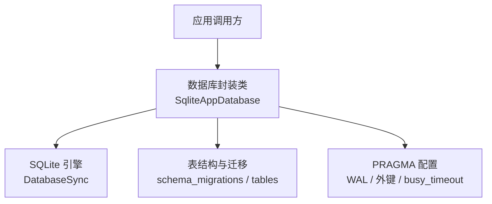
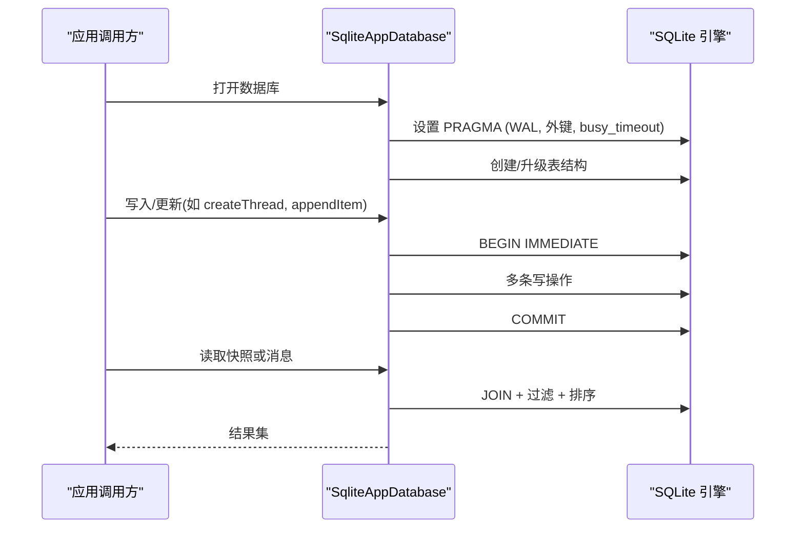
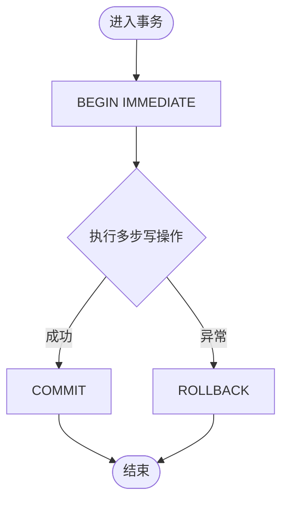
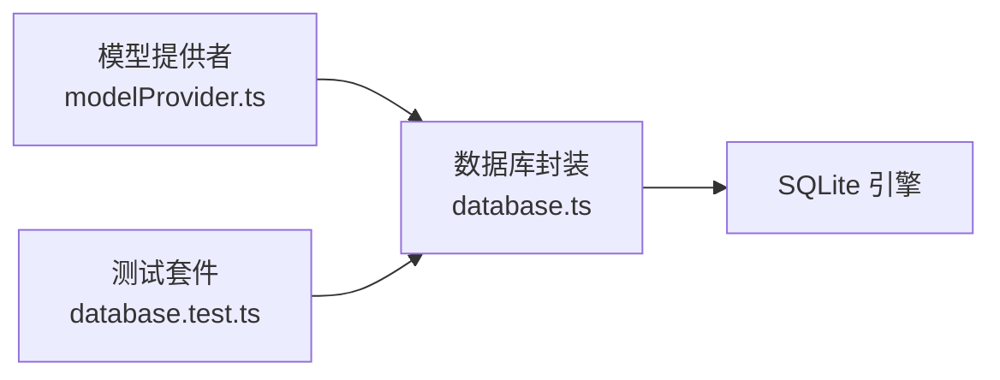

# 性能优化配置

<cite>
**本文引用的文件**
- [src/agent/database.ts](file://src/agent/database.ts)
- [tests/database.test.ts](file://tests/database.test.ts)
- [src/agent/modelProvider.ts](file://src/agent/modelProvider.ts)
- [docs/superpowers/specs/2026-08-17-runtime-settings-and-model-metrics-design.md](file://docs/superpowers/specs/2026-08-17-runtime-settings-and-model-metrics-design.md)
</cite>

## 目录
1. [简介](#简介)
2. [项目结构](#项目结构)
3. [核心组件](#核心组件)
4. [架构总览](#架构总览)
5. [详细组件分析](#详细组件分析)
6. [依赖关系分析](#依赖关系分析)
7. [性能注意事项](#性能注意事项)
8. [故障排查指南](#故障排查指南)
9. [结论](#结论)
10. [附录](#附录)

## 简介
本技术文档聚焦于本项目中 SQLite 数据库的性能优化实践，覆盖 PRAGMA 配置（WAL、外键约束、忙超时）、事务最佳实践（批量与原子性）、查询优化（JOIN、索引、执行计划）、大数据量分页与限制策略、连接池与资源管理建议、性能监控指标与调优方法，以及常见问题与解决方案。内容基于代码库中的实际实现与测试用例进行归纳与提炼。

## 项目结构
与数据库性能直接相关的核心位于应用代理层的数据库封装模块，负责：
- 初始化并配置 SQLite 引擎参数
- 定义数据模型与迁移
- 提供高内聚的读写 API，统一使用事务保证一致性
- 在启动时修复历史状态与合并流式片段，降低读取成本

图表来源
- [src/agent/database.ts:731-737](file://src/agent/database.ts#L731-L737)
- [src/agent/database.ts:739-837](file://src/agent/database.ts#L739-L837)

章节来源
- [src/agent/database.ts:731-837](file://src/agent/database.ts#L731-L837)

## 核心组件
- 数据库封装类：集中实现所有持久化操作，统一通过事务包装，确保一致性与可恢复性。
- 配置与迁移：启动时设置 WAL、外键约束、忙超时；创建必要表并执行增量迁移。
- 流式数据合并：将同一逻辑流的多个片段合并为单条记录，减少后续读取与序列化开销。
- 运行指标存储：将每次模型运行的关键指标以结构化 JSON 形式持久化，便于分析与可视化。

章节来源
- [src/agent/database.ts:150-154](file://src/agent/database.ts#L150-L154)
- [src/agent/database.ts:731-837](file://src/agent/database.ts#L731-L837)
- [src/agent/database.ts:945-979](file://src/agent/database.ts#L945-L979)
- [src/agent/database.ts:1270-1289](file://src/agent/database.ts#L1270-L1289)

## 架构总览
下图展示了从应用层到 SQLite 的调用路径，以及事务边界与关键配置点。

图表来源
- [src/agent/database.ts:731-737](file://src/agent/database.ts#L731-L737)
- [src/agent/database.ts:1203-1212](file://src/agent/database.ts#L1203-L1212)
- [src/agent/database.ts:156-216](file://src/agent/database.ts#L156-L216)

## 详细组件分析

### PRAGMA 配置选项与作用
- WAL 模式：提升并发读性能与崩溃恢复能力，降低锁竞争。
- 外键约束启用：保障引用完整性，避免脏数据导致后续查询变慢或错误。
- 忙超时设置：当数据库被其他进程/线程占用时，等待指定时长后返回错误，避免无限阻塞。

这些配置在数据库初始化阶段统一设置，确保整个生命周期生效。

章节来源
- [src/agent/database.ts:731-737](file://src/agent/database.ts#L731-L737)

### 事务处理最佳实践
- 统一事务封装：所有写操作均通过事务包装，失败自动回滚，保证一致性。
- 批量操作：将相关写操作放入同一事务，减少提交次数与日志开销。
- 原子性保证：复杂流程（如完成一次对话轮次）在单个事务中完成状态变更与关联数据更新。

图表来源
- [src/agent/database.ts:1203-1212](file://src/agent/database.ts#L1203-L1212)

章节来源
- [src/agent/database.ts:227-241](file://src/agent/database.ts#L227-L241)
- [src/agent/database.ts:438-464](file://src/agent/database.ts#L438-L464)
- [src/agent/database.ts:466-488](file://src/agent/database.ts#L466-L488)
- [src/agent/database.ts:987-993](file://src/agent/database.ts#L987-L993)

### 查询优化技巧
- JOIN 操作：在获取快照与消息列表时，通过 JOIN 关联主表与子表，并按时间排序，减少多次往返。
- 索引使用：当前未显式创建额外索引；可通过 EXPLAIN QUERY PLAN 评估现有查询是否命中主键或隐式索引。
- 查询计划分析：对热点查询使用 EXPLAIN QUERY PLAN 检查扫描方式与排序成本，必要时考虑添加索引或改写查询。

示例路径参考：
- 快照构建中的 JOIN 与排序：[src/agent/database.ts:156-216](file://src/agent/database.ts#L156-L216)
- 按线程拉取消息并合并流式片段：[src/agent/database.ts:335-358](file://src/agent/database.ts#L335-L358)

章节来源
- [src/agent/database.ts:156-216](file://src/agent/database.ts#L156-L216)
- [src/agent/database.ts:335-358](file://src/agent/database.ts#L335-L358)

### 大数据量下的分页与限制策略
- 上下文消息限制：通过运行时设置控制上下文消息数量上限，避免一次性加载过多数据。
- 默认限制与归一化：对传入的限制值进行范围钳制，防止过大或非法值影响性能。
- 读取侧裁剪：在返回前对结果进行切片，仅保留最近 N 条消息，降低内存与传输成本。

章节来源
- [src/agent/database.ts:319-333](file://src/agent/database.ts#L319-L333)
- [src/agent/database.ts:882-900](file://src/agent/database.ts#L882-L900)
- [src/agent/database.ts:1390-1395](file://src/agent/database.ts#L1390-L1395)

### 连接池配置与资源管理建议
- 连接实例：当前采用单例 DatabaseSync 实例，适合桌面端进程内使用。
- 超时配置：构造时传入超时参数，配合 busy_timeout 共同缓解并发冲突。
- 资源释放：提供 close 方法，确保关闭数据库句柄，避免资源泄漏。

章节来源
- [src/agent/database.ts:1215-1217](file://src/agent/database.ts#L1215-L1217)
- [src/agent/database.ts:727-729](file://src/agent/database.ts#L727-L729)

### 性能监控指标与调优方法
- 指标采集：每次模型运行记录请求/响应耗时、首 Token 时间、Token 用量、速率来源等。
- 指标存储：将指标序列化为 JSON 存入 turns 表的 metrics 字段，支持跨重启持久化。
- 调优方向：结合 UI 展示与后端统计，定位瓶颈（网络延迟、模型吞吐、上下文大小），调整上下文限制与并发度。

章节来源
- [src/agent/modelProvider.ts:157-181](file://src/agent/modelProvider.ts#L157-L181)
- [docs/superpowers/specs/2026-08-17-runtime-settings-and-model-metrics-design.md:89-108](file://docs/superpowers/specs/2026-08-17-runtime-settings-and-model-metrics-design.md#L89-L108)
- [src/agent/database.ts:1270-1289](file://src/agent/database.ts#L1270-L1289)

## 依赖关系分析
- 数据库封装依赖 SQLite 引擎，并通过 PRAGMA 与事务控制行为。
- 模型提供者负责采集与计算性能指标，并将结果持久化到数据库。
- 测试用例验证了迁移、合并、原子性等关键行为，间接反映性能与稳定性设计。

图表来源
- [src/agent/modelProvider.ts:157-181](file://src/agent/modelProvider.ts#L157-L181)
- [src/agent/database.ts:731-737](file://src/agent/database.ts#L731-L737)
- [tests/database.test.ts:485-511](file://tests/database.test.ts#L485-L511)

章节来源
- [src/agent/modelProvider.ts:157-181](file://src/agent/modelProvider.ts#L157-L181)
- [src/agent/database.ts:731-737](file://src/agent/database.ts#L731-L737)
- [tests/database.test.ts:485-511](file://tests/database.test.ts#L485-L511)

## 性能注意事项
- 优先使用 WAL 模式以提升并发读与恢复速度。
- 所有写操作尽量纳入事务，减少提交次数与锁竞争。
- 对高频读取路径进行 EXPLAIN QUERY PLAN 分析，必要时增加合适索引。
- 合理设置上下文消息限制，避免大对象序列化与传输开销。
- 关注模型运行指标，结合业务场景调整并发与输出限制。

## 故障排查指南
- 事务回滚验证：当某一步写失败时，整体事务回滚，保持数据一致性。
- 流式片段合并：重复追加同一流的数据会被合并为单条记录，避免膨胀。
- 历史状态修复：启动时修复中断或未完成的轮次，确保状态一致。
- 指标持久化：完成轮次时将指标写入数据库，重启后可恢复查看。

章节来源
- [src/agent/database.ts:1203-1212](file://src/agent/database.ts#L1203-L1212)
- [src/agent/database.ts:945-979](file://src/agent/database.ts#L945-L979)
- [src/agent/database.ts:1137-1194](file://src/agent/database.ts#L1137-L1194)
- [tests/database.test.ts:485-511](file://tests/database.test.ts#L485-L511)

## 结论
本项目通过统一的数据库封装、严格的 PRAGMA 配置与事务边界、流式数据的合并策略，以及完善的运行指标采集与持久化，构建了稳定且高效的本地 SQLite 数据层。在此基础上，建议持续对热点查询进行执行计划分析与索引优化，并结合业务负载调整上下文限制与并发策略，以获得更优的整体性能。

## 附录
- 常用 PRAGMA 参考：journal_mode=WAL、foreign_keys=ON、busy_timeout=毫秒数
- 事务边界：BEGIN IMMEDIATE ... COMMIT/ROLLBACK
- 指标字段：durationMs、timeToFirstTokenMs、tokensPerSecond、usageSource、speedSource