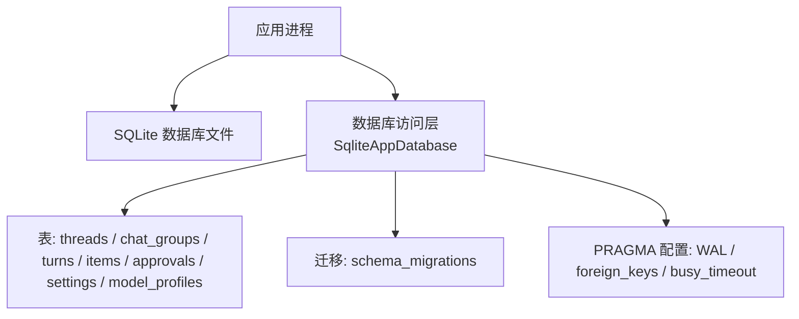
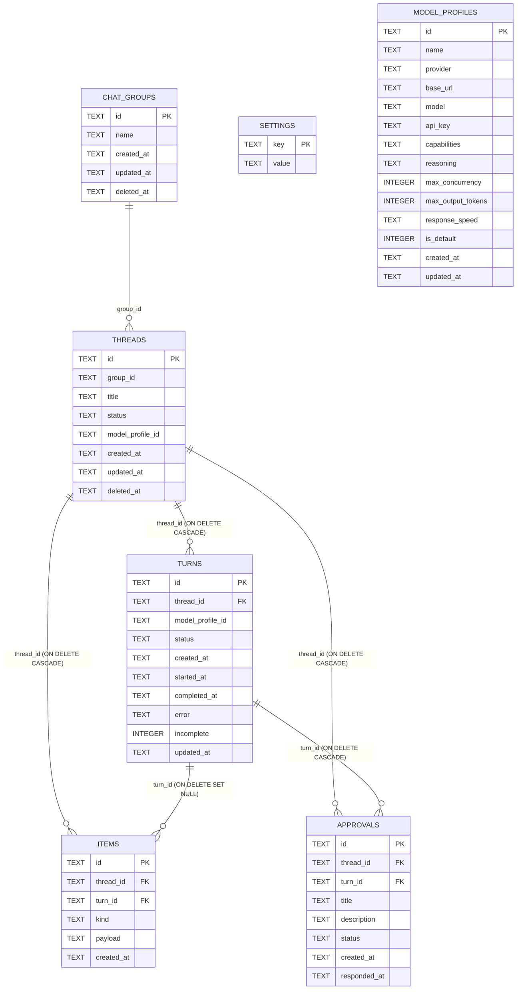
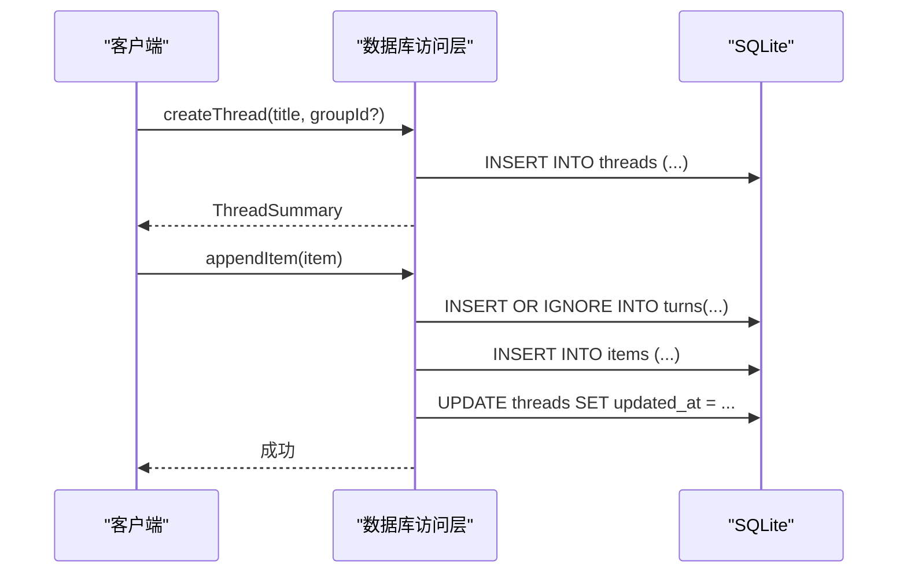
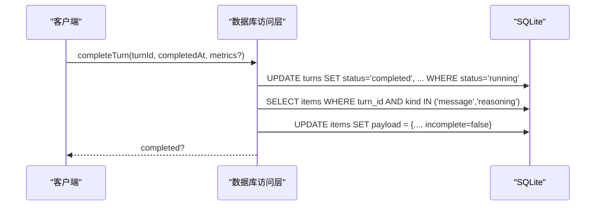
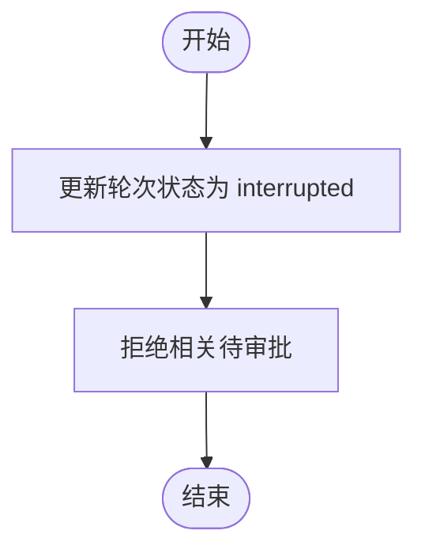
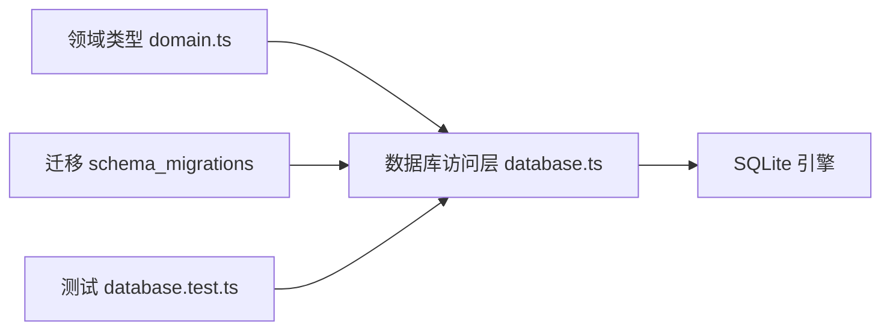

# 数据库架构设计

<cite>
**本文引用的文件**
- [src/agent/database.ts](file://src/agent/database.ts)
- [tests/database.test.ts](file://tests/database.test.ts)
- [src/shared/domain.ts](file://src/shared/domain.ts)
</cite>

## 目录
1. [简介](#简介)
2. [项目结构](#项目结构)
3. [核心组件](#核心组件)
4. [架构总览](#架构总览)
5. [详细组件分析](#详细组件分析)
6. [依赖关系分析](#依赖关系分析)
7. [性能考虑](#性能考虑)
8. [故障排查指南](#故障排查指南)
9. [结论](#结论)
10. [附录](#附录)

## 简介
本技术文档围绕 SQLite 应用数据库的架构与实现进行系统化说明，覆盖表结构设计、主外键约束、索引策略与查询优化、数据库初始化配置（WAL 模式、外键约束启用、忙超时）、数据迁移机制（schema_migrations 版本管理）以及 ER 图与性能调优建议。该数据库用于持久化对话线程、会话组、轮次、消息与推理片段、审批流、系统设置与模型配置等核心业务实体。

## 项目结构
- 数据库定义与迁移逻辑集中在应用层数据库模块中，通过 SQLite 同步接口创建并维护表结构、默认数据与迁移脚本。
- 领域类型定义在共享域文件中，用于描述线程、轮次、项、审批、设置、模型配置等数据结构。
- 测试用例覆盖了迁移路径、历史数据修复、默认预设注入等行为验证。

图表来源
- [src/agent/database.ts:629-723](file://src/agent/database.ts#L629-L723)
- [src/agent/database.ts:860-872](file://src/agent/database.ts#L860-L872)

章节来源
- [src/agent/database.ts:629-723](file://src/agent/database.ts#L629-L723)
- [src/agent/database.ts:860-872](file://src/agent/database.ts#L860-L872)

## 核心组件
- 数据库访问类：封装连接、配置、建表、迁移、事务、读写操作。
- 领域模型映射：将行记录映射为领域对象，处理 JSON 字段解析与校验。
- 迁移管理器：基于 schema_migrations 的版本控制，支持增量列添加、数据修复与预设注入。
- 配置与默认值：WAL 模式、外键约束、忙超时、默认聊天组、默认模型配置等。

章节来源
- [src/agent/database.ts:136-140](file://src/agent/database.ts#L136-L140)
- [src/agent/database.ts:629-723](file://src/agent/database.ts#L629-L723)
- [src/agent/database.ts:860-872](file://src/agent/database.ts#L860-L872)
- [src/shared/domain.ts:1-200](file://src/shared/domain.ts#L1-L200)

## 架构总览
下图展示了数据库的核心表及其关系，包括软删除、级联删除与空值行为。

图表来源
- [src/agent/database.ts:639-714](file://src/agent/database.ts#L639-L714)

章节来源
- [src/agent/database.ts:639-714](file://src/agent/database.ts#L639-L714)

## 详细组件分析

### 表结构与字段设计
- schema_migrations
  - 用途：记录已应用的迁移版本号与时间戳，保证幂等迁移。
  - 关键字段：version（主键）、applied_at（非空）。
  - 参考位置：[src/agent/database.ts:639-642](file://src/agent/database.ts#L639-L642)

- threads
  - 用途：对话线程，包含标题、状态、关联模型配置、时间戳与软删除标记。
  - 关键字段：id（主键）、group_id、title（非空）、status（非空）、model_profile_id、created_at（非空）、updated_at（非空）、deleted_at。
  - 参考位置：[src/agent/database.ts:644-653](file://src/agent/database.ts#L644-L653)

- chat_groups
  - 用途：会话分组，支持软删除。
  - 关键字段：id（主键）、name（非空）、created_at（非空）、updated_at（非空）、deleted_at。
  - 参考位置：[src/agent/database.ts:655-661](file://src/agent/database.ts#L655-L661)

- turns
  - 用途：一轮交互的生命周期，包含状态、开始/完成时间、错误信息、是否未完成、指标 JSON。
  - 关键字段：id（主键）、thread_id（外键，ON DELETE CASCADE）、model_profile_id、status（非空）、created_at（非空）、started_at、completed_at、error、incomplete（默认 1）、updated_at（非空）。
  - 参考位置：[src/agent/database.ts:663-674](file://src/agent/database.ts#L663-L674)

- items
  - 用途：消息、推理片段、工具调用、变更事件等，payload 以 JSON 存储。
  - 关键字段：id（主键）、thread_id（外键，ON DELETE CASCADE）、turn_id（外键，ON DELETE SET NULL）、kind（非空）、payload（非空）、created_at（非空）。
  - 参考位置：[src/agent/database.ts:676-683](file://src/agent/database.ts#L676-L683)

- approvals
  - 用途：审批流，关联线程与轮次，支持响应时间。
  - 关键字段：id（主键）、thread_id（外键，ON DELETE CASCADE）、turn_id（外键，ON DELETE CASCADE）、title（非空）、description（非空）、status（非空）、created_at（非空）、responded_at。
  - 参考位置：[src/agent/database.ts:685-694](file://src/agent/database.ts#L685-L694)

- settings
  - 用途：键值型应用设置，如主题、语言、活跃模型配置 ID、显示选项等。
  - 关键字段：key（主键）、value（非空）。
  - 参考位置：[src/agent/database.ts:696-699](file://src/agent/database.ts#L696-L699)

- model_profiles
  - 用途：模型配置，包含提供商、基础 URL、模型名、能力、推理设置、并发与输出限制、是否默认等。
  - 关键字段：id（主键）、name（非空）、provider（非空）、base_url（非空）、model（非空）、api_key、capabilities（非空）、reasoning（非空）、max_concurrency（默认 1）、max_output_tokens（默认 2048）、response_speed、is_default（非空）、created_at（非空）、updated_at（非空）。
  - 参考位置：[src/agent/database.ts:701-714](file://src/agent/database.ts#L701-L714)

章节来源
- [src/agent/database.ts:639-714](file://src/agent/database.ts#L639-L714)
- [src/shared/domain.ts:1-200](file://src/shared/domain.ts#L1-L200)

### 主键与外键关系
- 主键
  - 所有核心表均使用 TEXT 类型的主键 id，便于跨进程/客户端生成唯一标识。
  - schema_migrations 使用 version 作为主键，确保迁移顺序与幂等性。

- 外键
  - turns.thread_id → threads.id，ON DELETE CASCADE：删除线程时级联删除其轮次。
  - items.thread_id → threads.id，ON DELETE CASCADE：删除线程时级联删除其项。
  - items.turn_id → turns.id，ON DELETE SET NULL：删除轮次时将项的外键置空，保留项的历史。
  - approvals.thread_id → threads.id，ON DELETE CASCADE：删除线程时级联删除审批。
  - approvals.turn_id → turns.id，ON DELETE CASCADE：删除轮次时级联删除审批。

- 软删除
  - threads 与 chat_groups 使用 deleted_at 字段实现软删除；查询时需过滤 deleted_at IS NULL。

章节来源
- [src/agent/database.ts:639-714](file://src/agent/database.ts#L639-L714)

### 索引策略与查询优化
- 当前实现未显式创建额外索引，主要依赖主键与外键关系。
- 常见查询模式与优化建议：
  - 按线程获取消息：items 表按 thread_id 过滤，建议在 items 上建立 (thread_id, created_at, id) 复合索引以提升排序与分页性能。
  - 获取线程列表：threads 表按 updated_at 排序，建议在 threads 上建立 (updated_at DESC, id) 索引。
  - 获取轮次列表：turns 表按 created_at 排序，建议在 turns 上建立 (thread_id, created_at ASC, id ASC) 复合索引。
  - 审批查询：approvals 表按 thread_id 或 turn_id 过滤，可考虑相应索引。
  - 模型配置读取：model_profiles 按 is_default 与 updated_at 排序，建议建立 (is_default DESC, updated_at DESC) 索引。

注意：上述索引为优化建议，实际需根据查询负载与写入频率评估收益与维护成本。

章节来源
- [src/agent/database.ts:142-200](file://src/agent/database.ts#L142-L200)
- [src/agent/database.ts:320-343](file://src/agent/database.ts#L320-L343)
- [src/agent/database.ts:784-789](file://src/agent/database.ts#L784-L789)

### 数据库初始化配置
- WAL 模式：开启写前日志，提升并发读性能与崩溃恢复能力。
- 外键约束：启用外键检查，确保引用完整性。
- 忙超时：设置 busy_timeout 为 5000ms，避免锁竞争导致的立即失败。
- 默认聊天组：首次启动时插入默认工作区分组，并将无组的线程归属到默认组。
- 默认设置：初始化主题、语言、活跃模型配置 ID、显示选项等。

章节来源
- [src/agent/database.ts:629-635](file://src/agent/database.ts#L629-L635)
- [src/agent/database.ts:716-723](file://src/agent/database.ts#L716-L723)
- [src/agent/database.ts:804-813](file://src/agent/database.ts#L804-L813)

### 数据迁移机制
- 版本管理：通过 schema_migrations 表记录已应用迁移版本与时间戳，确保幂等执行。
- 迁移流程：
  - 检查目标版本是否已应用，若未应用则执行迁移函数并记录版本。
  - 迁移内容包括新增列、数据修复、默认预设注入等。
- 具体迁移：
  - 版本 1：初始建表与默认设置。
  - 版本 2：合并助手消息片段，减少冗余项。
  - 版本 3：修复历史轮次完成状态。
  - 版本 4：为 turns 增加 metrics 字段。
  - 版本 5：修复误标历史完成状态。
  - 版本 6：为 model_profiles 增加 max_output_tokens 字段。
  - 版本 7：修复或注入本地 Qwen 预设模型配置。

章节来源
- [src/agent/database.ts:716-758](file://src/agent/database.ts#L716-L758)
- [src/agent/database.ts:860-872](file://src/agent/database.ts#L860-L872)
- [tests/database.test.ts:110-115](file://tests/database.test.ts#L110-L115)

### 关键业务流程时序

#### 创建线程与追加消息

图表来源
- [src/agent/database.ts:243-275](file://src/agent/database.ts#L243-L275)
- [src/agent/database.ts:475-499](file://src/agent/database.ts#L475-L499)

章节来源
- [src/agent/database.ts:243-275](file://src/agent/database.ts#L243-L275)
- [src/agent/database.ts:475-499](file://src/agent/database.ts#L475-L499)

#### 完成轮次与更新项状态

图表来源
- [src/agent/database.ts:423-449](file://src/agent/database.ts#L423-L449)

章节来源
- [src/agent/database.ts:423-449](file://src/agent/database.ts#L423-L449)

#### 中断未完成轮次与清理审批

图表来源
- [src/agent/database.ts:451-473](file://src/agent/database.ts#L451-L473)

章节来源
- [src/agent/database.ts:451-473](file://src/agent/database.ts#L451-L473)

## 依赖关系分析
- 数据库访问层依赖领域类型定义，确保数据一致性。
- 迁移逻辑依赖 schema_migrations 表，保证版本演进的可追溯性与幂等性。
- 测试用例覆盖迁移路径与数据修复，保障向后兼容。

图表来源
- [src/shared/domain.ts:1-200](file://src/shared/domain.ts#L1-L200)
- [src/agent/database.ts:629-723](file://src/agent/database.ts#L629-L723)
- [tests/database.test.ts:110-115](file://tests/database.test.ts#L110-L115)

章节来源
- [src/shared/domain.ts:1-200](file://src/shared/domain.ts#L1-L200)
- [src/agent/database.ts:629-723](file://src/agent/database.ts#L629-L723)
- [tests/database.test.ts:110-115](file://tests/database.test.ts#L110-L115)

## 性能考虑
- 使用 WAL 模式提高并发读性能与崩溃恢复能力。
- 启用外键约束确保数据一致性，但需注意写入时的级联开销。
- 设置忙超时避免锁竞争导致的应用阻塞。
- 针对高频查询场景建议添加复合索引：
  - items(thread_id, created_at, id)
  - turns(thread_id, created_at ASC, id ASC)
  - threads(updated_at DESC, id)
  - model_profiles(is_default DESC, updated_at DESC)
- 合并流式项以减少重复写入与读取开销。
- 合理设置上下文消息限制，避免大结果集带来的内存与网络压力。

章节来源
- [src/agent/database.ts:629-635](file://src/agent/database.ts#L629-L635)
- [src/agent/database.ts:824-858](file://src/agent/database.ts#L824-L858)
- [src/agent/database.ts:761-779](file://src/agent/database.ts#L761-L779)

## 故障排查指南
- 迁移失败或版本不一致：检查 schema_migrations 表中的版本记录，确认迁移是否完整应用。
- 历史数据修复：关注版本 3、5 的数据修复逻辑，确保轮次状态与项的 incomplete 标志一致。
- 默认预设缺失：版本 7 会修复或注入本地 Qwen 预设，检查 model_profiles 与 settings.activeModelProfileId。
- 锁冲突与超时：调整 busy_timeout 与应用层超时，避免长时间阻塞。
- 软删除数据可见性：查询时需过滤 deleted_at IS NULL，避免看到已删除的线程或分组。

章节来源
- [src/agent/database.ts:716-758](file://src/agent/database.ts#L716-L758)
- [src/agent/database.ts:860-872](file://src/agent/database.ts#L860-L872)
- [tests/database.test.ts:110-115](file://tests/database.test.ts#L110-L115)

## 结论
该 SQLite 数据库架构通过清晰的表设计、严格的外键约束、完善的迁移机制与合理的初始化配置，支撑了对话线程、轮次、消息、审批与模型配置等核心业务的稳定运行。结合索引优化与性能调优建议，可在高并发与大数据量场景下保持良好性能与一致性。

## 附录
- 领域类型参考：线程、轮次、项、审批、设置、模型配置等类型定义。
- 测试用例参考：迁移路径、历史数据修复、默认预设注入等行为验证。

章节来源
- [src/shared/domain.ts:1-200](file://src/shared/domain.ts#L1-L200)
- [tests/database.test.ts:110-115](file://tests/database.test.ts#L110-L115)