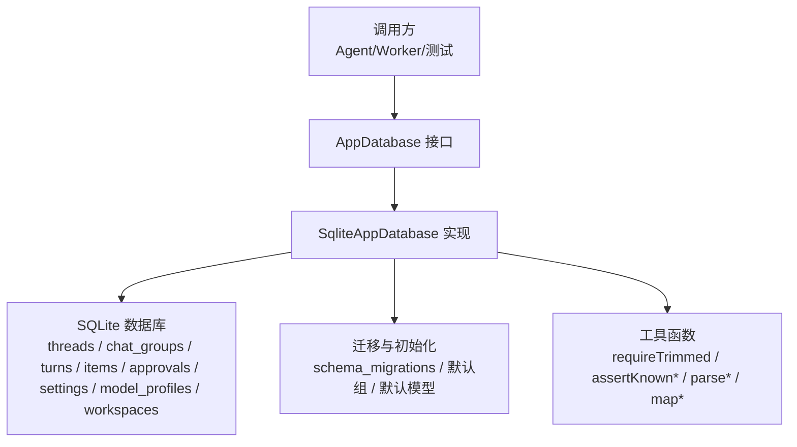
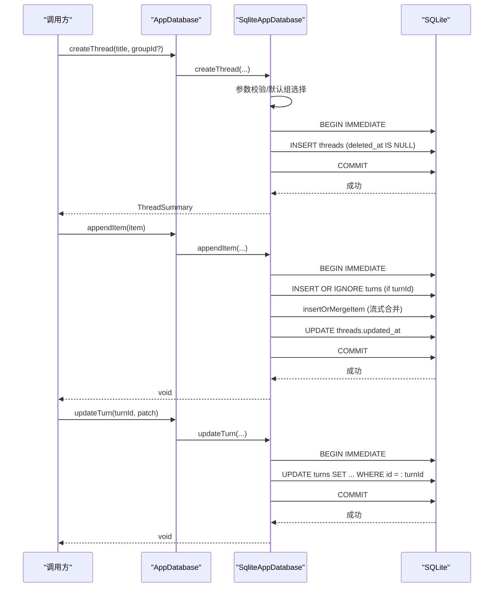
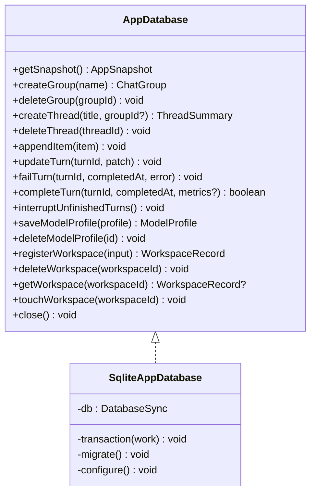

# CRUD 操作模式

<cite>
**本文引用的文件**
- [database.ts](file://src/agent/database.ts)
- [domain.ts](file://src/shared/domain.ts)
- [database.test.ts](file://tests/database.test.ts)
</cite>

## 目录
1. [简介](#简介)
2. [项目结构](#项目结构)
3. [核心组件](#核心组件)
4. [架构总览](#架构总览)
5. [详细组件分析](#详细组件分析)
6. [依赖关系分析](#依赖关系分析)
7. [性能考量](#性能考量)
8. [故障排查指南](#故障排查指南)
9. [结论](#结论)
10. [附录](#附录)

## 简介
本技术文档聚焦于 AppDatabase 接口的数据库 CRUD 操作模式，围绕 createGroup、createThread、appendItem、updateTurn、deleteGroup、deleteThread 等核心方法，系统说明参数校验、数据转换、错误处理、事务边界与一致性保证策略，并解释软删除实现与查询过滤逻辑。同时提供最佳实践建议与可复用的代码片段路径，帮助读者快速理解并正确使用该数据库层。

## 项目结构
本项目使用 SQLite（Node.js 内置 DatabaseSync）作为持久化存储，通过 SqliteAppDatabase 类实现 AppDatabase 接口，封装了聊天分组、会话线程、消息项、回合记录、模型配置与工作区等数据的增删改查。所有写操作均通过内部 transaction 包装，确保原子性与一致性；读操作在快照或单条查询中统一应用软删除过滤条件。

图表来源
- [database.ts:150-1217](file://src/agent/database.ts#L150-L1217)
- [database.ts:731-837](file://src/agent/database.ts#L731-L837)

章节来源
- [database.ts:1-1217](file://src/agent/database.ts#L1-L1217)
- [domain.ts:1-319](file://src/shared/domain.ts#L1-L319)

## 核心组件
- AppDatabase 接口：定义对外暴露的 CRUD 能力，包括创建/删除分组、创建/删除线程、追加消息项、更新回合状态、保存/删除模型配置、注册/删除工作区等。
- SqliteAppDatabase：基于 SQLite 的具体实现，负责 SQL 执行、数据映射、迁移、事务控制与一致性保障。
- 领域模型 domain.ts：定义 ChatGroup、ThreadSummary、Item、TurnRecord、ModelProfile、WorkspaceRecord 等类型，贯穿读写两端。

章节来源
- [database.ts:38-66](file://src/agent/database.ts#L38-L66)
- [domain.ts:7-319](file://src/shared/domain.ts#L7-L319)

## 架构总览
下图展示了关键 CRUD 流程中的事务边界、软删除过滤与数据一致性策略。

图表来源
- [database.ts:258-290](file://src/agent/database.ts#L258-L290)
- [database.ts:490-514](file://src/agent/database.ts#L490-L514)
- [database.ts:382-417](file://src/agent/database.ts#L382-L417)
- [database.ts:1203-1212](file://src/agent/database.ts#L1203-L1212)

## 详细组件分析

### createGroup(name): ChatGroup
- 参数验证：名称经 requireTrimmed 清理并校验非空，否则抛出错误。
- 数据转换：生成 UUID 与时间戳，构造 ChatGroup。
- 事务边界：写入 chat_groups 表，设置 deleted_at 为 NULL，表示未删除。
- 一致性：单行插入，无外部依赖，事务内提交。
- 软删除：删除时通过 deleteGroup 将 deleted_at 设置为当前时间，后续查询过滤 deleted_at IS NULL。

章节来源
- [database.ts:218-242](file://src/agent/database.ts#L218-L242)
- [database.ts:244-256](file://src/agent/database.ts#L244-L256)
- [database.ts:1406-1412](file://src/agent/database.ts#L1406-L1412)

### createThread(title: string, groupId?: string): ThreadSummary
- 参数验证：可选 groupId 为空时使用默认组；assertKnownGroup 校验 group 存在且未删除。
- 数据转换：生成 UUID、时间戳，设置初始 status 为 ready，modelProfileId 取自当前设置。
- 事务边界：INSERT threads，deleted_at 为 NULL。
- 一致性：依赖 defaultGroupId 与 activeModelProfileId 的设置，确保线程归属与模型配置一致。
- 软删除：deleteThread 将 deleted_at 置位，查询时通过 JOIN 或 WHERE 过滤。

章节来源
- [database.ts:258-290](file://src/agent/database.ts#L258-L290)
- [database.ts:292-299](file://src/agent/database.ts#L292-L299)
- [database.ts:920-934](file://src/agent/database.ts#L920-L934)
- [database.ts:1421-1426](file://src/agent/database.ts#L1421-L1426)

### appendItem(item: Item): void
- 参数验证：item 需满足 domain 类型约束；解析与合并逻辑由内部函数完成。
- 数据转换：若 item.turnId 存在，则 INSERT OR IGNORE turns（避免重复），并将 incomplete 标记为 true；随后 insertOrMergeItem 进行流式文本合并（assistant 消息与 reasoning 按逻辑键聚合）。
- 事务边界：BEGIN IMMEDIATE -> 写入 turns/items -> 更新 threads.updated_at -> COMMIT。
- 一致性：同一 turn 的 assistant 消息与 reasoning 仅保留一条聚合结果，避免历史膨胀；更新 threads.updated_at 以反映最新活动。
- 软删除：读取消息时通过 JOIN threads 并过滤 deleted_at IS NULL。

章节来源
- [database.ts:490-514](file://src/agent/database.ts#L490-L514)
- [database.ts:945-979](file://src/agent/database.ts#L945-L979)
- [database.ts:1241-1253](file://src/agent/database.ts#L1241-L1253)

### updateTurn(turnId: string, patch: Partial<TurnRecord>): void
- 参数验证：patch 仅允许更新 status、startedAt、completedAt、error、incomplete 字段。
- 数据转换：动态构建 SET 子句，统一更新 updated_at。
- 事务边界：BEGIN IMMEDIATE -> UPDATE turns -> COMMIT。
- 一致性：只更新传入字段，避免覆盖其他状态；当 completeTurn/failTurn 时，会结合 incomplete 与状态机进行 CAS 检查。
- 软删除：不直接涉及软删除，但受限于所属 thread 的可见性。

章节来源
- [database.ts:382-417](file://src/agent/database.ts#L382-L417)

### deleteGroup(groupId: string): void
- 参数验证：groupId 用于定位目标组。
- 数据转换：将 chat_groups.deleted_at 与 threads.deleted_at 设置为当前时间，实现级联软删除。
- 事务边界：BEGIN IMMEDIATE -> 更新 groups 与 threads -> COMMIT。
- 一致性：确保组下所有线程一并隐藏，避免孤儿数据出现在快照中。
- 软删除：后续查询通过 deleted_at IS NULL 过滤。

章节来源
- [database.ts:244-256](file://src/agent/database.ts#L244-L256)

### deleteThread(threadId: string): void
- 参数验证：threadId 用于定位目标线程。
- 数据转换：将 threads.deleted_at 设置为当前时间。
- 事务边界：BEGIN IMMEDIATE -> UPDATE threads -> COMMIT。
- 一致性：关联的 approvals 与 items 仍保留，但在快照中因 JOIN 过滤而不显示。
- 软删除：getSnapshot 与 getThreadMessages 均通过 t.deleted_at IS NULL 过滤。

章节来源
- [database.ts:292-299](file://src/agent/database.ts#L292-L299)
- [database.ts:156-216](file://src/agent/database.ts#L156-L216)
- [database.ts:335-358](file://src/agent/database.ts#L335-L358)

### 辅助与一致性机制
- failTurn：将 turns 状态设为 failed，incomplete=1，并拒绝 pending 状态的 approvals。
- completeTurn：仅在 turns.status='running' 时更新为 completed，incomplete=0，并批量修正对应 items 的 incomplete=false。
- interruptUnfinishedTurns：启动时将 queued/running/cancelling 的 turns 标记为 interrupted，并拒绝相关 pending approvals。
- 流式合并：insertOrMergeItem 根据 logicalStreamKey 对 assistant 消息与 reasoning 进行聚合，保持每个 turn 仅一条有效流式条目。

章节来源
- [database.ts:419-488](file://src/agent/database.ts#L419-L488)
- [database.ts:945-979](file://src/agent/database.ts#L945-L979)

## 依赖关系分析
- AppDatabase 接口与 SqliteAppDatabase 实现解耦，便于测试与替换。
- 领域模型 domain.ts 被 database.ts 广泛引用，确保类型安全。
- 工具函数（requireTrimmed、assertKnownGroup、parseItem/map*）集中处理输入校验与数据转换，降低业务方法复杂度。
- 迁移脚本 ensureColumn/applyMigration 保证 schema 演进兼容。

图表来源
- [database.ts:38-66](file://src/agent/database.ts#L38-L66)
- [database.ts:150-1217](file://src/agent/database.ts#L150-L1217)

章节来源
- [database.ts:38-66](file://src/agent/database.ts#L38-L66)
- [database.ts:150-1217](file://src/agent/database.ts#L150-L1217)
- [domain.ts:7-319](file://src/shared/domain.ts#L7-L319)

## 性能考量
- WAL 模式与外键约束：启用 PRAGMA journal_mode=WAL 与 foreign_keys=ON，提升并发写入性能与数据完整性。
- 事务粒度：所有写操作均包裹在 BEGIN IMMEDIATE...COMMIT 中，减少锁竞争与不一致风险。
- 流式合并：insertOrMergeItem 通过逻辑键聚合 assistant/reasoning 条目，避免无限增长，提高快照读取效率。
- 索引与排序：快照查询按 created_at/updated_at 排序，建议在高频查询列上建立索引以提升性能（可按需扩展）。
- 上下文限制：contextMessageLimit 被 clamp 到 1~200，防止过大上下文导致内存压力。

章节来源
- [database.ts:731-737](file://src/agent/database.ts#L731-L737)
- [database.ts:1203-1212](file://src/agent/database.ts#L1203-L1212)
- [database.ts:945-979](file://src/agent/database.ts#L945-L979)
- [database.ts:1390-1395](file://src/agent/database.ts#L1390-L1395)

## 故障排查指南
- 参数校验失败：requireTrimmed 会在空字符串时抛出错误，检查传入 name/title/model/baseUrl 等是否已 trim 且非空。
- 未知分组/模型：assertKnownGroup/assertKnownModelProfile 会抛出错误，确认 ID 是否存在且未被软删除。
- 事务回滚：failTurn 与 completeTurn 内部可能因触发器或约束失败而回滚，检查 approvals 与 turns 的状态机约束。
- 软删除影响：getSnapshot/getThreadMessages 会过滤 deleted_at IS NULL，确认是否误删或需要恢复。
- 流式合并异常：若 assistant/reasoning 未合并，检查 logicalStreamKey 与 isTextStreamItem 判定逻辑。

章节来源
- [database.ts:1406-1426](file://src/agent/database.ts#L1406-L1426)
- [database.ts:419-488](file://src/agent/database.ts#L419-L488)
- [database.ts:156-216](file://src/agent/database.ts#L156-L216)
- [database.ts:945-979](file://src/agent/database.ts#L945-L979)

## 结论
AppDatabase 通过统一的接口与强类型领域模型，提供了健壮的 CRUD 能力。所有写操作均在事务中执行，确保原子性与一致性；软删除通过 deleted_at 字段与查询过滤实现，既保留历史又隐藏不可见数据；流式合并优化了消息存储与读取性能。遵循本文的最佳实践与故障排查建议，可有效避免常见陷阱并提升系统稳定性。

## 附录

### 软删除与查询过滤
- 软删除字段：chat_groups.deleted_at、threads.deleted_at。
- 查询过滤：getSnapshot 与 getThreadMessages 通过 JOIN threads 并添加 WHERE t.deleted_at IS NULL，确保软删除的数据不出现在快照与上下文中。

章节来源
- [database.ts:156-216](file://src/agent/database.ts#L156-L216)
- [database.ts:335-358](file://src/agent/database.ts#L335-L358)

### 事务边界与一致性策略
- 事务包装：transaction 使用 BEGIN IMMEDIATE 与 COMMIT/ROLLBACK，确保异常时回滚。
- 状态机一致性：completeTurn/failTurn/interruptUnfinishedTurns 通过状态与 incomplete 标志维护一致性，避免竞态。
- 审批一致性：failTurn 与 interruptUnfinishedTurns 会将 pending 的 approvals 置为 rejected，确保审批与回合状态一致。

章节来源
- [database.ts:1203-1212](file://src/agent/database.ts#L1203-L1212)
- [database.ts:419-488](file://src/agent/database.ts#L419-L488)

### 代码示例路径（参考）
- 创建分组与线程：[database.ts:218-290](file://src/agent/database.ts#L218-L290)
- 追加消息项与流式合并：[database.ts:490-514](file://src/agent/database.ts#L490-L514), [database.ts:945-979](file://src/agent/database.ts#L945-L979)
- 更新回合状态与完成/失败：[database.ts:382-417](file://src/agent/database.ts#L382-L417), [database.ts:419-488](file://src/agent/database.ts#L419-L488)
- 软删除与快照过滤：[database.ts:244-299](file://src/agent/database.ts#L244-L299), [database.ts:156-216](file://src/agent/database.ts#L156-L216)

### 测试用例参考
- 软删除与快照过滤：[database.test.ts:716-742](file://tests/database.test.ts#L716-L742)
- 流式合并与完成原子性：[database.test.ts:360-371](file://tests/database.test.ts#L360-L371), [database.test.ts:485-511](file://tests/database.test.ts#L485-L511)
- 中断与审批修复：[database.test.ts:373-428](file://tests/database.test.ts#L373-L428)