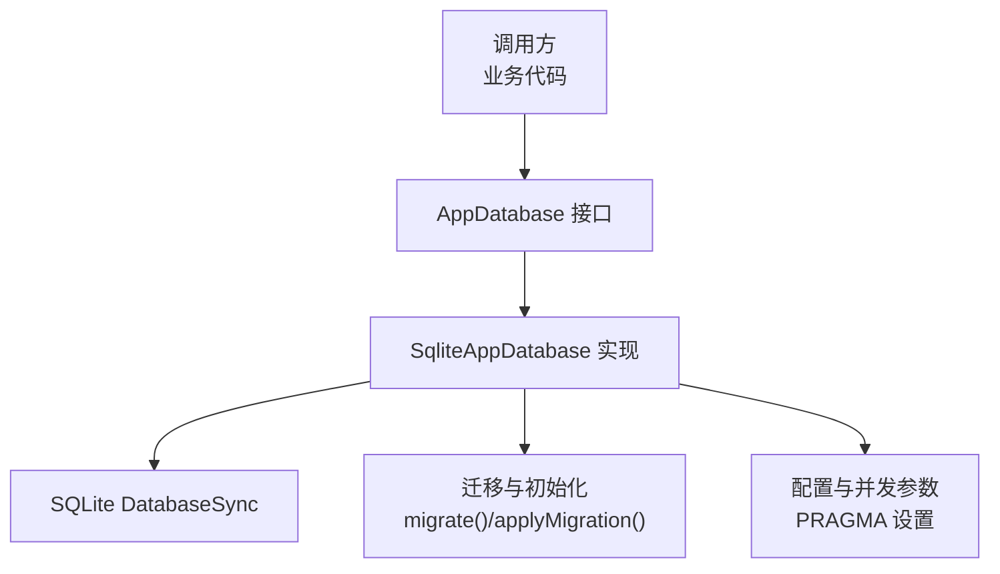
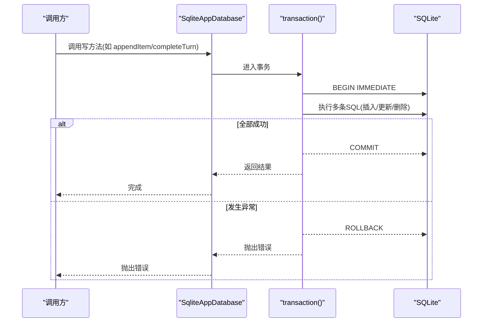
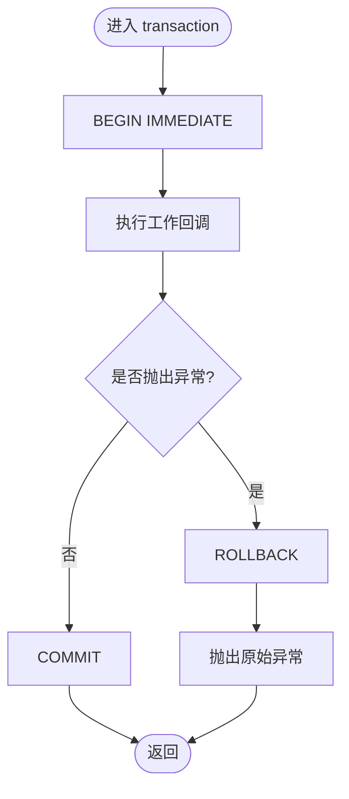
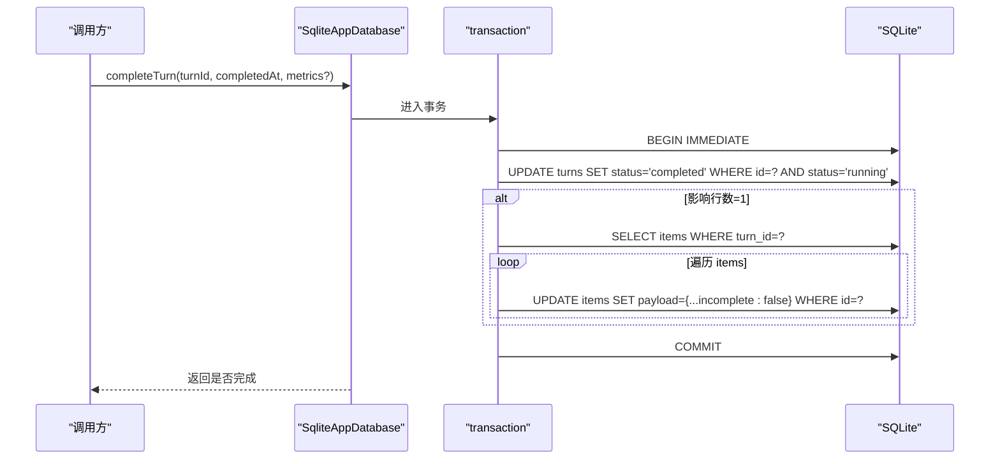
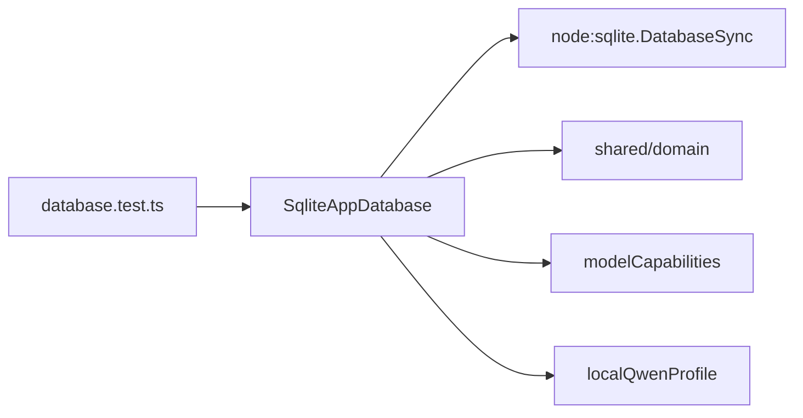

# 事务管理

<cite>
**本文引用的文件**
- [src/agent/database.ts](file://src/agent/database.ts)
- [tests/database.test.ts](file://tests/database.test.ts)
</cite>

## 目录
1. [简介](#简介)
2. [项目结构](#项目结构)
3. [核心组件](#核心组件)
4. [架构总览](#架构总览)
5. [详细组件分析](#详细组件分析)
6. [依赖关系分析](#依赖关系分析)
7. [性能考量](#性能考量)
8. [故障排查指南](#故障排查指南)
9. [结论](#结论)
10. [附录：使用示例与调试技巧](#附录使用示例与调试技巧)

## 简介
本技术文档聚焦于数据库事务管理的封装模式与执行机制，围绕 SQLite 的 BEGIN IMMEDIATE/COMMIT/ROLLBACK 策略，说明事务边界、嵌套行为、异常回滚、原子性保证与并发控制。同时总结批量更新、关联数据修改等常见组合模式，并给出性能优化建议、故障恢复策略以及基于测试用例的调试技巧。

## 项目结构
本项目将数据库访问封装在 agent 模块中，通过一个统一的数据库类对外暴露 AppDatabase 接口，所有写操作均通过内部 transaction 方法包裹，确保一致性。迁移逻辑、默认数据初始化、流式消息合并等也统一纳入事务或启动流程中。

图表来源
- [src/agent/database.ts:150-154](file://src/agent/database.ts#L150-L154)
- [src/agent/database.ts:731-737](file://src/agent/database.ts#L731-L737)
- [src/agent/database.ts:981-993](file://src/agent/database.ts#L981-L993)

章节来源
- [src/agent/database.ts:150-154](file://src/agent/database.ts#L150-L154)
- [src/agent/database.ts:731-737](file://src/agent/database.ts#L731-L737)
- [src/agent/database.ts:981-993](file://src/agent/database.ts#L981-L993)

## 核心组件
- SqliteAppDatabase：实现 AppDatabase 接口的具体数据库访问层，集中处理建表、迁移、读写、事务封装。
- openDatabase(path)：工厂函数，创建带超时配置的 SQLite 连接并返回数据库实例。
- transaction(work)：私有事务封装，使用 BEGIN IMMEDIATE 获取写锁，成功则 COMMIT，异常则 ROLLBACK 并抛出错误。
- migrate()/applyMigration(version, work)：按版本顺序执行迁移，每个迁移在独立事务中提交，失败会回滚整个迁移。
- 业务写入方法：如 createThread、appendItem、completeTurn、failTurn、saveModelProfile 等，均以 transaction 包裹多步 SQL，保证跨表一致性。

章节来源
- [src/agent/database.ts:38-66](file://src/agent/database.ts#L38-L66)
- [src/agent/database.ts:1203-1212](file://src/agent/database.ts#L1203-L1212)
- [src/agent/database.ts:1215-1217](file://src/agent/database.ts#L1215-L1217)
- [src/agent/database.ts:981-993](file://src/agent/database.ts#L981-L993)

## 架构总览
下图展示典型写操作的调用链与事务边界：上层业务方法构造参数，进入 transaction；内部执行多条 SQL（可能涉及多表）；成功提交，失败回滚并抛出异常。

图表来源
- [src/agent/database.ts:1203-1212](file://src/agent/database.ts#L1203-L1212)
- [src/agent/database.ts:490-514](file://src/agent/database.ts#L490-L514)
- [src/agent/database.ts:438-464](file://src/agent/database.ts#L438-L464)

## 详细组件分析

### 事务封装与执行机制
- 事务入口：所有写操作通过 this.transaction(() => {...}) 包裹。
- 锁定策略：BEGIN IMMEDIATE 立即获取写锁，避免后续写冲突导致的重试开销。
- 提交与回滚：try 块内执行用户回调；成功则 COMMIT；捕获异常后 ROLLBACK 并重新抛出，保证调用方可感知失败。
- 迁移事务：applyMigration 对每个未执行的迁移在独立事务中执行，确保迁移幂等且可回滚。

图表来源
- [src/agent/database.ts:1203-1212](file://src/agent/database.ts#L1203-L1212)

章节来源
- [src/agent/database.ts:1203-1212](file://src/agent/database.ts#L1203-L1212)
- [src/agent/database.ts:981-993](file://src/agent/database.ts#L981-L993)

### 事务边界定义与组合模式
- 单表/单行写入：如 createGroup、deleteThread，简单 INSERT/UPDATE，事务仅包含必要语句。
- 多表关联写入：
  - failTurn：同时更新 turns 状态与 approvals 状态，保证“失败”语义一致。
  - completeTurn：先 CAS 更新 turns 为 completed，再批量修正 items 中的 incomplete 标志，确保“完成”语义一致。
  - saveModelProfile：可能重置其他 profile 的 is_default、更新 settings、写入 model_profiles，并在无默认时自动设定默认值。
  - registerWorkspace：存在/不存在两条路径，分别 UPDATE 或 INSERT，均在事务中。
- 流式内容合并：appendItem 在事务内根据 logicalStreamKey 判断是否合并到已有项，避免产生过多碎片。

图表来源
- [src/agent/database.ts:438-464](file://src/agent/database.ts#L438-L464)

章节来源
- [src/agent/database.ts:419-436](file://src/agent/database.ts#L419-L436)
- [src/agent/database.ts:438-464](file://src/agent/database.ts#L438-L464)
- [src/agent/database.ts:541-621](file://src/agent/database.ts#L541-L621)
- [src/agent/database.ts:632-695](file://src/agent/database.ts#L632-L695)
- [src/agent/database.ts:490-514](file://src/agent/database.ts#L490-L514)

### 嵌套事务处理
- 当前实现不支持显式嵌套事务。若在同一线程中重复调用 transaction，外层已持有写锁，内层再次 BEGIN 将触发 SQLite 错误，从而被 catch 并 ROLLBACK，最终向上抛出异常。
- 建议：将多个相关写操作合并到一个事务中，避免嵌套；如需复用，应提取为同一事务内的子步骤而非再次开启事务。

章节来源
- [src/agent/database.ts:1203-1212](file://src/agent/database.ts#L1203-L1212)

### 异常回滚策略
- 任何在事务回调中抛出的异常都会导致 ROLLBACK，并原样抛出给调用方。
- 迁移失败也会回滚该迁移，不会部分应用。
- 测试中通过触发器强制报错，验证了 failTurn 的原子性与回滚行为。

章节来源
- [src/agent/database.ts:1203-1212](file://src/agent/database.ts#L1203-L1212)
- [tests/database.test.ts:430-458](file://tests/database.test.ts#L430-L458)

### 原子性保证
- 关键业务规则以事务为单位保证：
  - 完成一次对话轮次：turns 状态变更与 items 的 incomplete 标记在同一事务内完成。
  - 失败一次对话轮次：turns 与 approvals 的状态变更在同一事务内完成。
  - 模型配置保存：is_default 切换、settings 更新、model_profiles 写入在同一事务内完成。
- 迁移过程：每个迁移在独立事务中执行，保证迁移幂等与可回滚。

章节来源
- [src/agent/database.ts:438-464](file://src/agent/database.ts#L438-L464)
- [src/agent/database.ts:419-436](file://src/agent/database.ts#L419-L436)
- [src/agent/database.ts:541-621](file://src/agent/database.ts#L541-L621)
- [src/agent/database.ts:981-993](file://src/agent/database.ts#L981-L993)

### 并发控制机制
- PRAGMA busy_timeout = 5000：当数据库被其他进程/线程占用时，最多等待 5 秒，避免立即失败。
- PRAGMA foreign_keys = ON：启用外键约束，保证引用完整性。
- PRAGMA journal_mode = WAL：提升并发读能力，减少写阻塞。
- BEGIN IMMEDIATE：写前立即获取写锁，降低死锁概率，提高可预测性。
- 连接级 timeout：openDatabase 传入 { timeout: 5000 }，进一步限制底层连接等待时间。

章节来源
- [src/agent/database.ts:731-737](file://src/agent/database.ts#L731-L737)
- [src/agent/database.ts:1215-1217](file://src/agent/database.ts#L1215-L1217)

### 不同操作的事务组合模式
- 批量更新：completeTurn 在事务内读取并批量更新 items 的 incomplete 字段。
- 关联数据修改：failTurn 同时更新 turns 与 approvals；registerWorkspace 根据是否存在走不同分支但保持原子。
- 流式合并：appendItem 在事务内检测逻辑流键，合并文本片段，避免碎片化。
- 默认值与级联：saveModelProfile 可能重置其他记录的 is_default，并同步 settings，保证默认模型的一致性。

章节来源
- [src/agent/database.ts:438-464](file://src/agent/database.ts#L438-L464)
- [src/agent/database.ts:419-436](file://src/agent/database.ts#L419-L436)
- [src/agent/database.ts:632-695](file://src/agent/database.ts#L632-L695)
- [src/agent/database.ts:490-514](file://src/agent/database.ts#L490-L514)
- [src/agent/database.ts:541-621](file://src/agent/database.ts#L541-L621)

## 依赖关系分析
- SqliteAppDatabase 依赖 node:sqlite 的 DatabaseSync 进行持久化。
- 依赖 shared/domain 类型定义，保证数据结构一致性。
- 依赖 modelCapabilities 与 localQwenProfile 进行能力与预设配置归一化。
- 测试依赖 tests/database.test.ts 提供断言场景，覆盖迁移、原子性、并发与修复逻辑。

图表来源
- [src/agent/database.ts:1-37](file://src/agent/database.ts#L1-L37)
- [tests/database.test.ts:1-8](file://tests/database.test.ts#L1-L8)

章节来源
- [src/agent/database.ts:1-37](file://src/agent/database.ts#L1-L37)
- [tests/database.test.ts:1-8](file://tests/database.test.ts#L1-L8)

## 性能考量
- 使用 WAL 模式提升并发读性能，适合桌面端多进程/多线程场景。
- 使用 BEGIN IMMEDIATE 提前获取写锁，减少多次重试带来的开销。
- 合理拆分事务：将无关写操作分离到不同事务，缩短持锁时间。
- 批量更新尽量在一次事务内完成，减少往返与锁竞争。
- 流式内容合并减少碎片，降低查询与存储压力。
- 谨慎设置 busy_timeout 与连接 timeout，平衡可用性与时延。

[本节为通用指导，不直接分析具体文件]

## 故障排查指南
- 事务回滚验证：通过触发器或约束违反模拟失败，确认 ROLLBACK 生效。
- 迁移失败：检查 applyMigration 是否抛出异常，确认迁移幂等与回滚。
- 并发冲突：观察 busy_timeout 与连接 timeout 配置，必要时调整。
- 数据不一致：核对 completeTurn/failTurn 的多表更新是否在同一个事务内。
- 流式合并异常：检查 insertOrMergeItem 的逻辑流键生成与合并条件。

章节来源
- [tests/database.test.ts:430-458](file://tests/database.test.ts#L430-L458)
- [src/agent/database.ts:981-993](file://src/agent/database.ts#L981-L993)
- [src/agent/database.ts:438-464](file://src/agent/database.ts#L438-L464)
- [src/agent/database.ts:419-436](file://src/agent/database.ts#L419-L436)
- [src/agent/database.ts:945-979](file://src/agent/database.ts#L945-L979)

## 结论
本项目通过统一的 transaction 封装与严格的 BEGIN IMMEDIATE 策略，确保了写操作的原子性与一致性。结合 WAL、外键约束、busy_timeout 等配置，提供了良好的并发与可靠性保障。迁移系统保证了向后兼容与可回滚。建议在复杂业务中继续遵循“最小事务边界、最大原子性”的原则，并通过测试覆盖关键路径。

[本节为总结，不直接分析具体文件]

## 附录：使用示例与调试技巧
- 示例：完成一次对话轮次
  - 调用 completeTurn 后，turns 状态变为 completed，items 中对应 turn 的 incomplete 标记被置为 false，整个过程在单一事务内完成。
  - 参考路径：[src/agent/database.ts:438-464](file://src/agent/database.ts#L438-L464)
- 示例：失败一次对话轮次
  - 调用 failTurn 会同时更新 turns 与 approvals，保证失败语义一致。
  - 参考路径：[src/agent/database.ts:419-436](file://src/agent/database.ts#L419-L436)
- 示例：保存模型配置并设为默认
  - saveModelProfile 会在事务内重置其他默认、写入 settings 与 model_profiles，保证默认模型一致性。
  - 参考路径：[src/agent/database.ts:541-621](file://src/agent/database.ts#L541-L621)
- 调试技巧：
  - 使用测试用例中的“强制失败”方式（触发器）验证事务回滚是否正确。
  - 参考路径：[tests/database.test.ts:430-458](file://tests/database.test.ts#L430-L458)
  - 通过 getSnapshot 与断言验证迁移后的数据形态与默认值。
  - 参考路径：[tests/database.test.ts:61-116](file://tests/database.test.ts#L61-L116)
  - 验证流式合并与原子完成：
    - 参考路径：[tests/database.test.ts:360-371](file://tests/database.test.ts#L360-L371)
    - 参考路径：[tests/database.test.ts:485-511](file://tests/database.test.ts#L485-L511)

章节来源
- [src/agent/database.ts:438-464](file://src/agent/database.ts#L438-L464)
- [src/agent/database.ts:419-436](file://src/agent/database.ts#L419-L436)
- [src/agent/database.ts:541-621](file://src/agent/database.ts#L541-L621)
- [tests/database.test.ts:430-458](file://tests/database.test.ts#L430-L458)
- [tests/database.test.ts:61-116](file://tests/database.test.ts#L61-L116)
- [tests/database.test.ts:360-371](file://tests/database.test.ts#L360-L371)
- [tests/database.test.ts:485-511](file://tests/database.test.ts#L485-L511)