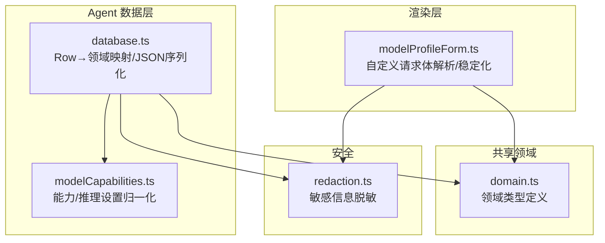
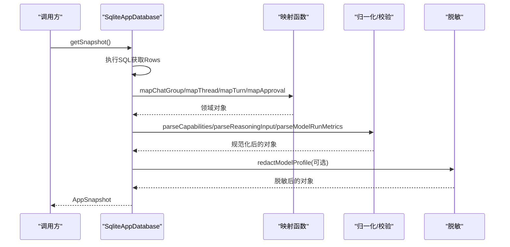
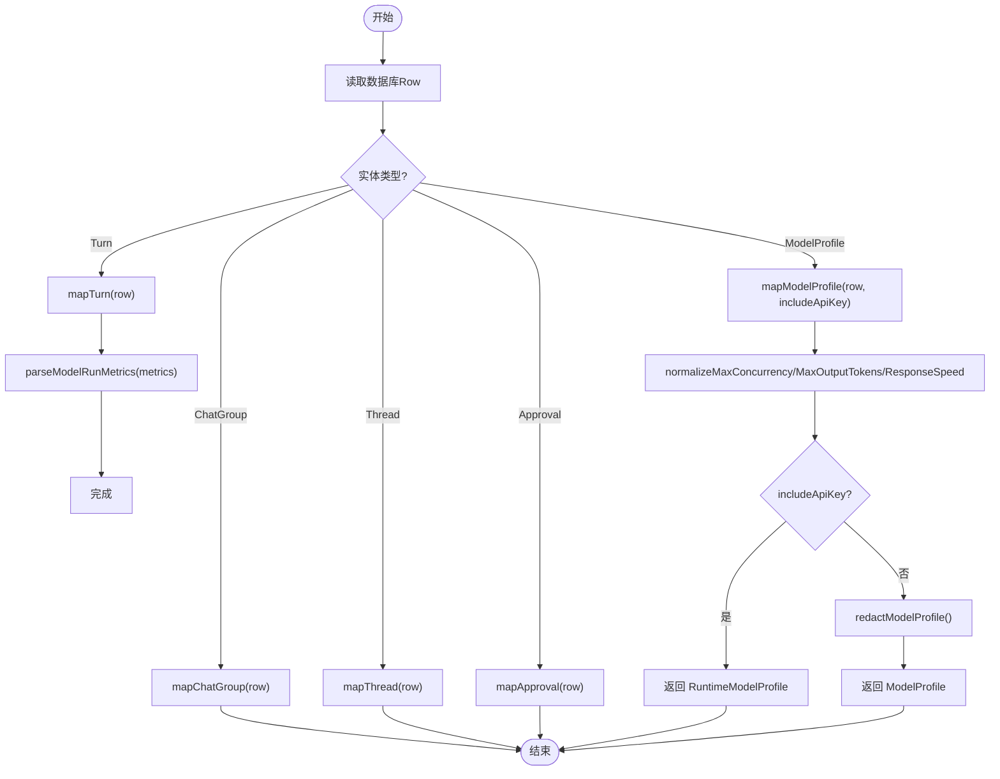
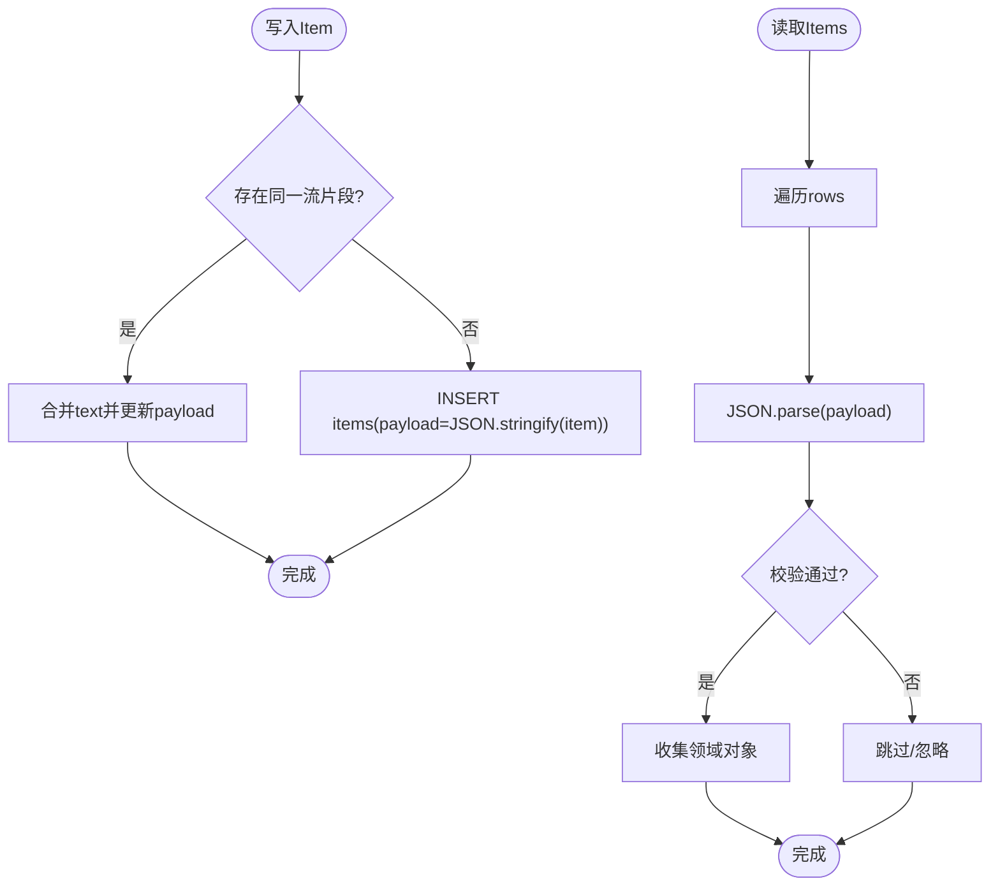
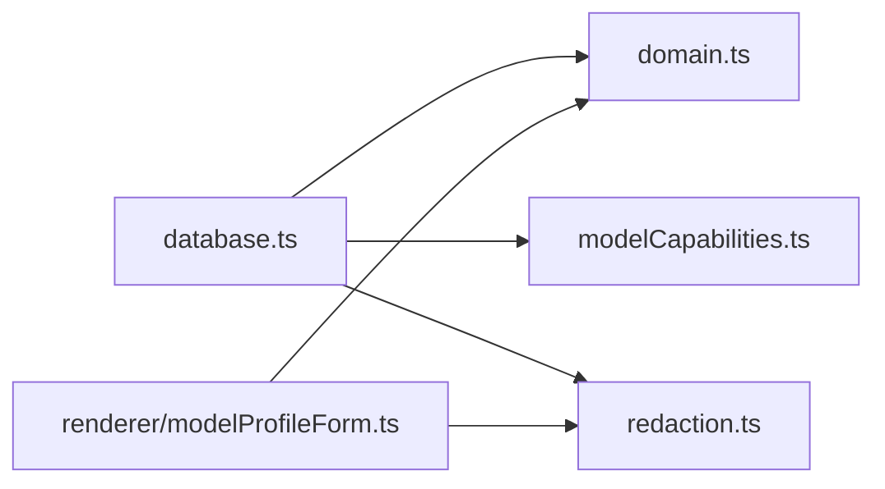

# 数据映射与转换

<cite>
**本文引用的文件**
- [src/agent/database.ts](file://src/agent/database.ts)
- [src/shared/domain.ts](file://src/shared/domain.ts)
- [src/shared/redaction.ts](file://src/shared/redaction.ts)
- [src/agent/modelCapabilities.ts](file://src/agent/modelCapabilities.ts)
- [src/renderer/modelProfileForm.ts](file://src/renderer/modelProfileForm.ts)
</cite>

## 目录
1. [简介](#简介)
2. [项目结构](#项目结构)
3. [核心组件](#核心组件)
4. [架构总览](#架构总览)
5. [详细组件分析](#详细组件分析)
6. [依赖关系分析](#依赖关系分析)
7. [性能考量](#性能考量)
8. [故障排查指南](#故障排查指南)
9. [结论](#结论)
10. [附录](#附录)

## 简介
本技术文档聚焦于“数据映射与转换”模式，系统说明从数据库 Row 到领域对象的转换机制，覆盖 mapChatGroup、mapThread、mapTurn、mapApproval、mapModelProfile 等映射函数；解释数据验证规则、类型转换与默认值处理；记录 JSON 序列化/反序列化的处理逻辑（特别是 payload 字段的存储与解析）；说明数据脱敏与安全处理机制；并给出映射错误处理、兼容性考虑以及自定义映射函数的扩展指南。

## 项目结构
- 领域模型定义位于共享层：src/shared/domain.ts，定义了 ChatGroup、ThreadSummary、Item、TurnRecord、Approval、ModelProfile 等核心类型。
- 数据访问与映射实现位于 agent 层：src/agent/database.ts，负责 SQLite 查询、Row 到领域对象映射、JSON 序列化/反序列化、迁移与默认值处理。
- 能力与配置归一化在 src/agent/modelCapabilities.ts，用于将持久化的 capabilities/reasoning 字段规范化为领域对象。
- 安全脱敏在 src/shared/redaction.ts，提供敏感信息替换与错误消息脱敏。
- 前端表单对自定义请求体进行 JSON 解析与稳定化处理，确保可序列化与一致性。

图表来源
- [src/agent/database.ts:156-216](file://src/agent/database.ts#L156-L216)
- [src/shared/domain.ts:7-319](file://src/shared/domain.ts#L7-L319)
- [src/agent/modelCapabilities.ts:45-118](file://src/agent/modelCapabilities.ts#L45-L118)
- [src/shared/redaction.ts:14-33](file://src/shared/redaction.ts#L14-L33)
- [src/renderer/modelProfileForm.ts:345-379](file://src/renderer/modelProfileForm.ts#L345-L379)

章节来源
- [src/agent/database.ts:156-216](file://src/agent/database.ts#L156-L216)
- [src/shared/domain.ts:7-319](file://src/shared/domain.ts#L7-L319)

## 核心组件
- 领域模型：ChatGroup、ThreadSummary、Item（MessageItem/ReasoningItem/ToolItem/ChangeItem）、TurnRecord、Approval、ModelProfile、AppSettings、WorkspaceRecord 等。
- 映射函数：mapChatGroup、mapThread、mapTurn、mapApproval、mapModelProfile，负责将数据库 Row 转换为领域对象。
- JSON 序列化/反序列化：payload 字段以 JSON 字符串形式存储 Item/Metrics/Capabilities/Reasoning，读取时解析并校验。
- 数据验证与默认值：通过归一化函数确保枚举、数值范围、必填字段合法，并提供合理默认值。
- 安全脱敏：对 API Key、Authorization 头、URL 编码变体等进行脱敏，避免泄露。

章节来源
- [src/shared/domain.ts:7-319](file://src/shared/domain.ts#L7-L319)
- [src/agent/database.ts:1255-1369](file://src/agent/database.ts#L1255-L1369)
- [src/agent/modelCapabilities.ts:45-118](file://src/agent/modelCapabilities.ts#L45-L118)
- [src/shared/redaction.ts:14-33](file://src/shared/redaction.ts#L14-L33)

## 架构总览
数据从 SQLite 表读取为 Row，经映射函数转为领域对象；复杂字段（如 capabilities、reasoning、metrics、items.payload）采用 JSON 字符串存储，读取时解析并进行严格校验；写入时对领域对象进行归一化后序列化为 JSON。

图表来源
- [src/agent/database.ts:156-216](file://src/agent/database.ts#L156-L216)
- [src/agent/database.ts:1255-1369](file://src/agent/database.ts#L1255-L1369)
- [src/agent/modelCapabilities.ts:45-118](file://src/agent/modelCapabilities.ts#L45-L118)
- [src/shared/redaction.ts:14-33](file://src/shared/redaction.ts#L14-L33)

## 详细组件分析

### 映射函数与数据转换
- mapChatGroup：将 ChatGroupRow 映射为 ChatGroup，字段名下划线转驼峰，时间戳保持字符串。
- mapThread：将 ThreadRow 映射为 ThreadSummary，处理 model_profile_id 空值。
- mapTurn：将 TurnRow 映射为 TurnRecord，incomplete 由整数转布尔，metrics 通过 parseModelRunMetrics 解析并校验。
- mapApproval：将 ApprovalRow 映射为 Approval，处理 responded_at 空值。
- mapModelProfile：将 ModelProfileRow 映射为 ModelProfile/RuntimeModelProfile，解析 capabilities/reasoning，归一化 maxConcurrency/maxOutputTokens/responseSpeed，支持 includeApiKey 控制是否返回 apiKey。

图表来源
- [src/agent/database.ts:1255-1369](file://src/agent/database.ts#L1255-L1369)
- [src/agent/modelCapabilities.ts:106-118](file://src/agent/modelCapabilities.ts#L106-L118)

章节来源
- [src/agent/database.ts:1255-1369](file://src/agent/database.ts#L1255-L1369)

### JSON 序列化/反序列化与 payload 处理
- 写入：Item、ModelRunMetrics、ModelCapabilities、Reasoning 等以 JSON 字符串存入 payload/capabilities/reasoning/metrics 字段。
- 读取：使用 JSON.parse 解析后进行类型校验，失败则回退为 undefined 或默认值，保证健壮性。
- 流式合并：insertOrMergeItem 根据 logicalStreamKey 识别同一流片段，合并 assistant message/reasoning 文本，减少碎片化存储。
- 完成流程：completeTurn 将相关 item 的 incomplete 标记置为 false，并更新 payload。

图表来源
- [src/agent/database.ts:945-979](file://src/agent/database.ts#L945-L979)
- [src/agent/database.ts:1219-1253](file://src/agent/database.ts#L1219-L1253)
- [src/agent/database.ts:438-464](file://src/agent/database.ts#L438-L464)

章节来源
- [src/agent/database.ts:945-979](file://src/agent/database.ts#L945-L979)
- [src/agent/database.ts:1219-1253](file://src/agent/database.ts#L1219-L1253)
- [src/agent/database.ts:438-464](file://src/agent/database.ts#L438-L464)

### 数据验证规则、类型转换与默认值
- 必填字段校验：requireTrimmed 确保名称/URL/路径等非空且去除空白。
- 枚举与集合校验：
  - Reasoning settings：mode/protocol/display 限定为允许值，否则回退默认。
  - Capabilities：boolean/integer 字段使用 booleanOr/positiveIntegerOr 等工具函数归一化。
  - Max concurrency/tokens：限制在最小/最大范围内。
- 兼容性与默认值：
  - settings 读取时若缺失或非法，回退到默认值（如 theme/language/showModelMetrics/contextMessageLimit/reasoningDisplayMode）。
  - responseSpeed 仅接受特定值，否则标准化为 standard。
  - 历史迁移修复不完整 turn、legacy profile 等。

章节来源
- [src/agent/database.ts:882-900](file://src/agent/database.ts#L882-L900)
- [src/agent/database.ts:1390-1404](file://src/agent/database.ts#L1390-L1404)
- [src/agent/modelCapabilities.ts:93-118](file://src/agent/modelCapabilities.ts#L93-L118)

### 安全与数据脱敏
- redactSensitiveText：对精确匹配和多种 URL/form/JSON 编码变体进行替换，同时处理 Authorization/Bearer 头部。
- safeErrorText：将错误消息规范化并脱敏，限制长度，提供 fallback。
- redactModelProfile：移除 apiKey 字段，防止敏感信息外泄。
- 测试覆盖：redaction.test.ts 验证多编码变体的脱敏效果。

章节来源
- [src/shared/redaction.ts:1-33](file://src/shared/redaction.ts#L1-L33)
- [src/agent/database.ts:1366-1369](file://src/agent/database.ts#L1366-L1369)
- [tests/redaction.test.ts:1-40](file://tests/redaction.test.ts#L1-L40)

### 映射错误处理与兼容性
- JSON 解析异常：parseItem/parseMessageItem/parseModelRunMetrics/parseCapabilities/parseReasoningInput 均捕获异常并返回 undefined 或默认值，避免崩溃。
- 历史兼容：
  - compactAssistantMessageFragments：合并历史 assistant 消息片段。
  - migrateLegacyTurnCompletion/repairMislabelledLegacyCompletion：修复旧版 turn 状态与 item 标记。
  - repairOrSeedLocalQwenProfile：修复或补全本地 Qwen profile。
- 事务保护：transaction 包裹写操作，失败时回滚，保证一致性。

章节来源
- [src/agent/database.ts:1219-1253](file://src/agent/database.ts#L1219-L1253)
- [src/agent/database.ts:995-1194](file://src/agent/database.ts#L995-L1194)
- [src/agent/database.ts:1203-1213](file://src/agent/database.ts#L1203-L1213)

### 自定义映射函数的扩展指南
- 新增实体映射：
  1. 在 domain.ts 中定义领域接口与输入类型。
  2. 在 database.ts 中定义对应的 Row 类型与映射函数（遵循现有命名与参数约定）。
  3. 在 getSnapshot 或相应查询处调用映射函数，组合为快照或列表。
  4. 如需 JSON 字段，使用 JSON.stringify 写入，JSON.parse + 校验函数读取。
  5. 如涉及敏感字段，使用 redactModelProfile 或 redactSensitiveText 脱敏。
- 最佳实践：
  - 所有外部输入先归一化再持久化（参考 normalizeModelCapabilities/normalizeReasoningSettings）。
  - 对枚举/数值做边界检查与默认值处理。
  - 对 JSON 字段解析失败时降级为默认值，避免中断流程。
  - 使用 requireTrimmed 校验必填字段，抛出明确错误信息。

章节来源
- [src/agent/database.ts:156-216](file://src/agent/database.ts#L156-L216)
- [src/agent/modelCapabilities.ts:45-118](file://src/agent/modelCapabilities.ts#L45-L118)
- [src/shared/redaction.ts:14-33](file://src/shared/redaction.ts#L14-L33)

## 依赖关系分析
- database.ts 依赖 domain.ts 的类型定义，依赖 modelCapabilities.ts 进行能力/推理设置归一化，依赖 redaction.ts 进行脱敏。
- renderer/modelProfileForm.ts 对自定义请求体进行 JSON 解析与稳定化，确保前后端一致。

图表来源
- [src/agent/database.ts:1-37](file://src/agent/database.ts#L1-L37)
- [src/agent/modelCapabilities.ts:1-12](file://src/agent/modelCapabilities.ts#L1-L12)
- [src/shared/redaction.ts:1-33](file://src/shared/redaction.ts#L1-L33)
- [src/renderer/modelProfileForm.ts:345-379](file://src/renderer/modelProfileForm.ts#L345-L379)

章节来源
- [src/agent/database.ts:1-37](file://src/agent/database.ts#L1-L37)
- [src/agent/modelCapabilities.ts:1-12](file://src/agent/modelCapabilities.ts#L1-L12)
- [src/shared/redaction.ts:1-33](file://src/shared/redaction.ts#L1-L33)
- [src/renderer/modelProfileForm.ts:345-379](file://src/renderer/modelProfileForm.ts#L345-L379)

## 性能考量
- 流式合并：通过 logicalStreamKey 合并同一流片段，减少 items 表行数与 I/O。
- WAL 模式与外键约束：提升并发写入性能与数据一致性。
- 批量更新：在 completeTurn 中批量更新 items 的 incomplete 标记，降低多次往返。
- JSON 字段大小：尽量合并文本内容，避免过大 payload。

[本节为通用指导，不直接分析具体文件]

## 故障排查指南
- JSON 解析失败：检查 payload/capabilities/reasoning/metrics 是否为合法 JSON；查看 parseItem/parseMessageItem/parseModelRunMetrics 的降级逻辑。
- 字段缺失或非法：确认 requireTrimmed 抛出的错误信息；检查 settings 读取时的默认值回退。
- 流式消息未合并：确认 logicalStreamKey 生成逻辑与 isTextStreamItem 判断是否符合预期。
- 脱敏无效：检查传入的 secrets 列表是否正确；确认 redactSensitiveText 的编码变体匹配策略。

章节来源
- [src/agent/database.ts:1219-1253](file://src/agent/database.ts#L1219-L1253)
- [src/agent/database.ts:882-900](file://src/agent/database.ts#L882-L900)
- [src/shared/redaction.ts:14-33](file://src/shared/redaction.ts#L14-L33)

## 结论
本项目通过明确的领域模型、严格的映射函数与归一化逻辑，实现了从数据库 Row 到领域对象的安全、可靠转换。payload 的 JSON 序列化/反序列化配合健壮的校验与默认值处理，确保了数据的一致性与兼容性。脱敏机制有效防止敏感信息泄露。扩展新实体或字段时，遵循现有模式即可快速集成并保持系统稳定性。

[本节为总结，不直接分析具体文件]

## 附录
- 关键映射函数位置：
  - mapTurn：[src/agent/database.ts:1255-1268](file://src/agent/database.ts#L1255-L1268)
  - mapThread：[src/agent/database.ts:1292-1302](file://src/agent/database.ts#L1292-L1302)
  - mapChatGroup：[src/agent/database.ts:1304-1311](file://src/agent/database.ts#L1304-L1311)
  - mapApproval：[src/agent/database.ts:1326-1337](file://src/agent/database.ts#L1326-L1337)
  - mapModelProfile：[src/agent/database.ts:1339-1364](file://src/agent/database.ts#L1339-L1364)
- JSON 解析与校验：
  - parseItem/parseMessageItem：[src/agent/database.ts:1219-1253](file://src/agent/database.ts#L1219-L1253)
  - parseModelRunMetrics：[src/agent/database.ts:1270-1290](file://src/agent/database.ts#L1270-L1290)
  - parseCapabilities/parseReasoningInput：[src/agent/database.ts:1371-1388](file://src/agent/database.ts#L1371-L1388)
- 归一化与默认值：
  - normalizeModelCapabilities/normalizeReasoningSettings：[src/agent/modelCapabilities.ts:45-118](file://src/agent/modelCapabilities.ts#L45-L118)
  - clampContextLimit/normalizeResponseSpeed/normalizeBaseUrl：[src/agent/database.ts:1390-1404](file://src/agent/database.ts#L1390-L1404)
- 脱敏与安全：
  - redactSensitiveText/safeErrorText：[src/shared/redaction.ts:1-33](file://src/shared/redaction.ts#L1-L33)
  - redactModelProfile：[src/agent/database.ts:1366-1369](file://src/agent/database.ts#L1366-L1369)