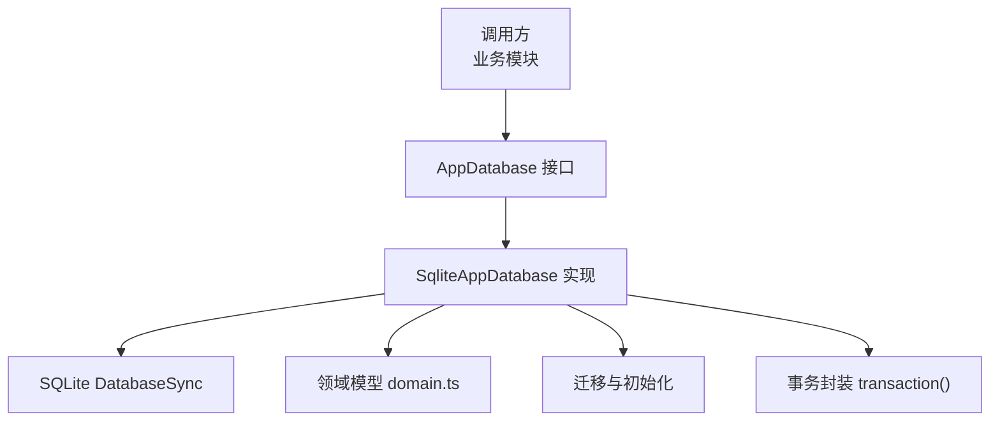
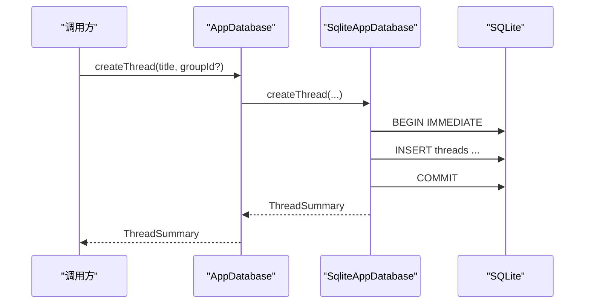
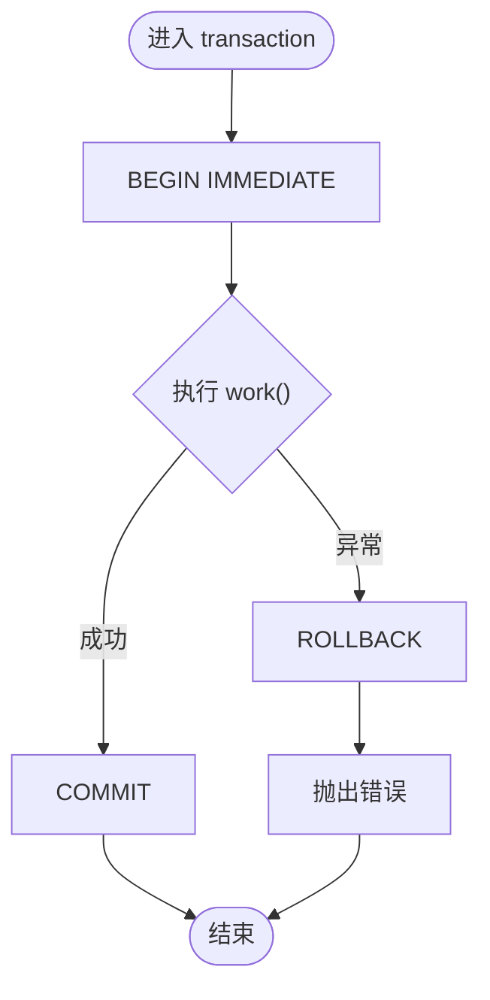
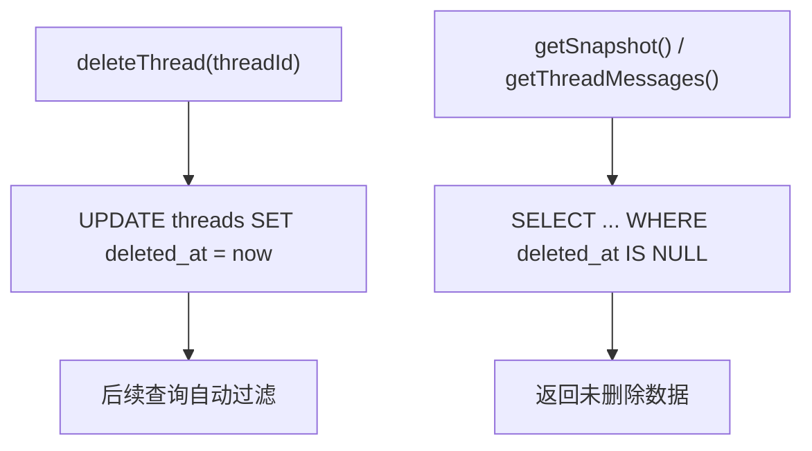
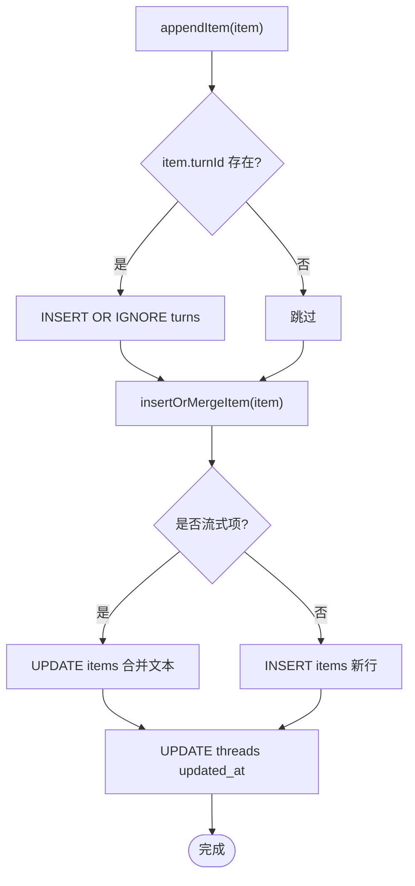
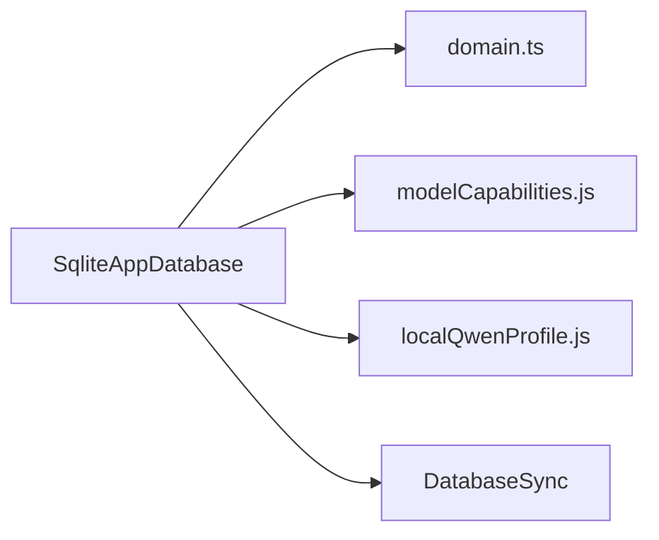
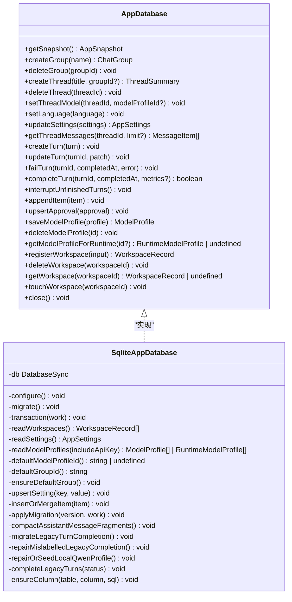
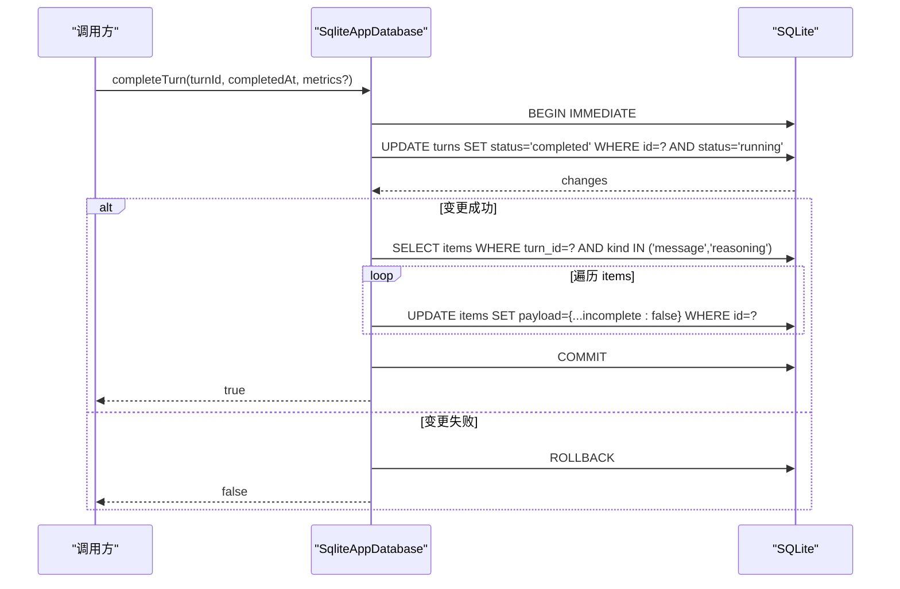

# 数据访问模式

<cite>
**本文引用的文件**
- [src/agent/database.ts](file://src/agent/database.ts)
- [src/shared/domain.ts](file://src/shared/domain.ts)
- [tests/database.test.ts](file://tests/database.test.ts)
</cite>

## 目录
1. [简介](#简介)
2. [项目结构](#项目结构)
3. [核心组件](#核心组件)
4. [架构总览](#架构总览)
5. [详细组件分析](#详细组件分析)
6. [依赖关系分析](#依赖关系分析)
7. [性能考虑](#性能考虑)
8. [故障排查指南](#故障排查指南)
9. [结论](#结论)
10. [附录](#附录)

## 简介
本技术文档聚焦于应用的数据访问层，围绕 AppDatabase 接口的设计与实现，系统阐述 CRUD 操作模式、事务封装、软删除策略、数据映射与转换、一致性保证与并发控制，以及常见查询优化建议。该数据访问层基于 SQLite（Node:sqlite），通过统一的数据库抽象为上层业务提供稳定、可测试、可扩展的持久化能力。

## 项目结构
- 数据访问实现位于 src/agent/database.ts，包含：
  - AppDatabase 接口定义
  - SqliteAppDatabase 具体实现
  - 表结构与迁移逻辑
  - 事务封装、软删除过滤、流式项合并、领域对象映射等
- 领域模型定义位于 src/shared/domain.ts，描述线程、会话组、消息项、工作区、模型配置等类型
- 行为验证位于 tests/database.test.ts，覆盖迁移、软删除、流式合并、事务原子性、指标持久化等关键场景

图表来源
- [src/agent/database.ts:38-66](file://src/agent/database.ts#L38-L66)
- [src/agent/database.ts:150-1217](file://src/agent/database.ts#L150-L1217)
- [src/shared/domain.ts:1-319](file://src/shared/domain.ts#L1-L319)

章节来源
- [src/agent/database.ts:38-66](file://src/agent/database.ts#L38-L66)
- [src/agent/database.ts:150-1217](file://src/agent/database.ts#L150-L1217)
- [src/shared/domain.ts:1-319](file://src/shared/domain.ts#L1-L319)

## 核心组件
- AppDatabase 接口：统一暴露快照读取、群组/线程管理、回合（Turn）生命周期、消息项追加、审批记录、模型配置与工作区管理等方法
- SqliteAppDatabase：基于 SQLite 的具体实现，负责：
  - 连接配置（WAL、外键、超时）
  - 表创建与多版本迁移
  - 事务封装与错误回滚
  - 软删除过滤（deleted_at）
  - 流式项合并（按逻辑键聚合）
  - Row 到领域对象的映射与校验
  - 默认值与种子数据注入

章节来源
- [src/agent/database.ts:38-66](file://src/agent/database.ts#L38-L66)
- [src/agent/database.ts:731-873](file://src/agent/database.ts#L731-L873)
- [src/agent/database.ts:1203-1217](file://src/agent/database.ts#L1203-L1217)

## 架构总览
数据访问层采用“接口 + 实现”的分层设计，将 SQL 细节与领域语义解耦。所有写操作均通过事务封装，确保一致性与原子性；读操作在查询中显式过滤已软删除的记录，保证视图一致性。

图表来源
- [src/agent/database.ts:258-289](file://src/agent/database.ts#L258-L289)
- [src/agent/database.ts:1203-1212](file://src/agent/database.ts#L1203-L1212)

章节来源
- [src/agent/database.ts:258-289](file://src/agent/database.ts#L258-L289)
- [src/agent/database.ts:1203-1212](file://src/agent/database.ts#L1203-L1212)

## 详细组件分析

### AppDatabase 接口设计与职责分离
- 职责边界清晰：
  - 会话与线程：createGroup、deleteGroup、createThread、deleteThread、setThreadModel
  - 回合（Turn）：createTurn、updateTurn、failTurn、completeTurn、interruptUnfinishedTurns
  - 消息与审批：appendItem、upsertApproval、getThreadMessages
  - 配置与工作区：saveModelProfile、deleteModelProfile、registerWorkspace、deleteWorkspace、getWorkspace、touchWorkspace
  - 全局设置：setLanguage、updateSettings、getSnapshot
- 优势：
  - 对外仅暴露领域语义方法，屏蔽 SQL 细节
  - 便于替换底层存储或进行单元测试
  - 通过 getSnapshot 提供一次性完整状态视图，简化 UI 渲染与调试

章节来源
- [src/agent/database.ts:38-66](file://src/agent/database.ts#L38-L66)

### 事务处理的统一封装与错误处理
- 统一封装：所有写操作均包裹在 private transaction(work) 中，使用 BEGIN IMMEDIATE 提升并发写入时的锁等待体验
- 错误处理：捕获异常后执行 ROLLBACK，并向上抛出原始错误，保证调用方可感知失败
- 迁移事务：applyMigration 同样以事务执行，确保迁移幂等且可回滚

图表来源
- [src/agent/database.ts:1203-1212](file://src/agent/database.ts#L1203-L1212)
- [src/agent/database.ts:981-993](file://src/agent/database.ts#L981-L993)

章节来源
- [src/agent/database.ts:1203-1212](file://src/agent/database.ts#L1203-L1212)
- [src/agent/database.ts:981-993](file://src/agent/database.ts#L981-L993)

### 软删除的实现与查询过滤
- 软删除字段：threads.chat_groups 等表包含 deleted_at 时间戳
- 写入时：deleteGroup/deleteThread 将 deleted_at 设置为当前时间
- 读取时：所有 SELECT 语句显式添加 WHERE deleted_at IS NULL 条件，确保快照与上下文不包含已删除数据
- 级联影响：删除群组时会级联标记其下线程为已删除

图表来源
- [src/agent/database.ts:244-255](file://src/agent/database.ts#L244-L255)
- [src/agent/database.ts:292-298](file://src/agent/database.ts#L292-L298)
- [src/agent/database.ts:156-215](file://src/agent/database.ts#L156-L215)
- [src/agent/database.ts:335-358](file://src/agent/database.ts#L335-L358)

章节来源
- [src/agent/database.ts:244-255](file://src/agent/database.ts#L244-L255)
- [src/agent/database.ts:292-298](file://src/agent/database.ts#L292-L298)
- [src/agent/database.ts:156-215](file://src/agent/database.ts#L156-L215)
- [src/agent/database.ts:335-358](file://src/agent/database.ts#L335-L358)

### 数据映射与转换模式（Row 到领域对象）
- 映射函数：mapThread、mapChatGroup、mapTurn、mapApproval、mapWorkspace、mapModelProfile
- 转换规则：
  - 字符串字段到布尔/枚举的规范化（如 incomplete 整数转布尔）
  - JSON 字段的解析与校验（capabilities、reasoning、metrics）
  - 敏感信息脱敏（redactModelProfile 移除 apiKey）
- 安全与健壮性：
  - 解析失败时降级为默认值或 undefined
  - 输入参数校验（requireTrimmed、clampContextLimit、normalizeResponseSpeed）

章节来源
- [src/agent/database.ts:1255-1388](file://src/agent/database.ts#L1255-L1388)
- [src/shared/domain.ts:1-319](file://src/shared/domain.ts#L1-L319)

### CRUD 操作模式详解

#### createGroup
- 生成 ID、时间戳，校验名称
- 事务内插入 chat_groups，deleted_at 初始为空
- 返回 ChatGroup

章节来源
- [src/agent/database.ts:218-242](file://src/agent/database.ts#L218-L242)

#### createThread
- 选择或创建默认群组，校验群组存在
- 事务内插入 threads，关联 model_profile_id（来自设置）
- 返回 ThreadSummary

章节来源
- [src/agent/database.ts:258-289](file://src/agent/database.ts#L258-L289)

#### appendItem
- 若 item.turnId 存在，则 INSERT OR IGNORE turns（避免重复）
- 流式合并：根据 logicalStreamKey 查找同 turn 的同类型项，合并文本
- 更新线程 updated_at，保持排序与可见性

图表来源
- [src/agent/database.ts:490-514](file://src/agent/database.ts#L490-L514)
- [src/agent/database.ts:945-979](file://src/agent/database.ts#L945-L979)

章节来源
- [src/agent/database.ts:490-514](file://src/agent/database.ts#L490-L514)
- [src/agent/database.ts:945-979](file://src/agent/database.ts#L945-L979)

#### updateTurn
- 动态构建 UPDATE 子句，仅更新传入字段
- 始终更新 updated_at
- 空补丁直接返回，避免无意义写

章节来源
- [src/agent/database.ts:382-417](file://src/agent/database.ts#L382-L417)

#### completeTurn
- 原子性：在事务内先 CAS 更新 turns 状态为 completed，再批量更新对应 items 的 incomplete 标志
- 仅当状态为 running 时才允许完成，防止竞态
- 返回是否完成，供调用方判断

章节来源
- [src/agent/database.ts:438-464](file://src/agent/database.ts#L438-L464)

#### failTurn
- 将 turns 置为 failed，incomplete=1，并记录 error
- 同时拒绝 pending 的 approvals，保持审批与回合状态一致

章节来源
- [src/agent/database.ts:419-436](file://src/agent/database.ts#L419-L436)

#### interruptUnfinishedTurns
- 启动时将所有 queued/running/cancelling 的 turns 置为 interrupted
- 清理与之相关的 pending approvals

章节来源
- [src/agent/database.ts:466-488](file://src/agent/database.ts#L466-L488)

#### getThreadMessages
- 仅读取 message 类型的 items，并按 thread 过滤
- 合并同一 turn 的 assistant 连续片段，限制返回条数

章节来源
- [src/agent/database.ts:335-358](file://src/agent/database.ts#L335-L358)

### 数据一致性保证与并发访问控制
- WAL 模式：提高并发读性能，减少写阻塞
- 外键约束：启用 foreign_keys，保证引用完整性
- busy_timeout：设置 5000ms 等待锁释放，降低忙冲突失败率
- 事务隔离：BEGIN IMMEDIATE 提前获取写锁，避免长时间排队
- 状态机保护：completeTurn 使用状态条件更新，防止非法转换
- 启动修复：重启时中断未完成回合并清理悬挂审批，恢复一致性

章节来源
- [src/agent/database.ts:731-737](file://src/agent/database.ts#L731-L737)
- [src/agent/database.ts:438-464](file://src/agent/database.ts#L438-L464)
- [src/agent/database.ts:466-488](file://src/agent/database.ts#L466-L488)

### 常见查询模式的优化建议与最佳实践
- 过滤已删除数据：所有查询务必带上 deleted_at IS NULL 条件，避免脏数据
- 限制结果集：getThreadMessages 支持 limit，避免大结果集传输
- 合并流式项：利用 insertOrMergeItem 减少冗余行，降低 I/O
- 索引建议（概念性）：
  - threads.deleted_at + updated_at 用于列表排序与过滤
  - items.thread_id + created_at + id 用于顺序读取与分页
  - turns.thread_id + status 用于状态筛选
- 避免 N+1：getSnapshot 使用 JOIN 与分组加载，减少多次往返

章节来源
- [src/agent/database.ts:156-215](file://src/agent/database.ts#L156-L215)
- [src/agent/database.ts:335-358](file://src/agent/database.ts#L335-L358)
- [src/agent/database.ts:945-979](file://src/agent/database.ts#L945-L979)

## 依赖关系分析
- 外部依赖：node:sqlite 的 DatabaseSync
- 内部依赖：
  - shared/domain.ts：领域类型与常量
  - agent/modelCapabilities.js：能力与推理设置的归一化
  - agent/localQwenProfile.js：本地 Qwen 预设与兼容处理
- 耦合点：
  - 映射函数强依赖 domain 类型
  - 迁移逻辑与 schema_migrations 表紧密相关
  - 事务封装被所有写路径复用

图表来源
- [src/agent/database.ts:1-37](file://src/agent/database.ts#L1-L37)
- [src/agent/database.ts:1215-1217](file://src/agent/database.ts#L1215-L1217)

章节来源
- [src/agent/database.ts:1-37](file://src/agent/database.ts#L1-L37)
- [src/agent/database.ts:1215-1217](file://src/agent/database.ts#L1215-L1217)

## 性能考虑
- 使用 WAL 模式提升并发读性能
- 合理设置 busy_timeout，平衡等待与失败重试
- 流式项合并减少行数与 JSON 序列化开销
- 限制消息历史返回数量，避免内存压力
- 迁移仅在必要时执行，避免频繁 DDL

[本节为通用指导，不直接分析具体文件]

## 故障排查指南
- 事务失败：检查 transaction 包裹范围，确认异常是否被正确捕获并回滚
- 软删除误显：确认查询是否遗漏 deleted_at IS NULL 条件
- 流式项未合并：检查 logicalStreamKey 是否匹配（turnId、kind、mode）
- 无法完成回合：确认当前状态是否为 running，避免并发竞争
- 启动不一致：查看 interruptUnfinishedTurns 与迁移是否执行成功

章节来源
- [src/agent/database.ts:1203-1212](file://src/agent/database.ts#L1203-L1212)
- [src/agent/database.ts:466-488](file://src/agent/database.ts#L466-L488)
- [tests/database.test.ts:373-428](file://tests/database.test.ts#L373-L428)

## 结论
本数据访问层通过清晰的接口设计、统一的事务封装、严格的软删除过滤与健壮的映射转换，提供了高内聚、低耦合的持久化能力。结合 WAL、外键、busy_timeout 与状态机保护，实现了良好的并发与一致性保障。测试覆盖了迁移、软删除、流式合并、事务原子性等关键路径，为系统的稳定性提供了坚实基础。

[本节为总结性内容，不直接分析具体文件]

## 附录

### 类图：AppDatabase 与其实现

图表来源
- [src/agent/database.ts:38-66](file://src/agent/database.ts#L38-L66)
- [src/agent/database.ts:150-1217](file://src/agent/database.ts#L150-L1217)

### 序列图：completeTurn 的原子流程

图表来源
- [src/agent/database.ts:438-464](file://src/agent/database.ts#L438-L464)
- [src/agent/database.ts:1203-1212](file://src/agent/database.ts#L1203-L1212)