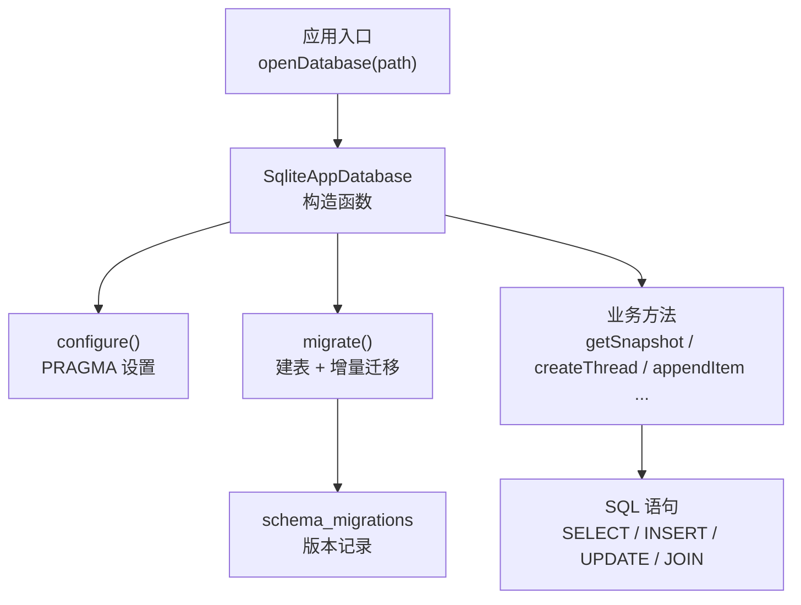
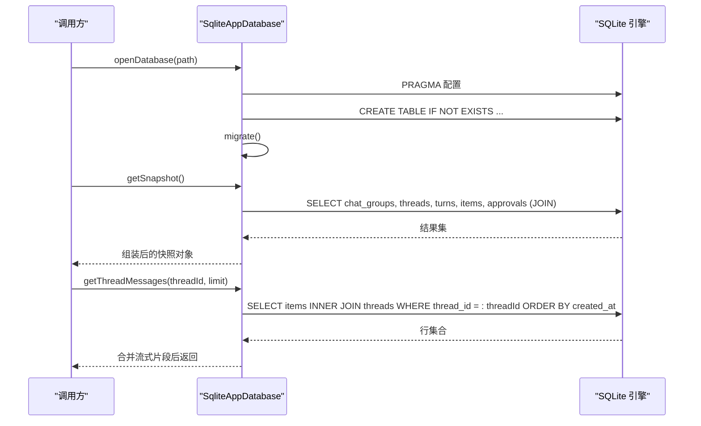
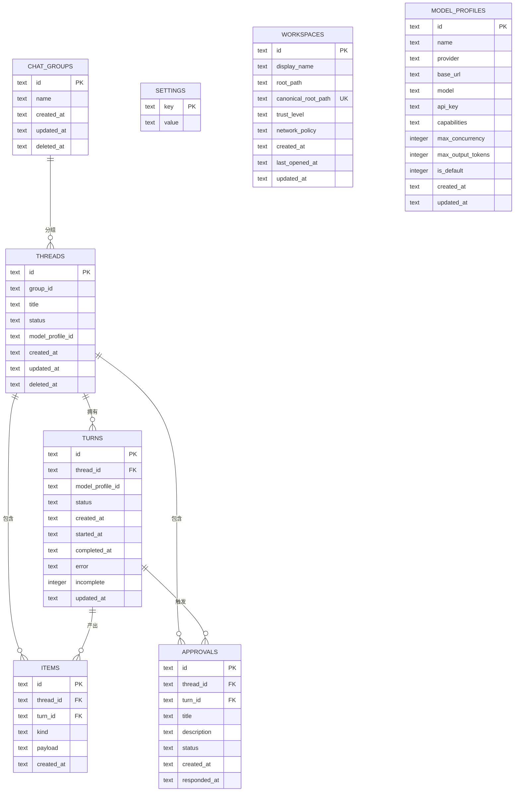
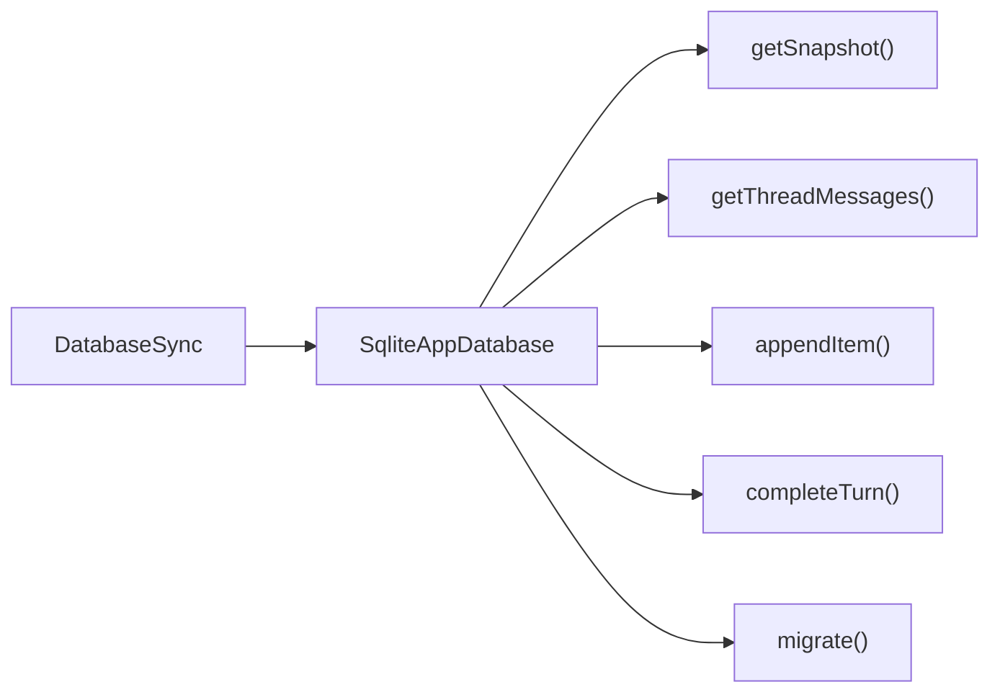

# 查询优化与索引

<cite>
**本文引用的文件**
- [src/agent/database.ts](file://src/agent/database.ts)
- [tests/database.test.ts](file://tests/database.test.ts)
</cite>

## 目录
1. [简介](#简介)
2. [项目结构](#项目结构)
3. [核心组件](#核心组件)
4. [架构总览](#架构总览)
5. [详细组件分析](#详细组件分析)
6. [依赖关系分析](#依赖关系分析)
7. [性能考量](#性能考量)
8. [故障排查指南](#故障排查指南)
9. [结论](#结论)
10. [附录](#附录)

## 简介
本技术文档围绕本项目中的 SQLite 数据库层，系统梳理现有 SQL 查询的性能特征、可优化点与索引策略。重点覆盖：
- 当前表结构与查询模式
- JOIN、子查询、排序与过滤的潜在瓶颈
- 分页与大数据量读取的优化思路
- 慢查询诊断方法与监控建议
- 查询最佳实践与常见陷阱规避

## 项目结构
本项目使用 Node.js 内置的 SQLite 同步 API（DatabaseSync）实现本地应用数据持久化。数据库初始化、迁移、事务封装以及核心业务读写逻辑集中在单一模块中，测试通过独立临时数据库验证行为一致性。

图表来源
- [src/agent/database.ts:150-154](file://src/agent/database.ts#L150-L154)
- [src/agent/database.ts:731-837](file://src/agent/database.ts#L731-L837)
- [src/agent/database.ts:1215-1217](file://src/agent/database.ts#L1215-L1217)

章节来源
- [src/agent/database.ts:150-154](file://src/agent/database.ts#L150-L154)
- [src/agent/database.ts:731-837](file://src/agent/database.ts#L731-L837)
- [src/agent/database.ts:1215-1217](file://src/agent/database.ts#L1215-L1217)

## 核心组件
- 数据库配置与连接
  - 启用 WAL 日志模式、外键约束、忙等待超时，提升并发读性能和稳定性。
- 表结构与迁移
  - 核心表包括 threads、chat_groups、turns、items、approvals、settings、workspaces、model_profiles。
  - 通过 schema_migrations 管理版本演进，支持列新增、历史数据修复与默认值填充。
- 事务封装
  - 统一使用 BEGIN IMMEDIATE/COMMIT/ROLLBACK 保证原子性与一致性。
- 关键查询路径
  - getSnapshot：多表 JOIN 聚合快照
  - getThreadMessages：按线程拉取消息并合并流式片段
  - completeTurn/failTurn/interruptUnfinishedTurns：状态机更新与级联清理
  - insertOrMergeItem：流式文本追加合并
  - readModelProfiles/readSettings：配置与模型元数据读取

章节来源
- [src/agent/database.ts:731-737](file://src/agent/database.ts#L731-L737)
- [src/agent/database.ts:741-837](file://src/agent/database.ts#L741-L837)
- [src/agent/database.ts:1203-1212](file://src/agent/database.ts#L1203-L1212)
- [src/agent/database.ts:156-216](file://src/agent/database.ts#L156-L216)
- [src/agent/database.ts:335-358](file://src/agent/database.ts#L335-L358)
- [src/agent/database.ts:419-488](file://src/agent/database.ts#L419-L488)
- [src/agent/database.ts:490-514](file://src/agent/database.ts#L490-L514)
- [src/agent/database.ts:902-918](file://src/agent/database.ts#L902-L918)

## 架构总览
下图展示从打开数据库到执行典型查询的关键调用链与数据流向。

图表来源
- [src/agent/database.ts:1215-1217](file://src/agent/database.ts#L1215-L1217)
- [src/agent/database.ts:156-216](file://src/agent/database.ts#L156-L216)
- [src/agent/database.ts:335-358](file://src/agent/database.ts#L335-L358)
- [src/agent/database.ts:731-837](file://src/agent/database.ts#L731-L837)

## 详细组件分析

### 表结构与关系
- threads：会话主表，包含 group_id、status、model_profile_id、时间戳、软删除标记
- chat_groups：会话分组
- turns：对话轮次，关联 threads，含状态、开始/完成时间、错误、指标 JSON
- items：消息与推理片段，JSON payload，关联 threads 与 turns
- approvals：审批项，关联 threads 与 turns
- settings：键值对设置
- workspaces：工作区元数据，唯一规范路径
- model_profiles：模型配置元数据，含能力、并发、输出限制等

图表来源
- [src/agent/database.ts:741-837](file://src/agent/database.ts#L741-L837)

章节来源
- [src/agent/database.ts:741-837](file://src/agent/database.ts#L741-L837)

### 关键查询与性能特征

#### 快照查询 getSnapshot
- 多表 JOIN：threads 与 turns/items/approvals 多次 JOIN
- 排序：按更新时间或创建时间排序
- 风险点：
  - 未显式索引时，JOIN 条件字段与排序字段可能全表扫描
  - 大量 items 行在内存中拼接，需关注内存与网络传输（若未来拆分服务）

优化建议
- 为以下字段建立复合索引以加速 JOIN 与排序：
  - threads.deleted_at, threads.updated_at
  - turns.thread_id, turns.created_at
  - items.thread_id, items.turn_id, items.created_at
  - approvals.thread_id, approvals.created_at
- 将“已删除”过滤提前到 WHERE，减少中间结果集

章节来源
- [src/agent/database.ts:156-216](file://src/agent/database.ts#L156-L216)

#### 消息读取 getThreadMessages
- 单线程内按 thread_id 过滤，按 created_at/id 排序，并在应用层合并同 turn 的 assistant 消息
- 风险点：
  - 缺少 thread_id + created_at 索引会导致排序成本上升
  - 应用层合并虽减少行数，但初始扫描仍可能较大

优化建议
- 建立 items.thread_id, items.created_at, items.id 的复合索引
- 如后续引入 LIMIT/OFFSET 分页，应结合游标或基于时间的分页避免深翻页

章节来源
- [src/agent/database.ts:335-358](file://src/agent/database.ts#L335-L358)

#### 写入与合并 insertOrMergeItem
- 先根据 logicalStreamKey 查找是否可合并，再决定 UPDATE 或 INSERT
- 风险点：
  - 合并前需要按 thread_id, turn_id 扫描候选行，若无索引会退化为全表扫描
  - 频繁追加场景下，UPDATE 与 INSERT 混合带来锁竞争

优化建议
- 建立 items.thread_id, items.turn_id, items.created_at, items.id 的复合索引以加速候选查找与顺序遍历
- 在高并发写入时可考虑批处理合并与批量提交

章节来源
- [src/agent/database.ts:945-979](file://src/agent/database.ts#L945-L979)

#### 状态变更 completeTurn/failTurn/interruptUnfinishedTurns
- 通过状态机更新 turns，并级联更新 approvals 或 items.incomplete
- 风险点：
  - 条件更新涉及多个表，若无合适索引可能导致额外扫描
  - 子查询 IN (SELECT ...) 在某些引擎上效率较低

优化建议
- 为 turns.status, turns.completed_at, turns.error, turns.incomplete 建立索引以加速状态筛选
- 将部分子查询改写为 JOIN 或分步更新，降低单次事务复杂度

章节来源
- [src/agent/database.ts:419-488](file://src/agent/database.ts#L419-L488)

#### 模型配置读取 readModelProfiles/defaultModelProfileId
- 按 is_default 与 updated_at 排序选择默认模型
- 风险点：
  - 无索引时排序成本高
- 优化建议
  - 为 model_profiles.is_default, model_profiles.updated_at 建立复合索引

章节来源
- [src/agent/database.ts:902-918](file://src/agent/database.ts#L902-L918)

### 复杂查询优化技巧在本项目的落地

- JOIN 优化
  - 将 JOIN 条件字段纳入索引，确保驱动表选择合理
  - 优先过滤后再 JOIN，减少中间结果集
- 子查询改写
  - 将 IN (SELECT ...) 改写为 JOIN 或拆分为两步，减少重复扫描
- 分页查询优化
  - 使用基于游标的分页（last_created_at + id），避免 OFFSET 深翻页
  - 对排序字段建立索引，确保稳定有序

章节来源
- [src/agent/database.ts:156-216](file://src/agent/database.ts#L156-L216)
- [src/agent/database.ts:335-358](file://src/agent/database.ts#L335-L358)
- [src/agent/database.ts:419-488](file://src/agent/database.ts#L419-L488)

### 大数据量下的查询性能与缓存策略

- 数据分层
  - 热数据：最近消息、活跃线程、默认模型配置
  - 温数据：历史消息、已完成轮次
  - 冷数据：归档会话、旧审批
- 缓存建议
  - 应用层缓存 getSnapshot 的结果，配合失效策略（如新消息到达、设置变更）
  - 对高频读取的 model_profiles 与 settings 做短 TTL 缓存
- 存储与访问
  - 保持 WAL 模式以提升读并发
  - 定期 VACUUM/ANALYZE 维护统计信息（视部署环境而定）

[本节为通用指导，不直接分析具体文件]

## 依赖关系分析
- SqliteAppDatabase 依赖 DatabaseSync 提供底层 SQL 执行
- 迁移与配置强耦合于构造函数流程，确保每次打开数据库都具备一致的结构与状态
- 业务方法通过 prepare().run()/all()/get() 执行参数化 SQL，避免注入风险

图表来源
- [src/agent/database.ts:150-154](file://src/agent/database.ts#L150-L154)
- [src/agent/database.ts:156-216](file://src/agent/database.ts#L156-L216)
- [src/agent/database.ts:335-358](file://src/agent/database.ts#L335-L358)
- [src/agent/database.ts:490-514](file://src/agent/database.ts#L490-L514)
- [src/agent/database.ts:438-464](file://src/agent/database.ts#L438-L464)
- [src/agent/database.ts:739-873](file://src/agent/database.ts#L739-L873)

章节来源
- [src/agent/database.ts:150-154](file://src/agent/database.ts#L150-L154)
- [src/agent/database.ts:739-873](file://src/agent/database.ts#L739-L873)

## 性能考量
- 当前未显式创建任何用户定义索引，主要依赖主键与隐式索引
- 高价值索引候选（按优先级）：
  - items.thread_id, items.created_at, items.id
  - items.thread_id, items.turn_id, items.created_at, items.id
  - turns.thread_id, turns.created_at
  - turns.status, turns.completed_at, turns.error, turns.incomplete
  - threads.deleted_at, threads.updated_at
  - approvals.thread_id, approvals.created_at
  - model_profiles.is_default, model_profiles.updated_at
  - workspaces.canonical_root_path（已有 UNIQUE 约束）
- 事务粒度
  - 将相关写操作合并到同一事务，减少磁盘落盘次数
  - 避免长事务阻塞写者
- 排序与过滤
  - 尽量在 SQL 层完成排序与过滤，减少应用层开销
  - 对高频排序字段建立索引

[本节提供通用指导，不直接分析具体文件]

## 故障排查指南
- 慢查询定位
  - 使用 EXPLAIN QUERY PLAN 分析关键 SELECT 的执行计划，确认是否走索引
  - 检查 WHERE 条件与 ORDER BY 字段是否命中索引
- 常见问题
  - 全表扫描：缺少必要索引导致 JOIN/ORDER BY 退化
  - 深翻页：OFFSET 过大导致性能骤降，改用游标分页
  - 锁竞争：长时间事务或大结果集占用连接，缩短事务、分批处理
- 回归验证
  - 通过 tests/database.test.ts 构造历史数据与边界场景，验证迁移与修复逻辑

章节来源
- [tests/database.test.ts:60-116](file://tests/database.test.ts#L60-L116)
- [tests/database.test.ts:360-511](file://tests/database.test.ts#L360-L511)
- [tests/database.test.ts:594-673](file://tests/database.test.ts#L594-L673)
- [tests/database.test.ts:716-742](file://tests/database.test.ts#L716-L742)

## 结论
本项目数据库层采用简洁清晰的表结构与迁移机制，但在当前实现中未显式创建除主键/唯一约束外的索引。随着数据增长，建议在关键 JOIN 与排序字段上补充复合索引，并将部分子查询改写为 JOIN 以提升性能。同时，结合应用层缓存与分页优化，可在大数据量场景下获得更稳定的响应时间与吞吐。

[本节为总结性内容，不直接分析具体文件]

## 附录

### 索引设计原则（针对本项目）
- 选择性高的列优先：如 thread_id、turn_id、status、is_default
- 复合索引匹配查询模式：WHERE + ORDER BY 组合
- 避免过度索引：写放大与维护成本需权衡
- 利用唯一约束：如 workspaces.canonical_root_path

### 查询最佳实践与常见陷阱
- 始终使用参数化查询，避免注入
- 控制返回列，只 select 必要字段
- 避免 SELECT *，减少网络与解析开销
- 谨慎使用 LIKE '%...%'，无法有效利用索引
- 分页使用游标而非 OFFSET，避免深翻页
- 大事务拆小，降低锁持有时间

[本节为通用指导，不直接分析具体文件]