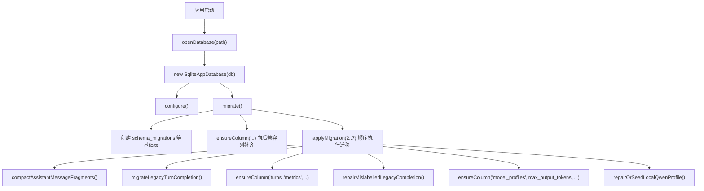
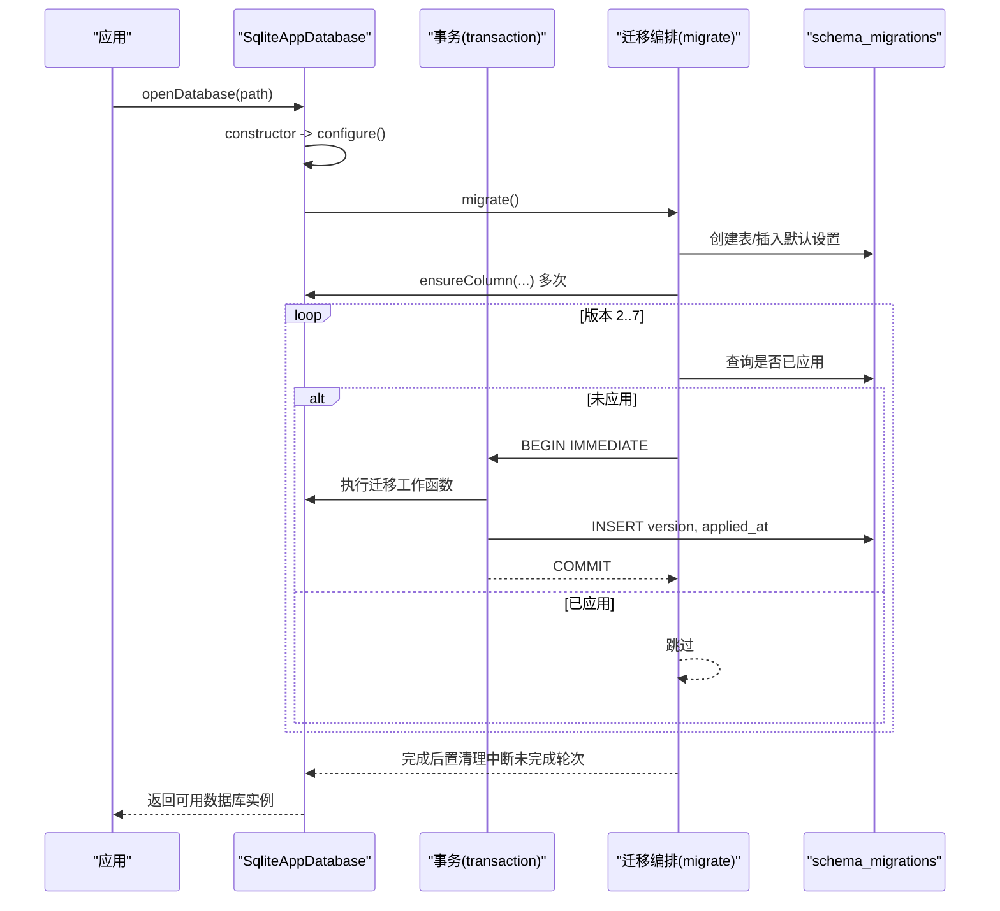
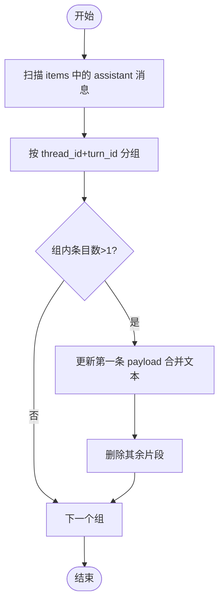
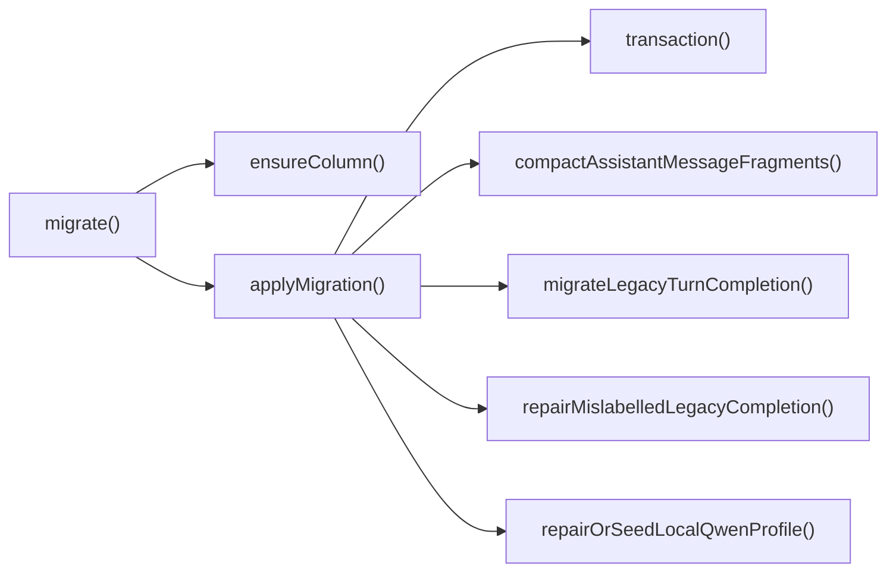

# 数据迁移管理

<cite>
**本文引用的文件**
- [src/agent/database.ts](file://src/agent/database.ts)
- [tests/database.test.ts](file://tests/database.test.ts)
</cite>

## 目录
1. [简介](#简介)
2. [项目结构](#项目结构)
3. [核心组件](#核心组件)
4. [架构总览](#架构总览)
5. [详细组件分析](#详细组件分析)
6. [依赖关系分析](#依赖关系分析)
7. [性能考量](#性能考量)
8. [故障排查指南](#故障排查指南)
9. [结论](#结论)
10. [附录：新迁移开发指南与最佳实践](#附录新迁移开发指南与最佳实践)

## 简介
本技术文档聚焦于本地 SQLite 数据库的迁移系统，围绕 schema_migrations 表、版本管理机制、migrate() 初始化逻辑、向后兼容性处理、已实施的迁移步骤（含 ALTER TABLE、列添加、数据修复与压缩）、ensureColumn() 重复执行安全性、applyMigration() 执行机制展开。同时提供新迁移的开发指南、回滚策略与故障恢复方案，帮助开发者安全地演进数据库结构并保证数据一致性。

## 项目结构
本项目采用单文件数据库实现，核心迁移逻辑集中在数据库模块中，测试覆盖迁移行为与边界场景。关键位置如下：
- 数据库类与迁移入口：SqliteAppDatabase 构造函数调用 configure() 与 migrate()
- 迁移编排：migrate() 内定义初始建表、默认设置、向后兼容列补齐以及按版本号顺序执行的迁移
- 迁移工具方法：applyMigration()、ensureColumn()、transaction()
- 具体迁移任务：消息片段压缩、历史完成状态修复、指标列添加、旧占位模型配置修复或补种等

图表来源
- [src/agent/database.ts:150-154](file://src/agent/database.ts#L150-L154)
- [src/agent/database.ts:739-873](file://src/agent/database.ts#L739-L873)

章节来源
- [src/agent/database.ts:150-154](file://src/agent/database.ts#L150-L154)
- [src/agent/database.ts:739-873](file://src/agent/database.ts#L739-L873)

## 核心组件
- SqliteAppDatabase：封装 SQLite 连接、配置、迁移、事务及业务读写接口
- schema_migrations：记录已应用的迁移版本号与时间戳，作为幂等执行依据
- applyMigration(version, work)：在事务中执行迁移并写入版本记录，未执行则跳过
- ensureColumn(table, column, sql)：通过 PRAGMA table_info 检查列是否存在，不存在则执行 SQL 添加列
- transaction(work)：BEGIN IMMEDIATE/COMMIT/ROLLBACK 包装，确保原子性与一致性

章节来源
- [src/agent/database.ts:981-993](file://src/agent/database.ts#L981-L993)
- [src/agent/database.ts:1196-1201](file://src/agent/database.ts#L1196-L1201)
- [src/agent/database.ts:1203-1212](file://src/agent/database.ts#L1203-L1212)

## 架构总览
迁移系统在数据库打开时自动运行，遵循“先建基础表与默认数据，再逐步补齐列与执行数据修复”的策略。所有变更均通过事务保护，并通过 schema_migrations 避免重复执行。

图表来源
- [src/agent/database.ts:739-873](file://src/agent/database.ts#L739-L873)
- [src/agent/database.ts:981-993](file://src/agent/database.ts#L981-L993)
- [src/agent/database.ts:1203-1212](file://src/agent/database.ts#L1203-L1212)

## 详细组件分析

### schema_migrations 表的作用与版本管理
- 作用：记录每个迁移版本的执行时间与状态，作为幂等控制的核心依据
- 字段：version（主键）、applied_at（应用时间）
- 行为：applyMigration() 在执行前查询该版本是否已存在；若存在则直接跳过，否则在事务中执行迁移并写入版本记录

章节来源
- [src/agent/database.ts:739-744](file://src/agent/database.ts#L739-L744)
- [src/agent/database.ts:981-993](file://src/agent/database.ts#L981-L993)

### migrate() 初始化逻辑与向后兼容性
- 初始化：创建 schema_migrations、threads、chat_groups、turns、items、approvals、settings、workspaces、model_profiles 等基础表，并插入默认设置
- 向后兼容：通过 ensureColumn() 为旧库补齐缺失列（如 threads.model_profile_id、turns.metrics、model_profiles.response_speed、model_profiles.max_output_tokens 等），保证老版本数据库可被新版本读取
- 迁移编排：按版本顺序执行 2..7 号迁移，包含数据压缩、历史状态修复、列添加、模型配置修复/补种等

章节来源
- [src/agent/database.ts:739-873](file://src/agent/database.ts#L739-L873)

### 已实施的迁移步骤
- 迁移 2：压缩助手消息片段（将同一 turn 的多条 assistant 消息合并为一条）
- 迁移 3：修复历史不完整的 turns 完成状态（将符合条件的 running 转为 completed）
- 迁移 4：为 turns 表添加 metrics 列（存储模型运行指标）
- 迁移 5：修复错误标记的历史完成状态（将部分误标为 running 的数据修正为 interrupted）
- 迁移 6：为 model_profiles 表添加 max_output_tokens 列（默认值 2048）
- 迁移 7：修复或补种本地 Qwen 模型配置（识别旧占位配置进行就地修复；若无等价配置且无默认，则插入稳定预设）

章节来源
- [src/agent/database.ts:862-871](file://src/agent/database.ts#L862-L871)
- [src/agent/database.ts:995-1030](file://src/agent/database.ts#L995-L1030)
- [src/agent/database.ts:1032-1038](file://src/agent/database.ts#L1032-L1038)
- [src/agent/database.ts:1036-1038](file://src/agent/database.ts#L1036-L1038)
- [src/agent/database.ts:1040-1135](file://src/agent/database.ts#L1040-L1135)

### ensureColumn() 的实现原理与重复执行安全性
- 实现原理：使用 PRAGMA table_info 获取目标表的列信息，判断列是否存在；不存在则执行传入的 ALTER TABLE 语句
- 安全性：幂等设计，重复执行不会报错；仅当列缺失时才修改结构，适合在迁移和初始化路径中反复调用

章节来源
- [src/agent/database.ts:1196-1201](file://src/agent/database.ts#L1196-L1201)

### applyMigration() 的迁移执行机制
- 执行流程：
  - 查询 schema_migrations 是否已有该版本
  - 若未应用，进入事务 BEGIN IMMEDIATE
  - 执行迁移工作函数
  - 写入版本记录（version, applied_at）
  - 提交事务 COMMIT；异常时 ROLLBACK 并抛出错误
- 特性：
  - 强一致：迁移与版本记录在同一事务中
  - 幂等：已记录版本会跳过
  - 隔离：使用 IMMEDIATE 锁定写操作，减少并发冲突

章节来源
- [src/agent/database.ts:981-993](file://src/agent/database.ts#L981-L993)
- [src/agent/database.ts:1203-1212](file://src/agent/database.ts#L1203-L1212)

### 数据压缩与修复流程（迁移 2、3、5）
- 迁移 2（消息片段压缩）：扫描 items 中 assistant 消息，按 thread_id + turn_id 分组，合并文本并删除多余片段
- 迁移 3（历史完成修复）：查找 status=running、incomplete=1、completed_at IS NULL、error IS NULL 且有 assistant 消息的 turns，将其标记为 completed，并更新对应 item.incomplete=false
- 迁移 5（误标修复）：对特定历史状态进行修正，将误标的 running 转为 interrupted，保持数据一致性

图表来源
- [src/agent/database.ts:995-1030](file://src/agent/database.ts#L995-L1030)

章节来源
- [src/agent/database.ts:995-1030](file://src/agent/database.ts#L995-L1030)
- [src/agent/database.ts:1032-1038](file://src/agent/database.ts#L1032-L1038)
- [src/agent/database.ts:1137-1194](file://src/agent/database.ts#L1137-L1194)

### 模型配置修复与补种（迁移 7）
- 识别旧占位配置：匹配 provider/base_url/model 特征，就地更新 model/capabilities/reasoning/max_concurrency/max_output_tokens/updated_at
- 等价配置增强：若存在相同 base_url 与 model 的配置但缺少 vision 能力，则追加 vision=true
- 缺省补种：若无等价配置且当前无默认模型，则插入稳定的本地 Qwen 预设，并设置为默认；若 ID 冲突则追加后缀

章节来源
- [src/agent/database.ts:1040-1135](file://src/agent/database.ts#L1040-L1135)

## 依赖关系分析
- 迁移编排依赖：
  - ensureColumn()：用于向后兼容列补齐
  - transaction()：包裹迁移工作函数与版本写入
  - 各迁移函数：compactAssistantMessageFragments()、migrateLegacyTurnCompletion()、repairMislabelledLegacyCompletion()、repairOrSeedLocalQwenProfile()
- 外部依赖：
  - node:sqlite 的 DatabaseSync
  - 共享类型与归一化工具（如 normalizeMaxOutputTokens、localQwenProfileInput 等）

图表来源
- [src/agent/database.ts:739-873](file://src/agent/database.ts#L739-L873)
- [src/agent/database.ts:981-993](file://src/agent/database.ts#L981-L993)
- [src/agent/database.ts:1203-1212](file://src/agent/database.ts#L1203-L1212)

章节来源
- [src/agent/database.ts:739-873](file://src/agent/database.ts#L739-L873)
- [src/agent/database.ts:981-993](file://src/agent/database.ts#L981-L993)
- [src/agent/database.ts:1203-1212](file://src/agent/database.ts#L1203-L1212)

## 性能考量
- WAL 模式与外键约束：提升并发写入性能与数据完整性
- busy_timeout：降低锁等待失败的概率
- 批量更新与合并：迁移 2 中对同 turn 的消息进行合并，减少后续读取开销
- 事务粒度：迁移与版本写入在同一事务中，避免中间态暴露
- 索引建议：如需频繁查询某列（如 model_profiles.is_default、turns.status），可考虑添加合适索引以提升快照与筛选性能

[本节为通用指导，不直接分析具体代码]

## 故障排查指南
- 迁移未生效：
  - 检查 schema_migrations 是否已记录该版本
  - 确认 applyMigration() 是否被调用且未提前返回
- 重复执行导致异常：
  - 确保迁移函数幂等（如 ensureColumn 已保证列添加幂等）
  - 数据修复需基于条件判断，避免重复更新
- 事务回滚：
  - 观察 transaction() 的 ROLLBACK 分支，定位抛错点
  - 使用测试用例模拟触发器或约束冲突，验证回滚行为
- 数据不一致：
  - 核查迁移 3/5 的条件与更新范围
  - 校验 items 与 turns 的状态一致性

章节来源
- [src/agent/database.ts:981-993](file://src/agent/database.ts#L981-L993)
- [src/agent/database.ts:1203-1212](file://src/agent/database.ts#L1203-L1212)
- [tests/database.test.ts:430-458](file://tests/database.test.ts#L430-L458)

## 结论
本迁移系统以 schema_migrations 为核心，结合 ensureColumn() 与 applyMigration() 实现了安全、幂等、可追踪的版本演进。通过分阶段的数据压缩与修复，保证了从旧版本到最新结构的平滑过渡。新增迁移应遵循幂等、事务化、向后兼容的原则，并通过测试覆盖边界场景。

[本节为总结性内容，不直接分析具体代码]

## 附录：新迁移开发指南与最佳实践
- 版本规划
  - 选择下一个未使用的版本号，并在 migrate() 末尾追加 applyMigration(newVersion, work)
  - 确保迁移顺序合理，后序迁移依赖前置迁移的结果
- 幂等性
  - 结构变更优先使用 ensureColumn() 或 IF NOT EXISTS 语义
  - 数据修复需基于明确条件，避免重复影响
- 事务化
  - 所有迁移工作函数必须置于 applyMigration() 的事务中
  - 复杂多步操作应在单一事务内完成，确保原子性
- 向后兼容
  - 为新列提供默认值，避免破坏旧数据读取
  - 在 migrate() 中先补齐列，再执行数据修复
- 测试覆盖
  - 新建/升级路径：验证 schema_migrations 版本序列与数据结构
  - 幂等重入：重复打开数据库不应产生副作用
  - 边界场景：空数据、缺失列、冲突 ID、并发锁等
- 回滚策略
  - 当前系统未提供自动回滚；建议在迁移中设计可逆操作或提供独立修复脚本
  - 对于不可逆变更，保留备份并在必要时手动恢复
- 故障恢复
  - 若迁移中途失败，检查 schema_migrations 是否记录了部分版本
  - 根据错误日志定位失败步骤，修复后重新运行（幂等保证安全）
  - 利用测试用例复现问题，验证修复效果

章节来源
- [src/agent/database.ts:739-873](file://src/agent/database.ts#L739-L873)
- [src/agent/database.ts:981-993](file://src/agent/database.ts#L981-L993)
- [tests/database.test.ts:61-116](file://tests/database.test.ts#L61-L116)
- [tests/database.test.ts:118-156](file://tests/database.test.ts#L118-L156)
- [tests/database.test.ts:158-243](file://tests/database.test.ts#L158-L243)
- [tests/database.test.ts:245-358](file://tests/database.test.ts#L245-L358)