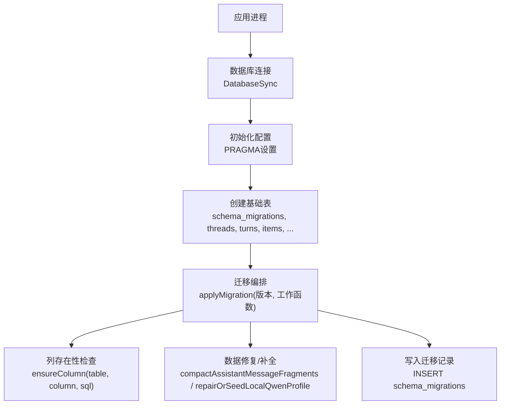
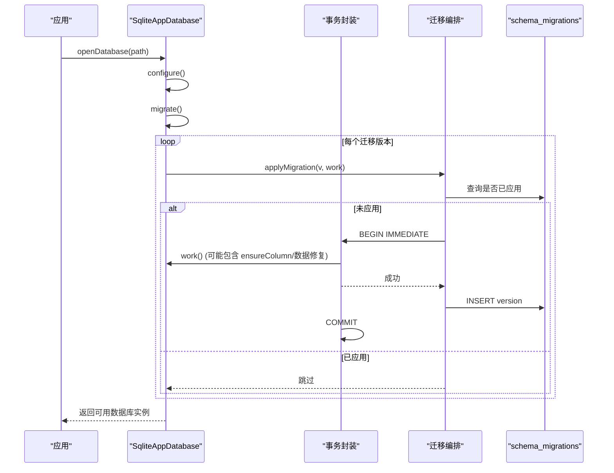
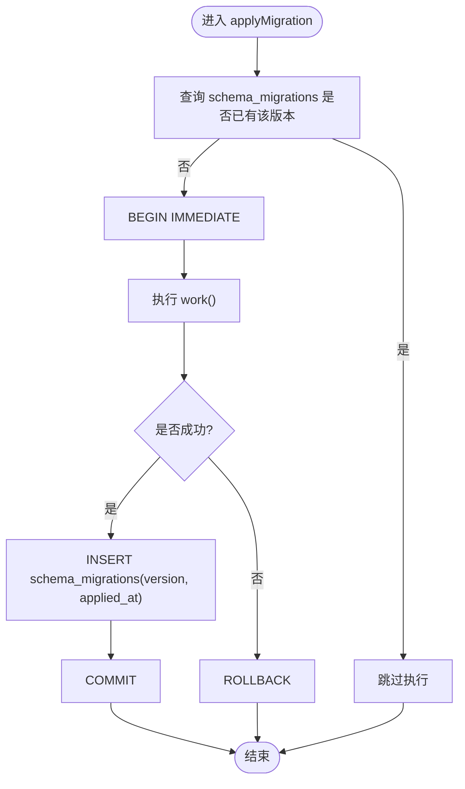
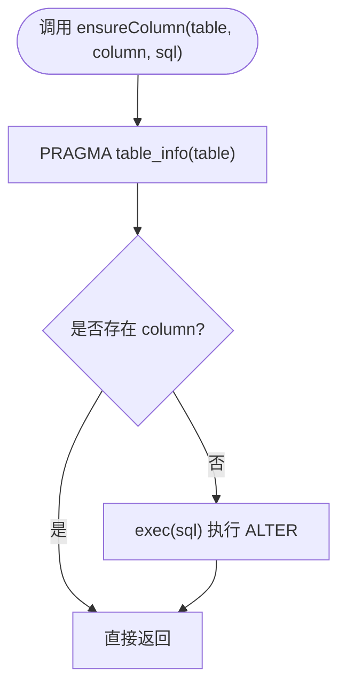
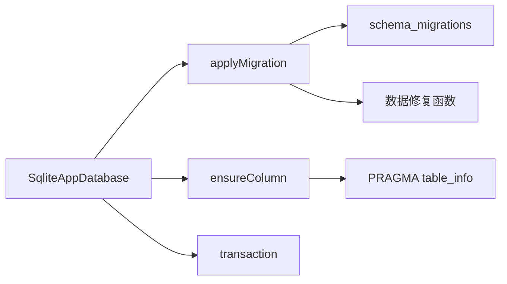

# 迁移开发指南

<cite>
**本文引用的文件**
- [src/agent/database.ts](file://src/agent/database.ts)
- [tests/database.test.ts](file://tests/database.test.ts)
</cite>

## 目录
1. [简介](#简介)
2. [项目结构](#项目结构)
3. [核心组件](#核心组件)
4. [架构总览](#架构总览)
5. [详细组件分析](#详细组件分析)
6. [依赖关系分析](#依赖关系分析)
7. [性能注意事项](#性能注意事项)
8. [故障排查指南](#故障排查指南)
9. [结论](#结论)
10. [附录](#附录)

## 简介
本指南面向新开发者，系统化讲解如何在当前代码库中编写安全、幂等、可回滚的数据库迁移脚本。重点包括：
- 幂等性设计与错误处理策略
- ensureColumn() 的使用模式与最佳实践
- 迁移脚本命名规范与版本管理约定
- 完整的迁移开发生命周期：需求分析、脚本编写、测试验证、部署发布
- 复杂场景处理：数据转换、表结构重构、索引优化
- 常见陷阱与解决方案
- 实际示例与模板（以仓库现有实现为依据）

## 项目结构
本项目使用 SQLite 作为本地持久化存储，并通过内嵌的版本化迁移机制在应用启动时自动升级数据库。关键位置如下：
- 数据库类与迁移逻辑集中在应用层数据库模块
- 迁移通过 schema_migrations 表记录已应用的版本
- 测试覆盖迁移路径与边界情况，确保向后兼容

图表来源
- [src/agent/database.ts:731-873](file://src/agent/database.ts#L731-L873)
- [src/agent/database.ts:981-993](file://src/agent/database.ts#L981-L993)
- [src/agent/database.ts:1196-1201](file://src/agent/database.ts#L1196-L1201)

章节来源
- [src/agent/database.ts:731-873](file://src/agent/database.ts#L731-L873)
- [tests/database.test.ts:60-116](file://tests/database.test.ts#L60-L116)

## 核心组件
- 数据库类 SqliteAppDatabase
  - 负责连接配置、建表、迁移编排、事务封装、数据读写
  - 提供 openDatabase(path) 入口
- 迁移系统
  - applyMigration(version, work): 幂等执行迁移，成功则记录版本
  - ensureColumn(table, column, sql): 基于 PRAGMA table_info 判断列是否存在，避免重复 ALTER
- 事务封装
  - transaction(work): BEGIN IMMEDIATE/COMMIT/ROLLBACK 统一封装，异常回滚

章节来源
- [src/agent/database.ts:150-154](file://src/agent/database.ts#L150-L154)
- [src/agent/database.ts:981-993](file://src/agent/database.ts#L981-L993)
- [src/agent/database.ts:1203-1212](file://src/agent/database.ts#L1203-L1212)

## 架构总览
迁移系统在应用启动时按顺序执行，保证：
- 新增字段通过 ensureColumn 安全添加
- 历史数据修复通过独立迁移版本完成
- 所有变更包裹在事务中，失败即回滚
- 最终将版本号写入 schema_migrations，确保幂等

图表来源
- [src/agent/database.ts:739-873](file://src/agent/database.ts#L739-L873)
- [src/agent/database.ts:981-993](file://src/agent/database.ts#L981-L993)
- [src/agent/database.ts:1203-1212](file://src/agent/database.ts#L1203-L1212)

## 详细组件分析

### 迁移编排与幂等性
- 版本控制：每个迁移对应一个整数版本，通过 schema_migrations 记录
- 幂等保障：applyMigration 先查版本，已存在则直接跳过；未存在才执行 work()
- 事务保护：work() 在事务中执行，任何异常都会 ROLLBACK，不会留下半更新状态

图表来源
- [src/agent/database.ts:981-993](file://src/agent/database.ts#L981-L993)
- [src/agent/database.ts:1203-1212](file://src/agent/database.ts#L1203-L1212)

章节来源
- [src/agent/database.ts:981-993](file://src/agent/database.ts#L981-L993)
- [src/agent/database.ts:1203-1212](file://src/agent/database.ts#L1203-L1212)

### ensureColumn() 使用模式与最佳实践
- 作用：在 ALTER TABLE ADD COLUMN 之前，通过 PRAGMA table_info 检查列是否存在，避免重复添加导致错误
- 适用场景：为旧版本数据库增量添加字段，且需要保持多次运行安全
- 最佳实践
  - 始终配合 applyMigration 使用，确保只在新版本首次运行时执行
  - SQL 语句应明确默认值与约束，避免对历史数据造成不一致
  - 对于大表或生产环境，谨慎评估 ALTER 的性能影响

图表来源
- [src/agent/database.ts:1196-1201](file://src/agent/database.ts#L1196-L1201)

章节来源
- [src/agent/database.ts:838-871](file://src/agent/database.ts#L838-L871)
- [src/agent/database.ts:1196-1201](file://src/agent/database.ts#L1196-L1201)

### 数据修复与补全迁移
- 压缩助手消息片段：将同一 turn 的多条 assistant 消息合并为一条，减少冗余
- 修复历史完成状态：根据 items 中的 assistant 消息推断并修正 turns 的状态
- 本地 Qwen 预设修复/补齐：识别占位符或等价模型，更新 capabilities/reasoning，必要时插入默认预设

这些迁移均以独立版本封装，具备幂等性与事务保护。

章节来源
- [src/agent/database.ts:995-1030](file://src/agent/database.ts#L995-L1030)
- [src/agent/database.ts:1032-1038](file://src/agent/database.ts#L1032-L1038)
- [src/agent/database.ts:1040-1135](file://src/agent/database.ts#L1040-L1135)
- [src/agent/database.ts:1137-1194](file://src/agent/database.ts#L1137-L1194)

### 事务与错误处理
- 所有写操作均通过 transaction() 包装，确保原子性
- 异常捕获后执行 ROLLBACK，并抛出错误，便于上层感知
- 针对并发与锁等待，启用 busy_timeout 与 WAL 模式提升稳定性

章节来源
- [src/agent/database.ts:731-737](file://src/agent/database.ts#L731-L737)
- [src/agent/database.ts:1203-1212](file://src/agent/database.ts#L1203-L1212)

### 测试与验证
- 测试覆盖多版本迁移路径，包括：
  - 从旧版本升级到最新版本
  - 缺失中间版本的“断点续迁”
  - 历史数据修复后的结果校验
- 通过构造不同 schema_migrations 状态模拟真实升级场景

章节来源
- [tests/database.test.ts:60-116](file://tests/database.test.ts#L60-L116)
- [tests/database.test.ts:306-320](file://tests/database.test.ts#L306-L320)
- [tests/database.test.ts:678-714](file://tests/database.test.ts#L678-L714)
- [tests/database.test.ts:987-1021](file://tests/database.test.ts#L987-L1021)
- [tests/database.test.ts:1123-1165](file://tests/database.test.ts#L1123-L1165)

## 依赖关系分析
- 数据库类依赖 SQLite 原生接口 DatabaseSync
- 迁移编排依赖 schema_migrations 表进行版本追踪
- 数据修复逻辑依赖 items/turns/threads/model_profiles 等表的既有结构与数据语义
- 测试依赖 openDatabase 与 DatabaseSync 构造不同初始状态

图表来源
- [src/agent/database.ts:739-873](file://src/agent/database.ts#L739-L873)
- [src/agent/database.ts:981-993](file://src/agent/database.ts#L981-L993)
- [src/agent/database.ts:1196-1201](file://src/agent/database.ts#L1196-L1201)

章节来源
- [src/agent/database.ts:739-873](file://src/agent/database.ts#L739-L873)
- [src/agent/database.ts:981-993](file://src/agent/database.ts#L981-L993)

## 性能注意事项
- 大表 ALTER 需谨慎：优先使用 ensureColumn 并在低峰期执行；必要时分批处理
- 批量更新：尽量使用单条 UPDATE 语句聚合修改，减少往返
- 事务粒度：将相关写操作放入同一事务，降低锁竞争与回滚成本
- WAL 模式与 busy_timeout：已启用，有助于并发读取与超时重试

[本节为通用指导，不直接分析具体文件]

## 故障排查指南
- 迁移未生效
  - 检查 schema_migrations 是否记录了目标版本
  - 确认 applyMigration 的版本号递增且唯一
- 重复添加列报错
  - 确保使用 ensureColumn，避免重复 ALTER
- 数据修复不符合预期
  - 核对修复逻辑的条件与排序（如按 created_at/id 顺序）
  - 使用测试用例复现相同初始状态
- 事务回滚
  - 查看异常堆栈定位 work() 内部失败点
  - 确认业务逻辑与 SQL 约束一致性

章节来源
- [src/agent/database.ts:981-993](file://src/agent/database.ts#L981-L993)
- [src/agent/database.ts:1196-1201](file://src/agent/database.ts#L1196-L1201)
- [tests/database.test.ts:430-443](file://tests/database.test.ts#L430-L443)

## 结论
本项目的迁移系统通过版本化、幂等与事务保护，提供了稳定可靠的数据库演进能力。遵循 ensureColumn 与 applyMigration 的模式，结合完善的测试覆盖，可有效降低迁移风险。建议后续新增迁移时严格遵循本文流程与规范，确保平滑升级与数据一致性。

[本节为总结，不直接分析具体文件]

## 附录

### 迁移脚本命名规范与版本管理约定
- 版本编号：使用递增整数，代表一次不可逆的结构/数据变更
- 幂等性：每个迁移必须可重复执行而不改变最终状态
- 事务性：所有变更置于事务中，失败回滚
- 记录：成功执行后写入 schema_migrations(version, applied_at)

章节来源
- [src/agent/database.ts:981-993](file://src/agent/database.ts#L981-L993)

### 完整迁移开发流程
- 需求分析
  - 明确变更范围：新增字段、数据修复、索引优化等
  - 评估影响：表大小、并发、停机窗口
- 脚本编写
  - 使用 applyMigration 包裹变更
  - 使用 ensureColumn 保证列添加幂等
  - 复杂数据转换分批处理，注意事务边界
- 测试验证
  - 构造旧版本数据库（含不同 schema_migrations 状态）
  - 验证数据修复结果与最终 schema
- 部署发布
  - 先在预发环境验证
  - 监控迁移耗时与错误日志
  - 准备回滚方案（如保留旧字段/数据备份）

章节来源
- [src/agent/database.ts:739-873](file://src/agent/database.ts#L739-L873)
- [tests/database.test.ts:60-116](file://tests/database.test.ts#L60-L116)

### 复杂迁移场景处理
- 数据转换
  - 依据 items/turns 语义进行状态推断与修正
  - 使用 ORDER BY 保证确定性顺序
- 表结构重构
  - 分步迁移：先加列，再迁移数据，最后删旧列
  - 使用 ensureColumn 避免重复
- 索引优化
  - 在低峰期执行 CREATE INDEX
  - 评估查询热点，避免过度索引

章节来源
- [src/agent/database.ts:995-1030](file://src/agent/database.ts#L995-L1030)
- [src/agent/database.ts:1137-1194](file://src/agent/database.ts#L1137-L1194)

### 常见陷阱与解决方案
- 重复添加列导致错误
  - 解决：使用 ensureColumn
- 迁移中途崩溃导致部分更新
  - 解决：使用事务包裹，失败回滚
- 历史数据不一致导致修复失败
  - 解决：增加健壮的数据校验与容错逻辑
- 并发写入冲突
  - 解决：WAL + busy_timeout + 合理事务粒度

章节来源
- [src/agent/database.ts:1196-1201](file://src/agent/database.ts#L1196-L1201)
- [src/agent/database.ts:1203-1212](file://src/agent/database.ts#L1203-L1212)

### 实际示例与模板（基于仓库实现）
- 新增字段模板
  - 使用 ensureColumn('table', 'column', 'ALTER TABLE table ADD COLUMN column ...')
  - 通过 applyMigration(newVersion, () => ensureColumn(...)) 包裹
- 数据修复模板
  - 查询待修复数据，分组/排序后批量更新
  - 使用事务包裹，确保原子性
- 幂等性模板
  - 每次迁移前检查 schema_migrations 是否已存在
  - 使用 INSERT OR IGNORE/ON CONFLICT 避免重复

章节来源
- [src/agent/database.ts:838-871](file://src/agent/database.ts#L838-L871)
- [src/agent/database.ts:981-993](file://src/agent/database.ts#L981-L993)
- [src/agent/database.ts:995-1030](file://src/agent/database.ts#L995-L1030)
- [src/agent/database.ts:1137-1194](file://src/agent/database.ts#L1137-L1194)