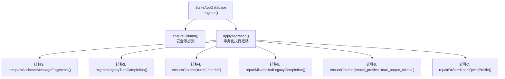
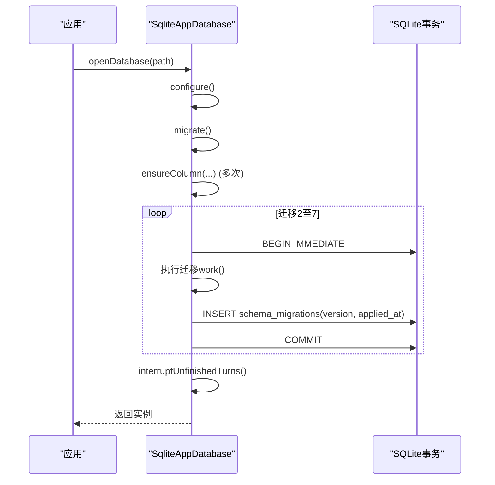
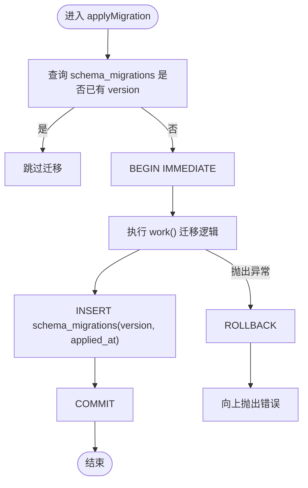
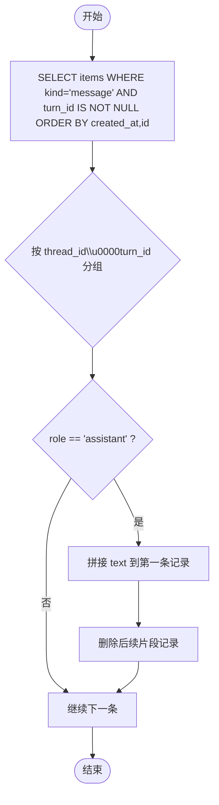
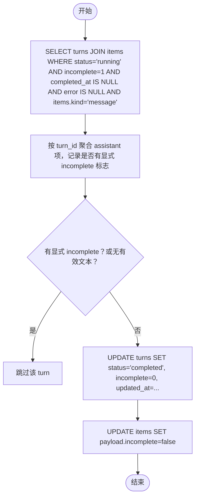
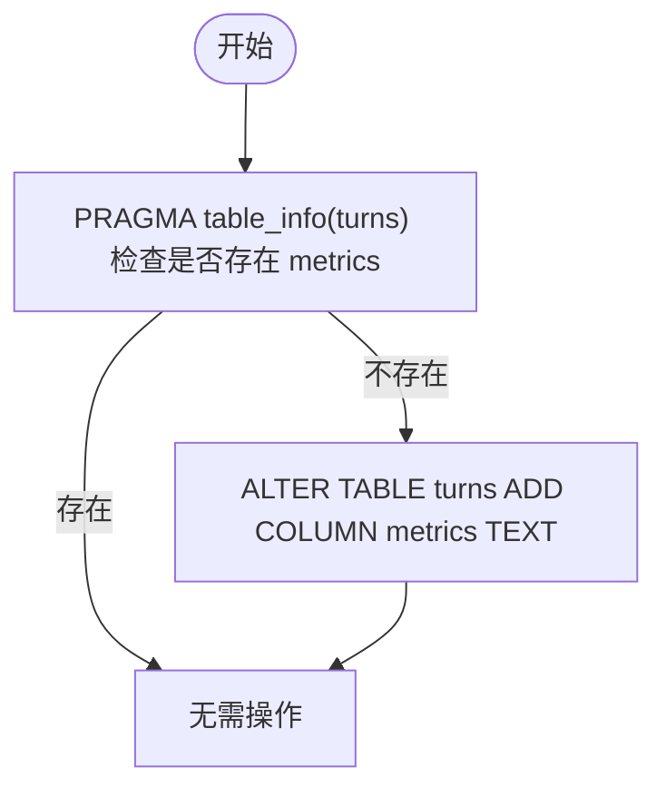
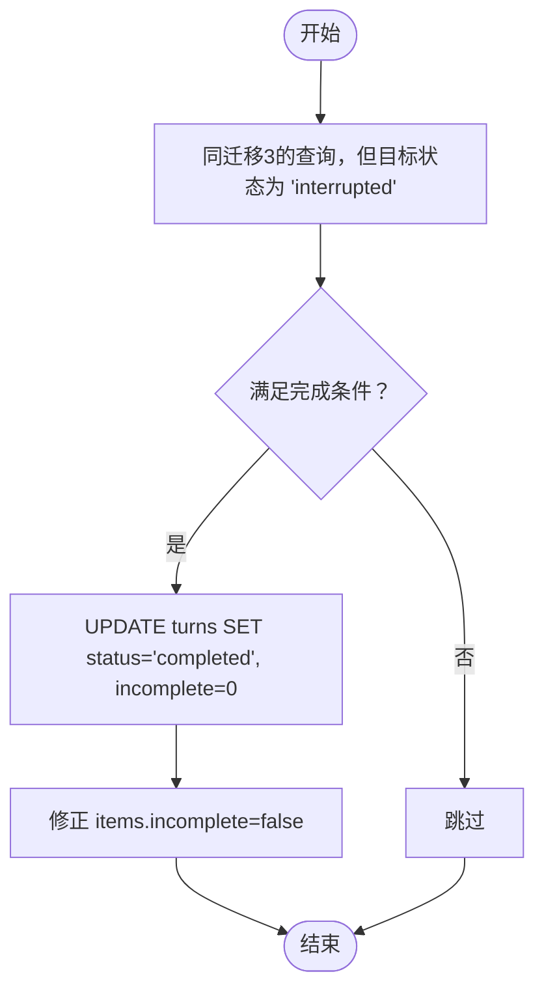
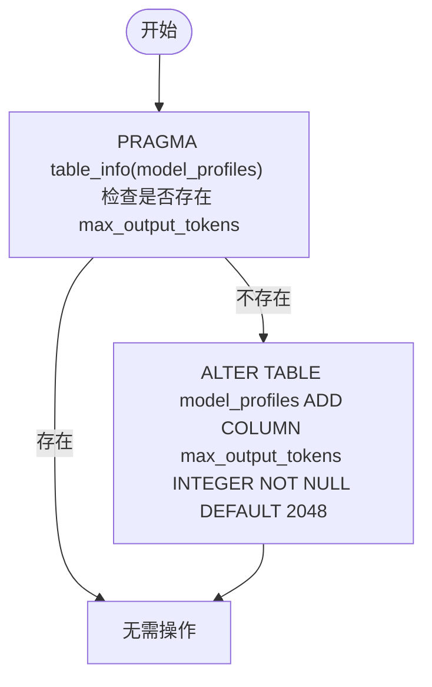
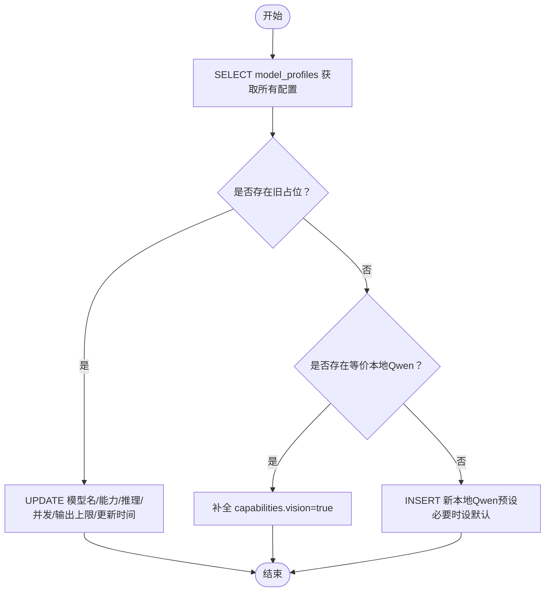
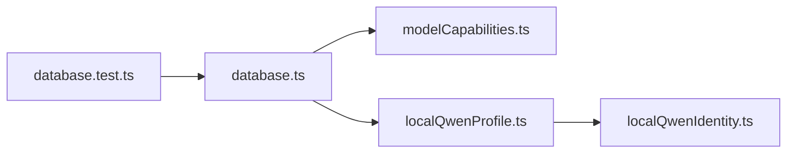

# 迁移操作详解

<cite>
**本文引用的文件**
- [src/agent/database.ts](file://src/agent/database.ts)
- [src/agent/localQwenProfile.ts](file://src/agent/localQwenProfile.ts)
- [src/shared/localQwenIdentity.ts](file://src/shared/localQwenIdentity.ts)
- [tests/database.test.ts](file://tests/database.test.ts)
</cite>

## 目录
1. [简介](#简介)
2. [项目结构](#项目结构)
3. [核心组件](#核心组件)
4. [架构总览](#架构总览)
5. [详细组件分析](#详细组件分析)
6. [依赖关系分析](#依赖关系分析)
7. [性能考虑](#性能考虑)
8. [故障排查指南](#故障排查指南)
9. [结论](#结论)
10. [附录](#附录)

## 简介
本技术文档聚焦于数据库迁移机制与已实施的迁移步骤，覆盖以下方面：
- 迁移执行机制：applyMigration() 的事务处理、幂等性与错误回滚策略
- 各版本迁移的具体变更：迁移2（助手消息片段压缩）、迁移3（传统完成状态修复）、迁移4（指标列添加）、迁移5（错误标签修复）、迁移6（最大输出令牌列添加）、迁移7（本地Qwen配置修复）
- 调试方法与性能优化建议
- 具体SQL语句示例与预期结果

## 项目结构
与迁移相关的核心实现集中在 SQLite 应用数据库层，包含表结构初始化、迁移编排、数据修复与字段补齐逻辑。测试用例提供了历史数据库构造与迁移验证场景。

图表来源
- [src/agent/database.ts:739-872](file://src/agent/database.ts#L739-L872)
- [src/agent/database.ts:981-1135](file://src/agent/database.ts#L981-L1135)

章节来源
- [src/agent/database.ts:739-872](file://src/agent/database.ts#L739-L872)

## 核心组件
- SqliteAppDatabase：封装SQLite连接、表结构初始化、迁移编排与业务读写方法
- applyMigration(version, work)：幂等执行迁移，包裹在事务中，成功写入schema_migrations记录
- ensureColumn(table, column, sql)：基于PRAGMA检测列是否存在，避免重复ALTER TABLE
- 数据修复函数：compactAssistantMessageFragments、completeLegacyTurns、repairOrSeedLocalQwenProfile
- 本地Qwen配置：localQwenProfileInput、isLegacyLocalQwenPlaceholder、常量标识

章节来源
- [src/agent/database.ts:981-1212](file://src/agent/database.ts#L981-L1212)
- [src/agent/localQwenProfile.ts:13-31](file://src/agent/localQwenProfile.ts#L13-L31)
- [src/shared/localQwenIdentity.ts:1-20](file://src/shared/localQwenIdentity.ts#L1-L20)

## 架构总览
迁移流程由构造函数触发，先创建基础表并插入默认设置，再按顺序调用 ensureColumn 补齐历史字段，最后依次执行 applyMigration(2..7)。每个迁移在独立事务内执行，成功后记录版本；若失败则回滚，保证一致性。

图表来源
- [src/agent/database.ts:739-872](file://src/agent/database.ts#L739-L872)
- [src/agent/database.ts:981-1012](file://src/agent/database.ts#L981-L1012)
- [src/agent/database.ts:1203-1212](file://src/agent/database.ts#L1203-L1212)

## 详细组件分析

### 迁移执行机制：applyMigration()
- 幂等性：查询 schema_migrations 是否已存在该版本，存在则跳过
- 事务性：使用 BEGIN IMMEDIATE 包裹迁移工作，提交时写入版本时间戳；异常时 ROLLBACK
- 可观测性：通过 schema_migrations 记录已应用的版本与应用时间

图表来源
- [src/agent/database.ts:981-993](file://src/agent/database.ts#L981-L993)
- [src/agent/database.ts:1203-1212](file://src/agent/database.ts#L1203-L1212)

章节来源
- [src/agent/database.ts:981-993](file://src/agent/database.ts#L981-L993)
- [src/agent/database.ts:1203-1212](file://src/agent/database.ts#L1203-L1212)

### 迁移2：助手消息片段压缩（compactAssistantMessageFragments）
- 目标：将同一 turn 下多条 assistant 的 message 片段合并为一条完整文本，删除多余片段行
- 关键逻辑：
  - 扫描 items 表中 kind=message 且 turn_id 非空的行，按 thread_id + turn_id 分组
  - 对 assistant 角色进行拼接，更新第一条记录的 payload，删除其余片段
- 影响范围：items 表，仅涉及 assistant 消息流式片段的历史数据整理

图表来源
- [src/agent/database.ts:995-1030](file://src/agent/database.ts#L995-L1030)

章节来源
- [src/agent/database.ts:995-1030](file://src/agent/database.ts#L995-L1030)

### 迁移3：传统完成状态修复（migrateLegacyTurnCompletion）
- 目标：修复旧版数据中处于 running 且 incomplete=1 但实际已完成的历史轮次
- 关键逻辑：
  - 查找 status='running'、incomplete=1、completed_at IS NULL、error IS NULL 的 turns
  - 关联 items 中 kind='message' 的 assistant 消息，若无显式 incomplete 标志且存在非空文本，则视为完成
  - 将 turns 状态置为 completed，incomplete=0，并修正对应 item 的 incomplete=false
- 注意：若存在显式的流式状态标记，为避免误判，保持原状

图表来源
- [src/agent/database.ts:1032-1038](file://src/agent/database.ts#L1032-L1038)
- [src/agent/database.ts:1137-1194](file://src/agent/database.ts#L1137-L1194)

章节来源
- [src/agent/database.ts:1032-1038](file://src/agent/database.ts#L1032-L1038)
- [src/agent/database.ts:1137-1194](file://src/agent/database.ts#L1137-L1194)

### 迁移4：指标列添加（turns.metrics）
- 目标：为 turns 表新增 metrics 列以存储运行指标（JSON字符串）
- 实现：ensureColumn('turns','metrics','ALTER TABLE turns ADD COLUMN metrics TEXT')
- 语义：新列可为空，兼容历史数据；读取时解析为结构化对象

图表来源
- [src/agent/database.ts:864-865](file://src/agent/database.ts#L864-L865)
- [src/agent/database.ts:1196-1201](file://src/agent/database.ts#L1196-L1201)

章节来源
- [src/agent/database.ts:864-865](file://src/agent/database.ts#L864-L865)
- [src/agent/database.ts:1196-1201](file://src/agent/database.ts#L1196-L1201)

### 迁移5：错误标签修复（repairMislabelledLegacyCompletion）
- 目标：修复被错误标记为 interrupted 但实际应完成的旧数据
- 关键逻辑：复用 completeLegacyTurns(status='interrupted')，条件与迁移3相同，仅目标状态不同
- 适用场景：历史中断标签不准确，但存在有效的 assistant 完成内容

图表来源
- [src/agent/database.ts:1036-1038](file://src/agent/database.ts#L1036-L1038)
- [src/agent/database.ts:1137-1194](file://src/agent/database.ts#L1137-L1194)

章节来源
- [src/agent/database.ts:1036-1038](file://src/agent/database.ts#L1036-L1038)
- [src/agent/database.ts:1137-1194](file://src/agent/database.ts#L1137-L1194)

### 迁移6：最大输出令牌列添加（model_profiles.max_output_tokens）
- 目标：为 model_profiles 表新增 max_output_tokens 列，限制模型输出长度
- 实现：ensureColumn('model_profiles','max_output_tokens','ALTER TABLE model_profiles ADD COLUMN max_output_tokens INTEGER NOT NULL DEFAULT 2048')
- 影响：后续保存模型配置时会写入该字段；读取时用于归一化输出上限

图表来源
- [src/agent/database.ts:866-870](file://src/agent/database.ts#L866-L870)
- [src/agent/database.ts:1196-1201](file://src/agent/database.ts#L1196-L1201)

章节来源
- [src/agent/database.ts:866-870](file://src/agent/database.ts#L866-L870)
- [src/agent/database.ts:1196-1201](file://src/agent/database.ts#L1196-L1201)

### 迁移7：本地Qwen配置修复（repairOrSeedLocalQwenProfile）
- 目标：识别并修复旧的本地Qwen占位配置，或在缺失时注入默认本地Qwen配置
- 行为分支：
  - 若存在“旧占位”配置（provider=openai-compatible，baseUrl=LOCAL_QWEN_BASE_URL，model='your-model-name'），则更新为当前预设（模型名、能力、推理设置、并发与输出上限等）
  - 若存在等价本地Qwen配置（baseUrl与model匹配），则补全 capabilities.vision=true
  - 若均不存在，则插入新的本地Qwen预设；若当前无默认模型，则将其设为默认并更新 activeModelProfileId
- 相关常量与工厂：
  - LOCAL_QWEN_BASE_URL、LOCAL_QWEN_MODEL、LOCAL_QWEN_PROFILE_ID
  - localQwenProfileInput() 提供预设输入
  - isLegacyLocalQwenPlaceholder() 判断旧占位

图表来源
- [src/agent/database.ts:1040-1135](file://src/agent/database.ts#L1040-L1135)
- [src/agent/localQwenProfile.ts:13-31](file://src/agent/localQwenProfile.ts#L13-L31)
- [src/shared/localQwenIdentity.ts:1-20](file://src/shared/localQwenIdentity.ts#L1-L20)

章节来源
- [src/agent/database.ts:1040-1135](file://src/agent/database.ts#L1040-L1135)
- [src/agent/localQwenProfile.ts:13-31](file://src/agent/localQwenProfile.ts#L13-L31)
- [src/shared/localQwenIdentity.ts:1-20](file://src/shared/localQwenIdentity.ts#L1-L20)

## 依赖关系分析
- database.ts 依赖：
  - shared/domain.ts：类型定义（如 ModelProfile、Item、TurnRecord 等）
  - agent/modelCapabilities.ts：能力与推理设置的归一化
  - agent/localQwenProfile.ts：本地Qwen预设与占位识别
  - shared/localQwenIdentity.ts：本地Qwen常量标识
- 测试依赖：
  - tests/database.test.ts：构造历史数据库（v3/v5/mislabelled v4）并断言迁移后 schema_migrations 的版本链

图表来源
- [src/agent/database.ts:1-36](file://src/agent/database.ts#L1-L36)
- [src/agent/localQwenProfile.ts:1-31](file://src/agent/localQwenProfile.ts#L1-L31)
- [src/shared/localQwenIdentity.ts:1-20](file://src/shared/localQwenIdentity.ts#L1-L20)
- [tests/database.test.ts:986-1200](file://tests/database.test.ts#L986-L1200)

章节来源
- [src/agent/database.ts:1-36](file://src/agent/database.ts#L1-L36)
- [tests/database.test.ts:986-1200](file://tests/database.test.ts#L986-L1200)

## 性能考虑
- WAL模式与外键约束：configure() 启用 WAL、开启外键、设置 busy_timeout，提升并发与稳定性
- 批量更新与最小化IO：
  - 迁移2使用预编译语句 UPDATE/DELETE 批量处理片段合并，减少往返
  - 迁移3/5采用聚合后再批量更新，降低锁竞争
- 幂等与跳过：applyMigration 避免重复执行；ensureColumn 防止重复 ALTER
- 建议：
  - 大表迁移前评估索引与统计信息
  - 分批次处理超大 items 集合，避免长事务
  - 监控 schema_migrations 记录与应用时间，便于定位慢迁移

[本节为通用指导，不直接分析具体文件]

## 故障排查指南
- 查看已应用版本：
  - SELECT version FROM schema_migrations ORDER BY version;
  - 期望结果：新版本数据库应包含 [1,2,3,4,5,6,7]
- 检查迁移是否重复执行：
  - 若某版本未写入 schema_migrations，检查事务是否回滚及日志
- 验证字段补齐：
  - PRAGMA table_info(turns); 确认 metrics 存在
  - PRAGMA table_info(model_profiles); 确认 max_output_tokens 存在
- 验证数据修复：
  - 迁移3/5后，检查 runs 状态与 items.incomplete 是否符合预期
- 本地Qwen配置：
  - 检查 model_profiles 中是否存在本地Qwen预设或等价配置，capabilities.vision 是否正确

章节来源
- [tests/database.test.ts:1018-1021](file://tests/database.test.ts#L1018-L1021)
- [tests/database.test.ts:1091-1097](file://tests/database.test.ts#L1091-L1097)
- [tests/database.test.ts:1161-1166](file://tests/database.test.ts#L1161-L1166)

## 结论
本迁移体系通过幂等的 applyMigration 与安全的 ensureColumn 组合，实现了向后兼容的增量演进。迁移2-7分别解决了历史数据完整性、状态正确性、扩展字段与本地Qwen配置问题。结合事务与回滚机制，确保迁移过程一致可靠。建议在大规模数据上分批执行并加强监控，以获得更优的性能与可维护性。

[本节为总结，不直接分析具体文件]

## 附录

### 各迁移版本变更清单
- 迁移2：助手消息片段压缩
  - 操作：合并 assistant 消息片段，删除冗余行
  - 影响表：items
  - 目的：减少碎片，提升可读性与存储效率
- 迁移3：传统完成状态修复
  - 操作：将符合条件的 running+incomplete 历史轮次改为 completed，并修正 items.incomplete
  - 影响表：turns、items
  - 目的：恢复历史数据的真实完成状态
- 迁移4：指标列添加
  - 操作：ALTER TABLE turns ADD COLUMN metrics TEXT
  - 影响表：turns
  - 目的：支持存储运行指标（JSON）
- 迁移5：错误标签修复
  - 操作：将部分误标为 interrupted 的历史轮次修复为 completed
  - 影响表：turns、items
  - 目的：纠正历史状态标签
- 迁移6：最大输出令牌列添加
  - 操作：ALTER TABLE model_profiles ADD COLUMN max_output_tokens INTEGER NOT NULL DEFAULT 2048
  - 影响表：model_profiles
  - 目的：统一控制模型输出长度
- 迁移7：本地Qwen配置修复
  - 操作：识别并修复旧占位配置；补全 capabilities.vision；必要时插入默认本地Qwen预设
  - 影响表：model_profiles、settings（activeModelProfileId）
  - 目的：确保本地Qwen配置一致可用

章节来源
- [src/agent/database.ts:862-872](file://src/agent/database.ts#L862-L872)
- [src/agent/database.ts:995-1135](file://src/agent/database.ts#L995-L1135)

### 典型SQL语句示例与预期结果
- 检查已应用版本
  - SQL: SELECT version FROM schema_migrations ORDER BY version;
  - 预期：[1,2,3,4,5,6,7]
- 添加指标列（迁移4）
  - SQL: ALTER TABLE turns ADD COLUMN metrics TEXT;
  - 预期：turns 表新增 metrics 列，允许为空
- 添加最大输出令牌列（迁移6）
  - SQL: ALTER TABLE model_profiles ADD COLUMN max_output_tokens INTEGER NOT NULL DEFAULT 2048;
  - 预期：model_profiles 表新增 max_output_tokens 列，默认值2048
- 修复历史完成状态（迁移3/5）
  - SQL: UPDATE turns SET status='completed', incomplete=0, updated_at=:ts WHERE id=:id;
  - 预期：指定 turn 的状态变为 completed，incomplete 清零
  - SQL: UPDATE items SET payload = :payload WHERE id = :id;
  - 预期：对应 assistant 项的 incomplete 标志设为 false

章节来源
- [src/agent/database.ts:864-870](file://src/agent/database.ts#L864-L870)
- [src/agent/database.ts:1137-1194](file://src/agent/database.ts#L1137-L1194)