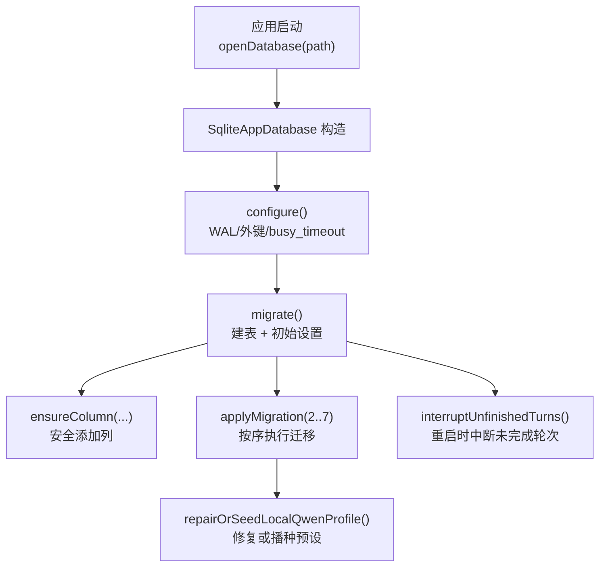
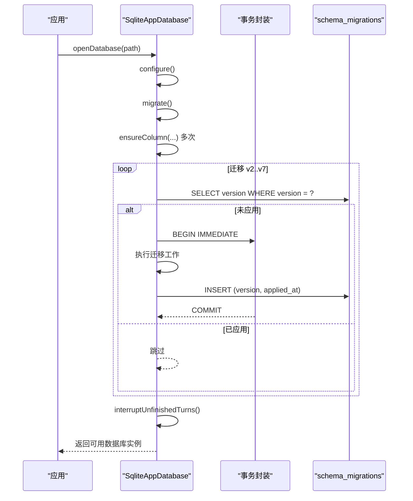
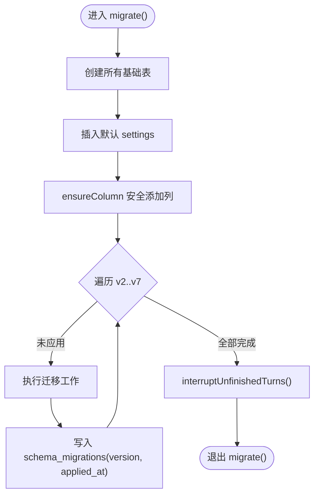
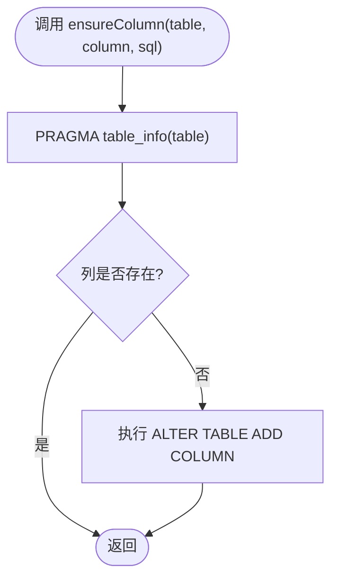
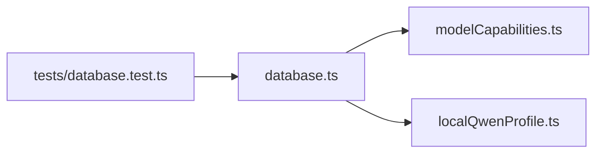

# 迁移版本控制

<cite>
**本文引用的文件**
- [src/agent/database.ts](file://src/agent/database.ts)
- [tests/database.test.ts](file://tests/database.test.ts)
- [src/agent/modelCapabilities.ts](file://src/agent/modelCapabilities.ts)
- [src/agent/localQwenProfile.ts](file://src/agent/localQwenProfile.ts)
</cite>

## 目录
1. [简介](#简介)
2. [项目结构](#项目结构)
3. [核心组件](#核心组件)
4. [架构总览](#架构总览)
5. [详细组件分析](#详细组件分析)
6. [依赖关系分析](#依赖关系分析)
7. [性能考量](#性能考量)
8. [故障排查指南](#故障排查指南)
9. [结论](#结论)
10. [附录：如何添加新的迁移版本](#附录如何添加新的迁移版本)

## 简介
本技术文档聚焦于应用内 SQLite 数据库的迁移版本控制系统，围绕 schema_migrations 表的设计与用途、migrate() 方法的初始化逻辑、版本号递增策略与向后兼容机制、ensureColumn() 的安全性与错误处理，以及版本管理的最佳实践和故障恢复方案进行系统化说明。文档同时提供“如何添加新迁移版本”的可操作指引，并给出关键流程的图示化说明，帮助读者快速理解与维护该子系统。

## 项目结构
- 数据库与迁移逻辑集中在 src/agent/database.ts，包含：
  - 数据库配置（WAL、外键、busy_timeout）
  - 初始建表（threads、chat_groups、turns、items、approvals、settings、workspaces、model_profiles）
  - 迁移追踪表 schema_migrations
  - 迁移编排与执行（applyMigration）
  - 列安全添加（ensureColumn）
  - 数据修复与种子数据（如本地 Qwen 预设）
- 测试覆盖在 tests/database.test.ts，验证迁移结果、幂等性、数据修复与种子行为。
- 模型能力与默认值归一化在 src/agent/modelCapabilities.ts，提供 maxOutputTokens 上限与默认值、能力归一化等。
- 本地 Qwen 预设定义在 src/agent/localQwenProfile.ts，用于识别占位符与生成默认预设。

**图表来源**
- [src/agent/database.ts:731-873](file://src/agent/database.ts#L731-L873)

**章节来源**
- [src/agent/database.ts:731-873](file://src/agent/database.ts#L731-L873)
- [tests/database.test.ts:61-116](file://tests/database.test.ts#L61-L116)

## 核心组件
- schema_migrations 表
  - 字段 version：记录已应用的迁移版本号，作为主键，确保每个迁移仅执行一次。
  - 字段 applied_at：记录迁移应用的时间戳，便于审计与排障。
- migrate() 方法
  - 负责创建所有基础表与初始 settings 行。
  - 通过 ensureColumn() 安全地添加历史遗留列，保证旧库升级不报错。
  - 通过 applyMigration() 顺序执行 v2..v7 的迁移任务，并在事务中写入 schema_migrations。
- ensureColumn() 方法
  - 使用 PRAGMA table_info 检查列是否存在，不存在则执行 ALTER TABLE ADD COLUMN。
  - 天然支持幂等执行，避免重复添加导致异常。
- applyMigration() 方法
  - 查询 schema_migrations 判断是否已执行对应版本。
  - 未执行则在 BEGIN IMMEDIATE 事务中执行迁移工作，并插入 version 与 applied_at。
  - 若迁移失败，ROLLBACK 回滚，保证一致性。

**章节来源**
- [src/agent/database.ts:739-873](file://src/agent/database.ts#L739-L873)
- [src/agent/database.ts:981-993](file://src/agent/database.ts#L981-L993)
- [src/agent/database.ts:1196-1201](file://src/agent/database.ts#L1196-L1201)

## 架构总览
下图展示了数据库打开到迁移完成的完整调用链，包括迁移编排、列安全添加、数据修复与种子数据注入。

**图表来源**
- [src/agent/database.ts:739-873](file://src/agent/database.ts#L739-L873)
- [src/agent/database.ts:981-993](file://src/agent/database.ts#L981-L993)
- [src/agent/database.ts:1203-1212](file://src/agent/database.ts#L1203-L1212)

## 详细组件分析

### schema_migrations 表设计
- version INTEGER PRIMARY KEY：唯一标识迁移版本，强制顺序与幂等。
- applied_at TEXT NOT NULL：记录应用时间，便于审计与问题回溯。
- 插入时机：每次成功完成一个迁移后，在事务末尾插入当前版本与时间戳。

**章节来源**
- [src/agent/database.ts:741-744](file://src/agent/database.ts#L741-L744)
- [src/agent/database.ts:981-993](file://src/agent/database.ts#L981-L993)

### migrate() 初始化逻辑
- 建表阶段：创建 threads、chat_groups、turns、items、approvals、settings、workspaces、model_profiles 等核心表。
- 初始设置：插入默认 settings（主题、语言、活跃模型配置、指标显示、消息限制、推理显示模式）。
- 列安全添加：对历史表结构增量补齐（如 model_profile_id、group_id、deleted_at、started_at、completed_at、error、incomplete、reasoning、max_concurrency、response_speed 等）。
- 迁移编排：依次执行 v2..v7 的迁移任务。
- 收尾清理：中断未完成的轮次，保证重启后状态一致。

**图表来源**
- [src/agent/database.ts:739-873](file://src/agent/database.ts#L739-L873)

**章节来源**
- [src/agent/database.ts:739-873](file://src/agent/database.ts#L739-L873)

### 版本号递增策略与向后兼容
- 版本号递增：新增迁移时，追加更高版本号（例如 v7 之后为 v8），保持严格单调递增，避免冲突。
- 向后兼容：
  - 通过 ensureColumn() 对历史表结构进行增量补齐，避免旧库直接因缺失列而崩溃。
  - 迁移内部尽量幂等，允许重复执行而不破坏数据。
  - 对历史数据进行修复（如补全推理字段、修正不完整轮次状态、修复占位符预设等）。
- 种子数据：当不存在等效本地 Qwen 预设时，自动插入默认预设；若存在但缺少能力字段，则增量更新。

**章节来源**
- [src/agent/database.ts:838-872](file://src/agent/database.ts#L838-L872)
- [src/agent/database.ts:1040-1135](file://src/agent/database.ts#L1040-L1135)

### ensureColumn() 实现原理与安全性
- 实现原理：
  - 使用 PRAGMA table_info(table) 获取列名列表。
  - 若目标列不存在，则执行对应的 ALTER TABLE ADD COLUMN SQL。
- 安全性：
  - 幂等：重复调用不会重复添加列。
  - 错误处理：若 SQL 执行失败，会抛出异常，由上层事务捕获并回滚。
- 适用场景：历史库升级时安全地扩展表结构，无需关心旧库具体版本。

**图表来源**
- [src/agent/database.ts:1196-1201](file://src/agent/database.ts#L1196-L1201)

**章节来源**
- [src/agent/database.ts:1196-1201](file://src/agent/database.ts#L1196-L1201)

### 迁移任务概览（v2..v7）
- v2：压缩助手消息片段，合并流式输出。
- v3：修复历史轮次完成状态。
- v4：为 turns 表增加 metrics 字段。
- v5：修复误标记的历史完成状态。
- v6：为 model_profiles 增加 max_output_tokens 字段。
- v7：修复或播种本地 Qwen 预设，确保默认模型可用且能力完整。

**章节来源**
- [src/agent/database.ts:862-872](file://src/agent/database.ts#L862-L872)

## 依赖关系分析
- database.ts 依赖：
  - modelCapabilities.ts：提供能力归一化、最大输出 token 限制与默认值。
  - localQwenProfile.ts：提供本地 Qwen 预设的输入结构与占位符识别。
- 测试依赖：
  - tests/database.test.ts：验证迁移结果、幂等性、数据修复与种子行为。

**图表来源**
- [src/agent/database.ts:1-37](file://src/agent/database.ts#L1-L37)
- [src/agent/modelCapabilities.ts:1-24](file://src/agent/modelCapabilities.ts#L1-L24)
- [src/agent/localQwenProfile.ts:1-32](file://src/agent/localQwenProfile.ts#L1-L32)
- [tests/database.test.ts:1-16](file://tests/database.test.ts#L1-L16)

**章节来源**
- [src/agent/database.ts:1-37](file://src/agent/database.ts#L1-L37)
- [src/agent/modelCapabilities.ts:1-24](file://src/agent/modelCapabilities.ts#L1-L24)
- [src/agent/localQwenProfile.ts:1-32](file://src/agent/localQwenProfile.ts#L1-L32)
- [tests/database.test.ts:1-16](file://tests/database.test.ts#L1-L16)

## 性能考量
- WAL 模式：提升并发读写性能，减少锁竞争。
- busy_timeout：设置等待超时，降低忙锁导致的失败概率。
- 事务边界：迁移与写操作均包裹在事务中，减少中间态风险。
- 幂等迁移：确保重复执行无副作用，适合重试与回滚。
- 列安全添加：避免全表重建，降低升级成本。

[本节为通用指导，不直接分析具体文件]

## 故障排查指南
- 迁移失败回滚：
  - applyMigration() 使用事务包装，任何异常都会触发 ROLLBACK，保证数据库一致性。
  - 排查重点：迁移 SQL 是否正确、依赖列是否存在、数据约束是否满足。
- 重复执行保护：
  - schema_migrations 中已存在的 version 会被跳过，避免重复执行。
  - ensureColumn() 基于 PRAGMA 检测列存在性，防止重复添加。
- 数据修复与种子：
  - 若本地 Qwen 预设为占位符，v7 会修复其能力与字段；若无等效预设，将插入默认预设。
  - 若已有等效预设但缺少能力字段，将增量更新。
- 常见错误定位：
  - 检查 schema_migrations 中的 version 与 applied_at，确认哪些迁移已执行。
  - 检查 ensureColumn 相关表的列是否存在。
  - 检查测试用例中关于迁移版本的断言，确保与当前最高版本一致。

**章节来源**
- [src/agent/database.ts:981-993](file://src/agent/database.ts#L981-L993)
- [src/agent/database.ts:1196-1201](file://src/agent/database.ts#L1196-L1201)
- [src/agent/database.ts:1040-1135](file://src/agent/database.ts#L1040-L1135)
- [tests/database.test.ts:108-116](file://tests/database.test.ts#L108-L116)

## 结论
该迁移版本控制系统以 schema_migrations 为核心，结合 ensureColumn() 与 applyMigration() 实现了安全、幂等、可追溯的数据库演进。通过严格的版本号递增与事务保障，系统在向后兼容与数据修复方面具备良好鲁棒性。配合完善的测试覆盖，可在迭代中持续演进数据结构与业务语义，同时保持运行时的稳定性与可维护性。

[本节为总结性内容，不直接分析具体文件]

## 附录：如何添加新的迁移版本
步骤建议：
1. 确定新版本号：在当前最高版本基础上递增（例如当前最高为 v7，则新增 v8）。
2. 编写迁移逻辑：
   - 如需新增列：使用 ensureColumn('table', 'column', 'ALTER TABLE ...')。
   - 如需数据修复：编写幂等的 UPDATE/INSERT/DELETE 语句，确保可重复执行。
   - 如需种子数据：仅在不存在等效数据时插入，避免覆盖用户自定义数据。
3. 在 migrate() 中注册迁移：
   - 在迁移编排处追加 this.applyMigration(8, () => { /* 迁移工作 */ });
4. 更新测试断言：
   - 在 tests/database.test.ts 中校验 schema_migrations 的版本序列，确保包含新版本。
5. 验证与提交：
   - 运行测试，确保迁移幂等、数据修复正确、种子数据符合预期。
   - 提交代码并记录变更说明。

参考路径：
- 迁移编排位置：[src/agent/database.ts:862-872](file://src/agent/database.ts#L862-L872)
- 迁移执行封装：[src/agent/database.ts:981-993](file://src/agent/database.ts#L981-L993)
- 列安全添加示例：[src/agent/database.ts:838-872](file://src/agent/database.ts#L838-L872)
- 测试版本断言示例：[tests/database.test.ts:108-116](file://tests/database.test.ts#L108-L116)

**章节来源**
- [src/agent/database.ts:862-872](file://src/agent/database.ts#L862-L872)
- [src/agent/database.ts:981-993](file://src/agent/database.ts#L981-L993)
- [tests/database.test.ts:108-116](file://tests/database.test.ts#L108-L116)