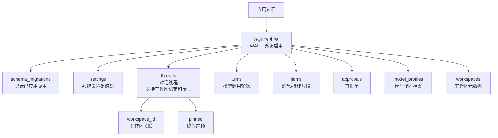
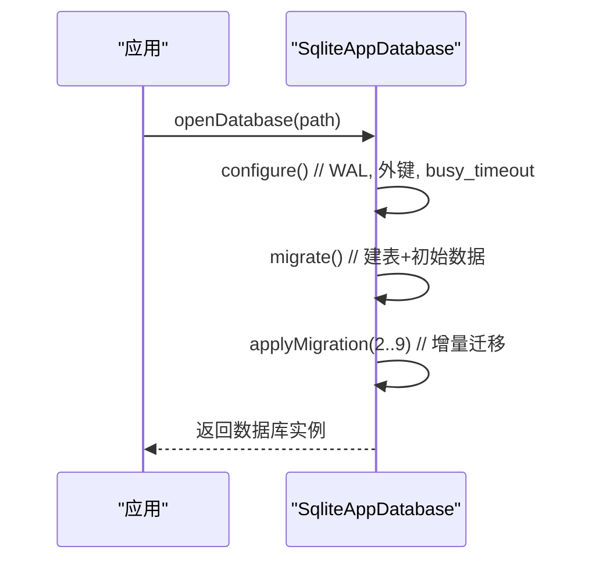
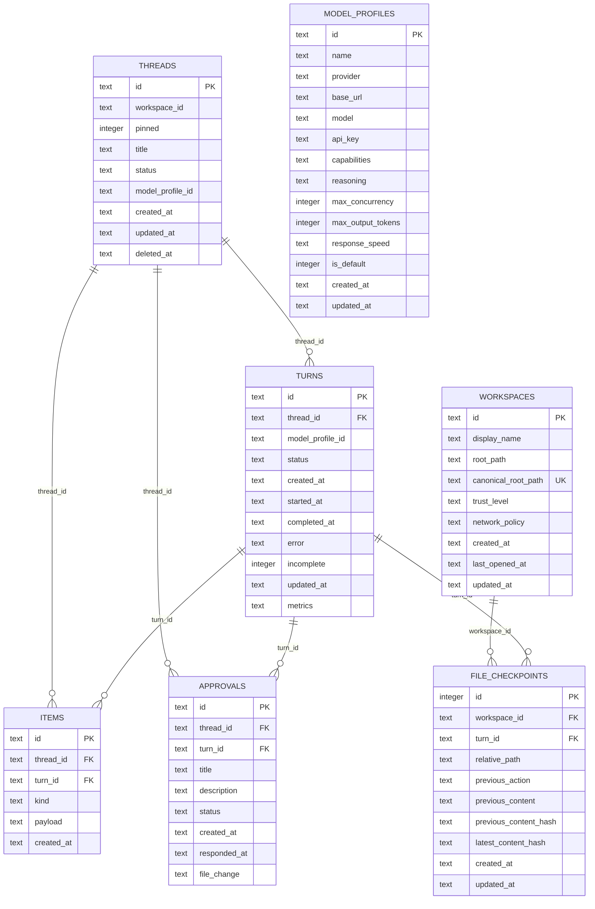

# 表结构定义

<cite>
**本文引用的文件**
- [src/agent/database.ts](file://src/agent/database.ts)
- [tests/database.test.ts](file://tests/database.test.ts)
- [src/shared/domain.ts](file://src/shared/domain.ts)
</cite>

## 更新摘要
**所做更改**
- 移除了chat_groups表的文档说明（该表在迁移中已被废弃）
- 更新了threads表结构，新增workspace_id和pinned字段
- 移除了group_id字段的引用，改为workspace_id工作区绑定机制
- 新增了线程置顶功能（pinned字段）的详细说明
- 更新了工作区绑定机制的说明，替代原有的分组机制
- 修正了ER图和关系说明以反映新的架构设计

## 目录
1. [简介](#简介)
2. [项目结构](#项目结构)
3. [核心组件](#核心组件)
4. [架构总览](#架构总览)
5. [详细组件分析](#详细组件分析)
6. [依赖关系分析](#依赖关系分析)
7. [性能考虑](#性能考虑)
8. [故障排查指南](#故障排查指南)
9. [结论](#结论)
10. [附录](#附录)

## 简介
本文件为 SQLite 数据库的表结构技术文档，覆盖以下核心表：threads、turns、items、approvals、settings、model_profiles、schema_migrations（以及工作区表 workspaces）。文档包含字段设计、数据类型、约束与默认值、主外键关系、业务含义与使用场景、软删除机制说明、完整 CREATE TABLE 语句示例，以及 ER 图与关系说明。所有信息均基于代码库中的实际实现提取。

**重要架构变更**：数据库架构已发生重大变更，移除了chat_groups表和group_id字段，新增workspace_id和pinned字段。threads表结构已更新以支持工作区绑定和线程置顶功能。迁移9新增了这些字段，旧线程将出现在未链接部分直到明确绑定到工作区。

## 项目结构
SQLite 表结构与迁移逻辑集中在应用代理层的数据库模块中，通过初始化时执行建表与增量迁移脚本保证版本演进与数据兼容。测试用例中也包含历史版本的建表片段，用于验证迁移路径的正确性。

图表来源
- [src/agent/database.ts:834-986](file://src/agent/database.ts#L834-L986)

章节来源
- [src/agent/database.ts:834-986](file://src/agent/database.ts#L834-L986)

## 核心组件
- schema_migrations：记录数据库版本与应用时间，驱动增量迁移。
- settings：键值型系统设置，如主题、语言、是否展示指标、上下文消息上限、推理显示模式等。
- threads：对话线程，关联工作区和模型档案，支持软删除、工作区绑定和置顶功能。
- turns：模型调用轮次，记录状态、起止时间、错误、是否未完成、运行指标等。
- items：消息与推理片段，按线程与轮次组织，支持流式合并。
- approvals：审批单，绑定线程与轮次，支持待处理/通过/拒绝状态。
- model_profiles：模型配置档案，包含提供商、基础 URL、模型名、能力、并发限制、最大输出 token、响应速度、是否默认等。
- workspaces：工作区元数据，包含显示名、根路径、信任级别、网络策略等。

章节来源
- [src/agent/database.ts:834-986](file://src/agent/database.ts#L834-L986)

## 架构总览
数据库在启动时完成 WAL 模式、外键约束与超时等配置，并创建基础表与初始数据；随后按版本号顺序执行迁移，确保旧库平滑升级。查询时普遍通过 JOIN 过滤 deleted_at 以实现"逻辑删除"。

图表来源
- [src/agent/database.ts:826-986](file://src/agent/database.ts#L826-L986)

章节来源
- [src/agent/database.ts:826-986](file://src/agent/database.ts#L826-L986)

## 详细组件分析

### 表：schema_migrations
- 用途：记录已应用的迁移版本与时间戳，避免重复执行。
- 字段
  - version INTEGER PRIMARY KEY：迁移版本号，主键。
  - applied_at TEXT NOT NULL：应用时间（ISO 字符串）。
- 约束：PRIMARY KEY(version)。
- 业务含义：作为迁移系统的权威记录，配合 ensureColumn 与 applyMigration 实现向后兼容。

章节来源
- [src/agent/database.ts:836-839](file://src/agent/database.ts#L836-L839)
- [src/agent/database.ts:1078-1090](file://src/agent/database.ts#L1078-L1090)

### 表：settings
- 用途：存储应用级设置项，采用 key-value 形式。
- 字段
  - key TEXT PRIMARY KEY：设置键。
  - value TEXT NOT NULL：设置值。
- 约束：PRIMARY KEY(key)。
- 默认值：初始化时插入 theme、language、activeModelProfileId、showModelMetrics、contextMessageLimit、reasoningDisplayMode 等。
- 业务含义：控制 UI 主题、语言、活跃模型档案、是否展示指标、上下文消息上限、推理显示模式等。

章节来源
- [src/agent/database.ts:894-897](file://src/agent/database.ts#L894-L897)
- [src/agent/database.ts:941-947](file://src/agent/database.ts#L941-L947)
- [src/agent/database.ts:1033-1040](file://src/agent/database.ts#L1033-L1040)

### 表：threads
- 用途：对话线程，承载用户与模型的交互上下文，支持工作区绑定和置顶功能。
- 字段
  - id TEXT PRIMARY KEY：线程标识。
  - workspace_id TEXT：所属工作区（可为空，表示未绑定）。
  - pinned INTEGER NOT NULL DEFAULT 0：是否置顶（1 是，0 否）。
  - title TEXT NOT NULL：标题。
  - status TEXT NOT NULL：状态（如 ready）。
  - model_profile_id TEXT：关联的模型档案（可为空）。
  - created_at TEXT NOT NULL：创建时间。
  - updated_at TEXT NOT NULL：更新时间。
  - deleted_at TEXT：软删除标记（NULL 表示未删除）。
- 约束：PRIMARY KEY(id)。
- 业务含义：每个线程可关联一个工作区和模型档案；支持置顶功能以便优先显示；删除线程时仅做软删除，查询时过滤 deleted_at。

**重要变更**：移除了 group_id 字段，改用 workspace_id 进行工作区绑定；新增 pinned 字段支持线程置顶功能。

章节来源
- [src/agent/database.ts:841-850](file://src/agent/database.ts#L841-L850)
- [src/agent/database.ts:255-291](file://src/agent/database.ts#L255-L291)
- [src/agent/database.ts:293-312](file://src/agent/database.ts#L293-L312)

### 表：turns
- 用途：一次模型调用或一轮交互，记录生命周期与结果。
- 字段
  - id TEXT PRIMARY KEY：轮次标识。
  - thread_id TEXT NOT NULL REFERENCES threads(id) ON DELETE CASCADE：所属线程。
  - model_profile_id TEXT：使用的模型档案（可为空）。
  - status TEXT NOT NULL：状态（queued/running/completed/failed/cancelled/interrupted 等）。
  - created_at TEXT NOT NULL：创建时间。
  - started_at TEXT：开始时间。
  - completed_at TEXT：完成时间。
  - error TEXT：错误信息。
  - incomplete INTEGER NOT NULL DEFAULT 1：是否未完成（1 是，0 否）。
  - updated_at TEXT NOT NULL：更新时间。
  - metrics TEXT：运行指标（JSON 字符串，可选）。
- 约束：PRIMARY KEY(id)，外键到 threads(id) 级联删除。
- 业务含义：跟踪模型调用的完整生命周期；失败或中断时更新状态并清理相关审批。

章节来源
- [src/agent/database.ts:860-871](file://src/agent/database.ts#L860-L871)
- [src/agent/database.ts:389-409](file://src/agent/database.ts#L389-L409)

### 表：items
- 用途：消息与推理片段，支持流式追加与合并。
- 字段
  - id TEXT PRIMARY KEY：条目标识。
  - thread_id TEXT NOT NULL REFERENCES threads(id) ON DELETE CASCADE：所属线程。
  - turn_id TEXT REFERENCES turns(id) ON DELETE SET NULL：所属轮次（删除轮次时置空）。
  - kind TEXT NOT NULL：类型（message/reasoning 等）。
  - payload TEXT NOT NULL：内容（JSON 字符串）。
  - created_at TEXT NOT NULL：创建时间。
- 约束：PRIMARY KEY(id)，外键到 threads(id) 级联删除，外键到 turns(id) 置空。
- 业务含义：assistant 消息会按流式合并；完成时统一标记 incomplete=false。

章节来源
- [src/agent/database.ts:873-880](file://src/agent/database.ts#L873-L880)
- [src/agent/database.ts:519-543](file://src/agent/database.ts#L519-L543)

### 表：approvals
- 用途：审批单，用于需要人工确认的操作。
- 字段
  - id TEXT PRIMARY KEY：审批标识。
  - thread_id TEXT NOT NULL REFERENCES threads(id) ON DELETE CASCADE：所属线程。
  - turn_id TEXT NOT NULL REFERENCES turns(id) ON DELETE CASCADE：所属轮次。
  - title TEXT NOT NULL：标题。
  - description TEXT NOT NULL：描述。
  - status TEXT NOT NULL：状态（pending/approved/rejected）。
  - created_at TEXT NOT NULL：创建时间。
  - responded_at TEXT：响应时间。
  - file_change TEXT：文件变更预览（JSON 字符串，可选）。
- 约束：PRIMARY KEY(id)，外键到 threads(id) 与 turns(id) 级联删除。
- 业务含义：与 turns 状态联动，失败或中断时将 pending 审批置为 rejected。

章节来源
- [src/agent/database.ts:882-892](file://src/agent/database.ts#L882-L892)
- [src/agent/database.ts:545-570](file://src/agent/database.ts#L545-L570)

### 表：model_profiles
- 用途：模型配置档案，集中管理不同模型的能力与参数。
- 字段
  - id TEXT PRIMARY KEY：档案标识。
  - name TEXT NOT NULL：名称。
  - provider TEXT NOT NULL：提供商（如 openai-compatible）。
  - base_url TEXT NOT NULL：基础 URL。
  - model TEXT NOT NULL：模型名。
  - api_key TEXT：API 密钥（可选）。
  - capabilities TEXT NOT NULL：能力（JSON 字符串）。
  - reasoning TEXT NOT NULL：推理设置（JSON 字符串）。
  - max_concurrency INTEGER NOT NULL DEFAULT 1：最大并发。
  - max_output_tokens INTEGER NOT NULL DEFAULT 2048：最大输出 token。
  - response_speed TEXT NOT NULL DEFAULT 'standard'：响应速度偏好。
  - is_default INTEGER NOT NULL：是否默认（1 是，0 否）。
  - created_at TEXT NOT NULL：创建时间。
  - updated_at TEXT NOT NULL：更新时间。
- 约束：PRIMARY KEY(id)。
- 业务含义：线程可选择使用某个档案；默认档案会在首次保存时自动设定。

章节来源
- [src/agent/database.ts:925-938](file://src/agent/database.ts#L925-L938)
- [src/agent/database.ts:572-652](file://src/agent/database.ts#L572-L652)

### 表：workspaces
- 用途：工作区元数据，记录本地工作空间的基本信息与策略。
- 字段
  - id TEXT PRIMARY KEY：工作区标识。
  - display_name TEXT NOT NULL：显示名。
  - root_path TEXT NOT NULL：根路径。
  - canonical_root_path TEXT NOT NULL UNIQUE：规范化后的根路径（唯一）。
  - trust_level TEXT NOT NULL：信任级别（read-only/read-write）。
  - network_policy TEXT NOT NULL DEFAULT 'disabled'：网络策略。
  - created_at TEXT NOT NULL：创建时间。
  - last_opened_at TEXT NOT NULL：最后打开时间。
  - updated_at TEXT NOT NULL：更新时间。
- 约束：PRIMARY KEY(id)，UNIQUE(canonical_root_path)。
- 业务含义：用于限定工作区的访问权限与网络策略。

章节来源
- [src/agent/database.ts:899-909](file://src/agent/database.ts#L899-L909)
- [src/agent/database.ts:663-750](file://src/agent/database.ts#L663-L750)

## 依赖关系分析
- 外键关系
  - turns.thread_id -> threads.id（ON DELETE CASCADE）
  - items.thread_id -> threads.id（ON DELETE CASCADE）
  - items.turn_id -> turns.id（ON DELETE SET NULL）
  - approvals.thread_id -> threads.id（ON DELETE CASCADE）
  - approvals.turn_id -> turns.id（ON DELETE CASCADE）
  - file_checkpoints.workspace_id -> workspaces.id（ON DELETE CASCADE）
  - file_checkpoints.turn_id -> turns.id（ON DELETE CASCADE）
- 逻辑删除
  - threads.deleted_at 用于软删除；查询时通过 WHERE deleted_at IS NULL 过滤。
- 默认值与约束
  - turns.incomplete 默认 1；model_profiles.max_concurrency 默认 1；model_profiles.response_speed 默认 'standard'；model_profiles.max_output_tokens 默认 2048；workspaces.network_policy 默认 'disabled'；threads.pinned 默认 0。
- 唯一约束
  - workspaces.canonical_root_path 唯一。
  - file_checkpoints 有 (workspace_id, turn_id, relative_path) 复合唯一约束。

**重要变更**：移除了 chat_groups 相关的关系，threads 不再通过 group_id 关联，而是通过 workspace_id 与工作区建立联系。

图表来源
- [src/agent/database.ts:834-986](file://src/agent/database.ts#L834-L986)

章节来源
- [src/agent/database.ts:834-986](file://src/agent/database.ts#L834-L986)

## 性能考虑
- 使用 WAL 模式提升并发读写性能。
- 外键约束开启以保证数据一致性。
- 批量写入与事务封装减少锁竞争。
- items 的流式合并减少碎片化写入。
- 查询时对 deleted_at 进行过滤，避免物理删除带来的维护成本。
- 工作区绑定机制优化了线程组织和管理效率。

## 故障排查指南
- 迁移失败或重复执行
  - 检查 schema_migrations 是否记录了相应版本；applyMigration 会跳过已应用版本。
- 软删除导致数据不可见
  - 确认查询是否包含 deleted_at IS NULL 条件；删除操作应更新 deleted_at 而非物理删除。
- 审批状态不一致
  - 当 turns 进入 failed/interrupted 时，相关 pending 审批会被置为 rejected；若异常需手动修复。
- 模型档案缺失或无效
  - setThreadModel 会校验 model_profile_id 是否存在；不存在将抛出错误。
- 工作区绑定问题
  - bindThreadWorkspace 会验证工作区存在性；不存在的 workspaceId 将抛出错误。
- 线程置顶功能异常
  - setThreadPinned 方法用于更新线程置顶状态；确保正确传递布尔值参数。

章节来源
- [src/agent/database.ts:1078-1090](file://src/agent/database.ts#L1078-L1090)
- [src/agent/database.ts:448-465](file://src/agent/database.ts#L448-L465)
- [src/agent/database.ts:1526-1531](file://src/agent/database.ts#L1526-L1531)
- [src/agent/database.ts:302-312](file://src/agent/database.ts#L302-L312)
- [src/agent/database.ts:293-300](file://src/agent/database.ts#L293-L300)

## 结论
该数据库以轻量、可扩展的方式支撑了对话线程、模型调用轮次、消息片段、审批流程与模型配置等核心功能。通过 schema_migrations 与 ensureColumn 的组合，实现了平滑的版本演进；通过软删除与外键约束，保证了数据的可用性与一致性。

**重大架构改进**：最新的数据库架构移除了复杂的分组机制，简化为直接的工作区绑定方式，同时新增了线程置顶功能，提升了用户体验和管理效率。旧线程将出现在未链接部分直到明确绑定到工作区，确保了数据迁移的平滑过渡。

建议后续扩展继续遵循现有约定：新增字段优先通过迁移添加，查询统一过滤 deleted_at，并在必要时补充索引以提升热点查询性能。

## 附录

### 完整 CREATE TABLE 语句示例（基于当前实现）
以下为各表的 CREATE TABLE 语句，严格对应代码中的定义与约束。

- schema_migrations
  - 字段：version INTEGER PRIMARY KEY, applied_at TEXT NOT NULL
  - 约束：PRIMARY KEY(version)

- settings
  - 字段：key TEXT PRIMARY KEY, value TEXT NOT NULL
  - 约束：PRIMARY KEY(key)

- threads
  - 字段：id TEXT PRIMARY KEY, workspace_id TEXT, pinned INTEGER NOT NULL DEFAULT 0, title TEXT NOT NULL, status TEXT NOT NULL, model_profile_id TEXT, created_at TEXT NOT NULL, updated_at TEXT NOT NULL, deleted_at TEXT
  - 约束：PRIMARY KEY(id)

- turns
  - 字段：id TEXT PRIMARY KEY, thread_id TEXT NOT NULL REFERENCES threads(id) ON DELETE CASCADE, model_profile_id TEXT, status TEXT NOT NULL, created_at TEXT NOT NULL, started_at TEXT, completed_at TEXT, error TEXT, incomplete INTEGER NOT NULL DEFAULT 1, updated_at TEXT NOT NULL, metrics TEXT
  - 约束：PRIMARY KEY(id), 外键到 threads(id)

- items
  - 字段：id TEXT PRIMARY KEY, thread_id TEXT NOT NULL REFERENCES threads(id) ON DELETE CASCADE, turn_id TEXT REFERENCES turns(id) ON DELETE SET NULL, kind TEXT NOT NULL, payload TEXT NOT NULL, created_at TEXT NOT NULL
  - 约束：PRIMARY KEY(id), 外键到 threads(id)、turns(id)

- approvals
  - 字段：id TEXT PRIMARY KEY, thread_id TEXT NOT NULL REFERENCES threads(id) ON DELETE CASCADE, turn_id TEXT NOT NULL REFERENCES turns(id) ON DELETE CASCADE, title TEXT NOT NULL, description TEXT NOT NULL, status TEXT NOT NULL, created_at TEXT NOT NULL, responded_at TEXT, file_change TEXT
  - 约束：PRIMARY KEY(id), 外键到 threads(id)、turns(id)

- model_profiles
  - 字段：id TEXT PRIMARY KEY, name TEXT NOT NULL, provider TEXT NOT NULL, base_url TEXT NOT NULL, model TEXT NOT NULL, api_key TEXT, capabilities TEXT NOT NULL, reasoning TEXT NOT NULL, max_concurrency INTEGER NOT NULL DEFAULT 1, max_output_tokens INTEGER NOT NULL DEFAULT 2048, response_speed TEXT NOT NULL DEFAULT 'standard', is_default INTEGER NOT NULL, created_at TEXT NOT NULL, updated_at TEXT NOT NULL
  - 约束：PRIMARY KEY(id)

- workspaces
  - 字段：id TEXT PRIMARY KEY, display_name TEXT NOT NULL, root_path TEXT NOT NULL, canonical_root_path TEXT NOT NULL UNIQUE, trust_level TEXT NOT NULL, network_policy TEXT NOT NULL DEFAULT 'disabled', created_at TEXT NOT NULL, last_opened_at TEXT NOT NULL, updated_at TEXT NOT NULL
  - 约束：PRIMARY KEY(id), UNIQUE(canonical_root_path)

- file_checkpoints
  - 字段：id INTEGER PRIMARY KEY AUTOINCREMENT, workspace_id TEXT NOT NULL REFERENCES workspaces(id) ON DELETE CASCADE, turn_id TEXT NOT NULL REFERENCES turns(id) ON DELETE CASCADE, relative_path TEXT NOT NULL, previous_action TEXT NOT NULL, previous_content TEXT, previous_content_hash TEXT NOT NULL, latest_content_hash TEXT NOT NULL, created_at TEXT NOT NULL, updated_at TEXT NOT NULL
  - 约束：PRIMARY KEY(id), UNIQUE(workspace_id, turn_id, relative_path)

章节来源
- [src/agent/database.ts:834-986](file://src/agent/database.ts#L834-L986)

### 软删除机制说明
- 适用表：threads。
- 实现方式：删除操作将 deleted_at 设置为当前时间戳；查询时通过 WHERE deleted_at IS NULL 过滤可见数据。
- 影响范围：删除线程时会级联删除相关的 file_checkpoints 记录；其他相关表（turns、items、approvals）不会物理删除，但查询时不再可见。

**架构变更说明**：移除了 chat_groups 的软删除机制，因为该表已在架构重构中被废弃。

章节来源
- [src/agent/database.ts:314-328](file://src/agent/database.ts#L314-L328)
- [src/agent/database.ts:191-197](file://src/agent/database.ts#L191-L197)

### 工作区绑定机制
- 实现方式：通过 threads.workspace_id 字段关联到 workspaces 表。
- 绑定操作：bindThreadWorkspace 方法用于将未绑定的线程关联到指定工作区。
- 创建时的绑定：createThread 方法支持在创建线程时直接绑定工作区。
- 删除时的处理：删除工作区时会将相关线程的 workspace_id 设为 NULL。

**迁移行为**：旧数据库中的线程在迁移后 workspace_id 为 NULL，需要通过界面操作显式绑定到工作区。

章节来源
- [src/agent/database.ts:255-291](file://src/agent/database.ts#L255-L291)
- [src/agent/database.ts:302-312](file://src/agent/database.ts#L302-L312)
- [src/agent/database.ts:728-734](file://src/agent/database.ts#L728-L734)

### 线程置顶功能
- 实现方式：通过 threads.pinned 字段（INTEGER 类型，0 或 1）实现。
- 操作方法：setThreadPinned 方法用于切换线程的置顶状态。
- 查询排序：置顶线程通常在列表中优先显示。
- 默认值：新创建的线程 pinned 默认为 0（未置顶）。

章节来源
- [src/agent/database.ts:293-300](file://src/agent/database.ts#L293-L300)
- [src/agent/database.ts:191-197](file://src/agent/database.ts#L191-L197)