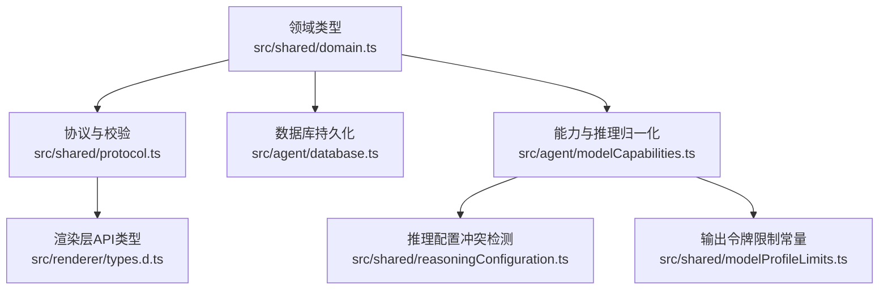
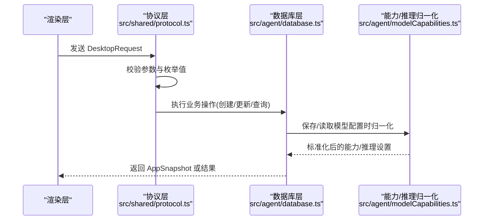
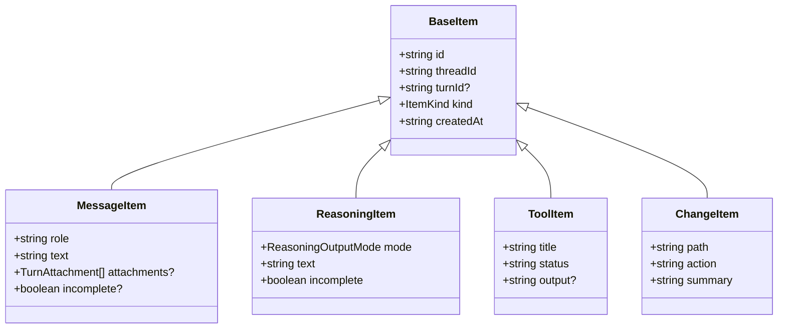
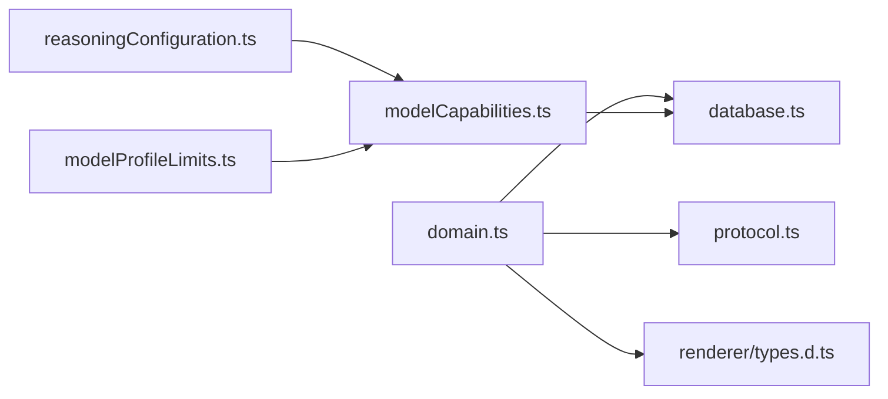
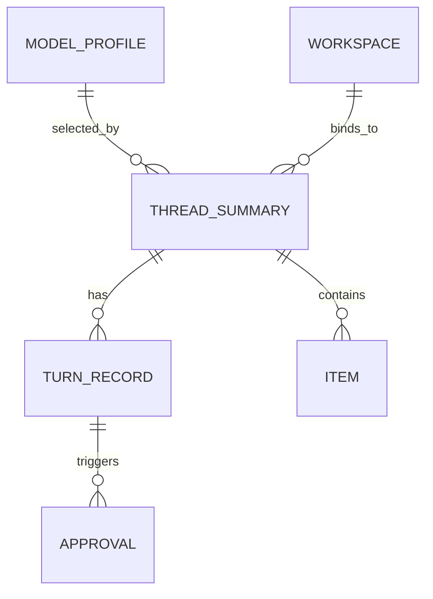

# 数据模型定义

<cite>
**本文引用的文件**
- [src/shared/domain.ts](file://src/shared/domain.ts)
- [src/shared/protocol.ts](file://src/shared/protocol.ts)
- [src/agent/database.ts](file://src/agent/database.ts)
- [src/agent/modelCapabilities.ts](file://src/agent/modelCapabilities.ts)
- [src/shared/reasoningConfiguration.ts](file://src/shared/reasoningConfiguration.ts)
- [src/shared/modelProfileLimits.ts](file://src/shared/modelProfileLimits.ts)
- [src/renderer/types.d.ts](file://src/renderer/types.d.ts)
</cite>

## 更新摘要
**所做更改**
- 移除了 ChatGroup 接口的文档说明
- 更新了 ThreadSummary 类型的字段定义，包含 workspaceId 和 pinned 字段
- 新增了线程置顶功能和工作区绑定功能的说明
- 更新了数据库架构相关的文档内容
- 修正了实体关系图以反映新的数据结构

## 目录
1. [简介](#简介)
2. [项目结构](#项目结构)
3. [核心组件](#核心组件)
4. [架构总览](#架构总览)
5. [详细组件分析](#详细组件分析)
6. [依赖关系分析](#依赖关系分析)
7. [性能考虑](#性能考虑)
8. [故障排查指南](#故障排查指南)
9. [结论](#结论)
10. [附录](#附录)

## 简介
本文件为应用的数据模型提供全面的类型定义说明，覆盖 Thread（线程摘要）、MessageItem、TurnRecord、Approval、ModelProfile、AppSettings 等核心实体。文档详细说明各实体的字段定义、数据类型与业务含义，解释实体间关系映射与数据转换逻辑，记录数据验证规则、默认值处理与必填字段约束，并提供 TypeScript 接口使用示例、序列化/反序列化策略以及版本兼容性与向后兼容性策略。

**更新** 移除了对已删除的 ChatGroup 接口的引用，重点突出 ThreadSummary 的新增功能特性。

## 项目结构
数据模型主要分布在以下位置：
- 领域类型与快照：src/shared/domain.ts
- 协议与运行时输入校验：src/shared/protocol.ts
- 数据库持久化与迁移：src/agent/database.ts
- 能力与推理配置归一化：src/agent/modelCapabilities.ts
- 推理配置冲突检测：src/shared/reasoningConfiguration.ts
- 模型输出令牌限制常量：src/shared/modelProfileLimits.ts
- 渲染层对外 API 类型声明：src/renderer/types.d.ts

**图表来源**
- [src/shared/domain.ts:1-343](file://src/shared/domain.ts#L1-L343)
- [src/shared/protocol.ts:1-371](file://src/shared/protocol.ts#L1-L371)
- [src/agent/database.ts:1-1532](file://src/agent/database.ts#L1-L1532)
- [src/agent/modelCapabilities.ts:1-207](file://src/agent/modelCapabilities.ts#L1-L207)
- [src/shared/reasoningConfiguration.ts:1-19](file://src/shared/reasoningConfiguration.ts#L1-L19)
- [src/shared/modelProfileLimits.ts:1-3](file://src/shared/modelProfileLimits.ts#L1-L3)
- [src/renderer/types.d.ts:1-40](file://src/renderer/types.d.ts#L1-L40)

**章节来源**
- [src/shared/domain.ts:1-343](file://src/shared/domain.ts#L1-L343)
- [src/shared/protocol.ts:1-371](file://src/shared/protocol.ts#L1-L371)
- [src/agent/database.ts:1-1532](file://src/agent/database.ts#L1-L1532)

## 核心组件
本节概述核心实体及其职责：
- ThreadSummary：线程摘要，包含标题、状态、关联的模型配置、工作区绑定和置顶状态等。
- Item：消息项联合类型，包括 MessageItem、ReasoningItem、ToolItem、ChangeItem。
- TurnRecord：一轮对话（turn）的生命周期记录，含状态、时间戳、错误与指标。
- Approval：审批项，用于需要用户确认的操作。
- ModelProfile：模型配置文件，描述提供商、基础 URL、模型名、能力、推理设置、并发与输出限制等。
- AppSettings：应用设置，主题、语言、活跃模型、指标显示、上下文消息上限、推理展示模式等。
- AppSnapshot：应用快照，聚合上述所有数据，作为跨进程/模块共享的状态视图。

**更新** 移除了 ChatGroup 相关描述，增强了 ThreadSummary 的功能说明。

**章节来源**
- [src/shared/domain.ts:7-343](file://src/shared/domain.ts#L7-L343)

## 架构总览
数据流从渲染层通过 IPC 调用主进程/工作进程，进入协议层进行请求校验，随后由数据库层执行持久化并返回快照。领域类型在多处被复用，确保类型一致性；能力与推理配置在保存或读取时进行归一化与校验；迁移脚本保证历史数据的兼容。

**图表来源**
- [src/shared/protocol.ts:22-39](file://src/shared/protocol.ts#L22-L39)
- [src/agent/database.ts:541-621](file://src/agent/database.ts#L541-L621)
- [src/agent/modelCapabilities.ts:45-104](file://src/agent/modelCapabilities.ts#L45-L104)

## 详细组件分析

### ThreadSummary（线程摘要）
- 字段
  - id: string，唯一标识符
  - workspaceId?: string，可选的工作区ID，表示线程所属的工作区；首次绑定时才存在
  - pinned: boolean，线程置顶状态，true 表示置顶显示
  - title: string，线程标题
  - status: 'ready' | 'running' | 'failed'，线程状态
  - modelProfileId?: string，可选的模型配置引用
  - createdAt: string，创建时间
  - updatedAt: string，更新时间
- 业务含义：线程是会话的基本单元，承载 Turn 与 Items，支持工作区绑定和置顶功能。
- 默认值/必填：title 必填；status 初始为 ready；pinned 默认为 false；workspaceId 可为空。
- 关系：包含多条 TurnRecord 与 Item，可选择性绑定到 Workspace。

**更新** 新增了 workspaceId 和 pinned 字段的详细说明，反映了最新的线程管理功能。

**章节来源**
- [src/shared/domain.ts:7-17](file://src/shared/domain.ts#L7-L17)
- [src/agent/database.ts:255-291](file://src/agent/database.ts#L255-L291)

### Item 体系
- BaseItem：公共字段 id、threadId、turnId?、kind、createdAt。
- MessageItem：kind='message'，role 为用户/助手/系统，text 内容，attachments? 附件，incomplete? 是否未完成。
- ReasoningItem：kind='reasoning'，mode 输出模式 raw/summary，text，incomplete。
- ToolItem：kind='tool'，title、status、output?。
- ChangeItem：kind='change'，path、action、summary。
- Item 联合类型：MessageItem | ReasoningItem | ToolItem | ChangeItem。
- 业务含义：Item 表示线程内的具体事件或片段，支持流式合并与完成标记。
- 默认值/必填：id、threadId、kind、createdAt 必填；文本类 item 的 text 必填；incomplete 用于指示流式未完成。
- 关系：每个 Item 属于特定 thread，可能属于某个 turn。

**图表来源**
- [src/shared/domain.ts:21-69](file://src/shared/domain.ts#L21-L69)

**章节来源**
- [src/shared/domain.ts:21-69](file://src/shared/domain.ts#L21-L69)
- [src/agent/database.ts:490-514](file://src/agent/database.ts#L490-L514)

### TurnRecord
- 字段
  - id: string
  - threadId: string
  - modelProfileId?: string
  - status: 排除 idle 的 TurnStatus（queued/running/cancelling/completed/failed/cancelled/interrupted）
  - createdAt: string
  - startedAt?: string
  - completedAt?: string
  - error?: string
  - incomplete: boolean
  - metrics?: ModelRunMetrics
- 业务含义：一轮对话的生命周期，包含开始、完成、失败、取消等状态及指标。
- 默认值/必填：status 必填且非 idle；incomplete 默认为 true（新建时），完成后置 false。
- 关系：属于 Thread；可与 Approval 关联。

**章节来源**
- [src/shared/domain.ts:318-329](file://src/shared/domain.ts#L318-L329)
- [src/agent/database.ts:360-464](file://src/agent/database.ts#L360-L464)

### Approval
- 字段
  - id: string
  - threadId: string
  - turnId: string
  - title: string
  - description: string
  - fileChange?: FileChangePreview，可选的文件变更预览
  - status: 'pending' | 'approved' | 'rejected'
  - createdAt: string
  - respondedAt?: string
- 业务含义：需要用户批准的操作，如危险变更或外部资源访问。
- 默认值/必填：title/description/status 必填；respondedAt 响应后填充。
- 关系：与 Turn 强关联，随 Turn 生命周期推进而更新。

**更新** 新增了 fileChange 字段的说明，支持文件变更预览功能。

**章节来源**
- [src/shared/domain.ts:87-98](file://src/shared/domain.ts#L87-L98)
- [src/agent/database.ts:516-539](file://src/agent/database.ts#L516-L539)

### ModelProfile 与 ModelProfileInput
- ModelProfile
  - id/name/provider/baseUrl/model/apiKeyConfigured/capabilities/reasoning/maxConcurrency/maxOutputTokens/responseSpeed(isDeprecated)/isDefault/createdAt/updatedAt
  - 业务含义：模型连接与运行能力的配置集合，包含推理协议、能力、并发与输出限制等。
- ModelProfileInput
  - 允许部分字段缺失，用于创建或更新配置；包含 capabilities/reasoning 的部分覆盖语义。
- 默认值/必填：name/model/baseUrl/provider 必填；maxConcurrency 与 maxOutputTokens 经归一化；responseSpeed 保留以兼容旧数据。
- 关系：被 Thread 选择使用；影响 Turn 的运行行为。

**章节来源**
- [src/shared/domain.ts:173-205](file://src/shared/domain.ts#L173-L205)
- [src/agent/database.ts:541-621](file://src/agent/database.ts#L541-L621)
- [src/agent/modelCapabilities.ts:45-104](file://src/agent/modelCapabilities.ts#L45-L104)

### AppSettings
- 字段
  - theme: 'system' | 'light' | 'dark'
  - language: 'zh-CN' | 'en-US'
  - activeModelProfileId?: string
  - showModelMetrics: boolean
  - contextMessageLimit: number（范围 1..200）
  - reasoningDisplayMode: 'auto' | 'raw' | 'summary'
- 业务含义：应用级偏好与运行时设置。
- 默认值/必填：theme/language 有默认；contextMessageLimit 默认 20；showModelMetrics 默认 true。
- 关系：影响 UI 与运行时行为；activeModelProfileId 决定默认模型。

**章节来源**
- [src/shared/domain.ts:100-107](file://src/shared/domain.ts#L100-L107)
- [src/agent/database.ts:882-900](file://src/agent/database.ts#L882-L900)

### AppSnapshot
- 字段
  - threads: ThreadSummary[]
  - turns: TurnRecord[]
  - items: Record<string, Item[]>（按 threadId 索引）
  - approvals: Approval[]
  - modelProfiles: ModelProfile[]
  - settings: AppSettings
  - workspaces: WorkspaceRecord[]
  - undoableTurns: UndoableTurnSummary[]
- 业务含义：应用的全量状态快照，供渲染层消费。
- 关系：聚合所有核心实体。

**更新** 移除了 groups 字段，threads 现在直接包含 ThreadSummary 数组。

**章节来源**
- [src/shared/domain.ts:307-316](file://src/shared/domain.ts#L307-L316)

### 附加类型与枚举
- ThemePreference/LanguagePreference/ThreadStatus/TurnStatus/ReasoningMode/ReasoningProtocol/ReasoningInputMode/ReasoningOutputMode/ReasoningDisplayMode/MetricSource/ModelResponseSpeed/ModelRunPhase/WorkspaceTrustLevel/WorkspaceNetworkPolicy
- 用途：统一枚举约束，避免非法值传播到下游。

**章节来源**
- [src/shared/domain.ts:1-119](file://src/shared/domain.ts#L1-L119)

## 依赖关系分析
- 领域类型 domain.ts 是所有模块的类型基础。
- protocol.ts 负责 IPC 请求/事件的类型与校验，确保传入参数合法。
- database.ts 实现持久化、迁移、归一化与映射，将领域对象与 SQLite 行相互转换。
- modelCapabilities.ts 对能力与推理配置进行归一化与校验，结合 reasoningConfiguration.ts 检查冲突。
- renderer/types.d.ts 暴露给渲染层的 IPC 方法签名，基于领域类型。

**图表来源**
- [src/shared/domain.ts:1-343](file://src/shared/domain.ts#L1-L343)
- [src/shared/protocol.ts:1-371](file://src/shared/protocol.ts#L1-L371)
- [src/agent/database.ts:1-1532](file://src/agent/database.ts#L1-L1532)
- [src/agent/modelCapabilities.ts:1-207](file://src/agent/modelCapabilities.ts#L1-L207)
- [src/shared/reasoningConfiguration.ts:1-19](file://src/shared/reasoningConfiguration.ts#L1-L19)
- [src/shared/modelProfileLimits.ts:1-3](file://src/shared/modelProfileLimits.ts#L1-L3)
- [src/renderer/types.d.ts:1-40](file://src/renderer/types.d.ts#L1-L40)

**章节来源**
- [src/shared/domain.ts:1-343](file://src/shared/domain.ts#L1-L343)
- [src/shared/protocol.ts:1-371](file://src/shared/protocol.ts#L1-L371)
- [src/agent/database.ts:1-1532](file://src/agent/database.ts#L1-L1532)
- [src/agent/modelCapabilities.ts:1-207](file://src/agent/modelCapabilities.ts#L1-L207)
- [src/shared/reasoningConfiguration.ts:1-19](file://src/shared/reasoningConfiguration.ts#L1-L19)
- [src/shared/modelProfileLimits.ts:1-3](file://src/shared/modelProfileLimits.ts#L1-L3)
- [src/renderer/types.d.ts:1-40](file://src/renderer/types.d.ts#L1-L40)

## 性能考虑
- 流式消息合并：数据库层对 assistant 消息与 reasoning 文本进行逻辑流键合并，减少碎片条目数量，提升读取性能。
- 批量更新：完成 turn 时批量更新相关 item 的 incomplete 标志，降低多次 I/O。
- 上下文消息限制：contextMessageLimit 限制读取条数，控制渲染负载。
- 并发与输出限制：maxConcurrency 与 maxOutputTokens 受能力与限制常量约束，防止过载。
- 置顶优化：pinned 字段支持快速排序置顶线程，提升用户体验。

**更新** 新增了置顶优化的性能考虑。

## 故障排查指南
- 必填字段校验：名称、URL、模型名等必填字段为空时会抛出错误；可通过协议层 isDesktopRequest 与数据库 requireTrimmed 定位问题。
- 枚举值校验：协议层对 ReasoningMode/Protocol/InputMode/OutputMode/DisplayMode 等进行严格校验，非法值将被拒绝。
- 推理配置冲突：当 inputMode 不支持但启用了推理模式时，会返回配置冲突提示；保存前需修正。
- 历史数据修复：迁移脚本会修复不完整的 turn 状态、合并历史消息片段、修复误标完成状态等。
- 模型配置归一化：capabilities/reasoning 在保存/读取时进行归一化，确保默认值与边界值正确。
- 工作区绑定验证：bindThreadWorkspace 会验证工作区是否存在，避免无效引用。

**更新** 新增了工作区绑定验证的故障排查指导。

**章节来源**
- [src/shared/protocol.ts:114-272](file://src/shared/protocol.ts#L114-L272)
- [src/agent/database.ts:838-873](file://src/agent/database.ts#L838-L873)
- [src/agent/modelCapabilities.ts:120-148](file://src/agent/modelCapabilities.ts#L120-L148)
- [src/shared/reasoningConfiguration.ts:9-18](file://src/shared/reasoningConfiguration.ts#L9-L18)

## 结论
本数据模型以领域类型为基石，通过协议层进行严格的输入校验，数据库层负责持久化、迁移与归一化，能力与推理配置模块保障模型行为的正确性与一致性。整体设计兼顾了可扩展性、健壮性与向后兼容性，适合复杂 AI 应用的会话管理与模型运行需求。

**更新** 强调了移除 ChatGroup 后的简化架构和新功能特性。

## 附录

### 实体关系图

**更新** 移除了 ChatGroup 关系，新增了 Workspace 与 ThreadSummary 的绑定关系。

**图表来源**
- [src/shared/domain.ts:7-343](file://src/shared/domain.ts#L7-L343)

### 数据验证规则与默认值
- 必填字段：ThreadSummary.title、MessageItem.text、TurnRecord.status、Approval.title/description/status、ModelProfile.name/model/baseUrl/provider。
- 默认值：AppSettings.theme=system、language=en-US、showModelMetrics=true、contextMessageLimit=20、reasoningDisplayMode=auto；TurnRecord.incomplete 初始为 true；ModelProfile.maxConcurrency/maxOutputTokens 经归一化；ThreadSummary.pinned 默认为 false。
- 范围限制：contextMessageLimit 1..200；maxOutputTokens 不超过 MAX_OUTPUT_TOKENS；并发限制受 capabilities.concurrency.maxLimit 约束。

**更新** 移除了 ChatGroup 相关验证规则，新增了 ThreadSummary.pinned 的默认值说明。

**章节来源**
- [src/shared/domain.ts:100-107](file://src/shared/domain.ts#L100-L107)
- [src/agent/database.ts:882-900](file://src/agent/database.ts#L882-L900)
- [src/agent/modelCapabilities.ts:106-118](file://src/agent/modelCapabilities.ts#L106-L118)
- [src/shared/modelProfileLimits.ts:1-3](file://src/shared/modelProfileLimits.ts#L1-L3)

### 数据序列化与反序列化
- 序列化：Item 与 ModelProfile 的能力/推理配置在写入数据库前序列化为 JSON 字符串。
- 反序列化：读取时解析 JSON 并进行类型校验与归一化，非法或损坏数据回退到安全默认值。
- 流式合并：根据逻辑流键合并同一流的消息片段，避免重复存储。

**章节来源**
- [src/agent/database.ts:945-979](file://src/agent/database.ts#L945-L979)
- [src/agent/database.ts:1371-1388](file://src/agent/database.ts#L1371-L1388)

### 版本兼容性与向后兼容策略
- 迁移表 schema_migrations 记录已应用的迁移版本，启动时按需执行增量迁移。
- 历史数据修复：合并历史 assistant 消息片段、修复误标完成状态、补齐缺失字段（如 metrics、reasoning、max_output_tokens）。
- 本地 Qwen 预设：自动修复或注入本地 Qwen 模型配置，确保默认可用。
- 弃用字段兼容：responseSpeed 标记为弃用但仍可读，用于旧数据迁移。
- 新字段迁移：workspace_id 和 pinned 字段通过迁移脚本添加到现有 threads 表中，确保向后兼容。

**更新** 新增了 workspace_id 和 pinned 字段的迁移策略说明。

**章节来源**
- [src/agent/database.ts:838-873](file://src/agent/database.ts#L838-L873)
- [src/agent/database.ts:995-1135](file://src/agent/database.ts#L995-L1135)
- [src/shared/domain.ts:173-205](file://src/shared/domain.ts#L173-L205)

### TypeScript 接口使用示例
- 创建线程：createThread(title, workspaceId?)，返回 ThreadSummary，支持可选的工作区绑定。
- 置顶线程：setThreadPinned(threadId, pinned)，切换线程置顶状态。
- 绑定工作区：bindThreadWorkspace(threadId, workspaceId)，将未绑定的线程与工作区关联。
- 开始对话：startTurn(threadId, text, modelProfileId?, attachments?)，返回 { turnId }。
- 更新设置：updateSettings({ showModelMetrics?, contextMessageLimit?, reasoningDisplayMode? })，返回 AppSettings。
- 保存模型配置：saveModelProfile(ModelProfileInput)，返回 ModelProfile。
- 订阅事件：subscribe(listener)，监听 AgentEvent 流。

**更新** 新增了线程置顶和工作区绑定的使用示例。

**章节来源**
- [src/renderer/types.d.ts:18-37](file://src/renderer/types.d.ts#L18-L37)
- [src/agent/database.ts:255-312](file://src/agent/database.ts#L255-L312)