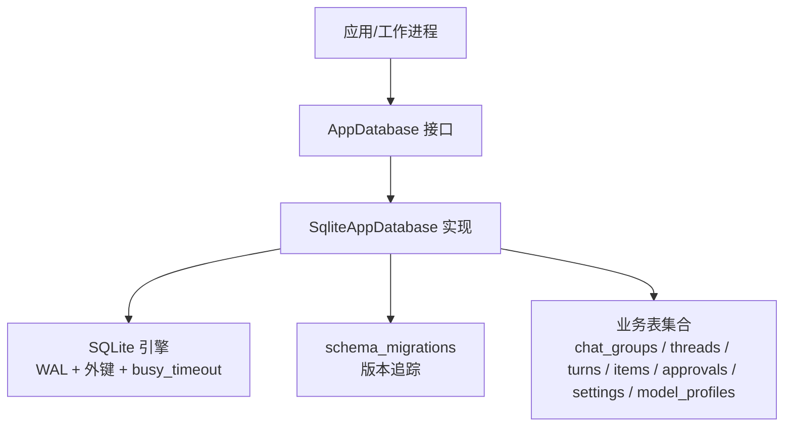
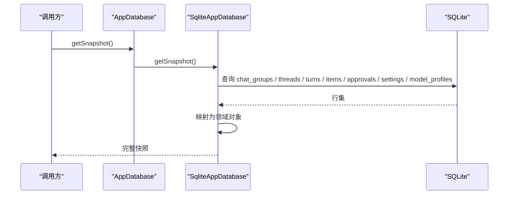
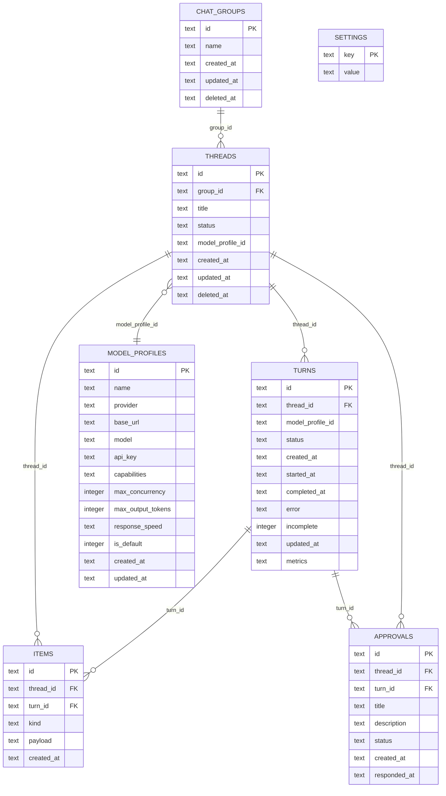
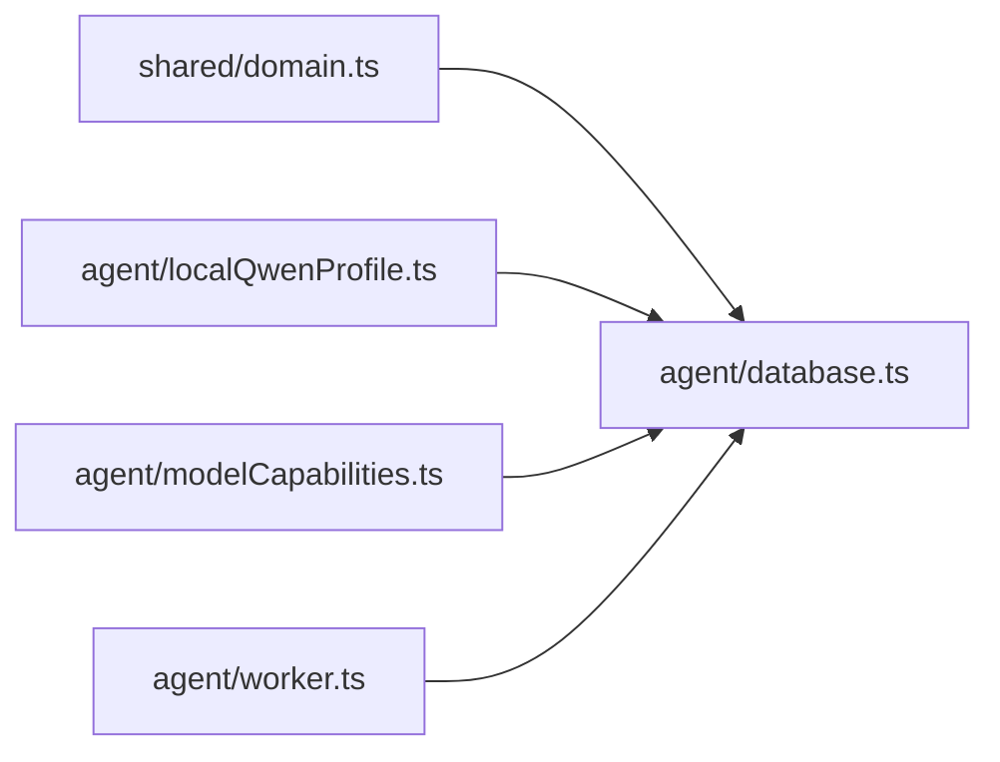
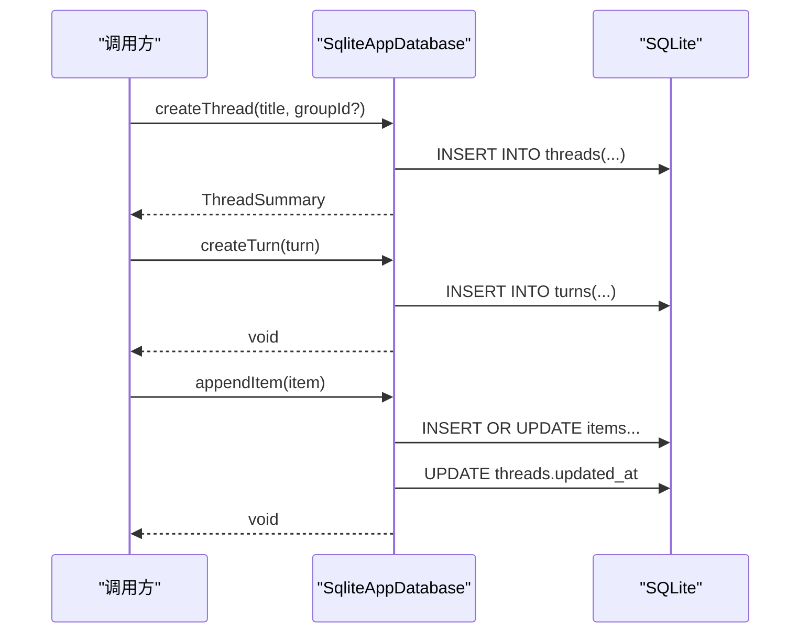

# 数据管理

<cite>
**本文引用的文件**
- [src/agent/database.ts](file://src/agent/database.ts)
- [src/shared/domain.ts](file://src/shared/domain.ts)
- [tests/database.test.ts](file://tests/database.test.ts)
</cite>

## 目录
1. [简介](#简介)
2. [项目结构](#项目结构)
3. [核心组件](#核心组件)
4. [架构总览](#架构总览)
5. [详细组件分析](#详细组件分析)
6. [依赖关系分析](#依赖关系分析)
7. [性能考虑](#性能考虑)
8. [故障排查指南](#故障排查指南)
9. [结论](#结论)
10. [附录](#附录)

## 简介
本文件为数据管理系统的数据模型文档，聚焦 SQLite 表结构设计、实体关系、字段定义与数据类型；记录主键/外键、索引与约束；说明数据验证规则与业务规则；提供数据库 Schema 图与示例数据；描述数据访问模式、缓存策略与性能考量；规定数据生命周期、保留策略与归档规则；给出数据迁移路径与版本管理；并覆盖数据安全、隐私要求与访问控制。

## 项目结构
本项目将数据持久化逻辑集中在 Agent 层的数据库实现中，通过统一的接口对外暴露读写能力；领域类型在共享层集中定义；测试覆盖迁移、一致性、并发与边界场景。

图表来源
- [src/agent/database.ts:629-759](file://src/agent/database.ts#L629-L759)
- [src/agent/database.ts:1094-1096](file://src/agent/database.ts#L1094-L1096)

章节来源
- [src/agent/database.ts:1-120](file://src/agent/database.ts#L1-L120)
- [src/shared/domain.ts:1-319](file://src/shared/domain.ts#L1-L319)

## 核心组件
- AppDatabase 接口：定义快照读取、会话/分组/回合/消息/审批/模型配置/设置等统一操作。
- SqliteAppDatabase：基于 node:sqlite 的 DatabaseSync 实现，负责建库、迁移、事务、查询映射与数据归一化。
- 领域类型 domain：集中定义会话、消息、回合、模型配置、设置、工作区等数据结构。

章节来源
- [src/agent/database.ts:36-64](file://src/agent/database.ts#L36-L64)
- [src/agent/database.ts:136-140](file://src/agent/database.ts#L136-L140)
- [src/shared/domain.ts:7-319](file://src/shared/domain.ts#L7-L319)

## 架构总览
系统采用“接口 + 实现”的分层设计：上层通过 AppDatabase 抽象进行数据访问，底层由 SqliteAppDatabase 封装 SQLite 细节（WAL、外键、迁移、事务）。所有写操作均包裹在事务中，保证原子性；读操作支持快照一次性拉取多表关联数据，便于 UI 渲染。

图表来源
- [src/agent/database.ts:142-201](file://src/agent/database.ts#L142-L201)

章节来源
- [src/agent/database.ts:142-201](file://src/agent/database.ts#L142-L201)

## 详细组件分析

### 数据模型与实体关系
- 软删除：threads 与 chat_groups 使用 deleted_at 标记删除，查询时过滤已删除记录。
- 会话与分组：threads.group_id 引用 chat_groups.id。
- 回合与会话：turns.thread_id 引用 threads.id，支持级联删除。
- 消息与回合：items.turn_id 引用 turns.id，允许为空（无回合的消息）。
- 审批与会话/回合：approvals.thread_id 引用 threads.id，approvals.turn_id 引用 turns.id。
- 模型配置：model_profiles 独立存储，threads.model_profile_id 可选引用。
- 设置：settings 以 key-value 形式保存应用配置。

图表来源
- [src/agent/database.ts:639-759](file://src/agent/database.ts#L639-L759)

章节来源
- [src/agent/database.ts:639-759](file://src/agent/database.ts#L639-L759)
- [src/shared/domain.ts:7-319](file://src/shared/domain.ts#L7-L319)

### 表结构与字段定义
- schema_migrations：version INTEGER PRIMARY KEY, applied_at TEXT NOT NULL。用于记录已应用的迁移版本。
- threads：id(主键), group_id(外键), title, status, model_profile_id(外键), created_at, updated_at, deleted_at(软删)。
- chat_groups：id(主键), name, created_at, updated_at, deleted_at(软删)。
- turns：id(主键), thread_id(外键), model_profile_id(外键), status, created_at, started_at, completed_at, error, incomplete(默认1), updated_at, metrics(JSON)。
- items：id(主键), thread_id(外键), turn_id(外键), kind, payload(JSON), created_at。
- approvals：id(主键), thread_id(外键), turn_id(外键), title, description, status, created_at, responded_at。
- settings：key(主键), value。
- model_profiles：id(主键), name, provider, base_url, model, api_key, capabilities(JSON), max_concurrency, max_output_tokens, response_speed, is_default, created_at, updated_at。

章节来源
- [src/agent/database.ts:639-759](file://src/agent/database.ts#L639-L759)

### 主键/外键、索引与约束
- 主键：所有表均以 id 或 key 作为主键。
- 外键：
  - threads.group_id -> chat_groups.id
  - turns.thread_id -> threads.id (ON DELETE CASCADE)
  - items.thread_id -> threads.id (ON DELETE CASCADE)
  - items.turn_id -> turns.id (ON DELETE SET NULL)
  - approvals.thread_id -> threads.id (ON DELETE CASCADE)
  - approvals.turn_id -> turns.id (ON DELETE CASCADE)
  - threads.model_profile_id -> model_profiles.id
- 约束：
  - 外键开启 PRAGMA foreign_keys = ON。
  - 非空约束：如 title, status, created_at, updated_at 等关键字段。
  - 默认值：incomplete 默认 1；max_concurrency 默认 1；max_output_tokens 默认 2048；is_default 默认 0。
- 索引：当前未显式创建额外索引，依赖主键与外键；可通过查询热点添加复合索引优化。

章节来源
- [src/agent/database.ts:629-759](file://src/agent/database.ts#L629-L759)

### 数据验证规则与业务规则
- 必填校验：名称、模型名、Base URL 等关键输入需非空且去空白。
- 范围限制：contextMessageLimit 被钳制到 [1, 200]。
- 枚举/状态机：
  - ThreadStatus: ready | running | failed
  - TurnStatus: idle | queued | running | cancelling | completed | failed | cancelled | interrupted
  - Approval.status: pending | approved | rejected
  - ModelResponseSpeed: standard | fast | quality
  - ReasoningDisplayMode: auto | raw | summary
- 流式合并：同一 turn 的 assistant 消息与 reasoning 片段按逻辑键合并为单条记录，避免重复。
- 默认组与默认模型：首次启动自动创建默认分组与本地 Qwen 预设，并在无默认时设置 activeModelProfileId。
- 安全脱敏：快照返回的模型配置不包含 apiKey，仅保留是否配置的标志。

章节来源
- [src/agent/database.ts:526-606](file://src/agent/database.ts#L526-L606)
- [src/agent/database.ts:761-779](file://src/agent/database.ts#L761-L779)
- [src/agent/database.ts:824-858](file://src/agent/database.ts#L824-L858)
- [src/agent/database.ts:1232-1235](file://src/agent/database.ts#L1232-L1235)
- [src/shared/domain.ts:1-319](file://src/shared/domain.ts#L1-L319)

### 数据访问模式
- 快照读取：getSnapshot 一次性聚合 groups、threads、turns、items、approvals、modelProfiles、settings，适合界面初始化。
- 增量读取：getThreadMessages 按线程拉取消息并按角色合并助手回复片段，支持 limit 裁剪。
- 写入模式：所有写操作通过 transaction 包装，确保原子性与回滚。
- 流式追加：appendItem 对同 turn 的文本流进行合并，减少冗余行。
- 生命周期更新：updateTurn/failTurn/completeTurn 精确更新状态与时间戳，completeTurn 同时修正 items.incomplete。

章节来源
- [src/agent/database.ts:142-201](file://src/agent/database.ts#L142-L201)
- [src/agent/database.ts:320-343](file://src/agent/database.ts#L320-L343)
- [src/agent/database.ts:345-449](file://src/agent/database.ts#L345-L449)
- [src/agent/database.ts:475-499](file://src/agent/database.ts#L475-L499)

### 缓存策略
- 内存快照：getSnapshot 构建内存中的完整视图，供 UI 渲染；不引入外部缓存。
- 流式合并：在写入阶段合并同类项，降低读取时的合并成本。
- 建议：若后续有高频只读场景，可在应用层增加轻量缓存（如最近会话列表），但需注意失效策略与一致性。

章节来源
- [src/agent/database.ts:142-201](file://src/agent/database.ts#L142-L201)
- [src/agent/database.ts:824-858](file://src/agent/database.ts#L824-L858)

### 性能考虑
- WAL 模式：PRAGMA journal_mode = WAL，提升并发读性能与崩溃恢复能力。
- 外键检查：PRAGMA foreign_keys = ON，保证引用完整性。
- 忙等待超时：busy_timeout = 5000ms，缓解锁竞争导致的失败。
- 事务粒度：写操作尽量小粒度事务，减少锁持有时间。
- 查询优化：可针对常用查询添加索引（例如 items.thread_id + created_at、turns.thread_id + status）。

章节来源
- [src/agent/database.ts:629-635](file://src/agent/database.ts#L629-L635)

### 数据生命周期、保留策略与归档
- 软删除：threads/chat_groups 使用 deleted_at 标记删除，查询时排除；物理删除尚未实现。
- 未完成回合：重启后中断 queued/running/cancelling 状态的回合，并拒绝其待处理审批。
- 历史压缩：迁移过程中会合并历史 assistant 消息片段，减少冗余。
- 指标保留：turns.metrics 持久化运行指标，可用于性能分析。
- 归档建议：可按时间窗口导出已删除会话的历史数据至冷存储，当前代码未内置归档逻辑。

章节来源
- [src/agent/database.ts:229-241](file://src/agent/database.ts#L229-L241)
- [src/agent/database.ts:451-473](file://src/agent/database.ts#L451-L473)
- [src/agent/database.ts:874-909](file://src/agent/database.ts#L874-L909)
- [src/agent/database.ts:1016-1073](file://src/agent/database.ts#L1016-L1073)

### 数据迁移路径与版本管理
- 迁移表：schema_migrations(version, applied_at) 记录已执行迁移。
- 初始建表：包含全部核心表及默认设置。
- 向后兼容：通过 ensureColumn 动态添加缺失列，避免破坏旧库。
- 迁移脚本：
  - v2：压缩历史 assistant 消息片段。
  - v3：修复遗留回合完成状态。
  - v4：为 turns 添加 metrics 字段。
  - v5：修复误标完成状态。
  - v6：为 model_profiles 添加 max_output_tokens。
  - v7：修复或注入本地 Qwen 预设。
- 幂等性：迁移函数具备幂等特性，重复执行不会破坏数据。

章节来源
- [src/agent/database.ts:637-759](file://src/agent/database.ts#L637-L759)
- [src/agent/database.ts:860-872](file://src/agent/database.ts#L860-L872)
- [tests/database.test.ts:108-116](file://tests/database.test.ts#L108-L116)

### 数据安全、隐私与访问控制
- 密钥脱敏：快照返回的模型配置不包含 apiKey，仅保留是否配置标志；运行时读取才携带密钥。
- 最小权限：数据库连接仅在需要时打开，并提供 close 方法释放资源。
- 输入清洗：URL、名称等字段进行规范化与去空白，防止注入与脏数据。
- 访问控制：当前为本地 SQLite，无用户级访问控制；如需多租户隔离，建议在应用层增加工作区/用户上下文与数据隔离策略。

章节来源
- [src/agent/database.ts:526-606](file://src/agent/database.ts#L526-L606)
- [src/agent/database.ts:1232-1235](file://src/agent/database.ts#L1232-L1235)
- [src/agent/database.ts:1267-1278](file://src/agent/database.ts#L1267-L1278)

## 依赖关系分析
- 模块耦合：database.ts 依赖 shared/domain.ts 的类型定义；worker.ts 通过 openDatabase 获取实例。
- 外部依赖：node:sqlite 提供 DatabaseSync；crypto 生成 UUID。
- 迁移与默认数据：localQwenProfile 提供本地模型预设；modelCapabilities 提供能力与推理设置的归一化。

图表来源
- [src/agent/database.ts:1-35](file://src/agent/database.ts#L1-L35)
- [src/agent/worker.ts:25-115](file://src/agent/worker.ts#L25-L115)

章节来源
- [src/agent/database.ts:1-35](file://src/agent/database.ts#L1-L35)
- [src/agent/worker.ts:25-115](file://src/agent/worker.ts#L25-L115)

## 性能考虑
- 使用 WAL 模式提高并发读性能与稳定性。
- 合理设置 busy_timeout 避免瞬时锁冲突。
- 对高频查询可考虑添加复合索引（如 items(thread_id, created_at)、turns(thread_id, status)）。
- 流式写入合并减少行数，降低 I/O 压力。
- 快照读取适合低频全量加载，高频场景建议分页或增量更新。

[本节为通用指导，无需特定文件来源]

## 故障排查指南
- 启动中断：检查 schema_migrations 是否完整，确认迁移是否成功执行。
- 状态不一致：查看 turns.status 与 items.incomplete 的一致性；completeTurn 会同步修正 items。
- 审批卡住：当回合进入终态（completed/failed/cancelled/interrupted）时，pending 审批会被拒绝。
- 锁冲突：增大 busy_timeout 或减少并发写；检查长事务。
- 数据损坏：WAL 模式有助于恢复；必要时从备份重建。

章节来源
- [src/agent/database.ts:451-473](file://src/agent/database.ts#L451-L473)
- [src/agent/database.ts:423-449](file://src/agent/database.ts#L423-L449)
- [tests/database.test.ts:395-458](file://tests/database.test.ts#L395-L458)

## 结论
该数据模型以 SQLite 为核心，采用清晰的表结构与严格的约束，结合迁移机制保障演进；通过事务与流式合并确保一致性与性能；通过脱敏与输入校验强化安全。未来可扩展索引、归档与多租户访问控制以满足更大规模需求。

[本节为总结，无需特定文件来源]

## 附录

### 示例数据（概念性）
- chat_groups: 一个名为“Workspace”的默认组。
- threads: 若干会话，包含标题、状态、所属分组与模型配置。
- turns: 每个会话的多次交互回合，含状态、时间与指标。
- items: 消息、推理过程、工具调用与变更事件，按会话与回合组织。
- approvals: 审批请求，关联会话与回合。
- settings: 主题、语言、模型配置开关等。
- model_profiles: 模型提供者、端点、能力与限制。

[本节为概念性示例，无需特定文件来源]

### 关键流程时序（创建会话与回合）

图表来源
- [src/agent/database.ts:243-275](file://src/agent/database.ts#L243-L275)
- [src/agent/database.ts:345-365](file://src/agent/database.ts#L345-L365)
- [src/agent/database.ts:475-499](file://src/agent/database.ts#L475-L499)

章节来源
- [src/agent/database.ts:243-499](file://src/agent/database.ts#L243-L499)