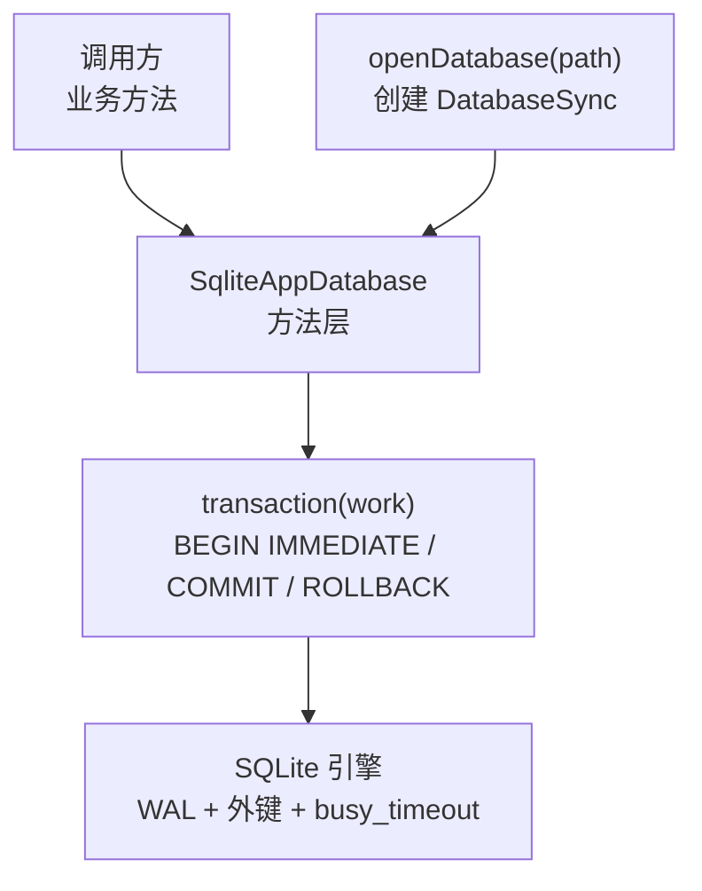
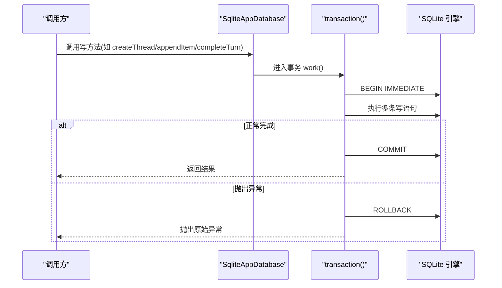
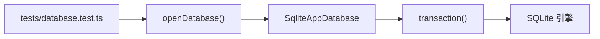
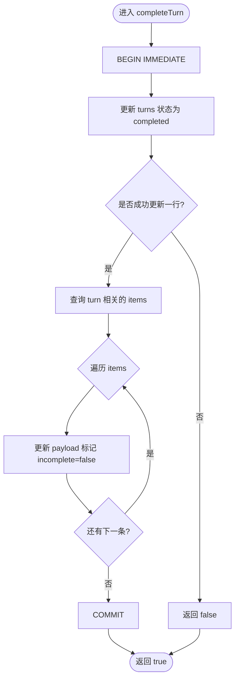

# 事务管理

<cite>
**本文引用的文件**
- [src/agent/database.ts](file://src/agent/database.ts)
- [tests/database.test.ts](file://tests/database.test.ts)
- [docs/superpowers/plans/2026-08-17-universal-ai-desktop-mvp.md](file://docs/superpowers/plans/2026-08-17-universal-ai-desktop-mvp.md)
</cite>

## 目录
1. [简介](#简介)
2. [项目结构](#项目结构)
3. [核心组件](#核心组件)
4. [架构总览](#架构总览)
5. [详细组件分析](#详细组件分析)
6. [依赖关系分析](#依赖关系分析)
7. [性能考量](#性能考量)
8. [故障排查指南](#故障排查指南)
9. [结论](#结论)
10. [附录](#附录)

## 简介
本技术文档聚焦于 SQLite 事务管理机制，围绕以下目标展开：
- 说明 transaction() 方法的工作原理与错误处理策略
- 记录批量操作的事务封装模式，展示如何在单个事务中执行多个相关数据库操作
- 解释自动回滚机制（异常捕获与状态恢复）
- 详细说明事务隔离级别的选择与配置，以及 WAL 模式的性能优势
- 提供事务嵌套、保存点使用与长事务处理的最佳实践
- 给出事务监控与性能分析方法

## 项目结构
本项目将 SQLite 访问封装在 agent 层的数据库模块中，所有写操作通过统一的 transaction() 包裹，确保原子性与一致性。WAL 模式、外键约束与忙超时在数据库初始化时统一配置。测试覆盖事务的原子性、失败回滚与重启修复等场景。

图表来源
- [src/agent/database.ts:1215-1217](file://src/agent/database.ts#L1215-L1217)
- [src/agent/database.ts:1203-1212](file://src/agent/database.ts#L1203-L1212)
- [src/agent/database.ts:731-737](file://src/agent/database.ts#L731-L737)

章节来源
- [src/agent/database.ts:731-737](file://src/agent/database.ts#L731-L737)
- [src/agent/database.ts:1203-1217](file://src/agent/database.ts#L1203-L1217)

## 核心组件
- SqliteAppDatabase：实现 AppDatabase 接口，封装所有读写逻辑，并通过私有 transaction() 统一事务边界。
- openDatabase：工厂函数，创建 DatabaseSync 实例并传入超时参数，随后由构造函数完成配置与迁移。
- 配置与迁移：在构造阶段启用 WAL 模式、开启外键约束、设置 busy_timeout；同时创建 schema_migrations 及业务表结构。

关键要点
- 所有写操作均通过 this.transaction(...) 包裹，保证多语句原子提交或失败回滚。
- 读操作直接查询，不包裹事务，避免不必要的锁竞争。
- 使用 BEGIN IMMEDIATE 获取写锁，减少并发写入时的冲突等待。

章节来源
- [src/agent/database.ts:150-154](file://src/agent/database.ts#L150-L154)
- [src/agent/database.ts:731-737](file://src/agent/database.ts#L731-L737)
- [src/agent/database.ts:1215-1217](file://src/agent/database.ts#L1215-L1217)

## 架构总览
下图展示了从业务方法到 SQLite 引擎的事务执行流程，包括异常路径的回滚行为。

图表来源
- [src/agent/database.ts:1203-1212](file://src/agent/database.ts#L1203-L1212)

章节来源
- [src/agent/database.ts:1203-1212](file://src/agent/database.ts#L1203-L1212)

## 详细组件分析

### 事务封装 transaction() 的工作原理
- 开始：执行 BEGIN IMMEDIATE，立即获取写锁，避免后续写语句因锁争用而阻塞。
- 执行：调用传入的 work() 回调，内部可包含任意数量的写操作。
- 提交：work() 成功完成后执行 COMMIT。
- 回滚：若 work() 抛出任何异常，立即执行 ROLLBACK，并将原始异常向上抛出，确保调用方能感知失败。

该模式保证了“要么全部成功，要么全部失败”的原子性，且不会泄漏未提交的事务。

章节来源
- [src/agent/database.ts:1203-1212](file://src/agent/database.ts#L1203-L1212)

### 批量操作的事务封装模式
项目中大量写方法以单条或多条语句组合的方式被包裹在 transaction() 中，典型模式如下：
- 单表写入：例如创建分组、线程、工作区等，仅涉及一条 INSERT/UPDATE，但依然走事务以确保一致性与可观测性。
- 多表联动：例如 failTurn 会更新 turns 与 approvals 两表；completeTurn 会更新 turns 并批量修正 items 中的不完整标记；saveModelProfile 可能更新 settings、model_profiles 并维护默认模型标识。

这些方法体现了“一个业务动作 = 一个事务”的原则，便于理解与维护。

章节来源
- [src/agent/database.ts:218-242](file://src/agent/database.ts#L218-L242)
- [src/agent/database.ts:244-256](file://src/agent/database.ts#L244-L256)
- [src/agent/database.ts:258-290](file://src/agent/database.ts#L258-L290)
- [src/agent/database.ts:419-436](file://src/agent/database.ts#L419-L436)
- [src/agent/database.ts:438-464](file://src/agent/database.ts#L438-L464)
- [src/agent/database.ts:541-621](file://src/agent/database.ts#L541-L621)

### 自动回滚机制与异常处理
- 异常捕获：transaction() 使用 try/catch 捕获 work() 抛出的任何异常。
- 状态恢复：一旦捕获异常，立即执行 ROLLBACK，撤销事务内所有变更。
- 异常透传：原始异常被重新抛出，调用方可据此进行上层处理（重试、降级、告警等）。

测试覆盖了触发回滚的场景，例如在审批表上注入触发器强制失败，验证 turn 与 approval 状态未被提交。

章节来源
- [src/agent/database.ts:1203-1212](file://src/agent/database.ts#L1203-L1212)
- [tests/database.test.ts:430-458](file://tests/database.test.ts#L430-L458)

### 事务隔离级别的选择与配置
- 当前实现使用 BEGIN IMMEDIATE，对应 SQLite 的写事务隔离语义，能立即获得写锁，降低并发写入冲突概率。
- 未显式设置 PRAGMA isolation_level，因此遵循 SQLite 默认隔离级别。对于大多数应用级 SQLite 场景，该隔离级别已足够。
- 如需更强的隔离语义（例如防止幻读），可在需要处改用 BEGIN DEFERRED 或 BEGIN EXCLUSIVE，并结合业务需求评估性能影响。

注意：修改隔离级别会影响并发性能与一致性权衡，建议在明确需求后谨慎调整。

章节来源
- [src/agent/database.ts:1203-1212](file://src/agent/database.ts#L1203-L1212)

### WAL 模式的性能优势
- 在数据库初始化时启用 journal_mode = WAL，提升并发读性能，减少写阻塞，支持更高效的备份与恢复。
- 配合 foreign_keys = ON 保证数据完整性。
- 通过 busy_timeout 设置等待锁的时间，缓解短暂冲突导致的失败。

这些设置在 openDatabase 创建的 DatabaseSync 基础上，于构造阶段统一生效。

章节来源
- [src/agent/database.ts:731-737](file://src/agent/database.ts#L731-L737)
- [docs/superpowers/plans/2026-08-17-universal-ai-desktop-mvp.md:254-264](file://docs/superpowers/plans/2026-08-17-universal-ai-desktop-mvp.md#L254-L264)

### 事务嵌套、保存点与长事务最佳实践
- 事务嵌套：当前实现不支持嵌套事务。若在事务中再次调用 transaction()，将导致重复 BEGIN 的错误。建议将多个相关操作合并为单一事务。
- 保存点：当前未使用 SAVEPOINT。若需细粒度回滚（部分成功、部分失败），可在同一事务中使用 SQLite 的 SAVEPOINT/RELEASE/ROLLBACK TO 语法，并在代码中显式管理保存点生命周期。
- 长事务：尽量避免长时间持有事务，以减少锁持有时间与 WAL 增长。可将大任务拆分为多个小事务，或在必要时使用批处理分批提交。

章节来源
- [src/agent/database.ts:1203-1212](file://src/agent/database.ts#L1203-L1212)

### 事务监控与性能分析
- 指标采集：可在 transaction() 的 work() 前后记录耗时、语句数量、受影响行数等指标，用于监控事务性能。
- 慢事务定位：结合日志与指标，识别耗时较长的 write 路径（如 completeTurn、saveModelProfile）。
- 并发观察：WAL 模式下关注 busy_timeout 触发的次数与频率，评估是否需要优化索引或拆分事务。
- 工具建议：可使用 SQLite 的 PRAGMA 查询与外部工具（如 sqlite3 命令行、浏览器/桌面端调试面板）观察 WAL 文件大小、页缓存命中率等。

[本节为通用指导，不直接分析具体文件]

## 依赖关系分析
- 调用方依赖 SqliteAppDatabase 的公开方法（createThread、appendItem、completeTurn 等）。
- SqliteAppDatabase 依赖 DatabaseSync 进行底层 SQL 执行。
- 配置依赖 PRAGMA 设置（WAL、外键、busy_timeout）。
- 测试依赖 openDatabase 创建临时数据库，验证事务原子性与回滚行为。

图表来源
- [tests/database.test.ts:1-15](file://tests/database.test.ts#L1-L15)
- [src/agent/database.ts:1215-1217](file://src/agent/database.ts#L1215-L1217)
- [src/agent/database.ts:1203-1212](file://src/agent/database.ts#L1203-L1212)

章节来源
- [tests/database.test.ts:1-15](file://tests/database.test.ts#L1-L15)
- [src/agent/database.ts:1203-1217](file://src/agent/database.ts#L1203-L1217)

## 性能考量
- 使用 BEGIN IMMEDIATE 可减少写锁争用，适合高并发写入场景。
- WAL 模式提升读性能与并发能力，适合频繁读取的应用。
- 合理拆分事务，避免长事务导致锁持有时间过长。
- 对热点表建立合适索引，减少 UPDATE/SELECT 的扫描成本。
- 监控 busy_timeout 触发情况，必要时调优或优化 SQL。

[本节为通用指导，不直接分析具体文件]

## 故障排查指南
- 现象：事务中途失败，数据未持久化
  - 原因：work() 抛出异常，transaction() 执行 ROLLBACK
  - 处理：检查异常堆栈，定位失败的 SQL 或业务校验
- 现象：并发写入冲突
  - 原因：锁争用或 busy_timeout 不足
  - 处理：增大 busy_timeout、优化 SQL、拆分事务或使用批处理
- 现象：WAL 文件过大
  - 原因：长事务或未定期 checkpoint
  - 处理：缩短事务、增加 checkpoint 策略、监控 WAL 大小

章节来源
- [src/agent/database.ts:1203-1212](file://src/agent/database.ts#L1203-L1212)
- [tests/database.test.ts:430-458](file://tests/database.test.ts#L430-L458)

## 结论
本项目通过统一的 transaction() 封装 SQLite 事务，结合 WAL 模式与合理的 PRAGMA 配置，实现了高效、可靠的数据持久化。所有写操作均以事务为单位，确保原子性与一致性；异常路径自动回滚，保障状态恢复。未来可根据业务需求引入保存点与更精细的隔离级别控制，并持续通过监控与指标优化事务性能。

[本节为总结，不直接分析具体文件]

## 附录

### 关键流程图：completeTurn 事务内的多步操作

图表来源
- [src/agent/database.ts:438-464](file://src/agent/database.ts#L438-L464)

章节来源
- [src/agent/database.ts:438-464](file://src/agent/database.ts#L438-L464)