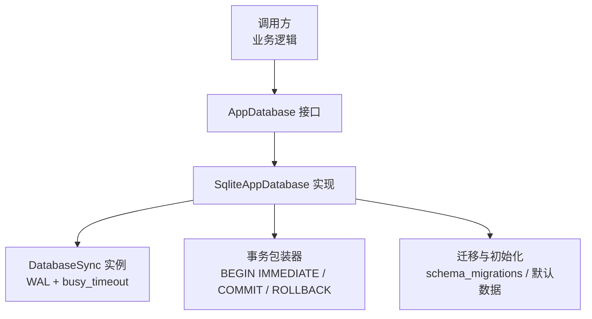
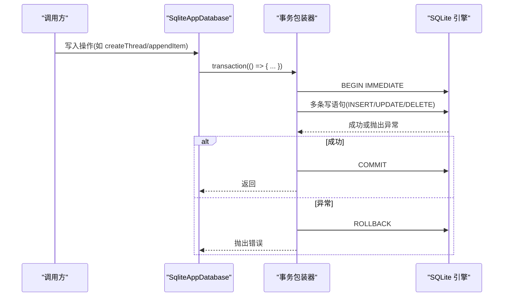
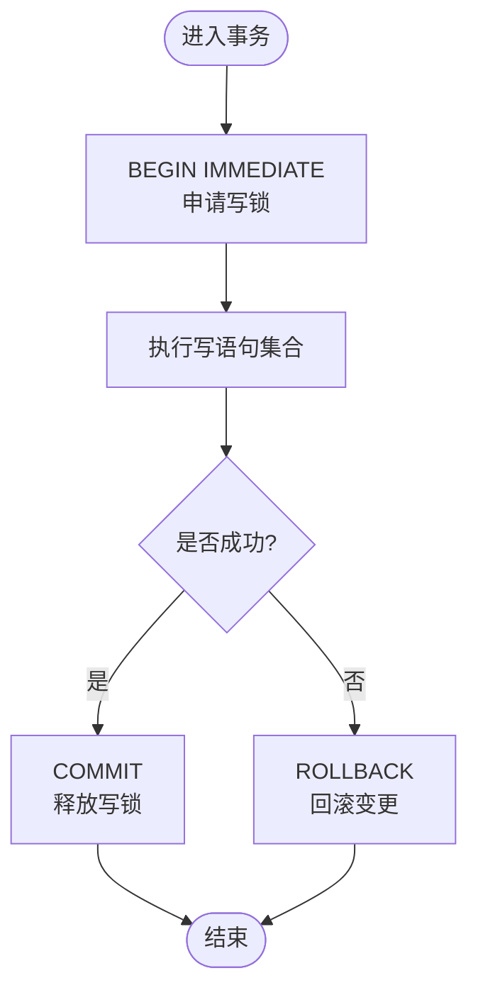
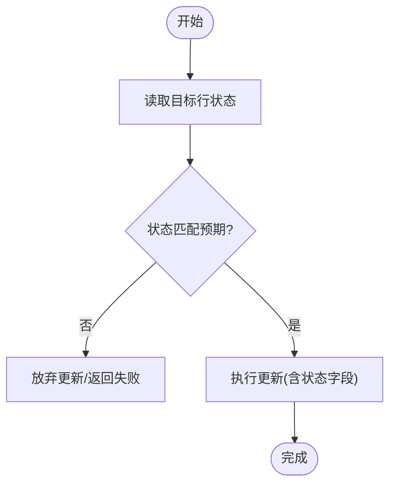
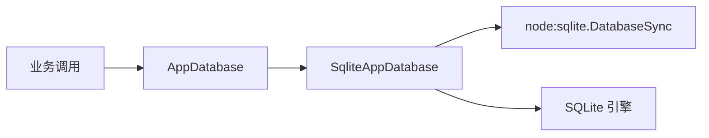

# 并发控制

<cite>
**本文引用的文件**
- [src/agent/database.ts](file://src/agent/database.ts)
- [tests/database.test.ts](file://tests/database.test.ts)
- [docs/superpowers/plans/2026-08-17-universal-ai-desktop-mvp.md](file://docs/superpowers/plans/2026-08-17-universal-ai-desktop-mvp.md)
</cite>

## 目录
1. [简介](#简介)
2. [项目结构](#项目结构)
3. [核心组件](#核心组件)
4. [架构总览](#架构总览)
5. [详细组件分析](#详细组件分析)
6. [依赖关系分析](#依赖关系分析)
7. [性能考量](#性能考量)
8. [故障排查指南](#故障排查指南)
9. [结论](#结论)
10. [附录](#附录)

## 简介
本文件围绕 SQLite 在本项目中的并发访问控制进行系统化说明，重点包括：
- SQLite 读锁与写锁的工作机制及 WAL 模式下的并发特性
- 竞态条件检测与预防策略（乐观锁、悲观锁）
- busy_timeout 配置对并发性能的影响与优化方法
- 多线程环境下的数据库访问模式（连接使用与线程安全注意事项）
- 死锁检测与恢复机制
- 并发性能测试与监控的实现方案

## 项目结构
本项目将 SQLite 的并发访问封装在应用数据库层中，所有写操作通过显式事务边界提交，读操作直接执行查询。关键实现集中在数据库模块与测试用例中：
- 数据库实现与迁移：位于应用代理层的数据库模块
- 并发行为验证：位于测试套件中的数据库测试

图表来源
- [src/agent/database.ts:150-154](file://src/agent/database.ts#L150-L154)
- [src/agent/database.ts:731-737](file://src/agent/database.ts#L731-L737)
- [src/agent/database.ts:1203-1212](file://src/agent/database.ts#L1203-L1212)
- [src/agent/database.ts:1215-1217](file://src/agent/database.ts#L1215-L1217)

章节来源
- [src/agent/database.ts:150-154](file://src/agent/database.ts#L150-L154)
- [src/agent/database.ts:731-737](file://src/agent/database.ts#L731-L737)
- [src/agent/database.ts:1203-1212](file://src/agent/database.ts#L1203-L1212)
- [src/agent/database.ts:1215-1217](file://src/agent/database.ts#L1215-L1217)

## 核心组件
- AppDatabase 接口：定义快照读取、会话/消息/工作区/模型配置等读写能力
- SqliteAppDatabase：基于 DatabaseSync 的具体实现，负责：
  - 初始化 PRAGMA（WAL、外键、busy_timeout）
  - 迁移与默认数据填充
  - 统一的事务包装（悲观锁）
  - 流式项合并与状态修复
- openDatabase：创建数据库实例并设置超时

章节来源
- [src/agent/database.ts:38-66](file://src/agent/database.ts#L38-L66)
- [src/agent/database.ts:150-154](file://src/agent/database.ts#L150-L154)
- [src/agent/database.ts:731-737](file://src/agent/database.ts#L731-L737)
- [src/agent/database.ts:1215-1217](file://src/agent/database.ts#L1215-L1217)

## 架构总览
下图展示了从业务调用到 SQLite 的完整路径，突出事务边界与 PRAGMA 配置：

图表来源
- [src/agent/database.ts:1203-1212](file://src/agent/database.ts#L1203-L1212)
- [src/agent/database.ts:227-241](file://src/agent/database.ts#L227-L241)
- [src/agent/database.ts:490-514](file://src/agent/database.ts#L490-L514)

章节来源
- [src/agent/database.ts:1203-1212](file://src/agent/database.ts#L1203-L1212)

## 详细组件分析

### SQLite 锁机制与 WAL 模式
- 日志模式：WAL（Write-Ahead Logging）开启，允许并发读与有限并发写，减少读阻塞
- 外键约束：开启外键检查，保证引用完整性
- 忙等待：busy_timeout 设置为固定毫秒数，当数据库被其他进程/连接占用时，当前请求会等待直至超时
- 事务策略：所有写操作通过 BEGIN IMMEDIATE 获取写锁，避免“准备阶段”争用导致的重复重试

图表来源
- [src/agent/database.ts:1203-1212](file://src/agent/database.ts#L1203-L1212)

章节来源
- [src/agent/database.ts:731-737](file://src/agent/database.ts#L731-L737)
- [src/agent/database.ts:1203-1212](file://src/agent/database.ts#L1203-L1212)

### 读锁与写锁管理
- 写锁：通过 BEGIN IMMEDIATE 立即获取写锁，确保同一时间只有一个写事务持有写锁；所有写操作都包裹在事务中，避免隐式事务带来的锁竞争
- 读锁：WAL 模式下，读操作通常不会阻塞写操作，且可读取一致快照；但大事务期间仍可能产生读等待
- 建议：
  - 尽量缩短事务长度，减少写锁持有时间
  - 批量写合并为单次事务，降低锁切换开销
  - 读多写少场景下，保持 WAL 模式以获得更好并发读性能

章节来源
- [src/agent/database.ts:731-737](file://src/agent/database.ts#L731-L737)
- [src/agent/database.ts:1203-1212](file://src/agent/database.ts#L1203-L1212)

### 竞态条件检测与预防策略
- 悲观锁：所有写操作使用事务包装，利用 SQLite 的写锁防止并发写冲突
- 乐观锁：通过状态字段与条件更新实现 CAS 语义，例如完成 turn 时仅当状态为 running 才更新，避免重复完成
- 幂等与去重：
  - 插入时使用 ON CONFLICT 或 INSERT OR IGNORE 避免重复记录
  - 流式项按逻辑键合并，避免重复条目
- 启动修复：打开数据库后对未完成/中断的 turn 进行状态修复，保证一致性

图表来源
- [src/agent/database.ts:438-464](file://src/agent/database.ts#L438-L464)
- [src/agent/database.ts:466-488](file://src/agent/database.ts#L466-L488)

章节来源
- [src/agent/database.ts:438-464](file://src/agent/database.ts#L438-L464)
- [src/agent/database.ts:466-488](file://src/agent/database.ts#L466-L488)
- [src/agent/database.ts:945-979](file://src/agent/database.ts#L945-L979)

### busy_timeout 配置与优化
- 作用：当 SQLite 被占用时，当前连接最多等待指定毫秒数，超过则报错，避免无限等待
- 影响：
  - 较短超时：快速失败，适合高并发短事务，便于上层重试与降级
  - 较长超时：提高成功率，但可能放大延迟与资源占用
- 优化建议：
  - 根据平均事务时长与峰值负载调优
  - 结合重试退避策略，避免雪崩
  - 监控忙等待次数与超时率，动态调整

章节来源
- [src/agent/database.ts:731-737](file://src/agent/database.ts#L731-L737)
- [src/agent/database.ts:1215-1217](file://src/agent/database.ts#L1215-L1217)
- [docs/superpowers/plans/2026-08-17-universal-ai-desktop-mvp.md:256-264](file://docs/superpowers/plans/2026-08-17-universal-ai-desktop-mvp.md#L256-L264)

### 多线程环境下的数据库访问模式
- 单连接串行化：当前实现通过 DatabaseSync 与事务串行化写操作，天然避免多线程写冲突
- 连接池：不建议在 Node.js 环境下为 SQLite 维护连接池；应复用单一连接并在应用层做任务队列与限流
- 线程安全：
  - 避免跨线程共享同一个 DatabaseSync 实例
  - 每个线程/进程独立打开数据库文件，或使用进程内单例
- 建议：
  - 使用任务队列串行化写操作
  - 对读多写少的热点表，考虑缓存层减轻压力
  - 监控慢查询与长事务

章节来源
- [src/agent/database.ts:1215-1217](file://src/agent/database.ts#L1215-L1217)
- [src/agent/database.ts:1203-1212](file://src/agent/database.ts#L1203-L1212)

### 死锁检测与恢复机制
- SQLite 层面：
  - 通过事务边界与条件更新避免复杂的多步锁顺序
  - 使用 BEGIN IMMEDIATE 提前获取写锁，减少死锁概率
- 应用层恢复：
  - 捕获数据库异常并进行重试（带指数退避）
  - 对特定错误码进行区分处理（如忙锁、约束冲突）
  - 启动时修复不一致状态（未完成 turn 标记为中断）

章节来源
- [src/agent/database.ts:466-488](file://src/agent/database.ts#L466-L488)
- [src/agent/database.ts:1203-1212](file://src/agent/database.ts#L1203-L1212)

### 并发性能测试与监控
- 测试要点：
  - 并发写冲突：多个线程同时完成同一 turn，验证 CAS 语义
  - 流式项合并：高频追加同一流项，验证合并正确性
  - 重启一致性：关闭后重新打开，验证未完成 turn 的状态修复
- 监控指标：
  - busy_timeout 触发次数与超时率
  - 事务平均耗时与 P95/P99 延迟
  - 慢查询数量与 TOP N 语句
  - 写锁等待时间与锁竞争比例

章节来源
- [tests/database.test.ts:360-371](file://tests/database.test.ts#L360-L371)
- [tests/database.test.ts:485-511](file://tests/database.test.ts#L485-L511)
- [tests/database.test.ts:550-575](file://tests/database.test.ts#L550-L575)

## 依赖关系分析
- 数据库模块依赖：
  - node:sqlite 提供的 DatabaseSync
  - 应用域类型与工具函数（来自 shared 与 agent 内部模块）
- 外部依赖：
  - SQLite 引擎（WAL、PRAGMA）
  - 文件系统（数据库文件持久化）

图表来源
- [src/agent/database.ts:1215-1217](file://src/agent/database.ts#L1215-L1217)
- [src/agent/database.ts:150-154](file://src/agent/database.ts#L150-L154)

章节来源
- [src/agent/database.ts:1215-1217](file://src/agent/database.ts#L1215-L1217)

## 性能考量
- 事务粒度：将相关写操作合并到同一事务，减少锁切换与提交开销
- 流式合并：对高频追加的流式项进行合并，降低写入量与索引压力
- WAL 模式：提升读并发，减少读阻塞；注意 WAL 文件大小增长与定期检查点
- busy_timeout：根据负载调优，配合重试与熔断策略
- 监控与告警：建立慢查询与锁等待告警，及时定位瓶颈

[本节为通用指导，不直接分析具体文件]

## 故障排查指南
- 常见错误：
  - 忙锁：busy_timeout 超时，需检查长事务与高并发写
  - 约束冲突：唯一键或外键冲突，检查数据一致性与幂等逻辑
  - 状态不一致：重启后未完成 turn 未修复，检查启动修复流程
- 排查步骤：
  - 查看事务日志与异常堆栈
  - 统计 busy_timeout 触发次数与超时率
  - 分析慢查询与长事务
  - 校验流式项合并逻辑与状态字段更新

章节来源
- [tests/database.test.ts:430-458](file://tests/database.test.ts#L430-L458)
- [tests/database.test.ts:550-575](file://tests/database.test.ts#L550-L575)

## 结论
本项目通过 WAL 模式、显式事务与 busy_timeout 配置，构建了稳健的 SQLite 并发访问控制。结合乐观锁（CAS）与悲观锁（BEGIN IMMEDIATE），有效预防了竞态条件与死锁风险。建议在后续迭代中加强监控与压测，持续优化事务粒度与超时策略，以提升整体并发性能与稳定性。

[本节为总结，不直接分析具体文件]

## 附录
- 关键实现位置：
  - 事务包装：[src/agent/database.ts:1203-1212](file://src/agent/database.ts#L1203-L1212)
  - 完成 turn 的 CAS：[src/agent/database.ts:438-464](file://src/agent/database.ts#L438-L464)
  - 启动修复未完成 turn：[src/agent/database.ts:466-488](file://src/agent/database.ts#L466-L488)
  - 流式项合并：[src/agent/database.ts:945-979](file://src/agent/database.ts#L945-L979)
  - PRAGMA 配置：[src/agent/database.ts:731-737](file://src/agent/database.ts#L731-L737)
  - 数据库打开与超时：[src/agent/database.ts:1215-1217](file://src/agent/database.ts#L1215-L1217)
- 测试覆盖：
  - 流式项合并与原子完成：[tests/database.test.ts:360-371](file://tests/database.test.ts#L360-L371), [tests/database.test.ts:485-511](file://tests/database.test.ts#L485-L511)
  - 取消与完成互斥：[tests/database.test.ts:550-575](file://tests/database.test.ts#L550-L575)
  - 启动修复与一致性：[tests/database.test.ts:373-393](file://tests/database.test.ts#L373-L393)