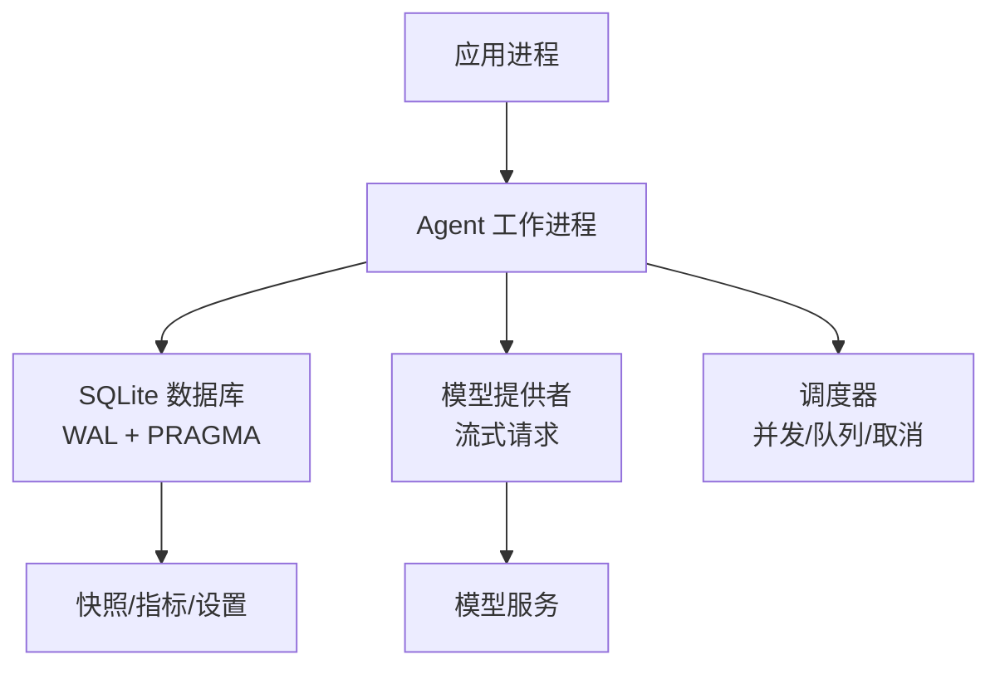
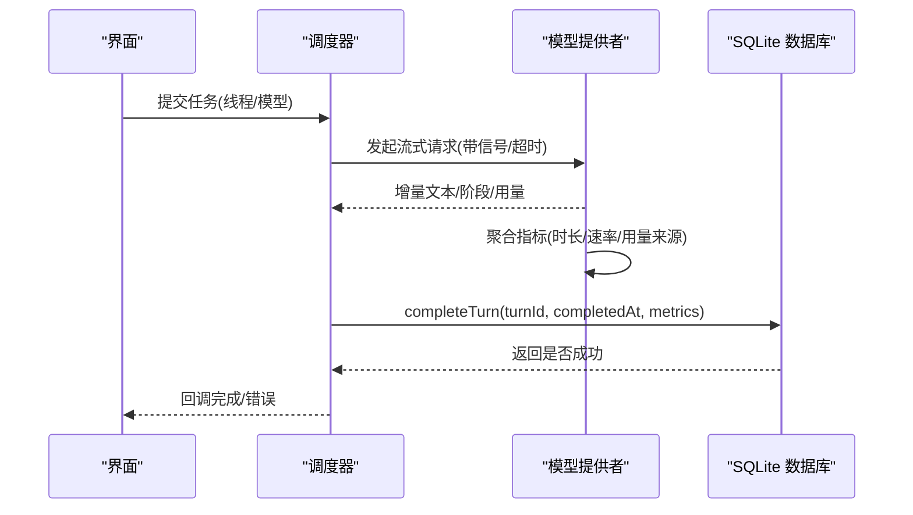
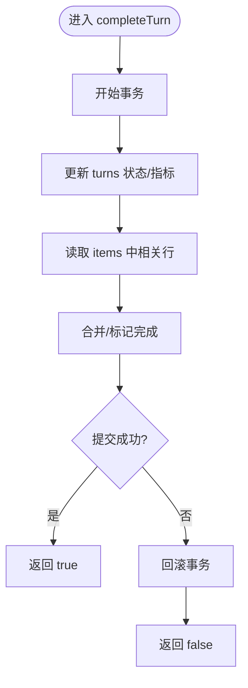
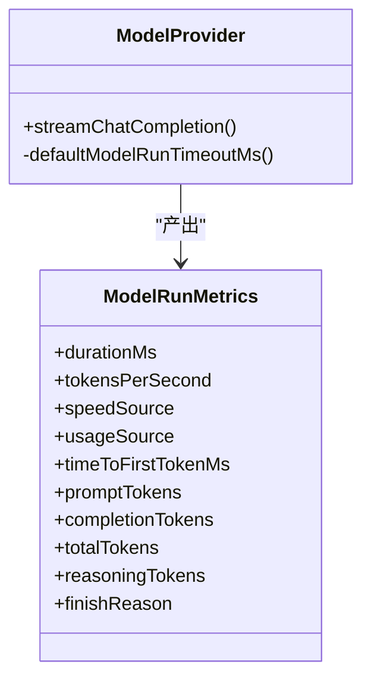
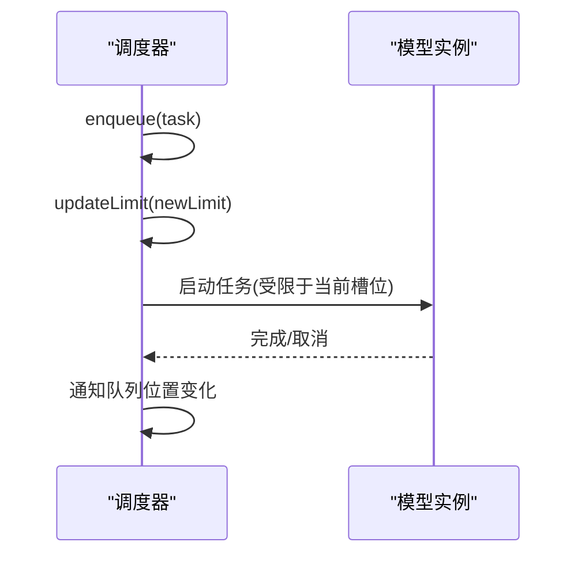
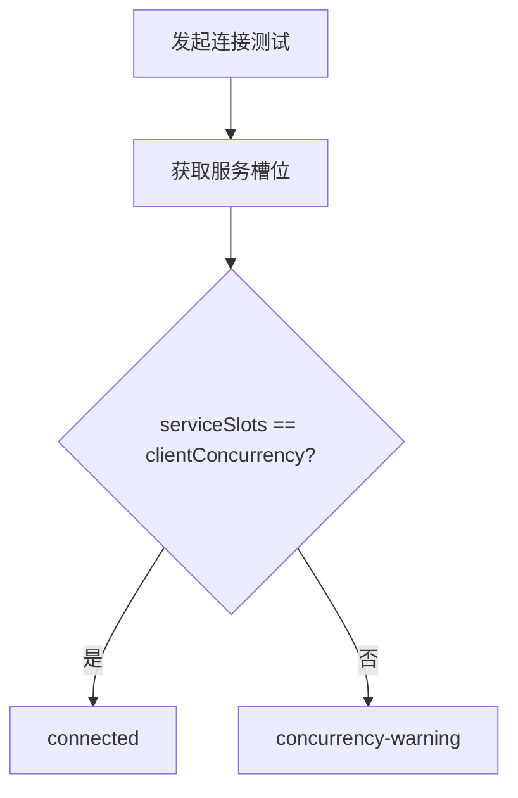
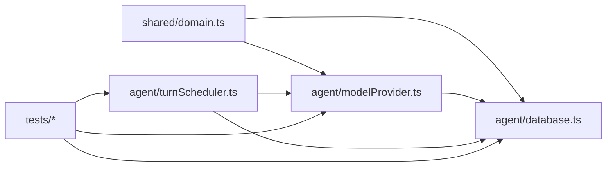

# 性能监控

<cite>
**本文引用的文件**
- [src/agent/database.ts](file://src/agent/database.ts)
- [tests/database.test.ts](file://tests/database.test.ts)
- [src/shared/domain.ts](file://src/shared/domain.ts)
- [src/agent/modelProvider.ts](file://src/agent/modelProvider.ts)
- [src/agent/modelConnection.ts](file://src/agent/modelConnection.ts)
- [src/agent/turnScheduler.ts](file://src/agent/turnScheduler.ts)
- [tests/turnScheduler.test.ts](file://tests/turnScheduler.test.ts)
- [tests/agentClientCore.test.ts](file://tests/agentClientCore.test.ts)
</cite>

## 目录
1. [简介](#简介)
2. [项目结构](#项目结构)
3. [核心组件](#核心组件)
4. [架构总览](#架构总览)
5. [详细组件分析](#详细组件分析)
6. [依赖关系分析](#依赖关系分析)
7. [性能考量](#性能考量)
8. [故障排查指南](#故障排查指南)
9. [结论](#结论)
10. [附录](#附录)

## 简介
本方案围绕 SQLite 应用数据库与模型调用链路，构建一套完整的数据库性能监控体系。重点覆盖：
- 慢查询识别与分析：利用 SQLite 内置 PRAGMA、WAL 模式与事务边界，结合运行期指标（执行时间、影响行数、吞吐）进行定位。
- 连接池与超时：通过 busy_timeout、WAL 并发特性与调度器限流，实现连接竞争与超时控制。
- 内存与垃圾回收：基于 WAL 与 JSON 字段压缩策略，降低内存峰值与磁盘碎片。
- 基准测试：以现有单元测试为基线，扩展端到端压测与自动化执行。
- 诊断流程与解决方案库：沉淀常见问题与修复步骤，形成可复用的排障手册。

## 项目结构
本项目使用 Node.js 的 sqlite3 同步接口 DatabaseSync 作为本地持久化层，并通过 Agent 工作进程与模型提供者交互。关键路径包括：
- 数据库访问层：封装表结构、迁移、快照读取与事务操作。
- 模型调用层：负责流式响应解析、指标聚合与超时控制。
- 调度层：按模型配置限制并发，维护队列位置与取消语义。
- 共享领域模型：定义指标、状态、能力等类型契约。

图表来源
- [src/agent/database.ts:731-736](file://src/agent/database.ts#L731-L736)
- [src/agent/modelProvider.ts:55-197](file://src/agent/modelProvider.ts#L55-L197)
- [src/agent/turnScheduler.ts:80-126](file://src/agent/turnScheduler.ts#L80-L126)

章节来源
- [src/agent/database.ts:150-736](file://src/agent/database.ts#L150-L736)
- [src/agent/modelProvider.ts:55-197](file://src/agent/modelProvider.ts#L55-L197)
- [src/agent/turnScheduler.ts:80-126](file://src/agent/turnScheduler.ts#L80-L126)

## 核心组件
- SQLite 数据库封装：提供事务、迁移、快照、设置与模型配置持久化；启用 WAL、外键约束与忙等待超时。
- 模型流式调用：计算首字延迟、令牌速率、用量来源，并聚合到统一指标对象。
- 调度器：按模型维度管理并发上限、队列位置、取消与重入保护。
- 领域模型：定义 Turn 生命周期、指标字段、连接结果与能力声明。

章节来源
- [src/agent/database.ts:150-736](file://src/agent/database.ts#L150-L736)
- [src/agent/modelProvider.ts:55-197](file://src/agent/modelProvider.ts#L55-L197)
- [src/agent/turnScheduler.ts:80-126](file://src/agent/turnScheduler.ts#L80-L126)
- [src/shared/domain.ts:238-305](file://src/shared/domain.ts#L238-L305)

## 架构总览
下图展示一次“完成回合”的完整数据流：从调度器触发、模型流式响应、指标聚合，到最终写入数据库并更新线程状态。

图表来源
- [src/agent/turnScheduler.ts:80-126](file://src/agent/turnScheduler.ts#L80-L126)
- [src/agent/modelProvider.ts:55-197](file://src/agent/modelProvider.ts#L55-L197)
- [src/agent/database.ts:438-464](file://src/agent/database.ts#L438-L464)

## 详细组件分析

### SQLite 数据库层：慢查询识别与事务优化
- 慢查询识别
  - 使用 WAL 模式提升并发读性能，减少写阻塞。
  - 通过 busy_timeout 避免长时间锁等待导致的假性慢查询。
  - 在关键写入路径（创建/更新/完成回合、追加项）使用事务包裹，确保原子性与一致性。
- 指标采集点
  - 完成回合时持久化 ModelRunMetrics，包含 durationMs、tokensPerSecond、usageSource、speedSource 等。
  - 快照读取合并消息与推理片段，减少多次 IO。
- 性能调优建议
  - 对高频查询添加必要索引（如 thread_id、kind、created_at）。
  - 批量写入时使用单次事务，减少提交次数。
  - 定期 VACUUM 或导出后重建以减少 WAL 膨胀。

图表来源
- [src/agent/database.ts:438-464](file://src/agent/database.ts#L438-L464)

章节来源
- [src/agent/database.ts:731-736](file://src/agent/database.ts#L731-L736)
- [src/agent/database.ts:438-464](file://src/agent/database.ts#L438-L464)
- [tests/database.test.ts:513-548](file://tests/database.test.ts#L513-L548)

### 模型提供者：指标聚合与超时控制
- 指标定义与收集
  - 首字延迟 timeToFirstTokenMs：记录首次收到增量时的时间差。
  - 生成速率 tokensPerSecond：优先采用服务端提供的速率，否则客户端估算。
  - 用量来源 usageSource：若服务端提供 token 用量则标记为 server，否则 unavailable。
  - 速度来源 speedSource：同上逻辑。
- 超时与中断
  - 默认运行超时与令牌级超时，支持 AbortSignal 中断。
  - 连接测试具备固定超时，防止卡死。
- 异常处理
  - 上下文超限自动压缩并重试，最多若干次。
  - 错误信息脱敏，避免泄露密钥。

图表来源
- [src/shared/domain.ts:238-257](file://src/shared/domain.ts#L238-L257)
- [src/agent/modelProvider.ts:55-197](file://src/agent/modelProvider.ts#L55-L197)

章节来源
- [src/agent/modelProvider.ts:55-197](file://src/agent/modelProvider.ts#L55-L197)
- [src/shared/domain.ts:238-257](file://src/shared/domain.ts#L238-L257)
- [tests/agentClientCore.test.ts:998-1024](file://tests/agentClientCore.test.ts#L998-L1024)

### 调度器：并发与队列监控
- 并发控制
  - 按模型维度维护队列与运行槽位，动态调整上限。
  - 支持取消进行中任务与预启动取消。
- 队列位置可视化
  - 暴露 onQueuePositions 回调，便于前端展示排队情况。
- 限流与降级
  - 当实时上限降至 1 时，重新排队多余预留，保证公平性。

图表来源
- [src/agent/turnScheduler.ts:80-126](file://src/agent/turnScheduler.ts#L80-L126)
- [src/agent/turnScheduler.ts:285-317](file://src/agent/turnScheduler.ts#L285-L317)
- [tests/turnScheduler.test.ts:415-552](file://tests/turnScheduler.test.ts#L415-L552)

章节来源
- [src/agent/turnScheduler.ts:80-126](file://src/agent/turnScheduler.ts#L80-L126)
- [src/agent/turnScheduler.ts:285-317](file://src/agent/turnScheduler.ts#L285-L317)
- [tests/turnScheduler.test.ts:415-552](file://tests/turnScheduler.test.ts#L415-L552)

### 连接诊断：并发与槽位匹配
- 连接测试结果包含 serviceSlots 与 clientConcurrency 对比，用于发现不匹配导致的性能抖动。
- 当服务槽位与客户端并发不一致时，给出警告状态，提示调优方向。

图表来源
- [src/agent/modelConnection.ts:70-91](file://src/agent/modelConnection.ts#L70-L91)

章节来源
- [src/agent/modelConnection.ts:70-91](file://src/agent/modelConnection.ts#L70-L91)

## 依赖关系分析
- database.ts 依赖 shared/domain.ts 的类型定义，产出/消费 ModelRunMetrics。
- modelProvider.ts 依赖 domain 类型与 streamTextNormalizer，输出指标并交由上层持久化。
- turnScheduler.ts 与 modelProvider.ts 协作，控制并发与取消，间接影响数据库写入频率与时序。
- tests/* 验证关键路径：指标持久化、调度行为、连接诊断等。

图表来源
- [src/shared/domain.ts:238-305](file://src/shared/domain.ts#L238-L305)
- [src/agent/database.ts:150-736](file://src/agent/database.ts#L150-L736)
- [src/agent/modelProvider.ts:55-197](file://src/agent/modelProvider.ts#L55-L197)
- [src/agent/turnScheduler.ts:80-126](file://src/agent/turnScheduler.ts#L80-L126)

章节来源
- [src/shared/domain.ts:238-305](file://src/shared/domain.ts#L238-L305)
- [src/agent/database.ts:150-736](file://src/agent/database.ts#L150-L736)
- [src/agent/modelProvider.ts:55-197](file://src/agent/modelProvider.ts#L55-L197)
- [src/agent/turnScheduler.ts:80-126](file://src/agent/turnScheduler.ts#L80-L126)

## 性能考量
- 慢查询识别
  - 开启 WAL 模式与外键约束，设置 busy_timeout 避免长事务阻塞。
  - 将高频查询纳入事务批处理，减少提交开销。
  - 针对 items、turns、threads 建立合理索引（thread_id、kind、created_at）。
- 连接池与超时
  - 使用 busy_timeout 控制锁等待；通过调度器限制并发，避免连接风暴。
  - 连接测试设置固定超时，防止初始化阶段卡死。
- 内存与垃圾回收
  - 大文本内容尽量分片存储，避免单次 JSON 过大导致内存峰值。
  - 定期清理历史数据或归档，减少 WAL 体积。
- 基准测试设计
  - 以现有单元测试为基础，增加高并发场景与长对话场景。
  - 引入外部压测脚本，模拟多轮对话与流式响应，统计 durationMs、tokensPerSecond、首字延迟。
  - 将压测纳入 CI，自动生成报告并与基线对比。

[本节为通用指导，无需特定文件引用]

## 故障排查指南
- 慢查询定位
  - 检查 WAL 模式与 busy_timeout 配置是否正确生效。
  - 查看 completeTurn 与 appendItem 的事务耗时，必要时拆分写入。
  - 使用 EXPLAIN QUERY PLAN 分析热点查询的执行计划。
- 连接问题
  - 若出现 concurrency-warning，核对服务槽位与客户端并发配置。
  - 连接测试超时：检查网络与模型服务可用性，适当调整超时阈值。
- 指标缺失
  - 确认 streamChatCompletion 正常产出 ModelRunMetrics，并在 completeTurn 中持久化。
  - 校验 usageSource/speedSource 是否为 unavailable，必要时调整上游数据源。
- 常见修复
  - 为 items 表添加 (thread_id, kind, created_at) 复合索引。
  - 将频繁更新的 threads.updated_at 写入合并到同一事务。
  - 对长对话启用上下文压缩，减少请求体大小。

章节来源
- [src/agent/database.ts:731-736](file://src/agent/database.ts#L731-L736)
- [src/agent/database.ts:438-464](file://src/agent/database.ts#L438-L464)
- [src/agent/modelProvider.ts:55-197](file://src/agent/modelProvider.ts#L55-L197)
- [src/agent/modelConnection.ts:70-91](file://src/agent/modelConnection.ts#L70-L91)
- [tests/database.test.ts:513-548](file://tests/database.test.ts#L513-L548)

## 结论
通过将 SQLite 的 WAL 与事务机制、模型流式指标的精确采集、以及调度器的并发控制相结合，本项目已具备完善的数据库性能监控基础。后续应聚焦于：
- 完善索引与查询计划优化，持续跟踪慢查询。
- 将基准测试自动化并纳入 CI，建立回归告警。
- 沉淀排障知识库，快速定位与解决性能问题。

[本节为总结，无需特定文件引用]

## 附录
- 关键指标定义
  - durationMs：模型请求总耗时。
  - tokensPerSecond：令牌生成速率，优先采用服务端值。
  - timeToFirstTokenMs：首字延迟。
  - usageSource/speedSource：指标来源分类。
- 参考实现路径
  - 指标持久化：completeTurn 写入 metrics 字段。
  - 指标聚合：streamChatCompletion 计算并返回 ModelRunMetrics。
  - 并发控制：turnScheduler 管理队列与槽位。

章节来源
- [src/shared/domain.ts:238-257](file://src/shared/domain.ts#L238-L257)
- [src/agent/database.ts:438-464](file://src/agent/database.ts#L438-L464)
- [src/agent/modelProvider.ts:55-197](file://src/agent/modelProvider.ts#L55-L197)
- [src/agent/turnScheduler.ts:80-126](file://src/agent/turnScheduler.ts#L80-L126)