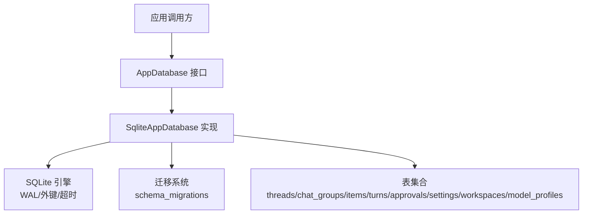
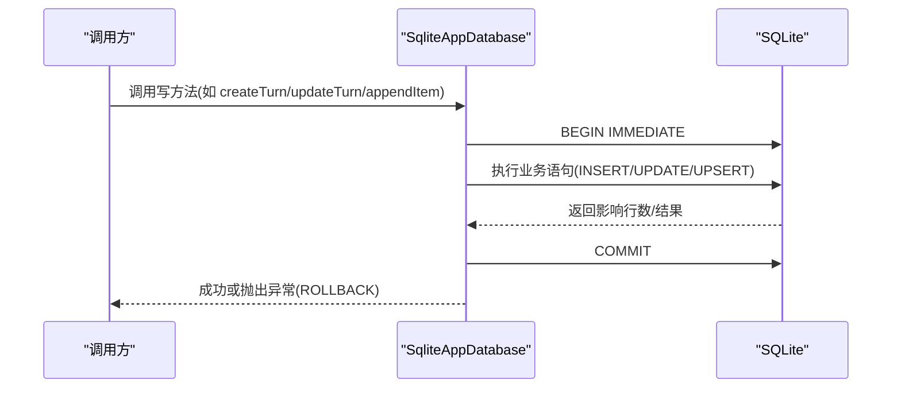
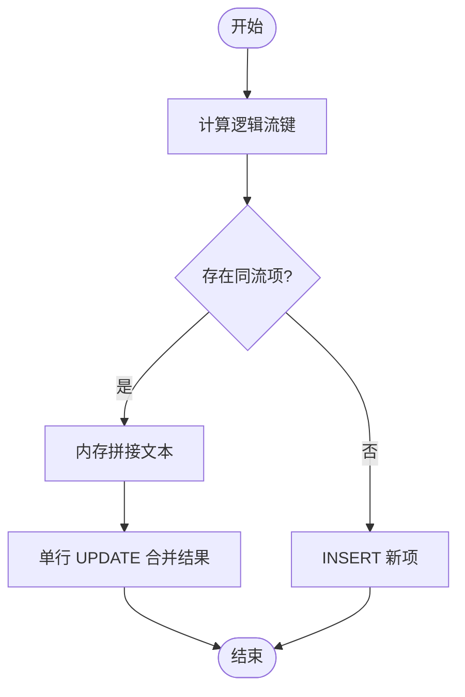
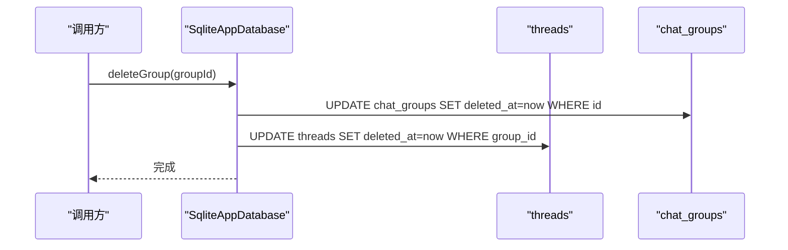
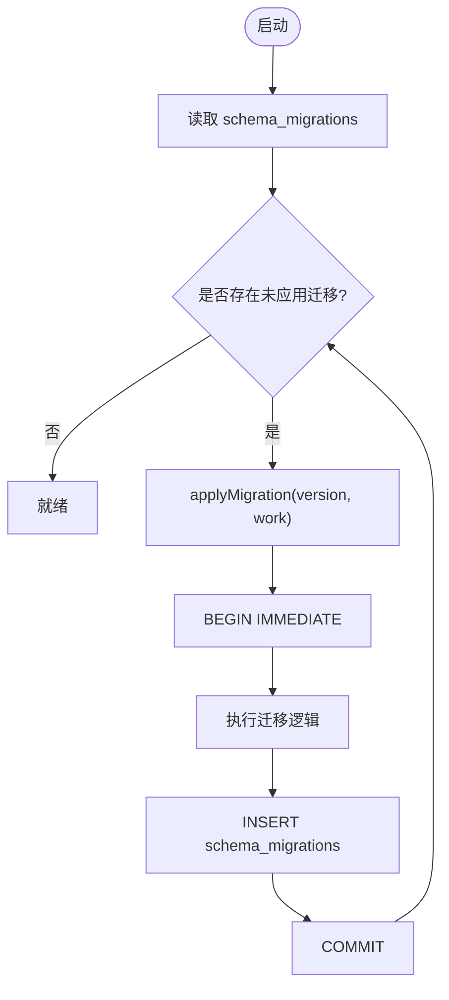
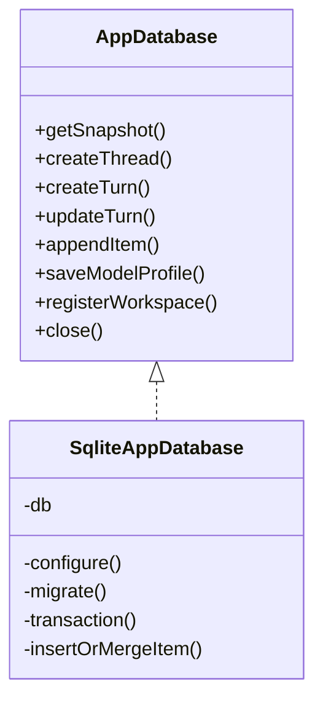

# 数据持久化模式

<cite>
**本文引用的文件**
- [database.ts](file://src/agent/database.ts)
- [database.test.ts](file://tests/database.test.ts)
</cite>

## 目录
1. [简介](#简介)
2. [项目结构](#项目结构)
3. [核心组件](#核心组件)
4. [架构总览](#架构总览)
5. [详细组件分析](#详细组件分析)
6. [依赖关系分析](#依赖关系分析)
7. [性能考量](#性能考量)
8. [故障排查指南](#故障排查指南)
9. [结论](#结论)
10. [附录](#附录)

## 简介
本指南围绕本地 SQLite 数据库的持久化模式，系统说明增量更新策略（字段级与批量）、事务包装、软删除设计、数据版本控制与迁移、完整性约束与触发器使用建议，以及备份与恢复方案。内容基于代码库中的实际实现进行提炼与扩展，帮助读者在现有基础上安全地演进数据层。

## 项目结构
- 数据访问层集中在单一模块中，封装了数据库初始化、配置、迁移、CRUD 与快照读取等能力。
- 测试覆盖迁移幂等性、历史数据修复、默认预设注入、流式项合并等行为。

**图表来源**
- [database.ts:731-873](file://src/agent/database.ts#L731-L873)
- [database.ts:1215-1217](file://src/agent/database.ts#L1215-L1217)

**章节来源**
- [database.ts:731-873](file://src/agent/database.ts#L731-L873)
- [database.ts:1215-1217](file://src/agent/database.ts#L1215-L1217)

## 核心组件
- AppDatabase 接口：定义快照获取、会话/消息/审批/工作区/模型配置等读写方法。
- SqliteAppDatabase：具体实现，负责：
  - 数据库配置（WAL、外键、忙等待）
  - 建表与向后兼容列添加
  - 迁移编排与执行
  - 业务写入的事务包装
  - 流式项合并与状态修复
  - 软删除过滤与一致性维护

**章节来源**
- [database.ts:38-66](file://src/agent/database.ts#L38-L66)
- [database.ts:150-154](file://src/agent/database.ts#L150-L154)
- [database.ts:731-873](file://src/agent/database.ts#L731-L873)

## 架构总览
整体采用“单进程内嵌 SQLite + 事务边界明确”的模式。所有写操作通过统一事务封装，保证原子性与一致性；读操作提供快照视图，便于 UI 渲染与调试。

**图表来源**
- [database.ts:1203-1212](file://src/agent/database.ts#L1203-L1212)
- [database.ts:360-380](file://src/agent/database.ts#L360-L380)
- [database.ts:412-417](file://src/agent/database.ts#L412-L417)
- [database.ts:490-514](file://src/agent/database.ts#L490-L514)

## 详细组件分析

### 增量更新策略：字段级 vs 批量
- 字段级更新
  - 适用于少量字段变更、避免全量重写带来的额外开销与锁竞争。
  - 示例：updateTurn 根据传入 patch 动态拼装 SET 子句，仅更新必要字段并附带 updated_at。
- 批量更新
  - 当前实现未使用显式批处理语句，但通过事务将多条语句包裹在一次提交中，减少磁盘同步次数。
  - 示例：failTurn 同时更新 turns 与 approvals 两条记录，处于同一事务。
- 选择标准
  - 小改动优先字段级；跨多表或多行且强一致要求高时，用事务包裹多条语句作为“逻辑批量”。
  - 对高频追加场景（如流式消息），采用“就地合并 + 单行 UPDATE”的策略，降低 INSERT 压力。

**章节来源**
- [database.ts:382-417](file://src/agent/database.ts#L382-L417)
- [database.ts:419-436](file://src/agent/database.ts#L419-L436)
- [database.ts:490-514](file://src/agent/database.ts#L490-L514)

### 批量插入的性能优化技巧
- 事务包装
  - 所有写操作均置于事务中，减少 WAL 切换与 fsync 频率。
- 内存管理
  - 流式项合并：先查询候选行，内存中拼接文本后一次性 UPDATE，避免频繁 INSERT。
  - 迁移与修复：在迁移函数内部以最小化 I/O 的方式处理历史数据。
- 并发与锁
  - 使用 BEGIN IMMEDIATE 提前获取写锁，避免长时间持有共享锁导致的冲突。
  - busy_timeout 设置可缓解短暂争用。

**图表来源**
- [database.ts:945-979](file://src/agent/database.ts#L945-L979)

**章节来源**
- [database.ts:945-979](file://src/agent/database.ts#L945-L979)
- [database.ts:731-737](file://src/agent/database.ts#L731-L737)

### 软删除设计模式
- 设计要点
  - 关键表包含 deleted_at 字段，删除操作不物理移除数据，而是标记时间戳。
  - 查询通过 WHERE deleted_at IS NULL 过滤已删除记录。
  - 级联软删：删除分组时，级联更新其下线程的 deleted_at。
- 实现位置
  - 创建/删除组、线程、快照读取等均遵循该约定。

**图表来源**
- [database.ts:244-256](file://src/agent/database.ts#L244-L256)
- [database.ts:156-167](file://src/agent/database.ts#L156-L167)

**章节来源**
- [database.ts:244-256](file://src/agent/database.ts#L244-L256)
- [database.ts:156-167](file://src/agent/database.ts#L156-L167)

### 数据版本控制与迁移策略
- schema_migrations 表
  - 记录已应用的迁移版本号与时间戳，确保幂等执行。
- 迁移机制
  - 启动时按顺序检查并执行未应用的迁移；每个迁移包裹在事务中，失败则回滚。
  - 使用 ensureColumn 做向后兼容列添加，避免重复 ALTER。
- 典型迁移
  - 压缩历史助手消息片段、修复历史 turn 完成状态、补齐 model_profiles 字段、修复或注入本地 Qwen 预设等。

**图表来源**
- [database.ts:981-993](file://src/agent/database.ts#L981-L993)
- [database.ts:838-873](file://src/agent/database.ts#L838-L873)

**章节来源**
- [database.ts:981-993](file://src/agent/database.ts#L981-L993)
- [database.ts:838-873](file://src/agent/database.ts#L838-L873)

### 数据完整性约束与触发器
- 外键约束
  - 启用 foreign_keys = ON，并在建表时使用 REFERENCES ... ON DELETE CASCADE/SET NULL，保证引用一致性。
- 主键与唯一性
  - 各表定义主键；workspaces 的 canonical_root_path 唯一约束防止重复注册。
- 触发器
  - 当前未使用触发器，业务逻辑由应用层保证。如需复杂联动，可在未来引入触发器，但需评估可维护性与迁移成本。

**章节来源**
- [database.ts:731-737](file://src/agent/database.ts#L731-L737)
- [database.ts:765-828](file://src/agent/database.ts#L765-L828)

### 数据备份与恢复
- 现状
  - 代码未内置备份/恢复 API。
- 推荐方案
  - 冷备：关闭应用后复制 .sqlite 文件。
  - 热备：利用 SQLite 的 WAL 模式，配合 VACUUM INTO 或在线备份 API（若运行环境支持）。
  - 定期快照：结合迁移与导出脚本，生成只读副本用于审计或回滚。
- 注意事项
  - 备份前确保无活跃写事务；恢复时校验版本与 schema_migrations 一致性。

[本节为通用实践建议，不直接分析具体文件]

## 依赖关系分析
- 模块内聚
  - 数据访问高度内聚于 database.ts，对外暴露 AppDatabase 接口，降低耦合。
- 外部依赖
  - node:sqlite 的 DatabaseSync 提供同步 API；WAL 模式提升并发读性能。
- 迁移与数据修复
  - 迁移之间相互独立，通过版本号串行执行；历史修复逻辑集中，便于回归测试。

**图表来源**
- [database.ts:38-66](file://src/agent/database.ts#L38-L66)
- [database.ts:150-154](file://src/agent/database.ts#L150-L154)
- [database.ts:1203-1212](file://src/agent/database.ts#L1203-L1212)

**章节来源**
- [database.ts:38-66](file://src/agent/database.ts#L38-L66)
- [database.ts:150-154](file://src/agent/database.ts#L150-L154)

## 性能考量
- 写入路径
  - 使用事务包裹每次写操作，减少提交次数。
  - 流式项合并减少 INSERT 数量，提高吞吐。
- 读取路径
  - 快照读取通过 JOIN 与排序构建视图，适合 UI 展示；可按需限制返回条数。
- 并发与锁
  - WAL 模式提升读并发；busy_timeout 降低短暂冲突失败率。
- 迁移与修复
  - 迁移尽量幂等且快速；历史修复仅在必要时执行。

[本节为通用指导，不直接分析具体文件]

## 故障排查指南
- 常见问题
  - 迁移失败：检查 applyMigration 事务是否回滚；确认迁移逻辑幂等。
  - 数据不一致：核对外键约束是否开启；检查级联软删是否生效。
  - 流式输出不完整：确认 appendItem 合并逻辑与 completeTurn 的 incomplete 标志更新。
- 定位手段
  - 查看 schema_migrations 确定已应用版本。
  - 通过 getSnapshot 观察最终视图是否符合预期。
  - 单元测试覆盖迁移与修复路径，便于回归验证。

**章节来源**
- [database.ts:981-993](file://src/agent/database.ts#L981-L993)
- [database.ts:1032-1194](file://src/agent/database.ts#L1032-L1194)
- [database.test.ts:60-116](file://tests/database.test.ts#L60-L116)

## 结论
本项目采用简洁而稳健的 SQLite 持久化模式：以事务为核心保障一致性，以迁移与修复保障可演进性，以软删除与流式合并提升可用性与性能。建议在后续演进中继续遵循这些原则，谨慎引入触发器与批量操作，并通过完善的测试覆盖迁移与修复路径。

## 附录
- 关键实现参考
  - 事务封装：[database.ts:1203-1212](file://src/agent/database.ts#L1203-L1212)
  - 迁移编排：[database.ts:981-993](file://src/agent/database.ts#L981-L993)
  - 软删除与级联：[database.ts:244-256](file://src/agent/database.ts#L244-L256)
  - 流式项合并：[database.ts:945-979](file://src/agent/database.ts#L945-L979)
  - 历史修复：[database.ts:1032-1194](file://src/agent/database.ts#L1032-L1194)
  - 测试用例：[database.test.ts:60-116](file://tests/database.test.ts#L60-L116)