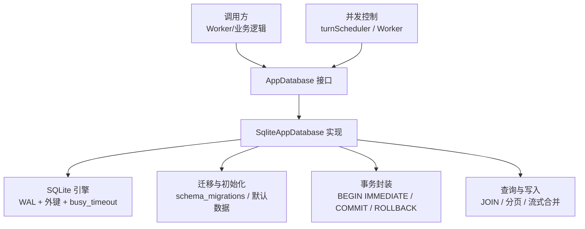
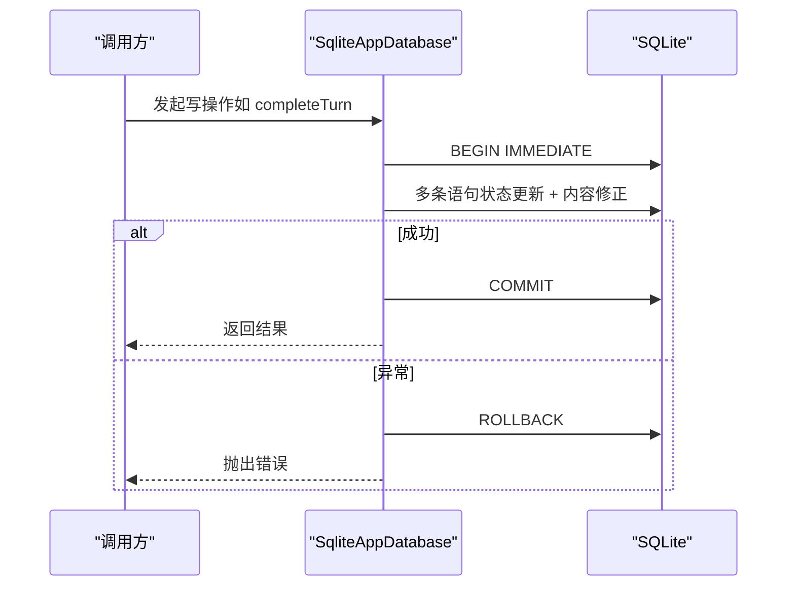
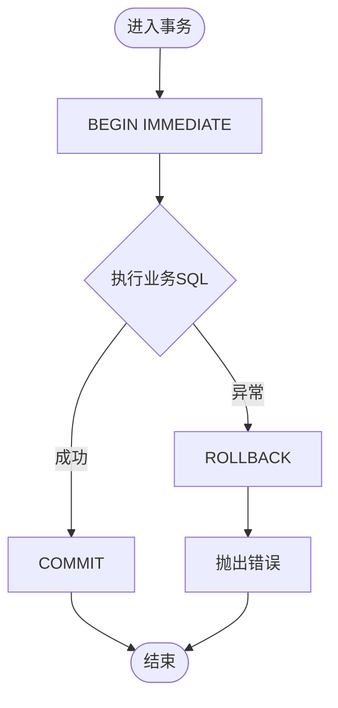
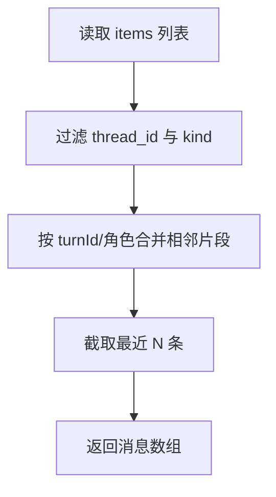
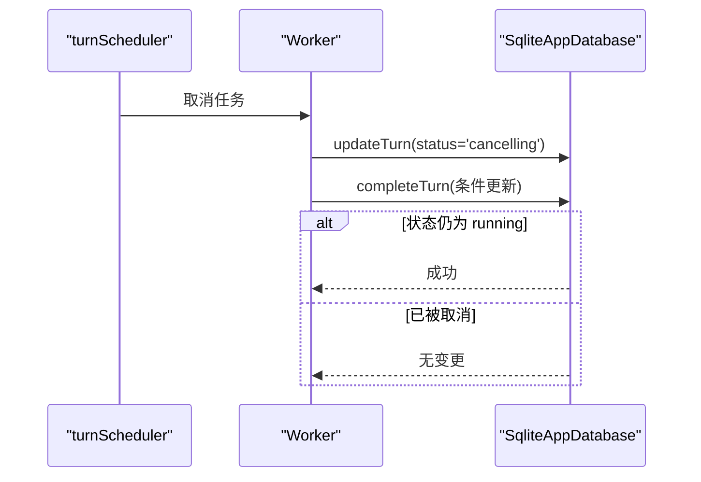
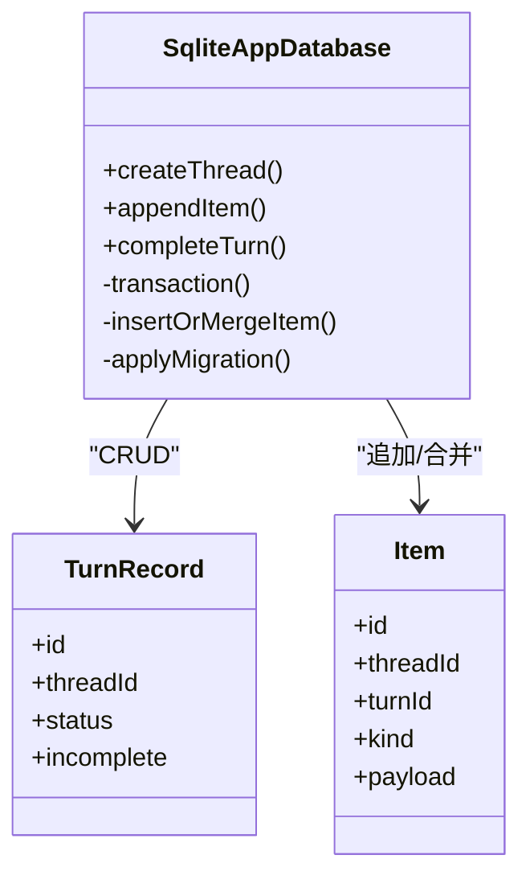
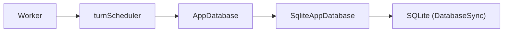

# 数据访问模式

<cite>
**本文引用的文件**
- [database.ts](file://src/agent/database.ts)
- [database.test.ts](file://tests/database.test.ts)
- [worker.ts](file://src/agent/worker.ts)
- [turnScheduler.ts](file://src/agent/turnScheduler.ts)
</cite>

## 目录
1. [简介](#简介)
2. [项目结构](#项目结构)
3. [核心组件](#核心组件)
4. [架构总览](#架构总览)
5. [详细组件分析](#详细组件分析)
6. [依赖关系分析](#依赖关系分析)
7. [性能考量](#性能考量)
8. [故障排查指南](#故障排查指南)
9. [结论](#结论)
10. [附录](#附录)

## 简介
本文件聚焦于数据访问层的实现与最佳实践，围绕事务管理、查询优化、并发控制、持久化模式、性能监控与慢查询分析、一致性保证与故障恢复、以及内存管理与资源清理等方面展开。该数据访问层基于 SQLite（Node.js 的 DatabaseSync），通过封装事务、迁移机制、软删除、增量合并等策略，为上层应用提供一致、可靠且可维护的数据操作能力。

## 项目结构
数据访问层的核心位于 agent 模块的数据库实现中，测试覆盖在 tests 目录下，并发调度与中断逻辑由 worker 和 turnScheduler 协同完成。整体结构如下：

图表来源
- [database.ts:150-1217](file://src/agent/database.ts#L150-L1217)
- [turnScheduler.ts:80-126](file://src/agent/turnScheduler.ts#L80-L126)
- [worker.ts:359-395](file://src/agent/worker.ts#L359-L395)

章节来源
- [database.ts:150-1217](file://src/agent/database.ts#L150-L1217)
- [turnScheduler.ts:80-126](file://src/agent/turnScheduler.ts#L80-L126)
- [worker.ts:359-395](file://src/agent/worker.ts#L359-L395)

## 核心组件
- AppDatabase 接口：定义快照获取、会话/分组/工作区/模型配置、回合（Turn）生命周期、消息项追加、审批记录等统一 API。
- SqliteAppDatabase 实现：基于 SQLite 的具体实现，包含事务封装、迁移、软删除、流式内容合并、设置与模型配置管理等。
- 并发与中断：worker 与 turnScheduler 负责取消、抢占与状态同步，配合数据库的状态机与原子更新确保一致性。

章节来源
- [database.ts:38-66](file://src/agent/database.ts#L38-L66)
- [database.ts:150-1217](file://src/agent/database.ts#L150-L1217)
- [worker.ts:359-395](file://src/agent/worker.ts#L359-L395)
- [turnScheduler.ts:80-126](file://src/agent/turnScheduler.ts#L80-L126)

## 架构总览
数据访问层采用“接口+实现”的分层设计，所有写操作均通过事务封装，读操作通过 JOIN 与过滤条件高效返回所需视图。启动时执行迁移并修复历史不一致状态；运行时通过 WAL 模式提升并发读取性能，并通过 busy_timeout 降低锁竞争失败概率。

图表来源
- [database.ts:1203-1212](file://src/agent/database.ts#L1203-L1212)
- [database.ts:438-464](file://src/agent/database.ts#L438-L464)

## 详细组件分析

### 事务管理机制
- 事务封装：所有写操作通过统一的 transaction 方法包裹，使用 BEGIN IMMEDIATE 获得写锁，确保多进程/多线程场景下的顺序性；异常时自动 ROLLBACK，避免部分提交。
- 批量操作：将多个相关 SQL 放入同一事务，例如 failTurn 同时更新 turns 与 approvals；completeTurn 更新 turns 并批量修正 items 的 incomplete 标志。
- 错误回滚：任何抛出的异常都会触发 ROLLBACK，调用方可捕获并处理；测试覆盖了因触发器导致的原子失败回滚场景。

图表来源
- [database.ts:1203-1212](file://src/agent/database.ts#L1203-L1212)
- [database.ts:419-436](file://src/agent/database.ts#L419-L436)
- [database.ts:438-464](file://src/agent/database.ts#L438-L464)

章节来源
- [database.ts:1203-1212](file://src/agent/database.ts#L1203-L1212)
- [database.ts:419-436](file://src/agent/database.ts#L419-L436)
- [database.ts:438-464](file://src/agent/database.ts#L438-L464)
- [database.test.ts:430-458](file://tests/database.test.ts#L430-L458)

### 查询优化技巧
- JOIN 操作：getSnapshot 使用 INNER JOIN threads 过滤已软删除的记录，并按时间排序，减少无效数据参与后续处理。
- 分页与限制：getThreadMessages 支持 limit 参数，仅返回最近 N 条消息，避免一次性加载大量历史。
- 流式合并：appendItem 对同一流片段进行合并（按逻辑键），减少重复存储；getSnapshot 中对 assistant 消息与 reasoning 片段进行聚合，提高可读性与性能。
- 软删除：threads/chat_groups 使用 deleted_at 字段标记删除，查询时过滤，避免物理删除带来的级联复杂性与数据丢失风险。

图表来源
- [database.ts:335-358](file://src/agent/database.ts#L335-L358)
- [database.ts:945-979](file://src/agent/database.ts#L945-L979)
- [database.ts:156-216](file://src/agent/database.ts#L156-L216)

章节来源
- [database.ts:156-216](file://src/agent/database.ts#L156-L216)
- [database.ts:335-358](file://src/agent/database.ts#L335-L358)
- [database.ts:945-979](file://src/agent/database.ts#L945-L979)

### 并发访问控制
- 队列与抢占：turnScheduler 维护每个模型的队列，支持取消正在运行或排队中的任务，并在取消时更新数据库状态（cancelling）。
- 竞态条件处理：completeTurn 使用条件更新（WHERE status = 'running'）防止与 cancelling 状态冲突；interruptUnfinishedTurns 在启动时将未完成的任务标记为 interrupted，避免重复执行。
- 审批与终止：failTurn 与 interruptUnfinishedTurns 会批量拒绝 pending 的审批，确保状态机一致性。

图表来源
- [turnScheduler.ts:80-126](file://src/agent/turnScheduler.ts#L80-L126)
- [worker.ts:359-395](file://src/agent/worker.ts#L359-L395)
- [database.ts:438-464](file://src/agent/database.ts#L438-L464)
- [database.ts:466-488](file://src/agent/database.ts#L466-L488)

章节来源
- [turnScheduler.ts:80-126](file://src/agent/turnScheduler.ts#L80-L126)
- [worker.ts:359-395](file://src/agent/worker.ts#L359-L395)
- [database.ts:438-464](file://src/agent/database.ts#L438-L464)
- [database.ts:466-488](file://src/agent/database.ts#L466-L488)

### 数据持久化模式
- 增量更新：updateTurn 支持部分字段更新，动态构建 SET 子句，避免全量覆盖；saveModelProfile 合并 capabilities/reasoning 等嵌套结构。
- 批量插入：insertOrMergeItem 根据逻辑键判断是否合并文本流，否则直接插入新项；completeTurn 批量更新 items 的 incomplete 标志。
- 软删除：deleteGroup/deleteThread 设置 deleted_at，查询时过滤；快照与上下文不包含已删除数据。
- 迁移与修复：migrate 与 applyMigration 管理 schema 演进；compactAssistantMessageFragments 与 repairMislabelledLegacyCompletion 修复历史数据。

图表来源
- [database.ts:258-290](file://src/agent/database.ts#L258-L290)
- [database.ts:490-514](file://src/agent/database.ts#L490-L514)
- [database.ts:438-464](file://src/agent/database.ts#L438-L464)
- [database.ts:945-979](file://src/agent/database.ts#L945-L979)
- [database.ts:981-993](file://src/agent/database.ts#L981-L993)

章节来源
- [database.ts:258-290](file://src/agent/database.ts#L258-L290)
- [database.ts:490-514](file://src/agent/database.ts#L490-L514)
- [database.ts:438-464](file://src/agent/database.ts#L438-L464)
- [database.ts:945-979](file://src/agent/database.ts#L945-L979)
- [database.ts:981-993](file://src/agent/database.ts#L981-L993)

### 性能监控与慢查询分析
- WAL 模式：启用 WAL 提升并发读取性能，适合高并发读场景。
- busy_timeout：设置超时以避免长时间阻塞，降低锁竞争导致的失败率。
- 查询路径：getSnapshot 与 getThreadMessages 使用 JOIN 与 ORDER BY 优化；建议结合 EXPLAIN QUERY PLAN 分析关键查询的执行计划。
- 指标持久化：completeTurn 支持保存 metrics（时长、token 数、速度来源等），可用于后续分析与告警。

章节来源
- [database.ts:731-737](file://src/agent/database.ts#L731-L737)
- [database.ts:156-216](file://src/agent/database.ts#L156-L216)
- [database.ts:335-358](file://src/agent/database.ts#L335-L358)
- [database.ts:438-464](file://src/agent/database.ts#L438-L464)

### 数据一致性保证与故障恢复
- 原子性：所有写操作通过事务保证；测试验证了审批失败时的回滚行为。
- 幂等与修复：启动时执行 interruptUnfinishedTurns 与迁移修复，确保重启后状态一致。
- 状态机约束：completeTurn 的条件更新避免与 cancelling 冲突；failTurn 与 interruptUnfinishedTurns 批量拒绝 pending 审批。

章节来源
- [database.ts:438-464](file://src/agent/database.ts#L438-L464)
- [database.ts:466-488](file://src/agent/database.ts#L466-L488)
- [database.test.ts:430-458](file://tests/database.test.ts#L430-L458)

### 内存管理与资源清理
- 连接关闭：close 方法显式关闭底层数据库连接，避免资源泄漏。
- 临时对象：解析 payload 时使用 try/catch 保护 JSON 解析，失败返回 undefined，避免异常传播。
- 测试清理：测试用例在 afterEach 中清理临时目录与数据库实例，确保环境干净。

章节来源
- [database.ts:727-729](file://src/agent/database.ts#L727-L729)
- [database.ts:1219-1239](file://src/agent/database.ts#L1219-L1239)
- [database.test.ts:53-58](file://tests/database.test.ts#L53-L58)

## 依赖关系分析
- 调用方依赖 AppDatabase 接口，屏蔽底层 SQLite 细节。
- SqliteAppDatabase 依赖 node:sqlite 的 DatabaseSync，并通过 PRAGMA 配置 WAL、外键与超时。
- 并发控制由 turnScheduler 与 worker 协作，通过数据库状态机与条件更新确保一致性。

图表来源
- [worker.ts:359-395](file://src/agent/worker.ts#L359-L395)
- [turnScheduler.ts:80-126](file://src/agent/turnScheduler.ts#L80-L126)
- [database.ts:150-1217](file://src/agent/database.ts#L150-L1217)

章节来源
- [worker.ts:359-395](file://src/agent/worker.ts#L359-L395)
- [turnScheduler.ts:80-126](file://src/agent/turnScheduler.ts#L80-L126)
- [database.ts:150-1217](file://src/agent/database.ts#L150-L1217)

## 性能考量
- 使用 WAL 模式与 busy_timeout 提升并发与稳定性。
- 通过 JOIN 与过滤减少不必要的数据传输与处理。
- 流式合并减少重复存储，降低 I/O 压力。
- 分页限制避免大结果集导致内存峰值。
- 建议在关键查询上使用 EXPLAIN QUERY PLAN 分析执行计划，必要时添加索引（当前未显式创建索引，依赖主键与查询条件）。

[本节提供通用指导，不直接分析具体文件]

## 故障排查指南
- 事务失败：检查事务内 SQL 是否有约束冲突或触发器报错；参考测试中的触发器模拟失败场景。
- 状态不一致：确认启动时是否执行了 interruptUnfinishedTurns 与迁移修复；检查 completeTurn 的条件更新是否生效。
- 审批卡住：检查 failTurn 与 interruptUnfinishedTurns 是否正确拒绝 pending 审批。
- 性能问题：分析 getSnapshot 与 getThreadMessages 的 JOIN 与排序；考虑是否需要索引或调整 limit。

章节来源
- [database.test.ts:430-458](file://tests/database.test.ts#L430-L458)
- [database.ts:466-488](file://src/agent/database.ts#L466-L488)
- [database.ts:438-464](file://src/agent/database.ts#L438-L464)

## 结论
该数据访问层通过事务封装、迁移机制、软删除、流式合并与并发控制，提供了稳定、一致且高性能的 SQLite 数据操作能力。结合 WAL 模式与 busy_timeout，系统在并发读写场景下具备良好表现。通过完善的测试覆盖，确保了事务原子性、状态机一致性与历史数据修复的正确性。建议在生产环境中持续监控关键查询性能，并根据实际负载评估是否需要引入索引或分片策略。

[本节总结性内容，不直接分析具体文件]

## 附录
- 关键 API 路径参考：
  - 事务封装：[database.ts:1203-1212](file://src/agent/database.ts#L1203-L1212)
  - 回合完成：[database.ts:438-464](file://src/agent/database.ts#L438-L464)
  - 消息合并：[database.ts:945-979](file://src/agent/database.ts#L945-L979)
  - 启动中断：[database.ts:466-488](file://src/agent/database.ts#L466-L488)
  - 并发取消：[turnScheduler.ts:80-126](file://src/agent/turnScheduler.ts#L80-L126)
  - Worker 交互：[worker.ts:359-395](file://src/agent/worker.ts#L359-L395)

[本节列出参考路径，不直接分析具体文件]