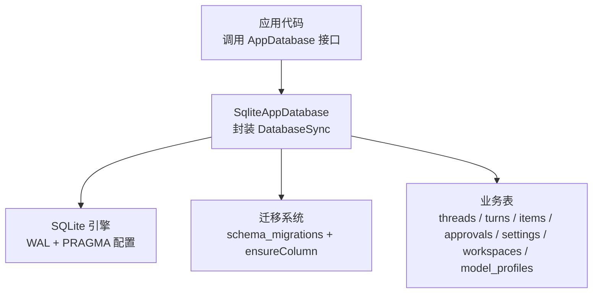
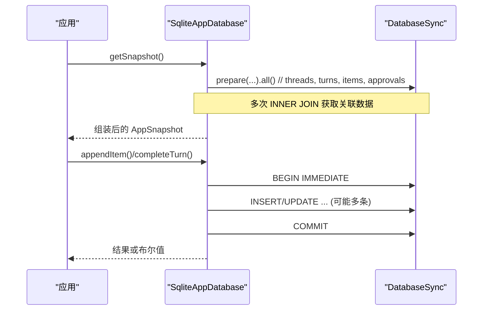
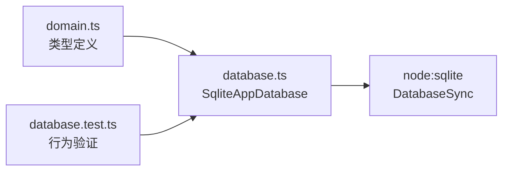

# 查询优化

<cite>
**本文引用的文件**
- [src/agent/database.ts](file://src/agent/database.ts)
- [tests/database.test.ts](file://tests/database.test.ts)
- [src/shared/domain.ts](file://src/shared/domain.ts)
</cite>

## 目录
1. [简介](#简介)
2. [项目结构](#项目结构)
3. [核心组件](#核心组件)
4. [架构总览](#架构总览)
5. [详细组件分析](#详细组件分析)
6. [依赖关系分析](#依赖关系分析)
7. [性能注意事项](#性能注意事项)
8. [故障排查指南](#故障排查指南)
9. [结论](#结论)
10. [附录](#附录)

## 简介
本指南面向本项目中基于 SQLite 的应用数据库，围绕查询优化提供可落地的实践建议。内容覆盖 JOIN 优化、分页查询模式与 LIMIT/OFFSET 的权衡、缓存策略（应用层与数据库级）、慢查询识别与分析方法（含 EXPLAIN 的使用思路）、预编译语句与参数化查询最佳实践，以及结合仓库内实际 SQL 的查询计划分析与调优案例。

## 项目结构
本项目使用 Node.js 内置的 sqlite 模块进行本地持久化，所有数据访问集中在单一数据库实现中，并通过迁移机制维护表结构与默认数据。关键路径如下：
- 数据库实现与迁移：src/agent/database.ts
- 领域模型与类型定义：src/shared/domain.ts
- 数据库行为与回归测试：tests/database.test.ts

图表来源
- [src/agent/database.ts:150-154](file://src/agent/database.ts#L150-L154)
- [src/agent/database.ts:731-737](file://src/agent/database.ts#L731-L737)
- [src/agent/database.ts:739-873](file://src/agent/database.ts#L739-L873)

章节来源
- [src/agent/database.ts:150-154](file://src/agent/database.ts#L150-L154)
- [src/agent/database.ts:731-737](file://src/agent/database.ts#L731-L737)
- [src/agent/database.ts:739-873](file://src/agent/database.ts#L739-L873)

## 核心组件
- SqliteAppDatabase：统一封装所有读写操作，包含事务、迁移、快照读取、流式项合并等能力。
- 领域模型：通过 domain.ts 中的类型约束数据形态，如 ThreadSummary、TurnRecord、Item、ModelProfile 等。
- 测试套件：覆盖迁移、状态修复、原子性、消息合并、指标持久化等场景，保障查询与写入的正确性。

章节来源
- [src/agent/database.ts:38-66](file://src/agent/database.ts#L38-L66)
- [src/shared/domain.ts:14-22](file://src/shared/domain.ts#L14-L22)
- [src/shared/domain.ts:24-74](file://src/shared/domain.ts#L24-L74)
- [src/shared/domain.ts:76-94](file://src/shared/domain.ts#L76-L94)
- [src/shared/domain.ts:160-192](file://src/shared/domain.ts#L160-L192)
- [src/shared/domain.ts:238-305](file://src/shared/domain.ts#L238-L305)
- [tests/database.test.ts:60-116](file://tests/database.test.ts#L60-L116)

## 架构总览
下图展示从应用调用到 SQLite 执行的完整链路，包括 JOIN 查询、事务边界、迁移与配置。

图表来源
- [src/agent/database.ts:156-216](file://src/agent/database.ts#L156-L216)
- [src/agent/database.ts:490-514](file://src/agent/database.ts#L490-L514)
- [src/agent/database.ts:438-464](file://src/agent/database.ts#L438-L464)
- [src/agent/database.ts:1203-1212](file://src/agent/database.ts#L1203-L1212)

## 详细组件分析

### JOIN 操作的优化技巧与索引设计
- 当前 JOIN 使用点
  - 快照读取时，对 turns/items/approvals 与 threads 进行 INNER JOIN，以过滤已删除线程并聚合数据。
  - 迁移过程中对 turns/items 进行 JOIN 以修复历史状态。
- 优化要点
  - 确保 JOIN 条件字段具备合适索引：thread_id、id、deleted_at 等高频过滤与连接键。
  - 在 WHERE 子句中优先使用带索引的列进行过滤，例如 t.deleted_at IS NULL。
  - 避免 SELECT *，仅选择必要列，减少 I/O 与内存占用。
  - 将 ORDER BY 与 GROUP BY 尽量利用索引排序，必要时创建复合索引。
- 建议的索引设计（概念性）
  - threads(id, deleted_at)
  - turns(thread_id, status, created_at)
  - items(thread_id, turn_id, kind, created_at)
  - approvals(thread_id, turn_id, status)
  - workspaces(canonical_root_path) 已为唯一约束，天然索引
- 注意
  - 本项目未显式创建额外索引，主要依赖主键与唯一约束；若未来数据量增长，应评估上述复合索引的收益。

章节来源
- [src/agent/database.ts:162-204](file://src/agent/database.ts#L162-L204)
- [src/agent/database.ts:1137-1194](file://src/agent/database.ts#L1137-L1194)
- [src/agent/database.ts:803-828](file://src/agent/database.ts#L803-L828)

### 分页查询的实现模式与 LIMIT/OFFSET 的性能考虑
- 现有模式
  - getThreadMessages 使用 ORDER BY created_at ASC, id ASC 并按 limit 截取尾部，实现“最近 N 条”的分页效果。
- 性能考量
  - LIMIT/OFFSET 在大偏移时会导致扫描大量无用行，适合小偏移或按游标分页。
  - 对于大表，建议使用“基于时间戳+ID”的游标分页，避免深层 OFFSET。
- 替代方案
  - 使用 last_seen_created_at 与 last_seen_id 作为下一页起点，WHERE (created_at, id) > (last_created, last_id) ORDER BY created_at ASC, id ASC LIMIT N。
  - 针对只读快照，可考虑物化视图或汇总表，但需权衡一致性。

章节来源
- [src/agent/database.ts:335-358](file://src/agent/database.ts#L335-L358)

### 缓存策略的设计（应用层与数据库级）
- 应用层缓存
  - 可将 getSnapshot 的结果在内存中短期缓存，配合失效策略（如写操作后失效）。
  - 对频繁读取的配置类数据（settings、model_profiles）可做轻量缓存。
- 数据库级缓存
  - WAL 模式提升并发读性能，已在 configure 中启用。
  - PRAGMA busy_timeout 降低锁竞争时的失败率。
  - 合理设置 page cache（如 cache_size）与 temp_store，视设备资源调整。
- 注意事项
  - 缓存一致性：任何写操作后需使相关缓存失效。
  - 内存限制：避免缓存过大导致 OOM，尤其是 items 等大对象集合。

章节来源
- [src/agent/database.ts:731-737](file://src/agent/database.ts#L731-L737)
- [src/agent/database.ts:882-911](file://src/agent/database.ts#L882-L911)

### 慢查询识别与分析方法（含 EXPLAIN 使用）
- 识别方法
  - 在开发/测试环境开启 SQLite 日志或使用外部工具捕获慢查询。
  - 关注 JOIN 多表、无索引过滤、全表扫描、深层 OFFSET 的查询。
- EXPLAIN 使用思路
  - 对热点 SELECT 执行 EXPLAIN QUERY PLAN，观察是否走索引、是否存在临时表/排序。
  - 结合 EXPLAIN 输出调整 WHERE/JOIN/ORDER BY，必要时增加索引。
- 实战建议
  - 将 getSnapshot 中的多个 JOIN 查询逐一用 EXPLAIN 分析，确认每条都命中索引。
  - 对批量更新（如迁移中的 UPDATE）评估影响范围，必要时分批提交。

章节来源
- [src/agent/database.ts:156-216](file://src/agent/database.ts#L156-L216)
- [src/agent/database.ts:1137-1194](file://src/agent/database.ts#L1137-L1194)

### 预编译语句的优势与参数化查询最佳实践
- 优势
  - 防止 SQL 注入，提高安全性。
  - 减少解析开销，提升重复执行性能。
- 最佳实践
  - 始终使用 prepare().run/get/all 并传入命名参数或占位符。
  - 避免字符串拼接 SQL；对动态字段名/表名，严格白名单校验。
  - 将复杂逻辑拆分为多次简单查询，便于 EXPLAIN 与索引优化。
- 本项目现状
  - 所有 SQL 均通过 prepare 与参数绑定，符合安全与性能要求。

章节来源
- [src/agent/database.ts:227-239](file://src/agent/database.ts#L227-L239)
- [src/agent/database.ts:361-379](file://src/agent/database.ts#L361-L379)
- [src/agent/database.ts:490-514](file://src/agent/database.ts#L490-L514)

### 查询计划分析与性能调优的具体案例
- 案例一：getSnapshot 的多表 JOIN
  - 现象：一次性加载 groups、threads、turns、items、approvals，涉及多次 INNER JOIN。
  - 优化方向：
    - 为 threads.id、items.thread_id、turns.thread_id 建立索引（若尚未存在）。
    - 对 WHERE t.deleted_at IS NULL 添加索引以加速软删除过滤。
    - 将 ORDER BY 字段纳入索引，减少排序成本。
  - 参考位置：[src/agent/database.ts:156-216](file://src/agent/database.ts#L156-L216)
- 案例二：流式项合并与更新
  - 现象：appendItem 先查找同 turn 的同类流式项，再 UPDATE 合并文本。
  - 优化方向：
    - 为 items(thread_id, turn_id, kind, created_at) 建立复合索引，加速查找与排序。
    - 控制单次合并的数据规模，避免大 JSON payload 导致的序列化开销。
  - 参考位置：[src/agent/database.ts:945-979](file://src/agent/database.ts#L945-L979)
- 案例三：迁移中的批量修复
  - 现象：migrateLegacyTurnCompletion 使用 JOIN 定位需要修复的 turns 与 items。
  - 优化方向：
    - 分批处理，避免长事务与大锁持有。
    - 为 joins 条件字段建立索引，减少扫描行数。
  - 参考位置：[src/agent/database.ts:1137-1194](file://src/agent/database.ts#L1137-L1194)

章节来源
- [src/agent/database.ts:156-216](file://src/agent/database.ts#L156-L216)
- [src/agent/database.ts:945-979](file://src/agent/database.ts#L945-L979)
- [src/agent/database.ts:1137-1194](file://src/agent/database.ts#L1137-L1194)

## 依赖关系分析
- 模块耦合
  - database.ts 依赖 shared/domain.ts 的类型定义，保证数据结构一致。
  - tests/database.test.ts 验证数据库行为，间接驱动 database.ts 的稳定性。
- 外部依赖
  - node:sqlite 提供的 DatabaseSync 是底层存储引擎。
  - PRAGMA 配置影响并发与一致性（WAL、foreign_keys、busy_timeout）。
- 潜在风险
  - 单文件集中了所有 SQL 与业务逻辑，后续可按主题拆分以提升可维护性。
  - 缺少显式索引，随数据增长可能出现性能瓶颈。

图表来源
- [src/agent/database.ts:1-23](file://src/agent/database.ts#L1-L23)
- [src/shared/domain.ts:14-22](file://src/shared/domain.ts#L14-L22)
- [tests/database.test.ts:1-8](file://tests/database.test.ts#L1-L8)

章节来源
- [src/agent/database.ts:1-23](file://src/agent/database.ts#L1-L23)
- [src/shared/domain.ts:14-22](file://src/shared/domain.ts#L14-L22)
- [tests/database.test.ts:1-8](file://tests/database.test.ts#L1-L8)

## 性能注意事项
- 使用 WAL 模式与 busy_timeout 提升并发与容错。
- 避免 SELECT *，仅选择必要列。
- 对高频 JOIN 与 WHERE 条件字段建立合适索引。
- 使用参数化查询，防止注入并提升复用效率。
- 分页采用游标方式替代深层 OFFSET。
- 对大对象（如 JSON payload）谨慎处理，控制大小与频率。
- 定期用 EXPLAIN 分析热点查询，持续优化。

## 故障排查指南
- 常见问题
  - 锁等待超时：检查长事务与并发写入，缩短事务范围。
  - 查询缓慢：使用 EXPLAIN 分析计划，补充索引或改写 SQL。
  - 数据不一致：确认事务边界是否正确，避免部分更新。
- 调试步骤
  - 复现问题后，导出对应 SQL 并用 EXPLAIN 分析。
  - 检查是否有缺失索引或不当的 JOIN/WHERE。
  - 验证事务内的写操作顺序与回滚路径。
- 参考实现
  - 事务封装与异常回滚：[src/agent/database.ts:1203-1212](file://src/agent/database.ts#L1203-L1212)
  - 迁移与修复逻辑：[src/agent/database.ts:981-993](file://src/agent/database.ts#L981-L993), [src/agent/database.ts:1137-1194](file://src/agent/database.ts#L1137-L1194)

章节来源
- [src/agent/database.ts:1203-1212](file://src/agent/database.ts#L1203-L1212)
- [src/agent/database.ts:981-993](file://src/agent/database.ts#L981-L993)
- [src/agent/database.ts:1137-1194](file://src/agent/database.ts#L1137-L1194)

## 结论
本项目数据库层实现了稳健的事务、迁移与数据一致性保障。为进一步提升查询性能，建议在热点 JOIN 与过滤条件上引入合适的索引，采用游标分页替代深层 OFFSET，并结合 EXPLAIN 持续优化查询计划。同时，充分利用 WAL 与参数化查询的优势，确保在高并发下的稳定表现。

## 附录
- 关键 SQL 位置参考
  - 快照读取与 JOIN：[src/agent/database.ts:156-216](file://src/agent/database.ts#L156-L216)
  - 流式项合并：[src/agent/database.ts:945-979](file://src/agent/database.ts#L945-L979)
  - 迁移修复：[src/agent/database.ts:1137-1194](file://src/agent/database.ts#L1137-L1194)
  - 事务封装：[src/agent/database.ts:1203-1212](file://src/agent/database.ts#L1203-L1212)
  - 配置与迁移：[src/agent/database.ts:731-873](file://src/agent/database.ts#L731-L873)