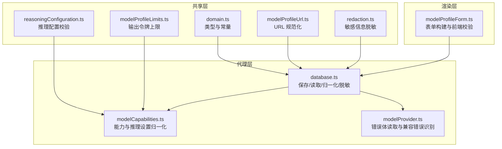
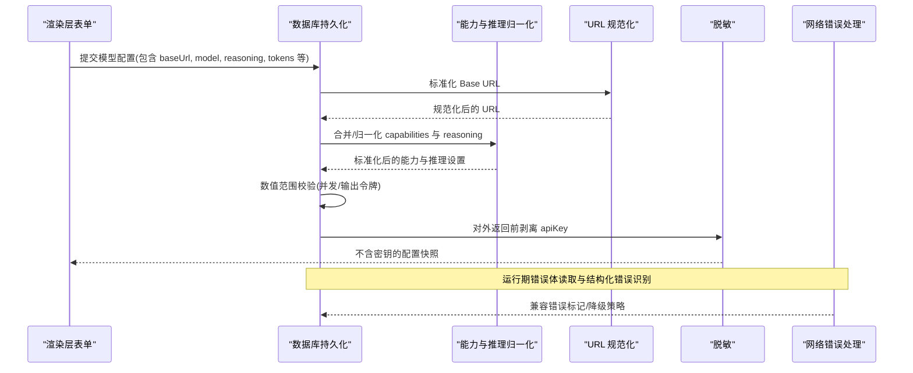
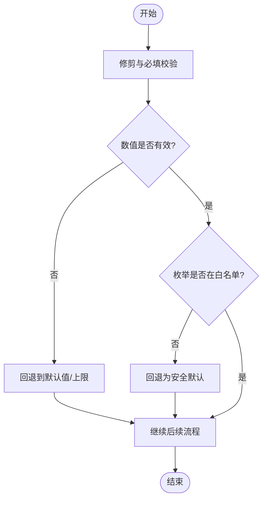
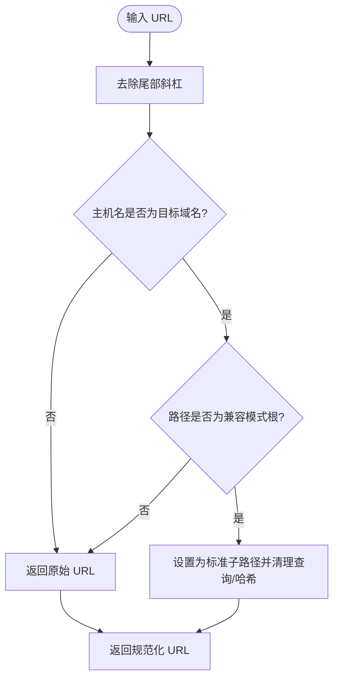
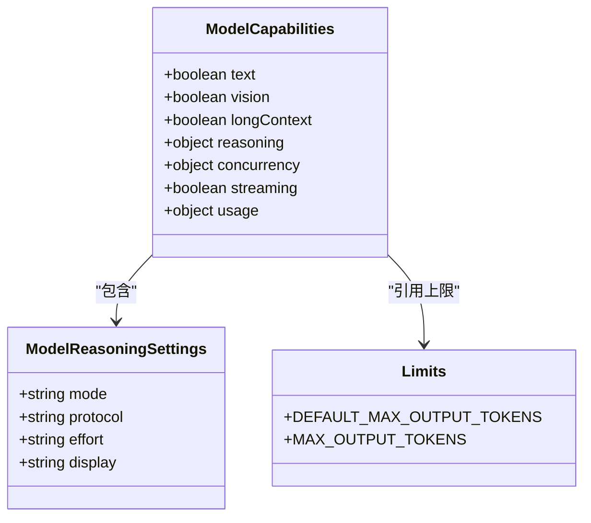
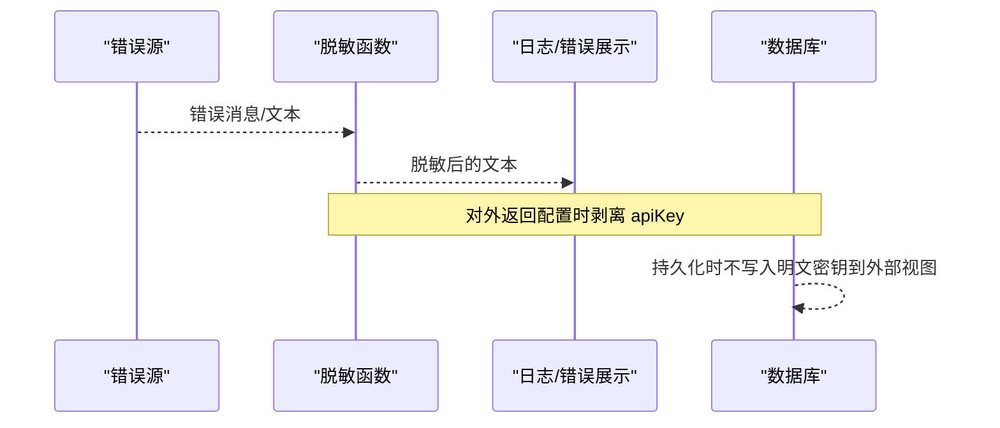
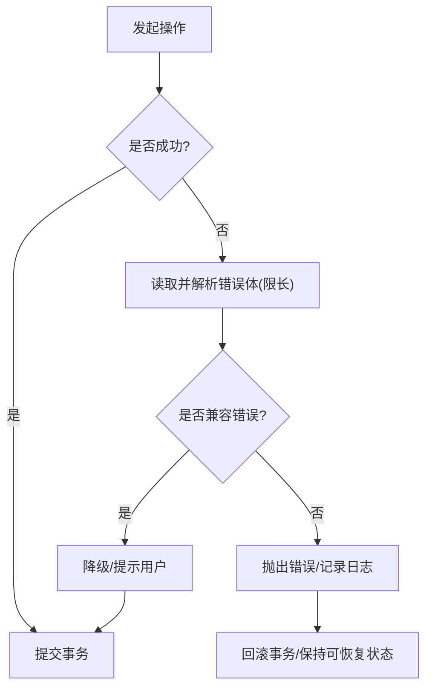
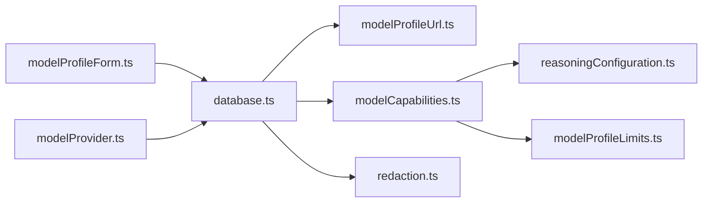

# 数据验证与清洗

<cite>
**本文引用的文件**
- [src/shared/redaction.ts](file://src/shared/redaction.ts)
- [src/agent/modelCapabilities.ts](file://src/agent/modelCapabilities.ts)
- [src/shared/modelProfileUrl.ts](file://src/shared/modelProfileUrl.ts)
- [src/shared/reasoningConfiguration.ts](file://src/shared/reasoningConfiguration.ts)
- [src/shared/domain.ts](file://src/shared/domain.ts)
- [src/shared/modelProfileLimits.ts](file://src/shared/modelProfileLimits.ts)
- [src/agent/database.ts](file://src/agent/database.ts)
- [src/renderer/modelProfileForm.ts](file://src/renderer/modelProfileForm.ts)
- [src/agent/modelProvider.ts](file://src/agent/modelProvider.ts)
- [tests/redaction.test.ts](file://tests/redaction.test.ts)
- [tests/e2e/app.spec.ts](file://tests/e2e/app.spec.ts)
</cite>

## 目录
1. [简介](#简介)
2. [项目结构](#项目结构)
3. [核心组件](#核心组件)
4. [架构总览](#架构总览)
5. [详细组件分析](#详细组件分析)
6. [依赖关系分析](#依赖关系分析)
7. [性能考虑](#性能考虑)
8. [故障排查指南](#故障排查指南)
9. [结论](#结论)
10. [附录](#附录)

## 简介
本文件系统性梳理本项目中的数据验证与清洗机制，覆盖输入校验（字符串修剪、数值范围检查、枚举值验证）、敏感数据处理与安全脱敏（尤其是 API Key 的存储与显示控制）、数据标准化（URL 规范化、能力声明归一化、推理设置处理）、错误处理策略与数据完整性保证，并提供数据质量检查与修复工具的使用指南以及备份恢复最佳实践。

## 项目结构
围绕数据验证与清洗的关键代码分布在以下模块：
- shared 层：通用类型定义、能力与推理配置、URL 规范化、脱敏工具
- agent 层：数据库持久化、模型能力与推理设置归一化、网络请求错误读取
- renderer 层：表单构建与前端校验
- tests 层：对脱敏、迁移、原子性等进行行为验证

图表来源
- [src/shared/domain.ts:130-192](file://src/shared/domain.ts#L130-L192)
- [src/shared/modelProfileUrl.ts:1-24](file://src/shared/modelProfileUrl.ts#L1-L24)
- [src/shared/reasoningConfiguration.ts:1-19](file://src/shared/reasoningConfiguration.ts#L1-L19)
- [src/shared/redaction.ts:1-112](file://src/shared/redaction.ts#L1-L112)
- [src/shared/modelProfileLimits.ts:1-3](file://src/shared/modelProfileLimits.ts#L1-L3)
- [src/agent/database.ts:540-621](file://src/agent/database.ts#L540-L621)
- [src/agent/modelCapabilities.ts:45-118](file://src/agent/modelCapabilities.ts#L45-L118)
- [src/agent/modelProvider.ts:924-964](file://src/agent/modelProvider.ts#L924-L964)
- [src/renderer/modelProfileForm.ts:139-176](file://src/renderer/modelProfileForm.ts#L139-L176)

章节来源
- [src/shared/domain.ts:130-192](file://src/shared/domain.ts#L130-L192)
- [src/agent/database.ts:540-621](file://src/agent/database.ts#L540-L621)
- [src/agent/modelCapabilities.ts:45-118](file://src/agent/modelCapabilities.ts#L45-L118)
- [src/renderer/modelProfileForm.ts:139-176](file://src/renderer/modelProfileForm.ts#L139-L176)

## 核心组件
- 输入校验与标准化
  - 字符串修剪与必填校验：在保存模型配置时，名称、模型标识等字段会进行修剪并强制非空。
  - URL 规范化：Base URL 会被修剪尾随斜杠并按协议兼容性规则标准化。
  - 数值范围检查：并发数限制与最大输出令牌数均被限制到能力上限或默认值。
  - 枚举值验证：推理模式、协议、显示模式等仅接受白名单值，非法值回退为安全默认。
- 敏感数据处理与安全脱敏
  - API Key 存储：仅在内部运行时对象中保留明文；对外暴露的 Profile 会剥离 apiKey。
  - 日志与错误脱敏：错误消息与文本内容在输出前进行多形式编码匹配替换，避免密钥泄露。
- 数据标准化
  - 能力声明归一化：合并新旧能力、过滤无效枚举、推导默认值。
  - 推理设置归一化：根据协议与能力约束，将 mode/protocol/display/effort 归一到合法集合。
- 错误处理与完整性
  - 网络错误体读取限长，结构化错误解析用于兼容判断。
  - 数据库事务与迁移确保一致性；失败时回滚或保持可恢复状态。

章节来源
- [src/agent/database.ts:540-621](file://src/agent/database.ts#L540-L621)
- [src/shared/modelProfileUrl.ts:1-24](file://src/shared/modelProfileUrl.ts#L1-L24)
- [src/agent/modelCapabilities.ts:45-118](file://src/agent/modelCapabilities.ts#L45-L118)
- [src/shared/reasoningConfiguration.ts:1-19](file://src/shared/reasoningConfiguration.ts#L1-L19)
- [src/shared/redaction.ts:1-112](file://src/shared/redaction.ts#L1-L112)
- [src/agent/modelProvider.ts:924-964](file://src/agent/modelProvider.ts#L924-L964)

## 架构总览
下图展示了从用户界面到持久化的数据流，以及在关键节点进行的验证、标准化与脱敏。

图表来源
- [src/renderer/modelProfileForm.ts:139-176](file://src/renderer/modelProfileForm.ts#L139-L176)
- [src/agent/database.ts:540-621](file://src/agent/database.ts#L540-L621)
- [src/agent/modelCapabilities.ts:45-118](file://src/agent/modelCapabilities.ts#L45-L118)
- [src/shared/modelProfileUrl.ts:1-24](file://src/shared/modelProfileUrl.ts#L1-L24)
- [src/shared/redaction.ts:1-112](file://src/shared/redaction.ts#L1-L112)
- [src/agent/modelProvider.ts:924-964](file://src/agent/modelProvider.ts#L924-L964)

## 详细组件分析

### 输入校验与字符串修剪
- 必填与修剪
  - 模型名称、模型标识、工作区路径等字段在保存前进行修剪与非空校验，防止空白或多余空格进入持久化。
- 数值范围
  - 并发数：基于能力中的默认/最大限制进行裁剪，确保至少为 1 且不超过上限。
  - 最大输出令牌：若输入非整数或小于 1，则回退到默认值；超过上限则截断至上限。
- 枚举值
  - 推理模式、协议、显示模式等仅接受白名单值，非法值将被回退为安全默认。

图表来源
- [src/agent/database.ts:540-621](file://src/agent/database.ts#L540-L621)
- [src/agent/modelCapabilities.ts:106-118](file://src/agent/modelCapabilities.ts#L106-L118)
- [src/shared/modelProfileLimits.ts:1-3](file://src/shared/modelProfileLimits.ts#L1-L3)

章节来源
- [src/agent/database.ts:540-621](file://src/agent/database.ts#L540-L621)
- [src/agent/modelCapabilities.ts:106-118](file://src/agent/modelCapabilities.ts#L106-L118)
- [src/shared/modelProfileLimits.ts:1-3](file://src/shared/modelProfileLimits.ts#L1-L3)

### URL 规范化
- 对 Base URL 进行修剪尾随斜杠，并在特定域名与路径下自动修正为标准兼容路径。
- 非目标域名或非目标路径直接原样返回，避免误改。

图表来源
- [src/shared/modelProfileUrl.ts:1-24](file://src/shared/modelProfileUrl.ts#L1-L24)

章节来源
- [src/shared/modelProfileUrl.ts:1-24](file://src/shared/modelProfileUrl.ts#L1-L24)

### 能力声明与推理设置归一化
- 能力声明
  - 合并现有与输入的能力，过滤无效枚举，推导默认值（如并发限制、流式支持、用量字段）。
- 推理设置
  - 根据协议与能力，将 mode/protocol/display/effort 归一到合法集合；当不支持推理时给出明确错误。
- 选择校验
  - 当启用推理且需要 effort 时，必须提供有效的 effort 选项，否则抛出错误。

图表来源
- [src/shared/domain.ts:130-192](file://src/shared/domain.ts#L130-L192)
- [src/agent/modelCapabilities.ts:45-118](file://src/agent/modelCapabilities.ts#L45-L118)
- [src/shared/modelProfileLimits.ts:1-3](file://src/shared/modelProfileLimits.ts#L1-L3)

章节来源
- [src/agent/modelCapabilities.ts:45-118](file://src/agent/modelCapabilities.ts#L45-L118)
- [src/shared/reasoningConfiguration.ts:1-19](file://src/shared/reasoningConfiguration.ts#L1-L19)
- [src/shared/domain.ts:130-192](file://src/shared/domain.ts#L130-L192)

### 敏感数据处理与安全脱敏
- 脱敏策略
  - 对错误消息与任意文本进行多形式编码匹配替换（包括 JSON 转义、百分号编码、表单编码），并匹配 Authorization/Bearer 头片段。
  - 通过长度排序优先替换较长片段，避免部分替换残留。
- API Key 存储与显示
  - 内部运行时对象保留 apiKey；对外暴露的 Profile 会剥离 apiKey，避免 UI 或日志泄露。
- 测试保障
  - 单元测试与端到端测试覆盖多种编码变体与错误落库场景，确保不会输出密钥片段。

图表来源
- [src/shared/redaction.ts:1-112](file://src/shared/redaction.ts#L1-L112)
- [src/agent/database.ts:620-621](file://src/agent/database.ts#L620-L621)
- [tests/redaction.test.ts:1-40](file://tests/redaction.test.ts#L1-L40)
- [tests/e2e/app.spec.ts:651-697](file://tests/e2e/app.spec.ts#L651-L697)

章节来源
- [src/shared/redaction.ts:1-112](file://src/shared/redaction.ts#L1-L112)
- [src/agent/database.ts:620-621](file://src/agent/database.ts#L620-L621)
- [tests/redaction.test.ts:1-40](file://tests/redaction.test.ts#L1-L40)
- [tests/e2e/app.spec.ts:651-697](file://tests/e2e/app.spec.ts#L651-L697)

### 错误处理策略与数据完整性保证
- 网络错误体读取
  - 流式读取错误体并限制最大字节数，避免内存占用过大；结构化错误解析用于兼容判断与降级。
- 数据库事务与迁移
  - 使用事务保证保存/更新操作的原子性；迁移脚本确保历史数据结构一致性与可升级性。
- 失败回滚
  - 审批结算失败等场景下，相关变更整体回滚，保持系统一致性。

图表来源
- [src/agent/modelProvider.ts:924-964](file://src/agent/modelProvider.ts#L924-L964)
- [src/agent/database.ts:731-739](file://src/agent/database.ts#L731-L739)

章节来源
- [src/agent/modelProvider.ts:924-964](file://src/agent/modelProvider.ts#L924-L964)
- [src/agent/database.ts:731-739](file://src/agent/database.ts#L731-L739)

### 数据质量检查与修复工具使用指南
- 表单侧检查
  - 在渲染层构建输入前，先进行基础校验（如最大输出令牌范围、推理配置合法性），阻止无效数据进入后端。
- 后端归一化
  - 所有进入持久化的数据都会再次归一化与校验，确保即使绕过前端也能得到一致结果。
- 迁移修复
  - 启动时执行迁移，修复历史遗留数据（例如占位符修复、字段补齐），并通过测试覆盖不同版本升级路径。

章节来源
- [src/renderer/modelProfileForm.ts:139-176](file://src/renderer/modelProfileForm.ts#L139-L176)
- [src/agent/database.ts:540-621](file://src/agent/database.ts#L540-L621)

### 数据备份与恢复最佳实践
- 备份
  - 定期备份 SQLite 数据库文件；确保备份期间无写操作或采用 WAL 模式的稳定快照。
- 恢复
  - 恢复后重启应用以触发迁移与一致性检查；必要时先回滚到已知良好版本再执行迁移。
- 验证
  - 恢复后运行最小集测试（连接测试、读取默认配置）确认数据可用。

[本节为通用指导，不直接分析具体文件]

## 依赖关系分析
- 耦合与内聚
  - database.ts 作为中心枢纽，依赖 URL 规范化、能力归一化、脱敏工具，形成高内聚的数据入口。
  - modelCapabilities.ts 与 reasoningConfiguration.ts 解耦了能力与推理配置的规则，便于扩展。
- 外部依赖
  - 网络层错误处理与 Provider 错误码/参数解析，影响降级与用户体验。
- 循环依赖
  - 当前实现未见循环导入；各模块职责清晰，依赖方向单向。

图表来源
- [src/agent/database.ts:540-621](file://src/agent/database.ts#L540-L621)
- [src/agent/modelCapabilities.ts:45-118](file://src/agent/modelCapabilities.ts#L45-L118)
- [src/shared/modelProfileUrl.ts:1-24](file://src/shared/modelProfileUrl.ts#L1-L24)
- [src/shared/reasoningConfiguration.ts:1-19](file://src/shared/reasoningConfiguration.ts#L1-L19)
- [src/shared/modelProfileLimits.ts:1-3](file://src/shared/modelProfileLimits.ts#L1-L3)
- [src/renderer/modelProfileForm.ts:139-176](file://src/renderer/modelProfileForm.ts#L139-L176)
- [src/agent/modelProvider.ts:924-964](file://src/agent/modelProvider.ts#L924-L964)

章节来源
- [src/agent/database.ts:540-621](file://src/agent/database.ts#L540-L621)
- [src/agent/modelCapabilities.ts:45-118](file://src/agent/modelCapabilities.ts#L45-L118)

## 性能考虑
- 脱敏正则与编码变体数量较多，建议仅在必要路径（错误消息、日志、对外响应）调用，避免高频大文本处理。
- URL 规范化仅在 Base URL 变化时执行，减少重复计算。
- 能力与推理归一化尽量复用已有默认值与上限，避免复杂分支。

[本节为通用指导，不直接分析具体文件]

## 故障排查指南
- 常见问题
  - 推理配置不合法：检查 inputMode/protocol/mode 组合是否符合约束；查看推理配置问题定位。
  - 最大输出令牌越界：确认输入为整数且在允许范围内；超出上限会被截断。
  - API Key 泄露：确认对外返回的 Profile 不包含 apiKey；检查错误消息是否经脱敏。
- 定位步骤
  - 查看表单侧校验结果与错误提示。
  - 检查后端保存时的归一化结果与脱敏输出。
  - 核对网络错误体是否被正确解析与降级。

章节来源
- [src/shared/reasoningConfiguration.ts:1-19](file://src/shared/reasoningConfiguration.ts#L1-L19)
- [src/agent/modelCapabilities.ts:106-118](file://src/agent/modelCapabilities.ts#L106-L118)
- [src/shared/redaction.ts:1-112](file://src/shared/redaction.ts#L1-L112)
- [src/agent/modelProvider.ts:924-964](file://src/agent/modelProvider.ts#L924-L964)

## 结论
本项目在数据验证与清洗方面形成了“前端校验 + 后端归一化 + 脱敏保护”的多层防护体系。通过严格的枚举白名单、数值范围限制、URL 标准化与敏感信息脱敏，确保了数据的一致性与安全性。结合事务与迁移机制，系统在历史数据兼容与升级过程中保持了良好的完整性与可恢复性。

## 附录
- 关键常量与类型
  - 最大输出令牌默认值与上限：见模型配置限制。
  - 推理模式/协议/显示模式：见领域类型定义。
- 参考实现路径
  - 表单构建与校验：参见渲染层表单模块。
  - 保存与归一化：参见数据库持久化模块。
  - 脱敏与错误处理：参见共享脱敏与代理网络错误处理模块。

[本节为补充说明，不直接分析具体文件]