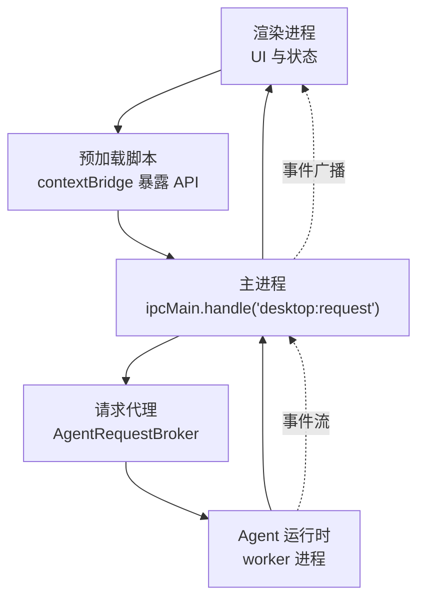
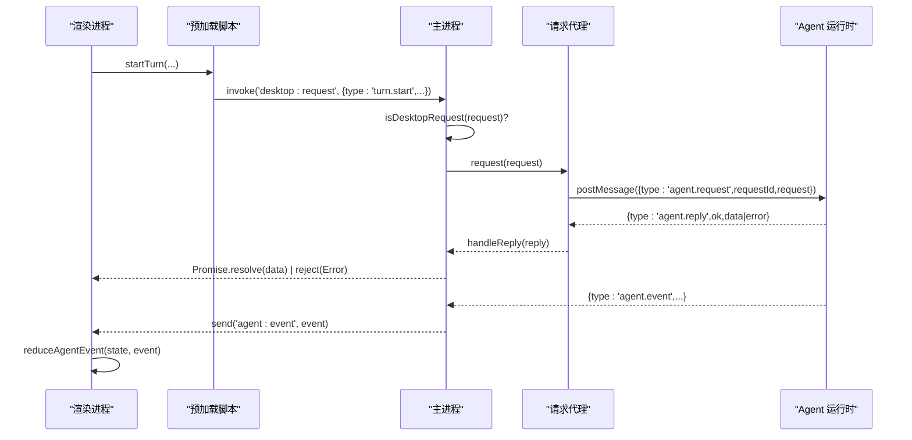
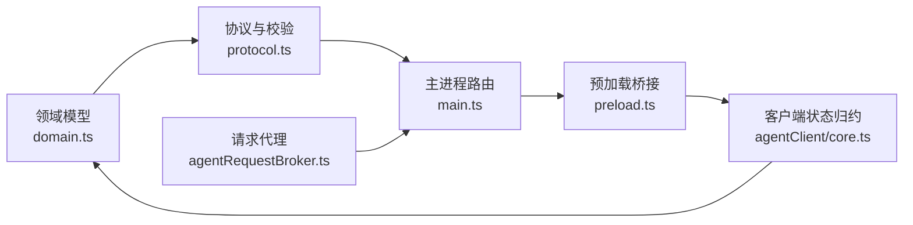

# IPC 协议定义

<cite>
**本文引用的文件**
- [src/shared/protocol.ts](file://src/shared/protocol.ts)
- [src/shared/domain.ts](file://src/shared/domain.ts)
- [src/preload.ts](file://src/preload.ts)
- [src/main.ts](file://src/main.ts)
- [src/main/agentRequestBroker.ts](file://src/main/agentRequestBroker.ts)
- [src/agentClient/core.ts](file://src/agentClient/core.ts)
- [tests/protocol.test.ts](file://tests/protocol.test.ts)
</cite>

## 目录
1. [简介](#简介)
2. [项目结构](#项目结构)
3. [核心组件](#核心组件)
4. [架构总览](#架构总览)
5. [详细组件分析](#详细组件分析)
6. [依赖关系分析](#依赖关系分析)
7. [性能与可靠性](#性能与可靠性)
8. [故障排查指南](#故障排查指南)
9. [结论](#结论)
10. [附录：类型与校验参考](#附录类型与校验参考)

## 简介
本文件为 Private AI Desktop 的 IPC 协议技术文档，聚焦于桌面端请求（DesktopRequest）与代理事件（AgentEvent）的设计、消息格式规范、参数验证、响应结构与错误处理。文档覆盖会话管理、对话控制、模型配置等请求类型，并详细说明序列化的代理事件机制（如 turn.queued、message.delta、answer.delta 等实时事件）。同时提供 TypeScript 类型定义与校验函数的使用指引，以及协议版本兼容性与向后兼容策略建议。

## 项目结构
IPC 协议在 Electron 应用中通过三层协作完成：
- 渲染进程（Renderer）通过 preload 暴露的 API 发送请求，订阅事件。
- 主进程（Main）接收请求，进行协议校验后转发给 Agent 运行时；将事件回推至渲染进程。
- Agent 运行时（Worker）执行具体业务逻辑，返回响应或推送事件。

图表来源
- [src/preload.ts:5-35](file://src/preload.ts#L5-L35)
- [src/main.ts:98-144](file://src/main.ts#L98-L144)
- [src/main/agentRequestBroker.ts:15-85](file://src/main/agentRequestBroker.ts#L15-L85)

章节来源
- [src/preload.ts:5-35](file://src/preload.ts#L5-L35)
- [src/main.ts:98-144](file://src/main.ts#L98-L144)
- [src/main/agentRequestBroker.ts:15-85](file://src/main/agentRequestBroker.ts#L15-L85)

## 核心组件
- 协议类型与校验：定义桌面请求与代理事件的联合类型，并提供严格的运行时校验函数。
- 请求代理：封装异步请求-响应的生命周期管理，包括超时、重连清理与错误传播。
- 客户端状态归约：基于事件流维护应用快照与运行态，支持增量更新与去重。
- 预加载桥接：将 IPC 调用封装为类型安全的 API，屏蔽底层通道细节。

章节来源
- [src/shared/protocol.ts:22-66](file://src/shared/protocol.ts#L22-L66)
- [src/main/agentRequestBroker.ts:15-85](file://src/main/agentRequestBroker.ts#L15-L85)
- [src/agentClient/core.ts:56-175](file://src/agentClient/core.ts#L56-L175)
- [src/preload.ts:5-35](file://src/preload.ts#L5-L35)

## 架构总览
IPC 通信采用“请求-响应 + 事件流”的双通道模式：
- 请求-响应：渲染进程通过 ipcRenderer.invoke('desktop:request', request) 发起操作，主进程校验后交由 Agent 运行时处理，返回统一格式的响应。
- 事件流：Agent 运行时通过 'agent:event' 推送序列化事件，主进程转发到渲染进程，客户端按 sequence 顺序归约状态。

图表来源
- [src/preload.ts:15-16](file://src/preload.ts#L15-L16)
- [src/main.ts:103-108](file://src/main.ts#L103-L108)
- [src/main/agentRequestBroker.ts:33-63](file://src/main/agentRequestBroker.ts#L33-L63)
- [src/main.ts:135-144](file://src/main.ts#L135-L144)
- [src/agentClient/core.ts:56-175](file://src/agentClient/core.ts#L56-L175)

## 详细组件分析

### 桌面请求（DesktopRequest）
- 设计目标：以强类型联合描述所有可被调用的桌面端操作，确保每个请求携带必要字段且值域合法。
- 支持的请求类型（节选）：
  - 会话管理：group.create、group.delete、thread.create、thread.delete、thread.setModel
  - 对话控制：turn.start、turn.cancel、approval.respond
  - 模型配置：modelProfile.save、modelProfile.delete、modelProfile.test
  - 设置与界面：settings.update、language.set、theme.set
  - 工作区：workspace.register、workspace.delete
  - 快照：snapshot.get
- 参数验证规则（示例）：
  - thread.create：title 必填字符串，groupId 可选字符串
  - turn.start：threadId、text 必填；modelProfileId 可选；attachments 可选数组，每项需满足 TurnAttachment 约束
  - modelProfile.save/test：profile 必须满足 ModelProfileInput 及能力/推理配置校验
  - settings.update：showModelMetrics 布尔；contextMessageLimit 整数范围[1,200]；reasoningDisplayMode 枚举
  - language.set：语言仅支持 zh-CN 或 en-US
  - theme.set：主题仅支持 system/light/dark
- 校验入口：isDesktopRequest(value) 对 type 分支逐一校验字段存在性、类型与取值范围。

章节来源
- [src/shared/protocol.ts:22-39](file://src/shared/protocol.ts#L22-L39)
- [src/shared/protocol.ts:274-316](file://src/shared/protocol.ts#L274-L316)
- [src/shared/domain.ts:87-128](file://src/shared/domain.ts#L87-L128)
- [tests/protocol.test.ts:4-89](file://tests/protocol.test.ts#L4-L89)

### 代理事件（AgentEvent）与序列化
- 事件分类：
  - 快照事件：{type:'snapshot', snapshot}
  - 有序事件（SequencedAgentEvent）：包含 threadId、turnId、modelProfileId、sequence，用于保证同一 turn 的事件顺序与幂等处理
- 实时事件（节选）：
  - turn.queued：队列位置 queuePosition
  - turn.started：标题 title
  - message.delta / answer.delta：文本增量 text
  - reasoning.raw.delta / reasoning.summary.delta：推理内容增量 text
  - model.progress：阶段 phase（connecting/compressing/reasoning/answering）
  - tool.started / tool.output：工具调用状态与输出
  - model.metrics：指标 metrics（durationMs、tokensPerSecond、speedSource、usageSource 等）
  - approval.required：需要审批的请求
  - turn.cancelling / turn.completed / turn.failed / turn.cancelled：终态事件
- 序列化与排序：
  - 每个有序事件包含 sequence（非负整数），客户端依据 lastSequenceByTurn 去重与排序
  - 快照事件作为基线，后续事件增量更新状态
- 校验入口：isAgentEvent(value) 对 type 分支校验字段与值域

章节来源
- [src/shared/protocol.ts:41-66](file://src/shared/protocol.ts#L41-L66)
- [src/shared/protocol.ts:318-370](file://src/shared/protocol.ts#L318-L370)
- [tests/protocol.test.ts:275-353](file://tests/protocol.test.ts#L275-L353)

### 请求-响应流程与错误处理
- 请求代理（AgentRequestBroker）：
  - 为每次请求生成唯一 requestId，维护 pending Map
  - 发送 agent.request，等待 agent.reply
  - 超时自动拒绝，断开连接时批量拒绝挂起请求
- 主进程路由：
  - 校验请求合法性，非法直接抛错
  - 转发到 Agent 运行时，接收 reply 后解析并返回
  - 事件通过 'agent:event' 广播
- 错误语义：
  - 请求侧：无效请求、运行时未就绪、超时
  - 响应侧：ok=false 时携带 error 字符串
  - 事件侧：turn.failed 携带错误信息

章节来源
- [src/main/agentRequestBroker.ts:15-85](file://src/main/agentRequestBroker.ts#L15-L85)
- [src/main.ts:103-108](file://src/main.ts#L103-L108)
- [src/main.ts:135-144](file://src/main.ts#L135-L144)
- [src/main.ts:158-169](file://src/main.ts#L158-L169)

### 客户端状态归约与增量更新
- reduceAgentEvent：
  - 处理 snapshot 事件重建基线
  - 对有序事件按 sequence 去重，更新 runtimeByThread、currentTurnByThread、supersededTurns
  - 对 message.delta / answer.delta / reasoning.*.delta 合并文本增量，标记 incomplete
  - 对 approval.required 创建待审批项，终态事件清理
- 运行时状态机：
  - 状态流转：idle -> queued -> running -> (completed|failed|cancelled|interrupted)
  - 单调性：终态不可逆，cancelling 优先于 running
- 快照合并：
  - 根据 turns 与 events 计算最终状态，处理 approvals 与 items 的增量合并

章节来源
- [src/agentClient/core.ts:56-175](file://src/agentClient/core.ts#L56-L175)
- [src/agentClient/core.ts:294-381](file://src/agentClient/core.ts#L294-L381)
- [src/agentClient/core.ts:547-561](file://src/agentClient/core.ts#L547-L561)
- [src/agentClient/core.ts:687-708](file://src/agentClient/core.ts#L687-L708)

### 预加载桥接与类型安全
- 暴露 API：
  - getSnapshot、createGroup、deleteGroup、createThread、deleteThread、setThreadModel、startTurn、cancelTurn、respondApproval、setLanguage、updateSettings、saveModelProfile、deleteModelProfile、testModelProfile、registerWorkspace、deleteWorkspace
  - subscribe(listener)：订阅 'agent:event' 事件
- 类型约束：
  - 所有方法参数与返回值均受 domain.ts 与 protocol.ts 类型保护
  - 附件类型 TurnAttachment 在 startTurn 中支持图片上传

章节来源
- [src/preload.ts:5-35](file://src/preload.ts#L5-L35)
- [src/shared/domain.ts:43-49](file://src/shared/domain.ts#L43-L49)

## 依赖关系分析
- 协议层（protocol.ts）依赖领域模型（domain.ts）中的类型，提供请求与事件的严格校验。
- 主进程（main.ts）依赖请求代理（agentRequestBroker.ts）实现请求-响应生命周期。
- 渲染进程通过预加载脚本（preload.ts）调用 IPC，事件经主进程广播到客户端。
- 客户端状态归约（agentClient/core.ts）依赖事件类型与领域模型，维护 UI 所需的状态投影。

图表来源
- [src/shared/domain.ts:1-319](file://src/shared/domain.ts#L1-L319)
- [src/shared/protocol.ts:22-66](file://src/shared/protocol.ts#L22-L66)
- [src/main.ts:98-144](file://src/main.ts#L98-L144)
- [src/main/agentRequestBroker.ts:15-85](file://src/main/agentRequestBroker.ts#L15-L85)
- [src/preload.ts:5-35](file://src/preload.ts#L5-L35)
- [src/agentClient/core.ts:56-175](file://src/agentClient/core.ts#L56-L175)

章节来源
- [src/shared/domain.ts:1-319](file://src/shared/domain.ts#L1-L319)
- [src/shared/protocol.ts:22-66](file://src/shared/protocol.ts#L22-L66)
- [src/main.ts:98-144](file://src/main.ts#L98-L144)
- [src/main/agentRequestBroker.ts:15-85](file://src/main/agentRequestBroker.ts#L15-L85)
- [src/preload.ts:5-35](file://src/preload.ts#L5-L35)
- [src/agentClient/core.ts:56-175](file://src/agentClient/core.ts#L56-L175)

## 性能与可靠性
- 事件顺序与幂等：
  - 通过 sequence 与 lastSequenceByTurn 保证同 turn 事件顺序与去重
  - 快照事件作为基线，避免重复重建
- 内存与吞吐：
  - 增量合并文本（applyTextDeltaToSnapshot）减少对象创建
  - 运行时状态单调性减少状态抖动
- 超时与断连：
  - AgentRequestBroker 提供超时与断连清理，防止悬挂请求
- 建议：
  - 合理设置 deadlineMs，避免过长导致资源占用
  - 对大附件（TurnAttachment）限制 size，避免阻塞事件流

[本节为通用指导，不直接分析具体文件]

## 故障排查指南
- 常见错误定位：
  - 无效请求：检查 isDesktopRequest 分支与字段校验
  - 运行时未就绪：确认 Agent 进程已启动且端口可用
  - 超时：增大 deadlineMs 或优化后端处理
  - 事件乱序：检查 sequence 与 lastSequenceByTurn 逻辑
- 调试步骤：
  - 在主进程打印收到的 request 与 reply
  - 在渲染进程订阅事件并记录 sequence
  - 使用测试用例（protocol.test.ts）验证边界条件

章节来源
- [src/main.ts:103-108](file://src/main.ts#L103-L108)
- [src/main/agentRequestBroker.ts:33-63](file://src/main/agentRequestBroker.ts#L33-L63)
- [tests/protocol.test.ts:4-89](file://tests/protocol.test.ts#L4-L89)

## 结论
本 IPC 协议通过强类型与严格校验保障跨进程通信的安全性与一致性；请求-响应与事件流双通道满足即时交互与长时任务需求；客户端状态归约确保 UI 一致性与高性能。建议在生产环境中结合监控与日志完善错误追踪，并持续扩展协议以适配新能力。

[本节为总结，不直接分析具体文件]

## 附录：类型与校验参考
- 桌面请求类型定义路径：[DesktopRequest:22-39](file://src/shared/protocol.ts#L22-L39)
- 代理事件类型定义路径：[AgentEvent, SequencedAgentEvent:41-66](file://src/shared/protocol.ts#L41-L66)
- 领域模型类型路径：[Domain Types:1-319](file://src/shared/domain.ts#L1-L319)
- 请求校验函数路径：[isDesktopRequest:274-316](file://src/shared/protocol.ts#L274-L316)
- 事件校验函数路径：[isAgentEvent:318-370](file://src/shared/protocol.ts#L318-L370)
- 预加载 API 路径：[Preload Bridge:5-35](file://src/preload.ts#L5-L35)
- 请求代理实现路径：[AgentRequestBroker:15-85](file://src/main/agentRequestBroker.ts#L15-L85)
- 客户端状态归约路径：[reduceAgentEvent:56-175](file://src/agentClient/core.ts#L56-L175)
- 协议测试用例路径：[Protocol Tests:1-354](file://tests/protocol.test.ts#L1-L354)

章节来源
- [src/shared/protocol.ts:22-66](file://src/shared/protocol.ts#L22-L66)
- [src/shared/domain.ts:1-319](file://src/shared/domain.ts#L1-L319)
- [src/preload.ts:5-35](file://src/preload.ts#L5-L35)
- [src/main/agentRequestBroker.ts:15-85](file://src/main/agentRequestBroker.ts#L15-L85)
- [src/agentClient/core.ts:56-175](file://src/agentClient/core.ts#L56-L175)
- [tests/protocol.test.ts:1-354](file://tests/protocol.test.ts#L1-L354)