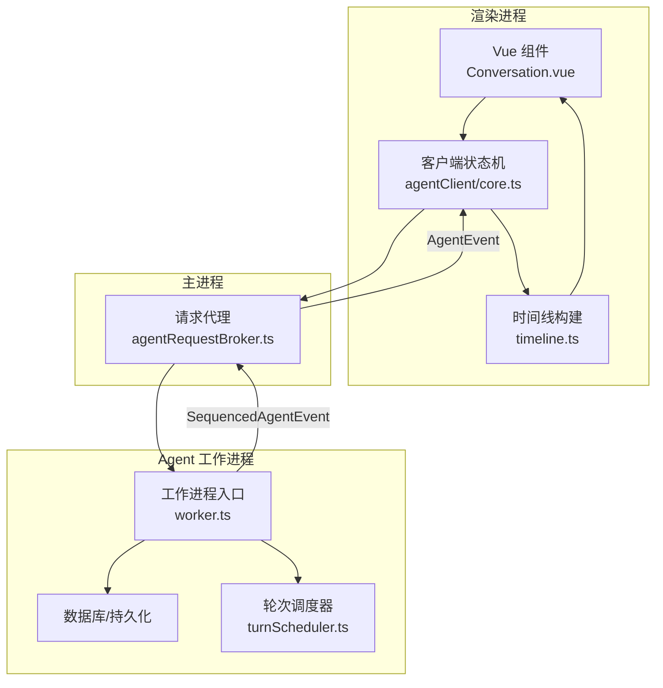
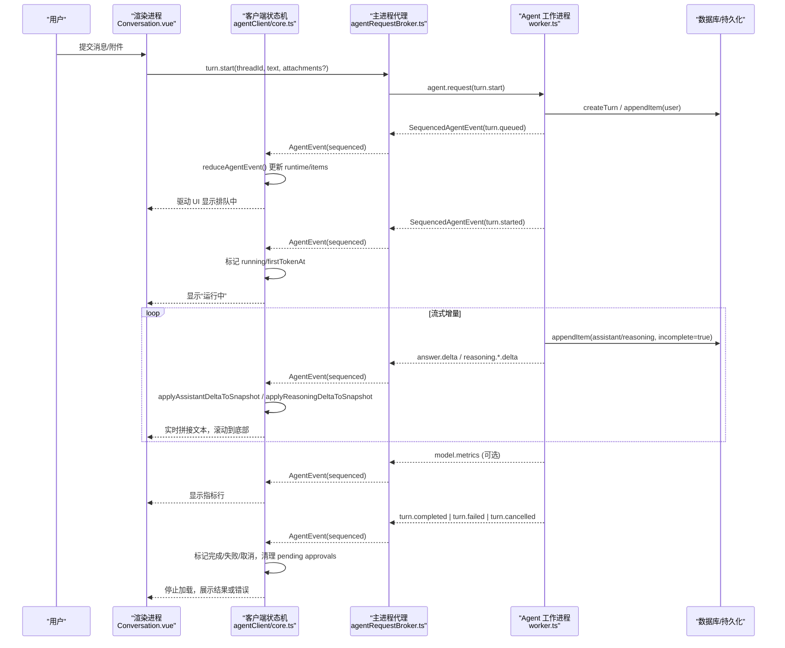
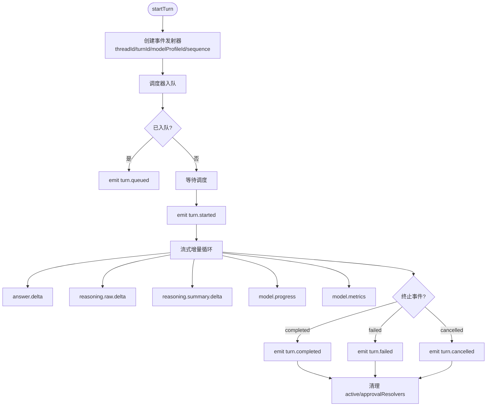
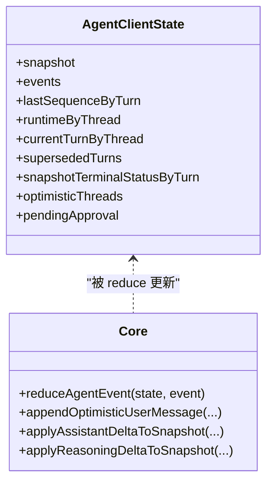
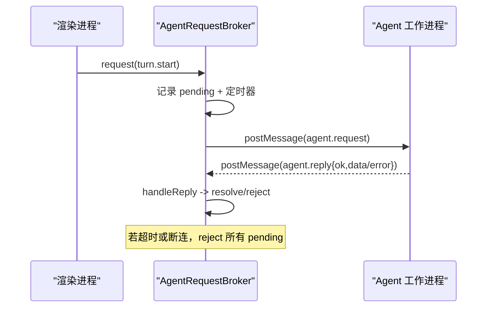
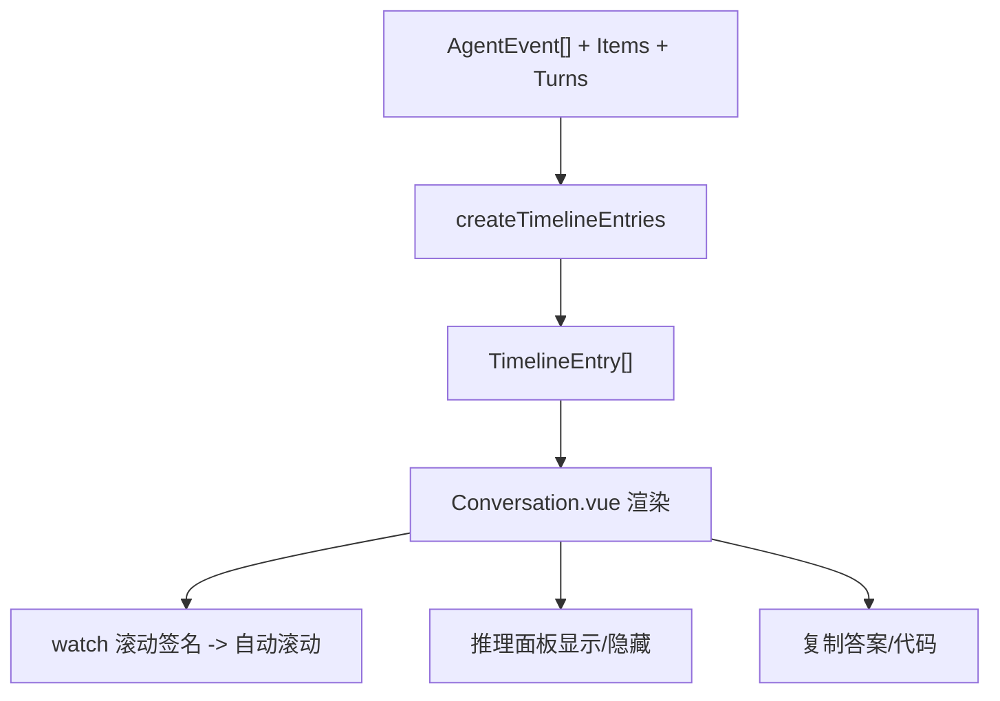
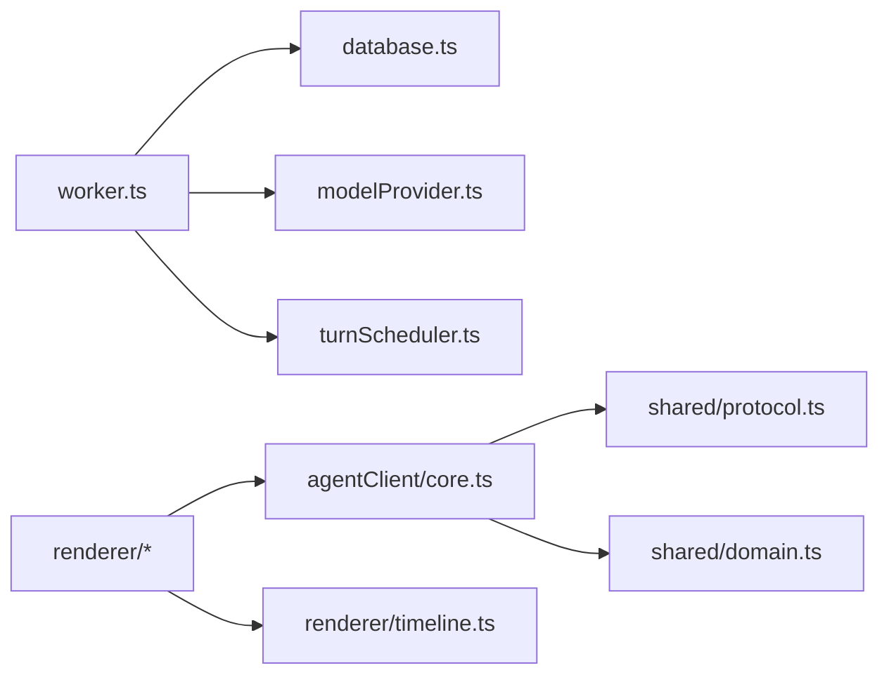

# 事件处理系统

<cite>
**本文引用的文件**
- [worker.ts](file://src/agent/worker.ts)
- [protocol.ts](file://src/shared/protocol.ts)
- [domain.ts](file://src/shared/domain.ts)
- [core.ts](file://src/agentClient/core.ts)
- [agUiAdapter.ts](file://src/agentClient/agUiAdapter.ts)
- [agentRequestBroker.ts](file://src/main/agentRequestBroker.ts)
- [Conversation.vue](file://src/renderer/components/Conversation.vue)
- [timeline.ts](file://src/renderer/timeline.ts)
- [modelControls.ts](file://src/renderer/modelControls.ts)
</cite>

## 目录
1. [简介](#简介)
2. [项目结构](#项目结构)
3. [核心组件](#核心组件)
4. [架构总览](#架构总览)
5. [详细组件分析](#详细组件分析)
6. [依赖关系分析](#依赖关系分析)
7. [性能考虑](#性能考虑)
8. [故障排查指南](#故障排查指南)
9. [结论](#结论)
10. [附录](#附录)

## 简介
本技术文档围绕 Private AI Desktop 的事件处理系统，系统性说明 Agent 工作进程如何生成并发送事件到渲染进程，重点覆盖流式增量事件的序列化与传输、事件生命周期（从 turn.started 到 turn.completed）、渲染端接收与 UI 实时更新、事件去重与顺序保证、错误恢复机制，以及性能优化与内存管理策略。读者可据此理解端到端的“请求—调度—执行—事件—UI”全链路。

## 项目结构
- Agent 工作进程：负责任务调度、模型调用、事件生成与持久化、向主进程/渲染进程投递事件。
- 共享协议与领域模型：定义跨进程通信的消息类型、事件类型、领域数据结构。
- 客户端状态机（Agent Client）：在渲染侧维护应用快照与运行时状态，按序列号对事件进行归约，驱动 UI。
- 主进程代理：封装与 Agent 的 RPC 请求/响应，提供超时与断连处理。
- 渲染层：将事件与快照转换为时间线条目，实现实时滚动、复制、推理面板等交互。

**图表来源**
- [worker.ts:115-128](file://src/agent/worker.ts#L115-L128)
- [protocol.ts:22-65](file://src/shared/protocol.ts#L22-L65)
- [core.ts:56-175](file://src/agentClient/core.ts#L56-L175)
- [agentRequestBroker.ts:15-85](file://src/main/agentRequestBroker.ts#L15-L85)
- [Conversation.vue:31-55](file://src/renderer/components/Conversation.vue#L31-L55)
- [timeline.ts:41-170](file://src/renderer/timeline.ts#L41-L170)

**章节来源**
- [worker.ts:115-128](file://src/agent/worker.ts#L115-L128)
- [protocol.ts:22-65](file://src/shared/protocol.ts#L22-L65)
- [core.ts:56-175](file://src/agentClient/core.ts#L56-L175)
- [agentRequestBroker.ts:15-85](file://src/main/agentRequestBroker.ts#L15-L85)
- [Conversation.vue:31-55](file://src/renderer/components/Conversation.vue#L31-L55)
- [timeline.ts:41-170](file://src/renderer/timeline.ts#L41-L170)

## 核心组件
- 事件协议与类型：统一描述桌面端请求与 Agent 事件，包含线程/轮次/序列号信封，确保事件归属与排序。
- 工作进程事件发射器：为每个 turn 创建有序、幂等的 sink，自动追加 threadId/turnId/modelProfileId/sequence，并串行投递。
- 轮次调度器：按模型配置并发度编排 turn 的入队、开始、取消、队列位置更新。
- 客户端状态机：基于 reduce 函数对 snapshot 与 sequenced events 做幂等合并，维护 items、runtimeByThread、currentTurnByThread、supersededTurns 等索引。
- 主进程请求代理：封装 agent.request/agent.reply，支持超时、断连清理。
- 渲染时间线：将 items + events + turns 组合成用户可见的时间线条目，支持进度、工具调用、指标展示。

**章节来源**
- [protocol.ts:22-65](file://src/shared/protocol.ts#L22-L65)
- [worker.ts:132-157](file://src/agent/worker.ts#L132-L157)
- [core.ts:56-175](file://src/agentClient/core.ts#L56-L175)
- [agentRequestBroker.ts:15-85](file://src/main/agentRequestBroker.ts#L15-L85)
- [timeline.ts:41-170](file://src/renderer/timeline.ts#L41-L170)

## 架构总览
下图展示了从用户输入到 UI 更新的完整事件流，包括流式增量事件（answer.delta、reasoning.raw.delta、reasoning.summary.delta）和生命周期事件（turn.queued/started/cancelling/completed/failed/cancelled）。

**图表来源**
- [worker.ts:174-309](file://src/agent/worker.ts#L174-L309)
- [worker.ts:481-491](file://src/agent/worker.ts#L481-L491)
- [core.ts:56-175](file://src/agentClient/core.ts#L56-L175)
- [timeline.ts:60-170](file://src/renderer/timeline.ts#L60-L170)
- [agentRequestBroker.ts:33-63](file://src/main/agentRequestBroker.ts#L33-L63)

## 详细组件分析

### 工作进程事件生成与序列化
- 事件信封：每个 SequencedAgentEvent 都携带 threadId、turnId、modelProfileId、sequence，用于归属与排序。
- 顺序保证：createTurnEventEmitter 使用 tail Promise 链串行投递，避免并发乱序；遇到终止负载后不再继续追加。
- 持久化：persistStreamEvent 根据事件类型写入数据库（message.delta/answer.delta 写入 assistant 消息，reasoning.*.delta 写入推理项），并设置 incomplete=true 直到 turn 结束。
- 生命周期：
  - turn.queued：调度器回调触发，记录队列位置。
  - turn.started：进入运行态，记录 startedAt。
  - 流式增量：answer.delta、reasoning.raw.delta、reasoning.summary.delta 持续推送。
  - model.progress：连接/压缩/推理/回答阶段切换。
  - tool.started/tool.output：工具调用过程可视化。
  - model.metrics：最终指标上报。
  - turn.cancelling/turn.cancelled/turn.completed/turn.failed：终止态。

**图表来源**
- [worker.ts:132-157](file://src/agent/worker.ts#L132-L157)
- [worker.ts:174-309](file://src/agent/worker.ts#L174-L309)
- [worker.ts:481-491](file://src/agent/worker.ts#L481-L491)

**章节来源**
- [worker.ts:132-157](file://src/agent/worker.ts#L132-L157)
- [worker.ts:174-309](file://src/agent/worker.ts#L174-L309)
- [worker.ts:481-491](file://src/agent/worker.ts#L481-L491)

### 客户端状态机与事件归约
- 去重与顺序：reduceAgentEvent 通过 lastSequenceByTurn[threadId:turnId] 丢弃重复或旧序列事件，确保幂等与顺序。
- 快照合并：收到 snapshot 时重建 items、turns、approvals，并结合 live 事件修正未完成项的 incomplete 标志。
- 流式增量合并：applyAssistantDeltaToSnapshot 与 applyReasoningDeltaToSnapshot 将增量文本追加到对应逻辑 item，保持 live 标识以便 UI 区分。
- 运行时投影：reduceCurrentRuntime 维护每条线程的当前 turn、状态迁移（queued→running→completed/failed/cancelled），以及 firstTokenAt、tokensPerSecond 等指标。
- 终止事件处理：对 turn.completed/failed/cancelled 清理 pending approval，标记内容不完整为 false，并更新终端状态索引。

**图表来源**
- [core.ts:14-26](file://src/agentClient/core.ts#L14-L26)
- [core.ts:56-175](file://src/agentClient/core.ts#L56-L175)
- [core.ts:208-277](file://src/agentClient/core.ts#L208-L277)
- [core.ts:294-381](file://src/agentClient/core.ts#L294-L381)

**章节来源**
- [core.ts:56-175](file://src/agentClient/core.ts#L56-L175)
- [core.ts:208-277](file://src/agentClient/core.ts#L208-L277)
- [core.ts:294-381](file://src/agentClient/core.ts#L294-L381)

### 主进程请求代理
- 请求/响应：request 生成 requestId，postMessage 到 Agent，挂起 Promise；handleReply 匹配并 resolve/reject。
- 超时与断连：超时定时器拒绝未完成的请求；disconnect 清空所有 pending 请求并报错。
- 健壮性：端口替换时断开旧端口，防止悬挂请求。

**图表来源**
- [agentRequestBroker.ts:33-63](file://src/main/agentRequestBroker.ts#L33-L63)
- [agentRequestBroker.ts:65-85](file://src/main/agentRequestBroker.ts#L65-L85)

**章节来源**
- [agentRequestBroker.ts:33-63](file://src/main/agentRequestBroker.ts#L33-L63)
- [agentRequestBroker.ts:65-85](file://src/main/agentRequestBroker.ts#L65-L85)

### 渲染进程 UI 更新与交互
- 时间线构建：createTimelineEntries 将 items、events、turns 组合为 TimelineEntry，支持 message、reasoning、tool、metrics、progress 等条目。
- 实时滚动：Conversation.vue 监听 scrollSignature 变化，自动滚动到底部；支持“跳到底部”提示。
- 推理面板：根据偏好与运行状态决定是否显示推理面板，支持 raw/summary 模式选择。
- 交互：复制答案/代码、选择模型、切换推理模式、取消/停止运行。

**图表来源**
- [timeline.ts:41-170](file://src/renderer/timeline.ts#L41-L170)
- [Conversation.vue:301-327](file://src/renderer/components/Conversation.vue#L301-L327)
- [modelControls.ts:42-65](file://src/renderer/modelControls.ts#L42-L65)

**章节来源**
- [timeline.ts:41-170](file://src/renderer/timeline.ts#L41-L170)
- [Conversation.vue:301-327](file://src/renderer/components/Conversation.vue#L301-L327)
- [modelControls.ts:42-65](file://src/renderer/modelControls.ts#L42-L65)

### 事件类型与生命周期
- 生命周期事件：turn.queued → turn.started → ... → turn.completed | turn.failed | turn.cancelled。
- 流式增量：answer.delta、reasoning.raw.delta、reasoning.summary.delta。
- 辅助事件：model.progress、tool.started、tool.output、model.metrics、approval.required。
- 协议校验：isAgentEvent 严格校验字段类型与取值范围，保障跨进程数据一致性。

**章节来源**
- [protocol.ts:48-65](file://src/shared/protocol.ts#L48-L65)
- [protocol.ts:318-370](file://src/shared/protocol.ts#L318-L370)

## 依赖关系分析
- 工作进程依赖：
  - 数据库：openDatabase、appendItem、completeTurn/failTurn、updateTurn、getSnapshot。
  - 模型提供者：streamChatCompletion，回调 onAnswerDelta/onRawReasoningDelta/onReasoningSummaryDelta/onPhase。
  - 调度器：ModelTurnScheduler，控制并发与队列位置。
- 客户端依赖：
  - 协议类型：AgentEvent、SequencedAgentEvent。
  - 领域模型：AppSnapshot、Item、TurnRecord、ThreadRuntimeState。
- 渲染依赖：
  - timeline.ts 将事件与数据映射为 UI 条目。
  - Conversation.vue 消费 props（items、events、turns、activeRuntime）驱动视图。

**图表来源**
- [worker.ts:160-172](file://src/agent/worker.ts#L160-L172)
- [core.ts:1-26](file://src/agentClient/core.ts#L1-L26)
- [timeline.ts:1-40](file://src/renderer/timeline.ts#L1-L40)

**章节来源**
- [worker.ts:160-172](file://src/agent/worker.ts#L160-L172)
- [core.ts:1-26](file://src/agentClient/core.ts#L1-L26)
- [timeline.ts:1-40](file://src/renderer/timeline.ts#L1-L40)

## 性能考虑
- 事件顺序与去重：
  - 工作进程侧使用 tail Promise 链保证同一 turn 的事件顺序，并在终止负载后停止追加。
  - 客户端侧通过 lastSequenceByTurn 过滤重复/旧事件，避免冗余计算。
- 流式增量合并：
  - 客户端将增量文本追加到逻辑 item，减少 DOM 节点数量，提升渲染效率。
  - 时间线构建时对相邻同角色消息进行合并，降低条目数量。
- 指标与进度：
  - model.metrics 仅在必要时显示，避免频繁重绘。
  - model.progress 仅保留最新 phase，减少 UI 抖动。
- 内存管理：
  - 终止事件后清理 active 上下文与 approvalResolvers，释放引用。
  - 客户端在 snapshot 合并时重建 items，避免长期累积导致内存增长。
- 网络与 I/O：
  - 主进程代理支持超时与断连清理，避免悬挂 Promise 占用内存。
  - 数据库写入采用追加模式，配合事务与批量操作可降低 I/O 压力。

[本节为通用指导，不直接分析具体文件]

## 故障排查指南
- 事件丢失或乱序：
  - 检查客户端 lastSequenceByTurn 是否被正确更新；确认工作进程事件发射器未提前终止。
  - 验证 isAgentEvent 校验是否通过，排除非法事件。
- 流式文本未更新：
  - 确认 applyAssistantDeltaToSnapshot/applyReasoningDeltaToSnapshot 是否命中对应逻辑 item。
  - 检查时间线构建是否合并了相邻消息，导致显示异常。
- 任务无法取消：
  - 检查 cancelTurn 是否成功调用 scheduler.cancel，并确认数据库状态更新为 cancelling。
  - 确认 approvalResolvers 是否清理，避免阻塞后续流程。
- 指标不显示：
  - 确认 model.metrics 事件是否到达客户端，且 timeline 构建时未被 terminalTurns 过滤。
- 超时报错：
  - 调整 AgentRequestBroker 的 deadlineMs，或检查 Agent 是否就绪（connect 是否成功）。

**章节来源**
- [core.ts:86-99](file://src/agentClient/core.ts#L86-L99)
- [core.ts:208-277](file://src/agentClient/core.ts#L208-L277)
- [timeline.ts:48-73](file://src/renderer/timeline.ts#L48-L73)
- [worker.ts:364-375](file://src/agent/worker.ts#L364-L375)
- [agentRequestBroker.ts:33-63](file://src/main/agentRequestBroker.ts#L33-L63)

## 结论
该事件处理系统通过严格的协议定义、有序的事件发射、幂等的客户端状态归约，实现了高可靠、低延迟的流式交互体验。工作进程负责生成与持久化事件，主进程代理保障请求可靠性，渲染端以最小代价更新 UI。通过事件去重、顺序保证、错误恢复与性能优化策略，系统在复杂场景下仍保持稳定与流畅。

[本节为总结，不直接分析具体文件]

## 附录

### 事件类型速查
- 生命周期：turn.queued、turn.started、turn.cancelling、turn.completed、turn.failed、turn.cancelled
- 流式增量：message.delta、answer.delta、reasoning.raw.delta、reasoning.summary.delta
- 辅助信息：model.progress、tool.started、tool.output、model.metrics、approval.required

**章节来源**
- [protocol.ts:48-65](file://src/shared/protocol.ts#L48-L65)

### 最佳实践
- 始终使用 sequence 进行事件排序与去重。
- 对终止事件进行幂等处理，确保多次投递不影响状态。
- 在流式场景中优先合并增量文本，减少 DOM 更新频率。
- 合理设置主进程代理超时，避免长时间阻塞。
- 及时清理活跃上下文与待决审批，防止内存泄漏。

[本节为通用指导，不直接分析具体文件]