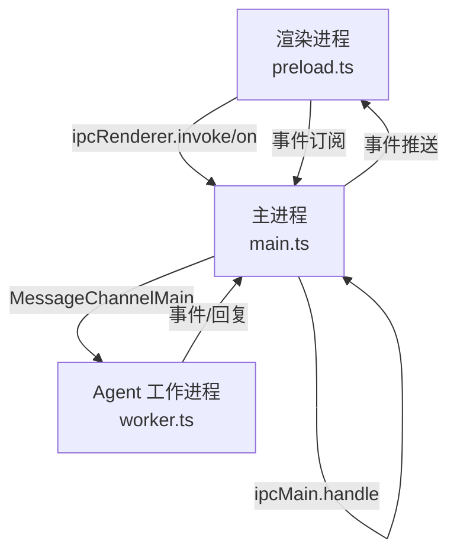
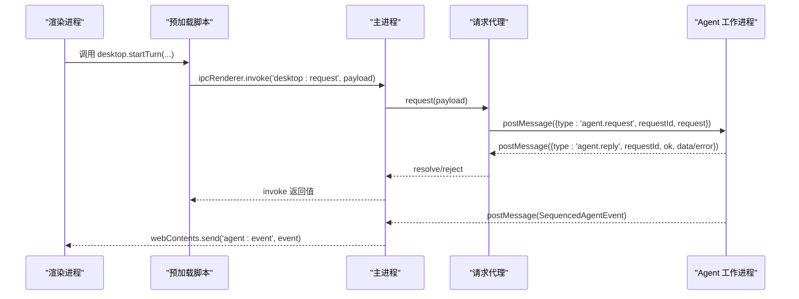
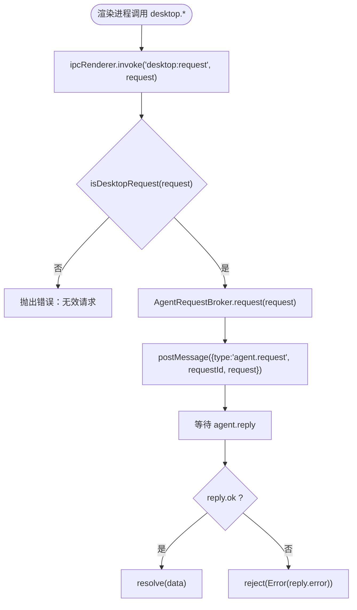
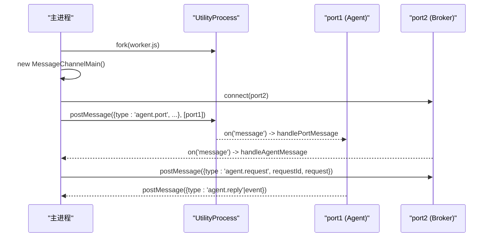
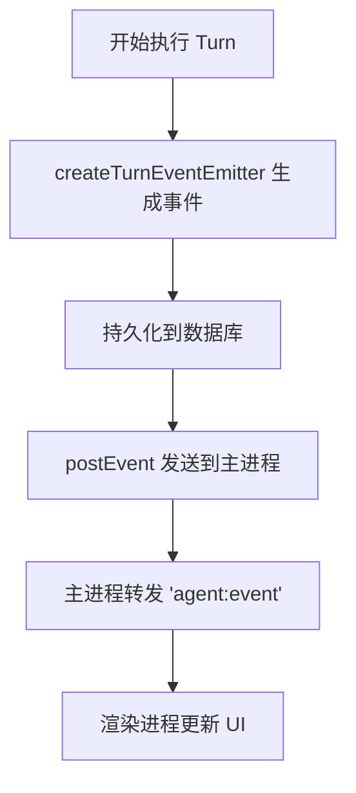
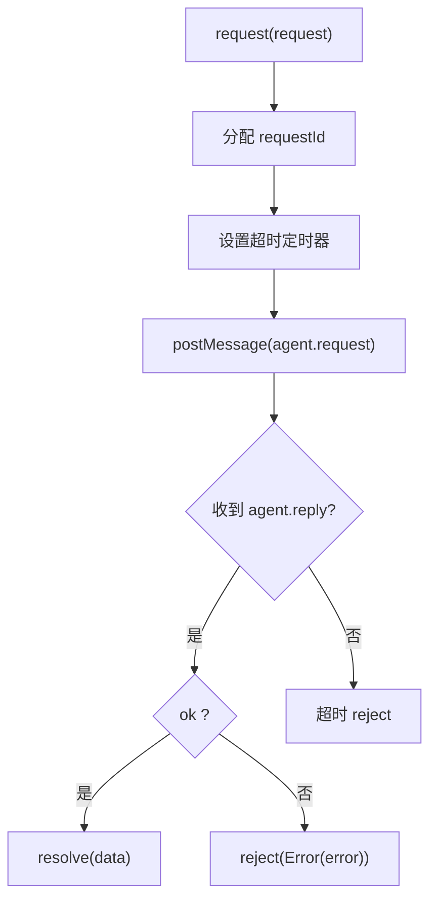
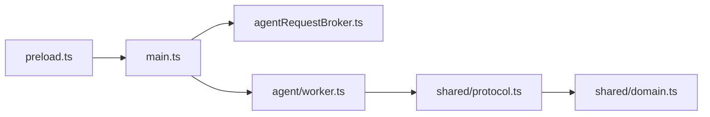

# 多进程通信机制

<cite>
**本文引用的文件**
- [src/main.ts](file://src/main.ts)
- [src/preload.ts](file://src/preload.ts)
- [src/shared/protocol.ts](file://src/shared/protocol.ts)
- [src/shared/domain.ts](file://src/shared/domain.ts)
- [src/main/agentRequestBroker.ts](file://src/main/agentRequestBroker.ts)
- [src/agent/worker.ts](file://src/agent/worker.ts)
</cite>

## 目录
1. [简介](#简介)
2. [项目结构](#项目结构)
3. [核心组件](#核心组件)
4. [架构总览](#架构总览)
5. [详细组件分析](#详细组件分析)
6. [依赖关系分析](#依赖关系分析)
7. [性能考量](#性能考量)
8. [故障排除指南](#故障排除指南)
9. [结论](#结论)
10. [附录：协议与消息规范](#附录协议与消息规范)

## 简介
本技术文档聚焦 Private AI Desktop 的多进程通信机制，系统性阐述 IPC（Inter-Process Communication）协议的设计与实现。内容覆盖主进程与渲染进程之间的消息传递、事件处理与请求响应模式；Agent 工作进程与主进程之间基于 MessageChannelMain 的双向通道通信；协议类型定义、消息格式规范与错误处理策略；并提供跨进程消息发送与接收的具体示例路径说明。同时包含安全性考虑（权限控制、数据校验）以及调试与故障排除指南。

## 项目结构
本项目采用 Electron 多进程架构：
- 渲染进程（Renderer）：通过 contextBridge 暴露的 desktop API 发起请求并订阅事件。
- 主进程（Main）：负责窗口管理、IPC 路由、启动 Agent 子进程、维护与 Agent 的 MessageChannelMain 连接、转发事件到渲染进程。
- Agent 工作进程（Utility Process）：承载业务逻辑（数据库、调度器、模型调用），通过端口消息与主进程通信。
- 共享层（Shared）：定义协议类型、领域模型与校验函数，确保跨进程数据结构一致。

**图表来源**
- [src/main.ts:1-170](file://src/main.ts#L1-L170)
- [src/preload.ts:1-32](file://src/preload.ts#L1-L32)
- [src/agent/worker.ts:106-124](file://src/agent/worker.ts#L106-L124)

**章节来源**
- [src/main.ts:1-170](file://src/main.ts#L1-L170)
- [src/preload.ts:1-32](file://src/preload.ts#L1-L32)
- [src/agent/worker.ts:106-124](file://src/agent/worker.ts#L106-L124)

## 核心组件
- 渲染侧代理（preload.ts）：将桌面能力封装为 desktop API，使用 ipcRenderer.invoke 发送请求，使用 ipcRenderer.on 订阅 agent:event 事件。
- 主进程入口（main.ts）：创建窗口、启动 Agent 子进程、建立 MessageChannelMain、注册 ipcMain.handle 路由、转发事件。
- 请求代理（agentRequestBroker.ts）：在 MessageChannelMain 上实现请求-响应语义，带超时与断连重放。
- Agent 工作进程（worker.ts）：解析主进程发来的 agent.request，执行业务逻辑，返回 agent.reply，并通过同一端口推送 SequencedAgentEvent。
- 协议与领域模型（shared/protocol.ts, shared/domain.ts）：统一定义请求、事件、领域对象及严格的数据校验函数。

**章节来源**
- [src/preload.ts:5-31](file://src/preload.ts#L5-L31)
- [src/main.ts:98-144](file://src/main.ts#L98-L144)
- [src/main/agentRequestBroker.ts:15-85](file://src/main/agentRequestBroker.ts#L15-L85)
- [src/agent/worker.ts:407-442](file://src/agent/worker.ts#L407-L442)
- [src/shared/protocol.ts:22-66](file://src/shared/protocol.ts#L22-L66)
- [src/shared/domain.ts:1-319](file://src/shared/domain.ts#L1-L319)

## 架构总览
下图展示了从渲染进程到 Agent 工作进程的完整消息流，包括请求-响应与事件推送两条路径。

**图表来源**
- [src/preload.ts:15-17](file://src/preload.ts#L15-L17)
- [src/main.ts:103-144](file://src/main.ts#L103-L144)
- [src/main/agentRequestBroker.ts:33-63](file://src/main/agentRequestBroker.ts#L33-L63)
- [src/agent/worker.ts:407-442](file://src/agent/worker.ts#L407-L442)

## 详细组件分析

### 渲染进程与主进程的 IPC（请求-响应）
- 渲染进程通过 preload 暴露的 desktop API 调用 ipcRenderer.invoke('desktop:request', request)。
- 主进程在 ipcMain.handle('desktop:request') 中校验请求类型，然后委托给 AgentRequestBroker 进行异步请求。
- 所有请求必须通过 isDesktopRequest 校验，防止非法或恶意载荷进入系统。

**图表来源**
- [src/preload.ts:5-25](file://src/preload.ts#L5-L25)
- [src/main.ts:103-108](file://src/main.ts#L103-L108)
- [src/main/agentRequestBroker.ts:33-63](file://src/main/agentRequestBroker.ts#L33-L63)
- [src/shared/protocol.ts:274-316](file://src/shared/protocol.ts#L274-L316)

**章节来源**
- [src/preload.ts:5-25](file://src/preload.ts#L5-L25)
- [src/main.ts:103-108](file://src/main.ts#L103-L108)
- [src/main/agentRequestBroker.ts:33-63](file://src/main/agentRequestBroker.ts#L33-L63)
- [src/shared/protocol.ts:274-316](file://src/shared/protocol.ts#L274-L316)

### 主进程与 Agent 工作进程的 MessageChannelMain 通信
- 主进程使用 utilityProcess.fork 启动 Agent 子进程，并通过 MessageChannelMain 交换端口。
- 主进程将 port2 交给 AgentRequestBroker，port1 随 postMessage 发送给 Agent。
- Agent 收到 {type:'agent.port'} 后初始化数据库与工作运行时，并通过 workerPort 与主进程通信。
- 主进程监听 agentPort 的 message 事件，区分 agent.reply 与 SequencedAgentEvent，分别交由请求代理或转发至渲染进程。

**图表来源**
- [src/main.ts:19-54](file://src/main.ts#L19-L54)
- [src/main.ts:135-144](file://src/main.ts#L135-L144)
- [src/agent/worker.ts:106-124](file://src/agent/worker.ts#L106-L124)
- [src/agent/worker.ts:407-442](file://src/agent/worker.ts#L407-L442)

**章节来源**
- [src/main.ts:19-54](file://src/main.ts#L19-L54)
- [src/main.ts:135-144](file://src/main.ts#L135-L144)
- [src/agent/worker.ts:106-124](file://src/agent/worker.ts#L106-L124)
- [src/agent/worker.ts:407-442](file://src/agent/worker.ts#L407-L442)

### 事件处理与顺序保证
- Agent 工作进程通过 createTurnEventEmitter 为每个 turn 生成有序事件序列，附带 threadId、turnId、modelProfileId、sequence。
- 事件经 persistAndPost 持久化后再推送到主进程，最终由主进程转发到渲染进程。
- 渲染进程通过 desktop.subscribe 订阅 'agent:event' 事件，用于实时更新 UI。

**图表来源**
- [src/agent/worker.ts:128-153](file://src/agent/worker.ts#L128-L153)
- [src/agent/worker.ts:165-168](file://src/agent/worker.ts#L165-L168)
- [src/main.ts:141-143](file://src/main.ts#L141-L143)
- [src/preload.ts:26-30](file://src/preload.ts#L26-L30)

**章节来源**
- [src/agent/worker.ts:128-153](file://src/agent/worker.ts#L128-L153)
- [src/agent/worker.ts:165-168](file://src/agent/worker.ts#L165-L168)
- [src/main.ts:141-143](file://src/main.ts#L141-L143)
- [src/preload.ts:26-30](file://src/preload.ts#L26-L30)

### 请求-响应与错误处理
- 请求代理为每个请求分配唯一 requestId，并在 pending Map 中记录 Promise 与超时定时器。
- 若超时未收到回复，则拒绝 Promise；若连接断开，统一拒绝所有挂起请求。
- Agent 工作进程捕获异常，通过 safeErrorText 脱敏后以 agent.reply(ok=false, error) 返回。

**图表来源**
- [src/main/agentRequestBroker.ts:33-63](file://src/main/agentRequestBroker.ts#L33-L63)
- [src/agent/worker.ts:407-414](file://src/agent/worker.ts#L407-L414)
- [src/agent/worker.ts:505-509](file://src/agent/worker.ts#L505-L509)

**章节来源**
- [src/main/agentRequestBroker.ts:33-63](file://src/main/agentRequestBroker.ts#L33-L63)
- [src/agent/worker.ts:407-414](file://src/agent/worker.ts#L407-L414)
- [src/agent/worker.ts:505-509](file://src/agent/worker.ts#L505-L509)

### 安全性与权限控制
- 渲染进程仅能通过 contextBridge 暴露的有限 API 访问主进程能力，避免直接 Node 集成。
- 主进程对所有桌面请求进行结构化校验（isDesktopRequest），拒绝未知或非法字段。
- 事件载荷同样经过 isAgentEvent 校验，确保事件类型与字段合法。
- 错误信息通过 safeErrorText 脱敏，防止敏感信息泄露。
- 工作进程对图片附件进行严格校验（isTurnAttachment），限制 MIME 与 dataUrl 格式。

**章节来源**
- [src/preload.ts:5-31](file://src/preload.ts#L5-L31)
- [src/main.ts:103-108](file://src/main.ts#L103-L108)
- [src/shared/protocol.ts:274-316](file://src/shared/protocol.ts#L274-L316)
- [src/shared/protocol.ts:318-370](file://src/shared/protocol.ts#L318-L370)
- [src/shared/protocol.ts:85-99](file://src/shared/protocol.ts#L85-L99)
- [src/agent/worker.ts:650-652](file://src/agent/worker.ts#L650-L652)

## 依赖关系分析
- 主进程依赖 AgentRequestBroker 管理跨进程请求生命周期。
- Agent 工作进程依赖 shared/protocol 的类型与校验函数，确保消息契约一致。
- 渲染进程依赖 preload 暴露的 desktop API，不直接接触底层 IPC。
- 共享层 domain.ts 提供领域模型，被 protocol.ts 与 worker.ts 引用。

**图表来源**
- [src/preload.ts:1-32](file://src/preload.ts#L1-L32)
- [src/main.ts:1-170](file://src/main.ts#L1-L170)
- [src/main/agentRequestBroker.ts:1-86](file://src/main/agentRequestBroker.ts#L1-L86)
- [src/agent/worker.ts:1-689](file://src/agent/worker.ts#L1-L689)
- [src/shared/protocol.ts:1-371](file://src/shared/protocol.ts#L1-L371)
- [src/shared/domain.ts:1-319](file://src/shared/domain.ts#L1-L319)

**章节来源**
- [src/preload.ts:1-32](file://src/preload.ts#L1-L32)
- [src/main.ts:1-170](file://src/main.ts#L1-L170)
- [src/main/agentRequestBroker.ts:1-86](file://src/main/agentRequestBroker.ts#L1-L86)
- [src/agent/worker.ts:1-689](file://src/agent/worker.ts#L1-L689)
- [src/shared/protocol.ts:1-371](file://src/shared/protocol.ts#L1-L371)
- [src/shared/domain.ts:1-319](file://src/shared/domain.ts#L1-L319)

## 性能考量
- 事件序列化与顺序：通过 sequence 字段保证事件顺序，减少渲染端乱序风险。
- 请求超时：默认 30 秒超时，避免长时间阻塞；可根据场景调整。
- 并发控制：工作进程根据模型配置动态调整并发度，避免资源争用。
- 数据校验：严格的输入校验减少无效计算与错误分支开销。
- 事件持久化：关键事件先落库再推送，提升可靠性但增加 I/O，需权衡吞吐。

[本节为通用指导，无需具体文件引用]

## 故障排除指南
- 渲染进程无法收到事件：检查 preload 是否正确订阅 'agent:event'，确认主进程是否转发事件。
- 请求无响应：确认 Agent 工作进程已就绪（agent.ready），检查请求代理 pending 队列与超时设置。
- 连接断开：当 Agent 端口关闭或进程退出时，主进程会断开连接并拒绝所有挂起请求。
- 事件顺序错乱：确认 createTurnEventEmitter 的 tail 链式投递未被中断。
- 安全报错：检查 isDesktopRequest/isAgentEvent 校验失败原因，定位非法字段。

**章节来源**
- [src/preload.ts:26-30](file://src/preload.ts#L26-L30)
- [src/main.ts:135-156](file://src/main.ts#L135-L156)
- [src/main/agentRequestBroker.ts:65-84](file://src/main/agentRequestBroker.ts#L65-L84)
- [src/agent/worker.ts:128-153](file://src/agent/worker.ts#L128-L153)
- [src/shared/protocol.ts:274-370](file://src/shared/protocol.ts#L274-L370)

## 结论
Private AI Desktop 的多进程通信机制通过清晰的职责划分与严格的协议约束，实现了稳定可靠的跨进程交互。渲染进程通过受限 API 与主进程通信，主进程作为中枢协调 Agent 工作进程的业务执行与事件分发。MessageChannelMain 提供了高性能的双向通道，配合请求代理实现了可靠的请求-响应语义。协议层的强类型与校验确保了安全性与可维护性。

[本节为总结性内容，无需具体文件引用]

## 附录：协议与消息规范

### 请求类型（DesktopRequest）
- snapshot.get
- group.create / group.delete
- thread.create / thread.delete / thread.setModel
- turn.start / turn.cancel
- approval.respond
- modelProfile.save / modelProfile.delete / modelProfile.test
- settings.update
- workspace.register / workspace.delete
- language.set / theme.set

**章节来源**
- [src/shared/protocol.ts:22-39](file://src/shared/protocol.ts#L22-L39)

### 事件类型（AgentEvent / SequencedAgentEvent）
- snapshot
- turn.queued / turn.started / turn.cancelling / turn.completed / turn.failed / turn.cancelled
- message.delta / answer.delta
- reasoning.raw.delta / reasoning.summary.delta
- model.progress / model.metrics
- tool.started / tool.output
- approval.required

**章节来源**
- [src/shared/protocol.ts:41-66](file://src/shared/protocol.ts#L41-L66)
- [src/shared/protocol.ts:318-370](file://src/shared/protocol.ts#L318-L370)

### 消息格式与字段
- 请求：{ type, ...fields }，字段合法性由 isDesktopRequest 校验。
- 回复：{ type:'agent.reply', requestId, ok, data? | error? }。
- 事件：包含 threadId、turnId、modelProfileId、sequence 等上下文字段，具体字段依事件类型而定。

**章节来源**
- [src/main/agentRequestBroker.ts:5-8](file://src/main/agentRequestBroker.ts#L5-L8)
- [src/agent/worker.ts:505-509](file://src/agent/worker.ts#L505-L509)
- [src/shared/protocol.ts:41-66](file://src/shared/protocol.ts#L41-L66)

### 跨进程消息示例（代码路径）
- 渲染进程发送请求：
  - [src/preload.ts:15-17](file://src/preload.ts#L15-L17)
- 主进程接收并路由请求：
  - [src/main.ts:103-108](file://src/main.ts#L103-L108)
- 主进程通过 MessageChannelMain 发送请求：
  - [src/main/agentRequestBroker.ts:33-51](file://src/main/agentRequestBroker.ts#L33-L51)
- Agent 工作进程处理请求并返回回复：
  - [src/agent/worker.ts:407-442](file://src/agent/worker.ts#L407-L442)
  - [src/agent/worker.ts:505-509](file://src/agent/worker.ts#L505-L509)
- 主进程转发事件到渲染进程：
  - [src/main.ts:141-143](file://src/main.ts#L141-L143)
- 渲染进程订阅事件：
  - [src/preload.ts:26-30](file://src/preload.ts#L26-L30)