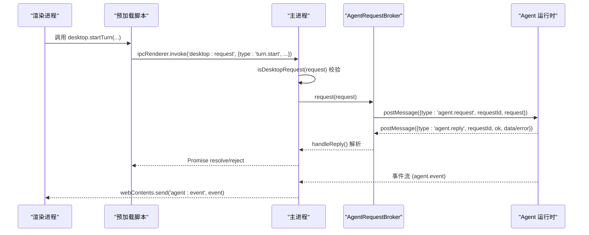
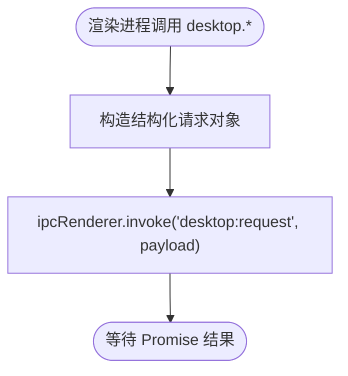
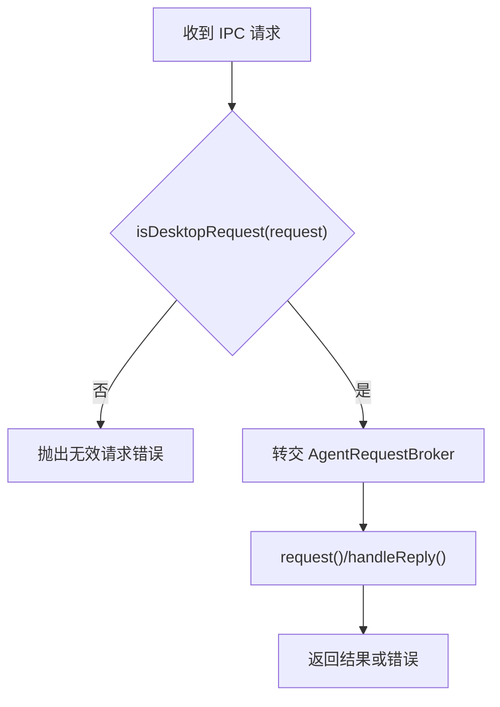
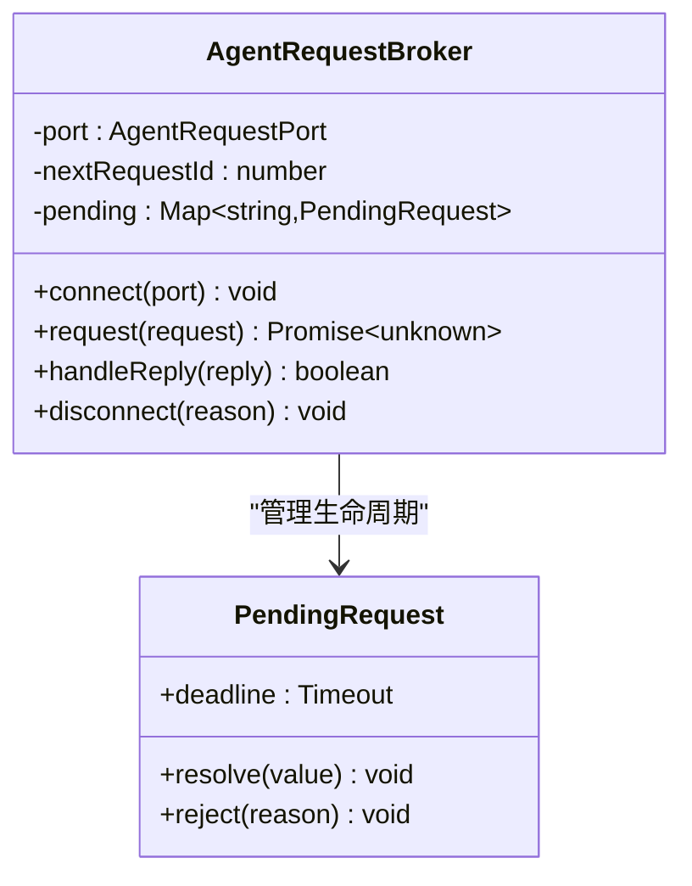
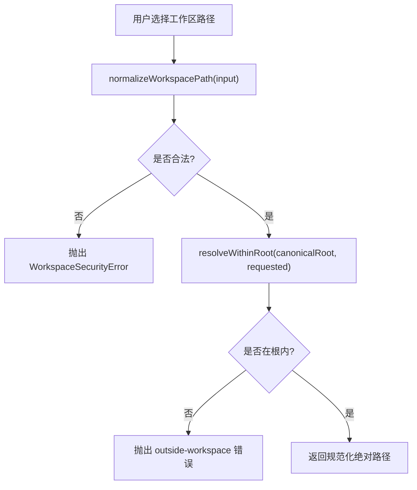
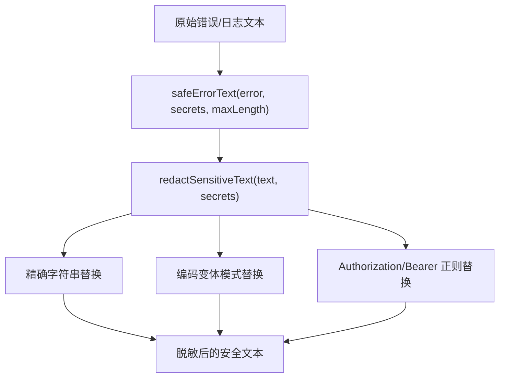
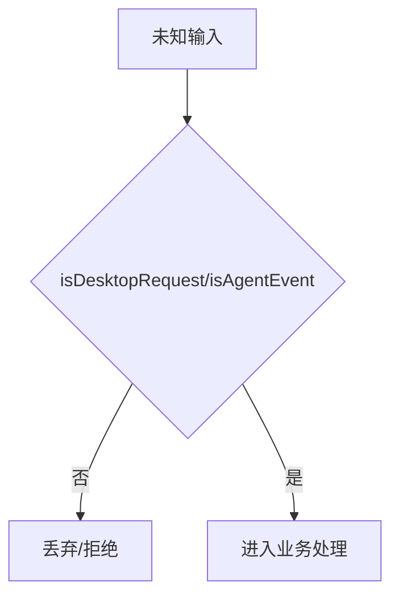
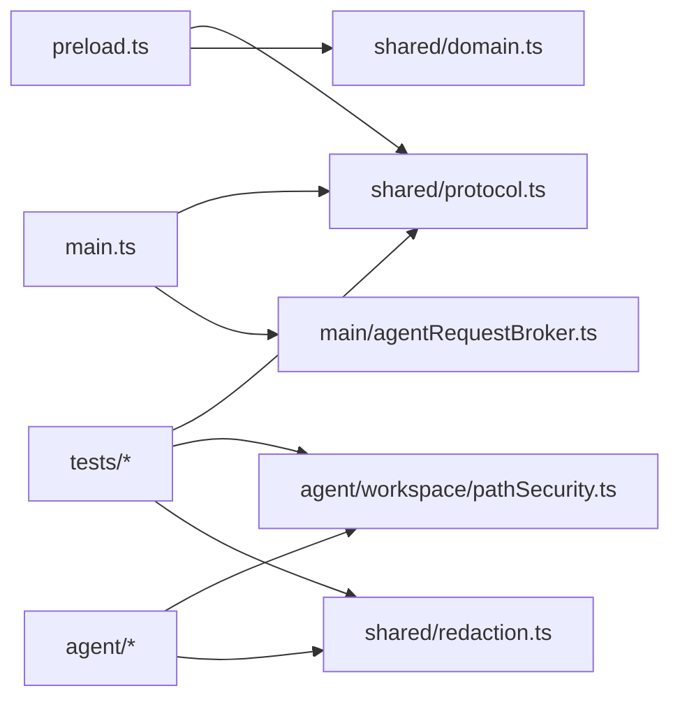

# 安全模型

<cite>
**本文引用的文件**
- [src/preload.ts](file://src/preload.ts)
- [src/main.ts](file://src/main.ts)
- [src/main/agentRequestBroker.ts](file://src/main/agentRequestBroker.ts)
- [src/shared/protocol.ts](file://src/shared/protocol.ts)
- [src/shared/domain.ts](file://src/shared/domain.ts)
- [src/shared/redaction.ts](file://src/shared/redaction.ts)
- [src/agent/workspace/pathSecurity.ts](file://src/agent/workspace/pathSecurity.ts)
- [tests/protocol.test.ts](file://tests/protocol.test.ts)
- [tests/redaction.test.ts](file://tests/redaction.test.ts)
- [tests/pathSecurity.test.ts](file://tests/pathSecurity.test.ts)
</cite>

## 目录
1. [简介](#简介)
2. [项目结构](#项目结构)
3. [核心组件](#核心组件)
4. [架构总览](#架构总览)
5. [详细组件分析](#详细组件分析)
6. [依赖关系分析](#依赖关系分析)
7. [性能与安全权衡](#性能与安全权衡)
8. [故障排查指南](#故障排查指南)
9. [结论](#结论)
10. [附录：安全审计清单与威胁防护](#附录：安全审计清单与威胁防护)

## 简介
本技术文档围绕 Private AI Desktop 的多进程安全模型，系统性说明预加载脚本如何以最小权限暴露 API、主进程如何严格校验并转发请求到隔离的 Agent 运行时、工作区信任级别与网络策略如何控制能力边界、敏感数据脱敏机制如何防止密钥等泄露、以及文件访问的安全边界和路径验证。文档同时给出跨进程数据验证与输入清洗策略、常见安全威胁的防护措施与安全审计清单，帮助读者在理解代码实现的同时掌握整体安全设计。

## 项目结构
本项目采用 Electron 多进程架构：渲染进程通过预加载脚本仅能调用有限的 IPC 接口；主进程负责窗口生命周期、安全配置、IPC 路由与协议校验；Agent 运行时作为独立 Utility Process，承载实际业务逻辑（如模型连接、工具执行、工作区操作）。共享层定义类型、协议与通用安全工具（脱敏、路径安全）。

```mermaid
graph TB
subgraph "渲染进程"
R["Vue 应用<br/>UI 与交互"]
P["预加载脚本<br/>contextBridge 暴露有限 API"]
end
subgraph "主进程"
M["main.ts<br/>窗口/IPC/安全配置"]
B["AgentRequestBroker<br/>请求-响应/超时/断连"]
end
subgraph "Agent 运行时(Utility Process)"
W["worker.js<br/>业务逻辑/工具/网络"]
end
S["shared/*<br/>协议/类型/脱敏/路径安全"]
R --> P
P --> |ipcRenderer.invoke('desktop:request')| M
M --> |MessageChannelMain| B
B --> |postMessage(agent.request)| W
W --> |agent.reply / agent.event| B
B --> |ipcMain.send('agent:event')| R
M -.-> S
P -.-> S
W -.-> S
```

**图表来源**
- [src/main.ts:56-108](file://src/main.ts#L56-L108)
- [src/main/agentRequestBroker.ts:15-85](file://src/main/agentRequestBroker.ts#L15-L85)
- [src/preload.ts:5-35](file://src/preload.ts#L5-L35)
- [src/shared/protocol.ts:22-39](file://src/shared/protocol.ts#L22-L39)

**章节来源**
- [src/main.ts:56-108](file://src/main.ts#L56-L108)
- [src/preload.ts:5-35](file://src/preload.ts#L5-L35)
- [src/shared/protocol.ts:22-39](file://src/shared/protocol.ts#L22-L39)

## 核心组件
- 预加载脚本：通过 contextBridge 仅暴露一组受控方法，所有操作均封装为结构化 IPC 请求，禁止直接访问 Node/Electron 能力。
- 主进程 IPC 网关：注册少量 IPC 通道，对桌面请求进行白名单与字段级校验，再转发给 Agent 运行时。
- Agent 请求代理：维护请求-响应关联、超时与断线处理，确保不可信消息不会破坏状态。
- 协议与类型：集中定义所有跨进程消息结构，并提供严格的 isXxx 校验函数，拒绝非法或越权请求。
- 工作区路径安全：规范化根路径、解析符号链接/联结点、强制路径包含于工作区根，并屏蔽设备路径与 UNC 根。
- 敏感数据脱敏：对错误文本、日志与输出进行多编码变体匹配替换，避免密钥、令牌等泄露。

**章节来源**
- [src/preload.ts:5-35](file://src/preload.ts#L5-L35)
- [src/main.ts:98-108](file://src/main.ts#L98-L108)
- [src/main/agentRequestBroker.ts:15-85](file://src/main/agentRequestBroker.ts#L15-L85)
- [src/shared/protocol.ts:22-39](file://src/shared/protocol.ts#L22-L39)
- [src/agent/workspace/pathSecurity.ts:96-125](file://src/agent/workspace/pathSecurity.ts#L96-L125)
- [src/shared/redaction.ts:1-33](file://src/shared/redaction.ts#L1-L33)

## 架构总览
下图展示了从渲染进程发起请求到 Agent 运行时的完整链路，包括协议校验、请求代理、事件回推与错误处理。



**图表来源**
- [src/preload.ts:15-17](file://src/preload.ts#L15-L17)
- [src/main.ts:103-108](file://src/main.ts#L103-L108)
- [src/main/agentRequestBroker.ts:33-63](file://src/main/agentRequestBroker.ts#L33-L63)
- [src/shared/protocol.ts:22-39](file://src/shared/protocol.ts#L22-L39)

## 详细组件分析

### 预加载脚本的安全 API 暴露
- 仅通过 contextBridge.exposeInMainWorld 暴露一个命名空间，内部方法均为对特定 IPC 通道的封装。
- 所有参数保持简单类型或已定义的结构体，避免将任意对象透传到主进程。
- 订阅事件时返回取消函数，避免内存泄漏与未清理监听器。



**图表来源**
- [src/preload.ts:5-35](file://src/preload.ts#L5-L35)

**章节来源**
- [src/preload.ts:5-35](file://src/preload.ts#L5-L35)

### 主进程 IPC 网关与协议校验
- 窗口启用 contextIsolation、sandbox，禁用 nodeIntegration，限制渲染进程能力。
- 仅注册 app:health 与 desktop:request 两个 IPC 通道。
- 所有桌面请求必须通过 isDesktopRequest 校验，否则直接拒绝。
- 事件回推前也通过 isAgentEvent 校验，防止恶意事件注入。



**图表来源**
- [src/main.ts:56-108](file://src/main.ts#L56-L108)
- [src/main/agentRequestBroker.ts:33-63](file://src/main/agentRequestBroker.ts#L33-L63)
- [src/shared/protocol.ts:274-316](file://src/shared/protocol.ts#L274-L316)

**章节来源**
- [src/main.ts:56-108](file://src/main.ts#L56-L108)
- [src/shared/protocol.ts:274-316](file://src/shared/protocol.ts#L274-L316)
- [tests/protocol.test.ts:4-89](file://tests/protocol.test.ts#L4-L89)

### Agent 请求代理（超时与断连）
- 每个请求分配唯一 requestId，维护 pending Map。
- 设置超时定时器，超时后清理并拒绝。
- 端口关闭或替换时，统一断开并拒绝所有挂起请求，避免悬挂任务。



**图表来源**
- [src/main/agentRequestBroker.ts:15-85](file://src/main/agentRequestBroker.ts#L15-L85)

**章节来源**
- [src/main/agentRequestBroker.ts:15-85](file://src/main/agentRequestBroker.ts#L15-L85)

### 工作区信任级别与权限控制
- WorkspaceTrustLevel 限定为 read-only 与 read-write，用于控制工作区的读写能力。
- WorkspaceRecord 记录 canonicalRootPath、trustLevel、networkPolicy 等，作为后续权限判断依据。
- 注册工作区时，路径需经 normalizeWorkspacePath 规范化，拒绝设备路径、UNC 根与非绝对路径。
- 任何工具路径解析必须使用 resolveWithinRoot，确保最终路径位于规范化的工作区根内，即使存在符号链接/联结点也会被正确检测。



**图表来源**
- [src/agent/workspace/pathSecurity.ts:96-125](file://src/agent/workspace/pathSecurity.ts#L96-L125)
- [src/agent/workspace/pathSecurity.ts:175-191](file://src/agent/workspace/pathSecurity.ts#L175-L191)

**章节来源**
- [src/shared/domain.ts:259-281](file://src/shared/domain.ts#L259-L281)
- [src/agent/workspace/pathSecurity.ts:96-125](file://src/agent/workspace/pathSecurity.ts#L96-L125)
- [src/agent/workspace/pathSecurity.ts:175-191](file://src/agent/workspace/pathSecurity.ts#L175-L191)
- [tests/pathSecurity.test.ts:1-40](file://tests/pathSecurity.test.ts#L1-L40)

### 敏感数据脱敏机制
- safeErrorText 将错误信息标准化并截断长度，调用 redactSensitiveText 进行脱敏。
- redactSensitiveText 支持精确匹配与多种编码变体（JSON 转义、URL 百分号编码、表单编码），并对 Authorization/Bearer 头进行正则替换。
- 测试覆盖混合大小写十六进制编码场景，确保不同编码形式均被识别并替换为占位符。



**图表来源**
- [src/shared/redaction.ts:1-33](file://src/shared/redaction.ts#L1-L33)
- [src/shared/redaction.ts:40-111](file://src/shared/redaction.ts#L40-L111)
- [tests/redaction.test.ts:1-41](file://tests/redaction.test.ts#L1-L41)

**章节来源**
- [src/shared/redaction.ts:1-33](file://src/shared/redaction.ts#L1-L33)
- [tests/redaction.test.ts:1-41](file://tests/redaction.test.ts#L1-L41)

### 跨进程数据验证与输入清洗策略
- 所有桌面请求必须满足 isDesktopRequest 的结构与值域约束，例如 turn.start 需要 threadId 与 text，workspace.register 需要 path 与 trustLevel 且 trustLevel 仅限允许值。
- 事件流也必须通过 isAgentEvent 校验，确保序列号、线程标识、模型标识与字段类型正确。
- 测试覆盖了拒绝非法请求、接受合法请求、拒绝生命周期命令等场景，体现“默认拒绝”原则。



**图表来源**
- [src/shared/protocol.ts:274-371](file://src/shared/protocol.ts#L274-L371)
- [tests/protocol.test.ts:4-366](file://tests/protocol.test.ts#L4-L366)

**章节来源**
- [src/shared/protocol.ts:274-371](file://src/shared/protocol.ts#L274-L371)
- [tests/protocol.test.ts:4-366](file://tests/protocol.test.ts#L4-L366)

## 依赖关系分析
- 预加载脚本依赖 shared/domain 与 protocol 的类型定义，但不直接访问主进程能力。
- 主进程依赖 protocol 的校验函数与 AgentRequestBroker 的请求代理。
- Agent 运行时依赖 shared 中的路径安全与脱敏工具，保证工具执行与网络输出的安全性。
- 测试文件对协议、脱敏、路径安全进行正向与负向用例覆盖，保障契约稳定。



**图表来源**
- [src/preload.ts:1-4](file://src/preload.ts#L1-L4)
- [src/main.ts:1-5](file://src/main.ts#L1-L5)
- [src/main/agentRequestBroker.ts:1-8](file://src/main/agentRequestBroker.ts#L1-L8)
- [src/agent/workspace/pathSecurity.ts:1-13](file://src/agent/workspace/pathSecurity.ts#L1-L13)
- [src/shared/redaction.ts:1-12](file://src/shared/redaction.ts#L1-L12)

**章节来源**
- [src/preload.ts:1-4](file://src/preload.ts#L1-L4)
- [src/main.ts:1-5](file://src/main.ts#L1-L5)
- [src/main/agentRequestBroker.ts:1-8](file://src/main/agentRequestBroker.ts#L1-L8)
- [src/agent/workspace/pathSecurity.ts:1-13](file://src/agent/workspace/pathSecurity.ts#L1-L13)
- [src/shared/redaction.ts:1-12](file://src/shared/redaction.ts#L1-L12)

## 性能与安全权衡
- 预加载层只做轻量包装，避免在渲染进程中执行重逻辑，降低主进程压力。
- 主进程对所有请求进行一次性校验，减少重复解析成本；AgentRequestBroker 使用 Map 管理待处理请求，查找复杂度 O(1)。
- 路径安全模块在规范化与包含性检查中尽量复用 realpath 与相对路径计算，避免多次系统调用。
- 脱敏模块对长文本进行正则替换，建议在高吞吐场景下缓存热点模式或分批处理，以降低 CPU 占用。

[本节提供一般性指导，不直接分析具体文件]

## 故障排查指南
- 如果渲染进程调用 desktop.* 失败，优先检查 isDesktopRequest 是否通过，确认请求结构与字段类型符合协议定义。
- 若出现“Agent runtime is not ready.”，检查主进程是否正确启动 Agent 运行时并建立 MessageChannelMain。
- 若路径操作抛出 WorkspaceSecurityError，查看 code 字段定位问题：not-absolute、device-path、unc-root、outside-workspace。
- 若日志或错误信息仍包含敏感内容，检查传入的 secrets 列表是否完整，并确保使用 safeErrorText 包裹错误输出。

**章节来源**
- [src/main/agentRequestBroker.ts:33-51](file://src/main/agentRequestBroker.ts#L33-L51)
- [src/agent/workspace/pathSecurity.ts:22-30](file://src/agent/workspace/pathSecurity.ts#L22-L30)
- [src/shared/redaction.ts:1-12](file://src/shared/redaction.ts#L1-L12)

## 结论
Private AI Desktop 通过预加载脚本的最小权限暴露、主进程的严格协议校验与 IPC 路由、Agent 运行时的隔离执行、工作区路径安全与敏感数据脱敏，构建了多层防御体系。该设计有效限制了渲染进程对主进程能力的直接访问，防止了路径逃逸与敏感信息泄露，并通过完备的测试覆盖保障了行为可预期。建议在新增功能时遵循“默认拒绝”的原则，持续完善输入校验与脱敏策略。

[本节总结性内容，不直接分析具体文件]

## 附录：安全审计清单与威胁防护

### 安全审计清单
- 预加载脚本是否仅暴露必要方法，无全局对象污染。
- 主进程是否启用 contextIsolation、sandbox，禁用 nodeIntegration。
- 所有 IPC 请求是否经过 isDesktopRequest 校验，事件是否经过 isAgentEvent 校验。
- 工作区路径是否通过 normalizeWorkspacePath 与 resolveWithinRoot，拒绝设备路径与 UNC 根。
- 敏感数据是否通过 safeErrorText/redactSensitiveText 处理，覆盖 JSON/URL/表单编码变体。
- AgentRequestBroker 是否具备超时与断连处理，避免悬挂请求。
- 测试是否覆盖正向与负向用例，确保协议与工具行为稳定。

**章节来源**
- [src/main.ts:56-108](file://src/main.ts#L56-L108)
- [src/shared/protocol.ts:274-371](file://src/shared/protocol.ts#L274-L371)
- [src/agent/workspace/pathSecurity.ts:96-125](file://src/agent/workspace/pathSecurity.ts#L96-L125)
- [src/shared/redaction.ts:1-33](file://src/shared/redaction.ts#L1-L33)
- [src/main/agentRequestBroker.ts:33-63](file://src/main/agentRequestBroker.ts#L33-L63)
- [tests/protocol.test.ts:4-366](file://tests/protocol.test.ts#L4-L366)
- [tests/redaction.test.ts:1-41](file://tests/redaction.test.ts#L1-L41)
- [tests/pathSecurity.test.ts:1-40](file://tests/pathSecurity.test.ts#L1-L40)

### 常见安全威胁与防护措施
- 渲染进程越权访问：通过 contextBridge 白名单暴露 API，禁止直接访问 Node/Electron。
- 恶意 IPC 消息注入：主进程严格校验请求结构与值域，拒绝未知类型。
- 路径逃逸攻击：规范化根路径并强制包含性检查，解析符号链接/联结点后再判定。
- 敏感信息泄露：脱敏模块覆盖多种编码形式，并在错误输出中统一替换。
- 资源耗尽与悬挂请求：AgentRequestBroker 设置超时与断连清理，避免内存泄漏。
- 网络策略滥用：工作区记录 networkPolicy，结合信任级别限制外部访问能力。

[本节提供概念性防护建议，不直接分析具体文件]