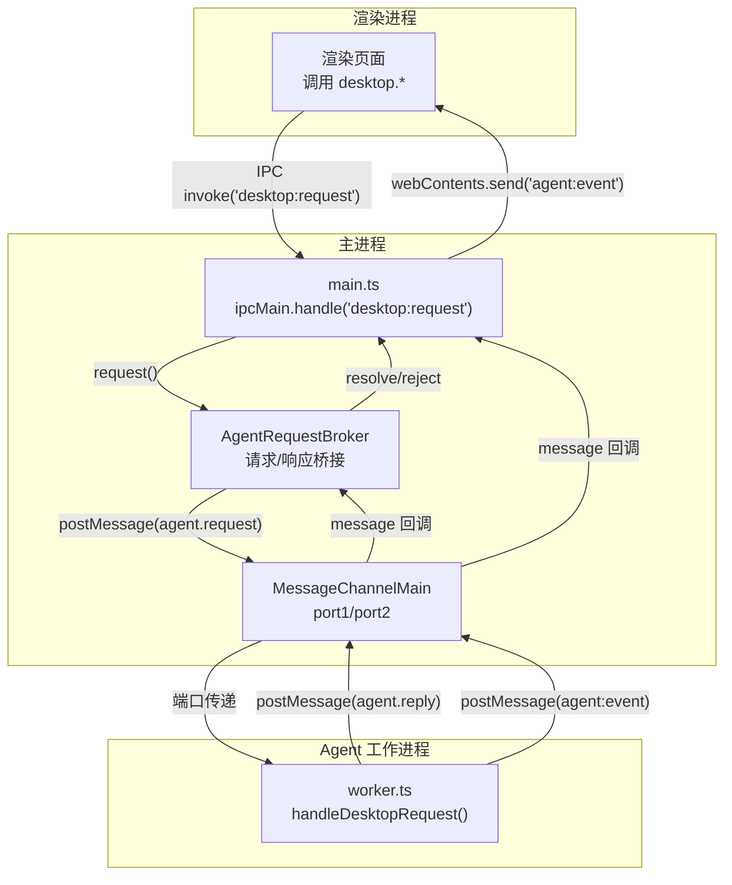
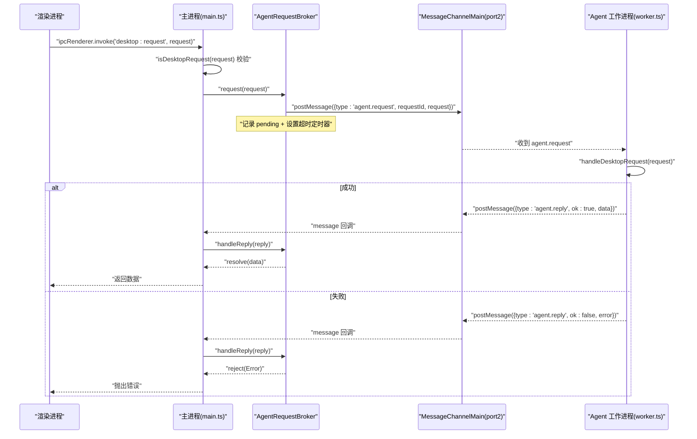
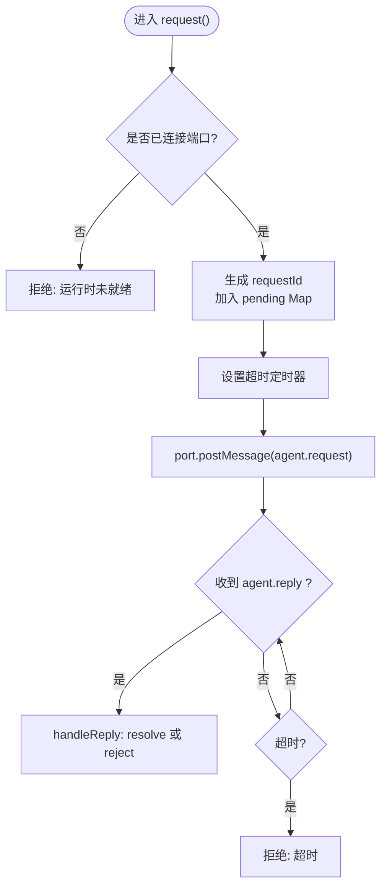
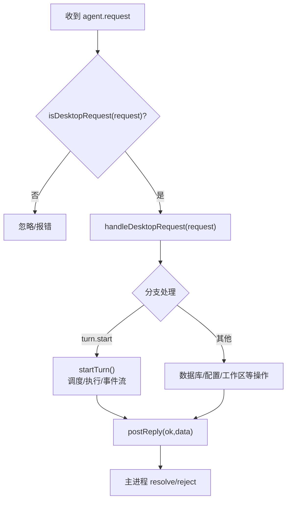
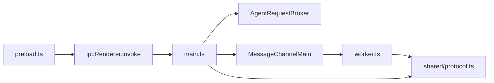

# 消息路由机制

<cite>
**本文引用的文件**
- [src/main.ts](file://src/main.ts)
- [src/main/agentRequestBroker.ts](file://src/main/agentRequestBroker.ts)
- [src/preload.ts](file://src/preload.ts)
- [src/shared/protocol.ts](file://src/shared/protocol.ts)
- [src/agent/worker.ts](file://src/agent/worker.ts)
- [tests/agentRequestBroker.test.ts](file://tests/agentRequestBroker.test.ts)
</cite>

## 目录
1. [简介](#简介)
2. [项目结构](#项目结构)
3. [核心组件](#核心组件)
4. [架构总览](#架构总览)
5. [详细组件分析](#详细组件分析)
6. [依赖关系分析](#依赖关系分析)
7. [性能与并发](#性能与并发)
8. [故障排除指南](#故障排除指南)
9. [结论](#结论)
10. [附录：使用示例与最佳实践](#附录使用示例与最佳实践)

## 简介
本文档围绕 Private AI Desktop 的消息路由机制，系统性阐述主进程如何通过 AgentRequestBroker 管理与路由来自渲染进程的请求到 Agent 工作进程；说明 MessageChannelMain 的使用模式与生命周期管理；记录请求队列、并发控制与超时处理；解释预加载脚本如何安全暴露 API 给渲染进程；并给出错误传播与异常处理策略、调试技巧与故障排除方法。

## 项目结构
本项目的消息路由涉及四个关键位置：
- 渲染进程：通过 preload.ts 暴露的 desktop API 调用 ipcRenderer.invoke('desktop:request', ...)
- 主进程：监听 'desktop:request'，校验请求类型后交由 AgentRequestBroker 发送
- 工作进程（Agent）：通过 worker.ts 接收 agent.request，执行业务逻辑并返回 agent.reply
- 事件通道：Agent 向主进程推送 agent:event，主进程转发至渲染进程

图表来源
- [src/main.ts:1-170](file://src/main.ts#L1-L170)
- [src/main/agentRequestBroker.ts:1-86](file://src/main/agentRequestBroker.ts#L1-L86)
- [src/agent/worker.ts:115-128](file://src/agent/worker.ts#L115-L128)
- [src/agent/worker.ts:411-449](file://src/agent/worker.ts#L411-L449)

章节来源
- [src/main.ts:1-170](file://src/main.ts#L1-L170)
- [src/preload.ts:1-36](file://src/preload.ts#L1-L36)
- [src/shared/protocol.ts:22-65](file://src/shared/protocol.ts#L22-L65)

## 核心组件
- AgentRequestBroker：负责为每个请求生成唯一 requestId，维护待处理请求 Map，设置超时定时器，将请求转发给 Agent 端口，并在收到 agent.reply 时 resolve/reject 对应 Promise。
- main.ts：创建 Electron 窗口、启动 Agent 工作进程、建立 MessageChannelMain 双向端口、注册 IPC 处理器、转发事件。
- worker.ts：在工作进程中解析 agent.request，路由到 handleDesktopRequest，执行具体业务逻辑，并通过 postReply 返回结果；同时持续推送 agent:event 事件。
- preload.ts：通过 contextBridge 仅暴露必要的 desktop API，避免直接暴露 Node/Electron 能力，确保渲染进程安全访问。
- protocol.ts：定义桌面端请求类型、事件类型及严格的校验函数 isDesktopRequest/isAgentEvent，用于主进程与工作进程之间的契约。

章节来源
- [src/main/agentRequestBroker.ts:15-85](file://src/main/agentRequestBroker.ts#L15-L85)
- [src/main.ts:19-54](file://src/main.ts#L19-L54)
- [src/agent/worker.ts:411-449](file://src/agent/worker.ts#L411-L449)
- [src/preload.ts:5-35](file://src/preload.ts#L5-L35)
- [src/shared/protocol.ts:22-65](file://src/shared/protocol.ts#L22-L65)

## 架构总览
下图展示了从渲染进程发起请求到 Agent 工作进程执行并返回响应的完整时序。

图表来源
- [src/main.ts:103-108](file://src/main.ts#L103-L108)
- [src/main/agentRequestBroker.ts:33-63](file://src/main/agentRequestBroker.ts#L33-L63)
- [src/agent/worker.ts:411-449](file://src/agent/worker.ts#L411-L449)

## 详细组件分析

### AgentRequestBroker：请求路由与超时管理
- 请求生命周期
  - connect(port)：绑定通信端口，若已有不同端口则先断开旧连接，清理所有 pending 请求。
  - request(request)：生成唯一 requestId，加入 pending Map，设置超时定时器，调用 port.postMessage 发送 agent.request。
  - handleReply(reply)：根据 requestId 取出 pending，清除定时器，按 ok 字段 resolve 或 reject。
  - disconnect(reason)：清空端口引用，拒绝所有 pending 请求，便于进程退出或端口关闭时的统一清理。
- 并发与队列
  - 该组件本身不实现任务队列，仅做“请求-响应”匹配与超时控制。真正的并发与排队由 Agent 工作进程内的调度器完成。
- 超时处理
  - 每个请求独立定时器，超时后将对应 pending 移除并 reject。
- 错误传播
  - 若 postMessage 抛错，立即 reject 对应请求；端口关闭或进程退出时，统一拒绝所有 pending。

图表来源
- [src/main/agentRequestBroker.ts:33-84](file://src/main/agentRequestBroker.ts#L33-L84)

章节来源
- [src/main/agentRequestBroker.ts:15-85](file://src/main/agentRequestBroker.ts#L15-L85)
- [tests/agentRequestBroker.test.ts:8-37](file://tests/agentRequestBroker.test.ts#L8-L37)

### main.ts：主进程入口与通道管理
- 启动 Agent 工作进程
  - 使用 utilityProcess.fork 启动 worker.js，并监听 exit 事件以在异常退出时停止运行时。
- 建立 MessageChannelMain
  - 创建 port1/port2，将 port2 连接到 AgentRequestBroker，并将 port1 传递给工作进程。
  - 订阅 port2 的 message 事件，区分 agent.reply 与 agent:event。
- IPC 处理器
  - 'app:health'：返回健康信息。
  - 'desktop:request'：校验请求类型后，委托 AgentRequestBroker 发送请求。
- 事件转发
  - 将 agent:event 通过 mainWindow.webContents.send('agent:event') 推送到渲染进程。
- 生命周期管理
  - before-quit 时停止 Agent 运行时，必要时 kill 进程并关闭端口。

章节来源
- [src/main.ts:19-54](file://src/main.ts#L19-L54)
- [src/main.ts:98-108](file://src/main.ts#L98-L108)
- [src/main.ts:135-156](file://src/main.ts#L135-L156)

### worker.ts：Agent 工作进程与请求处理
- 初始化
  - 监听父进程消息，当收到包含端口的消息时，打开数据库、创建 turnRuntime，并建立端口消息监听。
  - 向主进程发送 agent.ready 表示就绪。
- 请求处理
  - handlePortMessage：校验是否为 agent.request 且 request 为合法的 DesktopRequest，然后调用 handleDesktopRequest。
  - handleDesktopRequest：根据 type 分发到数据库操作、线程/组管理、模型配置、对话轮次等。
  - postReply：封装 agent.reply，携带 requestId、ok 与 data/error。
- 事件与流式输出
  - 通过 createTurnEventEmitter 包装事件，保证有序投递，并在持久化后发送到主进程。
  - 支持 tool.started、answer.delta、reasoning.*.delta、model.progress、model.metrics 等事件。
- 并发与队列
  - 使用 ModelTurnScheduler 对同一线程的 turn 进行串行化，对不同 modelProfileId 可并行（受 maxConcurrency 限制）。
  - 支持动态更新限制 updateLimit。
- 取消与审批
  - cancelTurn：支持 queued/running/cancelling 状态的取消。
  - respondApproval：响应审批请求，更新数据库状态并解除等待。

图表来源
- [src/agent/worker.ts:411-449](file://src/agent/worker.ts#L411-L449)
- [src/agent/worker.ts:159-409](file://src/agent/worker.ts#L159-L409)

章节来源
- [src/agent/worker.ts:115-128](file://src/agent/worker.ts#L115-L128)
- [src/agent/worker.ts:411-449](file://src/agent/worker.ts#L411-L449)
- [src/agent/worker.ts:159-409](file://src/agent/worker.ts#L159-L409)

### preload.ts：安全暴露 API
- 使用 contextBridge.exposeInMainWorld 仅暴露 desktop 命名空间下的有限方法，如 health、getSnapshot、createGroup、deleteGroup、createThread、deleteThread、setThreadModel、startTurn、cancelTurn、respondApproval、setLanguage、updateSettings、saveModelProfile、deleteModelProfile、testModelProfile、registerWorkspace、deleteWorkspace、subscribe。
- 所有方法均通过 ipcRenderer.invoke('desktop:request', payload) 调用，payload 由协议层严格校验。
- subscribe 提供事件订阅，返回取消订阅函数，内部监听 'agent:event' 并转发给回调。

章节来源
- [src/preload.ts:5-35](file://src/preload.ts#L5-L35)
- [src/shared/protocol.ts:22-65](file://src/shared/protocol.ts#L22-L65)

### 协议与校验
- DesktopRequest：定义所有桌面端请求类型及其参数约束。
- SequencedAgentEvent：定义带序列号的流式事件，确保顺序性。
- isDesktopRequest/isAgentEvent：严格的类型守卫，防止非法消息进入系统。

章节来源
- [src/shared/protocol.ts:22-65](file://src/shared/protocol.ts#L22-L65)
- [src/shared/protocol.ts:274-371](file://src/shared/protocol.ts#L274-L371)

## 依赖关系分析
- 主进程依赖
  - AgentRequestBroker：请求-响应桥接与超时管理。
  - shared/protocol：请求/事件类型与校验。
  - Electron：BrowserWindow、ipcMain、MessageChannelMain、utilityProcess。
- 工作进程依赖
  - shared/protocol：请求/事件类型与校验。
  - 数据库与业务模块：chatContext、modelProvider、turnScheduler、demoAgent 等。
- 渲染进程依赖
  - preload 暴露的 desktop API。
  - 通过事件订阅获取 agent:event。

图表来源
- [src/preload.ts:5-35](file://src/preload.ts#L5-L35)
- [src/main.ts:1-170](file://src/main.ts#L1-L170)
- [src/main/agentRequestBroker.ts:1-86](file://src/main/agentRequestBroker.ts#L1-L86)
- [src/agent/worker.ts:411-449](file://src/agent/worker.ts#L411-L449)
- [src/shared/protocol.ts:22-65](file://src/shared/protocol.ts#L22-L65)

章节来源
- [src/main.ts:1-170](file://src/main.ts#L1-L170)
- [src/agent/worker.ts:411-449](file://src/agent/worker.ts#L411-L449)
- [src/shared/protocol.ts:22-65](file://src/shared/protocol.ts#L22-L65)

## 性能与并发
- 请求并发
  - AgentRequestBroker 不对请求做并发限制，仅做一对一匹配与超时。
  - 实际并发由 worker.ts 中的 ModelTurnScheduler 控制：同一线程串行执行，不同线程可并行；每类模型的最大并发由 profile.maxConcurrency 决定。
- 超时策略
  - 默认 30 秒超时（可在构造时调整），超时后自动清理 pending 并拒绝 Promise。
- 事件顺序
  - 通过 createTurnEventEmitter 保证同一 turn 的事件按 sequence 顺序投递，即使底层异步操作交错。
- I/O 与持久化
  - 流式事件在持久化后再发送，确保崩溃后可恢复。
- 资源释放
  - 端口关闭或进程退出时，统一拒绝所有 pending 请求，避免内存泄漏。

章节来源
- [src/main/agentRequestBroker.ts:33-84](file://src/main/agentRequestBroker.ts#L33-L84)
- [src/agent/worker.ts:132-157](file://src/agent/worker.ts#L132-L157)
- [src/agent/worker.ts:159-409](file://src/agent/worker.ts#L159-L409)

## 故障排除指南
- 常见问题定位
  - “Agent runtime is not ready.”：主进程尚未连接端口或端口被替换。检查 startAgentRuntime 是否成功，以及 MessageChannelMain 是否正确连接。
  - “Agent request timed out after Xms.”：工作进程未在规定时间内返回。检查工作进程是否卡死、数据库是否可用、模型调用是否阻塞。
  - “Invalid desktop request.”：渲染进程发送的请求不符合协议。检查 isDesktopRequest 校验规则与参数。
  - “Approval ... is no longer pending.”：审批已过期或被处理。确认审批状态与时间线。
- 调试技巧
  - 在主进程 handleAgentMessage 中打印消息类型与内容，确认 agent.reply 与 agent:event 是否正常到达。
  - 在工作进程 handlePortMessage 中打印请求与响应，确认 handleDesktopRequest 分支是否正确。
  - 使用浏览器 DevTools 的 Network/Console 查看渲染进程事件订阅与错误堆栈。
- 日志与断点
  - 在 AgentRequestBroker.request/handleReply 处设置断点，观察 pending 集合变化。
  - 在 worker.ts 的 execute/startTurn/cancelTurn 等处设置断点，观察调度与执行流程。
- 恢复策略
  - 端口关闭或进程退出时，所有 pending 会被拒绝。上层应捕获错误并重试或降级。
  - 对于长耗时任务，建议拆分请求或使用事件流，避免超时。

章节来源
- [src/main/agentRequestBroker.ts:33-84](file://src/main/agentRequestBroker.ts#L33-L84)
- [src/main.ts:135-156](file://src/main.ts#L135-L156)
- [src/agent/worker.ts:411-449](file://src/agent/worker.ts#L411-L449)
- [tests/agentRequestBroker.test.ts:8-37](file://tests/agentRequestBroker.test.ts#L8-L37)

## 结论
Private AI Desktop 的消息路由机制通过主进程的 AgentRequestBroker 与工作进程的 worker.ts 协作，实现了安全、可靠、可扩展的请求-响应与事件流体系。MessageChannelMain 提供了高性能的双向通信通道，配合严格的协议校验与超时管理，确保了系统的稳定性与可维护性。渲染进程通过 preload 安全地暴露 API，避免了直接访问敏感能力。整体设计清晰分层，便于扩展与调试。

## 附录：使用示例与最佳实践

- 注册处理器（工作进程侧）
  - 在 handleDesktopRequest 中按 type 分支处理请求，例如 thread.create、turn.start、modelProfile.save 等。
  - 参考路径：[src/agent/worker.ts:421-449](file://src/agent/worker.ts#L421-L449)

- 发送请求（渲染进程侧）
  - 通过 desktop.startTurn、desktop.getSnapshot 等方法调用，底层使用 ipcRenderer.invoke('desktop:request', payload)。
  - 参考路径：[src/preload.ts:5-35](file://src/preload.ts#L5-L35)

- 处理响应与事件
  - 主进程通过 AgentRequestBroker.handleReply 解析 agent.reply 并 resolve/reject。
  - 事件通过 webContents.send('agent:event') 推送至渲染进程，渲染进程通过 desktop.subscribe 订阅。
  - 参考路径：
    - [src/main.ts:135-143](file://src/main.ts#L135-L143)
    - [src/preload.ts:30-35](file://src/preload.ts#L30-L35)

- 错误传播与异常处理
  - 工作进程捕获异常并返回 agent.reply(ok:false, error)，主进程转换为 Error 并拒绝 Promise。
  - 超时、端口关闭、进程退出都会触发统一的拒绝逻辑。
  - 参考路径：
    - [src/agent/worker.ts:411-419](file://src/agent/worker.ts#L411-L419)
    - [src/main/agentRequestBroker.ts:41-63](file://src/main/agentRequestBroker.ts#L41-L63)

- 最佳实践
  - 始终使用 isDesktopRequest/isAgentEvent 校验消息，避免注入攻击。
  - 对长耗时任务使用事件流，避免超时。
  - 合理设置超时时间与并发限制，结合业务场景调优。
  - 在关键路径添加日志与监控，便于问题定位。

章节来源
- [src/agent/worker.ts:421-449](file://src/agent/worker.ts#L421-L449)
- [src/preload.ts:5-35](file://src/preload.ts#L5-L35)
- [src/main.ts:135-143](file://src/main.ts#L135-L143)
- [src/main/agentRequestBroker.ts:41-63](file://src/main/agentRequestBroker.ts#L41-L63)