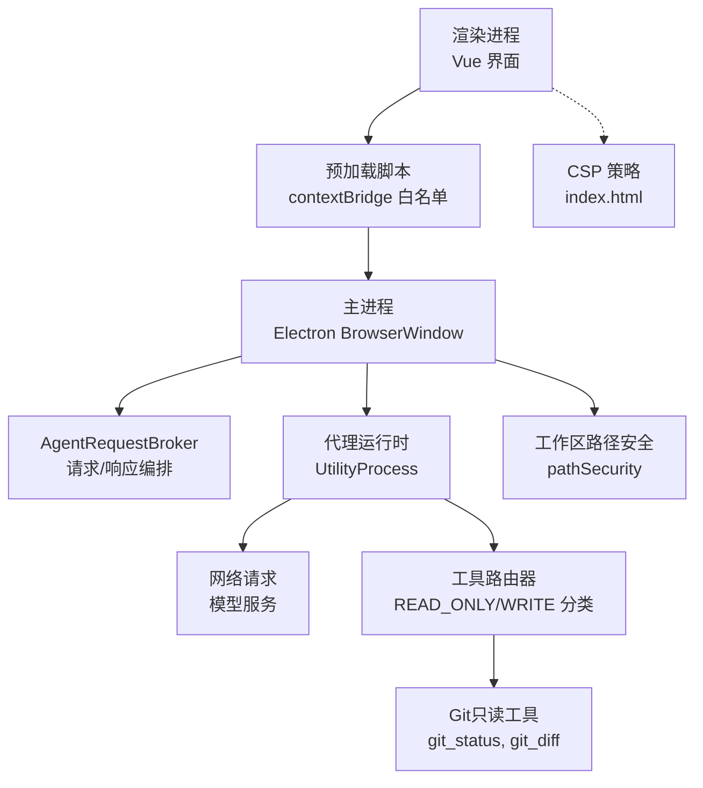
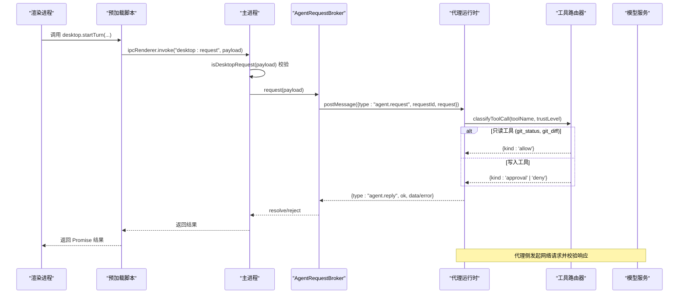
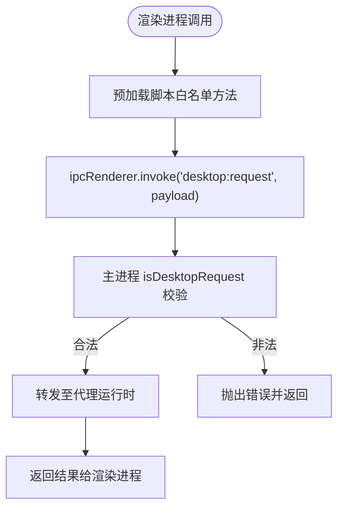
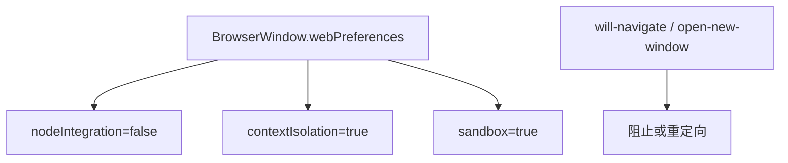
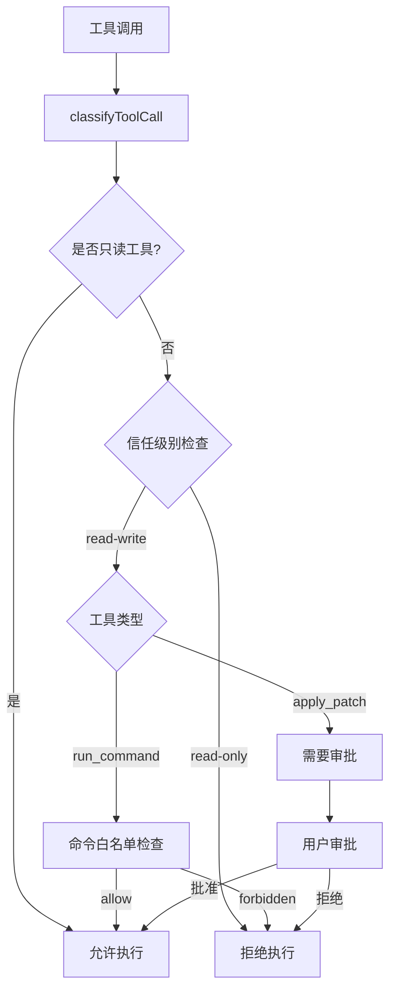
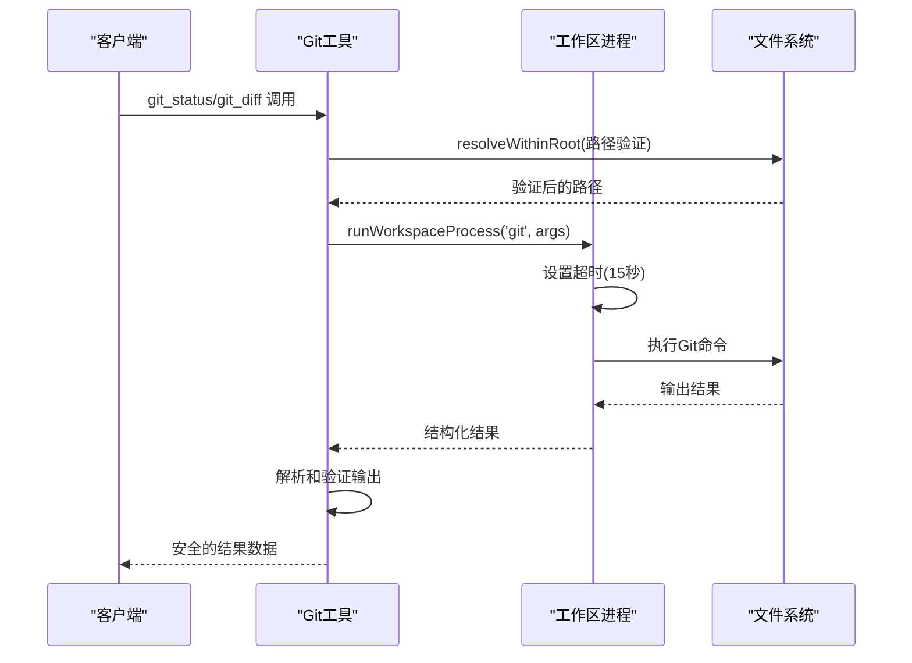
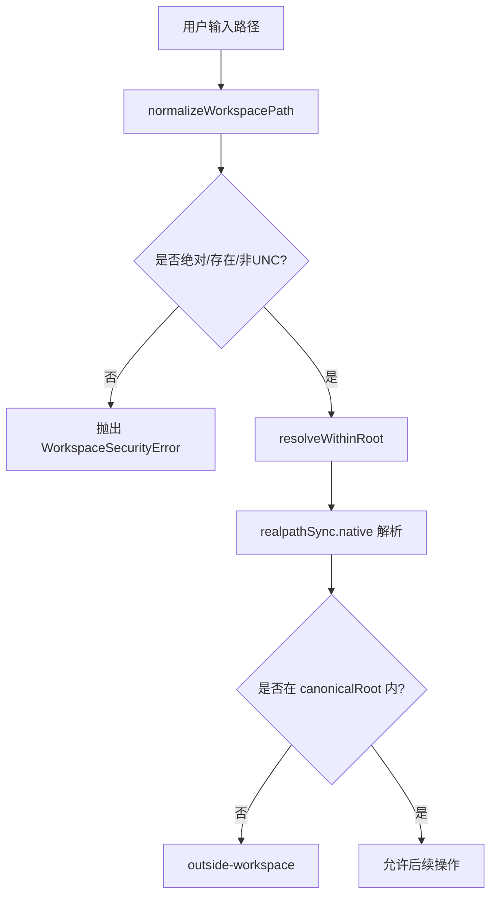
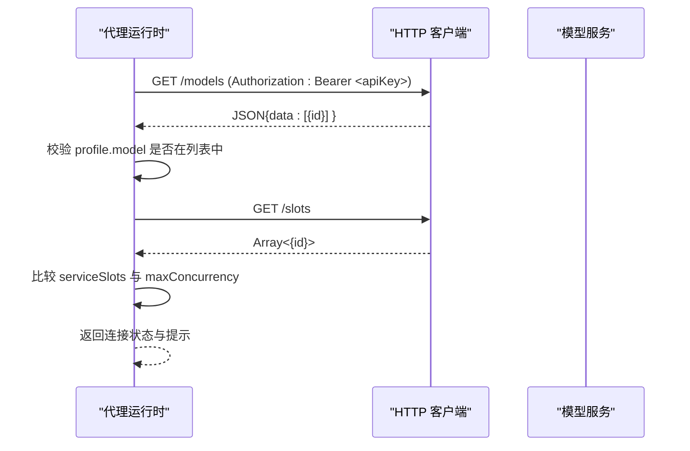
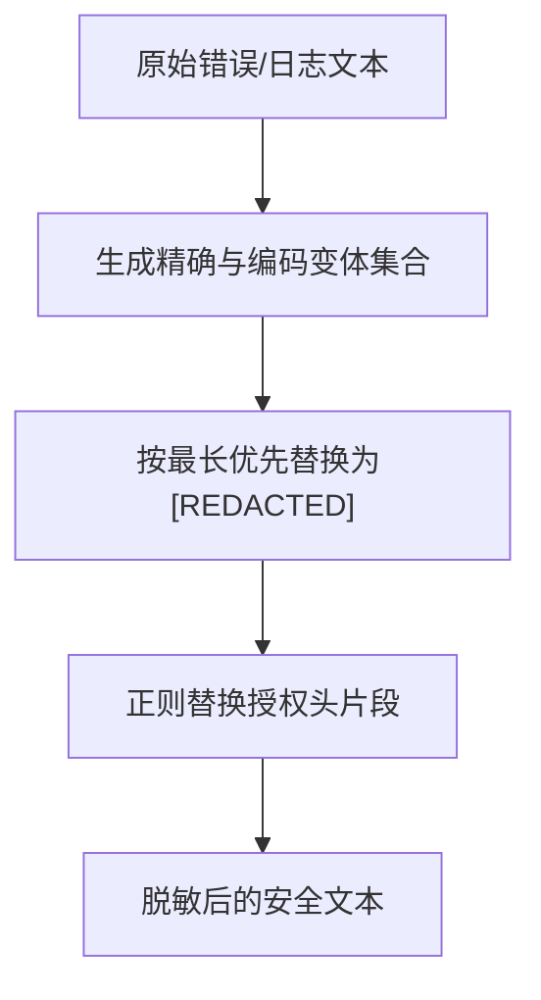
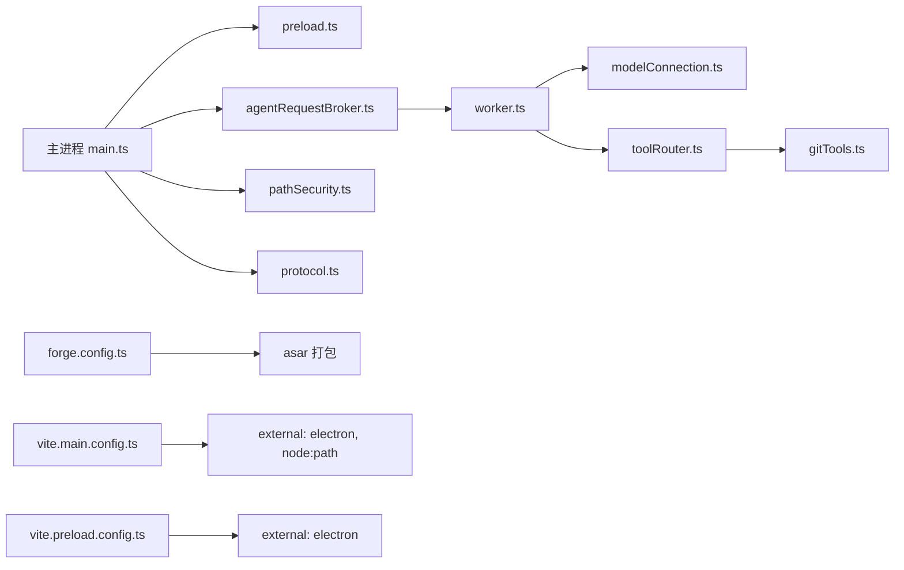

# 安全模型

<cite>
**本文引用的文件**
- [src/main.ts](file://src/main.ts)
- [src/preload.ts](file://src/preload.ts)
- [src/shared/protocol.ts](file://src/shared/protocol.ts)
- [src/shared/redaction.ts](file://src/shared/redaction.ts)
- [src/agent/workspace/pathSecurity.ts](file://src/agent/workspace/pathSecurity.ts)
- [src/agent/modelConnection.ts](file://src/agent/modelConnection.ts)
- [src/main/agentRequestBroker.ts](file://src/main/agentRequestBroker.ts)
- [src/agent/tools/toolRouter.ts](file://src/agent/tools/toolRouter.ts)
- [src/agent/tools/gitTools.ts](file://src/agent/tools/gitTools.ts)
- [src/agent/agentLoop.ts](file://src/agent/agentLoop.ts)
- [tests/gitTools.test.ts](file://tests/gitTools.test.ts)
- [index.html](file://index.html)
- [forge.config.ts](file://forge.config.ts)
- [vite.main.config.ts](file://vite.main.config.ts)
- [vite.preload.config.ts](file://vite.preload.config.ts)
- [package.json](file://package.json)
</cite>

## 更新摘要
**所做更改**
- 更新了工具分类系统，新增Git只读工具（git_status、git_diff）的安全策略
- 增强了权限模型，支持在任何信任级别下执行安全的只读Git操作
- 完善了工具路由器的信任级别检查机制
- 添加了Git工具的安全边界和执行策略说明

## 目录
1. [简介](#简介)
2. [项目结构](#项目结构)
3. [核心组件](#核心组件)
4. [架构总览](#架构总览)
5. [详细组件分析](#详细组件分析)
6. [依赖关系分析](#依赖关系分析)
7. [性能与安全权衡](#性能与安全权衡)
8. [故障排查指南](#故障排查指南)
9. [结论](#结论)
10. [附录：配置与加固清单](#附录配置与加固清单)

## 简介
本文件为 Private AI Desktop 的安全架构文档，聚焦 Electron 应用的安全最佳实践、预加载脚本边界、文件系统访问控制、路径安全验证与沙箱机制、敏感信息脱敏与日志安全、网络请求与 API 密钥管理、认证机制、权限模型与审计日志、以及 XSS/CSRF 防护和输入校验。目标是帮助开发者与维护者在保证功能的同时，构建可审计、可防御、可演进的安全体系。

## 项目结构
本项目采用多进程架构：
- 主进程（main）：负责窗口生命周期、IPC 路由、代理运行时进程管理与消息通道。
- 渲染进程（renderer）：基于 Vue 的前端界面，受严格 CSP 与上下文隔离保护。
- 预加载脚本（preload）：通过 contextBridge 暴露最小化 API，作为渲染进程与主进程的信任边界。
- 代理运行时（agent worker）：独立 UtilityProcess，承载业务逻辑与外部交互，通过 MessageChannelMain 与主进程通信。
- 共享协议与类型（shared）：定义 IPC 契约、数据模型与脱敏工具。

图表来源
- [src/main.ts:56-95](file://src/main.ts#L56-L95)
- [src/preload.ts:5-31](file://src/preload.ts#L5-L31)
- [src/main/agentRequestBroker.ts:15-85](file://src/main/agentRequestBroker.ts#L15-L85)
- [src/agent/tools/toolRouter.ts:72-82](file://src/agent/tools/toolRouter.ts#L72-L82)
- [src/agent/tools/gitTools.ts:1-11](file://src/agent/tools/gitTools.ts#L1-L11)
- [src/agent/workspace/pathSecurity.ts:96-191](file://src/agent/workspace/pathSecurity.ts#L96-L191)
- [index.html:5-8](file://index.html#L5-L8)

章节来源
- [src/main.ts:56-95](file://src/main.ts#L56-L95)
- [src/preload.ts:5-31](file://src/preload.ts#L5-L31)
- [index.html:5-8](file://index.html#L5-L8)
- [forge.config.ts:10-18](file://forge.config.ts#L10-L18)

## 核心组件
- 预加载脚本：仅暴露必要桌面能力，所有调用均经 IPC 白名单校验。
- 主进程入口：启用 nodeIntegration=false、contextIsolation=true、sandbox=true；限制新窗口打开与导航；启动代理运行时并建立可靠的消息通道。
- 协议校验层：对 IPC 请求与事件进行强类型与值域校验，拒绝非法载荷。
- 工具分类系统：将工具分为只读（READ_ONLY）和写入（WRITE）两类，Git只读工具可在任何信任级别下执行。
- 路径安全模块：规范化工作区根路径，强制解析真实路径，阻止设备路径、UNC 根与越界访问；提供排除目录与文件模式。
- 网络连接检查：在代理侧发起对外请求，使用 AbortSignal 控制超时与取消，严格校验响应结构与模型标识。
- 敏感信息脱敏：统一将错误信息与日志中的敏感片段替换为占位符，覆盖多种编码形式与常见头字段。

章节来源
- [src/preload.ts:5-31](file://src/preload.ts#L5-L31)
- [src/main.ts:56-108](file://src/main.ts#L56-L108)
- [src/shared/protocol.ts:274-316](file://src/shared/protocol.ts#L274-L316)
- [src/agent/tools/toolRouter.ts:72-82](file://src/agent/tools/toolRouter.ts#L72-L82)
- [src/agent/workspace/pathSecurity.ts:96-191](file://src/agent/workspace/pathSecurity.ts#L96-L191)
- [src/agent/modelConnection.ts:11-91](file://src/agent/modelConnection.ts#L11-L91)
- [src/shared/redaction.ts:1-33](file://src/shared/redaction.ts#L1-L33)

## 架构总览
下图展示从渲染进程到代理运行时的安全通信流，强调白名单 IPC、协议校验、沙箱隔离与外部网络访问的边界。

图表来源
- [src/preload.ts:15-16](file://src/preload.ts#L15-L16)
- [src/main.ts:103-108](file://src/main.ts#L103-L108)
- [src/shared/protocol.ts:274-316](file://src/shared/protocol.ts#L274-L316)
- [src/main/agentRequestBroker.ts:33-63](file://src/main/agentRequestBroker.ts#L33-L63)
- [src/agent/tools/toolRouter.ts:100-160](file://src/agent/tools/toolRouter.ts#L100-L160)
- [src/agent/modelConnection.ts:11-91](file://src/agent/modelConnection.ts#L11-L91)

## 详细组件分析

### 预加载脚本与信任边界
- 通过 contextBridge.exposeInMainWorld 暴露最小 API 集合，避免直接暴露 Node/Electron 能力。
- 所有方法均通过 ipcRenderer.invoke 转发至主进程，由主进程进行协议校验后处理。
- 订阅事件时包装监听器并返回清理函数，防止内存泄漏与重复绑定。

图表来源
- [src/preload.ts:5-31](file://src/preload.ts#L5-L31)
- [src/shared/protocol.ts:274-316](file://src/shared/protocol.ts#L274-L316)

章节来源
- [src/preload.ts:5-31](file://src/preload.ts#L5-L31)
- [src/shared/protocol.ts:274-316](file://src/shared/protocol.ts#L274-L316)

### 主进程安全配置与窗口策略
- 禁用 Node 集成、启用上下文隔离与沙箱，降低渲染进程攻击面。
- 禁止新窗口打开（重定向到系统浏览器），拦截非预期导航。
- 仅暴露健康检查与受限桌面请求接口。

图表来源
- [src/main.ts:56-81](file://src/main.ts#L56-L81)

章节来源
- [src/main.ts:56-81](file://src/main.ts#L56-L81)

### 工具分类系统与信任级别控制
**更新** 新增了Git只读工具的分类和安全策略

工具分类系统将工具分为两类：
- **只读工具（READ_ONLY_TOOL_NAMES）**：workspace_tree、read_file、search_code、git_status、git_diff - 可在任何信任级别下执行，无需用户审批
- **写入工具（WRITE_TOOL_NAMES）**：apply_patch、run_command - 需要读写信任级别，可能需要用户审批

Git只读工具的安全特性：
- git_status：检查工作区状态，包括分支信息、暂存区和未暂存的更改
- git_diff：显示工作区或暂存区的差异，支持路径过滤
- 两者都通过 runWorkspaceProcess 执行，具有相同的超时、输出限制和取消机制

图表来源
- [src/agent/tools/toolRouter.ts:72-82](file://src/agent/tools/toolRouter.ts#L72-L82)
- [src/agent/tools/toolRouter.ts:100-160](file://src/agent/tools/toolRouter.ts#L100-L160)

章节来源
- [src/agent/tools/toolRouter.ts:72-82](file://src/agent/tools/toolRouter.ts#L72-L82)
- [src/agent/tools/toolRouter.ts:100-160](file://src/agent/tools/toolRouter.ts#L100-L160)
- [src/agent/agentLoop.ts:96-138](file://src/agent/agentLoop.ts#L96-L138)

### Git只读工具实现与安全边界
**新增** Git只读工具的详细实现和安全措施

Git只读工具提供了安全的仓库检查能力：
- **git_status**：返回工作区状态，包括分支信息、上游跟踪、前进/落后计数和文件条目
- **git_diff**：生成统一差异格式的输出，支持查看暂存区或工作区的更改

安全措施：
- 通过 runWorkspaceProcess 执行，继承命令执行的所有限制
- 15秒超时保护，防止长时间运行的Git操作
- 输出字节限制和截断机制
- 路径安全检查，防止工作区逃逸
- 非Git仓库的优雅降级处理

图表来源
- [src/agent/tools/gitTools.ts:101-118](file://src/agent/tools/gitTools.ts#L101-L118)
- [src/agent/tools/gitTools.ts:136-187](file://src/agent/tools/gitTools.ts#L136-L187)

章节来源
- [src/agent/tools/gitTools.ts:1-187](file://src/agent/tools/gitTools.ts#L1-L187)
- [tests/gitTools.test.ts:134-141](file://tests/gitTools.test.ts#L134-L141)
- [tests/gitTools.test.ts:210-217](file://tests/gitTools.test.ts#L210-L217)

### 工作区路径安全与沙箱机制
- 规范化工作区根路径：拒绝空路径、设备路径、UNC 根；解析真实路径并标准化驱动盘符。
- 路径包含性检查：先解析真实路径再判断是否在根内，防止符号链接/联合挂载逃逸。
- 排除列表：默认屏蔽依赖树、版本控制、构建缓存与敏感锁文件等。

图表来源
- [src/agent/workspace/pathSecurity.ts:96-125](file://src/agent/workspace/pathSecurity.ts#L96-L125)
- [src/agent/workspace/pathSecurity.ts:175-191](file://src/agent/workspace/pathSecurity.ts#L175-L191)

章节来源
- [src/agent/workspace/pathSecurity.ts:96-125](file://src/agent/workspace/pathSecurity.ts#L96-L125)
- [src/agent/workspace/pathSecurity.ts:175-191](file://src/agent/workspace/pathSecurity.ts#L175-L191)

### 网络请求安全与 API 密钥管理
- 代理运行时负责对外网络访问，主进程不直接暴露网络能力给渲染进程。
- 连接检查流程：构造请求头（可选 Bearer Token）、获取模型元数据、校验模型 ID、查询槽位并发数并对比客户端配置。
- 使用 AbortSignal 确保请求可被取消，避免资源泄露与竞态。

图表来源
- [src/agent/modelConnection.ts:11-91](file://src/agent/modelConnection.ts#L11-L91)

章节来源
- [src/agent/modelConnection.ts:11-91](file://src/agent/modelConnection.ts#L11-L91)

### 敏感信息脱敏与日志安全
- 统一脱敏函数支持精确匹配与多种编码变体（JSON 转义、百分号编码、表单空格）。
- 自动识别并替换 Authorization/Bearer 相关片段，避免凭据泄露。
- 错误文本输出前进行长度截断与空白归一化，减少日志体积与噪声。

图表来源
- [src/shared/redaction.ts:1-33](file://src/shared/redaction.ts#L1-L33)
- [src/shared/redaction.ts:40-107](file://src/shared/redaction.ts#L40-L107)

章节来源
- [src/shared/redaction.ts:1-33](file://src/shared/redaction.ts#L1-L33)
- [src/shared/redaction.ts:40-107](file://src/shared/redaction.ts#L40-L107)

### 权限模型、访问控制与审计日志
- 权限模型：工作区注册时声明信任级别（只读/读写）与网络策略（禁用/白名单），用于约束后续工具与网络行为。
- 访问控制：路径安全模块对所有工具级路径访问进行强制校验，拒绝越界与危险路径。
- 审计日志：建议在工作区变更、模型配置更新、审批动作处记录结构化日志（主体、动作、时间、结果），并在输出前进行脱敏。

章节来源
- [src/shared/domain.ts:277-292](file://src/shared/domain.ts#L277-L292)
- [src/agent/workspace/pathSecurity.ts:193-223](file://src/agent/workspace/pathSecurity.ts#L193-L223)

### XSS 与 CSRF 防护、输入验证
- CSP：通过 index.html 的 Content-Security-Policy 限制脚本、样式、连接源，仅允许本地与必要的开发端口。
- 输入验证：所有 IPC 请求与事件均经过 isDesktopRequest/isAgentEvent 强类型与值域校验，拒绝非法字段与越界值。
- 渲染隔离：contextIsolation + sandbox 阻断 DOM 注入与 Node 能力滥用。

章节来源
- [index.html:5-8](file://index.html#L5-L8)
- [src/shared/protocol.ts:274-371](file://src/shared/protocol.ts#L274-L371)
- [src/main.ts:56-81](file://src/main.ts#L56-L81)

## 依赖关系分析
- 主进程依赖：
  - 预加载脚本：通过 preload 路径注入，提供最小 API。
  - 代理运行时：通过 MessageChannelMain 建立双向通道，使用 AgentRequestBroker 管理请求与超时。
  - 路径安全：所有工作区路径操作必须经由 pathSecurity 模块。
  - 协议层：所有 IPC 载荷必须满足 shared/protocol 的类型与值域约束。
- 构建与打包：
  - Vite 配置将 electron 与 node:path 标记为 external，避免污染主进程环境。
  - Forge 打包启用 asar，忽略非必要文件，提升安全性与分发效率。

图表来源
- [src/main.ts:1-4](file://src/main.ts#L1-L4)
- [src/main/agentRequestBroker.ts:15-85](file://src/main/agentRequestBroker.ts#L15-L85)
- [src/agent/workspace/pathSecurity.ts:96-191](file://src/agent/workspace/pathSecurity.ts#L96-L191)
- [src/shared/protocol.ts:274-371](file://src/shared/protocol.ts#L274-L371)
- [src/agent/tools/toolRouter.ts:62-82](file://src/agent/tools/toolRouter.ts#L62-L82)
- [src/agent/tools/gitTools.ts:13-17](file://src/agent/tools/gitTools.ts#L13-L17)
- [forge.config.ts:10-18](file://forge.config.ts#L10-L18)
- [vite.main.config.ts:3-8](file://vite.main.config.ts#L3-L8)
- [vite.preload.config.ts:3-8](file://vite.preload.config.ts#L3-L8)

章节来源
- [src/main.ts:1-4](file://src/main.ts#L1-L4)
- [forge.config.ts:10-18](file://forge.config.ts#L10-L18)
- [vite.main.config.ts:3-8](file://vite.main.config.ts#L3-L8)
- [vite.preload.config.ts:3-8](file://vite.preload.config.ts#L3-L8)

## 性能与安全权衡
- 沙箱与上下文隔离：提高安全性但可能影响调试与第三方库兼容性，需通过白名单 API 逐步扩展。
- 路径规范化与 realpath：增强安全性但引入额外 I/O 开销，建议在批量操作中复用已解析路径。
- 网络请求超时与取消：避免资源泄露，需在 UI 层提供明确的用户反馈与重试策略。
- 脱敏与日志裁剪：降低敏感信息泄露风险，同时控制日志大小与检索成本。
- Git只读工具优化：通过分类系统减少不必要的审批流程，提高只读操作的执行效率。

## 故障排查指南
- IPC 请求失败：
  - 检查 isDesktopRequest 是否返回 false，确认 type 与字段是否符合协议定义。
  - 查看主进程日志中"Invalid desktop request."异常来源。
- 代理运行时未就绪：
  - 检查 AgentRequestBroker.pendingCount 与超时设置，确认端口连接与消息通道正常。
- 工具调用被拒绝：
  - 检查工具是否在 READ_ONLY_TOOL_NAMES 或 WRITE_TOOL_NAMES 中正确分类。
  - 确认工作区的 trustLevel 是否允许该工具的执行。
- Git工具相关问题：
  - 检查工作区是否为有效的Git仓库。
  - 验证Git命令是否超时或被取消。
  - 确认路径过滤器不会导致工作区逃逸。
- 路径访问被拒：
  - 根据 WorkspaceSecurityError.code 定位原因（not-absolute、device-path、unc-root、outside-workspace）。
- 网络连接问题：
  - 检查 baseUrl、apiKey 是否正确；确认 /models 与 /slots 可达且返回结构符合预期。
- 敏感信息泄露：
  - 确认错误文本与日志输出使用了 safeErrorText/redactSensitiveText，并传入正确的 secrets 列表。

章节来源
- [src/main.ts:103-108](file://src/main.ts#L103-L108)
- [src/main/agentRequestBroker.ts:33-63](file://src/main/agentRequestBroker.ts#L33-L63)
- [src/agent/tools/toolRouter.ts:100-160](file://src/agent/tools/toolRouter.ts#L100-L160)
- [src/agent/tools/gitTools.ts:120-134](file://src/agent/tools/gitTools.ts#L120-L134)
- [src/agent/workspace/pathSecurity.ts:22-30](file://src/agent/workspace/pathSecurity.ts#L22-L30)
- [src/agent/modelConnection.ts:11-91](file://src/agent/modelConnection.ts#L11-L91)
- [src/shared/redaction.ts:1-33](file://src/shared/redaction.ts#L1-L33)

## 结论
Private AI Desktop 通过严格的预加载白名单、协议校验、路径安全与沙箱机制，构建了清晰的信任边界与最小权限模型。新增的Git只读工具分类系统进一步增强了安全模型，允许安全的只读Git操作在任何信任级别下执行，同时保持了对写入操作的严格控制。代理运行时集中处理网络与业务逻辑，结合脱敏与审计能力，有效降低敏感信息泄露与外部攻击面。建议在生产环境中持续强化 CSP、完善审计日志与权限策略，并定期评估威胁模型与漏洞修复。

## 附录：配置与加固清单
- 构建与打包
  - 启用 asar 打包，忽略不必要文件，减少攻击面。
  - 将 electron、node:path 标记为 external，避免污染主进程环境。
- 窗口与导航
  - 保持 nodeIntegration=false、contextIsolation=true、sandbox=true。
  - 禁止新窗口打开，拦截非预期导航。
- 预加载与 IPC
  - 仅暴露最小 API，所有调用经主进程协议校验。
  - 对事件订阅提供清理函数，防止内存泄漏。
- 工具分类与权限
  - 维护 READ_ONLY_TOOL_NAMES 和 WRITE_TOOL_NAMES 的准确分类。
  - 确保Git只读工具（git_status、git_diff）的安全实现。
  - 根据工作区信任级别控制工具执行权限。
- 路径安全
  - 所有工具级路径访问必须通过 pathSecurity 模块。
  - 维护排除目录与文件模式，定期审查。
- 网络与密钥
  - 仅在代理侧发起网络请求，使用 AbortSignal 控制超时与取消。
  - 校验模型元数据与服务槽位，避免误配导致的安全风险。
- 脱敏与日志
  - 所有错误与日志输出前进行脱敏，限制长度与噪声。
  - 记录关键操作的审计日志（主体、动作、时间、结果），并进行脱敏。
- 权限与审计
  - 工作区注册时声明信任级别与网络策略。
  - 对模型配置更新、审批动作等进行审计记录。

章节来源
- [forge.config.ts:10-18](file://forge.config.ts#L10-L18)
- [vite.main.config.ts:3-8](file://vite.main.config.ts#L3-L8)
- [vite.preload.config.ts:3-8](file://vite.preload.config.ts#L3-L8)
- [src/main.ts:56-81](file://src/main.ts#L56-L81)
- [src/preload.ts:5-31](file://src/preload.ts#L5-L31)
- [src/agent/tools/toolRouter.ts:72-82](file://src/agent/tools/toolRouter.ts#L72-L82)
- [src/agent/tools/gitTools.ts:1-187](file://src/agent/tools/gitTools.ts#L1-L187)
- [src/agent/workspace/pathSecurity.ts:96-191](file://src/agent/workspace/pathSecurity.ts#L96-L191)
- [src/agent/modelConnection.ts:11-91](file://src/agent/modelConnection.ts#L11-L91)
- [src/shared/redaction.ts:1-33](file://src/shared/redaction.ts#L1-L33)
- [src/shared/domain.ts:277-292](file://src/shared/domain.ts#L277-L292)