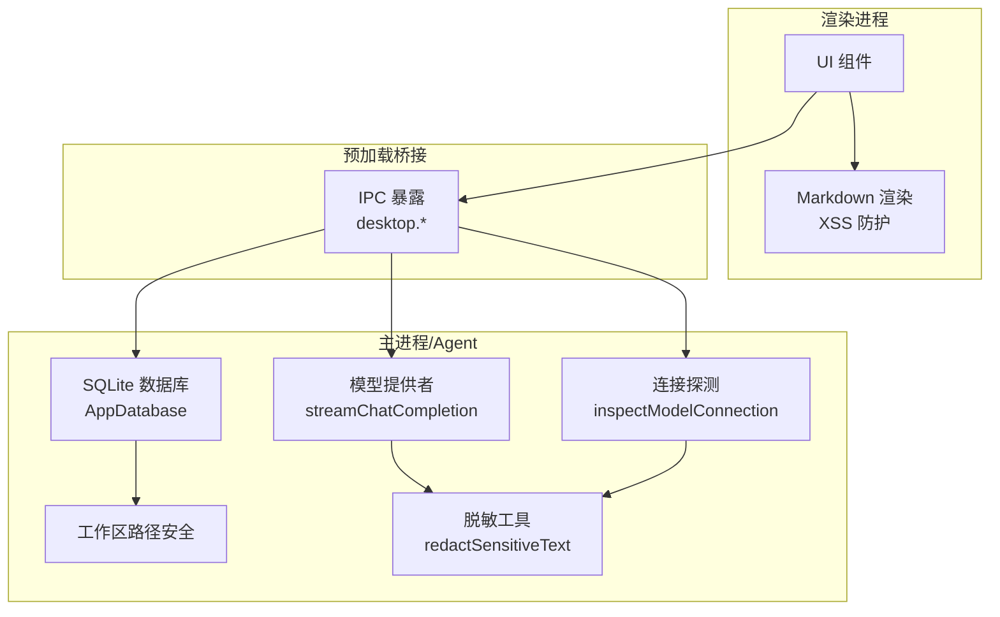
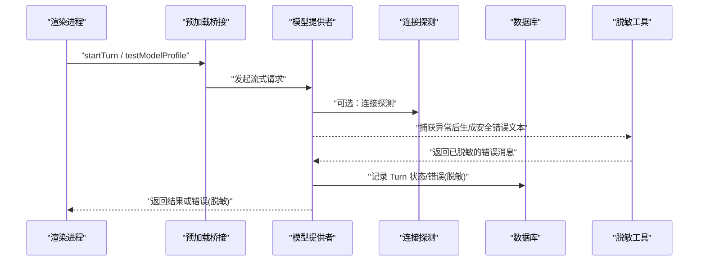
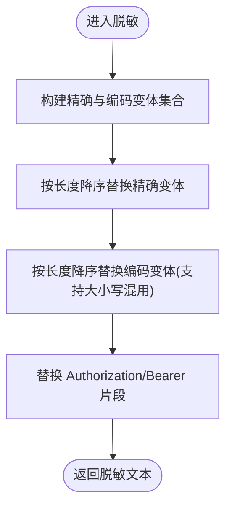
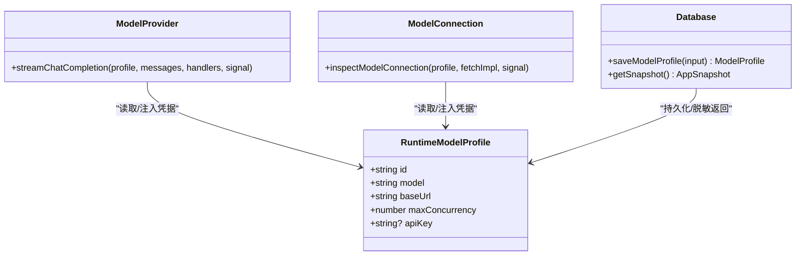
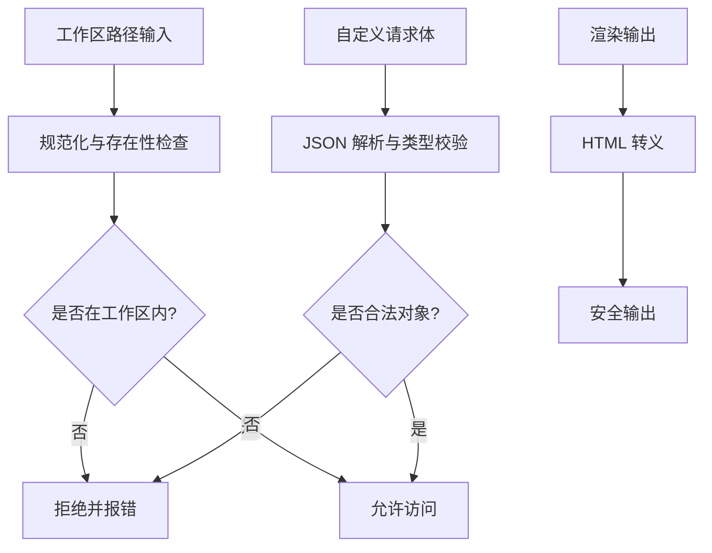
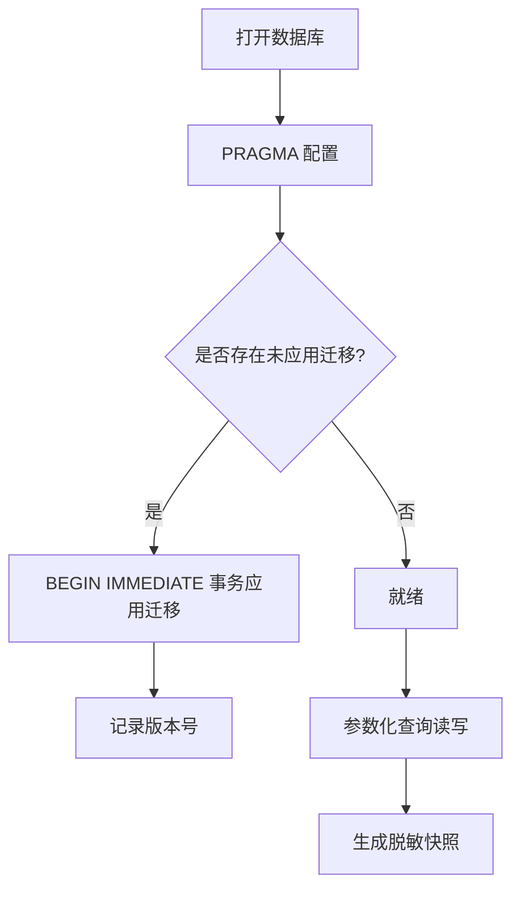
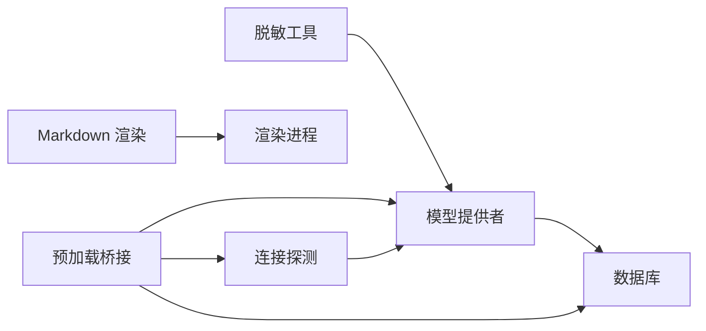

# 数据安全

<cite>
**本文引用的文件**
- [src/shared/redaction.ts](file://src/shared/redaction.ts)
- [src/agent/modelProvider.ts](file://src/agent/modelProvider.ts)
- [src/agent/modelConnection.ts](file://src/agent/modelConnection.ts)
- [src/agent/database.ts](file://src/agent/database.ts)
- [src/agent/workspace/pathSecurity.ts](file://src/agent/workspace/pathSecurity.ts)
- [src/renderer/markdown.ts](file://src/renderer/markdown.ts)
- [src/preload.ts](file://src/preload.ts)
- [tests/e2e/app.spec.ts](file://tests/e2e/app.spec.ts)
- [tests/redaction.test.ts](file://tests/redaction.test.ts)
</cite>

## 目录
1. [简介](#简介)
2. [项目结构](#项目结构)
3. [核心组件](#核心组件)
4. [架构总览](#架构总览)
5. [详细组件分析](#详细组件分析)
6. [依赖关系分析](#依赖关系分析)
7. [性能与安全权衡](#性能与安全权衡)
8. [故障排查指南](#故障排查指南)
9. [结论](#结论)
10. [附录：配置与合规清单](#附录配置与合规清单)

## 简介
本文件面向 Private AI Desktop 的数据安全机制，聚焦以下方面：敏感信息脱敏、日志与错误输出安全、数据加密存储与传输安全、API 密钥与凭据保护、会话与上下文安全、输入验证与输出编码（XSS 防护）、数据生命周期与保留策略、数据库安全与 SQL 注入防护、威胁检测与可观测性。文档基于仓库中的实际实现进行说明，并提供可视化图示与排障建议。

## 项目结构
本项目采用主进程/渲染进程/预加载桥接的 Electron 架构，Agent 侧负责模型调用、持久化与工具执行；共享层提供类型与通用安全能力；渲染层负责 UI 渲染与 XSS 防护。关键安全相关位置如下：
- 敏感信息脱敏：shared/redaction.ts
- 模型请求与错误处理：agent/modelProvider.ts
- 连接探测与凭据传递：agent/modelConnection.ts
- 本地 SQLite 持久化与快照：agent/database.ts
- 工作区路径安全：agent/workspace/pathSecurity.ts
- 前端 Markdown 渲染与 XSS 防护：renderer/markdown.ts
- 渲染进程到主进程的 IPC 暴露：preload.ts
- 端到端断言（包含 API Key 不泄露）：tests/e2e/app.spec.ts、tests/redaction.test.ts

**图表来源**
- [src/preload.ts:5-35](file://src/preload.ts#L5-L35)
- [src/agent/modelProvider.ts:55-197](file://src/agent/modelProvider.ts#L55-L197)
- [src/agent/modelConnection.ts:11-91](file://src/agent/modelConnection.ts#L11-L91)
- [src/agent/database.ts:150-737](file://src/agent/database.ts#L150-L737)
- [src/agent/workspace/pathSecurity.ts:96-191](file://src/agent/workspace/pathSecurity.ts#L96-L191)
- [src/shared/redaction.ts:1-33](file://src/shared/redaction.ts#L1-L33)
- [src/renderer/markdown.ts:1-116](file://src/renderer/markdown.ts#L1-L116)

**章节来源**
- [src/preload.ts:5-35](file://src/preload.ts#L5-L35)
- [src/agent/modelProvider.ts:55-197](file://src/agent/modelProvider.ts#L55-L197)
- [src/agent/modelConnection.ts:11-91](file://src/agent/modelConnection.ts#L11-L91)
- [src/agent/database.ts:150-737](file://src/agent/database.ts#L150-L737)
- [src/agent/workspace/pathSecurity.ts:96-191](file://src/agent/workspace/pathSecurity.ts#L96-L191)
- [src/shared/redaction.ts:1-33](file://src/shared/redaction.ts#L1-L33)
- [src/renderer/markdown.ts:1-116](file://src/renderer/markdown.ts#L1-L116)

## 核心组件
- 敏感信息脱敏器：对错误消息、日志和事件中的敏感值进行多形态替换，覆盖原始字符串、JSON 转义、URL/Form 编码以及 Authorization/Bearer 头片段。
- 模型提供者：在发起网络请求时注入凭据，并在异常路径统一使用脱敏后的错误文本，避免密钥泄漏。
- 连接探测：校验模型端点可用性并读取服务槽位，同样携带凭据但仅用于连通性检查。
- 数据库层：使用参数化查询、事务与迁移；对外暴露快照时剥离 API Key；工作区路径强制规范化与边界检查。
- 渲染层：Markdown 渲染时对代码块与内联内容做 HTML 转义，防止 XSS。
- IPC 桥接：最小化暴露桌面能力，将渲染进程操作转发至主进程 Agent。

**章节来源**
- [src/shared/redaction.ts:1-33](file://src/shared/redaction.ts#L1-L33)
- [src/agent/modelProvider.ts:55-197](file://src/agent/modelProvider.ts#L55-L197)
- [src/agent/modelConnection.ts:11-91](file://src/agent/modelConnection.ts#L11-L91)
- [src/agent/database.ts:150-737](file://src/agent/database.ts#L150-L737)
- [src/renderer/markdown.ts:1-116](file://src/renderer/markdown.ts#L1-L116)
- [src/preload.ts:5-35](file://src/preload.ts#L5-L35)

## 架构总览
下图展示一次带错误的模型调用如何确保敏感信息不被记录或回显：

**图表来源**
- [src/agent/modelProvider.ts:55-197](file://src/agent/modelProvider.ts#L55-L197)
- [src/agent/modelConnection.ts:11-91](file://src/agent/modelConnection.ts#L11-L91)
- [src/agent/database.ts:360-464](file://src/agent/database.ts#L360-L464)
- [src/shared/redaction.ts:1-33](file://src/shared/redaction.ts#L1-L33)

## 详细组件分析

### 敏感信息脱敏与日志安全
- 算法要点
  - 精确匹配：直接替换原文中的敏感串。
  - JSON 转义变体：对敏感串进行多层 JSON.stringify 并加入反斜杠转义变体集合，以覆盖常见序列化形式。
  - URL/Form 编码变体：生成 percent-encoded 与 form-encoded（空格为 +）的多层编码候选，并允许十六进制大小写混用匹配。
  - 头部片段匹配：通过正则匹配 Authorization/Bearer 等片段，将其整体替换为占位符。
- 使用位置
  - 模型调用异常路径：将错误消息经脱敏后再抛出/记录。
  - 测试用例覆盖多种编码形态，确保不会因编码差异导致泄漏。

**图表来源**
- [src/shared/redaction.ts:14-33](file://src/shared/redaction.ts#L14-L33)
- [src/shared/redaction.ts:40-111](file://src/shared/redaction.ts#L40-L111)

**章节来源**
- [src/shared/redaction.ts:1-112](file://src/shared/redaction.ts#L1-L112)
- [tests/redaction.test.ts:1-40](file://tests/redaction.test.ts#L1-L40)
- [tests/e2e/app.spec.ts:416-452](file://tests/e2e/app.spec.ts#L416-L452)
- [tests/e2e/app.spec.ts:651-674](file://tests/e2e/app.spec.ts#L651-L674)

### 认证凭据保护与会话安全
- API 密钥注入
  - 模型连接探测与流式请求均在请求头中注入 Bearer 令牌，仅在必要范围使用。
- 凭据最小化暴露
  - 数据库保存模型配置时写入 api_key 字段，但对外返回快照/运行时对象时剥离该字段，避免误导出。
  - 错误消息统一走脱敏流程，避免在日志、UI 或事件中出现密钥。
- 会话与上下文
  - 长上下文压缩与重试逻辑在内存中聚合，最终落库为逻辑项而非逐 token 行，降低中间态泄漏面。
  - 中断恢复仅标记未完成状态，不自动重放工具调用，避免重复副作用。

**图表来源**
- [src/agent/modelProvider.ts:55-197](file://src/agent/modelProvider.ts#L55-L197)
- [src/agent/modelConnection.ts:11-91](file://src/agent/modelConnection.ts#L11-L91)
- [src/agent/database.ts:541-621](file://src/agent/database.ts#L541-L621)
- [src/agent/database.ts:156-216](file://src/agent/database.ts#L156-L216)

**章节来源**
- [src/agent/modelProvider.ts:55-197](file://src/agent/modelProvider.ts#L55-L197)
- [src/agent/modelConnection.ts:11-91](file://src/agent/modelConnection.ts#L11-L91)
- [src/agent/database.ts:541-621](file://src/agent/database.ts#L541-L621)
- [src/agent/database.ts:156-216](file://src/agent/database.ts#L156-L216)

### 输入验证、输出编码与 XSS 防护
- 输入验证
  - 工作区路径必须为绝对路径，拒绝设备路径与 UNC 根，解析符号链接后进行边界检查，确保所有工具访问限定在工作区内。
  - 自定义请求体验证：仅接受合法 JSON 对象，拒绝数组与非法结构。
- 输出编码
  - Markdown 渲染中对代码块与内联文本进行 HTML 转义，避免脚本注入。
- 其他
  - 模型能力与推理模式选择经过白名单校验，防止非法参数下发。

**图表来源**
- [src/agent/workspace/pathSecurity.ts:96-191](file://src/agent/workspace/pathSecurity.ts#L96-L191)
- [src/renderer/modelProfileForm.ts:283-358](file://src/renderer/modelProfileForm.ts#L283-L358)
- [src/renderer/markdown.ts:1-116](file://src/renderer/markdown.ts#L1-L116)

**章节来源**
- [src/agent/workspace/pathSecurity.ts:96-191](file://src/agent/workspace/pathSecurity.ts#L96-L191)
- [src/renderer/modelProfileForm.ts:283-358](file://src/renderer/modelProfileForm.ts#L283-L358)
- [src/renderer/markdown.ts:1-116](file://src/renderer/markdown.ts#L1-L116)

### 数据生命周期管理、隐私保护与保留策略
- 数据落地
  - 对话线程、消息、推理过程、审批、模型配置与工作区均持久化于 SQLite。
  - 流式片段在内存聚合后以逻辑项落库，减少冗余与泄漏风险。
- 隐私保护
  - 快照与外部可见对象不包含 API Key；错误消息统一脱敏。
  - 工作区访问限制在用户信任范围内，排除敏感目录与锁文件。
- 保留策略
  - 当前实现未内置定时清理策略；可通过定期任务删除过期线程/群组或归档历史。
  - 建议结合业务需求增加“最大保留时长”“自动归档/删除”策略。

**章节来源**
- [src/agent/database.ts:156-216](file://src/agent/database.ts#L156-L216)
- [src/agent/database.ts:360-464](file://src/agent/database.ts#L360-L464)
- [src/agent/workspace/pathSecurity.ts:32-56](file://src/agent/workspace/pathSecurity.ts#L32-L56)
- [docs/superpowers/specs/2026-08-17-provider-capabilities-concurrent-turns-design.md:208-233](file://docs/superpowers/specs/2026-08-17-provider-capabilities-concurrent-turns-design.md#L208-L233)

### 数据库安全配置、查询参数化与 SQL 注入防护
- 安全配置
  - 启用 WAL 日志模式、外键约束、忙等待超时，提升并发与一致性。
- 参数化查询
  - 所有写入与更新均使用命名参数绑定，避免拼接 SQL。
- 迁移与版本控制
  - 通过 schema_migrations 表管理版本，迁移以事务方式应用，保证一致性。
- 快照脱敏
  - 对外快照不包含 API Key，仅内部运行态可附带。

**图表来源**
- [src/agent/database.ts:731-737](file://src/agent/database.ts#L731-L737)
- [src/agent/database.ts:739-800](file://src/agent/database.ts#L739-L800)
- [src/agent/database.ts:156-216](file://src/agent/database.ts#L156-L216)

**章节来源**
- [src/agent/database.ts:731-737](file://src/agent/database.ts#L731-L737)
- [src/agent/database.ts:739-800](file://src/agent/database.ts#L739-L800)
- [src/agent/database.ts:156-216](file://src/agent/database.ts#L156-L216)

### 传输安全与网络边界
- 传输安全
  - 通过 HTTPS 与 Bearer Token 与模型服务端通信；连接探测阶段也携带凭据。
- 边界与限流
  - 请求具备超时控制与中止信号；上下文压缩与重试上限控制资源占用。
- 最小权限
  - 仅向模型端点发送必要字段；对 provider 错误字段进行白名单过滤与长度限制。

**章节来源**
- [src/agent/modelProvider.ts:55-197](file://src/agent/modelProvider.ts#L55-L197)
- [src/agent/modelConnection.ts:11-91](file://src/agent/modelConnection.ts#L11-L91)
- [src/agent/modelProvider.ts:964-993](file://src/agent/modelProvider.ts#L964-L993)

### 威胁检测与可观测性
- 指标采集
  - 记录首次 token 时间、耗时、吞吐、用量来源等指标，便于定位性能与异常。
- 失败路径
  - 连接不可用、模型不匹配、槽位不一致等均有明确状态与消息；错误消息经脱敏后记录。
- 审计线索
  - 通过 turns/items/approvals 等记录可追踪交互与决策节点，便于事后审计。

**章节来源**
- [src/agent/modelProvider.ts:55-197](file://src/agent/modelProvider.ts#L55-L197)
- [src/agent/modelConnection.ts:11-91](file://src/agent/modelConnection.ts#L11-L91)
- [src/agent/database.ts:360-464](file://src/agent/database.ts#L360-L464)

## 依赖关系分析
- 模块耦合
  - 模型提供者依赖脱敏工具与连接探测；数据库提供配置与快照；渲染层依赖 Markdown 渲染。
- 外部依赖
  - Node SQLite、Electron IPC、标准网络栈。
- 循环依赖
  - 未见明显循环导入；模块职责清晰。

**图表来源**
- [src/shared/redaction.ts:1-33](file://src/shared/redaction.ts#L1-L33)
- [src/agent/modelProvider.ts:55-197](file://src/agent/modelProvider.ts#L55-L197)
- [src/agent/modelConnection.ts:11-91](file://src/agent/modelConnection.ts#L11-L91)
- [src/agent/database.ts:150-737](file://src/agent/database.ts#L150-L737)
- [src/renderer/markdown.ts:1-116](file://src/renderer/markdown.ts#L1-L116)
- [src/preload.ts:5-35](file://src/preload.ts#L5-L35)

**章节来源**
- [src/shared/redaction.ts:1-33](file://src/shared/redaction.ts#L1-L33)
- [src/agent/modelProvider.ts:55-197](file://src/agent/modelProvider.ts#L55-L197)
- [src/agent/modelConnection.ts:11-91](file://src/agent/modelConnection.ts#L11-L91)
- [src/agent/database.ts:150-737](file://src/agent/database.ts#L150-L737)
- [src/renderer/markdown.ts:1-116](file://src/renderer/markdown.ts#L1-L116)
- [src/preload.ts:5-35](file://src/preload.ts#L5-L35)

## 性能与安全权衡
- 脱敏开销
  - 构建变体集合与正则匹配带来一定 CPU 开销；通过按长度排序与缓存策略可降低重复计算。
- 上下文压缩
  - 在接近上下文窗口时主动压缩，减少请求体积与超时概率，同时避免过多中间态落盘。
- 连接探测
  - 额外请求用于校验槽位与模型，有助于提前发现配置问题，但需考虑网络延迟。

[本节为通用指导，不直接分析具体文件]

## 故障排查指南
- 常见问题
  - 模型端点不可达：检查网络与证书；查看连接探测返回状态。
  - 模型不匹配：核对配置的模型名称与服务端 advertised 列表。
  - 槽位不一致：客户端并发与服务端槽位不匹配会给出警告。
  - 错误消息含敏感信息：确认错误路径是否统一走脱敏函数；检查日志与事件通道。
- 定位步骤
  - 查看 turns 表的 error 字段是否已脱敏。
  - 检查 e2e 测试断言是否通过（如 API Key 不应出现在错误与事件中）。
  - 核查工作区路径是否被正确规范化与限制。

**章节来源**
- [src/agent/modelConnection.ts:11-91](file://src/agent/modelConnection.ts#L11-L91)
- [src/agent/database.ts:360-464](file://src/agent/database.ts#L360-L464)
- [tests/e2e/app.spec.ts:416-452](file://tests/e2e/app.spec.ts#L416-L452)
- [tests/e2e/app.spec.ts:651-674](file://tests/e2e/app.spec.ts#L651-L674)

## 结论
Private AI Desktop 在敏感信息脱敏、凭据最小化暴露、输入验证与输出编码、数据库安全与连接探测等方面具备完善实现。建议在后续迭代中补充数据保留策略与更细粒度的审计能力，持续强化隐私与合规保障。

[本节为总结性内容，不直接分析具体文件]

## 附录：配置与合规清单
- 数据安全配置要点
  - 启用 WAL、外键约束与忙等待超时。
  - 所有数据库写入使用参数化查询。
  - 对外快照与日志统一脱敏。
  - 工作区路径强制规范化与边界检查。
  - 自定义请求体仅接受合法 JSON 对象。
- 合规要求
  - 最小化数据收集与保留；必要时引入保留策略与归档。
  - 传输层使用 HTTPS；凭据仅通过必要接口传递。
  - 错误与日志不得包含敏感信息。
- 威胁检测
  - 监控连接失败、模型不匹配、槽位不一致等告警。
  - 关注异常高的上下文压缩次数与超时率。

[本节为通用指导，不直接分析具体文件]