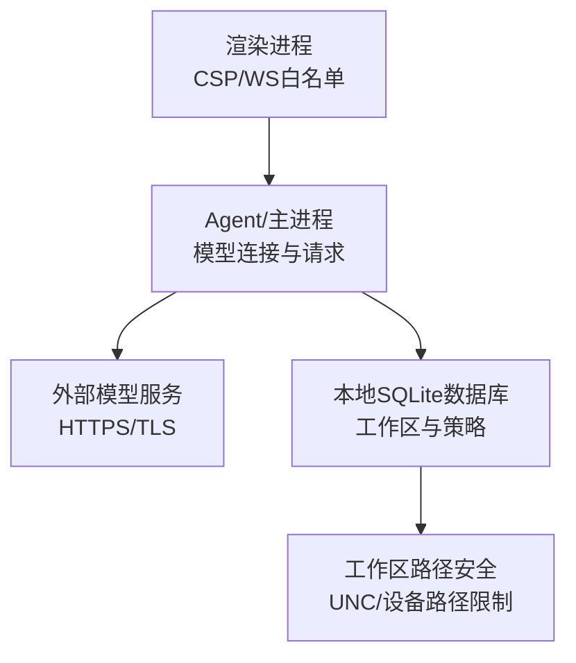
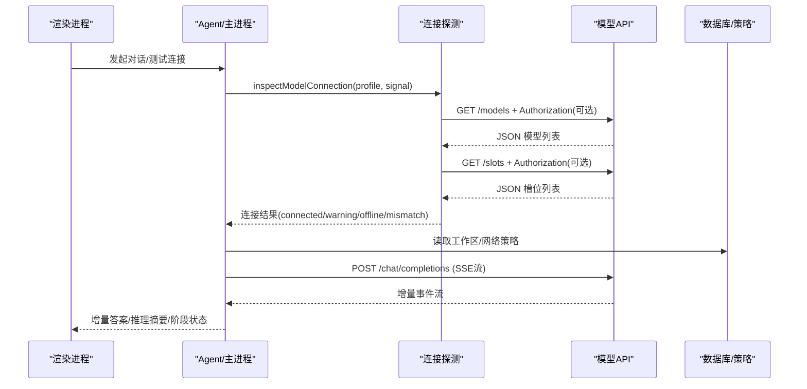
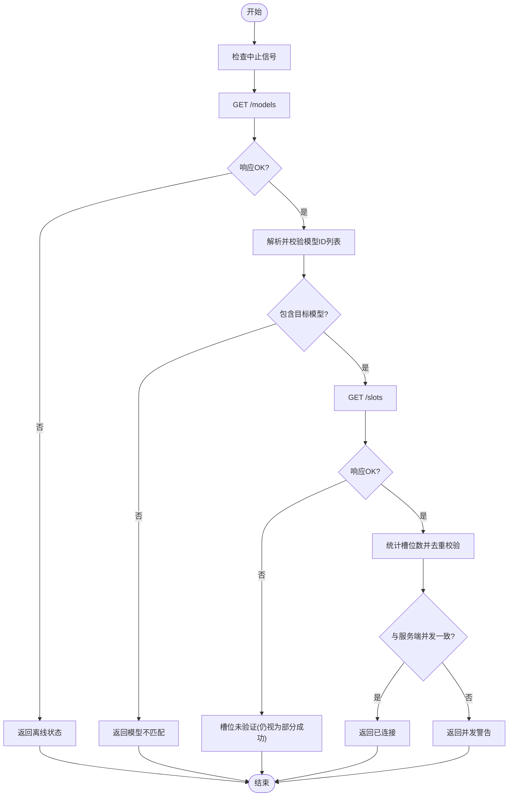
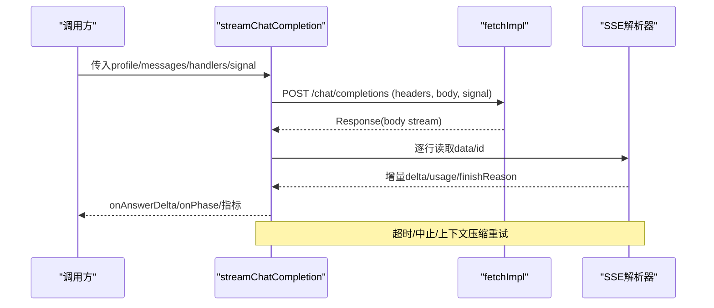
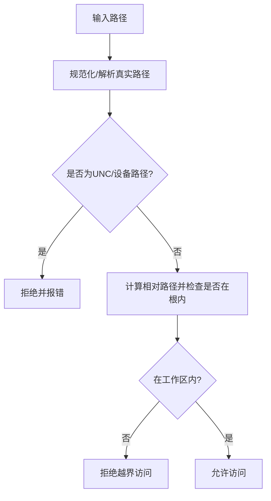
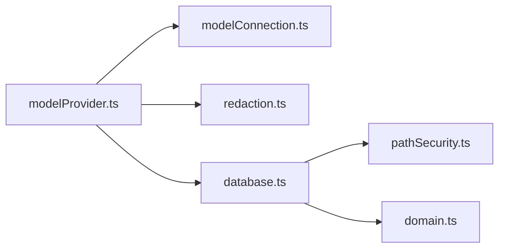

# 网络安全

<cite>
**本文引用的文件**
- [modelConnection.ts](file://src/agent/modelConnection.ts)
- [modelProvider.ts](file://src/agent/modelProvider.ts)
- [domain.ts](file://src/shared/domain.ts)
- [database.ts](file://src/agent/database.ts)
- [pathSecurity.ts](file://src/agent/workspace/pathSecurity.ts)
- [redaction.ts](file://src/shared/redaction.ts)
- [index.html](file://index.html)
- [forge.config.ts](file://forge.config.ts)
</cite>

## 目录
1. [简介](#简介)
2. [项目结构](#项目结构)
3. [核心组件](#核心组件)
4. [架构总览](#架构总览)
5. [详细组件分析](#详细组件分析)
6. [依赖关系分析](#依赖关系分析)
7. [性能与安全考量](#性能与安全考量)
8. [故障排查指南](#故障排查指南)
9. [结论](#结论)
10. [附录：配置与加固清单](#附录配置与加固清单)

## 简介
本文件聚焦 Private AI Desktop 的网络安全机制，围绕网络请求安全策略、HTTPS 强制与证书校验、API 调用安全（含鉴权与错误脱敏）、代理与防火墙隔离、WebSocket 连接安全、DNS 与域名校验、恶意网站防护、网络监控与异常检测等方面，给出基于代码实现的说明与可操作的安全建议。文档同时提供架构图、流程图与序列图，帮助读者快速理解数据流与控制流。

## 项目结构
本项目采用多进程架构（Electron）：渲染进程负责 UI 与页面安全策略；主进程/Agent 进程负责模型配置、数据库持久化与网络请求封装；共享域定义统一的数据结构与策略开关。关键安全相关位置包括：
- 渲染层 CSP 与 WebSocket 白名单
- Agent 层的模型连接探测与流式请求
- 工作区路径安全与网络策略字段
- 错误信息脱敏与敏感字段保护
- 构建期镜像源配置

图表来源
- [index.html:5-8](file://index.html#L5-L8)
- [modelProvider.ts:55-197](file://src/agent/modelProvider.ts#L55-L197)
- [modelConnection.ts:11-91](file://src/agent/modelConnection.ts#L11-L91)
- [database.ts:541-621](file://src/agent/database.ts#L541-L621)
- [pathSecurity.ts:96-125](file://src/agent/workspace/pathSecurity.ts#L96-L125)

章节来源
- [index.html:5-8](file://index.html#L5-L8)
- [modelProvider.ts:55-197](file://src/agent/modelProvider.ts#L55-L197)
- [modelConnection.ts:11-91](file://src/agent/modelConnection.ts#L11-L91)
- [database.ts:541-621](file://src/agent/database.ts#L541-L621)
- [pathSecurity.ts:96-125](file://src/agent/workspace/pathSecurity.ts#L96-L125)

## 核心组件
- 模型连接探测：对 /models 与 /slots 端点进行健康检查与能力核验，支持超时与中止信号，确保连接可用性与并发槽位一致性。
- 流式聊天请求：通过 SSE 读取增量响应，内置超时控制、上下文压缩重试、指标聚合与错误脱敏。
- 工作区与网络策略：工作区记录包含网络策略字段，路径访问受严格白名单与根目录约束，拒绝 UNC/设备路径。
- 错误与敏感信息保护：错误消息与日志输出前进行敏感信息脱敏，避免密钥泄露。
- 渲染层安全：通过 CSP 限制脚本、样式与连接来源，仅允许本地与指定 ws/http 地址。

章节来源
- [modelConnection.ts:11-91](file://src/agent/modelConnection.ts#L11-L91)
- [modelProvider.ts:55-197](file://src/agent/modelProvider.ts#L55-L197)
- [domain.ts:160-176](file://src/shared/domain.ts#L160-L176)
- [domain.ts:261-274](file://src/shared/domain.ts#L261-L274)
- [pathSecurity.ts:96-125](file://src/agent/workspace/pathSecurity.ts#L96-L125)
- [redaction.ts:1-38](file://src/shared/redaction.ts#L1-L38)
- [index.html:5-8](file://index.html#L5-L8)

## 架构总览
下图展示从渲染层到 Agent 层再到外部模型的请求链路，以及连接探测、流式处理与错误处理的交互。

图表来源
- [modelConnection.ts:11-91](file://src/agent/modelConnection.ts#L11-L91)
- [modelProvider.ts:55-197](file://src/agent/modelProvider.ts#L55-L197)
- [modelProvider.ts:762-795](file://src/agent/modelProvider.ts#L762-L795)
- [database.ts:541-621](file://src/agent/database.ts#L541-L621)

## 详细组件分析

### 模型连接探测（/models 与 /slots）
- 功能要点
  - 在发送任何业务请求前，先验证模型端点是否可达且返回的模型集合包含期望模型。
  - 进一步查询 /slots 以确认服务端并发槽位是否与客户端配置一致，若不一致则返回“并发警告”。
  - 所有网络调用均携带 AbortSignal，支持超时与取消；JSON 解析失败或响应非 OK 时返回离线或不可用状态。
- 安全要点
  - 仅在必要时注入 Authorization 头，且使用 Bearer 令牌形式。
  - 对响应体进行最小化读取与类型校验，避免解析不可信数据导致异常。
  - 错误消息不暴露内部细节，便于上层统一脱敏。

图表来源
- [modelConnection.ts:11-91](file://src/agent/modelConnection.ts#L11-L91)
- [modelConnection.ts:93-115](file://src/agent/modelConnection.ts#L93-L115)
- [modelConnection.ts:117-136](file://src/agent/modelConnection.ts#L117-L136)

章节来源
- [modelConnection.ts:11-91](file://src/agent/modelConnection.ts#L11-L91)
- [modelConnection.ts:93-115](file://src/agent/modelConnection.ts#L93-L115)
- [modelConnection.ts:117-136](file://src/agent/modelConnection.ts#L117-L136)

### 流式聊天请求（SSE）与超时控制
- 功能要点
  - 构造请求头并可选注入 Authorization 头，POST 至 /chat/completions。
  - 使用 ReadableStream 读取 SSE 事件，按行解析 data/id 字段，维护事件 ID 去重，防止重复事件。
  - 根据 finishReason 与长度限制进行自动续写与上下文压缩重试，提升长任务成功率。
  - 聚合指标（首字延迟、吞吐、用量等），并在错误时进行脱敏后抛出。
- 安全要点
  - 超时与中止信号贯穿整个流式读取过程，避免资源泄漏。
  - 错误消息经 safeErrorText 脱敏后再向上抛出，避免密钥泄露。
  - 对 provider 返回的结构化错误进行白名单过滤，仅保留受限标识符。

图表来源
- [modelProvider.ts:55-197](file://src/agent/modelProvider.ts#L55-L197)
- [modelProvider.ts:563-680](file://src/agent/modelProvider.ts#L563-L680)
- [modelProvider.ts:762-795](file://src/agent/modelProvider.ts#L762-L795)
- [redaction.ts:1-38](file://src/shared/redaction.ts#L1-L38)

章节来源
- [modelProvider.ts:55-197](file://src/agent/modelProvider.ts#L55-L197)
- [modelProvider.ts:563-680](file://src/agent/modelProvider.ts#L563-L680)
- [modelProvider.ts:762-795](file://src/agent/modelProvider.ts#L762-L795)
- [redaction.ts:1-38](file://src/shared/redaction.ts#L1-L38)

### 工作区路径安全与网络策略
- 路径安全
  - 规范化工作区根路径，拒绝 UNC 网络路径与设备路径，解析符号链接后进行包含性检查，确保工具访问始终位于工作区内。
  - 排除常见敏感目录与文件模式（如 node_modules、锁文件、缓存等）。
- 网络策略
  - 工作区记录包含 networkPolicy 字段，用于后续扩展网络访问控制（当前默认 disabled）。
  - 该策略为未来实现更严格的出站流量控制预留接口。

图表来源
- [pathSecurity.ts:96-125](file://src/agent/workspace/pathSecurity.ts#L96-L125)
- [pathSecurity.ts:175-191](file://src/agent/workspace/pathSecurity.ts#L175-L191)
- [domain.ts:261-274](file://src/shared/domain.ts#L261-L274)
- [database.ts:632-695](file://src/agent/database.ts#L632-L695)

章节来源
- [pathSecurity.ts:96-125](file://src/agent/workspace/pathSecurity.ts#L96-L125)
- [pathSecurity.ts:175-191](file://src/agent/workspace/pathSecurity.ts#L175-L191)
- [domain.ts:261-274](file://src/shared/domain.ts#L261-L274)
- [database.ts:632-695](file://src/agent/database.ts#L632-L695)

### 渲染层安全：CSP 与 WebSocket 白名单
- 内容安全策略
  - 限制脚本、样式与连接来源，仅允许同源与本地 ws/http 地址，降低注入与跨站风险。
- WebSocket 通信
  - 仅允许 ws: 与 http://localhost:* 的连接，避免向任意远程地址建立实时通道。
- 建议
  - 在生产环境尽量仅允许 wss: 与受信任域名，禁用 http 明文协议。

章节来源
- [index.html:5-8](file://index.html#L5-L8)

### 错误与敏感信息脱敏
- 错误文本脱敏
  - 将错误消息中的敏感信息（如 API Key、Bearer Token）替换为占位符，限制最大长度，避免日志或界面泄露。
- 结构化错误处理
  - 对 provider 返回的错误字段进行白名单校验，仅接受有限字符集与长度，防止注入与溢出。

章节来源
- [redaction.ts:1-38](file://src/shared/redaction.ts#L1-L38)
- [modelProvider.ts:964-993](file://src/agent/modelProvider.ts#L964-L993)

## 依赖关系分析
- 模块耦合
  - modelProvider 依赖 modelConnection 进行连接探测，依赖 redaction 进行错误脱敏。
  - database 管理模型配置与工作区策略，供运行时选择与校验。
  - pathSecurity 提供路径访问边界保障，与数据库的工作区记录配合。
- 外部依赖
  - 网络请求通过 fetchImpl 抽象，便于测试与替换底层实现。
  - 构建期镜像源配置影响依赖下载安全性。

图表来源
- [modelProvider.ts:1-7](file://src/agent/modelProvider.ts#L1-L7)
- [modelProvider.ts:55-197](file://src/agent/modelProvider.ts#L55-L197)
- [modelConnection.ts:1-9](file://src/agent/modelConnection.ts#L1-L9)
- [database.ts:541-621](file://src/agent/database.ts#L541-L621)
- [pathSecurity.ts:1-13](file://src/agent/workspace/pathSecurity.ts#L1-L13)
- [domain.ts:160-176](file://src/shared/domain.ts#L160-L176)

章节来源
- [modelProvider.ts:1-7](file://src/agent/modelProvider.ts#L1-L7)
- [modelProvider.ts:55-197](file://src/agent/modelProvider.ts#L55-L197)
- [modelConnection.ts:1-9](file://src/agent/modelConnection.ts#L1-L9)
- [database.ts:541-621](file://src/agent/database.ts#L541-L621)
- [pathSecurity.ts:1-13](file://src/agent/workspace/pathSecurity.ts#L1-L13)
- [domain.ts:160-176](file://src/shared/domain.ts#L160-L176)

## 性能与安全考量
- 超时与中止
  - 连接探测与流式请求均支持超时与中止信号，避免长时间阻塞与资源泄漏。
- 上下文压缩
  - 当接近上下文窗口上限时，自动压缩历史消息并重试，提高长任务成功率与稳定性。
- 指标采集
  - 聚合首字延迟、吞吐与用量，有助于定位性能瓶颈与异常。
- 安全加固建议
  - 强制 HTTPS：建议在部署侧强制 TLS，并在应用层拒绝 HTTP 明文连接（当前代码通过 URL 拼接与 fetch 行为由运行环境决定，建议在上层增加协议校验）。
  - 证书校验：依赖系统/浏览器 TLS 栈，确保启用证书链校验与吊销检查。
  - 代理与防火墙：通过企业代理与出站规则限制仅允许受信任域名；结合工作区网络策略字段在未来实现细粒度出站控制。
  - DNS 安全：建议使用 DNS-over-HTTPS/TLS 与可信上游，避免 DNS 劫持；在应用层对域名进行白名单校验。
  - 恶意网站防护：结合 CSP 与连接白名单，禁止向未知域名发起连接；对 ws/ws 仅允许 wss 与受信主机。

[本节为通用指导，不直接分析具体文件]

## 故障排查指南
- 连接不可用
  - 现象：/models 或 /slots 返回非 OK，或 JSON 解析失败。
  - 排查：检查网络连通性、TLS 证书、代理设置与域名解析；查看连接测试结果与错误消息（已脱敏）。
- 模型不匹配
  - 现象：/models 返回的模型列表不包含配置的模型。
  - 排查：核对 baseUrl 与 model 名称；确认服务端实际提供的模型。
- 并发槽位不一致
  - 现象：/slots 数量与客户端 maxConcurrency 不一致。
  - 排查：调整服务端并发配置或客户端 maxConcurrency；关注并发警告提示。
- 流式请求超时
  - 现象：SSE 读取超时或被中止。
  - 排查：检查网络质量、服务端处理能力；适当调整超时阈值；观察上下文压缩重试是否生效。
- 错误信息泄露
  - 现象：日志或界面出现敏感信息。
  - 排查：确认错误消息经 safeErrorText 脱敏；检查自定义日志输出是否绕过脱敏逻辑。

章节来源
- [modelConnection.ts:11-91](file://src/agent/modelConnection.ts#L11-L91)
- [modelProvider.ts:55-197](file://src/agent/modelProvider.ts#L55-L197)
- [modelProvider.ts:762-795](file://src/agent/modelProvider.ts#L762-L795)
- [redaction.ts:1-38](file://src/shared/redaction.ts#L1-L38)

## 结论
Private AI Desktop 在网络层实现了连接探测、流式请求、超时控制、错误脱敏与工作区路径安全等关键能力。当前代码侧重于可靠连接与数据安全，尚未显式实现 HTTPS 强制、代理配置、DNS 安全与入侵检测等高级特性。建议在生产环境中结合平台能力与企业安全策略，补充协议强制、域名白名单、出站流量控制与监控告警，形成端到端的网络安全闭环。

[本节为总结，不直接分析具体文件]

## 附录：配置与加固清单
- HTTPS 强制与证书校验
  - 在服务端启用 TLS 并强制重定向到 https。
  - 在应用层对 baseUrl 进行协议校验，拒绝 http 明文。
  - 确保系统/浏览器启用证书链校验与吊销检查。
- API 调用安全
  - 使用 Authorization: Bearer 令牌，避免在日志中暴露密钥。
  - 对 provider 返回的错误字段进行白名单校验，限制长度与字符集。
  - 对所有网络请求添加超时与中止信号，避免资源泄漏。
- 代理服务器配置
  - 在企业环境中通过系统代理或环境变量配置代理；在应用层记录代理使用情况以便审计。
  - 结合防火墙规则限制出站域名与端口。
- 防火墙规则与网络隔离
  - 仅允许访问受信任域名与 IP；对 ws 仅允许 wss。
  - 利用工作区网络策略字段（当前默认 disabled）在未来实现细粒度出站控制。
- WebSocket 连接安全
  - 仅允许 wss 与受信主机；在 CSP 中严格限制 connect-src。
  - 对实时通道进行认证与授权，避免匿名接入。
- DNS 安全与域名验证
  - 使用 DNS-over-HTTPS/TLS 与可信上游。
  - 在应用层对域名进行白名单校验，拦截恶意域名。
- 恶意网站防护
  - 结合 CSP 与连接白名单，禁止向未知域名发起连接。
  - 对用户输入的 URL 进行严格校验与转义，避免注入与跳转。
- 网络监控与异常检测
  - 采集连接成功率、超时率、错误码分布与吞吐指标。
  - 对异常峰值与错误模式进行告警与溯源。
- 构建与依赖安全
  - 使用可信镜像源与签名校验，避免供应链攻击。

章节来源
- [forge.config.ts:16-16](file://forge.config.ts#L16-L16)
- [index.html:5-8](file://index.html#L5-L8)
- [modelProvider.ts:55-197](file://src/agent/modelProvider.ts#L55-L197)
- [modelConnection.ts:11-91](file://src/agent/modelConnection.ts#L11-L91)
- [domain.ts:261-274](file://src/shared/domain.ts#L261-L274)