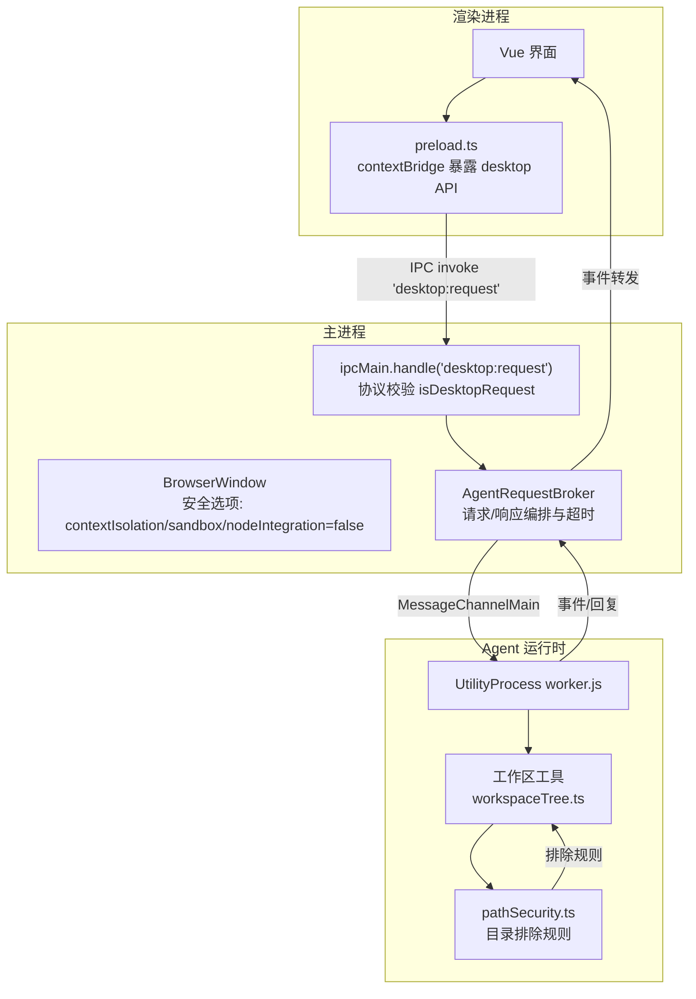
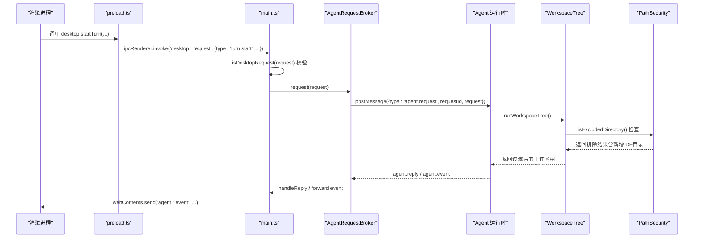
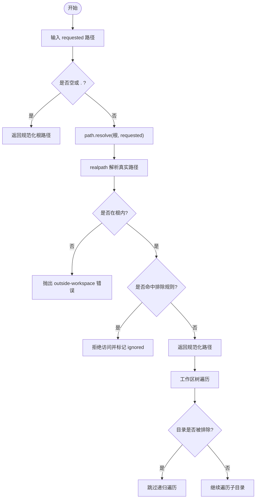
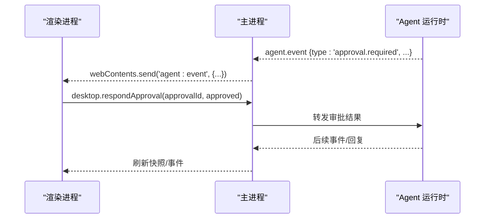
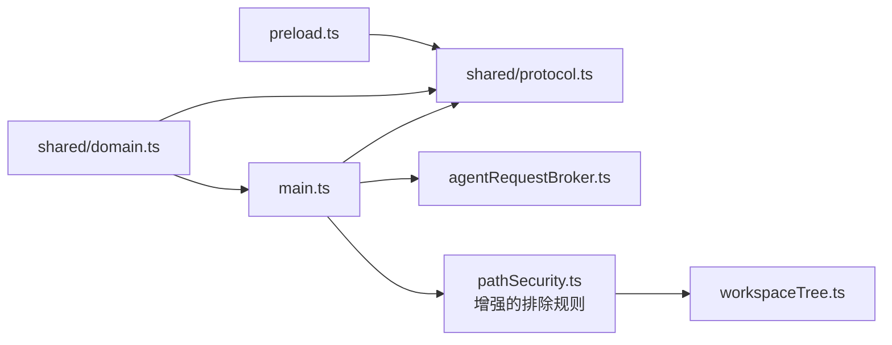

# 访问控制

<cite>
**本文引用的文件**
- [src/preload.ts](file://src/preload.ts)
- [src/main.ts](file://src/main.ts)
- [src/shared/protocol.ts](file://src/shared/protocol.ts)
- [src/shared/domain.ts](file://src/shared/domain.ts)
- [src/agent/workspace/pathSecurity.ts](file://src/agent/workspace/pathSecurity.ts)
- [tests/pathSecurity.test.ts](file://tests/pathSecurity.test.ts)
- [src/main/agentRequestBroker.ts](file://src/main/agentRequestBroker.ts)
- [src/agent/tools/workspaceTree.ts](file://src/agent/tools/workspaceTree.ts)
- [vite.preload.config.ts](file://vite.preload.config.ts)
- [package.json](file://package.json)
- [index.html](file://index.html)
</cite>

## 更新摘要
**所做更改**
- 更新了工作区目录排除规则，新增对 IDE 和工具缓存目录的防护
- 增强了工作区树遍历的性能优化和安全机制
- 完善了目录遍历预算溢出防护措施
- 更新了路径安全验证的测试覆盖范围

## 目录
1. [简介](#简介)
2. [项目结构](#项目结构)
3. [核心组件](#核心组件)
4. [架构总览](#架构总览)
5. [详细组件分析](#详细组件分析)
6. [依赖关系分析](#依赖关系分析)
7. [性能与安全特性](#性能与安全特性)
8. [故障排查指南](#故障排查指南)
9. [结论](#结论)
10. [附录：配置与最佳实践](#附录配置与最佳实践)

## 简介
本文件面向 Private AI Desktop 的访问控制系统，聚焦 Electron 预加载脚本的安全边界、权限隔离、contextBridge 暴露策略、文件系统路径安全验证与目录遍历防护、IPC 通信的权限控制与消息过滤、工作区信任模型、审批流程以及最小权限原则。文档基于仓库现有实现进行说明，并给出可操作的配置建议与常见漏洞防护要点。

**最新更新**：增强了工作区安全性，通过添加额外的目录排除规则（.idea、.vscode、.qoder、.superpowers、.electron-cache、test-results、playwright-report）来改善性能并防止工作区树预算溢出，这些目录包含大量文件但无源代码价值，且会推高工作区树的条目预算限制。

## 项目结构
本项目采用 Electron 多进程架构：渲染进程通过预加载脚本以最小 API 集与主进程通信；主进程负责窗口生命周期、安全策略、IPC 路由与代理到独立的 Agent 运行时（UtilityProcess）。共享类型与协议定义集中在 shared 目录，路径安全工具在 agent/workspace 中提供。

**图表来源**
- [src/main.ts:56-108](file://src/main.ts#L56-L108)
- [src/preload.ts:5-35](file://src/preload.ts#L5-L35)
- [src/main/agentRequestBroker.ts:15-85](file://src/main/agentRequestBroker.ts#L15-L85)
- [src/agent/tools/workspaceTree.ts:36-87](file://src/agent/tools/workspaceTree.ts#L36-L87)
- [src/agent/workspace/pathSecurity.ts:32-58](file://src/agent/workspace/pathSecurity.ts#L32-L58)

## 核心组件
- 预加载脚本：仅暴露有限、命名清晰的桌面能力方法，所有调用均通过 IPC 进入主进程。
- 主进程窗口与安全：启用 contextIsolation、sandbox，禁用 nodeIntegration；限制新窗口打开与页面导航。
- IPC 协议层：集中式类型与校验函数，拒绝非法请求。
- 工作区路径安全：规范化路径、解析真实路径、阻止越界访问与敏感目录/文件，**新增增强的目录排除规则**。
- 请求代理：带超时与断连处理的 Agent 请求桥接器。
- 数据模型：统一描述工作区信任级别、会话状态、审批项等。

**章节来源**
- [src/preload.ts:5-35](file://src/preload.ts#L5-L35)
- [src/main.ts:56-108](file://src/main.ts#L56-L108)
- [src/shared/protocol.ts:22-39](file://src/shared/protocol.ts#L22-L39)
- [src/agent/workspace/pathSecurity.ts:96-191](file://src/agent/workspace/pathSecurity.ts#L96-L191)
- [src/main/agentRequestBroker.ts:15-85](file://src/main/agentRequestBroker.ts#L15-L85)
- [src/shared/domain.ts:259-281](file://src/shared/domain.ts#L259-L281)

## 架构总览
下图展示从 UI 发起操作到主进程校验、再到 Agent 运行时的完整链路，强调"最小暴露面 + 严格校验"的安全边界。

**图表来源**
- [src/preload.ts:15-19](file://src/preload.ts#L15-L19)
- [src/main.ts:103-108](file://src/main.ts#L103-L108)
- [src/main/agentRequestBroker.ts:33-52](file://src/main/agentRequestBroker.ts#L33-L52)
- [src/shared/protocol.ts:22-39](file://src/shared/protocol.ts#L22-L39)
- [src/agent/tools/workspaceTree.ts:74-78](file://src/agent/tools/workspaceTree.ts#L74-L78)
- [src/agent/workspace/pathSecurity.ts:202-204](file://src/agent/workspace/pathSecurity.ts#L202-L204)

## 详细组件分析

### 预加载脚本的安全边界与权限隔离
- 使用 contextBridge.exposeInMainWorld 仅暴露一个名为 desktop 的对象，包含健康检查、快照、群组/线程管理、对话轮次、模型配置、设置、语言主题、工作区注册/删除、订阅事件等方法。
- 所有方法内部通过 ipcRenderer.invoke 调用主进程的单一入口 'desktop:request'，避免直接暴露底层 IPC 通道或 Node API。
- 预加载构建时通过 Vite 配置将 electron 外部化，确保预加载脚本不打包 Electron 模块，减少攻击面。

**章节来源**
- [src/preload.ts:5-35](file://src/preload.ts#L5-L35)
- [vite.preload.config.ts:1-10](file://vite.preload.config.ts#L1-L10)

### 主进程安全策略与窗口沙箱
- BrowserWindow 启用 contextIsolation、sandbox，并关闭 nodeIntegration，防止渲染进程直接访问 Node 能力。
- 禁止新窗口打开，强制使用系统浏览器打开外链；拦截 will-navigate 防止意外跳转。
- 仅注册两个 IPC 处理器：健康检查和统一的 'desktop:request' 路由，后者对请求进行强类型校验后转发给 Agent 运行时。

**章节来源**
- [src/main.ts:56-81](file://src/main.ts#L56-L81)
- [src/main.ts:98-108](file://src/main.ts#L98-L108)

### IPC 通信的权限控制与消息过滤
- 所有来自渲染进程的桌面操作必须通过 'desktop:request' 发送，并在主进程用 isDesktopRequest 进行白名单校验，未识别的请求将被拒绝。
- 事件通道 'agent:event' 由主进程单向推送，渲染进程仅订阅，无法主动触发。
- 请求体中的复杂字段（如附件、模型配置、设置）均在协议层进行结构化校验，确保类型、取值范围与约束正确。

**章节来源**
- [src/shared/protocol.ts:22-39](file://src/shared/protocol.ts#L22-L39)
- [src/shared/protocol.ts:274-316](file://src/shared/protocol.ts#L274-L316)
- [src/shared/protocol.ts:318-370](file://src/shared/protocol.ts#L318-L370)
- [src/main.ts:103-108](file://src/main.ts#L103-L108)

### 文件系统路径安全验证、目录遍历防护与沙箱机制

**更新**：增强了工作区目录排除规则，新增对 IDE 和工具缓存目录的防护，包括 .idea、.vscode、.qoder、.superpowers、.electron-cache、test-results、playwright-report 等目录。这些目录通常包含大量文件但无源代码价值，会导致工作区树遍历超出预算限制，影响性能。

- 工作区根路径通过 normalizeWorkspacePath 进行绝对性、设备路径、UNC 网络路径、存在性与符号链接/连接点解析，返回规范化后的根路径。
- 任何工具侧路径通过 resolveWithinRoot 在规范化根下解析，并进行 realpath 解析后再做包含性检查，防止通过 .. 或符号链接逃逸工作区。
- **新增增强排除规则**：默认排除敏感目录与文件模式（如 node_modules、.git、.env、锁文件、构建产物等），并扩展了对 IDE 配置目录、测试输出目录和缓存目录的排除。
- 工作区树遍历工具利用这些排除规则，在遇到被排除的目录时标记为 ignored 并停止递归遍历，显著提升性能。
- 测试覆盖相对路径拒绝、不存在路径、UNC/设备路径拒绝、符号链接逃逸阻断、排除规则等场景。

**图表来源**
- [src/agent/workspace/pathSecurity.ts:175-191](file://src/agent/workspace/pathSecurity.ts#L175-L191)
- [src/agent/workspace/pathSecurity.ts:96-125](file://src/agent/workspace/pathSecurity.ts#L96-L125)
- [src/agent/workspace/pathSecurity.ts:193-222](file://src/agent/workspace/pathSecurity.ts#L193-L222)
- [src/agent/tools/workspaceTree.ts:74-78](file://src/agent/tools/workspaceTree.ts#L74-L78)
- [tests/pathSecurity.test.ts:42-162](file://tests/pathSecurity.test.ts#L42-L162)

**章节来源**
- [src/agent/workspace/pathSecurity.ts:32-58](file://src/agent/workspace/pathSecurity.ts#L32-L58)
- [src/agent/workspace/pathSecurity.ts:96-191](file://src/agent/workspace/pathSecurity.ts#L96-L191)
- [src/agent/tools/workspaceTree.ts:74-78](file://src/agent/tools/workspaceTree.ts#L74-L78)
- [tests/pathSecurity.test.ts:42-162](file://tests/pathSecurity.test.ts#L42-L162)

### 用户会话、角色权限模型与访问令牌处理
- 当前代码未实现用户身份与会话持久化，也未暴露角色权限模型或访问令牌处理逻辑。
- 工作区维度具备信任级别（read-only / read-write）和网络策略（disabled / allowlisted），用于限定工作区内的读写与网络访问范围。
- 若未来引入用户与会话，建议在主进程入口处增加鉴权中间件，结合工作区信任级别进行细粒度授权。

**章节来源**
- [src/shared/domain.ts:259-281](file://src/shared/domain.ts#L259-L281)

### 敏感操作审批流程
- 当需要执行高风险操作时，Agent 会发出 approval.required 事件，前端需调用 respondApproval 提交审批结果。
- 主进程将审批事件转发至渲染进程，渲染进程通过 desktop.respondApproval 回写结果，后续由后端/Agent 完成状态更新。
- 测试覆盖了审批投递失败、原子持久化失败等异常分支，确保状态一致性。

**图表来源**
- [src/preload.ts:18-19](file://src/preload.ts#L18-L19)
- [src/shared/protocol.ts:59-59](file://src/shared/protocol.ts#L59-L59)
- [src/shared/protocol.ts:296-297](file://src/shared/protocol.ts#L296-L297)

**章节来源**
- [src/preload.ts:18-19](file://src/preload.ts#L18-L19)
- [src/shared/protocol.ts:59-59](file://src/shared/protocol.ts#L59-L59)
- [src/shared/protocol.ts:296-297](file://src/shared/protocol.ts#L296-L297)

### 请求代理与可靠性
- AgentRequestBroker 维护待处理请求映射，为每个请求分配唯一 ID，设置超时时间，支持断连时批量拒绝。
- 主进程通过 MessageChannelMain 与独立 Agent 进程通信，保证主进程与 Agent 进程解耦，降低风险面。

**章节来源**
- [src/main/agentRequestBroker.ts:15-85](file://src/main/agentRequestBroker.ts#L15-L85)
- [src/main.ts:19-54](file://src/main.ts#L19-L54)

## 依赖关系分析
- preload.ts 依赖 shared 的类型与协议，仅通过 IPC 与 main.ts 交互。
- main.ts 依赖 protocol 进行请求校验，依赖 agentRequestBroker 与 Agent 运行时通信。
- pathSecurity.ts 被工作区相关逻辑引用，提供路径规范化与安全检查，**包含增强的目录排除规则**。
- domain.ts 提供跨进程的数据契约，包括工作区、模型配置、审批等。

**图表来源**
- [src/preload.ts:1-3](file://src/preload.ts#L1-L3)
- [src/main.ts:1-4](file://src/main.ts#L1-L4)
- [src/shared/protocol.ts:1-19](file://src/shared/protocol.ts#L1-L19)
- [src/shared/domain.ts:259-281](file://src/shared/domain.ts#L259-L281)
- [src/agent/workspace/pathSecurity.ts:32-58](file://src/agent/workspace/pathSecurity.ts#L32-L58)
- [src/agent/tools/workspaceTree.ts:3-7](file://src/agent/tools/workspaceTree.ts#L3-L7)

**章节来源**
- [src/preload.ts:1-3](file://src/preload.ts#L1-L3)
- [src/main.ts:1-4](file://src/main.ts#L1-L4)
- [src/shared/protocol.ts:1-19](file://src/shared/protocol.ts#L1-L19)
- [src/shared/domain.ts:259-281](file://src/shared/domain.ts#L259-L281)

## 性能与安全特性
- 预加载最小暴露面：仅暴露必要方法，减少攻击面。
- 渲染进程沙箱：contextIsolation + sandbox，禁用 nodeIntegration，配合 CSP 限制资源加载。
- IPC 白名单：集中式协议校验，拒绝未知请求。
- **增强的路径安全**：规范化 + 真实路径解析 + 包含性检查 + **扩展的排除规则**，有效防御目录遍历与越界访问，同时提升工作区树遍历性能。
- **工作区树优化**：通过排除大型非源码目录（IDE 配置、测试输出、缓存等），避免预算溢出，提高响应速度。
- 请求可靠性：超时与断连保护，避免悬挂请求与资源泄漏。

## 故障排查指南
- 非法请求被拒绝：检查 isDesktopRequest 校验逻辑与请求字段是否符合协议定义。
- 路径访问失败：确认工作区根已规范化且目标路径在根内；检查是否存在符号链接指向外部；核对排除规则，**特别注意新增的 IDE 和工具目录**。
- 工作区树性能问题：检查是否包含了过多的排除目录；确认 maxEntries 和 maxDepth 配置合理。
- 审批流程异常：关注 approval.required 事件与 respondApproval 调用；检查持久化与重试逻辑。
- 代理超时或断连：查看 AgentRequestBroker 的 pending 列表与超时配置；确认 Agent 进程存活与端口连接。

**章节来源**
- [src/shared/protocol.ts:274-316](file://src/shared/protocol.ts#L274-L316)
- [src/agent/workspace/pathSecurity.ts:96-191](file://src/agent/workspace/pathSecurity.ts#L96-L191)
- [src/agent/workspace/pathSecurity.ts:32-58](file://src/agent/workspace/pathSecurity.ts#L32-L58)
- [src/main/agentRequestBroker.ts:33-85](file://src/main/agentRequestBroker.ts#L33-L85)

## 结论
Private AI Desktop 在当前版本实现了较为完善的访问控制基础：预加载最小暴露、渲染进程沙箱、IPC 白名单校验、工作区路径安全与审批流程。**最新版本增强了工作区安全性，通过添加对 IDE 配置目录、测试输出目录和缓存目录的排除规则，显著提升了工作区树遍历的性能并防止预算溢出**。尚未实现用户与会话、角色权限与访问令牌。建议后续在主进程入口引入鉴权中间件，结合工作区信任级别与网络策略，逐步完善细粒度权限控制与审计日志。

## 附录：配置与最佳实践

- 访问控制配置要点
  - 保持 contextIsolation 与 sandbox 开启，nodeIntegration 保持关闭。
  - 仅通过 preload 暴露必要 API，新增能力需走 IPC 白名单与协议校验。
  - 工作区注册时必须传入 trustLevel（read-only 或 read-write），并在后续操作中依据该级别限制写入与网络访问。
  - 使用 CSP 限制资源加载与连接源，避免注入恶意脚本或数据。

- 权限最小化原则
  - 只暴露渲染进程需要的能力；不要暴露底层 Node 或 Electron API。
  - 所有参数在协议层进行类型与取值范围校验，拒绝非法输入。
  - 路径访问一律通过 pathSecurity 工具，禁止直接使用 fs 或 path 拼接。

- **增强的目录排除最佳实践**
  - **IDE 配置目录**：自动排除 .idea、.vscode、.qoder、.superpowers 等 IDE 配置文件，避免扫描大量编辑器生成的临时文件。
  - **测试输出目录**：排除 test-results、playwright-report 等测试报告目录，减少不必要的文件扫描。
  - **缓存目录**：排除 .electron-cache 等应用缓存目录，提升工作区树遍历性能。
  - **构建产物**：保留原有的 node_modules、dist、build、coverage 等构建和依赖目录排除规则。

- 常见漏洞防护
  - 目录遍历：通过 realpath 解析与包含性检查阻断 .. 逃逸。
  - 符号链接/连接点：解析真实路径后再判断，防止绕过。
  - 设备路径与 UNC：显式拒绝，避免访问系统设备或远程共享。
  - 敏感文件与目录：默认排除 .env、锁文件、构建缓存等。
  - 新窗口与导航：禁止在新窗口打开，外链使用系统浏览器；拦截 will-navigate。

- 安全审计日志建议（规划）
  - 记录关键操作：工作区注册/删除、模型配置变更、审批结果、错误与拒绝原因。
  - 关联上下文：threadId、turnId、workspaceId、用户标识（未来）、时间戳。
  - 分级输出：调试、信息、警告、错误等级别，便于检索与分析。

**章节来源**
- [src/main.ts:56-81](file://src/main.ts#L56-L81)
- [src/preload.ts:5-35](file://src/preload.ts#L5-L35)
- [src/shared/protocol.ts:274-316](file://src/shared/protocol.ts#L274-L316)
- [src/agent/workspace/pathSecurity.ts:32-58](file://src/agent/workspace/pathSecurity.ts#L32-L58)
- [src/agent/workspace/pathSecurity.ts:96-191](file://src/agent/workspace/pathSecurity.ts#L96-L191)
- [index.html:4-8](file://index.html#L4-L8)
- [package.json:1-35](file://package.json#L1-L35)