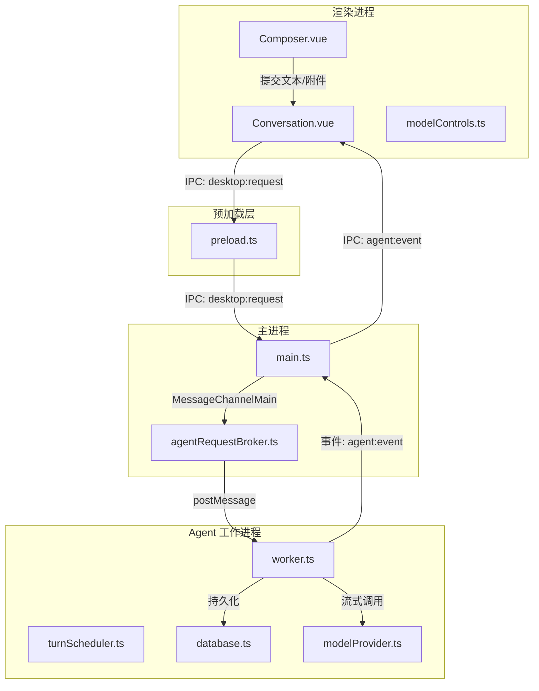
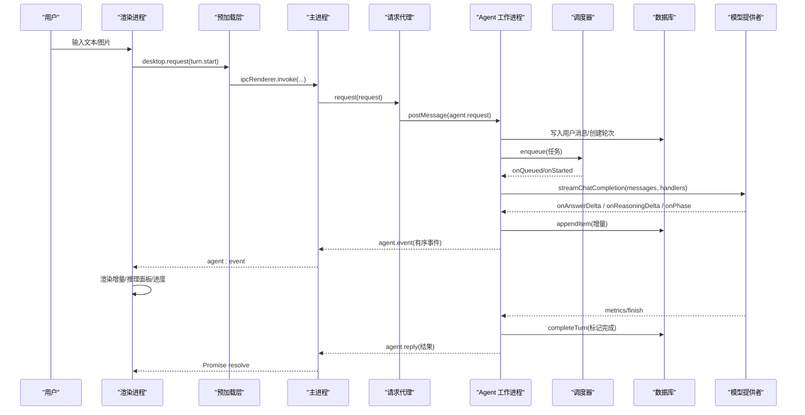
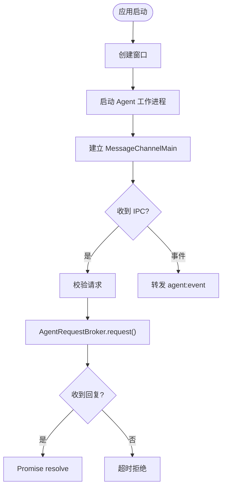
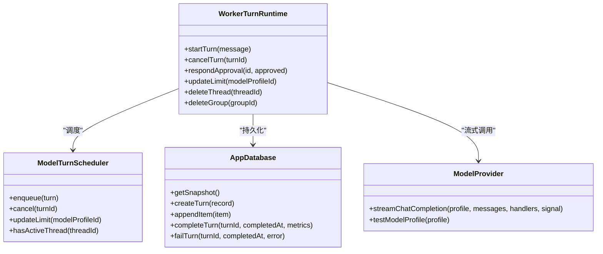
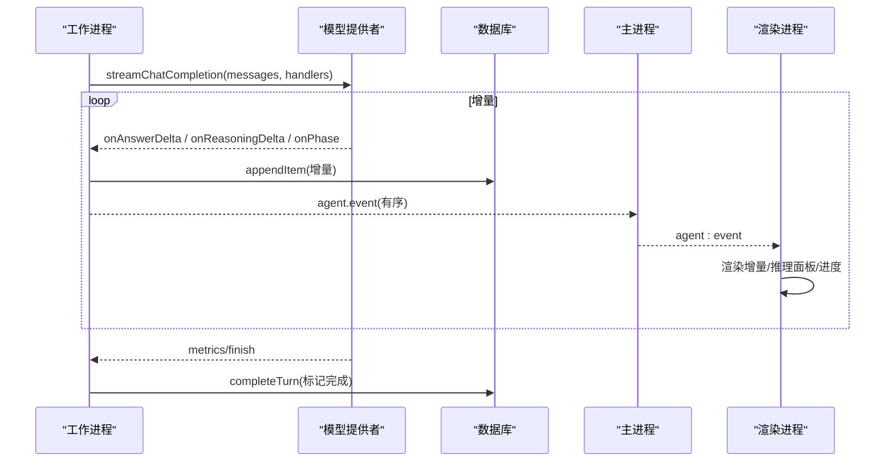
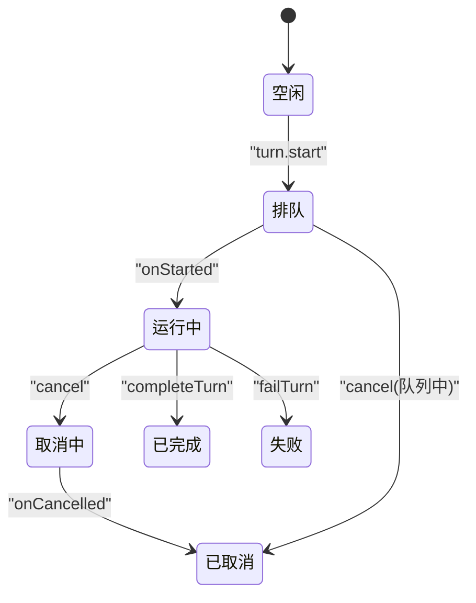
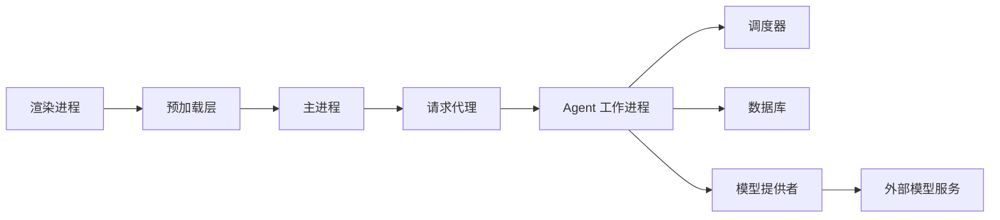
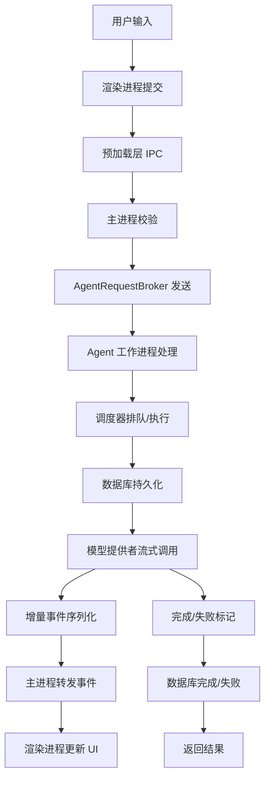

# 数据流设计

<cite>
**本文引用的文件**
- [src/main.ts](file://src/main.ts)
- [src/preload.ts](file://src/preload.ts)
- [src/main/agentRequestBroker.ts](file://src/main/agentRequestBroker.ts)
- [src/agent/worker.ts](file://src/agent/worker.ts)
- [src/agent/modelProvider.ts](file://src/agent/modelProvider.ts)
- [src/agent/database.ts](file://src/agent/database.ts)
- [src/agent/turnScheduler.ts](file://src/agent/turnScheduler.ts)
- [src/shared/protocol.ts](file://src/shared/protocol.ts)
- [src/shared/domain.ts](file://src/shared/domain.ts)
- [src/shared/redaction.ts](file://src/shared/redaction.ts)
- [src/renderer/components/Composer.vue](file://src/renderer/components/Composer.vue)
- [src/renderer/components/Conversation.vue](file://src/renderer/components/Conversation.vue)
- [src/renderer/modelControls.ts](file://src/renderer/modelControls.ts)
</cite>

## 目录
1. [简介](#简介)
2. [项目结构](#项目结构)
3. [核心组件](#核心组件)
4. [架构总览](#架构总览)
5. [详细组件分析](#详细组件分析)
6. [依赖关系分析](#依赖关系分析)
7. [性能与内存管理](#性能与内存管理)
8. [故障处理与一致性](#故障处理与一致性)
9. [结论](#结论)
10. [附录：关键流程图](#附录关键流程图)

## 简介
本文件为 Private AI Desktop 的数据流设计文档，聚焦“用户输入到 AI 响应”的完整流转路径，覆盖渲染进程、主进程、Agent 工作进程之间的消息传递、流式增量更新、推理过程可视化、数据转换与序列化、缓存策略、错误传播、重试机制、超时处理、以及数据一致性与事务管理。

## 项目结构
- 渲染进程（Vue）：负责 UI 交互、事件订阅、状态展示与滚动优化。
- 预加载脚本：通过 contextBridge 暴露桌面能力，封装 IPC 调用。
- 主进程：启动 Agent 工作进程、维护请求代理、转发事件。
- Agent 工作进程：调度对话轮次、持久化、模型流式调用、事件序列化和投递。
- 共享协议与领域模型：定义跨进程通信契约与数据结构。

图表来源
- [src/main.ts:19-54](file://src/main.ts#L19-L54)
- [src/main/agentRequestBroker.ts:26-52](file://src/main/agentRequestBroker.ts#L26-L52)
- [src/agent/worker.ts:111-124](file://src/agent/worker.ts#L111-L124)
- [src/agent/modelProvider.ts:55-197](file://src/agent/modelProvider.ts#L55-L197)
- [src/preload.ts:5-31](file://src/preload.ts#L5-L31)

章节来源
- [src/main.ts:1-170](file://src/main.ts#L1-L170)
- [src/preload.ts:1-32](file://src/preload.ts#L1-L32)
- [src/agent/worker.ts:1-124](file://src/agent/worker.ts#L1-L124)

## 核心组件
- 渲染层：Composer 收集用户输入与图片附件；Conversation 订阅事件并渲染时间线、推理面板与进度。
- 预加载层：将桌面 API 暴露给渲染进程，统一封装 IPC 调用。
- 主进程：创建窗口、启动 Agent 工作进程、建立 MessageChannelMain 连接、处理健康检查与桌面请求、转发事件。
- Agent 工作进程：解析请求、调度对话轮次、持久化增量内容、调用模型流式接口、序列化并投递事件。
- 调度器：按模型配置限制并发，维护队列、运行槽位、取消与位置通知。
- 数据库：SQLite 持久化会话、轮次、条目、审批与设置，提供快照与原子事务。
- 模型提供者：SSE 流式读取、上下文压缩、重试与超时控制、指标聚合。
- 协议与领域：严格的类型校验与结构化事件定义，保障跨进程安全。

章节来源
- [src/renderer/components/Composer.vue:1-181](file://src/renderer/components/Composer.vue#L1-L181)
- [src/renderer/components/Conversation.vue:1-515](file://src/renderer/components/Conversation.vue#L1-L515)
- [src/preload.ts:1-32](file://src/preload.ts#L1-L32)
- [src/main.ts:1-170](file://src/main.ts#L1-L170)
- [src/main/agentRequestBroker.ts:1-86](file://src/main/agentRequestBroker.ts#L1-L86)
- [src/agent/worker.ts:155-442](file://src/agent/worker.ts#L155-L442)
- [src/agent/turnScheduler.ts:1-378](file://src/agent/turnScheduler.ts#L1-L378)
- [src/agent/database.ts:150-800](file://src/agent/database.ts#L150-L800)
- [src/agent/modelProvider.ts:55-800](file://src/agent/modelProvider.ts#L55-L800)
- [src/shared/protocol.ts:22-66](file://src/shared/protocol.ts#L22-L66)
- [src/shared/domain.ts:24-305](file://src/shared/domain.ts#L24-L305)

## 架构总览
端到端数据流从渲染进程发起，经预加载桥接至主进程，再通过 MessageChannelMain 进入 Agent 工作进程。工作进程负责：
- 将请求路由到具体业务（如 turn.start）。
- 使用调度器按模型并发限制排队执行。
- 在数据库中持久化用户消息与流式增量。
- 调用模型提供者进行 SSE 流式读取，并将增量事件按顺序投递回主进程，最终推送至渲染进程。

图表来源
- [src/preload.ts:15-17](file://src/preload.ts#L15-L17)
- [src/main.ts:103-108](file://src/main.ts#L103-L108)
- [src/main/agentRequestBroker.ts:33-52](file://src/main/agentRequestBroker.ts#L33-L52)
- [src/agent/worker.ts:417-442](file://src/agent/worker.ts#L417-L442)
- [src/agent/turnScheduler.ts:47-72](file://src/agent/turnScheduler.ts#L47-L72)
- [src/agent/modelProvider.ts:55-197](file://src/agent/modelProvider.ts#L55-L197)
- [src/agent/database.ts:360-464](file://src/agent/database.ts#L360-L464)

## 详细组件分析

### 渲染进程：输入与事件消费
- Composer 负责收集文本与图片附件，限制图片数量与大小，生成 TurnAttachment。
- Conversation 订阅 agent:event，构建时间线，显示消息、进度、工具输出与推理面板；支持自动滚动与未读提示。
- modelControls 提供推理模式选择、复制反馈、运行时状态呈现等辅助逻辑。

章节来源
- [src/renderer/components/Composer.vue:18-130](file://src/renderer/components/Composer.vue#L18-L130)
- [src/renderer/components/Conversation.vue:1-120](file://src/renderer/components/Conversation.vue#L1-L120)
- [src/renderer/modelControls.ts:42-149](file://src/renderer/modelControls.ts#L42-L149)

### 预加载层：IPC 桥接
- 暴露 supportsTurnAttachments、health、snapshot、group/thread/turn 操作、语言与主题设置、模型配置保存/删除/测试、事件订阅等能力。
- 所有方法通过 ipcRenderer.invoke 或 on 实现，屏蔽底层通道细节。

章节来源
- [src/preload.ts:5-31](file://src/preload.ts#L5-L31)

### 主进程：进程生命周期与请求代理
- 启动 Agent 工作进程，建立 MessageChannelMain，监听端口关闭与退出事件。
- 接收渲染进程的桌面请求，校验后交由 AgentRequestBroker 发送并等待 reply。
- 将 Agent 事件转发给渲染进程，形成双向通道。

图表来源
- [src/main.ts:19-54](file://src/main.ts#L19-L54)
- [src/main.ts:103-144](file://src/main.ts#L103-L144)
- [src/main/agentRequestBroker.ts:33-86](file://src/main/agentRequestBroker.ts#L33-L86)

章节来源
- [src/main.ts:1-170](file://src/main.ts#L1-L170)
- [src/main/agentRequestBroker.ts:1-86](file://src/main/agentRequestBroker.ts#L1-L86)

### Agent 工作进程：调度、持久化与流式处理
- 初始化数据库与工作运行时，接收主进程消息，分发到 handleDesktopRequest。
- turn.start：创建轮次记录、写入用户消息、构建历史消息、入队调度器。
- 调度器：按模型并发限制排队，触发 onQueued/onStarted，执行 run(signal)。
- 执行流程：根据是否选择真实模型或演示模式，调用模型提供者或演示执行器；期间持续产出 answer.delta、reasoning.raw.delta、reasoning.summary.delta、model.progress、tool.started/output、model.metrics 等事件。
- 持久化：每个增量事件通过 persistAndPost 先写库再投递，保证断点恢复与回放一致性。
- 完成/失败：completeTurn/failTurn 标记轮次状态，清理未完成项与待决审批。

图表来源
- [src/agent/worker.ts:155-405](file://src/agent/worker.ts#L155-L405)
- [src/agent/turnScheduler.ts:32-117](file://src/agent/turnScheduler.ts#L32-L117)
- [src/agent/database.ts:360-464](file://src/agent/database.ts#L360-L464)
- [src/agent/modelProvider.ts:55-197](file://src/agent/modelProvider.ts#L55-L197)

章节来源
- [src/agent/worker.ts:111-442](file://src/agent/worker.ts#L111-L442)
- [src/agent/turnScheduler.ts:1-378](file://src/agent/turnScheduler.ts#L1-L378)
- [src/agent/database.ts:150-800](file://src/agent/database.ts#L150-L800)
- [src/agent/modelProvider.ts:55-800](file://src/agent/modelProvider.ts#L55-L800)

### 流式响应与推理可视化
- 模型提供者以 SSE 流读取增量，维护 answer/raw reasoning/summary reasoning 三段文本归一器，按阶段切换 connecting/compressing/reasoning/answering。
- 工作进程将增量转换为 SequencedAgentEvent，附加 threadId/turnId/modelProfileId/sequence，确保有序投递。
- 渲染进程依据事件类型更新消息体、推理面板与进度指示，支持自动滚动与未读提示。

图表来源
- [src/agent/modelProvider.ts:563-680](file://src/agent/modelProvider.ts#L563-L680)
- [src/agent/worker.ts:165-168](file://src/agent/worker.ts#L165-L168)
- [src/agent/worker.ts:454-464](file://src/agent/worker.ts#L454-L464)
- [src/renderer/components/Conversation.vue:146-157](file://src/renderer/components/Conversation.vue#L146-L157)

章节来源
- [src/agent/modelProvider.ts:55-197](file://src/agent/modelProvider.ts#L55-L197)
- [src/agent/worker.ts:165-168](file://src/agent/worker.ts#L165-L168)
- [src/renderer/components/Conversation.vue:146-157](file://src/renderer/components/Conversation.vue#L146-L157)

### 数据转换、验证与序列化
- 协议层对 DesktopRequest 与 AgentEvent 进行严格校验，包括字段存在性、枚举值、长度范围与嵌套结构。
- 领域模型定义 Item/TurnRecord/ModelRunMetrics 等核心结构，确保跨进程一致性。
- 错误信息通过 redaction 脱敏，避免泄露密钥或敏感片段。

章节来源
- [src/shared/protocol.ts:274-371](file://src/shared/protocol.ts#L274-L371)
- [src/shared/domain.ts:24-305](file://src/shared/domain.ts#L24-L305)
- [src/shared/redaction.ts:1-112](file://src/shared/redaction.ts#L1-L112)

### 状态机：对话轮次

图表来源
- [src/agent/turnScheduler.ts:47-117](file://src/agent/turnScheduler.ts#L47-L117)
- [src/agent/database.ts:419-464](file://src/agent/database.ts#L419-L464)

## 依赖关系分析
- 渲染进程依赖 preload 暴露的桌面 API。
- 主进程依赖 AgentRequestBroker 管理请求-回复映射与超时。
- Agent 工作进程依赖调度器、数据库与模型提供者。
- 模型提供者依赖网络 I/O、流式解析与上下文压缩逻辑。
- 所有模块通过 shared/protocol 与 shared/domain 解耦。

图表来源
- [src/preload.ts:5-31](file://src/preload.ts#L5-L31)
- [src/main/agentRequestBroker.ts:1-86](file://src/main/agentRequestBroker.ts#L1-L86)
- [src/agent/worker.ts:155-442](file://src/agent/worker.ts#L155-L442)
- [src/agent/modelProvider.ts:55-800](file://src/agent/modelProvider.ts#L55-L800)

章节来源
- [src/preload.ts:1-32](file://src/preload.ts#L1-L32)
- [src/main/agentRequestBroker.ts:1-86](file://src/main/agentRequestBroker.ts#L1-L86)
- [src/agent/worker.ts:155-442](file://src/agent/worker.ts#L155-L442)
- [src/agent/modelProvider.ts:55-800](file://src/agent/modelProvider.ts#L55-L800)

## 性能与内存管理
- 流式增量：SSE 分块读取，逐步拼接答案与推理文本，避免一次性加载大响应。
- 上下文压缩：当接近上下文窗口时，对系统消息、历史摘要与最新用户内容进行压缩，必要时多次续写以保证长回答。
- 并发控制：按模型配置的 maxConcurrency 限制同时运行的轮次，防止资源耗尽。
- 超时与心跳：模型请求默认超时与每 token 超时结合，长时间无进展可中断；连接测试带独立超时。
- 数据库事务：所有写操作包裹在事务中，减少锁竞争与不一致风险；WAL 模式提升并发读写性能。
- 渲染优化：Conversation 使用 nextTick 与 requestAnimationFrame 批量滚动，避免频繁重排。

章节来源
- [src/agent/modelProvider.ts:209-339](file://src/agent/modelProvider.ts#L209-L339)
- [src/agent/modelProvider.ts:535-561](file://src/agent/modelProvider.ts#L535-L561)
- [src/agent/turnScheduler.ts:42-72](file://src/agent/turnScheduler.ts#L42-L72)
- [src/agent/database.ts:731-737](file://src/agent/database.ts#L731-L737)
- [src/renderer/components/Conversation.vue:232-241](file://src/renderer/components/Conversation.vue#L232-L241)

## 故障处理与一致性
- 错误传播：工作进程捕获异常，脱敏后通过 agent.reply 返回错误；事件侧通过 turn.failed 通知渲染进程。
- 重试机制：模型提供者检测到上下文超限或兼容性问题时，尝试压缩上下文或调整请求参数并重试。
- 超时处理：请求代理设置全局超时；模型请求使用链接超时信号，区分超时与主动取消。
- 取消与中止：调度器支持队列内取消与运行中中止；工作进程通过 AbortSignal 终止模型流读取。
- 一致性保证：持久化与事件投递采用“先写库再投递”的顺序；completeTurn 原子更新轮次状态并清理未完成项；审批状态在失败/取消时统一拒绝。

章节来源
- [src/main/agentRequestBroker.ts:33-86](file://src/main/agentRequestBroker.ts#L33-L86)
- [src/agent/worker.ts:294-305](file://src/agent/worker.ts#L294-L305)
- [src/agent/modelProvider.ts:95-118](file://src/agent/modelProvider.ts#L95-L118)
- [src/agent/modelProvider.ts:720-756](file://src/agent/modelProvider.ts#L720-L756)
- [src/agent/database.ts:419-464](file://src/agent/database.ts#L419-L464)

## 结论
Private AI Desktop 的数据流设计通过清晰的进程边界、严格的协议校验、有序的流式事件与事务化的持久化，实现了高可靠、可扩展且用户体验友好的 AI 对话系统。渲染进程专注交互与展示，主进程负责进程协调与请求代理，Agent 工作进程承担核心业务逻辑与模型交互。整体架构在保证数据一致性的同时，提供了良好的性能与容错能力。

## 附录：关键流程图

### 用户输入到响应的完整数据流

图表来源
- [src/preload.ts:15-17](file://src/preload.ts#L15-L17)
- [src/main.ts:103-144](file://src/main.ts#L103-L144)
- [src/main/agentRequestBroker.ts:33-86](file://src/main/agentRequestBroker.ts#L33-L86)
- [src/agent/worker.ts:417-442](file://src/agent/worker.ts#L417-L442)
- [src/agent/modelProvider.ts:55-197](file://src/agent/modelProvider.ts#L55-L197)
- [src/agent/database.ts:360-464](file://src/agent/database.ts#L360-L464)