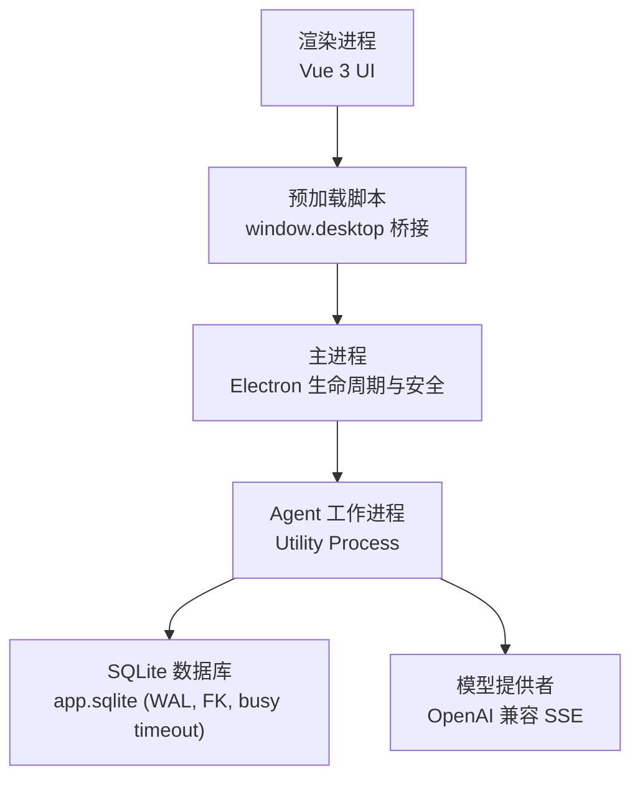
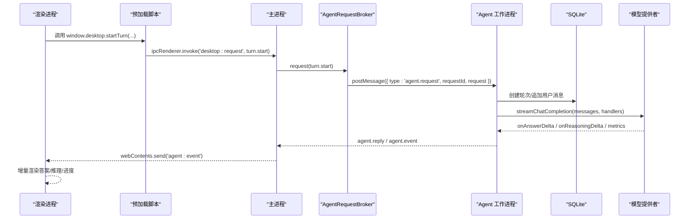
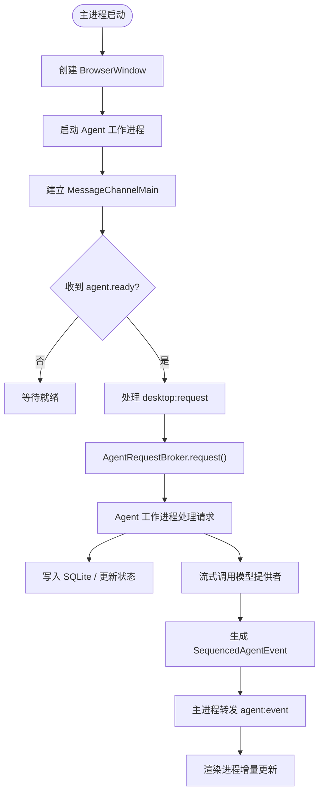
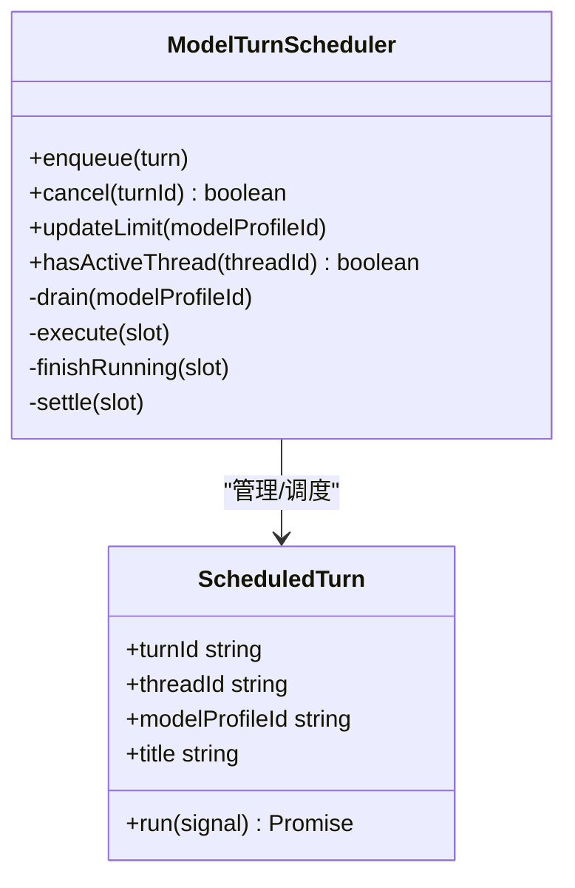
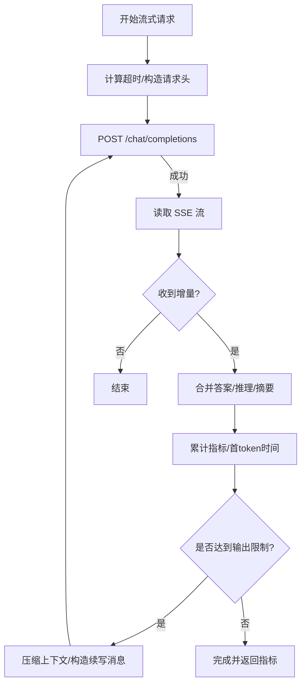
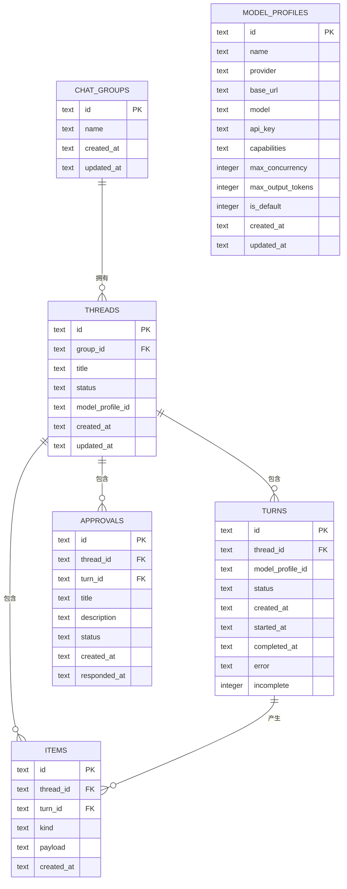
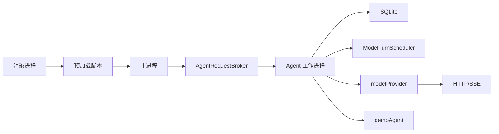

# 整体架构概览

<cite>
**本文引用的文件**
- [package.json](file://package.json)
- [README.md](file://README.md)
- [forge.config.ts](file://forge.config.ts)
- [src/main.ts](file://src/main.ts)
- [src/preload.ts](file://src/preload.ts)
- [src/renderer/main.ts](file://src/renderer/main.ts)
- [src/renderer/App.vue](file://src/renderer/App.vue)
- [src/shared/domain.ts](file://src/shared/domain.ts)
- [src/shared/protocol.ts](file://src/shared/protocol.ts)
- [src/main/agentRequestBroker.ts](file://src/main/agentRequestBroker.ts)
- [src/agent/worker.ts](file://src/agent/worker.ts)
- [src/agent/modelProvider.ts](file://src/agent/modelProvider.ts)
- [src/agent/turnScheduler.ts](file://src/agent/turnScheduler.ts)
- [src/agent/database.ts](file://src/agent/database.ts)
- [src/agent/demoAgent.ts](file://src/agent/demoAgent.ts)
</cite>

## 目录
1. [简介](#简介)
2. [项目结构](#项目结构)
3. [核心组件](#核心组件)
4. [架构总览](#架构总览)
5. [详细组件分析](#详细组件分析)
6. [依赖关系分析](#依赖关系分析)
7. [性能与资源管理](#性能与资源管理)
8. [故障排查指南](#故障排查指南)
9. [结论](#结论)
10. [附录](#附录)

## 简介
本文件为 Private AI Desktop 的整体架构文档，聚焦 Electron 多进程设计：渲染进程（Vue 3 UI）、主进程（Electron 生命周期与安全边界）、Utility Process Agent 工作进程（调度、模型调用、SQLite 持久化）的职责分离与协作。文档涵盖系统上下文图、进程通信、应用生命周期、错误处理、资源管理与性能优化等关键架构考虑。

## 项目结构
- 构建与打包
  - 使用 Electron Forge + Vite 构建三个产物：主进程、预加载脚本、Agent 工作进程；渲染层通过 Vite 单独构建并注入到 BrowserWindow。
  - ASAR 限制生产包内容，确保仅包含必要代码与资源。
- 入口与进程
  - 主进程入口负责创建窗口、安全策略、启动 Agent 工作进程、转发 IPC 请求与事件。
  - 预加载脚本通过 contextBridge 暴露最小化的 window.desktop API。
  - 渲染进程为纯 Vue 3 界面，无直接文件系统、网络或数据库访问。
  - Agent 工作进程负责会话调度、模型流式调用、本地 SQLite 持久化与演示模式。

**图表来源**
- [forge.config.ts:22-45](file://forge.config.ts#L22-L45)
- [src/main.ts:56-95](file://src/main.ts#L56-L95)
- [src/preload.ts:5-31](file://src/preload.ts#L5-L31)
- [src/agent/worker.ts:111-124](file://src/agent/worker.ts#L111-L124)
- [src/agent/database.ts:629-723](file://src/agent/database.ts#L629-L723)

**章节来源**
- [package.json:1-35](file://package.json#L1-L35)
- [README.md:104-112](file://README.md#L104-L112)
- [forge.config.ts:9-47](file://forge.config.ts#L9-L47)

## 核心组件
- 渲染进程（Vue 3）
  - 负责用户交互、状态展示、事件订阅与调用 window.desktop API。
  - 不直接访问敏感能力，所有操作经预加载与主进程转发。
- 预加载脚本
  - 暴露最小 API：健康检查、快照获取、群组/线程管理、对话轮次控制、设置与模型配置、事件订阅等。
- 主进程
  - 创建并配置 BrowserWindow（沙箱、隔离、preload）。
  - 启动并管理 Agent 工作进程，维护 MessageChannelMain 通道。
  - 通过 AgentRequestBroker 对 Agent 请求进行超时与重试保护，并将 Agent 事件转发给渲染进程。
- Agent 工作进程
  - 解析桌面请求，执行数据持久化、会话调度、模型流式调用与演示模式。
  - 使用 ModelTurnScheduler 按模型配置并发度进行 FIFO 排队与并发控制。
  - 通过 modelProvider 实现 OpenAI 兼容的流式 SSE 读取、上下文压缩、指标收集与错误脱敏。
  - 使用 SQLite 持久化群组、线程、轮次、消息项、审批记录与模型配置。
- 共享协议与领域模型
  - protocol.ts 定义桌面请求类型、Agent 事件类型及校验器。
  - domain.ts 定义领域类型：群组、线程、轮次、消息项、模型配置、运行指标等。

**章节来源**
- [src/preload.ts:5-31](file://src/preload.ts#L5-L31)
- [src/main.ts:1-170](file://src/main.ts#L1-L170)
- [src/agent/worker.ts:155-441](file://src/agent/worker.ts#L155-L441)
- [src/agent/modelProvider.ts:55-197](file://src/agent/modelProvider.ts#L55-L197)
- [src/agent/turnScheduler.ts:32-117](file://src/agent/turnScheduler.ts#L32-L117)
- [src/agent/database.ts:136-201](file://src/agent/database.ts#L136-L201)
- [src/shared/protocol.ts:22-65](file://src/shared/protocol.ts#L22-L65)
- [src/shared/domain.ts:1-319](file://src/shared/domain.ts#L1-L319)

## 架构总览
下图展示了从渲染进程发起请求到 Agent 工作进程执行、再到外部模型服务返回的完整流程，以及事件回推至 UI 的路径。

**图表来源**
- [src/preload.ts:15-25](file://src/preload.ts#L15-L25)
- [src/main.ts:103-143](file://src/main.ts#L103-L143)
- [src/main/agentRequestBroker.ts:33-63](file://src/main/agentRequestBroker.ts#L33-L63)
- [src/agent/worker.ts:407-441](file://src/agent/worker.ts#L407-L441)
- [src/agent/modelProvider.ts:55-197](file://src/agent/modelProvider.ts#L55-L197)

## 详细组件分析

### 主进程与 Agent 工作进程协作
- 主进程职责
  - 初始化 userData 路径、创建 BrowserWindow（启用沙箱与隔离）。
  - 启动 Agent 工作进程并通过 MessageChannelMain 建立双向通道。
  - 将渲染进程的 desktop:request 转发为 agent.request，接收 agent.reply 与 agent.event。
  - 在应用退出时清理 Agent 进程与端口。
- Agent 工作进程职责
  - 接收 agent.port 初始化消息，打开 SQLite 并创建 WorkerTurnRuntime。
  - 处理桌面请求：快照、群组/线程、轮次开始/取消、模型配置保存/删除/测试、语言与设置更新、审批响应。
  - 通过 ModelTurnScheduler 管理并发与队列，调用 modelProvider 进行流式请求，持久化增量结果。
  - 将序列化的 AgentEvent 回传主进程，由主进程转发给渲染进程。

**图表来源**
- [src/main.ts:19-54](file://src/main.ts#L19-L54)
- [src/main.ts:103-143](file://src/main.ts#L103-L143)
- [src/agent/worker.ts:111-124](file://src/agent/worker.ts#L111-L124)
- [src/agent/worker.ts:407-441](file://src/agent/worker.ts#L407-L441)

**章节来源**
- [src/main.ts:1-170](file://src/main.ts#L1-L170)
- [src/agent/worker.ts:155-441](file://src/agent/worker.ts#L155-L441)

### 会话调度与并发控制
- ModelTurnScheduler 按模型配置的最大并发度对每个线程的轮次进行 FIFO 排队与并发执行。
- 支持动态更新并发限制、取消进行中/排队中的轮次、通知队列位置变化。
- 回调机制将“入队/开始/取消中/已取消/队列位置”等状态同步到 UI 与数据库。

**图表来源**
- [src/agent/turnScheduler.ts:1-117](file://src/agent/turnScheduler.ts#L1-L117)
- [src/agent/turnScheduler.ts:153-263](file://src/agent/turnScheduler.ts#L153-L263)

**章节来源**
- [src/agent/turnScheduler.ts:32-117](file://src/agent/turnScheduler.ts#L32-L117)
- [src/agent/turnScheduler.ts:153-263](file://src/agent/turnScheduler.ts#L153-L263)

### 模型流式调用与上下文压缩
- streamChatCompletion 负责：
  - 根据模型配置计算合理超时。
  - 发送 chat/completions 请求并读取 SSE 流。
  - 增量合并答案、原始推理与推理摘要，跟踪首 token 时间与速率。
  - 当输出达到限制时自动续写，必要时对历史上下文进行压缩以继续生成。
  - 聚合使用量与速度指标，区分服务端/客户端/不可用来源。
- 上下文压缩策略：
  - 估算消息 token 数，超过阈值时对系统提示、历史消息与最新用户消息进行压缩。
  - 续写时使用“尾部保留 + 历史摘要”的方式重建请求。

**图表来源**
- [src/agent/modelProvider.ts:55-197](file://src/agent/modelProvider.ts#L55-L197)
- [src/agent/modelProvider.ts:209-339](file://src/agent/modelProvider.ts#L209-L339)
- [src/agent/modelProvider.ts:563-680](file://src/agent/modelProvider.ts#L563-L680)

**章节来源**
- [src/agent/modelProvider.ts:55-197](file://src/agent/modelProvider.ts#L55-L197)
- [src/agent/modelProvider.ts:209-339](file://src/agent/modelProvider.ts#L209-L339)
- [src/agent/modelProvider.ts:563-680](file://src/agent/modelProvider.ts#L563-L680)

### 数据持久化与快照
- SQLite 作为唯一持久化存储，启用 WAL、外键约束与忙超时。
- 提供 AppSnapshot 一次性快照接口，包含群组、线程、轮次、消息项、审批、模型配置与设置。
- 增量写入消息项与推理项，并在轮次完成时标记为已完成。
- 重启后中断未完成轮次，避免悬挂状态。

**图表来源**
- [src/agent/database.ts:637-723](file://src/agent/database.ts#L637-L723)
- [src/agent/database.ts:142-201](file://src/agent/database.ts#L142-L201)

**章节来源**
- [src/agent/database.ts:136-201](file://src/agent/database.ts#L136-L201)
- [src/agent/database.ts:629-723](file://src/agent/database.ts#L629-L723)

### 渲染进程与事件订阅
- 渲染进程通过 useApp 组合式逻辑管理状态，监听 Agent 事件并增量更新视图。
- 支持切换主题、选择线程/群组、创建对话、提交轮次、取消轮次、审批响应与设置更新。
- 错误信息在 UI 层显示，但敏感信息已在后端脱敏。

**章节来源**
- [src/renderer/main.ts:1-7](file://src/renderer/main.ts#L1-L7)
- [src/renderer/App.vue:1-199](file://src/renderer/App.vue#L1-L199)
- [src/preload.ts:5-31](file://src/preload.ts#L5-L31)

## 依赖关系分析
- 进程间依赖
  - 渲染进程依赖预加载脚本暴露的 window.desktop API。
  - 预加载脚本依赖主进程的 IPC 处理器。
  - 主进程依赖 AgentRequestBroker 与 Agent 工作进程的消息通道。
  - Agent 工作进程依赖 SQLite、ModelTurnScheduler、modelProvider 与 demoAgent。
- 模块内依赖
  - worker.ts 组合 database、modelProvider、turnScheduler、demoAgent 与 shared 协议。
  - modelProvider 依赖 streamTextNormalizer、modelConnection、redaction 与 domain 类型。
  - database 依赖 modelCapabilities、localQwenProfile 与 shared 类型。

**图表来源**
- [src/main.ts:1-170](file://src/main.ts#L1-L170)
- [src/agent/worker.ts:155-441](file://src/agent/worker.ts#L155-L441)
- [src/agent/modelProvider.ts:55-197](file://src/agent/modelProvider.ts#L55-L197)
- [src/agent/database.ts:136-201](file://src/agent/database.ts#L136-L201)

**章节来源**
- [src/main.ts:1-170](file://src/main.ts#L1-L170)
- [src/agent/worker.ts:155-441](file://src/agent/worker.ts#L155-L441)
- [src/agent/modelProvider.ts:55-197](file://src/agent/modelProvider.ts#L55-L197)
- [src/agent/database.ts:136-201](file://src/agent/database.ts#L136-L201)

## 性能与资源管理
- 并发与队列
  - 按模型配置限制并发，FIFO 保证公平性；支持运行时调整并发上限。
- 流式处理
  - 增量推送答案与推理片段，减少 UI 阻塞；合并重复与乱序片段。
- 上下文压缩
  - 接近上下文窗口时自动压缩历史，避免请求失败；多次压缩层级提升鲁棒性。
- 超时与取消
  - 模型请求具备基于 token 的动态超时；支持 AbortSignal 取消进行中任务。
- 数据库
  - WAL 模式提高读写并发；外键约束保障一致性；忙超时避免锁竞争。
- 安全与隐私
  - API Key 仅在 Agent 工作进程与 SQLite 中持有；渲染快照与错误信息中脱敏。

[本节为通用指导，不直接分析具体文件]

## 故障排查指南
- 常见问题定位
  - 模型连接失败：检查 baseUrl、模型名称、API Key 与网络可达性；使用模型配置测试接口验证。
  - 上下文超限：观察是否触发压缩与续写；适当降低上下文长度或提高模型上下文窗口。
  - 输出截断：确认 maxOutputTokens 与模型限制；必要时允许续写。
  - 并发冲突：检查同一线程是否已有活跃轮次；确认队列位置与取消是否生效。
  - 数据库异常：关注 WAL 与外键约束；检查未完成的轮次是否在重启后被中断。
- 日志与诊断
  - 主进程控制台输出 Agent 启动/关闭与错误信息。
  - 渲染进程显示运行时错误与审批响应失败提示。
  - 使用 AppSnapshot 与 Inspector 查看当前状态与事件流。

**章节来源**
- [src/main.ts:85-128](file://src/main.ts#L85-L128)
- [src/agent/modelProvider.ts:188-197](file://src/agent/modelProvider.ts#L188-L197)
- [src/agent/database.ts:451-473](file://src/agent/database.ts#L451-L473)
- [src/renderer/App.vue:90-121](file://src/renderer/App.vue#L90-L121)

## 结论
Private AI Desktop 采用清晰的多进程架构：渲染进程专注 UI，主进程负责生命周期与安全边界，Agent 工作进程承担业务逻辑、并发调度、流式模型调用与持久化。该设计实现了职责分离、可维护性与可扩展性，同时通过上下文压缩、超时与取消、WAL 数据库与严格协议校验，保障了稳定性与性能。未来可在不破坏现有契约的前提下扩展新的模型适配器与工作负载。

[本节为总结性内容，不直接分析具体文件]

## 附录
- 应用生命周期
  - 启动：创建窗口 -> 启动 Agent -> 加载页面 -> 建立通道 -> 发送 agent.port 初始化。
  - 运行：IPC 请求 -> Agent 处理 -> 持久化与流式调用 -> 事件回推 -> UI 增量更新。
  - 退出：before-quit 停止 Agent -> 关闭窗口 -> 释放端口与资源。
- 进程启动与销毁流程
  - 启动：utilityProcess.fork(worker.js) -> MessageChannelMain -> postMessage(agent.port)。
  - 销毁：exit/close 事件 -> stopAgentRuntime -> disconnect -> kill/port.close。

**章节来源**
- [src/main.ts:19-54](file://src/main.ts#L19-L54)
- [src/main.ts:126-156](file://src/main.ts#L126-L156)
- [forge.config.ts:22-45](file://forge.config.ts#L22-L45)