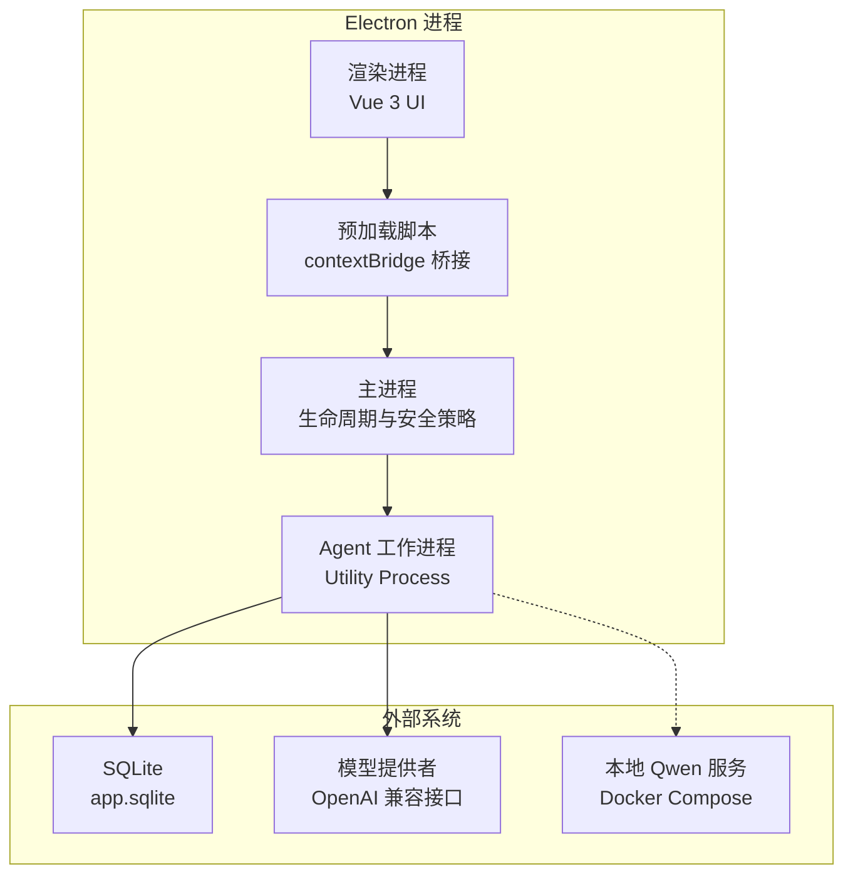
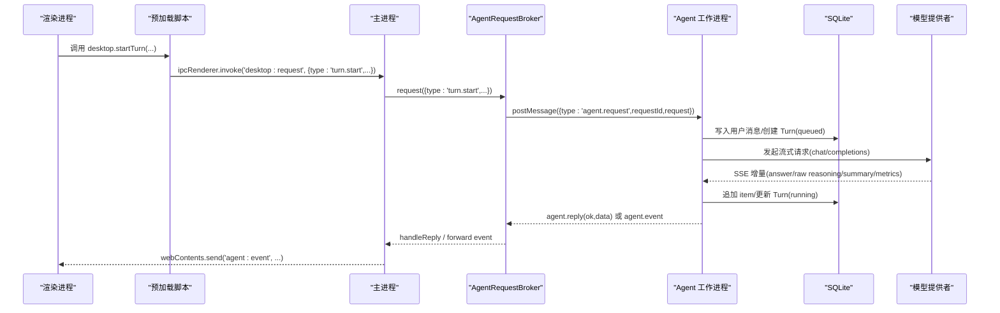
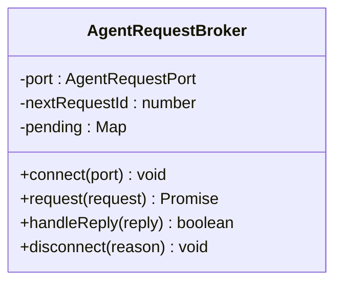
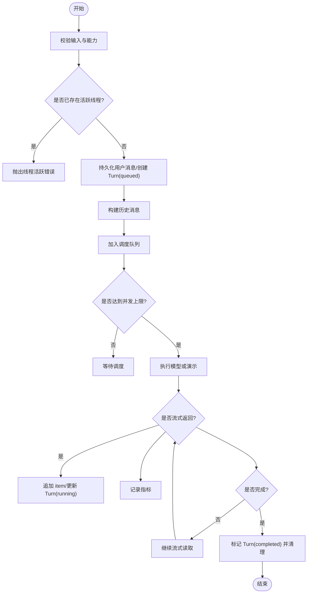
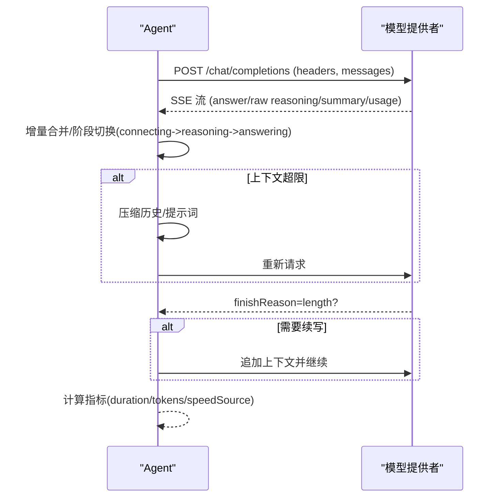
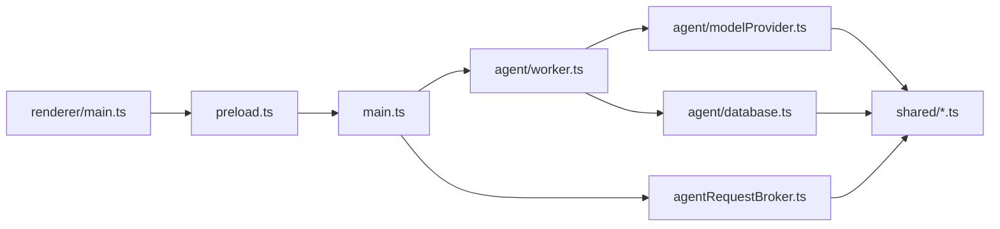
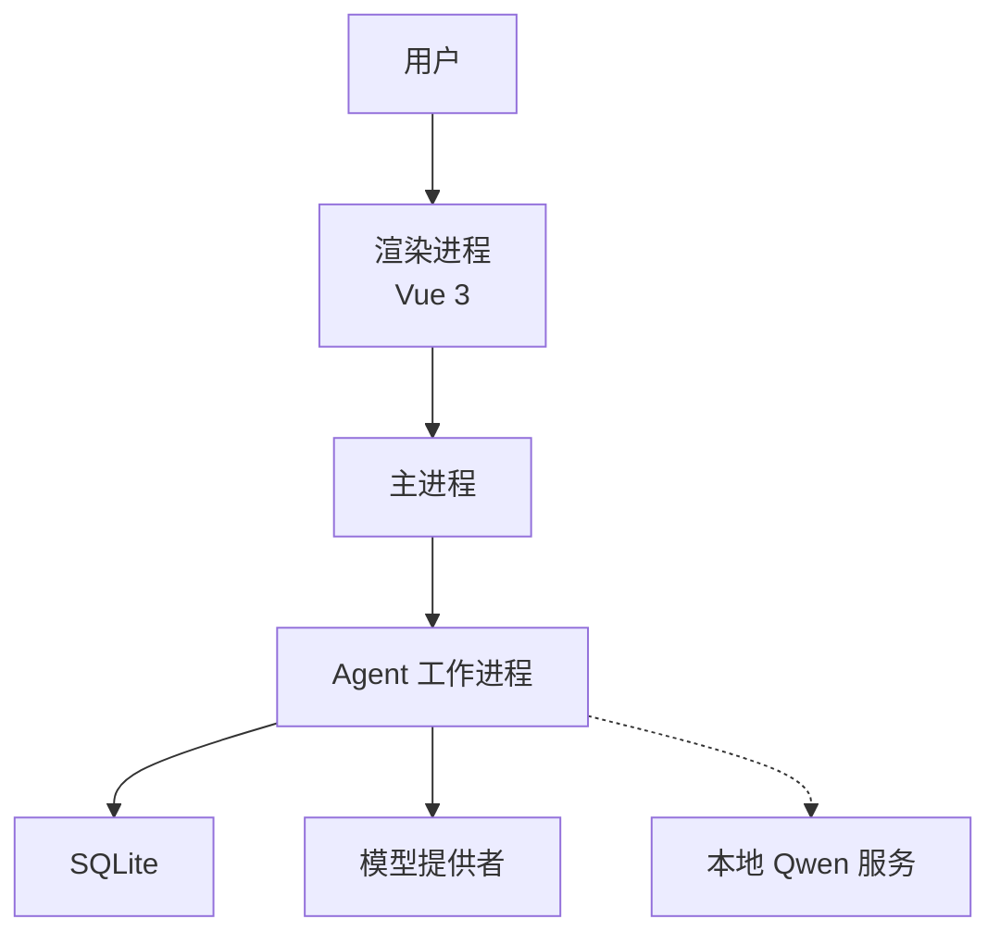
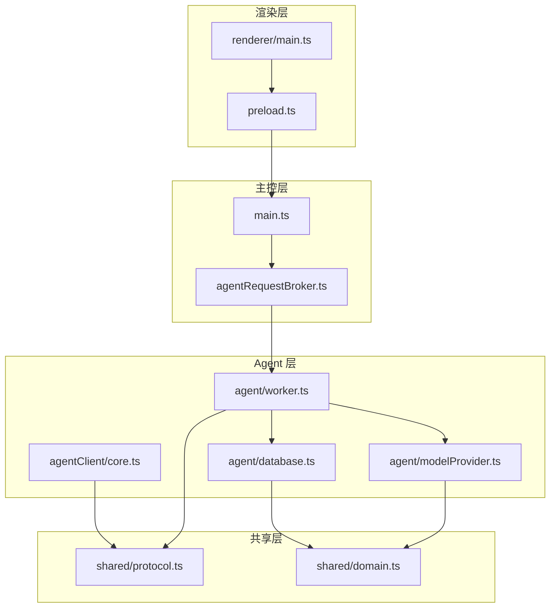

# 架构设计

<cite>
**本文引用的文件**
- [package.json](file://package.json)
- [README.md](file://README.md)
- [forge.config.ts](file://forge.config.ts)
- [vite.main.config.ts](file://vite.main.config.ts)
- [vite.agent.config.ts](file://vite.agent.config.ts)
- [src/main.ts](file://src/main.ts)
- [src/preload.ts](file://src/preload.ts)
- [src/renderer/main.ts](file://src/renderer/main.ts)
- [src/agent/worker.ts](file://src/agent/worker.ts)
- [src/main/agentRequestBroker.ts](file://src/main/agentRequestBroker.ts)
- [src/shared/protocol.ts](file://src/shared/protocol.ts)
- [src/shared/domain.ts](file://src/shared/domain.ts)
- [src/agent/modelProvider.ts](file://src/agent/modelProvider.ts)
- [src/agent/database.ts](file://src/agent/database.ts)
- [src/agentClient/core.ts](file://src/agentClient/core.ts)
</cite>

## 目录
1. [简介](#简介)
2. [项目结构](#项目结构)
3. [核心组件](#核心组件)
4. [架构总览](#架构总览)
5. [详细组件分析](#详细组件分析)
6. [依赖关系分析](#依赖关系分析)
7. [性能考量](#性能考量)
8. [故障排查指南](#故障排查指南)
9. [结论](#结论)
10. [附录](#附录)

## 简介
本文件为 Private AI Desktop 的多进程架构文档，面向技术读者与产品/运维人员。内容覆盖高层设计、架构模式、系统边界、主进程/渲染进程/Agent 工作进程的交互关系、数据流与集成模式；并说明技术决策、权衡与约束、基础设施要求、可扩展性、部署拓扑、安全性、监控与灾难恢复，以及技术栈、第三方依赖与版本兼容性。

该应用基于 Electron 多进程模型：
- 渲染进程仅负责 Vue 3 UI，无直接文件系统、Shell、SQLite 或密钥访问。
- Preload 通过 contextBridge 暴露最小化 window.desktop API。
- 主进程管理 Electron 生命周期、窗口安全策略与请求/事件转发。
- Utility Process（Agent）承担调度、模型调用、演示代理运行时与 SQLite 持久化。
- 数据库使用 app.userData 下的 SQLite，开启 WAL、外键与忙超时。

E2E 测试可通过环境变量隔离用户数据路径，避免污染真实桌面配置。

**章节来源**
- [README.md:104-112](file://README.md#L104-L112)

## 项目结构
仓库采用按职责分层的组织方式：
- src/main：主进程入口与 Agent 请求代理。
- src/preload：桥接层，暴露受限 IPC API。
- src/renderer：Vue 3 渲染进程代码。
- src/agent：Agent 工作进程，包含调度、模型调用、数据库与演示代理。
- src/shared：跨进程共享类型与协议校验。
- src/agentClient：渲染端状态机，用于合并快照与增量事件。
- model-runtime：独立本地 Qwen 服务脚本（非 Electron 进程）。
- scripts、tests、docs：构建、测试与设计文档。

**图表来源**
- [src/main.ts:1-170](file://src/main.ts#L1-L170)
- [src/preload.ts:1-32](file://src/preload.ts#L1-L32)
- [src/agent/worker.ts:1-124](file://src/agent/worker.ts#L1-L124)
- [src/agent/database.ts:1-64](file://src/agent/database.ts#L1-L64)
- [src/agent/modelProvider.ts:55-197](file://src/agent/modelProvider.ts#L55-L197)

**章节来源**
- [forge.config.ts:9-46](file://forge.config.ts#L9-L46)
- [vite.main.config.ts:1-10](file://vite.main.config.ts#L1-L10)
- [vite.agent.config.ts:1-10](file://vite.agent.config.ts#L1-L10)

## 核心组件
- 主进程（main.ts）：创建 BrowserWindow、启用安全选项、启动 Agent 工作进程、建立 MessageChannelMain 通道、维护 AgentRequestBroker 处理请求/响应与超时、将 Agent 事件转发给渲染进程。
- 预加载（preload.ts）：通过 contextBridge 暴露 health、snapshot、group/thread/turn 操作、设置更新、模型配置保存/删除/测试、订阅 agent:event。
- Agent 工作进程（worker.ts）：接收端口消息，初始化数据库与 WorkerTurnRuntime；实现 turn.start/cancel/approval/respond、队列与并发控制、模型流式调用、演示模式、事件序列化和持久化。
- 请求代理（agentRequestBroker.ts）：封装对 Agent 的异步请求，维护 pending 映射、超时与断连重放失败。
- 共享协议（protocol.ts）：定义 DesktopRequest、SequencedAgentEvent、AgentEvent 及严格的结构校验器。
- 领域模型（domain.ts）：统一描述线程、会话项、审批、模型配置、运行指标等。
- 模型提供者（modelProvider.ts）：实现 OpenAI 兼容流式聊天完成、SSE 解析、上下文压缩、重试与续写、超时与错误脱敏、连接测试。
- 数据库（database.ts）：SQLite 封装，事务、迁移、快照聚合、模型配置与设置读写、未完成轮次中断。
- 客户端状态机（agentClient/core.ts）：在渲染端合并快照与增量事件，维护线程运行时状态、乐观插入、终止状态索引与去重。

**章节来源**
- [src/main.ts:1-170](file://src/main.ts#L1-L170)
- [src/preload.ts:1-32](file://src/preload.ts#L1-L32)
- [src/agent/worker.ts:1-124](file://src/agent/worker.ts#L1-L124)
- [src/main/agentRequestBroker.ts:1-86](file://src/main/agentRequestBroker.ts#L1-L86)
- [src/shared/protocol.ts:22-65](file://src/shared/protocol.ts#L22-L65)
- [src/shared/domain.ts:1-319](file://src/shared/domain.ts#L1-L319)
- [src/agent/modelProvider.ts:55-197](file://src/agent/modelProvider.ts#L55-L197)
- [src/agent/database.ts:136-201](file://src/agent/database.ts#L136-L201)
- [src/agentClient/core.ts:55-174](file://src/agentClient/core.ts#L55-L174)

## 架构总览
系统采用“渲染进程 + 主进程 + Utility Process（Agent）”的三进程架构，结合 SQLite 本地持久化与远程模型提供者。关键设计要点：
- 安全边界：渲染进程不直接接触敏感能力；所有能力通过 preload 暴露的最小 API 访问。
- 可靠性：Agent 工作进程承载业务逻辑与 I/O，崩溃时主进程可重启；请求有超时与断连保护。
- 一致性：事件带 threadId/turnId/sequence，渲染端状态机保证顺序与幂等；数据库使用事务与 WAL。
- 可扩展性：模型提供者抽象支持不同后端；能力声明驱动 UI 行为；并发限制按 profile 粒度控制。

**图表来源**
- [src/preload.ts:15-25](file://src/preload.ts#L15-L25)
- [src/main.ts:103-143](file://src/main.ts#L103-L143)
- [src/main/agentRequestBroker.ts:33-62](file://src/main/agentRequestBroker.ts#L33-L62)
- [src/agent/worker.ts:407-441](file://src/agent/worker.ts#L407-L441)
- [src/agent/modelProvider.ts:55-197](file://src/agent/modelProvider.ts#L55-L197)

## 详细组件分析

### 主进程与 Agent 请求代理
- 主进程负责：
  - 创建窗口并启用沙箱与上下文隔离。
  - 启动 Agent 工作进程并通过 MessageChannelMain 传递端口。
  - 维护 AgentRequestBroker，封装请求 ID、超时、断连与重入保护。
  - 将 Agent 事件转发到渲染进程。
- AgentRequestBroker：
  - 维护 pending 请求 Map，分配 requestId，设置超时定时器。
  - 收到 agent.reply 后 resolve/reject 对应 Promise。
  - 断开时将全部 pending 请求拒绝。

**图表来源**
- [src/main/agentRequestBroker.ts:15-86](file://src/main/agentRequestBroker.ts#L15-L86)

**章节来源**
- [src/main.ts:1-170](file://src/main.ts#L1-L170)
- [src/main/agentRequestBroker.ts:1-86](file://src/main/agentRequestBroker.ts#L1-L86)

### Agent 工作进程与任务调度
- 工作进程初始化：
  - 接收主进程发送的端口与数据库路径，打开 SQLite，创建 WorkerTurnRuntime。
  - 监听端口消息，路由到 handleDesktopRequest。
- 任务调度：
  - ModelTurnScheduler 按 modelProfileId 维度维护并发限制与 FIFO 队列。
  - 每个 turn 拥有唯一 turnId，事件携带 sequence 保证顺序。
  - 支持取消、批准/拒绝审批、更新并发上限。
- 执行流程：
  - 若选择模型则调用 streamChatCompletion；否则进入 demoAgent。
  - 流式回调将 answer/raw reasoning/summary 增量写入数据库并推送事件。
  - 完成后标记 Turn 为 completed，清理活跃上下文。

**图表来源**
- [src/agent/worker.ts:155-405](file://src/agent/worker.ts#L155-L405)
- [src/agent/worker.ts:407-441](file://src/agent/worker.ts#L407-L441)

**章节来源**
- [src/agent/worker.ts:1-124](file://src/agent/worker.ts#L1-L124)
- [src/agent/worker.ts:155-405](file://src/agent/worker.ts#L155-L405)
- [src/agent/worker.ts:407-441](file://src/agent/worker.ts#L407-L441)

### 模型提供者与流式处理
- 流式聊天完成：
  - 构造请求头（含可选 API Key），根据 maxOutputTokens 计算默认超时。
  - 读取 SSE 流，解析 answer/raw reasoning/summary 增量与 usage。
  - 遇到长度限制自动续写；上下文过大时进行本地压缩并重试。
  - 合并多次尝试的指标，计算 tokensPerSecond 与速度来源。
- 连接测试：
  - 探测模型元信息，超时返回连接结果。
- 错误处理：
  - 脱敏错误信息，避免泄露密钥；区分上下文超限与压缩失败。

**图表来源**
- [src/agent/modelProvider.ts:55-197](file://src/agent/modelProvider.ts#L55-L197)
- [src/agent/modelProvider.ts:563-680](file://src/agent/modelProvider.ts#L563-L680)
- [src/agent/modelProvider.ts:762-795](file://src/agent/modelProvider.ts#L762-L795)

**章节来源**
- [src/agent/modelProvider.ts:55-197](file://src/agent/modelProvider.ts#L55-L197)
- [src/agent/modelProvider.ts:535-561](file://src/agent/modelProvider.ts#L535-L561)
- [src/agent/modelProvider.ts:563-680](file://src/agent/modelProvider.ts#L563-L680)

### 数据库与快照
- 数据结构：
  - threads、chat_groups、turns、items、approvals、settings、model_profiles。
- 特性：
  - WAL 模式、外键约束、忙超时。
  - 迁移机制确保向后兼容。
  - getSnapshot 聚合组、线程、轮次、项、审批、模型配置与设置。
  - 支持中断未完成轮次，清理待批审批。
- 优化：
  - 批量查询与 JSON 字段存储 items payload。
  - 合并助手消息片段以减少冗余。

**章节来源**
- [src/agent/database.ts:136-201](file://src/agent/database.ts#L136-L201)
- [src/agent/database.ts:629-759](file://src/agent/database.ts#L629-L759)

### 渲染端状态机
- 事件归约：
  - 处理 snapshot 与 SequencedAgentEvent，维护 lastSequenceByTurn 去重。
  - 合并 assistant 与 reasoning 增量文本，保持 incomplete 标志。
  - 维护线程运行时状态（queued/running/cancelling/completed/failed/cancelled/interrupted）。
- 乐观更新：
  - 提交后立即插入用户消息，等待服务端确认。
- 终止状态索引：
  - 快速判断 turn 是否已完成/失败/取消，避免重复渲染。

**章节来源**
- [src/agentClient/core.ts:55-174](file://src/agentClient/core.ts#L55-L174)
- [src/agentClient/core.ts:293-380](file://src/agentClient/core.ts#L293-L380)
- [src/agentClient/core.ts:741-800](file://src/agentClient/core.ts#L741-L800)

## 依赖关系分析
- 进程间通信：
  - 渲染进程通过 preload 暴露的 window.desktop 调用 IPC。
  - 主进程通过 MessageChannelMain 与 Agent 工作进程通信。
  - Agent 工作进程通过 SQLite 与 HTTP 访问模型提供者。
- 模块耦合：
  - shared/protocol.ts 被 main、agent、agentClient 共同引用，作为契约。
  - agent/modelProvider.ts 依赖 shared/redaction、modelCapabilities、modelConnection。
  - agent/database.ts 依赖 localQwenProfile、modelCapabilities。
- 外部依赖：
  - Electron 提供进程、IPC、窗口、UtilityProcess。
  - node:sqlite 提供本地数据库。
  - Vite/Electron Forge 负责构建与打包。

**图表来源**
- [src/preload.ts:1-32](file://src/preload.ts#L1-L32)
- [src/main.ts:1-170](file://src/main.ts#L1-L170)
- [src/main/agentRequestBroker.ts:1-86](file://src/main/agentRequestBroker.ts#L1-L86)
- [src/agent/worker.ts:1-124](file://src/agent/worker.ts#L1-L124)
- [src/agent/database.ts:1-64](file://src/agent/database.ts#L1-L64)
- [src/agent/modelProvider.ts:1-7](file://src/agent/modelProvider.ts#L1-L7)
- [src/shared/protocol.ts:1-20](file://src/shared/protocol.ts#L1-L20)
- [src/renderer/main.ts:1-7](file://src/renderer/main.ts#L1-L7)

**章节来源**
- [package.json:16-33](file://package.json#L16-L33)
- [forge.config.ts:9-46](file://forge.config.ts#L9-L46)

## 性能考量
- 并发控制：
  - 按 modelProfileId 维度限制并发，FIFO 排队；不同 profile 独立队列。
  - 取消进行中任务释放一个槽位；取消排队任务移除一次。
- 流式处理：
  - SSE 增量解析，避免全量缓冲；重复 id 去重；累积规范化仅在显式模式下启用。
  - 上下文压缩在接近阈值时触发，逐步降级以维持可用性。
- 超时与重试：
  - 模型请求默认超时基于 maxOutputTokens 与 token 超时；连接测试独立超时。
  - 上下文超限时自动压缩并重试，最多三次。
- 数据库：
  - WAL 提升并发读性能；busy_timeout 降低锁竞争。
  - 事务包裹关键写路径，保证一致性。

[本节为通用指导，无需特定文件来源]

## 故障排查指南
- Agent 未就绪：
  - 主进程检查 AgentRequestBroker.pendingCount 与超时错误；断连时拒绝所有 pending 请求。
- 模型不可达：
  - 连接测试返回 offline/model-mismatch；检查 baseUrl、API Key、网络可达性与模型名称匹配。
- 上下文超限：
  - 自动压缩并重试；若仍失败，减少历史消息或提高上下文窗口。
- 流式异常：
  - SSE 重复 id 冲突会报错；检查上游服务实现。
- 权限与审批：
  - 演示模式需审批的操作会暂停；通过 approval.respond 响应。
- 数据库：
  - 检查 WAL 与外键是否启用；迁移失败时查看 schema_migrations。

**章节来源**
- [src/main/agentRequestBroker.ts:33-86](file://src/main/agentRequestBroker.ts#L33-L86)
- [src/agent/modelProvider.ts:535-561](file://src/agent/modelProvider.ts#L535-L561)
- [src/agent/modelProvider.ts:563-680](file://src/agent/modelProvider.ts#L563-L680)
- [src/agent/worker.ts:444-452](file://src/agent/worker.ts#L444-L452)
- [src/agent/database.ts:629-759](file://src/agent/database.ts#L629-L759)

## 结论
Private AI Desktop 通过清晰的多进程边界与严格的协议校验，实现了安全的本地 AI 桌面体验。主进程负责安全与编排，Agent 工作进程专注业务与 I/O，渲染进程专注于 UI。结合 SQLite 持久化与模型提供者抽象，系统在可靠性、一致性与可扩展性之间取得平衡。未来可在以下方面增强：
- 增加更多模型适配器与能力检测自动化。
- 引入更细粒度的遥测与错误上报。
- 扩展工作区信任与网络策略。
- 优化上下文压缩策略与长对话体验。

[本节为总结，无需特定文件来源]

## 附录

### 系统上下文图

**图表来源**
- [src/main.ts:1-170](file://src/main.ts#L1-L170)
- [src/agent/worker.ts:1-124](file://src/agent/worker.ts#L1-L124)
- [src/agent/database.ts:1-64](file://src/agent/database.ts#L1-L64)
- [src/agent/modelProvider.ts:55-197](file://src/agent/modelProvider.ts#L55-L197)

### 组件分解图

**图表来源**
- [src/renderer/main.ts:1-7](file://src/renderer/main.ts#L1-L7)
- [src/preload.ts:1-32](file://src/preload.ts#L1-L32)
- [src/main.ts:1-170](file://src/main.ts#L1-L170)
- [src/main/agentRequestBroker.ts:1-86](file://src/main/agentRequestBroker.ts#L1-L86)
- [src/agent/worker.ts:1-124](file://src/agent/worker.ts#L1-L124)
- [src/agent/database.ts:1-64](file://src/agent/database.ts#L1-L64)
- [src/agent/modelProvider.ts:1-7](file://src/agent/modelProvider.ts#L1-L7)
- [src/agentClient/core.ts:1-26](file://src/agentClient/core.ts#L1-L26)
- [src/shared/protocol.ts:1-20](file://src/shared/protocol.ts#L1-L20)
- [src/shared/domain.ts:1-30](file://src/shared/domain.ts#L1-L30)

### 技术栈与依赖
- 前端：Vue 3、Vite。
- 桌面框架：Electron（进程、IPC、窗口、UtilityProcess）。
- 构建工具：Electron Forge、Vite 插件。
- 数据库：node:sqlite（WAL、外键、忙超时）。
- 测试：Vitest、Playwright（E2E）。
- 打包：ASAR 限制生产资源，忽略开发/测试/缓存材料。

**章节来源**
- [package.json:16-33](file://package.json#L16-L33)
- [forge.config.ts:9-46](file://forge.config.ts#L9-L46)
- [README.md:114-118](file://README.md#L114-L118)

### 部署拓扑与基础设施
- 本地 Qwen 服务：
  - 独立 Docker Compose 运行时，不在 Electron 进程内。
  - 提供 OpenAI 兼容接口；需提前启动并保持可用。
- 用户数据：
  - SQLite 位于 app.userData 下；E2E 可通过环境变量隔离。
- 分发：
  - ASAR 限制生产资源大小与类型；Forge 生成跨平台包。

**章节来源**
- [README.md:16-35](file://README.md#L16-L35)
- [README.md:104-112](file://README.md#L104-L112)
- [forge.config.ts:9-46](file://forge.config.ts#L9-L46)

### 安全性、监控与灾难恢复
- 安全性：
  - 渲染进程沙箱与上下文隔离；密钥仅存在于 Agent 与 SQLite。
  - 错误信息脱敏，避免泄露 API Key。
- 监控：
  - 每轮次记录 duration、timeToFirstToken、tokensPerSecond、usageSource。
  - 连接测试报告离线/模型不匹配/并发警告。
- 灾难恢复：
  - 应用/运行时重启后，未完成轮次标记为 interrupted，不自动重放。
  - 数据库事务与 WAL 保障一致性；迁移机制确保升级兼容。

**章节来源**
- [src/main.ts:56-95](file://src/main.ts#L56-L95)
- [src/agent/modelProvider.ts:163-185](file://src/agent/modelProvider.ts#L163-L185)
- [src/agent/modelProvider.ts:535-561](file://src/agent/modelProvider.ts#L535-L561)
- [README.md:57-68](file://README.md#L57-L68)
- [src/agent/database.ts:451-473](file://src/agent/database.ts#L451-L473)