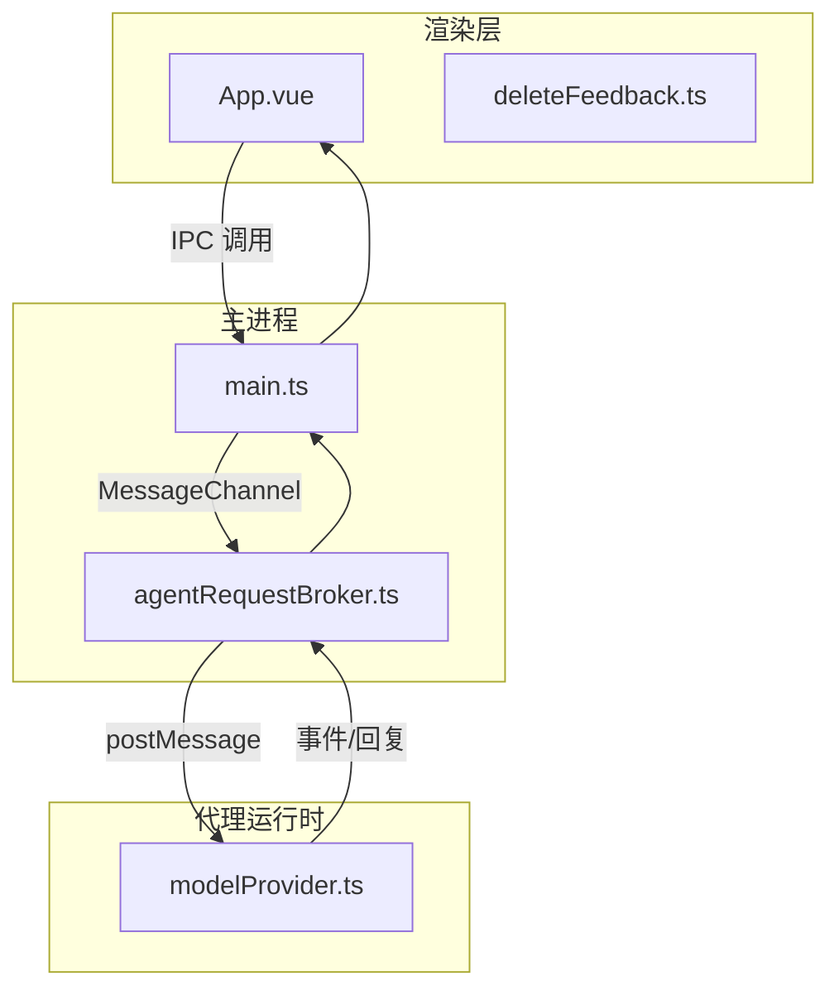
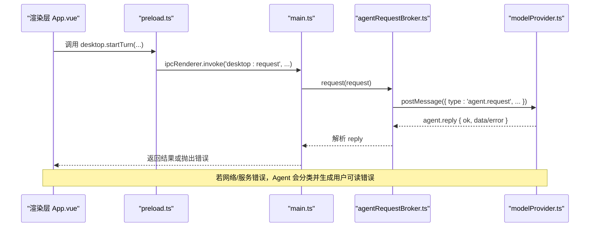
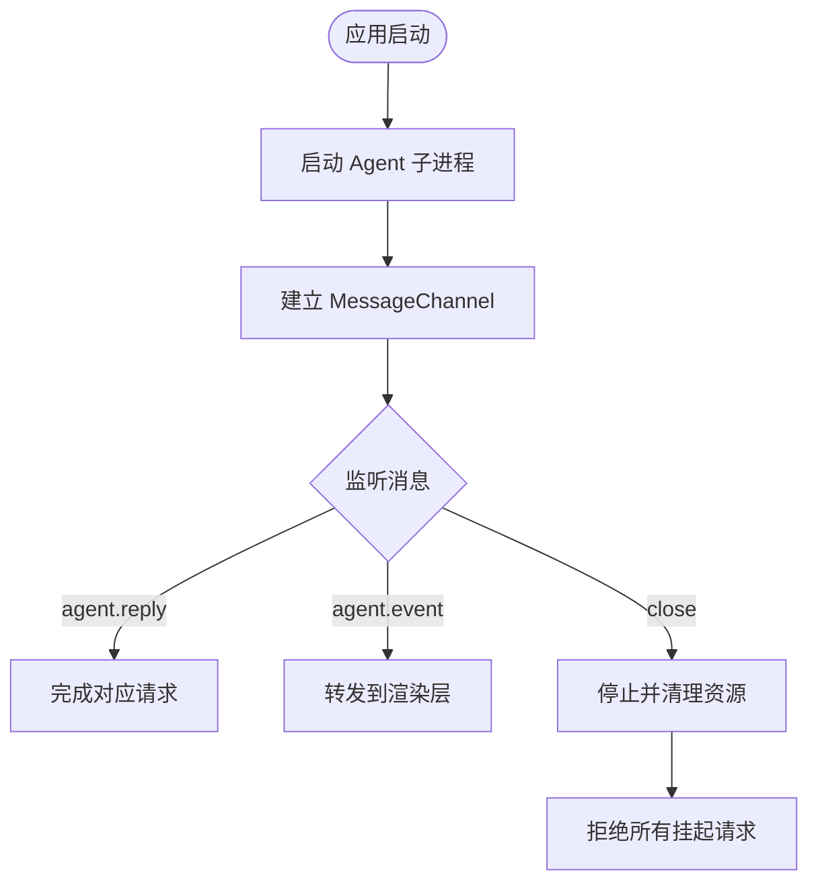
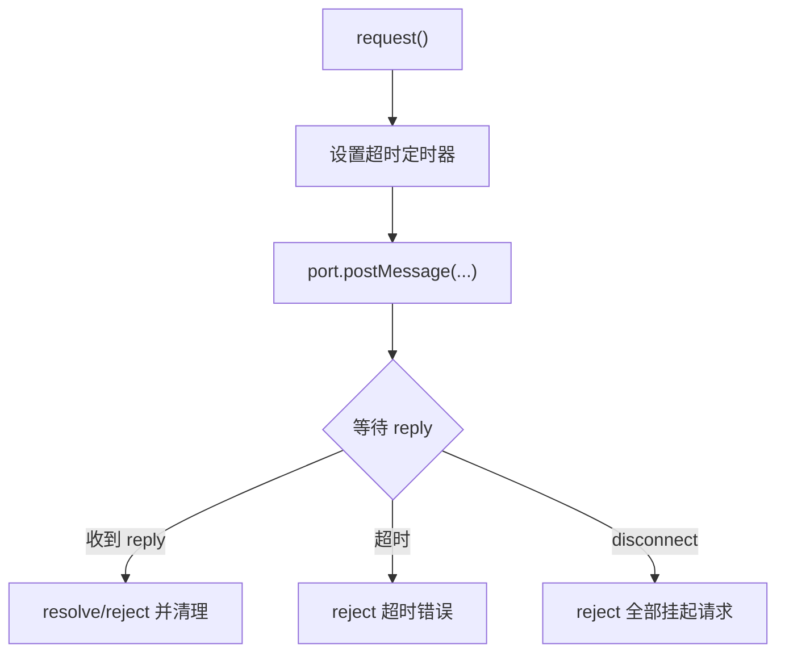
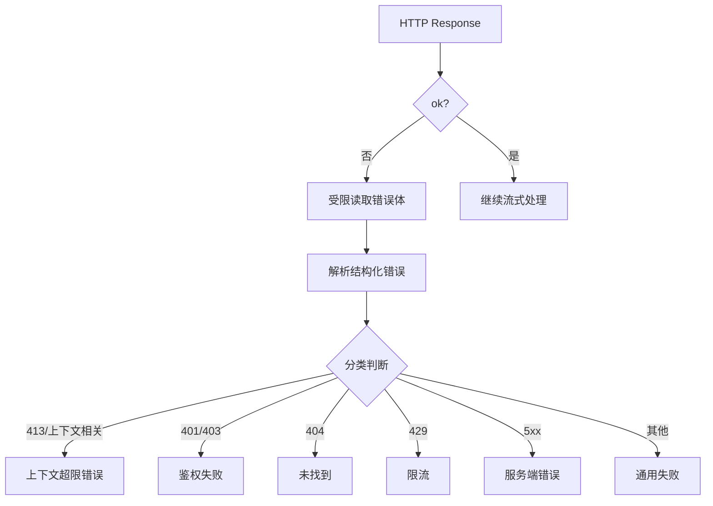
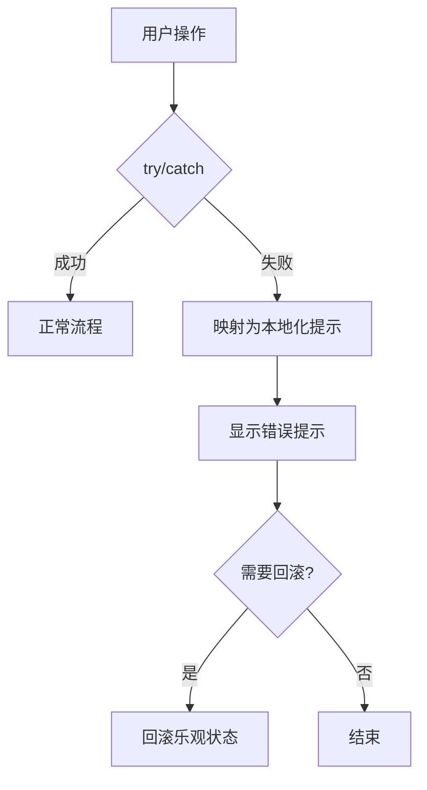
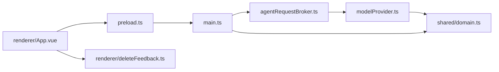

# 错误处理和恢复

<cite>
**本文引用的文件**
- [src/main.ts](file://src/main.ts)
- [src/preload.ts](file://src/preload.ts)
- [src/main/agentRequestBroker.ts](file://src/main/agentRequestBroker.ts)
- [src/shared/domain.ts](file://src/shared/domain.ts)
- [src/shared/operationErrors.ts](file://src/shared/operationErrors.ts)
- [src/shared/redaction.ts](file://src/shared/redaction.ts)
- [src/agent/modelProvider.ts](file://src/agent/modelProvider.ts)
- [src/renderer/App.vue](file://src/renderer/App.vue)
- [src/renderer/deleteFeedback.ts](file://src/renderer/deleteFeedback.ts)
- [tests/agentRequestBroker.test.ts](file://tests/agentRequestBroker.test.ts)
- [tests/modelProvider.test.ts](file://tests/modelProvider.test.ts)
- [tests/worker.test.ts](file://tests/worker.test.ts)
- [tests/e2e/app.spec.ts](file://tests/e2e/app.spec.ts)
</cite>

## 目录
1. [简介](#简介)
2. [项目结构](#项目结构)
3. [核心组件](#核心组件)
4. [架构总览](#架构总览)
5. [详细组件分析](#详细组件分析)
6. [依赖关系分析](#依赖关系分析)
7. [性能与可靠性考量](#性能与可靠性考量)
8. [故障排除指南](#故障排除指南)
9. [结论](#结论)
10. [附录：错误码与消息约定](#附录错误码与消息约定)

## 简介
本文件系统性梳理 Private AI Desktop 的错误处理与恢复机制，覆盖前端错误捕获、主进程异常处理、代理运行时（Agent）生命周期监控、模型服务请求错误分类、超时与取消、重试与降级策略、日志脱敏、用户友好提示、以及调试与可观测性集成。文档同时给出关键流程图与时序图，帮助读者快速定位问题并制定修复方案。

## 项目结构
错误处理贯穿三层：
- 渲染层（Renderer）：负责用户可见的错误提示、操作失败反馈、状态回滚。
- 主进程（Main）：负责启动/监控 Agent 子进程、IPC 转发、请求超时与断开重连。
- 代理运行时（Agent）：负责模型连接检测、流式请求、结构化错误解析、上下文限制与速率限制等错误分类。

**图表来源**
- [src/main.ts:19-54](file://src/main.ts#L19-L54)
- [src/main/agentRequestBroker.ts:15-85](file://src/main/agentRequestBroker.ts#L15-L85)
- [src/agent/modelProvider.ts:904-993](file://src/agent/modelProvider.ts#L904-L993)

**章节来源**
- [src/main.ts:19-54](file://src/main.ts#L19-L54)
- [src/main/agentRequestBroker.ts:15-85](file://src/main/agentRequestBroker.ts#L15-L85)
- [src/agent/modelProvider.ts:904-993](file://src/agent/modelProvider.ts#L904-L993)

## 核心组件
- 主进程进程守护与 IPC 路由：启动 Agent 子进程，监听退出与端口关闭，统一通过 Broker 管理请求与超时。
- 请求代理与超时控制：为每个请求设置截止时间，支持断连时批量拒绝挂起请求。
- 模型连接与请求错误分类：将 HTTP 状态码与结构化错误体映射为用户可读错误；对上下文超限、鉴权失败、限流、服务端错误等进行区分。
- 前端错误捕获与用户提示：统一捕获删除、发送、设置等操作错误，输出本地化友好提示。
- 日志与敏感信息脱敏：在错误文本中自动替换密钥、令牌等敏感片段。
- 运行期指标与诊断：连接测试结果包含状态、并发度与服务槽位信息，用于前端诊断展示。

**章节来源**
- [src/main.ts:19-54](file://src/main.ts#L19-L54)
- [src/main/agentRequestBroker.ts:15-85](file://src/main/agentRequestBroker.ts#L15-L85)
- [src/agent/modelProvider.ts:904-993](file://src/agent/modelProvider.ts#L904-L993)
- [src/shared/redaction.ts:1-38](file://src/shared/redaction.ts#L1-L38)
- [src/shared/domain.ts:194-236](file://src/shared/domain.ts#L194-L236)

## 架构总览
下图展示了从 UI 发起请求到模型服务返回的完整链路，以及错误在各层的传播路径。

**图表来源**
- [src/preload.ts:15-25](file://src/preload.ts#L15-L25)
- [src/main.ts:103-108](file://src/main.ts#L103-L108)
- [src/main/agentRequestBroker.ts:33-63](file://src/main/agentRequestBroker.ts#L33-L63)
- [src/agent/modelProvider.ts:904-993](file://src/agent/modelProvider.ts#L904-L993)

## 详细组件分析

### 主进程：Agent 子进程守护与 IPC 路由
- 启动与监控：使用 UtilityProcess 启动 worker.js，监听 exit/close 事件，异常退出时清理资源并通知上层。
- 请求分发：所有桌面端请求经 ipcMain.handle('desktop:request') 进入 Broker，按 requestId 匹配响应或超时拒绝。
- 断开处理：当端口关闭或显式 disconnect，立即拒绝所有 pending 请求，避免悬挂任务。

**图表来源**
- [src/main.ts:19-54](file://src/main.ts#L19-L54)
- [src/main.ts:135-156](file://src/main.ts#L135-L156)
- [src/main/agentRequestBroker.ts:65-85](file://src/main/agentRequestBroker.ts#L65-L85)

**章节来源**
- [src/main.ts:19-54](file://src/main.ts#L19-L54)
- [src/main.ts:135-156](file://src/main.ts#L135-L156)
- [src/main/agentRequestBroker.ts:65-85](file://src/main/agentRequestBroker.ts#L65-L85)

### 请求代理与超时控制（AgentRequestBroker）
- 超时：每个请求创建定时器，到期后拒绝并清理。
- 断连：disconnect 时批量拒绝所有 pending 请求，确保无悬挂 Promise。
- 测试覆盖：验证超时拒绝与断连拒绝行为。

**图表来源**
- [src/main/agentRequestBroker.ts:33-85](file://src/main/agentRequestBroker.ts#L33-L85)

**章节来源**
- [src/main/agentRequestBroker.ts:33-85](file://src/main/agentRequestBroker.ts#L33-L85)
- [tests/agentRequestBroker.test.ts:8-37](file://tests/agentRequestBroker.test.ts#L8-L37)

### 模型连接与请求错误分类（modelProvider）
- 连接检测：inspectModelConnection 将网络不可用、HTTP 非 2xx、JSON 解析失败等统一转换为 ModelConnectionResult，便于前端诊断。
- 错误分类：
  - 上下文超限：根据状态码 413 或结构化字段识别。
  - 鉴权失败：401/403。
  - 未找到：404。
  - 限流：429。
  - 服务端错误：5xx。
  - 其他：通用失败。
- 流式兼容：针对特定参数（如 stream_options/include_usage）进行兼容性判断。
- 安全读取：错误体以流式读取并限制最大字节数，避免恶意大响应导致内存压力。

**图表来源**
- [src/agent/modelProvider.ts:904-993](file://src/agent/modelProvider.ts#L904-L993)
- [src/agent/modelProvider.ts:995-1039](file://src/agent/modelProvider.ts#L995-L1039)

**章节来源**
- [src/agent/modelProvider.ts:904-993](file://src/agent/modelProvider.ts#L904-L993)
- [src/agent/modelProvider.ts:995-1039](file://src/agent/modelProvider.ts#L995-L1039)
- [tests/modelProvider.test.ts:98-127](file://tests/modelProvider.test.ts#L98-L127)
- [tests/modelProvider.test.ts:220-253](file://tests/modelProvider.test.ts#L220-L253)

### 前端错误捕获与用户提示（App.vue / deleteFeedback.ts）
- 统一捕获：删除聊天/分组、发送消息、更新模型配置等操作均 try/catch 捕获错误，并显示本地化提示。
- 操作级反馈：deleteFailureFeedback 将底层错误映射为“活动任务未结束”等用户可理解提示，并忽略内部细节。
- 状态回滚：启动 turn 失败时仅回滚乐观目标状态，保证界面一致性。

**图表来源**
- [src/renderer/App.vue:61-121](file://src/renderer/App.vue#L61-L121)
- [src/renderer/deleteFeedback.ts:15-33](file://src/renderer/deleteFeedback.ts#L15-L33)
- [tests/renderer-state.test.ts:1630-1660](file://tests/renderer-state.test.ts#L1630-L1660)

**章节来源**
- [src/renderer/App.vue:61-121](file://src/renderer/App.vue#L61-L121)
- [src/renderer/deleteFeedback.ts:15-33](file://src/renderer/deleteFeedback.ts#L15-L33)
- [tests/renderer-state.test.ts:1630-1660](file://tests/renderer-state.test.ts#L1630-L1660)

### 日志与敏感信息脱敏
- safeErrorText：将任意错误对象转为字符串，去除多余空白，截断长度，并对敏感信息进行脱敏。
- redactSensitiveText：基于精确匹配与编码变体替换敏感片段，并额外屏蔽 Authorization/Bearer 令牌。

**章节来源**
- [src/shared/redaction.ts:1-38](file://src/shared/redaction.ts#L1-L38)

### 运行期指标与诊断
- ModelConnectionResult：包含 ok/status/message/model/clientConcurrency/serviceSlots 等字段，用于前端诊断面板展示。
- 指标记录：每轮运行记录耗时、首 token 时间、token 用量、速度来源等，辅助性能分析与问题定位。

**章节来源**
- [src/shared/domain.ts:194-236](file://src/shared/domain.ts#L194-L236)
- [src/shared/domain.ts:238-257](file://src/shared/domain.ts#L238-L257)

## 依赖关系分析
- 渲染层依赖 preload 暴露的 API，通过 IPC 与主进程通信。
- 主进程依赖 AgentRequestBroker 管理请求生命周期，依赖 modelProvider 的错误分类能力。
- 代理运行时依赖结构化错误解析与流式读取，避免内存风险。
- 共享类型 domain.ts 定义连接结果、运行指标、线程/会话状态等，贯穿各层。

**图表来源**
- [src/renderer/App.vue:1-121](file://src/renderer/App.vue#L1-L121)
- [src/preload.ts:1-36](file://src/preload.ts#L1-L36)
- [src/main.ts:103-108](file://src/main.ts#L103-L108)
- [src/main/agentRequestBroker.ts:15-85](file://src/main/agentRequestBroker.ts#L15-L85)
- [src/agent/modelProvider.ts:904-993](file://src/agent/modelProvider.ts#L904-L993)
- [src/shared/domain.ts:194-236](file://src/shared/domain.ts#L194-L236)

**章节来源**
- [src/renderer/App.vue:1-121](file://src/renderer/App.vue#L1-L121)
- [src/preload.ts:1-36](file://src/preload.ts#L1-L36)
- [src/main.ts:103-108](file://src/main.ts#L103-L108)
- [src/main/agentRequestBroker.ts:15-85](file://src/main/agentRequestBroker.ts#L15-L85)
- [src/agent/modelProvider.ts:904-993](file://src/agent/modelProvider.ts#L904-L993)
- [src/shared/domain.ts:194-236](file://src/shared/domain.ts#L194-L236)

## 性能与可靠性考量
- 错误体读取限制：通过流式读取并限制最大字节数，防止恶意大响应造成内存占用过高。
- 超时保护：请求级超时与连接测试超时，避免长时间阻塞。
- 取消传播：AbortSignal 贯穿请求链，确保取消及时生效。
- 并发与限流：连接结果中的 clientConcurrency 与 serviceSlots 可用于前端并发控制与降级提示。
- 健壮性：断连时批量拒绝挂起请求，避免悬挂任务与资源泄漏。

[本节为通用指导，不直接分析具体文件]

## 故障排除指南
- 模型服务不可用
  - 现象：连接测试返回 offline，或 HTTP 非 2xx。
  - 排查：检查 baseUrl、模型名、网络连通性与鉴权配置。
  - 参考：连接检测结果与错误分类逻辑。
- 上下文超限
  - 现象：413 或结构化错误标识上下文长度超出。
  - 处理：开启新对话或降低历史消息限制。
- 鉴权失败
  - 现象：401/403。
  - 处理：核对 API Key 与权限范围。
- 限流
  - 现象：429。
  - 处理：稍后重试或降低并发。
- 服务端错误
  - 现象：5xx。
  - 处理：查看服务端日志，必要时重试或切换模型。
- 代理运行时异常
  - 现象：子进程意外退出或端口关闭。
  - 处理：重启应用或检查 worker 启动参数与数据库路径。
- 删除操作失败
  - 现象：提示需先停止或取消活动任务。
  - 处理：终止活动 turn 后再执行删除。

**章节来源**
- [src/agent/modelProvider.ts:904-993](file://src/agent/modelProvider.ts#L904-L993)
- [src/agent/modelProvider.ts:995-1039](file://src/agent/modelProvider.ts#L995-L1039)
- [src/main.ts:19-54](file://src/main.ts#L19-L54)
- [src/shared/operationErrors.ts:1-6](file://src/shared/operationErrors.ts#L1-L6)
- [src/renderer/deleteFeedback.ts:15-33](file://src/renderer/deleteFeedback.ts#L15-L33)
- [tests/e2e/app.spec.ts:481-518](file://tests/e2e/app.spec.ts#L481-L518)

## 结论
本项目构建了分层、可扩展且健壮的错误处理与恢复体系：主进程保障进程与通道健康，代理运行时精准分类模型服务错误，渲染层提供本地化、安全的用户提示。通过超时、取消、流式读取限制与连接诊断，系统在异常场景下仍能保持良好可用性与可观测性。建议在生产环境中结合指标与日志进一步扩展告警与自愈策略。

## 附录：错误码与消息约定
- 连接结果状态
  - connected：连接成功
  - concurrency-warning：并发警告
  - slots-unverified：槽位未验证
  - offline：离线
  - model-mismatch：模型不匹配
- 典型 HTTP 错误分类
  - 401/403：鉴权失败
  - 404：未找到
  - 413：上下文超限
  - 429：限流
  - 5xx：服务端错误
- 用户提示原则
  - 使用本地化文案，隐藏内部实现细节
  - 对敏感信息进行脱敏
  - 提供可操作的下一步建议（如新建对话、调整限制、稍后重试）

**章节来源**
- [src/shared/domain.ts:194-236](file://src/shared/domain.ts#L194-L236)
- [src/agent/modelProvider.ts:904-993](file://src/agent/modelProvider.ts#L904-L993)
- [src/shared/redaction.ts:1-38](file://src/shared/redaction.ts#L1-L38)
- [src/renderer/deleteFeedback.ts:15-33](file://src/renderer/deleteFeedback.ts#L15-L33)