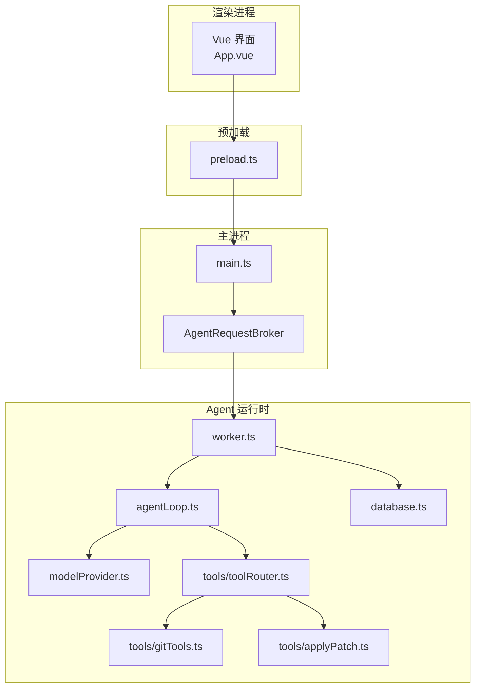
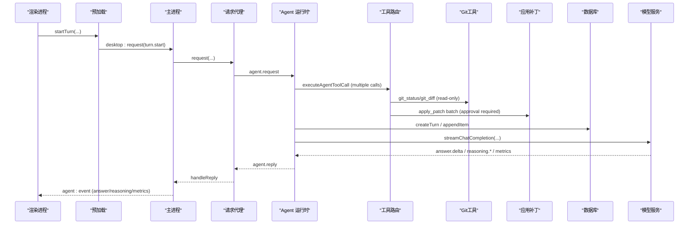
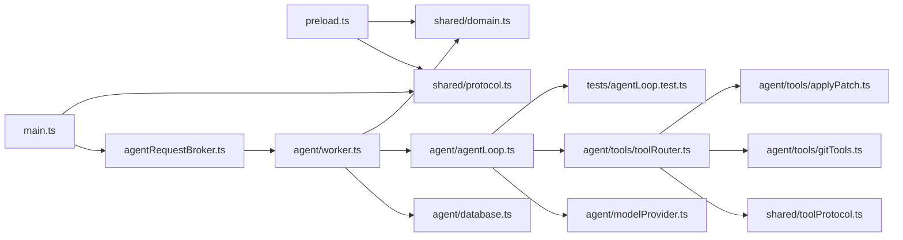

# AI代理系统

<cite>
**本文引用的文件**
- [README.md](file://README.md)
- [package.json](file://package.json)
- [src/main.ts](file://src/main.ts)
- [src/preload.ts](file://src/preload.ts)
- [src/main/agentRequestBroker.ts](file://src/main/agentRequestBroker.ts)
- [src/agent/worker.ts](file://src/agent/worker.ts)
- [src/agent/database.ts](file://src/agent/database.ts)
- [src/agent/agentLoop.ts](file://src/agent/agentLoop.ts)
- [src/agent/modelProvider.ts](file://src/agent/modelProvider.ts)
- [src/agent/tools/toolRouter.ts](file://src/agent/tools/toolRouter.ts)
- [src/agent/tools/gitTools.ts](file://src/agent/tools/gitTools.ts)
- [src/agent/tools/applyPatch.ts](file://src/agent/tools/applyPatch.ts)
- [src/shared/domain.ts](file://src/shared/domain.ts)
- [src/shared/protocol.ts](file://src/shared/protocol.ts)
- [src/shared/toolProtocol.ts](file://src/shared/toolProtocol.ts)
- [src/renderer/App.vue](file://src/renderer/App.vue)
- [tests/agentLoop.test.ts](file://tests/agentLoop.test.ts)
- [tests/worker.test.ts](file://tests/worker.test.ts)
</cite>

## 更新摘要
**所做更改**
- **核心增强**：Agent循环现在使用`parseToolCalls()`函数在一个助手响应中处理多个工具调用
- **预算耗尽处理**：新增迭代预算耗尽时的强制回答机制，防止无限循环
- **截断工具调用恢复**：支持检测并恢复因输出限制而截断的工具调用
- **增强的错误处理**：改进了资源受限场景下的错误处理和恢复机制
- **默认迭代次数提升**：将默认最大迭代次数从6次提升到8次，提供更好的任务完成能力

## 目录
1. [简介](#简介)
2. [项目结构](#项目结构)
3. [核心组件](#核心组件)
4. [架构总览](#架构总览)
5. [详细组件分析](#详细组件分析)
6. [依赖关系分析](#依赖关系分析)
7. [性能考量](#性能考量)
8. [故障排查指南](#故障排查指南)
9. [结论](#结论)
10. [附录](#附录)

## 简介
这是一个基于 Electron、Vue 3、TypeScript 的私有桌面端 AI 客户端原型。它通过主进程、预加载脚本、渲染进程与一个独立的 Utility Process（Agent 运行时）协作，使用 SQLite 进行本地持久化，并通过 OpenAI 兼容接口与模型服务通信。系统支持"思考→工具→观察→再思考"的多轮 Agent 循环、流式输出、工作区安全策略、并发调度、以及可撤销的文件变更等能力。

**最新更新**：系统现已支持在一个助手响应中处理多个工具调用，显著提升了执行效率。**最重要的是，Agent循环现在使用`parseToolCalls()`函数解析并执行多个工具调用，而不是逐个处理单个调用。** 同时，审批工作流已增强为支持跨多个文件的合并变更列表，用户只需进行一次审批即可完成多个文件的修改。

**重大增强**：系统新增了迭代预算耗尽处理和截断工具调用恢复机制，增强了在资源受限场景下的鲁棒性。默认最大迭代次数已从6次提升到8次，提供更好的复杂任务处理能力。

## 项目结构
- 渲染层：Vue 3 UI，仅负责展示与交互，不直接访问文件系统或数据库。
- 预加载层：通过 contextBridge 暴露最小化的 window.desktop API。
- 主进程：管理窗口生命周期、安全策略，转发 IPC 请求到 Agent 运行时。
- Agent 运行时（Utility Process）：负责调度、模型调用、演示模式、SQLite 持久化、事件分发。
- 数据层：app.sqlite（WAL、外键、忙等待），存储会话、回合、设置、模型配置与工作区信息。
- 共享协议：定义跨进程消息类型、校验器与领域模型。



图表来源
- [src/main.ts:1-170](file://src/main.ts#L1-L170)
- [src/preload.ts:1-38](file://src/preload.ts#L1-L38)
- [src/main/agentRequestBroker.ts:1-86](file://src/main/agentRequestBroker.ts#L1-L86)
- [src/agent/worker.ts:1-787](file://src/agent/worker.ts#L1-L787)
- [src/agent/agentLoop.ts:1-357](file://src/agent/agentLoop.ts#L1-L357)
- [src/agent/modelProvider.ts:1-1063](file://src/agent/modelProvider.ts#L1-L1063)
- [src/agent/database.ts:1-800](file://src/agent/database.ts#L1-L800)
- [src/agent/tools/toolRouter.ts:1-232](file://src/agent/tools/toolRouter.ts#L1-L232)
- [src/agent/tools/gitTools.ts:1-187](file://src/agent/tools/gitTools.ts#L1-L187)
- [src/agent/tools/applyPatch.ts:1-338](file://src/agent/tools/applyPatch.ts#L1-L338)

章节来源
- [README.md:1-121](file://README.md#L1-L121)
- [package.json:1-35](file://package.json#L1-L35)

## 核心组件
- 主进程与 IPC 路由：创建窗口、启动 Agent 运行时、处理健康检查与桌面请求转发。
- Agent 运行时：接收并执行桌面请求，编排回合调度、模型流式调用、工具执行、审批流程与事件回推。
- 模型提供者：封装 SSE 流解析、上下文压缩、重试与指标收集。
- Agent 循环：多轮"思考→工具→观察"，支持在单个响应中处理多个工具调用，最终答案才进入用户可见流。
- 工具路由：统一入口，按信任策略与安全白名单决定允许、拒绝或需审批。
- Git只读工具：提供仓库状态检查和差异查看功能，无需用户审批即可执行。
- 文件修改审批：增强的预览机制，显示详细的文件变更差异供用户审核，支持批量文件变更。
- 数据库：SQLite 持久化会话、回合、设置、模型配置、工作区与文件检查点。
- 前端：Vue 组件与状态管理，订阅事件、发起请求、展示对话与推理面板。

**重大更新**：Agent循环现在使用`parseToolCalls()`函数在一个助手响应中解析并执行多个工具调用，显著提升了执行效率。**批量化处理减少了模型调用的开销，提高了整体性能。** 同时，审批工作流已增强为支持跨多个文件的合并变更列表，用户只需进行一次审批即可完成多个文件的修改。

**新增功能**：系统现在具备迭代预算耗尽处理和截断工具调用恢复机制，能够在资源受限场景下自动恢复和继续执行任务。

章节来源
- [src/main.ts:1-170](file://src/main.ts#L1-L170)
- [src/agent/worker.ts:1-787](file://src/agent/worker.ts#L1-L787)
- [src/agent/modelProvider.ts:1-1063](file://src/agent/modelProvider.ts#L1-L1063)
- [src/agent/agentLoop.ts:1-357](file://src/agent/agentLoop.ts#L1-L357)
- [src/agent/tools/toolRouter.ts:1-232](file://src/agent/tools/toolRouter.ts#L1-L232)
- [src/agent/tools/gitTools.ts:1-187](file://src/agent/tools/gitTools.ts#L1-L187)
- [src/agent/tools/applyPatch.ts:1-338](file://src/agent/tools/applyPatch.ts#L1-L338)
- [src/agent/database.ts:1-800](file://src/agent/database.ts#L1-L800)
- [src/renderer/App.vue:1-228](file://src/renderer/App.vue#L1-L228)

## 架构总览
系统采用分层与职责分离设计：
- 渲染进程只持有视图与交互逻辑，通过预加载桥接调用主进程。
- 主进程作为安全边界，仅暴露必要能力，并将业务逻辑委托给 Agent 运行时。
- Agent 运行时集中实现调度、I/O、持久化与对外部模型的调用。
- 所有跨进程消息均经过严格类型校验，避免非法载荷进入后端。



图表来源
- [src/preload.ts:1-38](file://src/preload.ts#L1-L38)
- [src/main.ts:1-170](file://src/main.ts#L1-L170)
- [src/main/agentRequestBroker.ts:1-86](file://src/main/agentRequestBroker.ts#L1-L86)
- [src/agent/worker.ts:1-787](file://src/agent/worker.ts#L1-L787)
- [src/agent/tools/toolRouter.ts:1-232](file://src/agent/tools/toolRouter.ts#L1-L232)
- [src/agent/tools/gitTools.ts:1-187](file://src/agent/tools/gitTools.ts#L1-L187)
- [src/agent/tools/applyPatch.ts:1-338](file://src/agent/tools/applyPatch.ts#L1-L338)
- [src/agent/modelProvider.ts:1-1063](file://src/agent/modelProvider.ts#L1-L1063)
- [src/agent/database.ts:1-800](file://src/agent/database.ts#L1-L800)

## 详细组件分析

### 主进程与 IPC 路由
- 启动时创建 BrowserWindow，启用沙箱与隔离，注入 preload。
- 启动 Agent 运行时（Utility Process），建立 MessageChannelMain 双向通道。
- 提供 health 检查与统一的 desktop:request 处理，转发至 AgentRequestBroker。
- 将 Agent 运行时的 reply 与 event 分别回传给请求方与渲染进程。

章节来源
- [src/main.ts:1-170](file://src/main.ts#L1-L170)
- [src/main/agentRequestBroker.ts:1-86](file://src/main/agentRequestBroker.ts#L1-L86)

### 预加载桥接
- 暴露 window.desktop 方法：健康检查、快照获取、会话/群组操作、回合控制、设置更新、模型配置、工作区注册、事件订阅等。
- 所有方法通过 ipcRenderer.invoke 调用主进程，保证安全边界。

章节来源
- [src/preload.ts:1-38](file://src/preload.ts#L1-L38)

### Agent 运行时（Utility Process）
- 初始化数据库与端口，创建 WorkerTurnRuntime。
- 维护每个线程的活跃回合上下文，按模型配置的并发限制进行调度。
- 将模型流式事件与工具事件序列化为带序号的事件，持久化后推送给渲染进程。
- 支持演示模式与真实模型模式；当未选择模型且提示包含敏感词时触发审批流程。
- 对文件变更记录检查点，支持回合级撤销。

**新增功能**：增强了迭代预算耗尽处理，当达到最大迭代次数时会自动生成最终答案并标记任务状态。

章节来源
- [src/agent/worker.ts:1-787](file://src/agent/worker.ts#L1-L787)
- [src/agent/database.ts:1-800](file://src/agent/database.ts#L1-L800)

### 模型提供者（SSE 流与上下文压缩）
- 构建请求头与超时信号，发送 chat/completions 请求。
- 解析 SSE 流，区分答案、原始推理、推理摘要与阶段变化。
- 遇到长度限制或上下文过大时自动压缩历史并继续生成。
- 合并多次尝试的指标，计算首 token 时间、吞吐与用量来源。
- 连接测试用于验证可达性与槽位情况。
- **新增**：通过 `CONTINUE_AFTER_LENGTH_PROMPT` 指令确保模型在达到输出限制时能够继续生成，防止响应截断。

**增强功能**：改进了输出限制处理，当检测到响应被截断时会自动引导模型继续生成完整答案。

章节来源
- [src/agent/modelProvider.ts:1-1063](file://src/agent/modelProvider.ts#L1-L1063)

### Agent 循环（多轮思考与工具调用）
- **重要更新**：默认最大迭代次数已从6次提升到8次（`AGENT_LOOP_MAX_ITERATIONS = 8`），提供更好的复杂任务处理能力。
- **重大更新**：从助手回复中解析多个工具调用，使用`parseToolCalls()`函数一次性处理所有工具调用。
- **新增功能**：迭代预算耗尽处理机制，当达到最大迭代次数时强制生成最终答案。
- **新增功能**：截断工具调用恢复机制，检测并恢复因输出限制而中断的工具调用。
- 支持多种工具调用格式：
  - 围栏 JSON：` ```tool { "tool": "read_file", "input": {...} } ``` `
  - Provider-native XML：`<invoke name="tool_name"><parameter name="param">value</parameter></invoke>`
- 中间过程不会泄露到用户可见答案流，仅最终答案以 delta 形式发出。
- 支持读取/搜索/补丁/命令/Git等工具，受工作区信任级别与安全策略约束。
- **新增**：智能代码转储检测系统，自动识别并阻止AI代理将大段代码直接粘贴到响应中。
- **新增**：自动引导机制，检测到代码转储时自动提示模型使用apply_patch工具。
- **新增**：安全限制机制，最多允许2次引导尝试，防止无限循环。

**核心改进**：系统现在使用`parseToolCalls()`函数在一个助手响应中解析并执行多个工具调用，而不是逐个处理单个调用。这显著提升了执行效率，减少了模型调用的开销。**批量化处理使得系统能够更高效地处理复杂的任务，特别是在需要多个工具协同工作的场景中。**

**新增预算管理**：系统现在具备完整的迭代预算管理机制，包括：
- 默认8次迭代的最大限制
- 预算耗尽时的强制回答机制
- 预算耗尽状态标记（`budgetExhausted: true`）
- 防止无限循环的安全保障

**新增截断恢复**：系统现在能够检测和恢复因输出限制而截断的工具调用：
- 自动检测不完整工具调用（`looksLikeTruncatedToolCall`）
- 最多2次恢复尝试（`MAX_TRUNCATED_TOOL_STEERS = 2`）
- 智能引导模型重新发送完整的工具调用
- 防止重复截断的保护机制

章节来源
- [src/agent/agentLoop.ts:1-357](file://src/agent/agentLoop.ts#L1-L357)
- [src/agent/tools/toolRouter.ts:1-232](file://src/agent/tools/toolRouter.ts#L1-L232)

### 工具路由与安全策略
- 读工具（workspace_tree、read_file、search_code、git_status、git_diff）可直接执行。
- 写工具（apply_patch、run_command）需要 read-write 信任；命令执行需白名单或用户审批。
- 所有失败归一化为结构化 AgentToolResult，便于上层统一处理。

**更新**：新增Git只读工具支持，提供仓库状态检查和差异查看功能。**系统提示明确禁止将完整文件内容粘贴到答案中，要求通过apply_patch工具进行修改。**

章节来源
- [src/agent/tools/toolRouter.ts:1-232](file://src/agent/tools/toolRouter.ts#L1-L232)
- [src/shared/toolProtocol.ts:1-77](file://src/shared/toolProtocol.ts#L1-L77)

### Git只读工具
- **git_status**：提供工作区状态概览，包括分支信息、提交状态、未跟踪文件等。
- **git_diff**：显示文件或整个仓库的差异，支持暂存区和非暂存区查看。
- 两个工具都通过 `runWorkspaceProcess` 执行，具有相同的超时、输出限制和取消行为。
- 在只读工作区中也可执行，无需额外审批。

**新增功能**：完整的Git仓库状态检查和差异查看能力。

章节来源
- [src/agent/tools/gitTools.ts:1-187](file://src/agent/tools/gitTools.ts#L1-L187)
- [tests/gitTools.test.ts:1-219](file://tests/gitTools.test.ts#L1-L219)

### 文件修改审批工作流
- **增强的预览机制**：在用户批准前生成详细的文件变更差异预览。
- **差异显示**：支持添加、删除和上下文行的可视化展示。
- **安全检查**：防止路径逃逸和工作区外的文件写入。
- **内容哈希验证**：确保文件内容未被意外修改。
- **可撤销操作**：记录变更前状态，支持回合级撤销。
- **重大更新**：支持跨多个文件的合并变更列表，用户只需进行一次审批即可完成多个文件的修改。

**核心改进**：审批工作流现在支持批量化处理，当多个文件需要修改时，系统会生成一个统一的变更预览，用户只需审批一次即可完成所有文件的修改。**这种设计大大简化了用户的操作流程，特别是在涉及多个相关文件修改的场景中。**

章节来源
- [src/agent/tools/applyPatch.ts:1-338](file://src/agent/tools/applyPatch.ts#L1-L338)
- [src/shared/domain.ts:83-103](file://src/shared/domain.ts#L83-L103)

### 数据库与持久化
- 使用 SQLite 存储群组、会话、回合、设置、模型配置、工作区与文件检查点。
- 事务性写入，确保一致性；完成回合时标记相关项为完整。
- 支持中断未完成回合、撤销文件变更、查询最近消息等。

**新增功能**：支持记录迭代预算耗尽状态，当任务因预算耗尽而终止时，会在数据库中正确标记状态。

章节来源
- [src/agent/database.ts:1-800](file://src/agent/database.ts#L1-L800)

### 前端渲染与应用状态
- App.vue 组织侧边栏、对话、检查器与设置视图。
- 通过 useApp 组合件管理状态，响应事件流，发起回合、取消、撤销等操作。
- 支持主题切换、语言切换、模型配置与连接测试。
- **新增**：审批面板支持文件变更差异的可视化展示。

章节来源
- [src/renderer/App.vue:1-228](file://src/renderer/App.vue#L1-L228)

### 智能代码转储检测系统
- **自动检测**：使用`looksLikeManualCodeDump`函数检测AI代理是否试图将大段代码直接粘贴到响应中。
- **阈值判断**：当代码块包含至少12行非空代码时，被视为手动代码转储。
- **智能引导**：检测到代码转储后，自动向模型发送引导消息，要求其使用apply_patch工具。
- **安全限制**：最多允许2次引导尝试，防止无限循环。
- **工作区感知**：仅在读写工作区中启用此机制，只读工作区允许代码转储。

**新增功能**：先进的代码转储检测系统，能够有效防止AI代理绕过工具调用机制直接将代码粘贴到响应中。**该机制通过分析代码块的行数和内容，智能识别潜在的代码转储行为，并通过引导消息促使模型遵循正确的文件修改流程。**

章节来源
- [src/agent/agentLoop.ts:138-145](file://src/agent/agentLoop.ts#L138-L145)
- [tests/agentLoop.test.ts:174-179](file://tests/agentLoop.test.ts#L174-L179)

### 增强的系统提示与防粘贴机制
- **防粘贴规则**：明确禁止将完整文件内容或完整替换代码粘贴到答案中，要求使用apply_patch工具进行修改。
- **重试指令**：当工具调用失败时，指导模型读取错误、修复输入并重试，而不是让用户手动粘贴代码。
- **上下文压缩**：通过`CONTINUE_AFTER_LENGTH_PROMPT`指令确保模型在达到输出限制时能够继续生成，防止响应截断。
- **智能重试**：当检测到stale-content错误时，指导模型重新读取文件并使用新的contentHash重试。
- **明确指导**：系统提示中包含具体的apply_patch使用示例和最佳实践。

**新增功能**：增强的系统提示包含明确的防粘贴规则和重试指令，显著提升用户体验和响应质量。**这些指令确保模型始终通过工具调用来修改文件，而不是将代码直接粘贴到答案中，从而提供更流畅、更可靠的用户体验。**

章节来源
- [src/agent/agentLoop.ts:182-229](file://src/agent/agentLoop.ts#L182-L229)
- [src/agent/modelProvider.ts:46-58](file://src/agent/modelProvider.ts#L46-L58)
- [tests/agentLoop.test.ts:154-172](file://tests/agentLoop.test.ts#L154-L172)

### 增强的工具调用解析系统
- **多调用支持**：使用`parseToolCalls()`函数在一个响应中解析并处理多个工具调用。
- **双格式支持**：同时支持围栏JSON和provider-native XML两种工具调用格式。
- **优先级处理**：首先尝试解析围栏JSON，失败后回退到XML解析。
- **XML结构解析**：使用正则表达式匹配`<invoke name="tool_name">...</invoke>`块。
- **参数提取**：从`<parameter name="param">value</parameter>`标签中提取参数。
- **自动JSON解码**：参数值可以是纯文本或嵌入的JSON（数字、数组、对象）。
- **容错处理**：支持不匹配的闭合标签和嵌套结构。

**核心改进**：系统现在能够在一个助手响应中处理多个工具调用，显著提升了执行效率。**批量化处理减少了模型调用的开销，特别是在需要多个工具协同工作的复杂任务中，这种改进尤为明显。**

章节来源
- [src/agent/agentLoop.ts:82-98](file://src/agent/agentLoop.ts#L82-L98)
- [tests/agentLoop.test.ts:132-152](file://tests/agentLoop.test.ts#L132-L152)

### 新增：迭代预算耗尽处理机制
- **预算监控**：跟踪每次迭代的执行情况，确保不超过最大迭代次数限制。
- **强制回答**：当预算耗尽时，向模型发送特殊提示，要求生成最终答案。
- **状态标记**：返回结果中标记`budgetExhausted: true`，表示任务因预算耗尽而终止。
- **安全保护**：防止无限循环和资源耗尽，确保系统稳定性。
- **用户反馈**：在预算耗尽时提供清晰的错误信息和状态报告。

**新增功能**：完整的迭代预算管理机制，有效防止Agent循环陷入无限执行状态。**该机制在资源受限环境下尤为重要，确保系统能够在合理时间内完成任务或优雅地终止。**

章节来源
- [src/agent/agentLoop.ts:24-24](file://src/agent/agentLoop.ts#L24-L24)
- [src/agent/agentLoop.ts:313-323](file://src/agent/agentLoop.ts#L313-L323)
- [tests/worker.test.ts:611-637](file://tests/worker.test.ts#L611-L637)

### 新增：截断工具调用恢复机制
- **截断检测**：使用`looksLikeTruncatedToolCall`函数检测不完整的工具调用。
- **智能恢复**：检测到截断后，向模型发送专门的恢复提示，要求重新发送完整调用。
- **恢复限制**：最多允许2次恢复尝试，防止无限重试循环。
- **错误处理**：在恢复失败时提供清晰的错误信息和降级处理。
- **用户体验**：自动处理常见的输出限制问题，减少用户干预需求。

**新增功能**：智能的工具调用恢复机制，能够自动处理因输出限制导致的工具调用截断问题。**该机制显著提升了系统在资源受限环境下的鲁棒性和可靠性。**

章节来源
- [src/agent/agentLoop.ts:151-156](file://src/agent/agentLoop.ts#L151-L156)
- [src/agent/agentLoop.ts:165-169](file://src/agent/agentLoop.ts#L165-L169)
- [src/agent/agentLoop.ts:270-276](file://src/agent/agentLoop.ts#L270-L276)
- [tests/agentLoop.test.ts:181-186](file://tests/agentLoop.test.ts#L181-L186)
- [tests/agentLoop.test.ts:264-277](file://tests/agentLoop.test.ts#L264-L277)

## 依赖关系分析
- 主进程依赖 AgentRequestBroker 管理请求与超时。
- Agent 运行时依赖 database、modelProvider、agentLoop、toolRouter 与 turnScheduler。
- 共享协议 domain.ts、protocol.ts、toolProtocol.ts 被多处引用，保证类型一致。
- 前端依赖预加载暴露的 window.desktop 与事件订阅。

**更新**：新增Git工具和文件修改审批的相关依赖关系，以及增强的工具调用解析依赖。**系统提示的增强依赖于agentLoop.ts中的buildAgentSystemPrompt函数。**



图表来源
- [src/main.ts:1-170](file://src/main.ts#L1-L170)
- [src/main/agentRequestBroker.ts:1-86](file://src/main/agentRequestBroker.ts#L1-L86)
- [src/preload.ts:1-38](file://src/preload.ts#L1-L38)
- [src/agent/worker.ts:1-787](file://src/agent/worker.ts#L1-L787)
- [src/agent/database.ts:1-800](file://src/agent/database.ts#L1-L800)
- [src/agent/agentLoop.ts:1-357](file://src/agent/agentLoop.ts#L1-L357)
- [src/agent/modelProvider.ts:1-1063](file://src/agent/modelProvider.ts#L1-L1063)
- [src/agent/tools/toolRouter.ts:1-232](file://src/agent/tools/toolRouter.ts#L1-L232)
- [src/agent/tools/gitTools.ts:1-187](file://src/agent/tools/gitTools.ts#L1-L187)
- [src/agent/tools/applyPatch.ts:1-338](file://src/agent/tools/applyPatch.ts#L1-L338)
- [src/shared/domain.ts:1-349](file://src/shared/domain.ts#L1-L349)
- [src/shared/protocol.ts:1-374](file://src/shared/protocol.ts#L1-L374)
- [src/shared/toolProtocol.ts:1-77](file://src/shared/toolProtocol.ts#L1-L77)
- [tests/agentLoop.test.ts:1-461](file://tests/agentLoop.test.ts#L1-L461)

## 性能考量
- 流式传输：答案、推理与摘要独立流，减少阻塞，提升交互体验。
- 上下文压缩：接近上下文上限时自动压缩历史，避免失败并维持连续性。
- 并发控制：按模型配置限制每 profile 的最大并发，队列 FIFO 顺序。
- 超时与取消：请求与读取均有超时保护，支持中止信号快速释放资源。
- 指标采集：首 token 时间、吞吐与用量来源可观测，便于调优。
- **新增**：Git工具使用专用超时设置（15秒），避免长时间阻塞。
- **新增**：XML解析使用高效的正则表达式匹配，减少解析开销。
- **新增**：通过上下文压缩和重试机制防止响应截断，提升长响应的完整性。
- **新增**：代码转储检测使用轻量级的正则表达式匹配，性能开销极小。
- **核心优化**：批量化工具调用处理显著减少了模型调用的开销，提升了整体执行效率。
- **新增优化**：迭代预算耗尽处理避免了无限循环的资源消耗，提升了系统稳定性。
- **新增优化**：截断工具调用恢复机制减少了用户干预需求，提升了自动化程度。

[本节为通用指导，不直接分析具体文件]

## 故障排查指南
- 模型不可达或超时：检查 baseUrl、API Key、网络连通性与超时配置；连接测试会返回离线或槽位未验证等状态。
- 上下文超限：关注压缩日志与继续生成行为；必要时降低上下文消息限制或调整模型窗口。
- 工具被拒绝：确认工作区信任级别与命令白名单；非白名单命令需用户审批。
- **新增**：XML工具调用解析失败：检查XML格式是否正确，确保`<invoke>`和`<parameter>`标签正确闭合。
- **新增**：参数解码错误：验证XML参数值是否为有效的JSON格式；对于复杂参数，确保正确转义特殊字符。
- **新增**：Git工具错误：检查Git安装和仓库状态；git_diff在非Git仓库中会返回特定错误。
- **新增**：文件修改审批失败：检查baseContentHash是否匹配；确认文件路径在工作区内。
- **新增**：响应截断问题：检查上下文压缩是否正常工作；确认`CONTINUE_AFTER_LENGTH_PROMPT`指令是否生效。
- **新增**：系统提示相关问题：验证防粘贴规则是否生效；确认模型遵循重试指令而非要求用户手动操作。
- **新增**：代码转储检测误判：检查代码块是否确实超过12行；确认工作区信任级别是否为读写模式。
- **新增**：引导机制失效：确认MAX_CODE_DUMP_STEERS限制是否合理；检查引导消息是否正确发送到模型。
- **新增**：批量化工具调用问题：检查parseToolCalls函数是否正确解析多个工具调用；确认工具调用之间的依赖关系。
- **新增**：批量审批失败：检查files数组格式是否正确；确认所有文件的baseContentHash都是最新的。
- **新增**：迭代预算耗尽：检查AGENT_LOOP_MAX_ITERATIONS设置是否合理；确认任务复杂度是否需要更多迭代次数。
- **新增**：截断工具调用恢复失败：检查输出限制设置；确认模型是否能够生成完整的工具调用。
- **新增**：预算耗尽状态：检查返回结果中的`budgetExhausted`字段；确认任务是否因预算耗尽而终止。
- 回合中断：应用重启后未完成回合会被标记为中断，需重新提交。
- 事件丢失：检查事件序列号与终端事件是否到达；渲染进程应正确订阅 agent:event。

章节来源
- [src/agent/modelProvider.ts:1-1063](file://src/agent/modelProvider.ts#L1-L1063)
- [src/agent/tools/toolRouter.ts:1-232](file://src/agent/tools/toolRouter.ts#L1-L232)
- [src/agent/tools/gitTools.ts:1-187](file://src/agent/tools/gitTools.ts#L1-L187)
- [src/agent/tools/applyPatch.ts:1-338](file://src/agent/tools/applyPatch.ts#L1-L338)
- [src/agent/agentLoop.ts:138-323](file://src/agent/agentLoop.ts#L138-L323)
- [src/agent/worker.ts:1-787](file://src/agent/worker.ts#L1-L787)
- [src/agent/database.ts:1-800](file://src/agent/database.ts#L1-L800)

## 结论
该 AI 代理系统通过清晰的进程划分、严格的协议校验与安全的工具执行策略，实现了可靠的本地桌面端 AI 交互。其多轮 Agent 循环、流式输出、上下文压缩与并发调度共同保证了良好的用户体验与稳定性。配合 SQLite 持久化与可撤销的工作区变更，系统在安全性与可用性之间取得了平衡。

**重大更新**：系统现在支持在一个助手响应中处理多个工具调用，显著提升了执行效率和用户体验。**通过`parseToolCalls()`函数的批量化处理，系统能够更高效地处理复杂的任务场景，减少了不必要的模型调用开销。** 同时，增强的审批工作流支持跨多个文件的合并变更列表，用户只需进行一次审批即可完成多个文件的修改，大大简化了操作流程。

**新增增强功能**：系统现在具备完整的迭代预算耗尽处理和截断工具调用恢复机制，显著提升了在资源受限场景下的鲁棒性。**默认最大迭代次数已从6次提升到8次，提供更好的复杂任务处理能力。** 智能代码转储检测系统和增强的系统提示进一步确保了系统的稳定性和安全性，防止AI代理绕过工具调用机制直接修改文件。

**核心改进总结**：
- **预算管理**：新增迭代预算耗尽处理，防止无限循环和资源耗尽
- **恢复机制**：智能检测和恢复因输出限制而截断的工具调用
- **性能优化**：批量化工具调用处理显著提升执行效率
- **用户体验**：增强的错误处理和恢复机制减少用户干预需求
- **稳定性**：多重安全保障确保系统在资源受限环境下稳定运行

这些改进共同构成了一个更加高效、安全和用户友好的AI代理系统，能够更好地应对各种复杂的使用场景和资源限制条件。

[本节为总结，不直接分析具体文件]

## 附录
- 安装与运行：参考 README 中的命令与模型配置说明。
- 本地 Qwen 运行时：独立 Docker Compose 服务，通过 HTTP 暴露 OpenAI 兼容接口。
- E2E 测试：包含确定性用例与可选的真实模型测试套件。
- **新增**：XML工具调用测试：完整的单元测试覆盖XML解析、参数解码和工具执行功能。
- **新增**：Git工具测试：完整的单元测试覆盖git_status和git_diff功能。
- **新增**：系统提示测试：验证防粘贴规则和重试指令的正确性。
- **新增**：代码转储检测测试：完整的单元测试覆盖智能检测、引导机制和安全限制功能。
- **新增**：批量化工具调用测试：验证parseToolCalls函数正确处理多个工具调用的场景。
- **新增**：批量审批测试：验证跨多个文件的合并变更列表审批流程。
- **新增**：迭代预算耗尽测试：验证预算耗尽处理机制和状态标记功能。
- **新增**：截断工具调用恢复测试：验证截断检测和恢复机制的有效性。

章节来源
- [README.md:1-121](file://README.md#L1-L121)
- [package.json:1-35](file://package.json#L1-L35)
- [tests/agentLoop.test.ts:174-461](file://tests/agentLoop.test.ts#L174-L461)
- [tests/worker.test.ts:611-637](file://tests/worker.test.ts#L611-L637)
- [tests/gitTools.test.ts:1-219](file://tests/gitTools.test.ts#L1-L219)