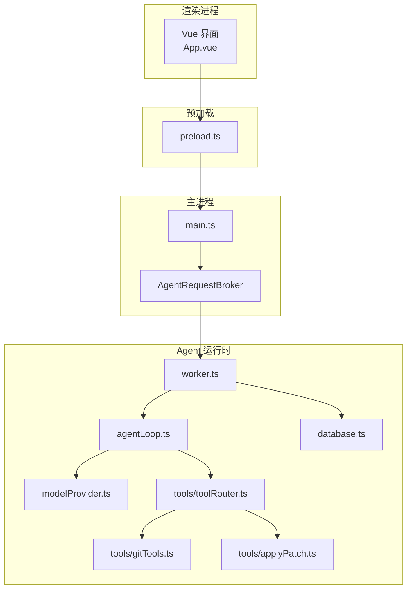
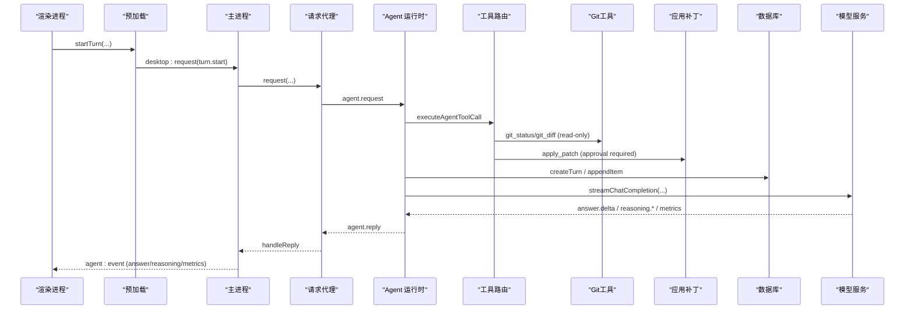
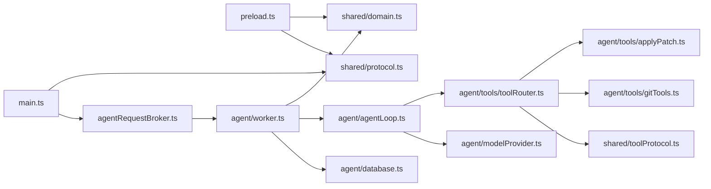

# AI代理系统

<cite>
**本文引用的文件**
- [README.md](file://README.md)
- [package.json](file://package.json)
- [src/main.ts](file://src/main.ts)
- [src/preload.ts](file://src/preload.ts)
- [src/main/agentRequestBroker.ts](file://src/main/agentRequestBroker.ts)
- [src/agent/worker.ts](file://src/agent/worker.ts)
- [src/agent/database.ts](file://src/agent/database.ts)
- [src/agent/agentLoop.ts](file://src/agent/agentLoop.ts)
- [src/agent/modelProvider.ts](file://src/agent/modelProvider.ts)
- [src/agent/tools/toolRouter.ts](file://src/agent/tools/toolRouter.ts)
- [src/agent/tools/gitTools.ts](file://src/agent/tools/gitTools.ts)
- [src/agent/tools/applyPatch.ts](file://src/agent/tools/applyPatch.ts)
- [src/shared/domain.ts](file://src/shared/domain.ts)
- [src/shared/protocol.ts](file://src/shared/protocol.ts)
- [src/shared/toolProtocol.ts](file://src/shared/toolProtocol.ts)
- [src/renderer/App.vue](file://src/renderer/App.vue)
</cite>

## 更新摘要
**所做更改**
- 新增了Git只读工具（git_status、git_diff）的完整支持
- 增强了文件修改审批工作流，提供详细的差异预览
- 改进了工具路由的安全策略和执行流程
- 更新了工具协议以支持新的Git工具类型

## 目录
1. [简介](#简介)
2. [项目结构](#项目结构)
3. [核心组件](#核心组件)
4. [架构总览](#架构总览)
5. [详细组件分析](#详细组件分析)
6. [依赖关系分析](#依赖关系分析)
7. [性能考量](#性能考量)
8. [故障排查指南](#故障排查指南)
9. [结论](#结论)
10. [附录](#附录)

## 简介
这是一个基于 Electron、Vue 3、TypeScript 的私有桌面端 AI 客户端原型。它通过主进程、预加载脚本、渲染进程与一个独立的 Utility Process（Agent 运行时）协作，使用 SQLite 进行本地持久化，并通过 OpenAI 兼容接口与模型服务通信。系统支持"思考→工具→观察→再思考"的多轮 Agent 循环、流式输出、工作区安全策略、并发调度、以及可撤销的文件变更等能力。

**最新更新**：系统现已增强工具能力，新增了Git只读工具和改进的文件修改审批工作流，提供更安全的代码操作体验。

## 项目结构
- 渲染层：Vue 3 UI，仅负责展示与交互，不直接访问文件系统或数据库。
- 预加载层：通过 contextBridge 暴露最小化的 window.desktop API。
- 主进程：管理窗口生命周期、安全策略，转发 IPC 请求到 Agent 运行时。
- Agent 运行时（Utility Process）：负责调度、模型调用、演示模式、SQLite 持久化、事件分发。
- 数据层：app.sqlite（WAL、外键、忙等待），存储会话、回合、设置、模型配置与工作区信息。
- 共享协议：定义跨进程消息类型、校验器与领域模型。

图表来源
- [src/main.ts:1-170](file://src/main.ts#L1-L170)
- [src/preload.ts:1-38](file://src/preload.ts#L1-L38)
- [src/main/agentRequestBroker.ts:1-86](file://src/main/agentRequestBroker.ts#L1-L86)
- [src/agent/worker.ts:1-787](file://src/agent/worker.ts#L1-L787)
- [src/agent/agentLoop.ts:1-241](file://src/agent/agentLoop.ts#L1-L241)
- [src/agent/modelProvider.ts:1-800](file://src/agent/modelProvider.ts#L1-L800)
- [src/agent/database.ts:1-800](file://src/agent/database.ts#L1-L800)
- [src/agent/tools/toolRouter.ts:1-229](file://src/agent/tools/toolRouter.ts#L1-L229)
- [src/agent/tools/gitTools.ts:1-187](file://src/agent/tools/gitTools.ts#L1-L187)
- [src/agent/tools/applyPatch.ts:1-277](file://src/agent/tools/applyPatch.ts#L1-L277)

章节来源
- [README.md:1-121](file://README.md#L1-L121)
- [package.json:1-35](file://package.json#L1-L35)

## 核心组件
- 主进程与 IPC 路由：创建窗口、启动 Agent 运行时、处理健康检查与桌面请求转发。
- Agent 运行时：接收并执行桌面请求，编排回合调度、模型流式调用、工具执行、审批流程与事件回推。
- 模型提供者：封装 SSE 流解析、上下文压缩、重试与指标收集。
- Agent 循环：多轮"思考→工具→观察"，将工具调用以围栏 JSON 嵌入文本，最终答案才进入用户可见流。
- 工具路由：统一入口，按信任策略与安全白名单决定允许、拒绝或需审批。
- Git只读工具：提供仓库状态检查和差异查看功能，无需用户审批即可执行。
- 文件修改审批：增强的预览机制，显示详细的文件变更差异供用户审核。
- 数据库：SQLite 持久化会话、回合、设置、模型配置、工作区与文件检查点。
- 前端：Vue 组件与状态管理，订阅事件、发起请求、展示对话与推理面板。

章节来源
- [src/main.ts:1-170](file://src/main.ts#L1-L170)
- [src/agent/worker.ts:1-787](file://src/agent/worker.ts#L1-L787)
- [src/agent/modelProvider.ts:1-800](file://src/agent/modelProvider.ts#L1-L800)
- [src/agent/agentLoop.ts:1-241](file://src/agent/agentLoop.ts#L1-L241)
- [src/agent/tools/toolRouter.ts:1-229](file://src/agent/tools/toolRouter.ts#L1-L229)
- [src/agent/tools/gitTools.ts:1-187](file://src/agent/tools/gitTools.ts#L1-L187)
- [src/agent/tools/applyPatch.ts:1-277](file://src/agent/tools/applyPatch.ts#L1-L277)
- [src/agent/database.ts:1-800](file://src/agent/database.ts#L1-L800)
- [src/renderer/App.vue:1-228](file://src/renderer/App.vue#L1-L228)

## 架构总览
系统采用分层与职责分离设计：
- 渲染进程只持有视图与交互逻辑，通过预加载桥接调用主进程。
- 主进程作为安全边界，仅暴露必要能力，并将业务逻辑委托给 Agent 运行时。
- Agent 运行时集中实现调度、I/O、持久化与对外部模型的调用。
- 所有跨进程消息均经过严格类型校验，避免非法载荷进入后端。

图表来源
- [src/preload.ts:1-38](file://src/preload.ts#L1-L38)
- [src/main.ts:1-170](file://src/main.ts#L1-L170)
- [src/main/agentRequestBroker.ts:1-86](file://src/main/agentRequestBroker.ts#L1-L86)
- [src/agent/worker.ts:1-787](file://src/agent/worker.ts#L1-L787)
- [src/agent/tools/toolRouter.ts:1-229](file://src/agent/tools/toolRouter.ts#L1-L229)
- [src/agent/tools/gitTools.ts:1-187](file://src/agent/tools/gitTools.ts#L1-L187)
- [src/agent/tools/applyPatch.ts:1-277](file://src/agent/tools/applyPatch.ts#L1-L277)
- [src/agent/modelProvider.ts:1-800](file://src/agent/modelProvider.ts#L1-L800)
- [src/agent/database.ts:1-800](file://src/agent/database.ts#L1-L800)

## 详细组件分析

### 主进程与 IPC 路由
- 启动时创建 BrowserWindow，启用沙箱与隔离，注入 preload。
- 启动 Agent 运行时（Utility Process），建立 MessageChannelMain 双向通道。
- 提供 health 检查与统一的 desktop:request 处理，转发至 AgentRequestBroker。
- 将 Agent 运行时的 reply 与 event 分别回传给请求方与渲染进程。

章节来源
- [src/main.ts:1-170](file://src/main.ts#L1-L170)
- [src/main/agentRequestBroker.ts:1-86](file://src/main/agentRequestBroker.ts#L1-L86)

### 预加载桥接
- 暴露 window.desktop 方法：健康检查、快照获取、会话/群组操作、回合控制、设置更新、模型配置、工作区注册、事件订阅等。
- 所有方法通过 ipcRenderer.invoke 调用主进程，保证安全边界。

章节来源
- [src/preload.ts:1-38](file://src/preload.ts#L1-L38)

### Agent 运行时（Utility Process）
- 初始化数据库与端口，创建 WorkerTurnRuntime。
- 维护每个线程的活跃回合上下文，按模型配置的并发限制进行调度。
- 将模型流式事件与工具事件序列化为带序号的事件，持久化后推送给渲染进程。
- 支持演示模式与真实模型模式；当未选择模型且提示包含敏感词时触发审批流程。
- 对文件变更记录检查点，支持回合级撤销。

章节来源
- [src/agent/worker.ts:1-787](file://src/agent/worker.ts#L1-L787)
- [src/agent/database.ts:1-800](file://src/agent/database.ts#L1-L800)

### 模型提供者（SSE 流与上下文压缩）
- 构建请求头与超时信号，发送 chat/completions 请求。
- 解析 SSE 流，区分答案、原始推理、推理摘要与阶段变化。
- 遇到长度限制或上下文过大时自动压缩历史并继续生成。
- 合并多次尝试的指标，计算首 token 时间、吞吐与用量来源。
- 连接测试用于验证可达性与槽位情况。

章节来源
- [src/agent/modelProvider.ts:1-800](file://src/agent/modelProvider.ts#L1-L800)

### Agent 循环（多轮思考与工具调用）
- 默认最大迭代次数为 4，超出预算强制回答。
- 从助手回复中解析围栏 JSON 的工具调用，执行后以结构化结果追加到上下文。
- 中间过程不会泄露到用户可见答案流，仅最终答案以 delta 形式发出。
- 支持读取/搜索/补丁/命令/Git等工具，受工作区信任级别与安全策略约束。

章节来源
- [src/agent/agentLoop.ts:1-241](file://src/agent/agentLoop.ts#L1-L241)
- [src/agent/tools/toolRouter.ts:1-229](file://src/agent/tools/toolRouter.ts#L1-L229)

### 工具路由与安全策略
- 读工具（workspace_tree、read_file、search_code、git_status、git_diff）可直接执行。
- 写工具（apply_patch、run_command）需要 read-write 信任；命令执行需白名单或用户审批。
- 所有失败归一化为结构化 AgentToolResult，便于上层统一处理。

**更新**：新增Git只读工具支持，提供仓库状态检查和差异查看功能。

章节来源
- [src/agent/tools/toolRouter.ts:1-229](file://src/agent/tools/toolRouter.ts#L1-L229)
- [src/shared/toolProtocol.ts:1-77](file://src/shared/toolProtocol.ts#L1-L77)

### Git只读工具
- **git_status**：提供工作区状态概览，包括分支信息、提交状态、未跟踪文件等。
- **git_diff**：显示文件或整个仓库的差异，支持暂存区和非暂存区查看。
- 两个工具都通过 `runWorkspaceProcess` 执行，具有相同的超时、输出限制和取消行为。
- 在只读工作区中也可执行，无需额外审批。

**新增功能**：完整的Git仓库状态检查和差异查看能力。

章节来源
- [src/agent/tools/gitTools.ts:1-187](file://src/agent/tools/gitTools.ts#L1-L187)
- [tests/gitTools.test.ts:1-219](file://tests/gitTools.test.ts#L1-L219)

### 文件修改审批工作流
- **增强的预览机制**：在用户批准前生成详细的文件变更差异预览。
- **差异显示**：支持添加、删除和上下文行的可视化展示。
- **安全检查**：防止路径逃逸和工作区外的文件写入。
- **内容哈希验证**：确保文件内容未被意外修改。
- **可撤销操作**：记录变更前状态，支持回合级撤销。

**改进**：更直观的文件变更预览和更严格的审批流程。

章节来源
- [src/agent/tools/applyPatch.ts:1-277](file://src/agent/tools/applyPatch.ts#L1-L277)
- [src/shared/domain.ts:83-103](file://src/shared/domain.ts#L83-L103)

### 数据库与持久化
- 使用 SQLite 存储群组、会话、回合、设置、模型配置、工作区与文件检查点。
- 事务性写入，确保一致性；完成回合时标记相关项为完整。
- 支持中断未完成回合、撤销文件变更、查询最近消息等。

章节来源
- [src/agent/database.ts:1-800](file://src/agent/database.ts#L1-L800)

### 前端渲染与应用状态
- App.vue 组织侧边栏、对话、检查器与设置视图。
- 通过 useApp 组合件管理状态，响应事件流，发起回合、取消、撤销等操作。
- 支持主题切换、语言切换、模型配置与连接测试。
- **新增**：审批面板支持文件变更差异的可视化展示。

章节来源
- [src/renderer/App.vue:1-228](file://src/renderer/App.vue#L1-L228)

## 依赖关系分析
- 主进程依赖 AgentRequestBroker 管理请求与超时。
- Agent 运行时依赖 database、modelProvider、agentLoop、toolRouter 与 turnScheduler。
- 共享协议 domain.ts、protocol.ts、toolProtocol.ts 被多处引用，保证类型一致。
- 前端依赖预加载暴露的 window.desktop 与事件订阅。

**更新**：新增Git工具和文件修改审批的相关依赖关系。

图表来源
- [src/main.ts:1-170](file://src/main.ts#L1-L170)
- [src/main/agentRequestBroker.ts:1-86](file://src/main/agentRequestBroker.ts#L1-L86)
- [src/preload.ts:1-38](file://src/preload.ts#L1-L38)
- [src/agent/worker.ts:1-787](file://src/agent/worker.ts#L1-L787)
- [src/agent/database.ts:1-800](file://src/agent/database.ts#L1-L800)
- [src/agent/agentLoop.ts:1-241](file://src/agent/agentLoop.ts#L1-L241)
- [src/agent/modelProvider.ts:1-800](file://src/agent/modelProvider.ts#L1-L800)
- [src/agent/tools/toolRouter.ts:1-229](file://src/agent/tools/toolRouter.ts#L1-L229)
- [src/agent/tools/gitTools.ts:1-187](file://src/agent/tools/gitTools.ts#L1-L187)
- [src/agent/tools/applyPatch.ts:1-277](file://src/agent/tools/applyPatch.ts#L1-L277)
- [src/shared/domain.ts:1-349](file://src/shared/domain.ts#L1-L349)
- [src/shared/protocol.ts:1-374](file://src/shared/protocol.ts#L1-L374)
- [src/shared/toolProtocol.ts:1-77](file://src/shared/toolProtocol.ts#L1-L77)

## 性能考量
- 流式传输：答案、推理与摘要独立流，减少阻塞，提升交互体验。
- 上下文压缩：接近上下文上限时自动压缩历史，避免失败并维持连续性。
- 并发控制：按模型配置限制每 profile 的最大并发，队列 FIFO 顺序。
- 超时与取消：请求与读取均有超时保护，支持中止信号快速释放资源。
- 指标采集：首 token 时间、吞吐与用量来源可观测，便于调优。
- **新增**：Git工具使用专用超时设置（15秒），避免长时间阻塞。

[本节为通用指导，不直接分析具体文件]

## 故障排查指南
- 模型不可达或超时：检查 baseUrl、API Key、网络连通性与超时配置；连接测试会返回离线或槽位未验证等状态。
- 上下文超限：关注压缩日志与继续生成行为；必要时降低上下文消息限制或调整模型窗口。
- 工具被拒绝：确认工作区信任级别与命令白名单；非白名单命令需用户审批。
- **新增**：Git工具错误：检查Git安装和仓库状态；git_diff在非Git仓库中会返回特定错误。
- **新增**：文件修改审批失败：检查baseContentHash是否匹配；确认文件路径在工作区内。
- 回合中断：应用重启后未完成回合会被标记为中断，需重新提交。
- 事件丢失：检查事件序列号与终端事件是否到达；渲染进程应正确订阅 agent:event。

章节来源
- [src/agent/modelProvider.ts:1-800](file://src/agent/modelProvider.ts#L1-L800)
- [src/agent/tools/toolRouter.ts:1-229](file://src/agent/tools/toolRouter.ts#L1-L229)
- [src/agent/tools/gitTools.ts:1-187](file://src/agent/tools/gitTools.ts#L1-L187)
- [src/agent/tools/applyPatch.ts:1-277](file://src/agent/tools/applyPatch.ts#L1-L277)
- [src/agent/worker.ts:1-787](file://src/agent/worker.ts#L1-L787)
- [src/agent/database.ts:1-800](file://src/agent/database.ts#L1-L800)

## 结论
该 AI 代理系统通过清晰的进程划分、严格的协议校验与安全的工具执行策略，实现了可靠的本地桌面端 AI 交互。其多轮 Agent 循环、流式输出、上下文压缩与并发调度共同保证了良好的用户体验与稳定性。配合 SQLite 持久化与可撤销的工作区变更，系统在安全性与可用性之间取得了平衡。

**最新更新**：新增的Git只读工具和改进的文件修改审批工作流进一步增强了系统的实用性和安全性，使AI代理能够更安全地协助开发者进行代码管理和版本控制操作。

[本节为总结，不直接分析具体文件]

## 附录
- 安装与运行：参考 README 中的命令与模型配置说明。
- 本地 Qwen 运行时：独立 Docker Compose 服务，通过 HTTP 暴露 OpenAI 兼容接口。
- E2E 测试：包含确定性用例与可选的真实模型测试套件。
- **新增**：Git工具测试：完整的单元测试覆盖git_status和git_diff功能。

章节来源
- [README.md:1-121](file://README.md#L1-L121)
- [package.json:1-35](file://package.json#L1-L35)
- [tests/gitTools.test.ts:1-219](file://tests/gitTools.test.ts#L1-L219)