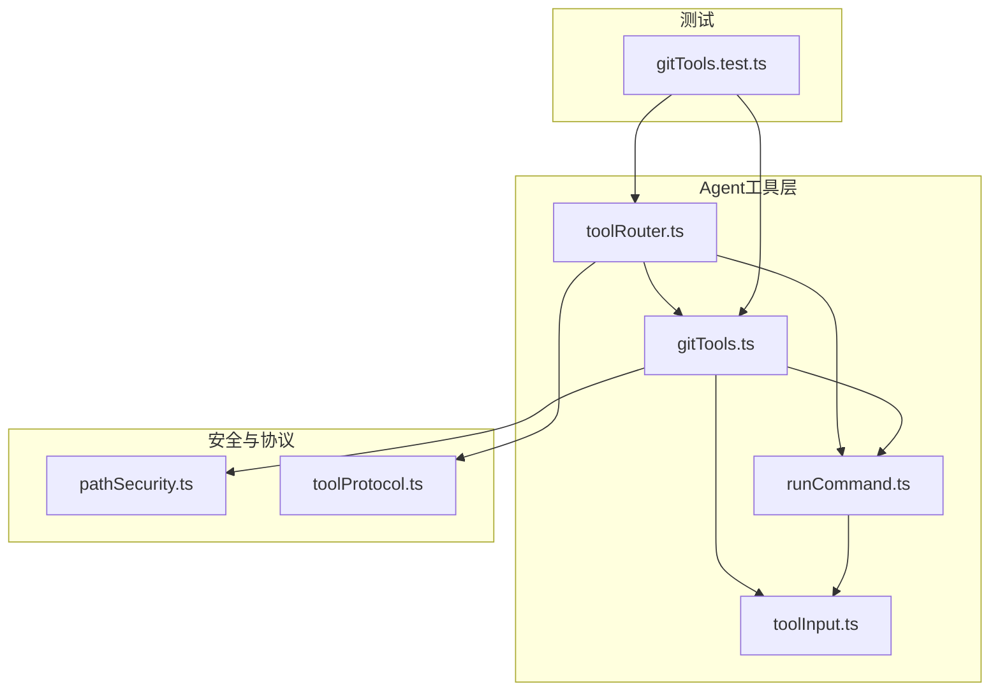
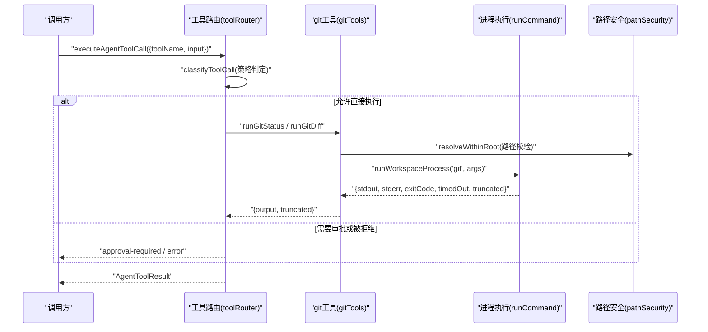
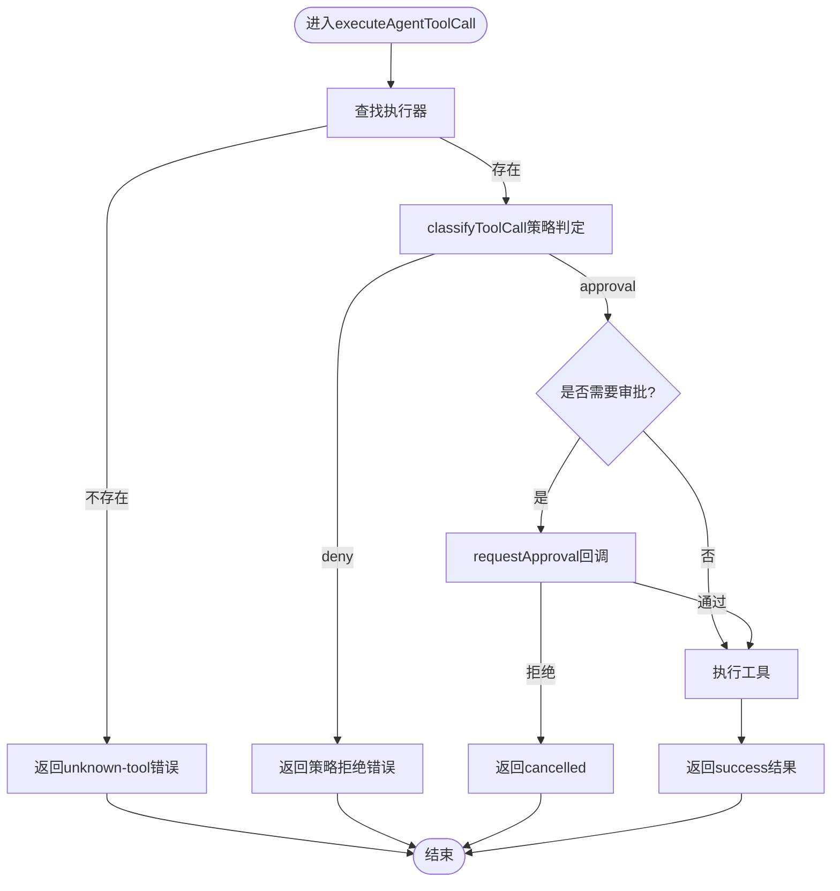
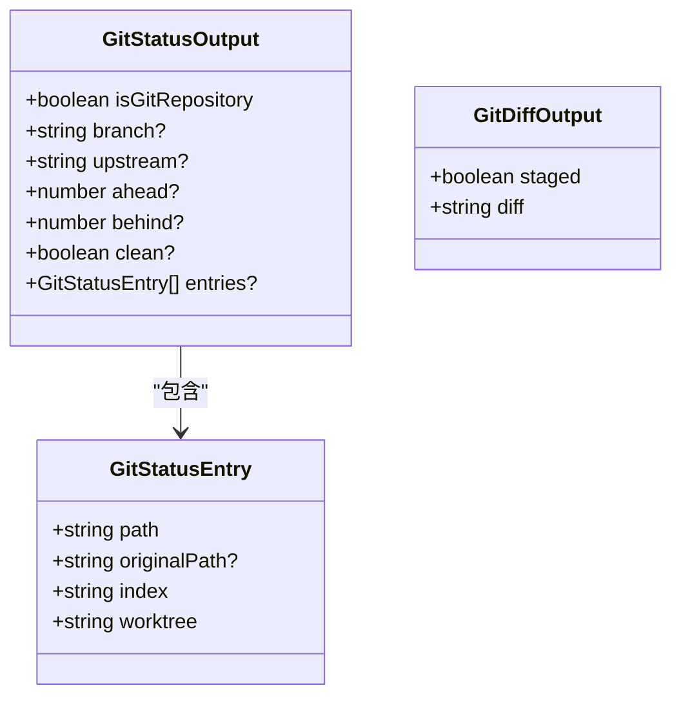
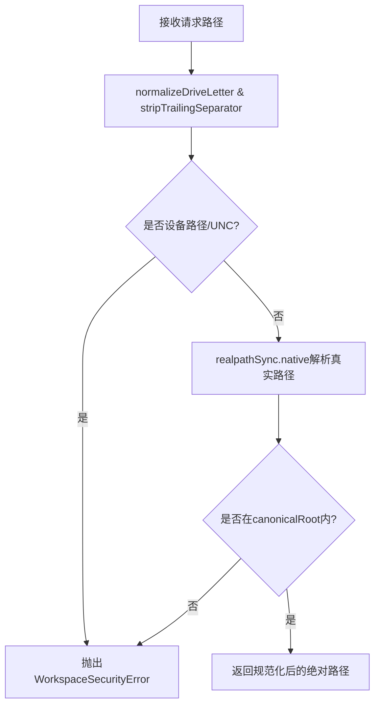
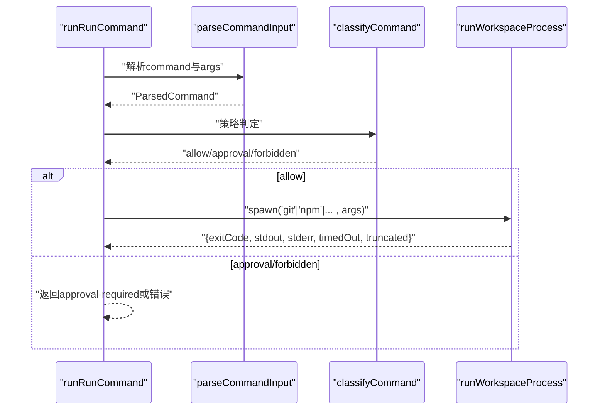
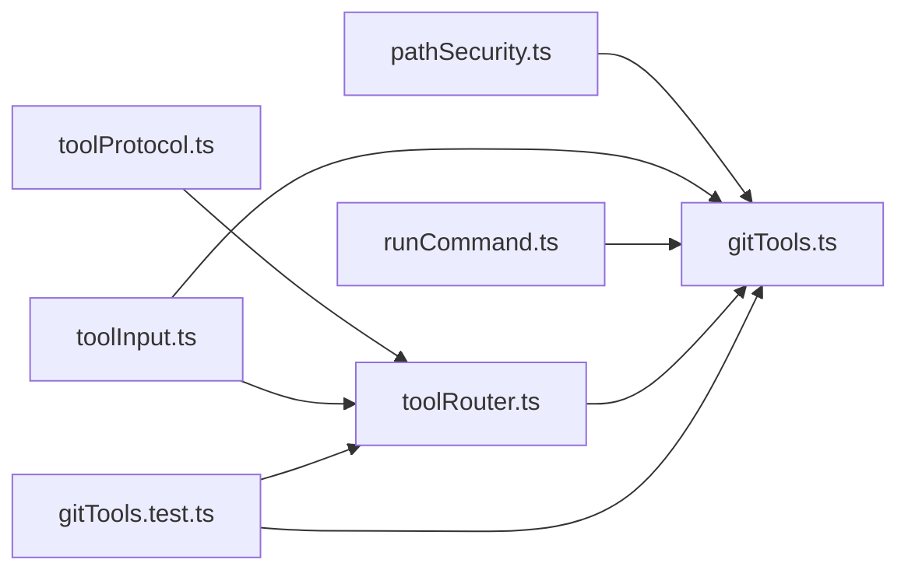

# Git只读工具

<cite>
**本文引用的文件**
- [README.md](file://README.md)
- [package.json](file://package.json)
- [src/agent/tools/gitTools.ts](file://src/agent/tools/gitTools.ts)
- [tests/gitTools.test.ts](file://tests/gitTools.test.ts)
- [src/agent/tools/toolRouter.ts](file://src/agent/tools/toolRouter.ts)
- [src/shared/toolProtocol.ts](file://src/shared/toolProtocol.ts)
- [src/agent/workspace/pathSecurity.ts](file://src/agent/workspace/pathSecurity.ts)
- [src/agent/tools/runCommand.ts](file://src/agent/tools/runCommand.ts)
- [src/agent/tools/toolInput.ts](file://src/agent/tools/toolInput.ts)
</cite>

## 目录
1. [简介](#简介)
2. [项目结构](#项目结构)
3. [核心组件](#核心组件)
4. [架构总览](#架构总览)
5. [详细组件分析](#详细组件分析)
6. [依赖关系分析](#依赖关系分析)
7. [性能与限制](#性能与限制)
8. [故障排查指南](#故障排查指南)
9. [结论](#结论)
10. [附录：API定义与使用示例路径](#附录api定义与使用示例路径)

## 简介
本项目是一个私有AI桌面客户端的原型，采用Electron + Vue 3 + TypeScript构建。其Agent侧提供“只读Git工具”，用于安全地读取工作区的Git状态和差异，帮助智能体区分用户已有修改与自身变更，并支持最终审查。只读工具包括：
- git_status：以结构化方式列出暂存区、工作区和未跟踪文件的变更，以及分支、上游、领先/落后计数等元信息。
- git_diff：输出统一差异文本（支持查看工作区或暂存区差异），并可按路径过滤。

这些工具通过统一的工具路由与安全策略执行，确保在只读工作区中无需审批即可运行，且所有外部命令执行均受超时、输出大小限制与取消信号保护。

## 项目结构
仓库采用分层组织：
- src/agent/tools：Agent工具实现（git_tools、read_file、search_code、workspace_tree、apply_patch、run_command等）
- src/agent/workspace：工作区路径安全与校验
- src/shared：跨进程协议与类型定义（工具调用/结果协议）
- tests：单元测试与端到端测试
- model-runtime、scripts、docs：模型运行时脚本、打包验证与文档

图表来源
- [src/agent/tools/toolRouter.ts:62-82](file://src/agent/tools/toolRouter.ts#L62-L82)
- [src/agent/tools/gitTools.ts:13-17](file://src/agent/tools/gitTools.ts#L13-L17)
- [src/agent/tools/runCommand.ts:15-17](file://src/agent/tools/runCommand.ts#L15-L17)
- [src/agent/workspace/pathSecurity.ts:1-13](file://src/agent/workspace/pathSecurity.ts#L1-L13)
- [src/shared/toolProtocol.ts:10-17](file://src/shared/toolProtocol.ts#L10-L17)
- [tests/gitTools.test.ts:1-16](file://tests/gitTools.test.ts#L1-L16)

章节来源
- [README.md:104-112](file://README.md#L104-L112)
- [package.json:7-14](file://package.json#L7-L14)

## 核心组件
- 工具路由与策略：集中注册工具、判定是否允许直接执行或需审批，并将失败统一为结构化结果。
- 只读Git工具：git_status与git_diff，封装git命令并通过通用进程执行器运行，具备超时、截断与取消能力。
- 路径安全：规范化工作区根路径、解析请求路径并确保不逃逸工作区，屏蔽敏感目录与文件模式。
- 输入校验：对工具输入进行严格校验，将错误映射为结构化错误码。
- 协议：统一的AgentToolCall/AgentToolResult类型，保证调用与返回的一致性。

章节来源
- [src/agent/tools/toolRouter.ts:1-12](file://src/agent/tools/toolRouter.ts#L1-L12)
- [src/agent/tools/gitTools.ts:1-11](file://src/agent/tools/gitTools.ts#L1-L11)
- [src/agent/workspace/pathSecurity.ts:4-13](file://src/agent/workspace/pathSecurity.ts#L4-L13)
- [src/agent/tools/toolInput.ts:1-7](file://src/agent/tools/toolInput.ts#L1-L7)
- [src/shared/toolProtocol.ts:1-8](file://src/shared/toolProtocol.ts#L1-L8)

## 架构总览
只读Git工具的调用链路如下：
- 上层通过工具路由发起工具调用
- 路由根据工具名选择执行器，并基于信任级别与白名单决定是否放行或需要审批
- git工具通过通用进程执行器运行git命令，捕获输出并解析
- 路径安全模块确保任何路径参数不会逃逸工作区
- 输入校验模块确保输入合法，错误被转换为结构化错误

图表来源
- [src/agent/tools/toolRouter.ts:96-160](file://src/agent/tools/toolRouter.ts#L96-L160)
- [src/agent/tools/toolRouter.ts:169-225](file://src/agent/tools/toolRouter.ts#L169-L225)
- [src/agent/tools/gitTools.ts:136-186](file://src/agent/tools/gitTools.ts#L136-L186)
- [src/agent/tools/runCommand.ts:207-310](file://src/agent/tools/runCommand.ts#L207-L310)
- [src/agent/workspace/pathSecurity.ts:175-191](file://src/agent/workspace/pathSecurity.ts#L175-L191)

## 详细组件分析

### 工具路由与策略（toolRouter.ts）
- 职责：注册工具执行器、判定执行策略（allow/deny/approval）、统一结果包装与耗时统计。
- 关键设计：
  - READ_ONLY_TOOL_NAMES包含git_status与git_diff，因此在任何工作区均可直接执行，无需审批。
  - 非白名单工具（如apply_patch、run_command）在只读工作区会被拒绝；在读写工作区可能需审批。
  - executeAgentToolCall负责调用执行器并捕获异常，统一转为AgentToolResult。

图表来源
- [src/agent/tools/toolRouter.ts:62-82](file://src/agent/tools/toolRouter.ts#L62-L82)
- [src/agent/tools/toolRouter.ts:96-160](file://src/agent/tools/toolRouter.ts#L96-L160)
- [src/agent/tools/toolRouter.ts:169-225](file://src/agent/tools/toolRouter.ts#L169-L225)

章节来源
- [src/agent/tools/toolRouter.ts:1-229](file://src/agent/tools/toolRouter.ts#L1-L229)

### 只读Git工具（gitTools.ts）
- git_status：
  - 通过git status --porcelain=v1 --branch --untracked-files=normal -z获取结构化输出。
  - 解析分支、上游、ahead/behind计数及文件条目（含重命名/复制的原始路径）。
  - 若工作区不是Git仓库，返回isGitRepository=false。
- git_diff：
  - 支持staged开关与工作区路径过滤，路径经安全校验后追加到git diff参数。
  - 若非Git仓库则返回not-a-git-repository错误。
- 通用：
  - 通过runWorkspaceProcess执行git命令，具备超时、输出截断与取消支持。
  - 错误处理：超时与退出码非零会抛出结构化错误。

图表来源
- [src/agent/tools/gitTools.ts:21-47](file://src/agent/tools/gitTools.ts#L21-L47)

章节来源
- [src/agent/tools/gitTools.ts:49-99](file://src/agent/tools/gitTools.ts#L49-L99)
- [src/agent/tools/gitTools.ts:101-134](file://src/agent/tools/gitTools.ts#L101-L134)
- [src/agent/tools/gitTools.ts:136-186](file://src/agent/tools/gitTools.ts#L136-L186)

### 路径安全（pathSecurity.ts）
- normalizeWorkspacePath：规范化工作区根路径，拒绝设备路径、UNC路径与非绝对路径，解析符号链接并标准化驱动盘符。
- resolveWithinRoot：将工具传入的路径解析到工作区内，防止逃逸（包括符号链接/连接点）。
- 排除规则：默认排除node_modules、.git、dist等目录与敏感文件模式。

图表来源
- [src/agent/workspace/pathSecurity.ts:89-125](file://src/agent/workspace/pathSecurity.ts#L89-L125)
- [src/agent/workspace/pathSecurity.ts:175-191](file://src/agent/workspace/pathSecurity.ts#L175-L191)

章节来源
- [src/agent/workspace/pathSecurity.ts:1-223](file://src/agent/workspace/pathSecurity.ts#L1-L223)

### 进程执行与命令策略（runCommand.ts）
- runWorkspaceProcess：统一的工作区进程执行器，支持超时、输出字节上限、取消信号，Windows下兼容.cmd/.bat shim。
- classifyCommand：对命令进行策略判定，git子命令中的只读操作（status/log/diff/show/branch/ls-files/describe/rev-parse/remote）自动允许，其他需审批。
- parseCommandInput：严格校验命令与参数，禁止shell元字符与危险可执行名。

图表来源
- [src/agent/tools/runCommand.ts:99-151](file://src/agent/tools/runCommand.ts#L99-L151)
- [src/agent/tools/runCommand.ts:153-186](file://src/agent/tools/runCommand.ts#L153-L186)
- [src/agent/tools/runCommand.ts:207-310](file://src/agent/tools/runCommand.ts#L207-L310)

章节来源
- [src/agent/tools/runCommand.ts:1-330](file://src/agent/tools/runCommand.ts#L1-L330)

### 输入校验与错误映射（toolInput.ts）
- 提供requireToolString、toToolInteger、toToolBoolean等强类型输入解析函数。
- ToolInputError与toToolError将输入错误、路径安全错误与内部错误统一映射为AgentToolError。

章节来源
- [src/agent/tools/toolInput.ts:1-106](file://src/agent/tools/toolInput.ts#L1-L106)

### 协议与类型（toolProtocol.ts）
- AgentToolName定义支持的工具名称，包含git_status与git_diff。
- AgentToolCall/AgentToolResult定义统一的调用与返回结构，包含durationMs与truncated字段。

章节来源
- [src/shared/toolProtocol.ts:1-77](file://src/shared/toolProtocol.ts#L1-L77)

## 依赖关系分析
- toolRouter依赖gitTools、runCommand、toolInput与toolProtocol，构成工具调用的中枢。
- gitTools依赖runCommand（进程执行）、pathSecurity（路径安全）与toolInput（输入校验）。
- runCommand独立实现进程执行与命令策略，供git工具复用。
- pathSecurity为所有工具提供路径安全基础能力。
- 测试gitTools.test.ts覆盖解析逻辑、工具行为与策略判定。

图表来源
- [src/agent/tools/toolRouter.ts:14-31](file://src/agent/tools/toolRouter.ts#L14-L31)
- [src/agent/tools/gitTools.ts:13-17](file://src/agent/tools/gitTools.ts#L13-L17)
- [src/agent/tools/runCommand.ts:15-17](file://src/agent/tools/runCommand.ts#L15-L17)
- [tests/gitTools.test.ts:1-16](file://tests/gitTools.test.ts#L1-L16)

章节来源
- [src/agent/tools/toolRouter.ts:62-82](file://src/agent/tools/toolRouter.ts#L62-L82)
- [src/agent/tools/gitTools.ts:136-186](file://src/agent/tools/gitTools.ts#L136-L186)
- [src/agent/tools/runCommand.ts:132-151](file://src/agent/tools/runCommand.ts#L132-L151)
- [tests/gitTools.test.ts:71-218](file://tests/gitTools.test.ts#L71-L218)

## 性能与限制
- 超时控制：git工具默认超时15秒，可通过进程执行器的超时机制保障响应性。
- 输出限制：进程执行器对stdout/stderr设置最大字节数，超出时标记truncated，避免内存膨胀。
- 取消支持：通过AbortSignal可在长时间操作中取消执行。
- 路径安全：所有路径经过规范化与包含性检查，防止逃逸与访问敏感目录。
- 策略限制：只读git子命令自动允许，其余命令需审批；只读工作区拒绝写操作。

[本节为通用指导，不直接分析具体文件]

## 故障排查指南
- not-a-git-repository：git_diff在非Git工作区调用时会返回该错误；git_status会返回isGitRepository=false。
- outside-workspace：路径过滤器尝试逃逸工作区根将被拒绝。
- command-not-found：当系统不可用对应可执行时会返回该错误。
- forbidden-command：命令策略判定为禁止时返回。
- read-only-workspace：在只读工作区执行写工具会被拒绝。
- git-timeout / git-failed：git命令超时或非零退出码会抛出结构化错误。

章节来源
- [src/agent/tools/gitTools.ts:120-134](file://src/agent/tools/gitTools.ts#L120-L134)
- [src/agent/tools/toolRouter.ts:100-160](file://src/agent/tools/toolRouter.ts#L100-L160)
- [src/agent/tools/runCommand.ts:99-151](file://src/agent/tools/runCommand.ts#L99-L151)
- [src/agent/workspace/pathSecurity.ts:175-191](file://src/agent/workspace/pathSecurity.ts#L175-L191)
- [src/agent/tools/toolInput.ts:90-106](file://src/agent/tools/toolInput.ts#L90-L106)

## 结论
该项目的只读Git工具通过严谨的策略与安全检查，为Agent提供了稳定、可控的仓库状态与差异读取能力。工具路由统一管理执行权限，路径安全确保工作区边界不被突破，进程执行器提供超时、截断与取消保障。结合完善的单元测试，能够可靠支撑智能体的工作区分析与审查流程。

[本节为总结，不直接分析具体文件]

## 附录：API定义与使用示例路径
- 工具名称与协议类型定义
  - [src/shared/toolProtocol.ts:10-17](file://src/shared/toolProtocol.ts#L10-L17)
  - [src/shared/toolProtocol.ts:19-41](file://src/shared/toolProtocol.ts#L19-L41)
- 工具路由与策略
  - [src/agent/tools/toolRouter.ts:62-82](file://src/agent/tools/toolRouter.ts#L62-L82)
  - [src/agent/tools/toolRouter.ts:96-160](file://src/agent/tools/toolRouter.ts#L96-L160)
  - [src/agent/tools/toolRouter.ts:169-225](file://src/agent/tools/toolRouter.ts#L169-L225)
- git_status与git_diff接口
  - [src/agent/tools/gitTools.ts:21-47](file://src/agent/tools/gitTools.ts#L21-L47)
  - [src/agent/tools/gitTools.ts:136-186](file://src/agent/tools/gitTools.ts#L136-L186)
- 路径安全与输入校验
  - [src/agent/workspace/pathSecurity.ts:89-125](file://src/agent/workspace/pathSecurity.ts#L89-L125)
  - [src/agent/workspace/pathSecurity.ts:175-191](file://src/agent/workspace/pathSecurity.ts#L175-L191)
  - [src/agent/tools/toolInput.ts:31-88](file://src/agent/tools/toolInput.ts#L31-L88)
- 进程执行与命令策略
  - [src/agent/tools/runCommand.ts:99-151](file://src/agent/tools/runCommand.ts#L99-L151)
  - [src/agent/tools/runCommand.ts:207-310](file://src/agent/tools/runCommand.ts#L207-L310)
- 测试用例参考
  - [tests/gitTools.test.ts:71-97](file://tests/gitTools.test.ts#L71-L97)
  - [tests/gitTools.test.ts:99-142](file://tests/gitTools.test.ts#L99-L142)
  - [tests/gitTools.test.ts:144-218](file://tests/gitTools.test.ts#L144-L218)