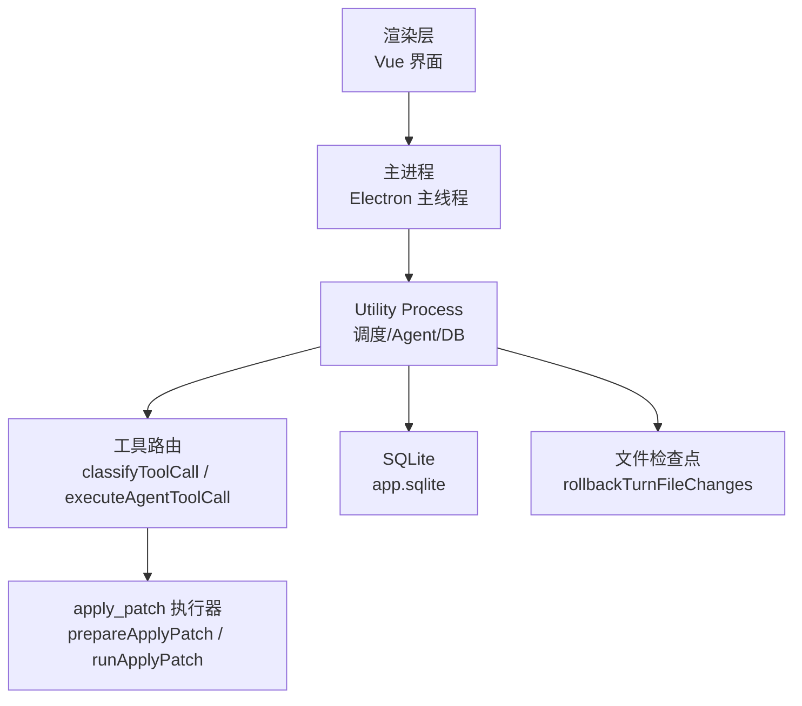
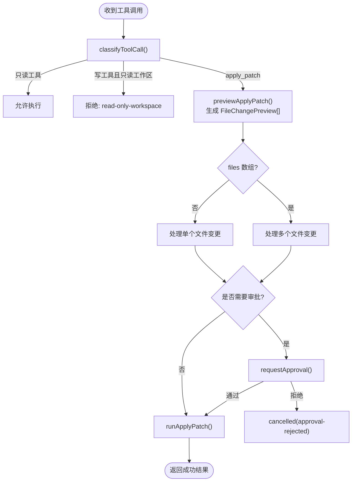
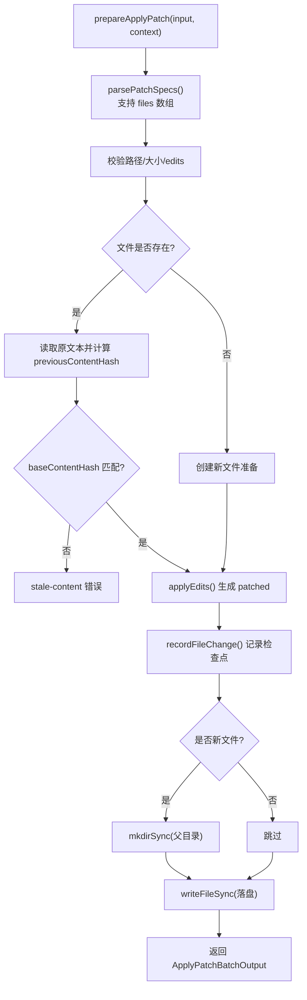
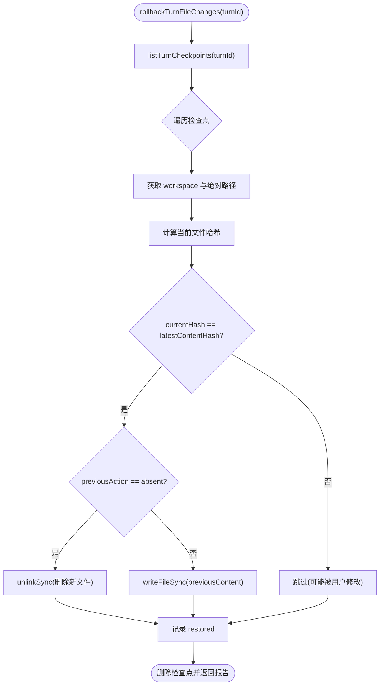
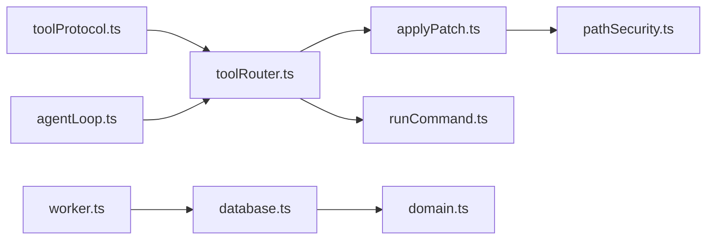

# 文件修改审批工作流

<cite>
**本文引用的文件**
- [README.md](file://README.md)
- [package.json](file://package.json)
- [src/agent/tools/toolRouter.ts](file://src/agent/tools/toolRouter.ts)
- [src/agent/tools/applyPatch.ts](file://src/agent/tools/applyPatch.ts)
- [src/shared/domain.ts](file://src/shared/domain.ts)
- [src/shared/toolProtocol.ts](file://src/shared/toolProtocol.ts)
- [src/agent/agentLoop.ts](file://src/agent/agentLoop.ts)
- [src/agent/database.ts](file://src/agent/database.ts)
- [src/agent/workspace/fileCheckpoints.ts](file://src/agent/workspace/fileCheckpoints.ts)
- [tests/writeTools.test.ts](file://tests/writeTools.test.ts)
- [tests/worker.test.ts](file://tests/worker.test.ts)
</cite>

## 更新摘要
**所做更改**
- 更新了 apply_patch 工具的批量操作功能说明
- 新增了 ApplyPatchBatchOutput 类型和 files 数组参数支持
- 添加了重复路径验证和最大文件数量限制（8个文件）
- 更新了审批流程以支持多文件变更的单一变更集
- 增强了原子性保证，确保批量操作的完整性

## 目录
1. [简介](#简介)
2. [项目结构](#项目结构)
3. [核心组件](#核心组件)
4. [架构总览](#架构总览)
5. [详细组件分析](#详细组件分析)
6. [依赖关系分析](#依赖关系分析)
7. [性能与安全性考量](#性能与安全性考量)
8. [故障排查指南](#故障排查指南)
9. [结论](#结论)

## 简介
本文件围绕"文件修改审批工作流"展开，说明该桌面 AI 客户端如何在 Agent 调用工具时，对可能修改工作区文件的危险操作进行预览、拦截与用户审批，并在批准后安全落盘。同时提供回滚机制，确保一次对话轮次（turn）内的所有文件变更可被整体撤销。

**更新** 现在支持批量文件操作，允许在单个批准的变更集中修改多个文件，提高了工作效率并简化了审批流程。

## 项目结构
本项目采用 Electron + Vue 3 + TypeScript 的私有桌面客户端架构：渲染层仅负责 UI；主进程负责生命周期与安全策略；Utility Process 承载调度、模型调用、Agent 运行与 SQLite 持久化。文件修改审批逻辑集中在 Utility Process 的工具路由与执行器中，并通过数据库记录审批状态与文件检查点。



图表来源
- [src/agent/tools/toolRouter.ts:1-108](file://src/agent/tools/toolRouter.ts#L1-L108)
- [src/agent/tools/applyPatch.ts:44-142](file://src/agent/tools/applyPatch.ts#L44-L142)
- [src/agent/database.ts:582-607](file://src/agent/database.ts#L582-L607)
- [src/agent/workspace/fileCheckpoints.ts:14-49](file://src/agent/workspace/fileCheckpoints.ts#L14-L49)

章节来源
- [README.md:104-120](file://README.md#L104-L120)
- [package.json:7-14](file://package.json#L7-L14)

## 核心组件
- 工具协议与结果类型：统一封装工具调用的输入输出、错误分类与耗时统计。
- 工具路由与策略：根据工具名与工作区信任级别决定允许、拒绝或需要审批；对写操作生成差异预览。
- **更新的** apply_patch 执行器：支持单文件和批量文件操作，在内存中应用补丁并计算新内容哈希，支持创建/修改文件，生成 diff 行用于审批预览。
- Agent 循环：解析模型返回的工具调用，注入审批回调，将工具结果反馈给模型继续推理。
- 数据库与审批持久化：持久化审批请求、状态与响应时间；失败/取消时清理挂起审批。
- 文件检查点与回滚：记录每次写入前的文件内容与哈希，支持按 turn 回滚。

章节来源
- [src/shared/toolProtocol.ts:1-54](file://src/shared/toolProtocol.ts#L1-L54)
- [src/agent/tools/toolRouter.ts:62-160](file://src/agent/tools/toolRouter.ts#L62-L160)
- [src/agent/tools/applyPatch.ts:44-142](file://src/agent/tools/applyPatch.ts#L44-L142)
- [src/agent/agentLoop.ts:140-210](file://src/agent/agentLoop.ts#L140-L210)
- [src/agent/database.ts:582-607](file://src/agent/database.ts#L582-L607)
- [src/agent/workspace/fileCheckpoints.ts:14-49](file://src/agent/workspace/fileCheckpoints.ts#L14-L49)

## 架构总览
下图展示了从 Agent 发起工具调用到审批、落盘与回滚的完整流程。

```mermaid
sequenceDiagram
participant Model as "模型"
participant Loop as "Agent 循环"
participant Router as "工具路由"
participant Patch as "apply_patch"
participant DB as "数据库"
participant FS as "文件系统"
Model->>Loop : 文本包含
```tool 块
  Loop->>Router: executeAgentToolCall(apply_patch, input)
  Router->>Router: classifyToolCall()
  alt 需要审批
    Router-->>Loop: approval-required
    Loop->>DB: upsertApproval(pending)
    Note over Loop,DB: 等待用户批准
    Loop->>Router: requestApproval(true/false)
    opt 拒绝
      Router-->>Loop: cancelled(approval-rejected)
      Loop->>DB: upsertApproval(rejected)
    end
  else 允许
    Router->>Patch: prepareApplyPatch()
    Patch->>FS: 读取原文件/校验大小/基线哈希
    Patch->>Patch: applyEdits() 生成新内容
    Patch->>DB: recordFileCheckpoint(写入前快照)
    Patch->>FS: writeFileSync(落盘)
    Patch-->>Router: success(output)
    Router-->>Loop: success
  end
  Loop-->>Model: 工具结果
```

图表来源
- [src/agent/agentLoop.ts:171-210](file://src/agent/agentLoop.ts#L171-L210)
- [src/agent/tools/toolRouter.ts:169-226](file://src/agent/tools/toolRouter.ts#L169-L226)
- [src/agent/tools/applyPatch.ts:49-142](file://src/agent/tools/applyPatch.ts#L49-L142)
- [src/agent/database.ts:582-607](file://src/agent/database.ts#L582-L607)

## 详细组件分析

### 工具路由与审批策略
- 只读工具直接放行；写工具在工作区为只读时被拒绝；write 工具进入审批分支。
- 对 apply_patch 会先进行 dry-run 生成 FileChangePreview，展示相对路径、动作（created/modified）与带上下文的 diff 行。
- **更新的** 批量操作支持：当使用 files 数组时，会生成包含多个文件变更的单一审批请求，标题自动调整为"Edit N files"格式。
- 对 run_command 会基于命令白名单判定 allow/deny/approval。
- 若未提供 requestApproval 回调，则返回 approval-required 结果，阻止执行。



图表来源
- [src/agent/tools/toolRouter.ts:100-160](file://src/agent/tools/toolRouter.ts#L100-L160)
- [src/agent/tools/toolRouter.ts:169-226](file://src/agent/tools/toolRouter.ts#L169-L226)
- [src/agent/tools/applyPatch.ts:98-109](file://src/agent/tools/applyPatch.ts#L98-L109)

章节来源
- [src/agent/tools/toolRouter.ts:62-160](file://src/agent/tools/toolRouter.ts#L62-L160)
- [src/agent/tools/toolRouter.ts:169-226](file://src/agent/tools/toolRouter.ts#L169-L226)

### apply_patch 执行器与补丁验证
- 输入校验：路径必须在根目录下且不被排除；文件大小限制；edits 数量与格式限制。
- **新增的** 批量操作支持：支持 files 数组参数，最多 8 个文件，自动检测重复路径。
- 基线一致性：已有文件必须提供 baseContentHash，并与当前磁盘内容 SHA-256 一致，否则报 stale-content。
- 内存应用：按行号排序后自底向上应用 edits，保证不重叠；保留原始尾换行约定。
- 落盘与快照：写入前先记录文件检查点（包含 previousAction、previousContent、previousContentHash、newContentHash），再写文件。
- **更新的** 输出：返回 ApplyPatchBatchOutput 对象，包含 files 数组，每个文件都有 action、totalLines、linesChanged 与新 contentHash。



图表来源
- [src/agent/tools/applyPatch.ts:49-142](file://src/agent/tools/applyPatch.ts#L49-L142)
- [src/agent/tools/applyPatch.ts:196-268](file://src/agent/tools/applyPatch.ts#L196-L268)

章节来源
- [src/agent/tools/applyPatch.ts:44-142](file://src/agent/tools/applyPatch.ts#L44-L142)
- [src/agent/tools/applyPatch.ts:196-268](file://src/agent/tools/applyPatch.ts#L196-L268)

### Agent 循环与审批集成
- Agent 循环从模型回复中解析 ```tool 块，构造 AgentToolCall 并交由工具路由执行。
- 当工具需要审批时，循环通过 requestApproval 回调向外部（UI/上层）申请批准，并将审批事件持久化。
- **更新的** 批量操作提示：系统提示鼓励使用 files 数组进行多文件变更，以便用户审查单一变更集。
- 工具结果以结构化消息回传给模型，驱动下一轮推理或直接输出答案。

```mermaid
sequenceDiagram
participant Loop as "Agent 循环"
participant Router as "工具路由"
participant DB as "数据库"
Loop->>Router : executeAgentToolCall(call, context, {requestApproval})
alt 需要审批
Router-->>Loop : approval-required
Loop->>DB : upsertApproval({status : 'pending'})
Loop->>Loop : 等待外部批准
Loop->>Router : requestApproval(true/false)
opt 拒绝
Router-->>Loop : cancelled
Loop->>DB : upsertApproval({status : 'rejected'})
end
end
Router-->>Loop : success/error/cancel
Loop-->>Loop : 将结果追加到消息历史
```

图表来源
- [src/agent/agentLoop.ts:171-210](file://src/agent/agentLoop.ts#L171-L210)
- [src/agent/database.ts:582-607](file://src/agent/database.ts#L582-L607)

章节来源
- [src/agent/agentLoop.ts:140-210](file://src/agent/agentLoop.ts#L140-L210)
- [src/agent/database.ts:582-607](file://src/agent/database.ts#L582-L607)

### 审批持久化与状态管理
- 审批对象包含 id、threadId、turnId、title、description、可选 fileChange、status、createdAt、respondedAt。
- **更新的** 批量审批：当处理 files 数组时，审批标题会自动显示文件数量，如"Edit 2 files"。
- 启动或中断时会修复悬挂的 pending 审批：对已终止的 turn 将其 pending 审批置为 rejected。
- 工具路由执行成功后，由上层 worker 更新审批状态为 approved/rejected，并记录 respondedAt。

章节来源
- [src/shared/domain.ts:92-103](file://src/shared/domain.ts#L92-L103)
- [src/agent/database.ts:532-554](file://src/agent/database.ts#L532-L554)
- [src/agent/database.ts:582-607](file://src/agent/database.ts#L582-L607)

### 文件检查点与回滚
- 每次 apply_patch 落盘前记录检查点：relativePath、previousAction、previousContent、previousContentHash、latestContentHash。
- **更新的** 批量检查点：批量操作中的每个文件都会单独记录检查点，确保完整的回滚能力。
- 回滚时按 turnId 查询检查点，逐个恢复：若当前文件哈希不等于 latestContentHash，则跳过（避免覆盖用户后续编辑）。
- 回滚完成后删除对应检查点，确保一次性清理。



图表来源
- [src/agent/workspace/fileCheckpoints.ts:14-49](file://src/agent/workspace/fileCheckpoints.ts#L14-L49)

章节来源
- [src/agent/workspace/fileCheckpoints.ts:14-49](file://src/agent/workspace/fileCheckpoints.ts#L14-L49)

## 依赖关系分析
- toolRouter 依赖 toolProtocol 定义的结果类型与工厂函数，依赖 applyPatch 与 runCommand 等具体执行器。
- applyPatch 依赖 pathSecurity 做路径安全校验，依赖 fs/crypto 做文件读写与哈希。
- agentLoop 依赖 toolRouter 的策略与执行，以及 modelProvider 的流式接口。
- database 提供审批与检查点的持久化能力，被 worker 与工具执行链路共同消费。



图表来源
- [src/agent/tools/toolRouter.ts:1-31](file://src/agent/tools/toolRouter.ts#L1-L31)
- [src/agent/tools/applyPatch.ts:1-7](file://src/agent/tools/applyPatch.ts#L1-L7)
- [src/agent/agentLoop.ts:11-22](file://src/agent/agentLoop.ts#L11-L22)
- [src/agent/database.ts:1-24](file://src/agent/database.ts#L1-L24)

章节来源
- [src/agent/tools/toolRouter.ts:1-31](file://src/agent/tools/toolRouter.ts#L1-L31)
- [src/agent/tools/applyPatch.ts:1-7](file://src/agent/tools/applyPatch.ts#L1-L7)
- [src/agent/agentLoop.ts:11-22](file://src/agent/agentLoop.ts#L11-L22)
- [src/agent/database.ts:1-24](file://src/agent/database.ts#L1-L24)

## 性能与安全性考量
- 补丁大小与行数限制：单文件补丁上限与最大 edits 数，防止大文件与过多编辑导致性能问题。
- **新增的** 批量操作限制：最多 8 个文件 per patch，防止过大的变更集影响性能和用户体验。
- **新增的** 重复路径检测：在同一批操作中禁止重复路径，避免冲突和混淆。
- 基线哈希校验：避免并发或外部修改导致的覆盖风险，确保原子性语义。
- 路径安全：仅允许在工作区根内操作，排除敏感路径。
- 审批前置：写操作必须经过用户确认，避免误改。
- 回滚保护：回滚时检测最新哈希，避免覆盖用户后续编辑。
- **更新的** 原子性保证：批量操作中的所有文件变更要么全部成功，要么全部失败，不会留下部分应用的中间状态。

## 故障排查指南
- 出现 stale-content：说明文件内容已被其他进程修改，需重新读取文件并更新 baseContentHash 后重试。
- 出现 approval-rejected：用户拒绝了审批，不会有任何文件变更；检查审批事件与 UI 交互。
- 出现 read-only-workspace：工作区信任级别为只读，无法执行写工具；调整工作区信任级别。
- **新增的** duplicate-path：同一批操作中出现了重复的文件路径，需要移除重复项。
- **新增的** oversized-batch：批操作中的文件数量超过 8 个的限制，需要分批处理。
- 审批悬挂：应用重启或 turn 失败后，数据库会将 terminal turn 的 pending 审批置为 rejected；检查数据库状态。
- 回滚未生效：若文件在 turn 之后被用户修改，回滚会跳过该文件；检查 latestContentHash 与 currentHash。

章节来源
- [src/agent/tools/applyPatch.ts:70-82](file://src/agent/tools/applyPatch.ts#L70-L82)
- [src/agent/tools/toolRouter.ts:198-214](file://src/agent/tools/toolRouter.ts#L198-L214)
- [src/agent/database.ts:532-554](file://src/agent/database.ts#L532-L554)
- [src/agent/workspace/fileCheckpoints.ts:25-42](file://src/agent/workspace/fileCheckpoints.ts#L25-L42)

## 结论
该工作流通过"工具路由策略 + 补丁预览 + 用户审批 + 检查点回滚"的组合，实现了安全的文件修改闭环。Agent 可在受控环境下自动编辑代码，但任何破坏性操作均需用户明确授权；一旦出现问题，可按 turn 快速回滚，保障工作区稳定。

**更新总结** 新的批量操作功能显著提升了多文件修改的工作效率，通过单一的审批流程处理多个文件变更，同时保持了严格的安全检查和原子性保证。这既满足了复杂代码重构的需求，又确保了开发过程的可控性和可追溯性。