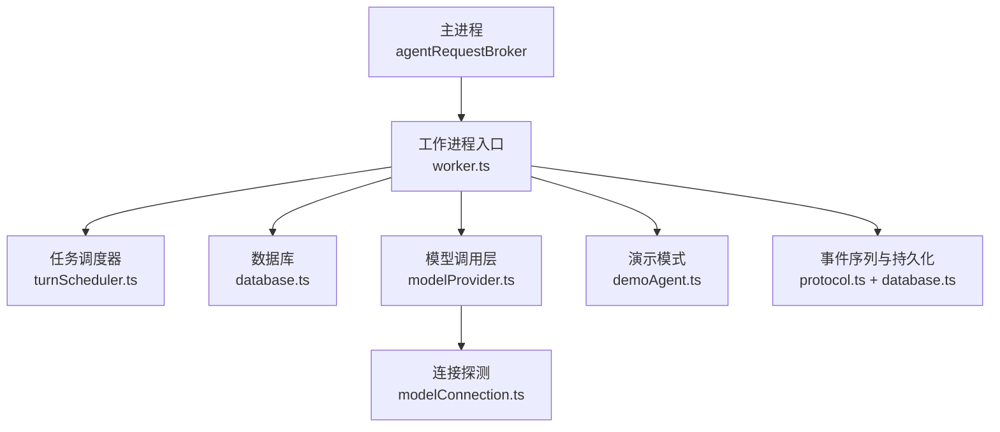
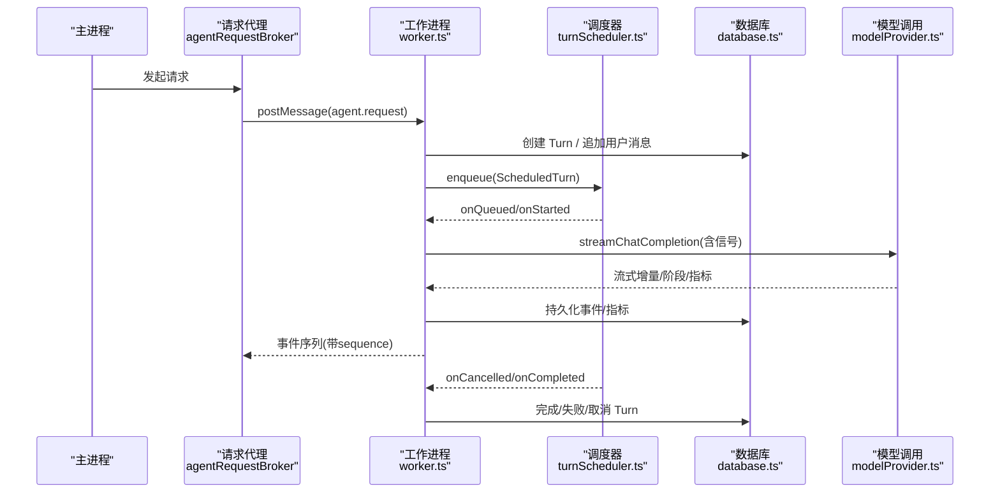
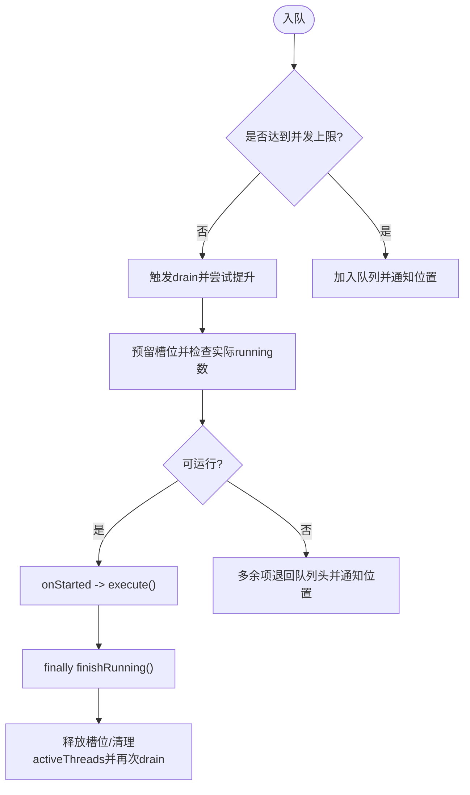
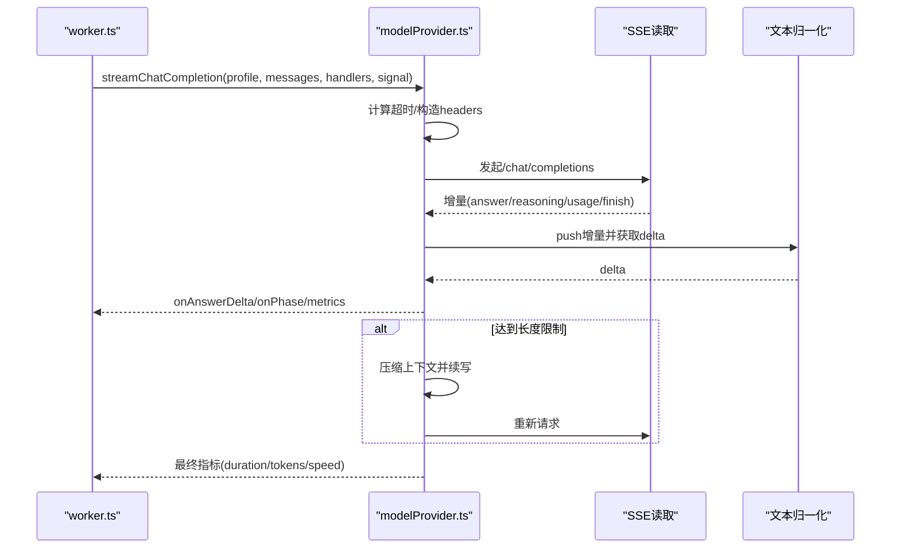
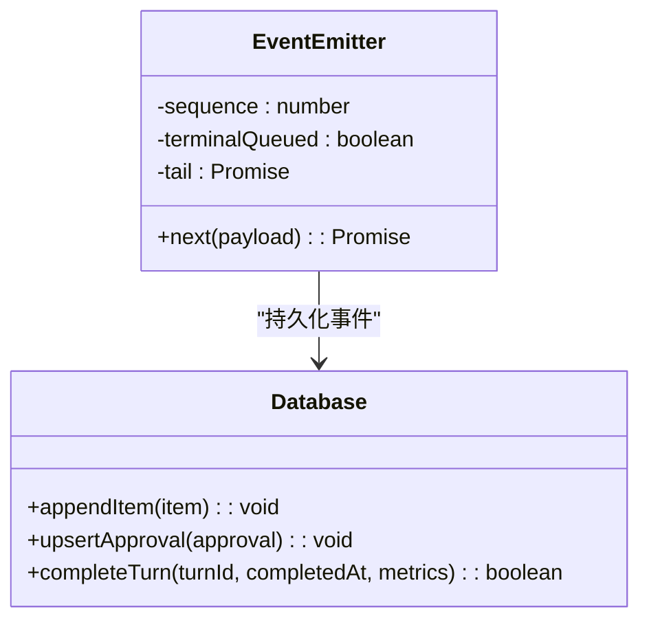
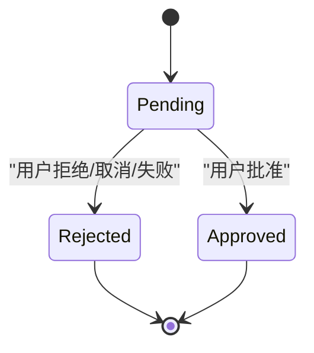
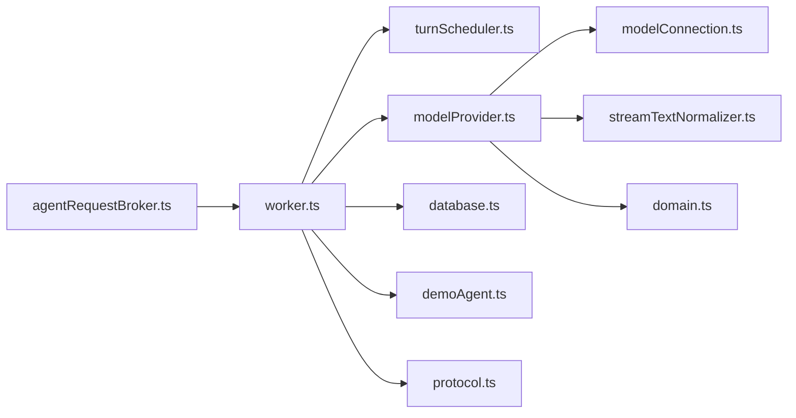

# Agent 工作进程

<cite>
**本文引用的文件**
- [worker.ts](file://src/agent/worker.ts)
- [turnScheduler.ts](file://src/agent/turnScheduler.ts)
- [modelProvider.ts](file://src/agent/modelProvider.ts)
- [modelConnection.ts](file://src/agent/modelConnection.ts)
- [database.ts](file://src/agent/database.ts)
- [demoAgent.ts](file://src/agent/demoAgent.ts)
- [streamTextNormalizer.ts](file://src/agent/streamTextNormalizer.ts)
- [domain.ts](file://src/shared/domain.ts)
- [protocol.ts](file://src/shared/protocol.ts)
- [agentRequestBroker.ts](file://src/main/agentRequestBroker.ts)
</cite>

## 目录
1. [简介](#简介)
2. [项目结构](#项目结构)
3. [核心组件](#核心组件)
4. [架构总览](#架构总览)
5. [详细组件分析](#详细组件分析)
6. [依赖关系分析](#依赖关系分析)
7. [性能考量](#性能考量)
8. [故障排除指南](#故障排除指南)
9. [结论](#结论)
10. [附录：关键流程与示例路径](#附录：关键流程与示例路径)

## 简介
本文件面向“Agent 工作进程”的完整实现，聚焦以下目标：
- 任务调度器的工作原理：并发控制、队列管理、线程安全机制。
- 模型调用管理流程：流式响应处理、错误重试机制、超时控制。
- 事件发射器设计模式：事件序列化与持久化策略。
- 审批系统实现：权限验证与状态管理。
- 实战示例：如何启动对话轮次、处理流式数据与管理资源。
- 性能优化建议与故障排除指南。

该工作进程运行在独立进程中，通过主进程消息通道接收请求，使用 SQLite 持久化会话与指标，按模型配置进行并发限流，并以 SSE 流式方式与模型服务交互。

## 项目结构
- 工作进程入口与运行时：worker.ts
- 任务调度器：turnScheduler.ts
- 模型调用与流式处理：modelProvider.ts、modelConnection.ts
- 数据持久化：database.ts
- 演示模式（无需真实模型）：demoAgent.ts
- 流文本归一化：streamTextNormalizer.ts
- 共享领域模型与协议：domain.ts、protocol.ts
- 主进程侧请求代理：agentRequestBroker.ts

图表来源
- [worker.ts:106-124](file://src/agent/worker.ts#L106-L124)
- [turnScheduler.ts:32-45](file://src/agent/turnScheduler.ts#L32-L45)
- [modelProvider.ts:55-197](file://src/agent/modelProvider.ts#L55-L197)
- [modelConnection.ts:11-91](file://src/agent/modelConnection.ts#L11-L91)
- [database.ts:136-201](file://src/agent/database.ts#L136-L201)
- [protocol.ts:22-65](file://src/shared/protocol.ts#L22-L65)

章节来源
- [worker.ts:106-124](file://src/agent/worker.ts#L106-L124)
- [turnScheduler.ts:32-45](file://src/agent/turnScheduler.ts#L32-L45)
- [modelProvider.ts:55-197](file://src/agent/modelProvider.ts#L55-L197)
- [modelConnection.ts:11-91](file://src/agent/modelConnection.ts#L11-L91)
- [database.ts:136-201](file://src/agent/database.ts#L136-L201)
- [protocol.ts:22-65](file://src/shared/protocol.ts#L22-L65)

## 核心组件
- 工作进程运行时：负责解析桌面端请求、创建并维护 Turn 生命周期、事件序列化和持久化、审批协调、资源清理。
- 任务调度器：按模型配置限制并发，管理队列、预留槽位、取消与完成回调，保证同一线程内只有一个活跃 Turn。
- 模型调用层：封装 SSE 流式读取、上下文压缩与续写、超时与重试、指标聚合。
- 连接探测：校验模型服务可用性、模型匹配与并发槽位一致性。
- 数据库：SQLite 事务性写入，Turn/Item/Approval/Settings/ModelProfile 等实体管理。
- 演示模式：在不依赖外部模型的情况下模拟审批与流式输出。
- 事件系统：为每个 Turn 生成有序事件，附带 threadId、turnId、modelProfileId、sequence，确保顺序与幂等投递。

章节来源
- [worker.ts:128-153](file://src/agent/worker.ts#L128-L153)
- [turnScheduler.ts:32-45](file://src/agent/turnScheduler.ts#L32-L45)
- [modelProvider.ts:55-197](file://src/agent/modelProvider.ts#L55-L197)
- [modelConnection.ts:11-91](file://src/agent/modelConnection.ts#L11-L91)
- [database.ts:345-449](file://src/agent/database.ts#L345-L449)
- [demoAgent.ts:16-65](file://src/agent/demoAgent.ts#L16-L65)
- [protocol.ts:41-65](file://src/shared/protocol.ts#L41-L65)

## 架构总览
工作进程以“请求-调度-执行-事件-持久化”为主线：
- 主进程通过 agentRequestBroker 发送请求到工作进程。
- worker 根据请求类型路由到具体处理器（如 turn.start）。
- startTurn 创建 Turn 记录、构建历史消息、选择模型或进入演示模式，并将 Turn 加入调度器。
- 调度器按模型配置的并发上限从队列中取出 Turn 执行，执行期间通过事件发射器持续产出事件。
- 事件被持久化并回传给主进程；Turn 完成后更新数据库状态与指标。

图表来源
- [worker.ts:307-358](file://src/agent/worker.ts#L307-L358)
- [turnScheduler.ts:47-72](file://src/agent/turnScheduler.ts#L47-L72)
- [modelProvider.ts:55-197](file://src/agent/modelProvider.ts#L55-L197)
- [database.ts:345-449](file://src/agent/database.ts#L345-L449)
- [protocol.ts:41-65](file://src/shared/protocol.ts#L41-L65)

## 详细组件分析

### 任务调度器：并发控制、队列管理与线程安全
- 并发控制
  - 每个模型配置有 maxConcurrency，调度器维护 runningByModel 集合，确保不超过有效限制。
  - 入队时若未达到限制则直接 drain，否则进入队列并通知位置变化。
- 队列管理
  - 按 modelProfileId 分桶队列，支持动态更新限制、批量通知队列位置。
  - 预留槽位 reserved 与运行中 running 分离，避免竞态。
- 线程安全
  - 单进程内通过异步操作队列（每模型一个操作队列）串行化内部状态变更。
  - 对回调执行采用 try/catch 包裹，防止未捕获异常泄漏或卡死槽位。
  - 同一 threadId 仅允许一个活跃 Turn，重复入队会抛错。

图表来源
- [turnScheduler.ts:47-72](file://src/agent/turnScheduler.ts#L47-L72)
- [turnScheduler.ts:153-200](file://src/agent/turnScheduler.ts#L153-L200)
- [turnScheduler.ts:229-263](file://src/agent/turnScheduler.ts#L229-L263)

章节来源
- [turnScheduler.ts:32-45](file://src/agent/turnScheduler.ts#L32-L45)
- [turnScheduler.ts:47-72](file://src/agent/turnScheduler.ts#L47-L72)
- [turnScheduler.ts:153-200](file://src/agent/turnScheduler.ts#L153-L200)
- [turnScheduler.ts:229-263](file://src/agent/turnScheduler.ts#L229-L263)

### 模型调用管理：流式响应、错误重试与超时控制
- 流式响应
  - 使用 SSE 读取增量，区分 answer、reasoning raw/summary、finishReason、usage。
  - 通过 createStreamTextNormalizer 将增量转换为增量或累积模式，避免重复与乱序。
- 上下文压缩与续写
  - 当接近上下文窗口时，自动压缩历史并提示模型继续回答，直到 finishReason 非 length。
  - 支持多次续写，合并指标与速率统计。
- 超时控制
  - 默认超时基于 maxOutputTokens 与 token 超时系数计算，上限封顶。
  - 使用 AbortSignal 串联外部取消与内部超时，统一抛出超时或中止原因。
- 错误重试
  - 遇到上下文超限或压缩后仍失败时，自动降级压缩级别并重试。
  - 针对 usage 兼容性问题，先带 usage 再不带 usage 重试一次。

图表来源
- [modelProvider.ts:55-197](file://src/agent/modelProvider.ts#L55-L197)
- [modelProvider.ts:563-680](file://src/agent/modelProvider.ts#L563-L680)
- [streamTextNormalizer.ts:8-33](file://src/agent/streamTextNormalizer.ts#L8-L33)

章节来源
- [modelProvider.ts:55-197](file://src/agent/modelProvider.ts#L55-L197)
- [modelProvider.ts:563-680](file://src/agent/modelProvider.ts#L563-L680)
- [streamTextNormalizer.ts:8-33](file://src/agent/streamTextNormalizer.ts#L8-L33)

### 事件发射器：序列化与持久化策略
- 事件序列
  - 每个 Turn 的事件携带 threadId、turnId、modelProfileId、sequence，保证顺序与可重放。
  - 终端事件（completed/failed/cancelled）之后不再投递后续事件。
- 持久化
  - 事件在投递前写入数据库：message.delta/answer.delta 合并为助手消息，reasoning.raw/summary 写入推理项，approval.required 写入待审批。
  - 完成时关闭不完整标记，确保 UI 与回放一致。
- 幂等与容错
  - 事件投递链使用 tail Promise 串行化，失败不中断后续事件。
  - 终端事件后忽略新事件，避免重复完成。

图表来源
- [worker.ts:128-153](file://src/agent/worker.ts#L128-L153)
- [worker.ts:454-464](file://src/agent/worker.ts#L454-L464)
- [database.ts:475-524](file://src/agent/database.ts#L475-L524)
- [database.ts:423-449](file://src/agent/database.ts#L423-L449)

章节来源
- [worker.ts:128-153](file://src/agent/worker.ts#L128-L153)
- [worker.ts:454-464](file://src/agent/worker.ts#L454-L464)
- [database.ts:475-524](file://src/agent/database.ts#L475-L524)
- [database.ts:423-449](file://src/agent/database.ts#L423-L449)

### 审批系统：权限验证与状态管理
- 触发条件
  - 演示模式下检测到“修改/删除/write/delete”等关键词时，需要人工审批。
  - 真实模型模式下也可通过 provider 返回 approval.required 事件触发审批。
- 状态流转
  - pending -> approved/rejected，或由取消/失败自动拒绝。
  - 审批结果通过 Promise 恢复 Turn 执行。
- 权限与校验
  - respondApproval 要求审批处于 pending 且存在，否则拒绝。
  - 取消或失败时清理未决审批，避免悬挂等待。

图表来源
- [demoAgent.ts:29-51](file://src/agent/demoAgent.ts#L29-L51)
- [worker.ts:328-333](file://src/agent/worker.ts#L328-L333)
- [worker.ts:372-384](file://src/agent/worker.ts#L372-L384)
- [worker.ts:623-634](file://src/agent/worker.ts#L623-L634)
- [database.ts:404-421](file://src/agent/database.ts#L404-L421)

章节来源
- [demoAgent.ts:29-51](file://src/agent/demoAgent.ts#L29-L51)
- [worker.ts:328-333](file://src/agent/worker.ts#L328-L333)
- [worker.ts:372-384](file://src/agent/worker.ts#L372-L384)
- [worker.ts:623-634](file://src/agent/worker.ts#L623-L634)
- [database.ts:404-421](file://src/agent/database.ts#L404-L421)

### 启动对话轮次、处理流式数据与管理资源的示例路径
- 启动对话轮次
  - 主进程通过 agentRequestBroker.request 发送 turn.start。
  - worker.handleDesktopRequest 路由到 turnRuntime.startTurn。
  - startTurn 创建 Turn、追加用户消息、构建历史、入队调度器。
  - 参考路径：[worker.ts:307-358](file://src/agent/worker.ts#L307-L358)、[agentRequestBroker.ts:33-52](file://src/main/agentRequestBroker.ts#L33-L52)
- 处理流式数据
  - modelProvider.streamChatCompletion 建立 SSE 连接，readSSEDeltas 逐行解析。
  - 通过 ModelStreamHandlers 回调推送 answer/reasoning/phase。
  - 参考路径：[modelProvider.ts:55-197](file://src/agent/modelProvider.ts#L55-L197)、[modelProvider.ts:563-680](file://src/agent/modelProvider.ts#L563-L680)
- 管理系统资源
  - 使用 AbortSignal 贯穿取消与超时，确保网络与流资源释放。
  - 调度器在 finally 中释放槽位并触发下一次 drain。
  - 参考路径：[modelProvider.ts:720-756](file://src/agent/modelProvider.ts#L720-L756)、[turnScheduler.ts:229-263](file://src/agent/turnScheduler.ts#L229-L263)

章节来源
- [worker.ts:307-358](file://src/agent/worker.ts#L307-L358)
- [agentRequestBroker.ts:33-52](file://src/main/agentRequestBroker.ts#L33-L52)
- [modelProvider.ts:55-197](file://src/agent/modelProvider.ts#L55-L197)
- [modelProvider.ts:563-680](file://src/agent/modelProvider.ts#L563-L680)
- [modelProvider.ts:720-756](file://src/agent/modelProvider.ts#L720-L756)
- [turnScheduler.ts:229-263](file://src/agent/turnScheduler.ts#L229-L263)

## 依赖关系分析
- worker.ts 依赖
  - turnScheduler.ts：并发与队列。
  - modelProvider.ts：流式调用与指标。
  - database.ts：持久化与快照。
  - demoAgent.ts：演示模式。
  - protocol.ts：事件与请求类型校验。
- modelProvider.ts 依赖
  - modelConnection.ts：连接探测。
  - streamTextNormalizer.ts：增量文本归一化。
  - domain.ts：类型定义。
- 主进程依赖
  - agentRequestBroker.ts：请求-响应桥接与超时。

图表来源
- [worker.ts:1-48](file://src/agent/worker.ts#L1-L48)
- [modelProvider.ts:1-7](file://src/agent/modelProvider.ts#L1-L7)
- [modelConnection.ts:1-9](file://src/agent/modelConnection.ts#L1-L9)
- [streamTextNormalizer.ts:1-7](file://src/agent/streamTextNormalizer.ts#L1-L7)
- [domain.ts:1-10](file://src/shared/domain.ts#L1-L10)
- [protocol.ts:1-20](file://src/shared/protocol.ts#L1-L20)
- [agentRequestBroker.ts:1-20](file://src/main/agentRequestBroker.ts#L1-L20)

章节来源
- [worker.ts:1-48](file://src/agent/worker.ts#L1-L48)
- [modelProvider.ts:1-7](file://src/agent/modelProvider.ts#L1-L7)
- [modelConnection.ts:1-9](file://src/agent/modelConnection.ts#L1-L9)
- [streamTextNormalizer.ts:1-7](file://src/agent/streamTextNormalizer.ts#L1-L7)
- [domain.ts:1-10](file://src/shared/domain.ts#L1-L10)
- [protocol.ts:1-20](file://src/shared/protocol.ts#L1-L20)
- [agentRequestBroker.ts:1-20](file://src/main/agentRequestBroker.ts#L1-L20)

## 性能考量
- 并发与限流
  - 合理设置模型配置的 maxConcurrency，避免过载导致排队过长。
  - 调度器按模型维度隔离队列，减少跨模型干扰。
- 流式与内存
  - 使用增量模式推送 answer，降低内存占用与渲染压力。
  - 文本归一化避免重复拼接与丢失。
- 上下文压缩
  - 接近上下文窗口时自动压缩历史，减少请求大小与失败概率。
  - 压缩级别逐步加深，平衡质量与成功率。
- 超时与重试
  - 基于 maxOutputTokens 的动态超时，避免长时间阻塞。
  - 针对兼容性与上下文问题自动重试，提高鲁棒性。
- 数据库事务
  - 所有写操作使用事务，保证一致性与原子性。
  - WAL 模式与 busy_timeout 提升并发写入稳定性。

[本节提供通用指导，不直接分析具体文件]

## 故障排除指南
- 模型连接失败
  - 检查 baseUrl 与 apiKey，确认 /models 接口可达。
  - 若 slots 数量不一致，会出现并发警告，需调整客户端并发或服务端槽位。
  - 参考路径：[modelConnection.ts:11-91](file://src/agent/modelConnection.ts#L11-L91)
- 上下文超限
  - 观察是否触发 compressing 阶段，必要时降低上下文消息限制或增大模型上下文能力。
  - 参考路径：[modelProvider.ts:95-118](file://src/agent/modelProvider.ts#L95-L118)
- 流式中断或无响应
  - 检查 AbortSignal 是否提前中止，确认网络与服务器状态。
  - 参考路径：[modelProvider.ts:720-756](file://src/agent/modelProvider.ts#L720-L756)
- 审批卡住
  - 确认审批处于 pending，且在取消/失败时会被自动拒绝。
  - 参考路径：[worker.ts:372-384](file://src/agent/worker.ts#L372-L384)、[database.ts:404-421](file://src/agent/database.ts#L404-L421)
- 事件顺序错乱
  - 确认事件序列号递增，终端事件后不应再有后续事件。
  - 参考路径：[worker.ts:128-153](file://src/agent/worker.ts#L128-L153)、[protocol.ts:41-65](file://src/shared/protocol.ts#L41-L65)

章节来源
- [modelConnection.ts:11-91](file://src/agent/modelConnection.ts#L11-L91)
- [modelProvider.ts:95-118](file://src/agent/modelProvider.ts#L95-L118)
- [modelProvider.ts:720-756](file://src/agent/modelProvider.ts#L720-L756)
- [worker.ts:372-384](file://src/agent/worker.ts#L372-L384)
- [database.ts:404-421](file://src/agent/database.ts#L404-L421)
- [worker.ts:128-153](file://src/agent/worker.ts#L128-L153)
- [protocol.ts:41-65](file://src/shared/protocol.ts#L41-L65)

## 结论
该 Agent 工作进程通过清晰的职责划分与严格的并发控制，实现了高可靠的任务调度、流式模型调用与事件持久化。其设计兼顾了可扩展性（多模型配置）、健壮性（超时、重试、上下文压缩）与可观测性（指标与阶段事件）。在实际部署中，建议结合业务负载调优并发与上下文策略，并完善监控与告警以快速定位问题。

[本节总结内容，不直接分析具体文件]

## 附录：关键流程与示例路径
- 启动对话轮次
  - 主进程请求：[agentRequestBroker.ts:33-52](file://src/main/agentRequestBroker.ts#L33-L52)
  - 工作进程路由：[worker.ts:417-442](file://src/agent/worker.ts#L417-L442)
  - 创建 Turn 并入队：[worker.ts:307-358](file://src/agent/worker.ts#L307-L358)
- 流式数据处理
  - 流式调用与阶段推进：[modelProvider.ts:55-197](file://src/agent/modelProvider.ts#L55-L197)
  - SSE 解析与归一化：[modelProvider.ts:563-680](file://src/agent/modelProvider.ts#L563-L680)、[streamTextNormalizer.ts:8-33](file://src/agent/streamTextNormalizer.ts#L8-L33)
- 资源管理
  - 超时与取消：[modelProvider.ts:720-756](file://src/agent/modelProvider.ts#L720-L756)
  - 调度器释放与回收：[turnScheduler.ts:229-263](file://src/agent/turnScheduler.ts#L229-L263)
- 审批流程
  - 触发与等待：[demoAgent.ts:29-51](file://src/agent/demoAgent.ts#L29-L51)
  - 响应与状态更新：[worker.ts:372-384](file://src/agent/worker.ts#L372-L384)、[database.ts:404-421](file://src/agent/database.ts#L404-L421)

[本节列出路径，不直接分析具体文件]