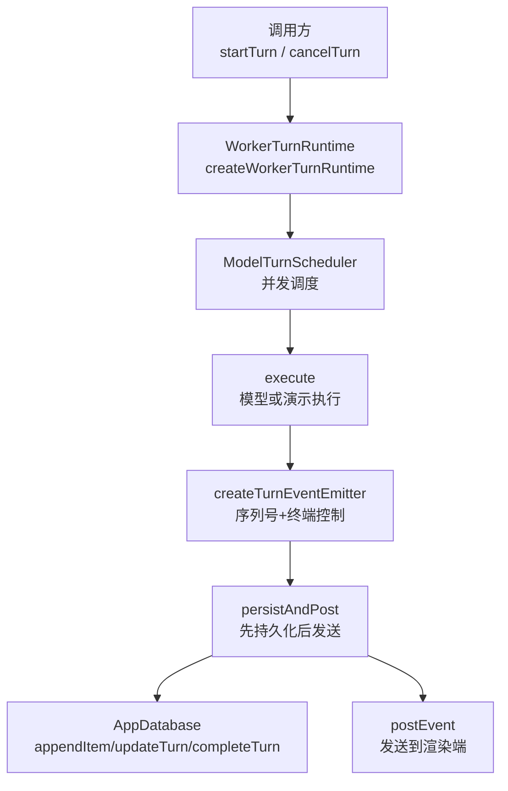
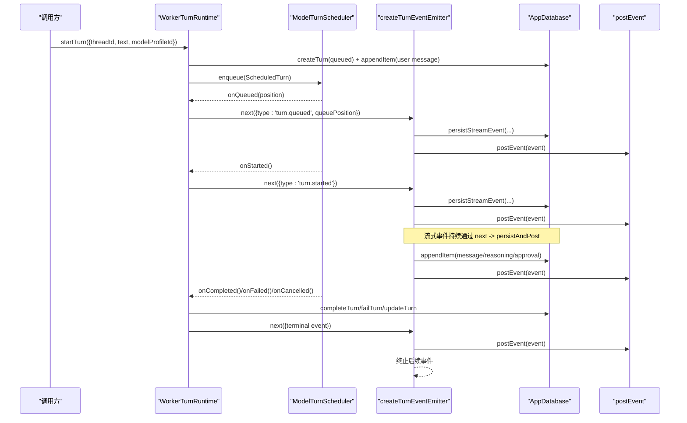
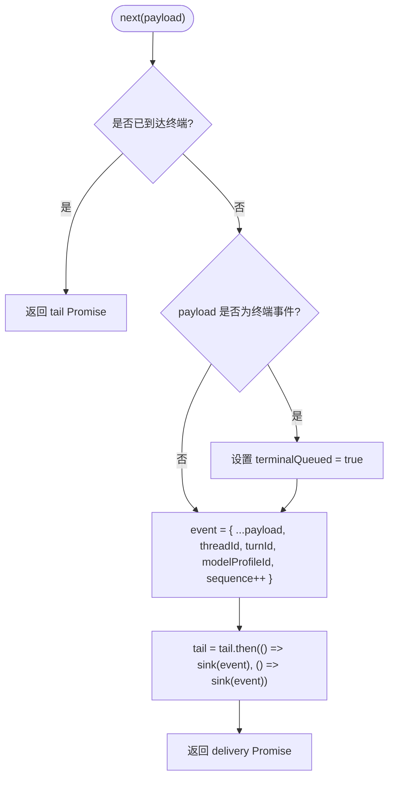
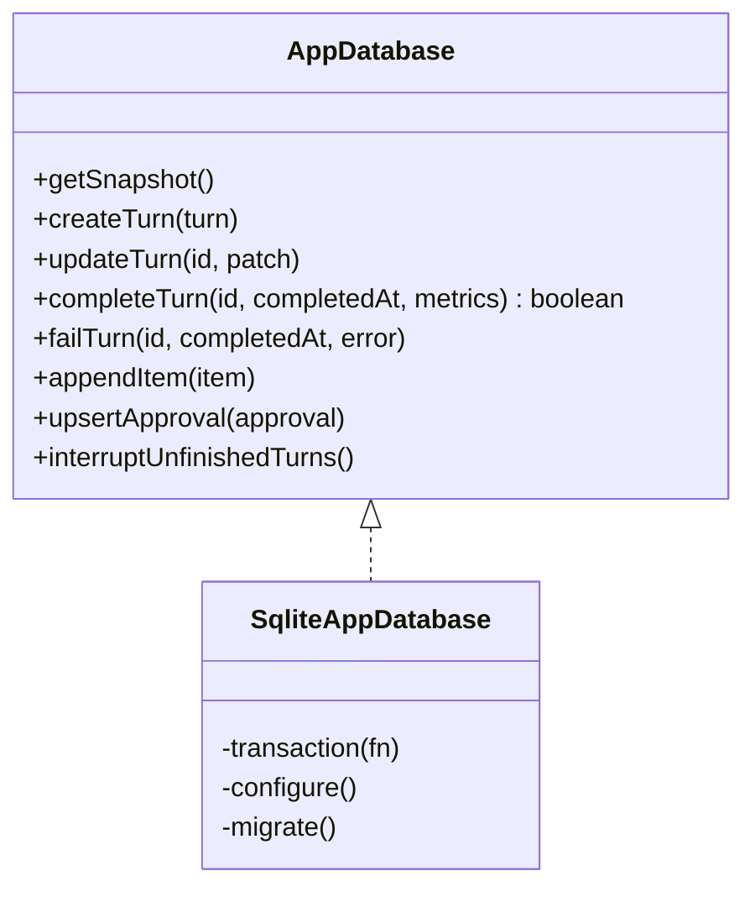
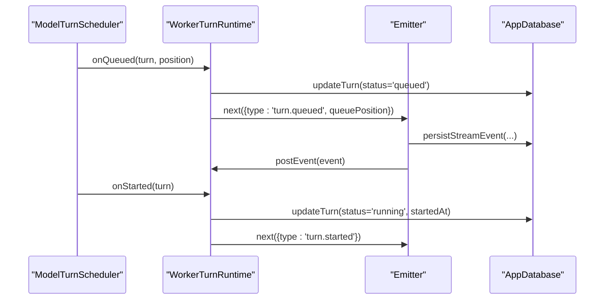
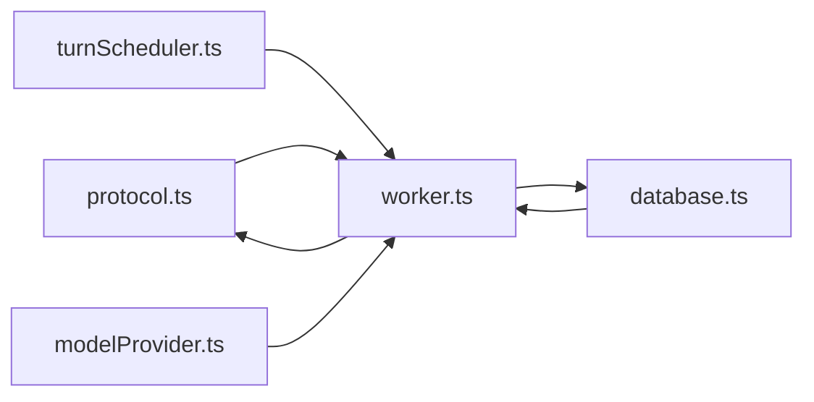

# 事件发射器

<cite>
**本文引用的文件**
- [worker.ts](file://src/agent/worker.ts)
- [database.ts](file://src/agent/database.ts)
- [protocol.ts](file://src/shared/protocol.ts)
- [turnScheduler.ts](file://src/agent/turnScheduler.ts)
- [demoAgent.test.ts](file://tests/demoAgent.test.ts)
- [agentClientCore.test.ts](file://tests/agentClientCore.test.ts)
</cite>

## 目录
1. [简介](#简介)
2. [项目结构](#项目结构)
3. [核心组件](#核心组件)
4. [架构总览](#架构总览)
5. [详细组件分析](#详细组件分析)
6. [依赖关系分析](#依赖关系分析)
7. [性能考虑](#性能考虑)
8. [故障恢复与一致性](#故障恢复与一致性)
9. [使用示例](#使用示例)
10. [结论](#结论)

## 简介
本文件围绕“事件发射器”的设计与实现进行系统化说明，重点解释 createTurnEventEmitter 的设计模式、事件序列号生成、终端事件处理、异步持久化机制、顺序保证与幂等性设计、事件生命周期管理，以及与数据库的集成（批量写入、事务、错误恢复）。同时给出创建事件发射器、处理不同类型事件和管理事件队列的实践要点。

## 项目结构
事件发射器位于 Agent Worker 层，负责为每个 Turn（对话轮次）产生带单调递增序列号的有序事件流，并在发送前完成必要的持久化。其关键文件与职责如下：
- worker.ts：定义 createTurnEventEmitter、事件发射上下文、调度回调、持久化桥接、执行流程。
- database.ts：SQLite 持久化，提供事务化写入、逻辑项合并、未完成状态恢复。
- protocol.ts：事件类型与校验，包含 SequencedAgentEvent 及 isAgentEvent。
- turnScheduler.ts：并发调度与队列位置更新，驱动 onQueued/onStarted/onCancelling/onCancelled。
- 测试用例：验证序列号单调性、终端事件关闭、客户端去重与乱序抑制。

图表来源
- [worker.ts:132-157](file://src/agent/worker.ts#L132-L157)
- [worker.ts:159-409](file://src/agent/worker.ts#L159-L409)
- [database.ts:360-464](file://src/agent/database.ts#L360-L464)
- [turnScheduler.ts:250-288](file://src/agent/turnScheduler.ts#L250-L288)

章节来源
- [worker.ts:132-157](file://src/agent/worker.ts#L132-L157)
- [worker.ts:159-409](file://src/agent/worker.ts#L159-L409)
- [database.ts:360-464](file://src/agent/database.ts#L360-L464)
- [turnScheduler.ts:250-288](file://src/agent/turnScheduler.ts#L250-L288)

## 核心组件
- createTurnEventEmitter：为单个 Turn 创建事件发射器，维护闭包内的 sequence 计数器与 terminal 标志，确保同一 Turn 内事件严格单调递增，并在收到终端事件后拒绝后续事件。
- persistAndPost：在事件发送前进行持久化（消息/推理片段/审批），再投递到上层。
- ModelTurnScheduler：按模型配置并发度调度 Turn，触发 onQueued/onStarted/onCancelling/onCancelled 等回调，统一更新数据库并派发事件。
- AppDatabase：封装 SQLite 操作，提供事务化写入、逻辑项合并、中断恢复、完成时标记 items 完整等能力。

章节来源
- [worker.ts:132-157](file://src/agent/worker.ts#L132-L157)
- [worker.ts:169-172](file://src/agent/worker.ts#L169-L172)
- [worker.ts:174-225](file://src/agent/worker.ts#L174-L225)
- [database.ts:360-464](file://src/agent/database.ts#L360-L464)

## 架构总览
下图展示从 startTurn 到事件落库与发送的端到端流程，以及终端事件对发射器的影响。

图表来源
- [worker.ts:312-362](file://src/agent/worker.ts#L312-L362)
- [worker.ts:174-225](file://src/agent/worker.ts#L174-L225)
- [worker.ts:132-157](file://src/agent/worker.ts#L132-L157)
- [worker.ts:481-491](file://src/agent/worker.ts#L481-L491)
- [database.ts:360-464](file://src/agent/database.ts#L360-L464)

## 详细组件分析

### createTurnEventEmitter：序列号与终端控制
- 序列号生成：闭包内维护 sequence 初始为 1，每次发射自增，保证同一 Turn 内严格单调递增。
- 终端事件过滤：isTerminalPayload 识别 turn.completed/failed/cancelled；一旦发出过终端事件，后续事件直接返回 tail Promise，不再追加。
- 顺序保证：通过 tail 链式 Promise 串行化 sink 调用，避免并发导致的乱序；即使 sink 抛错，也会捕获并继续推进 tail，防止阻塞后续事件。
- 幂等性：同一 Turn 内重复事件会被下游客户端根据 sequence 去重；发射器本身不检查 payload 内容，仅保证顺序与终端关闭。

图表来源
- [worker.ts:132-157](file://src/agent/worker.ts#L132-L157)
- [worker.ts:663-667](file://src/agent/worker.ts#L663-L667)

章节来源
- [worker.ts:132-157](file://src/agent/worker.ts#L132-L157)
- [worker.ts:663-667](file://src/agent/worker.ts#L663-L667)

### 事件持久化与数据库集成
- 持久化时机：persistAndPost 先调用 persistStreamEvent 将 delta 文本合并入逻辑项，再 postEvent 发送。
- 逻辑项合并：assistant 消息与 reasoning 片段按固定 id 规则追加，读取时合并为单条逻辑项，减少 UI 碎片。
- 事务与原子性：所有写操作包裹在 transaction 中；completeTurn 在事务内将相关 items 标记为完整，保证状态一致。
- 中断恢复：interruptUnfinishedTurns 将未完成的 queued/running/cancelling 转为 interrupted，并清理 pending 审批，重启后可重建状态。

图表来源
- [database.ts:38-66](file://src/agent/database.ts#L38-L66)
- [database.ts:360-464](file://src/agent/database.ts#L360-L464)
- [database.ts:466-488](file://src/agent/database.ts#L466-L488)

章节来源
- [worker.ts:481-491](file://src/agent/worker.ts#L481-L491)
- [database.ts:360-464](file://src/agent/database.ts#L360-L464)
- [database.ts:466-488](file://src/agent/database.ts#L466-L488)

### 调度与队列位置
- 并发限制：按模型配置的 maxConcurrency 限制并行 Turn；演示模式强制为 1。
- 回调链路：onQueued 更新数据库并派发 turn.queued；onStarted 更新 running 并派发 turn.started；onCancelling/onCancelled 分别处理取消流程。
- 队列位置：scheduleQueuePositions 聚合当前队列位置并广播，避免重复推送相同位置。

图表来源
- [worker.ts:174-225](file://src/agent/worker.ts#L174-L225)
- [turnScheduler.ts:250-288](file://src/agent/turnScheduler.ts#L250-L288)

章节来源
- [worker.ts:174-225](file://src/agent/worker.ts#L174-L225)
- [turnScheduler.ts:250-288](file://src/agent/turnScheduler.ts#L250-L288)

### 事件生命周期管理
- 创建：startTurn 创建 TurnRecord 为 queued，并立即持久化用户消息。
- 序列化与编号：createTurnEventEmitter 为每个事件分配单调递增 sequence。
- 持久化：persistStreamEvent 将 answer/raw/summary/approval 写入数据库，合并逻辑项。
- 发送：postEvent 将事件投递给渲染端；若 sink 失败，tail 捕获异常并继续推进。
- 结束：completeTurn/failTurn 标记 Turn 终态，并派发 terminal 事件；发射器收到终端事件后拒绝后续事件。

章节来源
- [worker.ts:312-362](file://src/agent/worker.ts#L312-L362)
- [worker.ts:132-157](file://src/agent/worker.ts#L132-L157)
- [worker.ts:481-491](file://src/agent/worker.ts#L481-L491)
- [database.ts:438-464](file://src/agent/database.ts#L438-L464)

### 顺序保证与幂等性设计
- 顺序保证：
  - 发射器内部通过 tail 串行化 sink 调用，确保同一 Turn 内事件顺序。
  - 序列号单调递增，下游可据此排序与去重。
- 幂等性与去重：
  - 客户端 reduceAgentEvent 在同一 Turn 内对重复和乱序 sequence 进行抑制，只保留最新有效事件。
  - 不同 Turn 允许相同 sequence 值，避免跨 Turn 误判。
- 终端事件优先：一旦发出 terminal 事件，后续事件被丢弃，避免状态回退。

章节来源
- [worker.ts:132-157](file://src/agent/worker.ts#L132-L157)
- [agentClientCore.test.ts:251-264](file://tests/agentClientCore.test.ts#L251-L264)
- [agentClientCore.test.ts:359-371](file://tests/agentClientCore.test.ts#L359-L371)

## 依赖关系分析
- worker.ts 依赖：
  - protocol.ts：事件类型与校验。
  - database.ts：事务化写入、逻辑项合并、中断恢复。
  - turnScheduler.ts：并发调度与队列位置广播。
  - demoAgent.ts/modelProvider.ts：演示与真实模型执行。
- 数据流向：
  - 业务侧调用 startTurn -> 调度器 -> 执行器 -> 发射器 -> 持久化 -> 发送。
  - 终端事件触发 complete/fail/cancel，更新数据库并关闭发射器。

图表来源
- [worker.ts:1-53](file://src/agent/worker.ts#L1-L53)
- [protocol.ts:41-65](file://src/shared/protocol.ts#L41-L65)
- [database.ts:38-66](file://src/agent/database.ts#L38-L66)
- [turnScheduler.ts:250-288](file://src/agent/turnScheduler.ts#L250-L288)

章节来源
- [worker.ts:1-53](file://src/agent/worker.ts#L1-L53)
- [protocol.ts:41-65](file://src/shared/protocol.ts#L41-L65)
- [database.ts:38-66](file://src/agent/database.ts#L38-L66)
- [turnScheduler.ts:250-288](file://src/agent/turnScheduler.ts#L250-L288)

## 性能考虑
- 事件串行化：tail 链式 Promise 避免竞态，降低锁竞争与重复写入。
- 逻辑项合并：assistant 与 reasoning 片段合并为单条 item，减少 UI 渲染压力与数据库条目数量。
- 事务批处理：appendItem/updateTurn/completeTurn 均使用事务，减少磁盘 IO 次数。
- 并发控制：按模型配置限制并发 Turn，避免资源争用。
- 建议优化：
  - 在高吞吐场景下，可将小段 delta 合并后再持久化，减少频繁事务开销。
  - 对高频事件（如 answer.delta）采用缓冲窗口批量提交，但需权衡实时性。
  - 监控 sink 失败率，必要时引入重试与降级策略。

[本节为通用性能讨论，不直接分析具体文件]

## 故障恢复与一致性
- 中断恢复：应用启动时调用 interruptUnfinishedTurns，将未完成 Turn 标记为 interrupted，并清理 pending 审批，确保状态可重建。
- 完成一致性：completeTurn 在事务中将 items 标记为完整，避免部分完成导致的不一致。
- 错误恢复：sink 抛错不影响后续事件；failTurn 记录错误信息并关闭 Turn。
- 客户端容错：reduceAgentEvent 对重复/乱序事件进行抑制，保证最终一致性。

章节来源
- [database.ts:466-488](file://src/agent/database.ts#L466-L488)
- [database.ts:438-464](file://src/agent/database.ts#L438-L464)
- [worker.ts:298-308](file://src/agent/worker.ts#L298-L308)
- [agentClientCore.test.ts:251-264](file://tests/agentClientCore.test.ts#L251-L264)

## 使用示例
以下示例展示如何创建事件发射器、处理不同类型事件与管理事件队列。为避免泄露实现细节，仅提供路径引用。

- 创建事件发射器并收集事件
  - 参考：[demoAgent.test.ts:14-43](file://tests/demoAgent.test.ts#L14-L43)
- 验证序列号单调性与终端关闭
  - 参考：[demoAgent.test.ts:14-43](file://tests/demoAgent.test.ts#L14-L43)
- 客户端去重与乱序抑制
  - 参考：[agentClientCore.test.ts:251-264](file://tests/agentClientCore.test.ts#L251-L264)
- 事件类型与校验
  - 参考：[protocol.ts:41-65](file://src/shared/protocol.ts#L41-L65)
  - 参考：[protocol.ts:318-371](file://src/shared/protocol.ts#L318-L371)
- 调度与队列位置更新
  - 参考：[turnScheduler.ts:250-288](file://src/agent/turnScheduler.ts#L250-L288)
  - 参考：[worker.ts:174-225](file://src/agent/worker.ts#L174-L225)

章节来源
- [demoAgent.test.ts:14-43](file://tests/demoAgent.test.ts#L14-L43)
- [agentClientCore.test.ts:251-264](file://tests/agentClientCore.test.ts#L251-L264)
- [protocol.ts:41-65](file://src/shared/protocol.ts#L41-L65)
- [protocol.ts:318-371](file://src/shared/protocol.ts#L318-L371)
- [turnScheduler.ts:250-288](file://src/agent/turnScheduler.ts#L250-L288)
- [worker.ts:174-225](file://src/agent/worker.ts#L174-L225)

## 结论
createTurnEventEmitter 以简洁的闭包模式实现了高可靠的事件序列号生成、终端事件控制与顺序保证，并通过 persistAndPost 将持久化置于发送之前，确保事件的可观测性与可恢复性。配合 ModelTurnScheduler 的并发控制与 AppDatabase 的事务化写入，系统在高性能与强一致性之间取得平衡。客户端的去重与乱序抑制进一步增强了鲁棒性。建议在超高吞吐场景下结合缓冲批量提交与监控指标，持续优化延迟与稳定性。