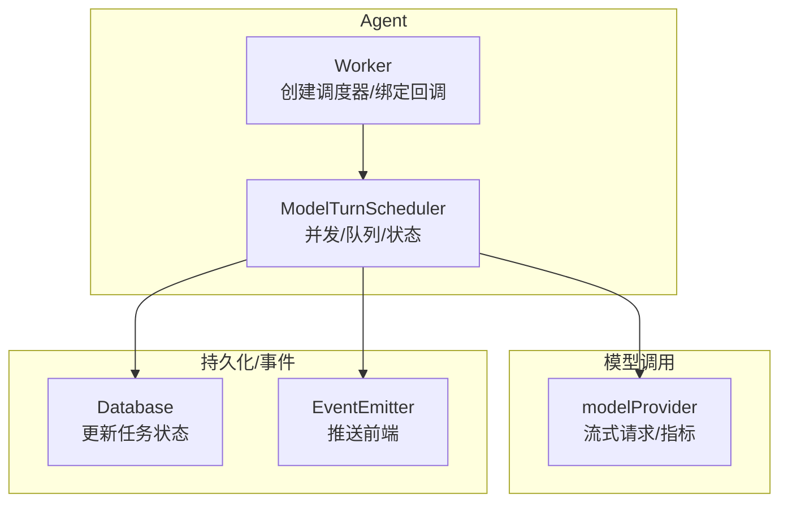
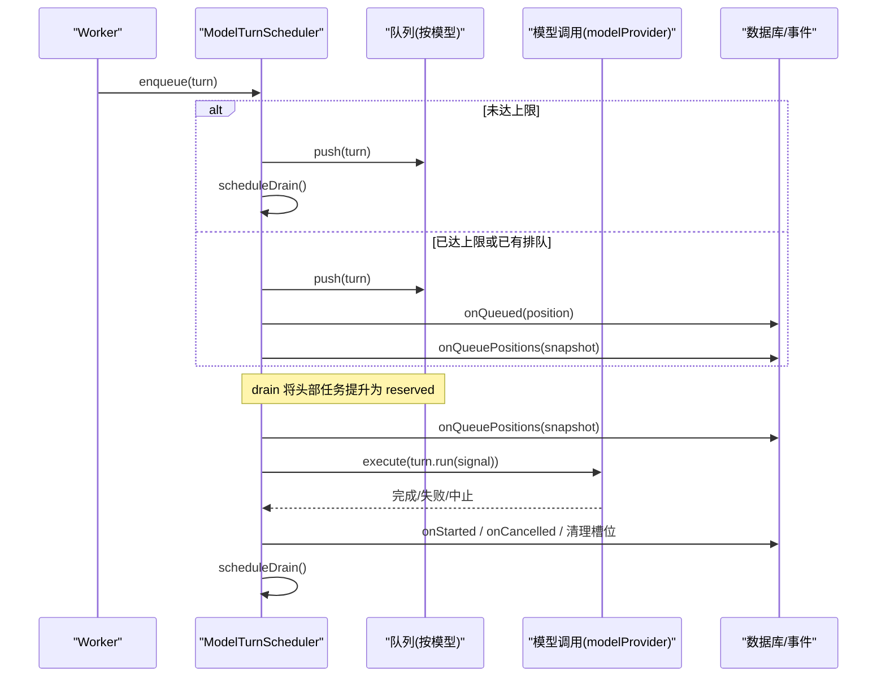
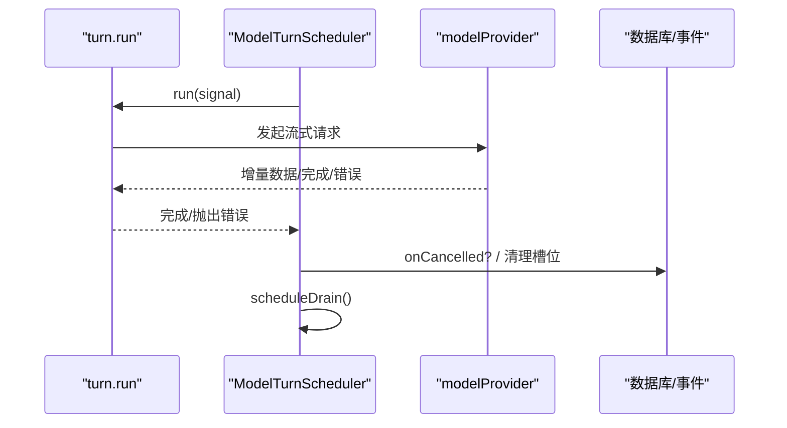
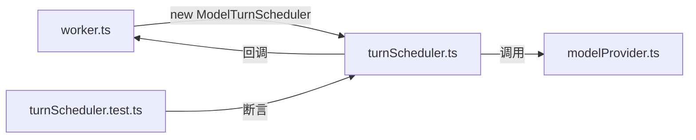

# 任务调度器

<cite>
**本文引用的文件**
- [turnScheduler.ts](file://src/agent/turnScheduler.ts)
- [worker.ts](file://src/agent/worker.ts)
- [turnScheduler.test.ts](file://tests/turnScheduler.test.ts)
- [modelProvider.ts](file://src/agent/modelProvider.ts)
</cite>

## 目录
1. [简介](#简介)
2. [项目结构](#项目结构)
3. [核心组件](#核心组件)
4. [架构总览](#架构总览)
5. [详细组件分析](#详细组件分析)
6. [依赖关系分析](#依赖关系分析)
7. [性能考量](#性能考量)
8. [故障排除指南](#故障排除指南)
9. [结论](#结论)
10. [附录：配置与使用示例路径](#附录：配置与使用示例路径)

## 简介
本文件围绕 ModelTurnScheduler 的任务调度能力，系统性说明其并发控制、队列管理、线程安全、生命周期（入队、执行、取消、状态跟踪）、多模型动态并发限制、优先级与资源分配、队列位置更新与实时状态同步机制。同时提供基于测试用例的配置与回调处理示例路径，以及性能优化建议与故障排查要点。

## 项目结构
调度器位于 agent 层，由 worker 实例化并接入数据库与事件通道；测试覆盖全部关键行为；模型调用通过 modelProvider 完成流式响应与指标收集。

图表来源
- [turnScheduler.ts:32-378](file://src/agent/turnScheduler.ts#L32-L378)
- [worker.ts:174-225](file://src/agent/worker.ts#L174-L225)
- [modelProvider.ts:55-197](file://src/agent/modelProvider.ts#L55-L197)

章节来源
- [turnScheduler.ts:1-378](file://src/agent/turnScheduler.ts#L1-L378)
- [worker.ts:170-369](file://src/agent/worker.ts#L170-L369)
- [modelProvider.ts:55-197](file://src/agent/modelProvider.ts#L55-L197)

## 核心组件
- ScheduledTurn：描述一个可调度任务，包含 turnId、threadId、modelProfileId、title 和 run(signal)。
- SchedulerCallbacks：定义 onQueued、onStarted、onCancelling、onCancelled、onQueuePositions 等回调，用于状态同步与 UI 更新。
- ModelTurnScheduler：实现按模型分队的 FIFO 队列、每模型独立并发上限、预占位与释放、异步操作串行化、回调错误隔离、队列位置快照通知。

章节来源
- [turnScheduler.ts:1-45](file://src/agent/turnScheduler.ts#L1-L45)

## 架构总览
调度器以“每模型独立队列 + 每模型独立并发上限”的方式工作。入队时若未达到上限则立即触发 drain；否则进入队列并通知 onQueued 与 onQueuePositions。drain 将队列头部的任务提升到 reserved（预占位），在通知队列位置后，再根据当前运行数决定是否真正启动。执行完成后释放槽位并再次尝试 drain。取消支持三种场景：运行中 abort、预留阶段取消、队列中移除并回调 onCancelled(false)。

图表来源
- [turnScheduler.ts:47-72](file://src/agent/turnScheduler.ts#L47-L72)
- [turnScheduler.ts:146-200](file://src/agent/turnScheduler.ts#L146-L200)
- [turnScheduler.ts:229-263](file://src/agent/turnScheduler.ts#L229-L263)
- [worker.ts:174-225](file://src/agent/worker.ts#L174-L225)

## 详细组件分析

### 并发控制与线程安全
- 每模型独立并发上限：effectiveLimit 将配置值规范化为至少 1 的整数；slotCount/runningCount 统计当前占用槽位。
- 线程唯一性：activeThreads 记录已入队的 threadId，重复入队同一 threadId 会抛错，避免同一线程并发多个 turn。
- 预占位与防竞态：reserved 集合在 drain 期间暂存即将启动的任务；notifyQueuePositions 后再校验 runningCount 决定是否真正启动，防止在限缩时误启。
- 操作串行化：每个模型维护独立的 modelOperations 队列，processingModels 标记正在处理的模型，确保 drain、位置更新等操作对单模型串行执行，避免并发修改导致不一致。
- 回调错误隔离：invoke/invokeMaybeAsync 捕获并吞掉回调异常，保证不泄漏未处理拒绝且不泄露槽位。

章节来源
- [turnScheduler.ts:137-144](file://src/agent/turnScheduler.ts#L137-L144)
- [turnScheduler.ts:47-52](file://src/agent/turnScheduler.ts#L47-L52)
- [turnScheduler.ts:153-200](file://src/agent/turnScheduler.ts#L153-L200)
- [turnScheduler.ts:299-360](file://src/agent/turnScheduler.ts#L299-L360)
- [turnScheduler.ts:362-376](file://src/agent/turnScheduler.ts#L362-L376)

### 队列管理与优先级
- 每模型独立队列：queues Map<string, ScheduledTurn[]>，按插入顺序 FIFO。
- 入队策略：若队列非空或已达上限则必须排队；否则直接触发 drain。
- 预占位与回退：drain 将头部任务加入 reserved 并 reserveSlot；若后续 runningCount 达到上限，则将任务回退到队列头部（excess），并重新通知位置。
- 取消策略：
  - 运行中：abort 控制器，回调 onCancelling，最终 onCancelled(true)。
  - 预留阶段：从 reserved 移除并释放槽位，回调 onCancelled(false)。
  - 队列中：从队列移除，回调 onCancelled(false)，并触发 drain。

章节来源
- [turnScheduler.ts:47-72](file://src/agent/turnScheduler.ts#L47-L72)
- [turnScheduler.ts:74-113](file://src/agent/turnScheduler.ts#L74-L113)
- [turnScheduler.ts:153-200](file://src/agent/turnScheduler.ts#L153-L200)

### 生命周期管理
- 入队：enqueue 添加至 activeThreads 与对应模型队列，必要时触发 onQueued 与 onQueuePositions。
- 开始：drain 将任务转入 running，回调 onStarted，然后执行 turn.run(signal)。
- 完成/失败：execute 的 finally 安排 finishRunning，清理 running、槽位、activeThreads，并再次 drain。
- 取消：cancel 支持三种状态定位与清理，保证幂等与资源释放。

章节来源
- [turnScheduler.ts:47-72](file://src/agent/turnScheduler.ts#L47-L72)
- [turnScheduler.ts:153-200](file://src/agent/turnScheduler.ts#L153-L200)
- [turnScheduler.ts:229-263](file://src/agent/turnScheduler.ts#L229-L263)
- [turnScheduler.ts:74-113](file://src/agent/turnScheduler.ts#L74-L113)

### 多模型配置的动态并发限制
- 通过 limitFor(modelProfileId) 动态返回每模型上限，worker 中从数据库读取 maxConcurrency。
- updateLimit 仅调度 drain，不会中断已在运行的任务；限缩仅在下次 drain 生效，避免影响进行中任务。
- 限增时，drain 会将队列中等待的任务尽可能提升并启动。

章节来源
- [turnScheduler.ts:115-117](file://src/agent/turnScheduler.ts#L115-L117)
- [turnScheduler.ts:137-144](file://src/agent/turnScheduler.ts#L137-L144)
- [turnScheduler.ts:153-200](file://src/agent/turnScheduler.ts#L153-L200)
- [worker.ts:174-178](file://src/agent/worker.ts#L174-L178)

### 队列位置更新与实时状态同步
- onQueued：当任务因容量不足而排队时，计算其在队列中的位置并回调。
- onQueuePositions：批量通知某模型下所有排队任务的最新位置快照，保证 UI 一致性与确定性。
- 位置快照在 drain 前通知，确保启动前的队列视图准确；限缩时将多余任务回退队列并再次通知。

章节来源
- [turnScheduler.ts:62-71](file://src/agent/turnScheduler.ts#L62-L71)
- [turnScheduler.ts:280-297](file://src/agent/turnScheduler.ts#L280-L297)
- [turnScheduler.ts:176-199](file://src/agent/turnScheduler.ts#L176-L199)
- [worker.ts:179-224](file://src/agent/worker.ts#L179-L224)

### 执行流程时序图

图表来源
- [turnScheduler.ts:229-263](file://src/agent/turnScheduler.ts#L229-L263)
- [modelProvider.ts:55-197](file://src/agent/modelProvider.ts#L55-L197)

## 依赖关系分析
- worker 负责实例化调度器并注入 limitFor 与回调，将调度事件映射到数据库与事件通道。
- 调度器依赖 modelProvider 进行实际的模型调用（通过上层 execute 封装）。
- 测试覆盖并发、取消、限缩/扩容、位置快照、回调错误隔离等边界情况。

图表来源
- [worker.ts:174-225](file://src/agent/worker.ts#L174-L225)
- [turnScheduler.ts:32-378](file://src/agent/turnScheduler.ts#L32-L378)
- [modelProvider.ts:55-197](file://src/agent/modelProvider.ts#L55-L197)
- [turnScheduler.test.ts:1-780](file://tests/turnScheduler.test.ts#L1-L780)

章节来源
- [worker.ts:174-225](file://src/agent/worker.ts#L174-L225)
- [turnScheduler.test.ts:1-780](file://tests/turnScheduler.test.ts#L1-L780)

## 性能考量
- 每模型串行操作：modelOperations 队列确保 drain、位置更新等同模型操作串行，降低锁竞争与状态不一致风险。
- 最小化通知：onQueued 仅在必须排队时触发；onQueuePositions 批量发送快照，减少频繁更新。
- 预占位与回退：reserved 机制避免在限缩窗口内误启任务，减少不必要的启动/取消开销。
- 回调错误隔离：避免回调异常阻塞调度主循环或泄漏槽位。
- 建议
  - 合理设置每模型 maxConcurrency，避免过高导致下游服务拥塞。
  - 将 onQueuePositions 的 UI 更新合并为批处理，降低渲染压力。
  - 对长耗时任务启用超时与重试策略（由上层 modelProvider 控制）。

[本节为通用指导，不直接分析具体文件]

## 故障排除指南
- 现象：同一 threadId 重复入队报错
  - 原因：activeThreads 已存在该线程
  - 处理：确保线程级唯一性，或在完成后再复用
  - 参考路径
    - [turnScheduler.ts:47-52](file://src/agent/turnScheduler.ts#L47-L52)
- 现象：取消无效或重复取消
  - 原因：任务不在 queued/running/cancelling 状态，或已被取消
  - 处理：检查 cancel 返回值与任务状态机
  - 参考路径
    - [turnScheduler.ts:74-113](file://src/agent/turnScheduler.ts#L74-L113)
- 现象：限缩后仍有任务被启动
  - 原因：reserved 到 running 的窗口期需结合 runningCount 判断
  - 处理：确认 drain 逻辑与 notifyQueuePositions 的顺序
  - 参考路径
    - [turnScheduler.ts:153-200](file://src/agent/turnScheduler.ts#L153-L200)
- 现象：UI 位置抖动或不一致
  - 原因：多次 onQueued/onQueuePositions 未及时应用
  - 处理：在回调中缓存 lastQueuePosition，去重更新
  - 参考路径
    - [worker.ts:179-224](file://src/agent/worker.ts#L179-L224)
- 现象：回调异常导致调度卡死
  - 原因：回调未正确捕获异常
  - 处理：使用 invoke/invokeMaybeAsync 包裹回调
  - 参考路径
    - [turnScheduler.ts:362-376](file://src/agent/turnScheduler.ts#L362-L376)

章节来源
- [turnScheduler.ts:47-52](file://src/agent/turnScheduler.ts#L47-L52)
- [turnScheduler.ts:74-113](file://src/agent/turnScheduler.ts#L74-L113)
- [turnScheduler.ts:153-200](file://src/agent/turnScheduler.ts#L153-L200)
- [worker.ts:179-224](file://src/agent/worker.ts#L179-L224)
- [turnScheduler.ts:362-376](file://src/agent/turnScheduler.ts#L362-L376)

## 结论
ModelTurnScheduler 提供了健壮的多模型任务调度能力：按模型独立队列与并发上限、严格的线程唯一性约束、预占位与回退机制、串行化的模型操作队列、完善的取消与状态同步、以及回调错误隔离。配合 worker 的回调绑定与 modelProvider 的流式调用，实现了高可靠、可扩展的任务调度体系。

[本节为总结性内容，不直接分析具体文件]

## 附录：配置与使用示例路径
- 创建调度器并注入 limitFor 与回调
  - [worker.ts:174-225](file://src/agent/worker.ts#L174-L225)
- 入队任务
  - [worker.ts:311-362](file://src/agent/worker.ts#L311-L362)
- 取消任务
  - [worker.ts:364-369](file://src/agent/worker.ts#L364-L369)
- 动态调整并发限制
  - [turnScheduler.ts:115-117](file://src/agent/turnScheduler.ts#L115-L117)
- 回调处理（队列位置、开始、取消）
  - [worker.ts:179-224](file://src/agent/worker.ts#L179-L224)
- 测试用例（FIFO、独立容量、取消、限缩/扩容、位置快照、回调错误隔离）
  - [turnScheduler.test.ts:9-707](file://tests/turnScheduler.test.ts#L9-L707)

章节来源
- [worker.ts:174-225](file://src/agent/worker.ts#L174-L225)
- [worker.ts:311-369](file://src/agent/worker.ts#L311-L369)
- [turnScheduler.ts:115-117](file://src/agent/turnScheduler.ts#L115-L117)
- [turnScheduler.test.ts:9-707](file://tests/turnScheduler.test.ts#L9-L707)