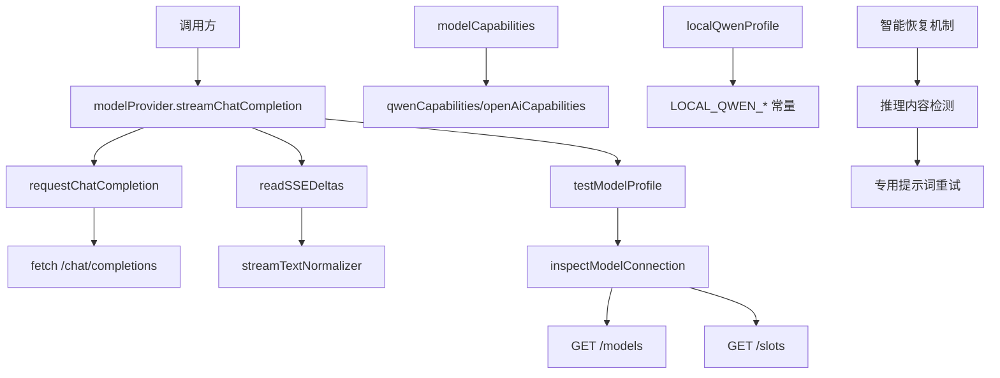
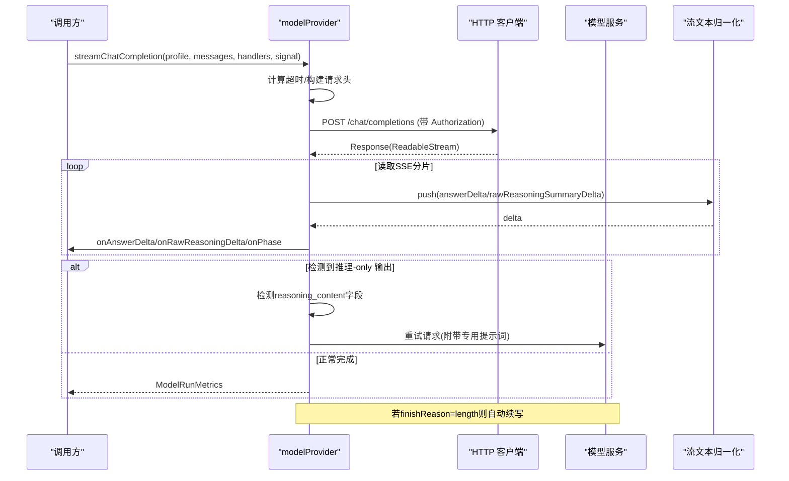
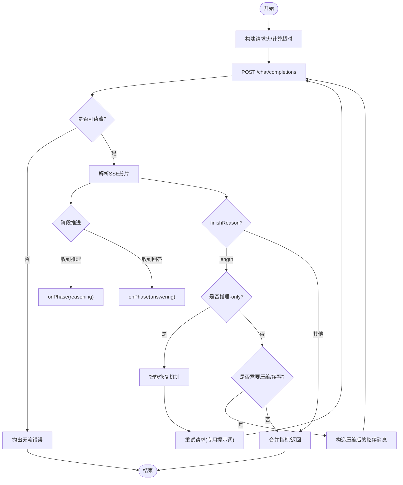
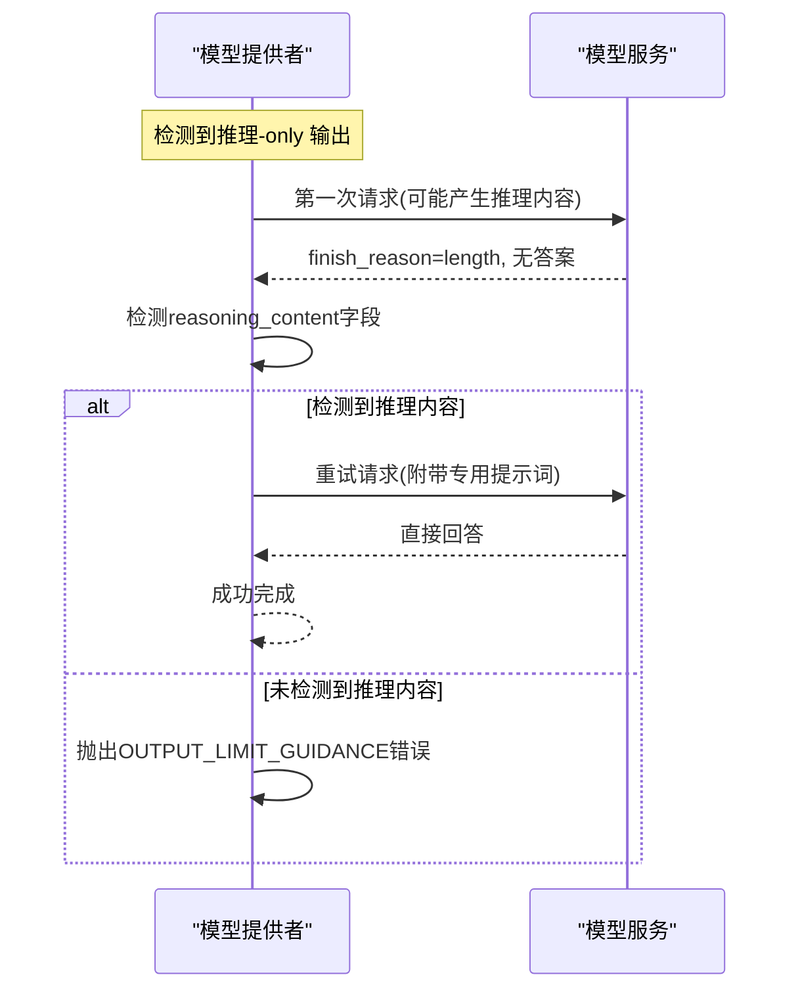
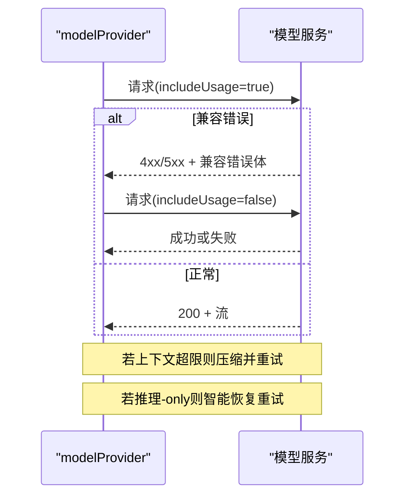
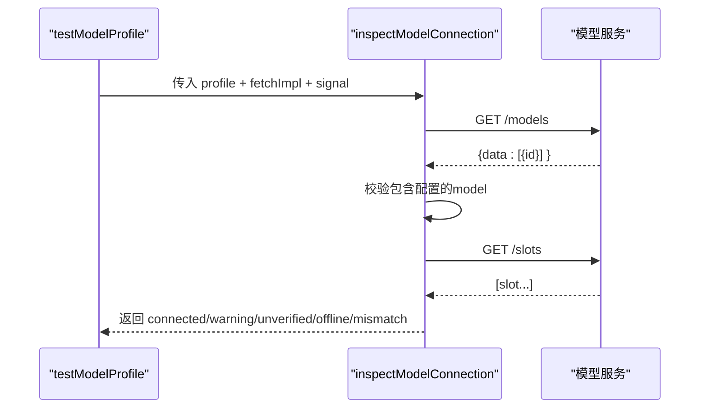
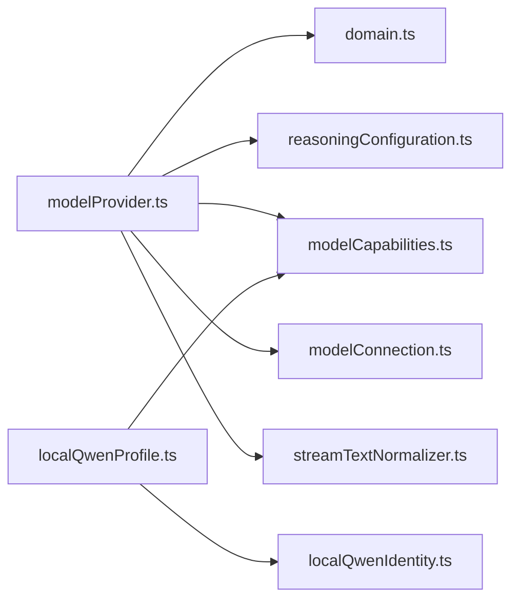

# 模型提供者

<cite>
**本文引用的文件**
- [src/agent/modelProvider.ts](file://src/agent/modelProvider.ts)
- [src/agent/modelCapabilities.ts](file://src/agent/modelCapabilities.ts)
- [src/agent/modelConnection.ts](file://src/agent/modelConnection.ts)
- [src/agent/localQwenProfile.ts](file://src/agent/localQwenProfile.ts)
- [src/shared/domain.ts](file://src/shared/domain.ts)
- [src/shared/localQwenIdentity.ts](file://src/shared/localQwenIdentity.ts)
- [src/shared/modelProfileLimits.ts](file://src/shared/modelProfileLimits.ts)
- [src/shared/reasoningConfiguration.ts](file://src/shared/reasoningConfiguration.ts)
- [src/agent/streamTextNormalizer.ts](file://src/agent/streamTextNormalizer.ts)
- [tests/modelProvider.test.ts](file://tests/modelProvider.test.ts)
- [tests/modelConnection.test.ts](file://tests/modelConnection.test.ts)
</cite>

## 更新摘要
**变更内容**
- 新增智能恢复机制：当检测到推理内容字段（reasoning_content）消耗完整个输出预算但未产生最终答案时，系统自动重试并附加专门提示要求直接回答
- 改进输出限制场景的错误消息：提供更清晰的指导信息
- 增强流式响应处理：支持 reasoning_content 字段的识别和处理
- 优化错误处理策略：区分推理-only 场景和正常续写场景

## 目录
1. [简介](#简介)
2. [项目结构](#项目结构)
3. [核心组件](#核心组件)
4. [架构总览](#架构总览)
5. [详细组件分析](#详细组件分析)
6. [依赖关系分析](#依赖关系分析)
7. [性能考量](#性能考量)
8. [故障排查指南](#故障排查指南)
9. [结论](#结论)
10. [附录：扩展与示例](#附录：扩展与示例)

## 简介
本文件面向"模型提供者"的实现与使用，系统化说明统一模型接口的设计模式，包括流式响应处理、错误重试机制、超时控制、能力检测（视觉支持、推理协议、并发限制）、连接测试流程（认证验证与网络连通性检查），以及本地 Qwen 与 OpenAI 兼容 API 的集成方式。文档同时提供添加新模型提供商、处理流式数据、配置模型参数的实践指引，并总结错误处理策略与性能优化建议。

**最新更新**：模型提供者现已具备智能恢复机制，能够自动处理推理-only 输出耗尽输出预算的情况，通过专门的提示词引导模型直接回答问题。

## 项目结构
围绕模型提供者，代码主要分布在 agent 层与 shared 类型定义中：
- 统一调用入口与流式处理：modelProvider.ts
- 能力声明与归一化：modelCapabilities.ts
- 连接探测与槽位校验：modelConnection.ts
- 本地 Qwen 内置配置：localQwenProfile.ts、localQwenIdentity.ts
- 领域类型与常量：domain.ts、modelProfileLimits.ts、reasoningConfiguration.ts
- 流文本规范化：streamTextNormalizer.ts
- 行为验证用例：tests/modelProvider.test.ts、tests/modelConnection.test.ts

图表来源
- [src/agent/modelProvider.ts:55-197](file://src/agent/modelProvider.ts#L55-L197)
- [src/agent/modelProvider.ts:762-795](file://src/agent/modelProvider.ts#L762-L795)
- [src/agent/modelProvider.ts:563-680](file://src/agent/modelProvider.ts#L563-L680)
- [src/agent/modelConnection.ts:11-91](file://src/agent/modelConnection.ts#L11-L91)
- [src/agent/modelCapabilities.ts:14-43](file://src/agent/modelCapabilities.ts#L14-L43)
- [src/agent/localQwenProfile.ts:13-25](file://src/agent/localQwenProfile.ts#L13-L25)
- [src/shared/localQwenIdentity.ts:3-5](file://src/shared/localQwenIdentity.ts#L3-L5)

章节来源
- [src/agent/modelProvider.ts:55-197](file://src/agent/modelProvider.ts#L55-L197)
- [src/agent/modelConnection.ts:11-91](file://src/agent/modelConnection.ts#L11-L91)
- [src/agent/modelCapabilities.ts:14-43](file://src/agent/modelCapabilities.ts#L14-L43)
- [src/agent/localQwenProfile.ts:13-25](file://src/agent/localQwenProfile.ts#L13-L25)
- [src/shared/localQwenIdentity.ts:3-5](file://src/shared/localQwenIdentity.ts#L3-L5)

## 核心组件
- 统一流式聊天接口：streamChatCompletion
  - 负责构建请求头（含可选 API Key）、计算有效超时、发送请求、解析 SSE 增量、合并指标、上下文压缩与续写、错误映射与脱敏。
  - **新增**：智能恢复机制，检测推理-only 输出并自动重试。
- 连接测试：testModelProfile + inspectModelConnection
  - 通过 GET /models 校验模型标识，GET /slots 校验服务并发槽位，返回结构化连接结果。
- 能力检测：modelCapabilities
  - 提供 qwenCapabilities 与 openAiCapabilities，并对输入进行归一化；支持 reasoning 协议、并发限制、流式与用量字段开关。
- 本地 Qwen 内置配置：localQwenProfile
  - 提供默认名称、provider、baseUrl、model、capabilities、推理设置、并发与输出上限等。
- 领域类型：domain
  - 定义 ModelCapabilities、ModelProfile、ModelConnectionResult、ModelRunMetrics 等核心类型。

章节来源
- [src/agent/modelProvider.ts:55-197](file://src/agent/modelProvider.ts#L55-L197)
- [src/agent/modelProvider.ts:535-561](file://src/agent/modelProvider.ts#L535-L561)
- [src/agent/modelCapabilities.ts:14-43](file://src/agent/modelCapabilities.ts#L14-L43)
- [src/agent/localQwenProfile.ts:13-25](file://src/agent/localQwenProfile.ts#L13-L25)
- [src/shared/domain.ts:130-148](file://src/shared/domain.ts#L130-L148)
- [src/shared/domain.ts:194-236](file://src/shared/domain.ts#L194-L236)
- [src/shared/domain.ts:238-257](file://src/shared/domain.ts#L238-L257)

## 架构总览
下图展示了从调用到模型服务的端到端流程，包括流式分片处理、阶段推进、指标聚合与错误处理，以及新增的智能恢复机制。

图表来源
- [src/agent/modelProvider.ts:55-197](file://src/agent/modelProvider.ts#L55-L197)
- [src/agent/modelProvider.ts:563-680](file://src/agent/modelProvider.ts#L563-L680)
- [src/agent/streamTextNormalizer.ts:8-33](file://src/agent/streamTextNormalizer.ts#L8-L33)

## 详细组件分析

### 统一模型接口与流式响应处理
- 流式解析：readSSEDeltas
  - 基于 ReadableStream 逐行解析 SSE，维护事件 id 去重，识别 [DONE] 结束标记，按阶段触发 onPhase（connecting -> reasoning -> answering）。
  - 使用 createStreamTextNormalizer('incremental') 累积答案与推理摘要，避免重复推送。
  - **新增**：支持 reasoning_content 字段的识别和处理，用于检测推理-only 输出。
- 阶段与指标：
  - 首次 token 时间、完成原因、token 用量、推理观测、服务端速率（若可用）等汇总为 ModelRunMetrics。
- 上下文压缩与续写：
  - 当检测到上下文超限或 provider 在压缩后仍失败时，自动压缩历史并追加续写提示，最多尝试多次压缩级别。
  - 压缩策略对 system/history/user 内容分别分配预算，保留最新用户消息与助手尾部片段。

图表来源
- [src/agent/modelProvider.ts:563-680](file://src/agent/modelProvider.ts#L563-L680)
- [src/agent/modelProvider.ts:209-339](file://src/agent/modelProvider.ts#L209-L339)
- [src/agent/modelProvider.ts:469-484](file://src/agent/modelProvider.ts#L469-L484)

章节来源
- [src/agent/modelProvider.ts:55-197](file://src/agent/modelProvider.ts#L55-L197)
- [src/agent/modelProvider.ts:563-680](file://src/agent/modelProvider.ts#L563-L680)
- [src/agent/modelProvider.ts:209-339](file://src/agent/modelProvider.ts#L209-L339)
- [src/agent/streamTextNormalizer.ts:8-33](file://src/agent/streamTextNormalizer.ts#L8-L33)

### 智能恢复机制与错误处理
**新增功能**：模型提供者现在具备智能恢复机制，专门处理推理-only 输出耗尽输出预算的场景。

- 推理内容检测：
  - 当检测到 finishReason='length' 且没有产生任何答案文本，但存在推理内容（reasoning_content 或 reasoning 字段）时，触发恢复机制。
  - 使用 MAX_REASONING_RECOVERY_ATTEMPTS=1 限制恢复尝试次数，避免无限循环。
- 专用提示词重试：
  - 自动附加 REASONING_RECOVERY_PROMPT 提示词，明确要求模型直接回答问题，最小化推理过程。
  - 提示词内容："A previous attempt used its entire output budget on internal reasoning and never wrote the answer. Answer the latest user request directly and concisely now; keep any reasoning minimal and always finish with the concrete answer."
- 改进的错误消息：
  - OUTPUT_LIMIT_GUIDANCE 提供清晰的指导："Model reached the output-token limit before producing a final answer. Increase the profile output limit or start a new chat."
  - 区分不同错误场景，提供更具体的解决建议。

图表来源
- [src/agent/modelProvider.ts:162-183](file://src/agent/modelProvider.ts#L162-L183)
- [src/agent/modelProvider.ts:55-58](file://src/agent/modelProvider.ts#L55-L58)

章节来源
- [src/agent/modelProvider.ts:55-58](file://src/agent/modelProvider.ts#L55-L58)
- [src/agent/modelProvider.ts:162-183](file://src/agent/modelProvider.ts#L162-L183)
- [src/agent/modelProvider.ts:1049-1056](file://src/agent/modelProvider.ts#L1049-L1056)

### 错误重试机制与超时控制
- 超时控制：
  - 默认运行超时由 per-token 超时与最大输出令牌数推导，上限封顶；连接测试有独立超时。
  - linkedTimeoutSignal 将外部 AbortSignal 与定时器结合，支持 timedOut() 判断与 dispose 清理。
- 重试策略：
  - 针对 usage 兼容性差异，先以 includeUsage=true 发起请求，若返回特定兼容错误，则以 includeUsage=false 重试一次。
  - 上下文超限时自动压缩并重试，最多三次压缩级别；若压缩后仍失败，抛出明确错误。
  - **新增**：推理-only 输出的智能恢复重试，最多一次。
- 错误映射与脱敏：
  - 根据 HTTP 状态码与结构化错误体映射为用户友好错误；对 provider 诊断体进行长度限制与敏感信息脱敏。

图表来源
- [src/agent/modelProvider.ts:762-795](file://src/agent/modelProvider.ts#L762-L795)
- [src/agent/modelProvider.ts:904-922](file://src/agent/modelProvider.ts#L904-L922)
- [src/agent/modelProvider.ts:95-118](file://src/agent/modelProvider.ts#L95-L118)

章节来源
- [src/agent/modelProvider.ts:199-207](file://src/agent/modelProvider.ts#L199-L207)
- [src/agent/modelProvider.ts:720-756](file://src/agent/modelProvider.ts#L720-L756)
- [src/agent/modelProvider.ts:762-795](file://src/agent/modelProvider.ts#L762-L795)
- [src/agent/modelProvider.ts:904-922](file://src/agent/modelProvider.ts#L904-L922)

### 支持的模型类型与集成方式
- OpenAI 兼容 API：
  - 通过 baseUrl + model + 可选 apiKey 接入；能力由 openAiCapabilities 声明（文本、流式、用量、推理 effort 模式等）。
- 本地 Qwen：
  - 通过 localQwenProfile 提供内置配置（provider="openai-compatible"，baseUrl 指向本地服务，model="Qwen3.5-9B"），能力由 qwenCapabilities 声明（支持视觉、流式、推理 raw 模式等）。
  - 通过 isLocalQwenServiceProfile/isBuiltInLocalQwen 可识别内置本地配置。

章节来源
- [src/agent/modelCapabilities.ts:14-43](file://src/agent/modelCapabilities.ts#L14-L43)
- [src/agent/localQwenProfile.ts:13-25](file://src/agent/localQwenProfile.ts#L13-L25)
- [src/shared/localQwenIdentity.ts:3-20](file://src/shared/localQwenIdentity.ts#L3-L20)

### 模型能力检测机制
- 能力声明与归一化：
  - normalizeModelCapabilities 将输入的能力对象标准化，处理 reasoning 协议、concurrency、usage、streaming 等字段。
  - qwenCapabilities 与 openAiCapabilities 分别给出默认能力集。
- 推理协议与配置校验：
  - validateReasoningSelection 校验推理模式与协议匹配性，如 toggle 需 qwen 协议，effort 需 openai 协议等。
- 并发限制：
  - capabilities.concurrency.defaultLimit/maxLimit/configurable 决定默认并发与可调范围；normalizeMaxConcurrency 将用户输入限制在范围内。

章节来源
- [src/agent/modelCapabilities.ts:45-91](file://src/agent/modelCapabilities.ts#L45-L91)
- [src/agent/modelCapabilities.ts:120-148](file://src/agent/modelCapabilities.ts#L120-L148)
- [src/agent/modelCapabilities.ts:106-118](file://src/agent/modelCapabilities.ts#L106-L118)
- [src/shared/reasoningConfiguration.ts:9-18](file://src/shared/reasoningConfiguration.ts#L9-L18)

### 连接测试流程
- testModelProfile：
  - 封装 inspectModelConnection，并提供超时保护；返回结构化结果（connected/concurrency-warning/slots-unverified/offline/model-mismatch）。
- inspectModelConnection：
  - 步骤：
    1) 向 /models 发起请求，校验返回的 data[].id 包含配置的 model。
    2) 向 /slots 发起请求，解析服务槽位数量并与 client.maxConcurrency 比较。
    3) 若不一致返回 concurrency-warning；若无法解析 slots 返回 slots-unverified。
  - 所有网络异常或不可用均返回 offline，且消息不包含敏感信息。

图表来源
- [src/agent/modelProvider.ts:535-561](file://src/agent/modelProvider.ts#L535-L561)
- [src/agent/modelConnection.ts:11-91](file://src/agent/modelConnection.ts#L11-L91)

章节来源
- [src/agent/modelProvider.ts:535-561](file://src/agent/modelProvider.ts#L535-L561)
- [src/agent/modelConnection.ts:11-91](file://src/agent/modelConnection.ts#L11-L91)
- [tests/modelConnection.test.ts:23-75](file://tests/modelConnection.test.ts#L23-L75)

### 流式数据处理细节
- 增量与累计模式：
  - streamTextNormalizer 支持 incremental（仅推送新增片段）与 cumulative（校验前缀一致性并推送差量）。
- 事件去重：
  - readSSEDeltas 使用 Map 记录已见 event id，冲突时抛错，防止重复事件导致 UI 抖动。
- 阶段推进：
  - 首次出现推理相关分片即进入 reasoning 阶段；首次出现回答分片进入 answering 阶段。
- **新增**：reasoning_content 字段支持
  - parseStreamChunk 函数现在支持解析 reasoning_content 字段，作为 reasoning 字段的别名。
  - 优先使用 reasoning_content，回退到 reasoning 字段，确保兼容性。

章节来源
- [src/agent/streamTextNormalizer.ts:8-33](file://src/agent/streamTextNormalizer.ts#L8-L33)
- [src/agent/modelProvider.ts:563-680](file://src/agent/modelProvider.ts#L563-L680)
- [src/agent/modelProvider.ts:872-923](file://src/agent/modelProvider.ts#L872-L923)

## 依赖关系分析
- modelProvider 依赖：
  - domain（类型）、redaction（脱敏）、modelCapabilities（推理校验）、modelConnection（连接测试）、streamTextNormalizer（流文本）。
- modelConnection 依赖：
  - domain（连接结果类型）。
- localQwenProfile 依赖：
  - localQwenIdentity（常量）、modelCapabilities（能力）、domain（输入类型）。
- 测试覆盖：
  - modelProvider.test.ts 覆盖错误脱敏、上下文限制、超时、连接诊断、智能恢复机制等。
  - modelConnection.test.ts 覆盖模型不匹配、槽位不一致、离线、取消传播等。

图表来源
- [src/agent/modelProvider.ts:1-6](file://src/agent/modelProvider.ts#L1-L6)
- [src/agent/modelConnection.ts:1-7](file://src/agent/modelConnection.ts#L1-L7)
- [src/agent/localQwenProfile.ts:1-7](file://src/agent/localQwenProfile.ts#L1-L7)

章节来源
- [src/agent/modelProvider.ts:1-6](file://src/agent/modelProvider.ts#L1-L6)
- [src/agent/modelConnection.ts:1-7](file://src/agent/modelConnection.ts#L1-L7)
- [src/agent/localQwenProfile.ts:1-7](file://src/agent/localQwenProfile.ts#L1-L7)

## 性能考量
- 超时与速率：
  - 默认每 token 超时与最大输出上限共同决定整体超时；服务端若返回 tokensPerSecond，优先采用该值作为速度来源。
- 上下文压缩：
  - 接近上下文阈值时主动压缩历史，减少请求体积，降低失败概率；压缩级别逐步加深，平衡质量与成功率。
- 流式处理：
  - 增量推送减少 UI 渲染压力；事件 id 去重避免重复处理。
- 并发与槽位：
  - 连接测试对比 client.maxConcurrency 与服务 slots，避免过载；必要时调整并发限制。
- **新增**：智能恢复机制的性能影响：
  - 仅在检测到推理-only 输出时触发，避免不必要的额外请求。
  - 限制恢复尝试次数为1次，防止性能退化。

## 故障排查指南
- 常见错误与定位：
  - 上下文超限：提示新建对话或降低历史限制；系统会自动压缩并重试。
  - 认证失败：401/403 会提示检查凭据；错误消息不含敏感信息。
  - 速率限制：429 提示稍后重试。
  - 服务不可用：offline 状态，检查网络与 baseUrl。
  - 模型不匹配：model-mismatch，检查配置的 model 与服务暴露列表。
  - 槽位不一致：concurrency-warning，调整 client.maxConcurrency 或服务端槽位。
  - **新增**：输出限制错误：当出现 OUTPUT_LIMIT_GUIDANCE 错误时，考虑增加 maxOutputTokens 或开始新的对话。
- 调试要点：
  - 使用 testModelProfile 快速验证连通性与槽位。
  - 关注 onPhase 阶段变化，确认推理与回答阶段是否正常推进。
  - 检查 ModelRunMetrics 中的 timeToFirstTokenMs、tokensPerSecond、usageSource 等指标。
  - **新增**：监控 reasoningObserved 字段，了解推理内容的处理情况。

章节来源
- [src/agent/modelProvider.ts:904-922](file://src/agent/modelProvider.ts#L904-L922)
- [src/agent/modelConnection.ts:138-174](file://src/agent/modelConnection.ts#L138-L174)
- [tests/modelProvider.test.ts:45-127](file://tests/modelProvider.test.ts#L45-L127)
- [tests/modelConnection.test.ts:23-170](file://tests/modelConnection.test.ts#L23-L170)

## 结论
本项目通过统一的模型接口抽象了不同后端（OpenAI 兼容 API 与本地 Qwen）的差异，提供了健壮的流式处理、上下文压缩与续写、严格的超时与错误映射、以及完善的连接测试与能力检测。**最新更新**：智能恢复机制进一步增强了对推理-only 输出的处理能力，通过自动检测和重试机制，显著提升了用户体验。借助标准化的能力声明与推理协议校验，系统可在多模型间灵活切换并保持一致的体验。

## 附录：扩展与示例

### 如何添加新的模型提供商
- 步骤概览：
  1) 在调用处使用 streamChatCompletion，传入 RuntimeModelProfile（包含 baseUrl、model、apiKey、capabilities、reasoning、maxConcurrency、maxOutputTokens）。
  2) 若为新协议或自定义推理，确保 capabilities.reasoning 与 reasoningConfiguration 校验通过。
  3) 如需连接测试，调用 testModelProfile，并确保服务实现 /models 与 /slots。
- 参考路径：
  - 统一接口与参数：[src/agent/modelProvider.ts:55-197](file://src/agent/modelProvider.ts#L55-L197)
  - 能力声明与校验：[src/agent/modelCapabilities.ts:45-91](file://src/agent/modelCapabilities.ts#L45-L91)
  - 连接测试：[src/agent/modelProvider.ts:535-561](file://src/agent/modelProvider.ts#L535-L561)、[src/agent/modelConnection.ts:11-91](file://src/agent/modelConnection.ts#L11-L91)

### 如何处理流式数据
- 使用 ModelStreamHandlers 接收增量：
  - onAnswerDelta：回答增量
  - onRawReasoningDelta / onReasoningSummaryDelta：推理增量
  - onPhase：阶段推进（connecting -> reasoning -> answering）
- **新增**：reasoning_content 字段支持
  - 系统现在支持 reasoning_content 字段，作为 reasoning 字段的别名，提供更好的兼容性。
- 参考路径：
  - 流式处理器定义与调用：[src/agent/modelProvider.ts:21-26](file://src/agent/modelProvider.ts#L21-L26)、[src/agent/modelProvider.ts:125-152](file://src/agent/modelProvider.ts#L125-L152)
  - 流文本归一化：[src/agent/streamTextNormalizer.ts:8-33](file://src/agent/streamTextNormalizer.ts#L8-L33)
  - 流块解析：[src/agent/modelProvider.ts:872-923](file://src/agent/modelProvider.ts#L872-L923)

### 如何配置模型参数
- 关键参数：
  - maxOutputTokens：影响默认超时与上下文预算，也影响智能恢复机制的行为。
  - maxConcurrency：客户端并发上限，应与 /slots 对齐。
  - capabilities.reasoning：选择 qwen/openai/custom 协议及输入模式（toggle/effort）。
  - capabilities.usage：是否启用 tokens 与 reasoningTokens。
- 参考路径：
  - 能力归一化与限制：[src/agent/modelCapabilities.ts:45-118](file://src/agent/modelCapabilities.ts#L45-L118)
  - 默认输出上限：[src/shared/modelProfileLimits.ts:1-3](file://src/shared/modelProfileLimits.ts#L1-L3)
  - 推理配置校验：[src/agent/modelCapabilities.ts:120-148](file://src/agent/modelCapabilities.ts#L120-L148)、[src/shared/reasoningConfiguration.ts:9-18](file://src/shared/reasoningConfiguration.ts#L9-L18)

### 错误处理策略与性能优化建议
- 错误处理：
  - 统一映射 HTTP 状态码与结构化错误，屏蔽 provider 诊断体与敏感信息。
  - 上下文超限时自动压缩并重试；压缩后仍失败则明确提示。
  - **新增**：智能恢复机制处理推理-only 输出，提供专门的错误消息和恢复策略。
- 性能优化：
  - 合理设置 maxOutputTokens 与 per-token 超时，避免过长等待。
  - 使用流式增量减少内存与渲染开销。
  - 对齐 client.maxConcurrency 与服务 slots，避免过载。
  - **新增**：智能恢复机制限制为单次重试，避免性能退化。
- 参考路径：
  - 错误映射与脱敏：[src/agent/modelProvider.ts:904-922](file://src/agent/modelProvider.ts#L904-L922)
  - 超时与重试：[src/agent/modelProvider.ts:199-207](file://src/agent/modelProvider.ts#L199-L207)、[src/agent/modelProvider.ts:720-756](file://src/agent/modelProvider.ts#L720-L756)
  - 连接与并发：[src/agent/modelConnection.ts:11-91](file://src/agent/modelConnection.ts#L11-L91)
  - 智能恢复机制：[src/agent/modelProvider.ts:55-58](file://src/agent/modelProvider.ts#L55-L58)、[src/agent/modelProvider.ts:162-183](file://src/agent/modelProvider.ts#L162-L183)

章节来源
- [src/agent/modelProvider.ts:904-922](file://src/agent/modelProvider.ts#L904-L922)
- [src/agent/modelProvider.ts:199-207](file://src/agent/modelProvider.ts#L199-L207)
- [src/agent/modelProvider.ts:720-756](file://src/agent/modelProvider.ts#L720-L756)
- [src/agent/modelConnection.ts:11-91](file://src/agent/modelConnection.ts#L11-L91)
- [src/agent/modelProvider.ts:55-58](file://src/agent/modelProvider.ts#L55-L58)
- [src/agent/modelProvider.ts:162-183](file://src/agent/modelProvider.ts#L162-L183)