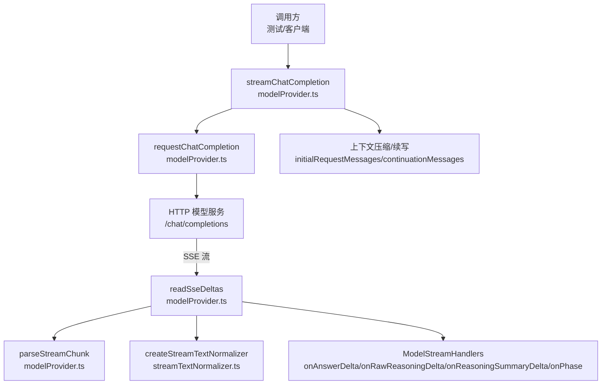
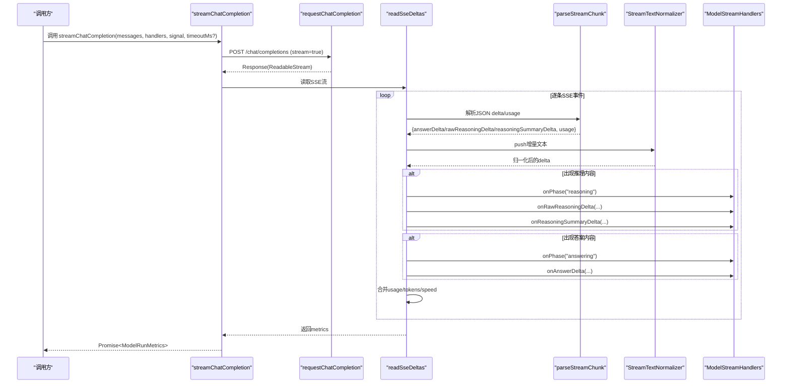
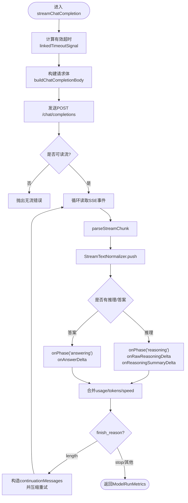
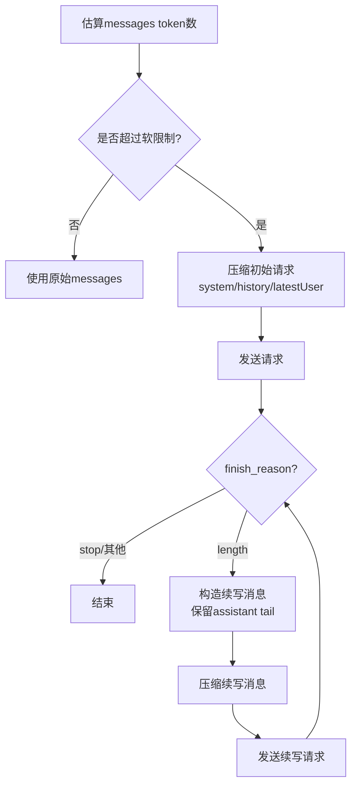
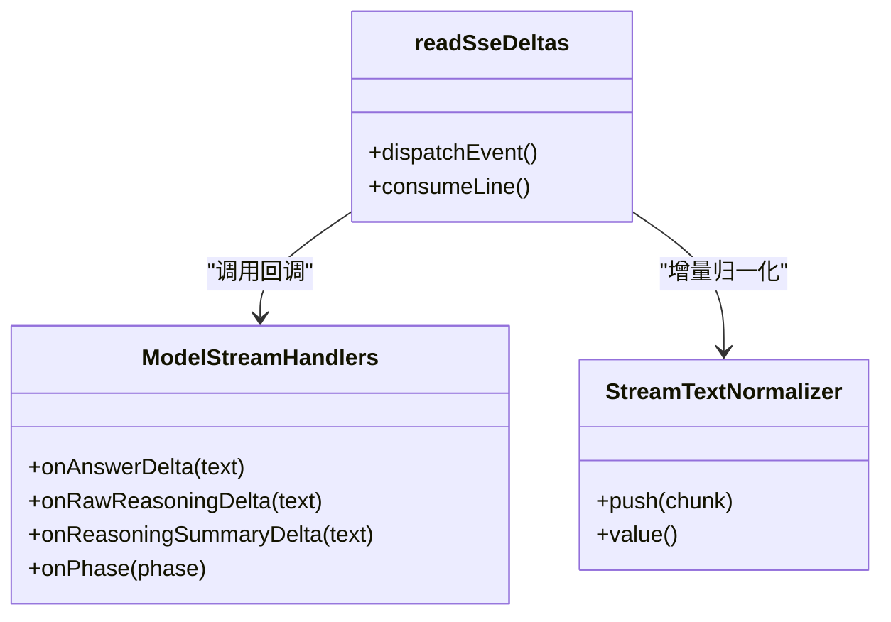
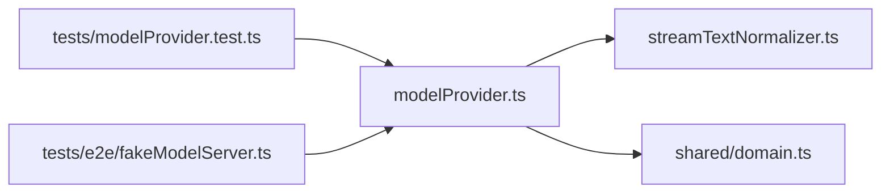

# 统一模型接口

<cite>
**本文引用的文件**
- [src/agent/modelProvider.ts](file://src/agent/modelProvider.ts)
- [src/agent/streamTextNormalizer.ts](file://src/agent/streamTextNormalizer.ts)
- [src/shared/domain.ts](file://src/shared/domain.ts)
- [tests/modelProvider.test.ts](file://tests/modelProvider.test.ts)
- [tests/e2e/fakeModelServer.ts](file://tests/e2e/fakeModelServer.ts)
</cite>

## 目录
1. [简介](#简介)
2. [项目结构](#项目结构)
3. [核心组件](#核心组件)
4. [架构总览](#架构总览)
5. [详细组件分析](#详细组件分析)
6. [依赖关系分析](#依赖关系分析)
7. [性能考量](#性能考量)
8. [故障排查指南](#故障排查指南)
9. [结论](#结论)
10. [附录](#附录)

## 简介
本文件面向“统一模型接口”，聚焦于流式对话能力与上下文压缩策略，系统性说明 streamChatCompletion 的核心实现、流式响应处理机制、错误重试策略、超时控制、以及多模态消息类型设计。同时给出 ModelStreamHandlers 回调机制的调用流程、最佳实践与性能优化建议，帮助读者在工程实践中正确调用并扩展该接口。

## 项目结构
围绕统一模型接口的关键代码集中在 agent 层：
- modelProvider.ts：定义 ChatMessage、ChatContentPart、ModelStreamHandlers 等类型，实现 streamChatCompletion、SSE 解析、请求构建、错误处理、上下文压缩与续写、超时控制等核心逻辑。
- streamTextNormalizer.ts：提供增量/累计文本归一化器，用于对 SSE 增量数据进行去重与拼接。
- shared/domain.ts：定义领域类型（如 MessageItem、TurnAttachment），供上层会话上下文与持久化使用。
- tests/*：覆盖流式行为、SSE 事件去重、超时、续写、压缩等多场景。

图表来源
- [src/agent/modelProvider.ts:55-197](file://src/agent/modelProvider.ts#L55-L197)
- [src/agent/modelProvider.ts:563-680](file://src/agent/modelProvider.ts#L563-L680)
- [src/agent/modelProvider.ts:762-828](file://src/agent/modelProvider.ts#L762-L828)
- [src/agent/streamTextNormalizer.ts:1-34](file://src/agent/streamTextNormalizer.ts#L1-L34)

章节来源
- [src/agent/modelProvider.ts:55-197](file://src/agent/modelProvider.ts#L55-L197)
- [src/agent/modelProvider.ts:563-680](file://src/agent/modelProvider.ts#L563-L680)
- [src/agent/modelProvider.ts:762-828](file://src/agent/modelProvider.ts#L762-L828)
- [src/agent/streamTextNormalizer.ts:1-34](file://src/agent/streamTextNormalizer.ts#L1-L34)

## 核心组件
- 流式对话入口：streamChatCompletion(profile, messages, handlers, signal, fetchImpl?, nowMs?, timeoutMs?)
- 流式处理器：ModelStreamHandlers.onAnswerDelta / onRawReasoningDelta / onReasoningSummaryDelta / onPhase
- 数据模型：ChatMessage（role + content）、ChatContentPart（text 或 image_url）
- 流解析与归一化：readSseDeltas + parseStreamChunk + createStreamTextNormalizer
- 上下文压缩与续写：initialRequestMessages / compressedInitialRequestMessages / continuationMessages / compressedContinuationMessages
- 超时控制：linkedTimeoutSignal + defaultModelRunTimeoutMs（BASE_MODEL_RUN_TIMEOUT_MS / MAX_MODEL_RUN_TIMEOUT_MS）
- 错误处理与重试：兼容 stream_options.include_usage 的重试、上下文超限自动压缩、压缩后仍失败抛出明确错误

章节来源
- [src/agent/modelProvider.ts:8-26](file://src/agent/modelProvider.ts#L8-L26)
- [src/agent/modelProvider.ts:55-197](file://src/agent/modelProvider.ts#L55-L197)
- [src/agent/modelProvider.ts:209-339](file://src/agent/modelProvider.ts#L209-L339)
- [src/agent/modelProvider.ts:563-680](file://src/agent/modelProvider.ts#L563-L680)
- [src/agent/modelProvider.ts:720-756](file://src/agent/modelProvider.ts#L720-L756)
- [src/agent/modelProvider.ts:797-828](file://src/agent/modelProvider.ts#L797-L828)
- [src/agent/modelProvider.ts:847-898](file://src/agent/modelProvider.ts#L847-L898)
- [src/agent/modelProvider.ts:900-1008](file://src/agent/modelProvider.ts#L900-L1008)

## 架构总览
下图展示一次流式对话从发起请求到接收增量数据的完整时序，包括阶段切换、增量归一化、指标聚合与最终完成。

图表来源
- [src/agent/modelProvider.ts:55-197](file://src/agent/modelProvider.ts#L55-L197)
- [src/agent/modelProvider.ts:563-680](file://src/agent/modelProvider.ts#L563-L680)
- [src/agent/modelProvider.ts:762-828](file://src/agent/modelProvider.ts#L762-L828)
- [src/agent/modelProvider.ts:847-898](file://src/agent/modelProvider.ts#L847-L898)

## 详细组件分析

### streamChatCompletion 核心实现
- 超时控制：通过 linkedTimeoutSignal 将外部 AbortSignal 与内置超时绑定；默认超时由 defaultModelRunTimeoutMs 计算，基于 per-token 预算与配置上限。
- 请求构建：buildChatCompletionBody 根据 profile.capabilities.reasoning.inputMode 注入 reasoning 相关参数，并设置 max_tokens。
- 流式读取：readSseDeltas 负责按行解析 SSE，维护 eventId 去重，累积 answer/rawReasoning/reasoningSummary 三段独立文本流，并通过 createStreamTextNormalizer('incremental') 做增量归一化。
- 阶段切换：当首次收到推理内容时切换到 'reasoning'，首次收到答案内容时切换到 'answering'，通过 onPhase 通知调用方。
- 指标聚合：合并 usage、tokens、serverTokensPerSecond，并在结束时计算 tokensPerSecond、speedSource、usageSource。
- 上下文压缩与续写：若遇到上下文超限或输出 token 耗尽，自动构造 continuationMessages 并带 forceCompress 进行压缩重试，最多支持多次压缩级别递增。

图表来源
- [src/agent/modelProvider.ts:55-197](file://src/agent/modelProvider.ts#L55-L197)
- [src/agent/modelProvider.ts:563-680](file://src/agent/modelProvider.ts#L563-L680)
- [src/agent/modelProvider.ts:797-828](file://src/agent/modelProvider.ts#L797-L828)
- [src/agent/modelProvider.ts:847-898](file://src/agent/modelProvider.ts#L847-L898)

章节来源
- [src/agent/modelProvider.ts:55-197](file://src/agent/modelProvider.ts#L55-L197)
- [src/agent/modelProvider.ts:563-680](file://src/agent/modelProvider.ts#L563-L680)
- [src/agent/modelProvider.ts:797-828](file://src/agent/modelProvider.ts#L797-L828)
- [src/agent/modelProvider.ts:847-898](file://src/agent/modelProvider.ts#L847-L898)

### 流式响应处理机制
- SSE 解析：readSseDeltas 以行为单位缓冲，识别 data/id 字段，空行触发 dispatchEvent；[DONE] 表示结束。
- 事件去重：基于 id 字段记录已见事件，冲突则抛错，避免重复处理。
- 增量归一化：为 answer、rawReasoning、reasoningSummary 分别创建独立的 StreamTextNormalizer('incremental')，保证各通道状态隔离，且能正确处理字节切分导致的重复/重叠片段。
- 阶段管理：首次出现推理内容即 onPhase('reasoning')，首次出现答案内容即 onPhase('answering')。
- 指标更新：每次 chunk 可能携带 usage/timings，合并到 streamedMetrics，最终汇总为 ModelRunMetrics。

章节来源
- [src/agent/modelProvider.ts:563-680](file://src/agent/modelProvider.ts#L563-L680)
- [src/agent/streamTextNormalizer.ts:1-34](file://src/agent/streamTextNormalizer.ts#L1-L34)
- [src/agent/modelProvider.ts:847-898](file://src/agent/modelProvider.ts#L847-L898)

### 错误重试策略
- 兼容性重试：若首次请求包含 stream_options.include_usage 且返回特定 400/422 错误，会移除该选项并重试一次。
- 上下文超限：当检测到上下文超限错误时，自动启用上下文压缩，构造压缩后的 initialRequestMessages 或 continuationMessages 并继续重试，最多支持多级压缩。
- 压缩后仍失败：如果已经压缩的请求仍然返回 500，抛出明确错误提示“在服务端处理压缩上下文时失败”。
- 终止条件：若 finishReason 为 length 且本轮未产生新答案，直接报错，防止无限续写。

章节来源
- [src/agent/modelProvider.ts:762-795](file://src/agent/modelProvider.ts#L762-L795)
- [src/agent/modelProvider.ts:95-119](file://src/agent/modelProvider.ts#L95-L119)
- [src/agent/modelProvider.ts:153-162](file://src/agent/modelProvider.ts#L153-L162)
- [src/agent/modelProvider.ts:900-1008](file://src/agent/modelProvider.ts#L900-L1008)

### 上下文压缩算法
- 软限制估算：contextCompressionSoftLimit 基于模型上下文窗口与预留输出空间计算可用输入窗口，再乘以阈值得到软限制。
- 初始请求压缩：compressedInitialRequestMessages 将 system、history、latestUser 分段分配预算，生成历史摘要与最新用户消息压缩版，并插入本地压缩提示。
- 续写压缩：compressedContinuationMessages 保留最近助手回答尾部（tail），并对历史与系统消息进行压缩，附带续写指令。
- 文本压缩：compactMiddle 保留首尾片段并用标记替换中间部分；compactLatestUserContent 对多模态内容中的图片保持原样，仅压缩文本部分。
- 估计开销：estimateContentTokens 对字符串与多模态内容分别估算 token 数，图片按固定预算计入。

图表来源
- [src/agent/modelProvider.ts:209-339](file://src/agent/modelProvider.ts#L209-L339)
- [src/agent/modelProvider.ts:334-372](file://src/agent/modelProvider.ts#L334-L372)
- [src/agent/modelProvider.ts:374-467](file://src/agent/modelProvider.ts#L374-L467)

章节来源
- [src/agent/modelProvider.ts:209-339](file://src/agent/modelProvider.ts#L209-L339)
- [src/agent/modelProvider.ts:334-372](file://src/agent/modelProvider.ts#L334-L372)
- [src/agent/modelProvider.ts:374-467](file://src/agent/modelProvider.ts#L374-L467)

### ChatMessage 与 ChatContentPart 类型设计
- ChatMessage：包含 role（system/user/assistant）与 content。content 可为字符串或多模态数组。
- ChatContentPart：支持 text 与 image_url 两种类型，便于承载图片附件。
- 多模态压缩：压缩时对图片部分保留原样，仅压缩文本内容，确保图片信息不丢失。

章节来源
- [src/agent/modelProvider.ts:8-17](file://src/agent/modelProvider.ts#L8-L17)
- [src/agent/modelProvider.ts:431-467](file://src/agent/modelProvider.ts#L431-L467)
- [src/shared/domain.ts:43-49](file://src/shared/domain.ts#L43-L49)

### ModelStreamHandlers 回调机制
- onAnswerDelta：接收答案增量文本，配合 onPhase('answering') 标识开始产出答案。
- onRawReasoningDelta：接收原始推理增量文本，配合 onPhase('reasoning') 标识推理阶段。
- onReasoningSummaryDelta：接收推理摘要增量文本，同样在推理阶段触发。
- onPhase：用于通知当前运行阶段（connecting/reasoning/answering/compressing），便于 UI 或上层逻辑切换显示状态。
- 调用顺序：每个增量先经 StreamTextNormalizer 归一化，再触发对应 handler；阶段切换仅在首次出现相应内容时触发。

图表来源
- [src/agent/modelProvider.ts:21-26](file://src/agent/modelProvider.ts#L21-L26)
- [src/agent/modelProvider.ts:563-680](file://src/agent/modelProvider.ts#L563-L680)
- [src/agent/streamTextNormalizer.ts:1-34](file://src/agent/streamTextNormalizer.ts#L1-L34)

章节来源
- [src/agent/modelProvider.ts:21-26](file://src/agent/modelProvider.ts#L21-L26)
- [src/agent/modelProvider.ts:563-680](file://src/agent/modelProvider.ts#L563-L680)

### 超时控制机制
- BASE_MODEL_RUN_TIMEOUT_MS：基础超时阈值，防止过短超时导致误判。
- MAX_MODEL_RUN_TIMEOUT_MS：最大超时阈值，防止过长等待。
- defaultModelRunTimeoutMs：根据 profile.maxOutputTokens 与 per-token 预算（区分是否启用推理）计算合理超时，并夹在 BASE/MAX 之间。
- linkedTimeoutSignal：将外部 AbortSignal 与内置定时器结合，支持外部取消与内部超时双重控制。

章节来源
- [src/agent/modelProvider.ts:40-43](file://src/agent/modelProvider.ts#L40-L43)
- [src/agent/modelProvider.ts:199-207](file://src/agent/modelProvider.ts#L199-L207)
- [src/agent/modelProvider.ts:720-756](file://src/agent/modelProvider.ts#L720-L756)

### 调用示例与最佳实践
- 流式对话调用：传入 profile、messages、handlers、AbortController.signal，可选 nowMs 与 timeoutMs。
- 处理增量数据：在 onAnswerDelta/onRawReasoningDelta/onReasoningSummaryDelta 中追加文本，UI 实时渲染；利用 onPhase 切换显示区域。
- 自定义超时：通过 timeoutMs 覆盖默认超时；注意与模型输出长度匹配，避免过早中断。
- 多模态消息：content 可传字符串或包含 image_url 的数组；压缩时图片不被截断。
- 错误处理：捕获超时、中止、服务端错误；关注 finishReason 与 metrics 中的 usage 字段。

章节来源
- [tests/modelProvider.test.ts:841-877](file://tests/modelProvider.test.ts#L841-L877)
- [tests/modelProvider.test.ts:955-986](file://tests/modelProvider.test.ts#L955-L986)
- [tests/e2e/fakeModelServer.ts:75-109](file://tests/e2e/fakeModelServer.ts#L75-L109)

## 依赖关系分析
- modelProvider.ts 依赖 streamTextNormalizer.ts 进行增量文本归一化。
- modelProvider.ts 依赖 shared/domain.ts 的类型（如 MetricSource、ModelRunPhase）。
- 测试用例通过 fakeModelServer 模拟 SSE 流，验证流式行为与事件去重。

图表来源
- [src/agent/modelProvider.ts:1-6](file://src/agent/modelProvider.ts#L1-L6)
- [src/agent/streamTextNormalizer.ts:1-34](file://src/agent/streamTextNormalizer.ts#L1-L34)
- [src/shared/domain.ts:1-60](file://src/shared/domain.ts#L1-L60)
- [tests/modelProvider.test.ts:841-986](file://tests/modelProvider.test.ts#L841-L986)
- [tests/e2e/fakeModelServer.ts:75-109](file://tests/e2e/fakeModelServer.ts#L75-L109)

章节来源
- [src/agent/modelProvider.ts:1-6](file://src/agent/modelProvider.ts#L1-L6)
- [src/agent/streamTextNormalizer.ts:1-34](file://src/agent/streamTextNormalizer.ts#L1-L34)
- [src/shared/domain.ts:1-60](file://src/shared/domain.ts#L1-L60)
- [tests/modelProvider.test.ts:841-986](file://tests/modelProvider.test.ts#L841-L986)
- [tests/e2e/fakeModelServer.ts:75-109](file://tests/e2e/fakeModelServer.ts#L75-L109)

## 性能考量
- 增量归一化：使用 StreamTextNormalizer('incremental') 避免重复推送，降低 UI 渲染压力。
- SSE 事件去重：基于 id 字段去重，减少重复处理开销。
- 上下文压缩：在接近上下文限制时主动压缩历史，减少请求体积，提高成功率。
- 指标统计：合并 serverTokensPerSecond 与客户端估算，提供更准确的速率评估。
- 超时策略：per-token 预算与上下限结合，避免过短或过长等待。

## 故障排查指南
- 超时错误：检查 effectiveTimeoutMs 与模型输出长度是否匹配；确认 AbortController.signal 未被提前中止。
- 无流响应：确认服务端返回了可读流；否则抛出“无流”错误。
- 上下文超限：观察是否触发了压缩与续写；必要时调整 history limit 或 maxOutputTokens。
- 压缩后仍失败：若压缩请求仍返回 500，需检查服务端处理能力或进一步缩短上下文。
- 流结束无答案：若 finishReason 为 length 且无答案，需提升输出限制或开启新对话。

章节来源
- [src/agent/modelProvider.ts:188-196](file://src/agent/modelProvider.ts#L188-L196)
- [src/agent/modelProvider.ts:121-123](file://src/agent/modelProvider.ts#L121-L123)
- [src/agent/modelProvider.ts:153-162](file://src/agent/modelProvider.ts#L153-L162)
- [src/agent/modelProvider.ts:1024-1033](file://src/agent/modelProvider.ts#L1024-L1033)

## 结论
统一模型接口通过 streamChatCompletion 提供了健壮的流式对话能力，具备完善的增量归一化、阶段切换、上下文压缩与续写、超时控制与错误重试机制。其类型设计支持多模态消息，回调机制清晰，便于上层应用灵活集成。遵循本文的最佳实践与性能建议，可在复杂网络与服务端环境下获得稳定高效的体验。

## 附录
- 参考测试用例：验证流式分离、事件去重、零长度增量忽略、续写与压缩等行为。
- 参考服务端模拟：fakeModelServer 构造 SSE 流，便于端到端测试。

章节来源
- [tests/modelProvider.test.ts:841-986](file://tests/modelProvider.test.ts#L841-L986)
- [tests/e2e/fakeModelServer.ts:75-109](file://tests/e2e/fakeModelServer.ts#L75-L109)