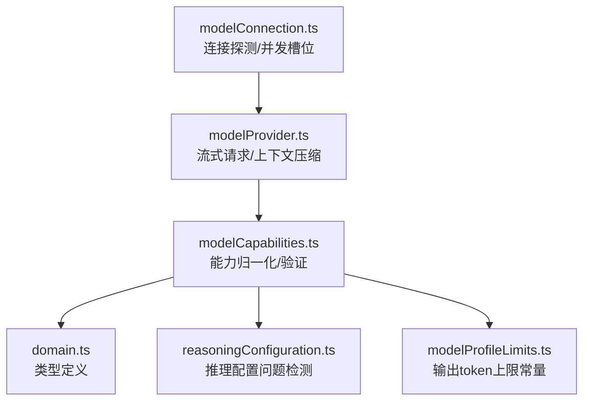
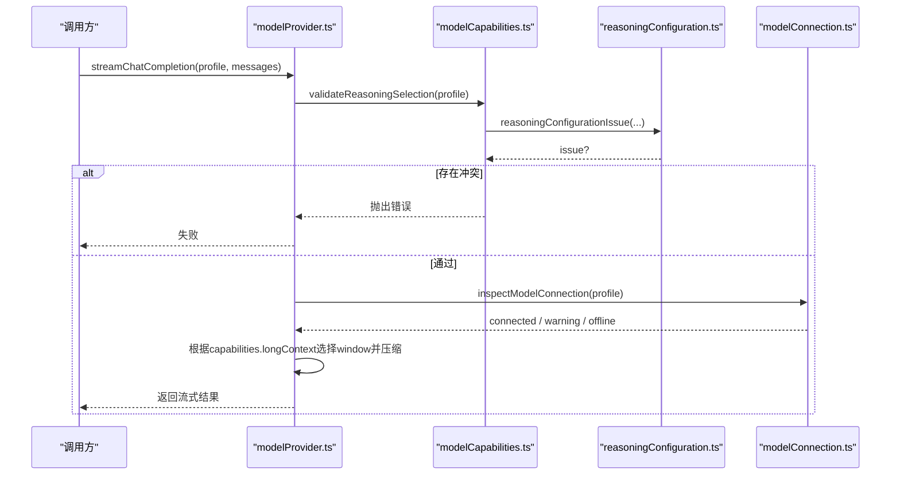
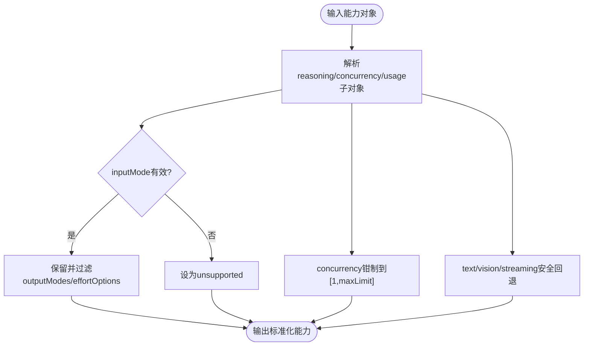
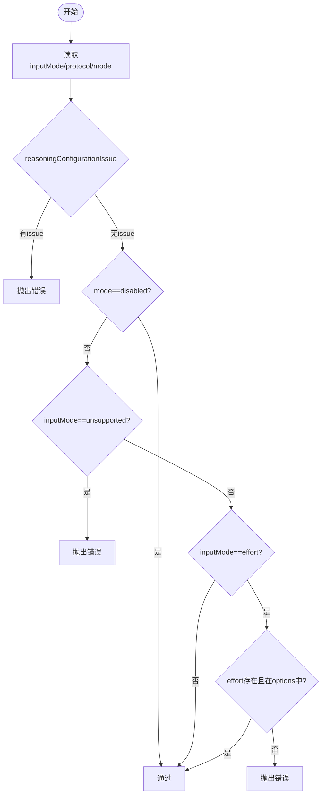
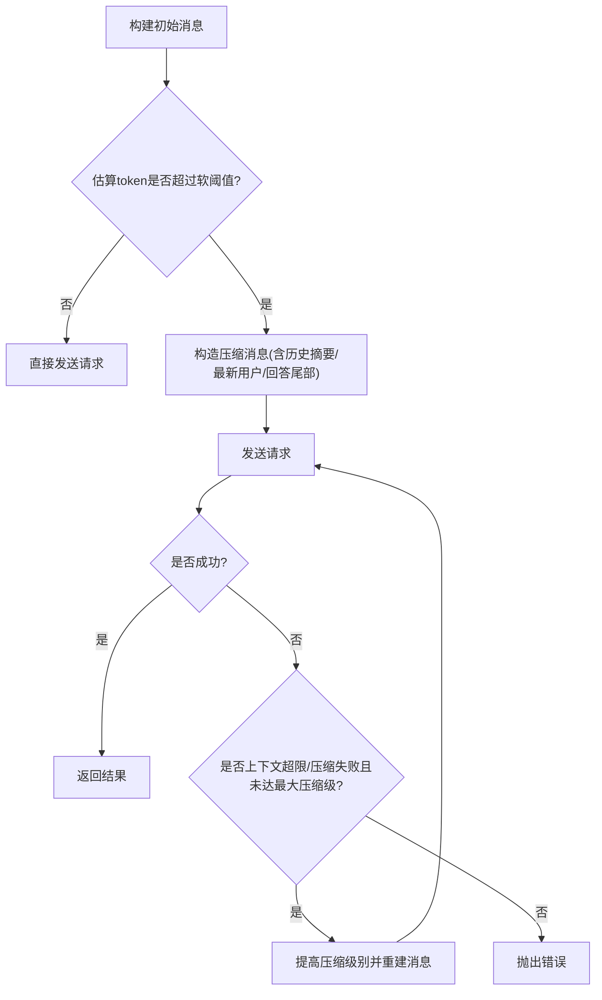
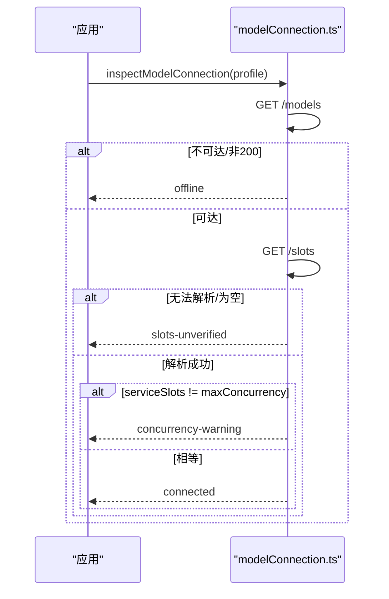
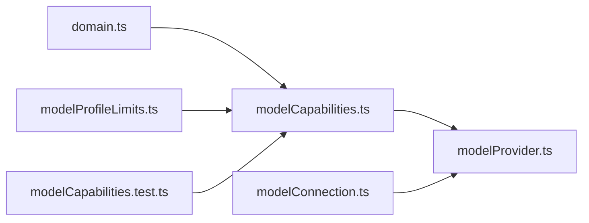

# 能力检测

<cite>
**本文引用的文件**
- [src/agent/modelCapabilities.ts](file://src/agent/modelCapabilities.ts)
- [src/shared/reasoningConfiguration.ts](file://src/shared/reasoningConfiguration.ts)
- [src/shared/domain.ts](file://src/shared/domain.ts)
- [src/shared/modelProfileLimits.ts](file://src/shared/modelProfileLimits.ts)
- [src/agent/modelProvider.ts](file://src/agent/modelProvider.ts)
- [src/agent/modelConnection.ts](file://src/agent/modelConnection.ts)
- [tests/modelCapabilities.test.ts](file://tests/modelCapabilities.test.ts)
</cite>

## 目录
1. [简介](#简介)
2. [项目结构](#项目结构)
3. [核心组件](#核心组件)
4. [架构总览](#架构总览)
5. [详细组件分析](#详细组件分析)
6. [依赖关系分析](#依赖关系分析)
7. [性能考虑](#性能考虑)
8. [故障排查指南](#故障排查指南)
9. [结论](#结论)
10. [附录：示例与最佳实践](#附录示例与最佳实践)

## 简介
本文件围绕“模型能力检测”展开，系统性说明以下主题：
- 模型能力声明机制：文本、视觉、长上下文、推理协议、并发限制等。
- validateReasoningSelection 的验证逻辑：确保配置与能力匹配。
- 长上下文支持检测：context window 大小与压缩策略选择。
- 不同模型类型特性识别：文本生成、图像理解、多模态处理。
- 具体代码示例路径：如何检测能力、开关能力、处理不兼容。
- 能力检测的性能考虑与缓存策略。

## 项目结构
与能力检测直接相关的模块分布如下：
- 能力定义与归一化：src/agent/modelCapabilities.ts
- 推理配置校验：src/shared/reasoningConfiguration.ts
- 领域类型与常量：src/shared/domain.ts、src/shared/modelProfileLimits.ts
- 运行时调用与上下文压缩：src/agent/modelProvider.ts
- 连接探测与并发槽位校验：src/agent/modelConnection.ts
- 能力相关测试用例：tests/modelCapabilities.test.ts

图表来源
- [src/agent/modelCapabilities.ts:1-207](file://src/agent/modelCapabilities.ts#L1-L207)
- [src/shared/domain.ts:130-148](file://src/shared/domain.ts#L130-L148)
- [src/shared/reasoningConfiguration.ts:1-19](file://src/shared/reasoningConfiguration.ts#L1-L19)
- [src/shared/modelProfileLimits.ts:1-3](file://src/shared/modelProfileLimits.ts#L1-L3)
- [src/agent/modelProvider.ts:40-53](file://src/agent/modelProvider.ts#L40-L53)
- [src/agent/modelConnection.ts:11-91](file://src/agent/modelConnection.ts#L11-L91)

章节来源
- [src/agent/modelCapabilities.ts:1-207](file://src/agent/modelCapabilities.ts#L1-L207)
- [src/shared/domain.ts:130-148](file://src/shared/domain.ts#L130-L148)
- [src/shared/reasoningConfiguration.ts:1-19](file://src/shared/reasoningConfiguration.ts#L1-L19)
- [src/shared/modelProfileLimits.ts:1-3](file://src/shared/modelProfileLimits.ts#L1-L3)
- [src/agent/modelProvider.ts:40-53](file://src/agent/modelProvider.ts#L40-L53)
- [src/agent/modelConnection.ts:11-91](file://src/agent/modelConnection.ts#L11-L91)

## 核心组件
- 能力声明与归一化
  - qwenCapabilities/openAiCapabilities：提供预设能力模板（文本、视觉、长上下文、推理输入模式、并发、流式、用量）。
  - normalizeModelCapabilities/normalizeProfileCapabilities：将任意输入规范化为统一的能力结构，兼容旧字段（如 streamingUsage）并合并已有能力。
  - normalizeReasoningSettings：将用户选择的推理设置归一化为受控值。
  - normalizeMaxConcurrency/normalizeMaxOutputTokens：对并发和输出token进行边界约束。
- 推理配置校验
  - reasoningConfigurationIssue：根据 inputMode、protocol、mode 组合判断是否允许启用推理。
  - validateReasoningSelection：在运行前校验 profile 中的 capabilities 与 reasoning 配置是否一致，包括 effort 选项合法性。
- 长上下文与压缩
  - modelProvider 中基于 capabilities.longContext 选择 context window，并据此计算软阈值，触发本地压缩。
- 连接与并发
  - modelConnection.inspectModelConnection：探测模型服务可用性、模型标识一致性，以及服务并发槽位是否与客户端配置一致。

章节来源
- [src/agent/modelCapabilities.ts:14-118](file://src/agent/modelCapabilities.ts#L14-L118)
- [src/agent/modelCapabilities.ts:120-148](file://src/agent/modelCapabilities.ts#L120-L148)
- [src/shared/reasoningConfiguration.ts:9-18](file://src/shared/reasoningConfiguration.ts#L9-L18)
- [src/agent/modelProvider.ts:40-53](file://src/agent/modelProvider.ts#L40-L53)
- [src/agent/modelProvider.ts:334-339](file://src/agent/modelProvider.ts#L334-L339)
- [src/agent/modelConnection.ts:11-91](file://src/agent/modelConnection.ts#L11-L91)

## 架构总览
能力检测贯穿“配置归一化 → 运行前校验 → 运行时自适应”的链路：
- 配置阶段：通过 normalizeModelCapabilities/normalizeProfileCapabilities 将外部配置标准化；通过 normalizeReasoningSettings 规范推理设置。
- 校验阶段：streamChatCompletion 入口调用 validateReasoningSelection，阻止不合法配置进入运行。
- 运行阶段：modelProvider 依据 capabilities.longContext 决定使用默认或长上下文窗口，并在接近容量时执行本地压缩；modelConnection 在连接阶段校验并发槽位。

图表来源
- [src/agent/modelProvider.ts:55-65](file://src/agent/modelProvider.ts#L55-L65)
- [src/agent/modelCapabilities.ts:120-148](file://src/agent/modelCapabilities.ts#L120-L148)
- [src/shared/reasoningConfiguration.ts:9-18](file://src/shared/reasoningConfiguration.ts#L9-L18)
- [src/agent/modelConnection.ts:11-91](file://src/agent/modelConnection.ts#L11-L91)

## 详细组件分析

### 能力声明与归一化
- 预设能力
  - Qwen：开启文本与视觉，关闭长上下文，推理输入模式为 toggle，并发可配置，支持流式与用量统计。
  - OpenAI：文本开启，视觉关闭，推理输入模式取决于 effortOptions 是否存在，支持流式与用量统计。
- 归一化规则
  - 布尔字段采用安全回退（如 text/vision/streaming）。
  - 并发限制被钳制到 [1, maxLimit]。
  - 输出 token 上限被钳制到全局最大值。
  - 推理能力按 inputMode 分类：toggle/effort/custom/unsupported，并过滤无效 outputModes。
- 合并策略
  - normalizeProfileCapabilities 将“已有能力 + 新输入”合并后再归一化，避免覆盖无关字段。

图表来源
- [src/agent/modelCapabilities.ts:45-118](file://src/agent/modelCapabilities.ts#L45-L118)
- [src/shared/modelProfileLimits.ts:1-3](file://src/shared/modelProfileLimits.ts#L1-L3)

章节来源
- [src/agent/modelCapabilities.ts:14-118](file://src/agent/modelCapabilities.ts#L14-L118)
- [src/shared/modelProfileLimits.ts:1-3](file://src/shared/modelProfileLimits.ts#L1-L3)

### 推理协议与 validateReasoningSelection
- 协议与输入模式绑定
  - toggle 需要 qwen 协议。
  - effort 需要 openai 协议。
  - custom 需配合自定义请求体。
  - unsupported 且 mode 非 disabled 则报错。
- 校验流程
  - 先调用 reasoningConfigurationIssue 做基础检查。
  - 若 mode 为 disabled 则直接通过。
  - 若 inputMode 为 unsupported 则报错。
  - 若 inputMode 为 effort，则要求 effort 非空且在 effortOptions 中。
- 错误信息
  - 针对不同 issue 给出明确提示，便于定位配置错误。

图表来源
- [src/agent/modelCapabilities.ts:120-148](file://src/agent/modelCapabilities.ts#L120-L148)
- [src/shared/reasoningConfiguration.ts:9-18](file://src/shared/reasoningConfiguration.ts#L9-L18)

章节来源
- [src/agent/modelCapabilities.ts:120-148](file://src/agent/modelCapabilities.ts#L120-L148)
- [src/shared/reasoningConfiguration.ts:9-18](file://src/shared/reasoningConfiguration.ts#L9-L18)

### 长上下文支持与压缩策略
- Context Window 选择
  - 若 capabilities.longContext 为真，使用 LONG_CONTEXT_TOKEN_WINDOW，否则使用 DEFAULT_CONTEXT_TOKEN_WINDOW。
- 软阈值与压缩
  - 预留输出空间（至少 1024 或 maxOutputTokens），再减去固定开销，得到可用输入窗口。
  - 当消息估计 token 数超过软阈值的 75% 时，触发本地压缩。
  - 压缩级别逐步提升（最多 3 次），每次以指数因子缩减预算，重新组织系统消息、历史摘要、最新用户消息与回答尾部。
- 重试与错误处理
  - 遇到“超出上下文”或“压缩后仍失败”的错误时，自动降级并重试。
  - 若连续压缩仍失败，抛出明确错误。

图表来源
- [src/agent/modelProvider.ts:89-119](file://src/agent/modelProvider.ts#L89-L119)
- [src/agent/modelProvider.ts:220-339](file://src/agent/modelProvider.ts#L220-L339)
- [src/agent/modelProvider.ts:469-484](file://src/agent/modelProvider.ts#L469-L484)

章节来源
- [src/agent/modelProvider.ts:40-53](file://src/agent/modelProvider.ts#L40-L53)
- [src/agent/modelProvider.ts:89-119](file://src/agent/modelProvider.ts#L89-L119)
- [src/agent/modelProvider.ts:220-339](file://src/agent/modelProvider.ts#L220-L339)
- [src/agent/modelProvider.ts:469-484](file://src/agent/modelProvider.ts#L469-L484)

### 模型类型特性识别
- 文本生成
  - capabilities.text 控制是否允许纯文本对话。
- 图像理解
  - capabilities.vision 控制是否允许图片内容参与对话。
- 多模态处理
  - 同时具备 text 与 vision 即支持多模态输入。
- 长上下文
  - capabilities.longContext 决定使用更大 context window 并启用更激进的压缩策略。
- 推理能力
  - capabilities.reasoning.inputMode 决定推理输入方式（toggle/effort/custom/unsupported）。
  - effortOptions 限定支持的 effort 值。
  - outputModes 限定推理输出展示模式（raw/summary）。

章节来源
- [src/shared/domain.ts:130-148](file://src/shared/domain.ts#L130-L148)
- [src/agent/modelCapabilities.ts:14-43](file://src/agent/modelCapabilities.ts#L14-L43)

### 并发限制与服务槽位校验
- 客户端并发
  - normalizeMaxConcurrency 将配置值钳制到 [1, maxLimit]。
- 服务端槽位
  - inspectModelConnection 会查询 /slots，若服务槽位数与客户端 maxConcurrency 不一致，返回 concurrency-warning。
  - 若无法获取 slots 或请求失败，返回 slots-unverified。
  - 若 /models 列表不包含配置的 model，返回 model-mismatch。
  - 若接口不可达，返回 offline。

图表来源
- [src/agent/modelConnection.ts:11-91](file://src/agent/modelConnection.ts#L11-L91)

章节来源
- [src/agent/modelCapabilities.ts:106-111](file://src/agent/modelCapabilities.ts#L106-L111)
- [src/agent/modelConnection.ts:11-91](file://src/agent/modelConnection.ts#L11-L91)

## 依赖关系分析
- modelCapabilities.ts 依赖 domain.ts 的类型定义与 modelProfileLimits.ts 的常量。
- modelProvider.ts 在运行前调用 modelCapabilities.ts 的 validateReasoningSelection，并在运行时依据 capabilities.longContext 调整上下文策略。
- modelConnection.ts 独立于能力模块，但结果会影响上层对并发能力的感知与告警。
- tests/modelCapabilities.test.ts 覆盖了能力归一化、推理校验、并发与输出 token 边界等关键路径。

图表来源
- [src/agent/modelCapabilities.ts:1-12](file://src/agent/modelCapabilities.ts#L1-L12)
- [src/agent/modelProvider.ts:1-6](file://src/agent/modelProvider.ts#L1-L6)
- [src/agent/modelConnection.ts:1-7](file://src/agent/modelConnection.ts#L1-L7)
- [tests/modelCapabilities.test.ts:1-11](file://tests/modelCapabilities.test.ts#L1-L11)

章节来源
- [src/agent/modelCapabilities.ts:1-12](file://src/agent/modelCapabilities.ts#L1-L12)
- [src/agent/modelProvider.ts:1-6](file://src/agent/modelProvider.ts#L1-L6)
- [src/agent/modelConnection.ts:1-7](file://src/agent/modelConnection.ts#L1-L7)
- [tests/modelCapabilities.test.ts:1-11](file://tests/modelCapabilities.test.ts#L1-L11)

## 性能考虑
- 能力归一化与校验
  - 归一化函数为纯函数，时间复杂度与输入规模线性相关，开销极低。
  - 建议在模型配置加载时集中执行一次 normalizeProfileCapabilities，避免重复计算。
- 推理配置校验
  - validateReasoningSelection 仅在请求前执行一次，成本可忽略。
- 长上下文压缩
  - 压缩发生在接近上下文上限时，按级别递增，避免不必要的压缩。
  - 压缩过程涉及消息重组与摘要，应尽量减少频繁切换压缩级别。
- 并发与连接
  - 连接探测包含两次网络请求（/models 与 /slots），应在界面初始化或切换模型时执行，并缓存结果直至模型配置变化。
  - 若服务槽位不可用，应降级为保守并发策略并提示用户。

[本节为通用性能建议，不直接分析具体文件]

## 故障排查指南
- 推理配置冲突
  - 现象：启动时报错提示不支持启用的推理输入。
  - 排查：检查 capabilities.reasoning.inputMode 与 profile.reasoning.protocol/mode 的组合是否符合规则。
  - 参考路径：[validateReasoningSelection:120-148](file://src/agent/modelCapabilities.ts#L120-L148)、[reasoningConfigurationIssue:9-18](file://src/shared/reasoningConfiguration.ts#L9-L18)。
- 推理 effort 不合法
  - 现象：报错提示不支持某个 effort。
  - 排查：确认 effort 存在于 capabilities.reasoning.effortOptions 中。
  - 参考路径：[validateReasoningSelection:141-147](file://src/agent/modelCapabilities.ts#L141-L147)。
- 上下文超限
  - 现象：请求失败并提示超出上下文。
  - 排查：检查 capabilities.longContext 是否正确设置；观察是否触发了多次压缩；必要时降低输入长度或提高 maxOutputTokens。
  - 参考路径：[上下文软阈值与压缩:334-339](file://src/agent/modelProvider.ts#L334-L339)、[错误检测:469-484](file://src/agent/modelProvider.ts#L469-L484)。
- 并发不一致
  - 现象：连接成功但返回 concurrency-warning。
  - 排查：核对客户端 maxConcurrency 与服务端 /slots 数量是否一致。
  - 参考路径：[inspectModelConnection:11-91](file://src/agent/modelConnection.ts#L11-L91)。

章节来源
- [src/agent/modelCapabilities.ts:120-148](file://src/agent/modelCapabilities.ts#L120-L148)
- [src/shared/reasoningConfiguration.ts:9-18](file://src/shared/reasoningConfiguration.ts#L9-L18)
- [src/agent/modelProvider.ts:334-339](file://src/agent/modelProvider.ts#L334-L339)
- [src/agent/modelProvider.ts:469-484](file://src/agent/modelProvider.ts#L469-L484)
- [src/agent/modelConnection.ts:11-91](file://src/agent/modelConnection.ts#L11-L91)

## 结论
- 能力检测通过“声明—归一化—校验—运行自适应”的闭环，确保模型配置与实际能力一致。
- validateReasoningSelection 严格约束推理协议与输入模式的匹配性，防止非法配置进入运行。
- 长上下文支持由 capabilities.longContext 驱动，结合动态压缩策略保障长对话稳定性。
- 并发限制在服务端槽位校验下实现端到端一致性，避免资源争用。
- 建议在配置层集中归一化能力，在连接层缓存探测结果，以获得最佳性能与用户体验。

[本节为总结性内容，不直接分析具体文件]

## 附录：示例与最佳实践
- 检测模型能力
  - 使用 normalizeModelCapabilities/normalizeProfileCapabilities 将外部配置转换为标准能力结构。
  - 参考路径：[normalizeModelCapabilities:45-73](file://src/agent/modelCapabilities.ts#L45-L73)、[normalizeProfileCapabilities:75-91](file://src/agent/modelCapabilities.ts#L75-L91)。
- 配置能力开关
  - 通过 ModelCapabilitiesInput 的 text/vision/longContext/streaming/usage 等字段控制能力。
  - 参考路径：[ModelCapabilitiesInput:150-158](file://src/shared/domain.ts#L150-L158)。
- 处理能力不兼容
  - 在调用前执行 validateReasoningSelection，捕获并提示配置错误。
  - 参考路径：[validateReasoningSelection:120-148](file://src/agent/modelCapabilities.ts#L120-L148)。
- 长上下文与压缩
  - 若 capabilities.longContext 为真，将使用更大的 context window；否则使用默认窗口。
  - 当接近阈值时自动压缩，最多三级重试。
  - 参考路径：[contextCompressionSoftLimit:334-339](file://src/agent/modelProvider.ts#L334-L339)、[压缩流程:220-339](file://src/agent/modelProvider.ts#L220-L339)。
- 并发与连接
  - 使用 normalizeMaxConcurrency 限制并发；通过 inspectModelConnection 校验服务槽位。
  - 参考路径：[normalizeMaxConcurrency:106-111](file://src/agent/modelCapabilities.ts#L106-L111)、[inspectModelConnection:11-91](file://src/agent/modelConnection.ts#L11-L91)。
- 测试与回归
  - 参考测试用例覆盖能力归一化、推理校验、并发与输出 token 边界等场景。
  - 参考路径：[tests/modelCapabilities.test.ts:1-184](file://tests/modelCapabilities.test.ts#L1-L184)。

章节来源
- [src/agent/modelCapabilities.ts:45-118](file://src/agent/modelCapabilities.ts#L45-L118)
- [src/shared/domain.ts:150-158](file://src/shared/domain.ts#L150-L158)
- [src/agent/modelCapabilities.ts:120-148](file://src/agent/modelCapabilities.ts#L120-L148)
- [src/agent/modelProvider.ts:220-339](file://src/agent/modelProvider.ts#L220-L339)
- [src/agent/modelCapabilities.ts:106-111](file://src/agent/modelCapabilities.ts#L106-L111)
- [src/agent/modelConnection.ts:11-91](file://src/agent/modelConnection.ts#L11-L91)
- [tests/modelCapabilities.test.ts:1-184](file://tests/modelCapabilities.test.ts#L1-L184)